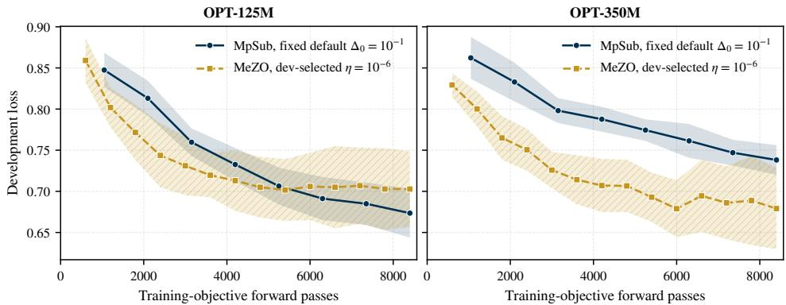
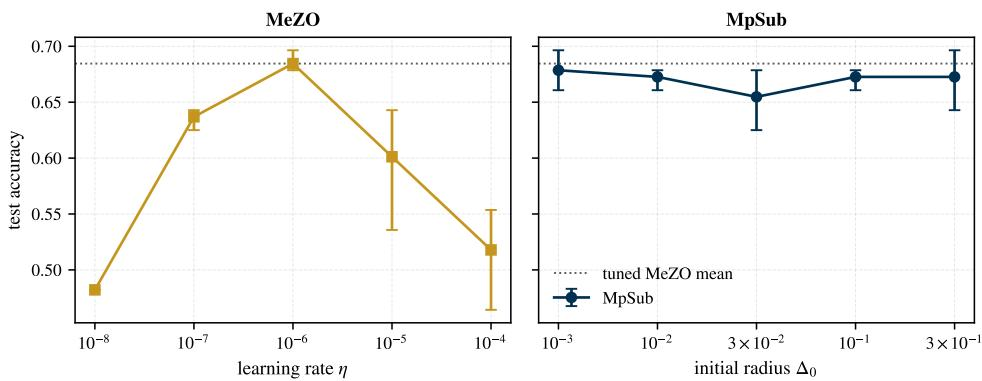

# MPSUB: A MOMENTUM P-DIMENSIONAL SUBSPACE TRUST-REGION METHOD FOR DERIVATIVE-FREE FINE-TUNING OF LARGE LANGUAGE MODELS∗

YUYANG WANG†, HAOYU YAO‡, AND PENGCHENG XIE§

Abstract. Full-parameter fine-tuning of large language models has a substantial memory cost because backpropagation requires storing activations and gradients. Zeroth-order optimization avoids that by estimating update directions from loss evaluations, but existing methods often depend on a learning rate that must be retuned for each model and task. We propose the momentum pdimensional subspace trust-region method (MpSub). At each iteration, MpSub searches within a pdimensional subspace: one direction preserves the historical information carried by the most recent accepted step, while the remaining directions promote exploration through fresh random sampling. The subspace gradient is estimated by central diferences, a trial step is computed from a linear trustregion model, and the trust-region radius is updated according to the agreement between predicted and observed loss reduction. The radius controls both the finite-diference perturbation and the trust-region bound on the subspace step, so no learning rate is required. In the LLM setting, all evaluations within an iteration share one minibatch, and the directions are regenerated from stored seeds and applied in place to the model weights, so training uses forward evaluations alone. For smooth deterministic objectives under Gaussian direction sampling without orthogonalization, we bound the finite-diference error, quantify the gradient captured by the random subspace, and prove that $\| \nabla f ( \pmb { x } _ { k } ) \| _ { 2 }  0$ almost surely under a safeguarded radius update. Under a matched budget of 8,400 training-objective forward passes per configuration, we fine-tune OPT-125M and OPT-350M on CommitmentBank. With the same preset parameters at both model sizes, MpSub attains mean test accuracies of 0.673 and 0.690 over three seeds, while the MeZO configurations selected by development accuracy attain 0.685 at both sizes. These results show that MpSub attains accuracy comparable to tuned MeZO without a learning-rate search.

Key words. derivative-free optimization, subspace trust region, zeroth-order optimization, large language model fine-tuning

AMS subject classifications. 90C56, 65K05, 90C26

1. Introduction. Zeroth-order (ZO) optimization has become an attractive alternative for full-parameter fine-tuning of large language models (LLMs) when backpropagation is limited by memory. Instead of storing activations for a backward pass, ZO methods estimate update directions from function evaluations. MeZO [9] applies the classical two-point random estimator [11] to language models and regenerates random perturbations from seeds rather than storing them. Later methods have modified the perturbation structure, including random low-dimensional subspaces [13] and low-rank gradient structures [4].

These methods still use a prescribed learning rate to determine the update size. Its efective value can vary substantially across settings and may require a separate search. In addition, a single random direction contains only a small amount of directional information in a very high-dimensional parameter space. For a normalized isotropic direction, the typical magnitude of its projection onto a fixed gradient decreases as the dimension grows. This motivates using more than one search direction while avoiding a proportional increase in stored parameter-sized vectors.

Trust-region methods provide a natural way to control the step size without prescribing a learning rate. In derivative-free optimization, the trust-region radius is adjusted according to the agreement between a local model and the observed objective values [1, 7, 5, 6]. Direct model construction in the full parameter space is not practical for models with hundreds of millions of variables, which motivates restricting the search to a much smaller subspace [3, 14, 15]. Randomized subspaces have also been studied in derivative-free optimization [2, 8, 10].

The closest method to the present work is 2D-MoSub [12]. It searches in a twodimensional subspace formed by the previous accepted step and a new search direction. The previous step carries information from the optimization trajectory, while the new direction provides exploration. A quadratic interpolation model is constructed in this two-dimensional subspace and minimized within a trust region. This momentumplus-exploration construction is also the starting point of our method. The dificulty in extending the same approach to a larger subspace lies in the quadratic model: a direct extension to dimension $p$ would require ${ \frac { 1 } { 2 } } ( p + 1 ) ( p + 2 )$ interpolation points. At $p = 2 0$ , this would require 231 points before a trial step is computed.

We therefore consider the LLM fine-tuning problem

$$
\min _ {\pmb {x} \in \mathbb {R} ^ {n}} \mathbb {E} _ {\xi \sim \mathcal {D}} \left[ \ell (\pmb {x}; \xi) \right],\tag{1.1}
$$

and propose MpSub, a momentum p-dimensional subspace trust-region method. MpSub keeps the momentum-plus-exploration structure of 2D-MoSub but replaces quadratic interpolation with directional derivatives estimated by central diferences. These estimates define a linear model in a p-dimensional subspace formed by the most recent accepted displacement and $p - 1$ fresh Gaussian directions. The resulting iteration requires $2 p + 2$ function evaluations, so the evaluation cost grows linearly with the subspace dimension. For LLM fine-tuning, all evaluations within one iteration use the same minibatch, and the random directions are regenerated from seeds when needed rather than stored explicitly.

For smooth deterministic objectives, we analyze the Gaussian directions directly without assuming that they are orthogonal. We derive finite-diference error bounds, quantify the gradient information captured by the random subspace, and show that the gradient norm converges to zero almost surely under a safeguarded trust-region radius update. We then compare MpSub with MeZO on OPT-125M and OPT-350M under the same number of training-objective forward evaluations. The same trustregion settings are used for both model sizes, while the MeZO learning rate is selected separately from a grid.

2. MpSub. We consider the unconstrained optimization problem

$$
\min _ {\boldsymbol {x} \in \mathbb {R} ^ {n}} f (\boldsymbol {x}),\tag{2.1}
$$

in the regime where the parameter dimension n is very large $( \mathrm { e . g . , } n \sim 1 0 ^ { 8 }$ in fullparameter language model fine-tuning) and derivative information is inaccessible. In our numerical experiments (Section 4), f represents the stochastic minibatch loss (1.1) resampled at each iteration, whereas in the theoretical analysis (Section 3), f is treated as a deterministic, continuously diferentiable objective.

At each iteration $k ,$ MpSub maintains the parameter iterate $\pmb { x } _ { k } \in \mathbb { R } ^ { n }$ , a trustregion radius $\Delta _ { k } \in [ \Delta _ { \operatorname* { m i n } } , \Delta _ { \operatorname* { m a x } } ]$ , and a momentum displacement $m _ { k } \in \mathbb { R } ^ { n }$ generated by the most recent accepted step. The radius $\Delta _ { k }$ serves as both the finite-diference sampling scale and the trust-region bound, while $m _ { k }$ spans the historical exploration axis of the subspace. The overall procedure is summarized in Algorithm 2.1.

Algorithm 2.1 MpSub: momentum p-dimensional subspace trust-region method

1: Input. Initial iterate $x_{0} \in R^{n}$ , subspace dimension p, initial radius $\Delta_{0} \in [\Delta_{\min}, \Delta_{\max}]$ , contraction factor $\gamma_{1} \in (0,1)$ , expansion factor $\gamma_{2} > 1$ , bounds $0 < \Delta_{\min} < \Delta_{\max}$ , and threshold $\eta \in (0,1)$ .

2: Initialize momentum vector $m_{0} = 0$ .

3: for $k = 0, 1, 2, \ldots$ do

4: Step 1: Subspace frame construction.

5: If $\|m_{k}\|_{2} > 0$ : set $d_{1}^{(k)} = m_{k}/\|m_{k}\|_{2}$ ; else draw $z_{1} \sim \mathcal{N}(0, I_{n})$ and set $d_{1}^{(k)} = z_{1}/\sqrt{n}$ .

6: For $i = 2, \ldots, p$ : draw $z_{i} \sim \mathcal{N}(0, I_{n})$ independently and set $d_{i}^{(k)} = z_{i}/\sqrt{n}$ .

7: Form the frame matrix $D_{k} = [d_{1}^{(k)}, \ldots, d_{p}^{(k)}] \in R^{n \times p}$ .

8: Step 2: Subspace gradient estimation.

9: Evaluate $f_{0} = f(x_{k})$ .

10: For $i = 1, \ldots, p$ : evaluate $f_{i}^{\pm} = f(x_{k} \pm \Delta_{k} d_{i}^{(k)})$ and set $g_{k,i} = (f_{i}^{+} - f_{i}^{-})/(2\Delta_{k})$ .

11: Assemble the subspace gradient $g_{k} = (g_{k,1}, \ldots, g_{k,p})^{\top}$ .

12: If $\|g_{k}\|_{2} = 0$ : set $\Delta_{k+1} = \max(\gamma_{1}\Delta_{k}, \Delta_{\min})$ , retain $x_{k}$ and $m_{k}$ , and continue.

13: Step 3: Trust-region trial step.

14: Compute $s_{s} = -\Delta_{k} g_{k}/\|g_{k}\|_{2}$ and trial iterate $x^{+} = x_{k} + D_{k}s_{s}$ .

15: Evaluate $f^{+} = f(x^{+})$ , predicted reduction pred $_{k} = \Delta_{k}\|\boldsymbol{g}_{k}\|_{2}$ , and ratio $\rho_{k} = (f_{0} - f^{+})/\text{pred}_{k}$ .

16: Step 4a: Iterate acceptance.

17: if $f^{+} < f_{0}$ then

18: $x_{k+1} = x^{+}$ , $m_{k+1} = x^{+} - x_{k}$ . (accepted)

19: else

20: $x_{k+1} = x_{k}$ , $m_{k+1} = m_{k}$ . (rejected)

21: end if

22: Step 4b: Trust-region radius adaptation.

23: if $\rho_{k} \geq \eta$ then

24: $\Delta_{k+1} = \min(\gamma_{2}\Delta_{k}, \Delta_{\max})$ . (successful)

25: else

26: $\Delta_{k+1} = \max(\gamma_{1}\Delta_{k}, \Delta_{\min})$ . (unsuccessful)

27: end if

28: end for

2.1. Subspace construction. At iteration $k ,$ optimization is restricted to the afine subspace $\pmb { x } _ { k } + \pmb { S } _ { k }$ , where $S _ { k } \subset \mathbb { R } ^ { n }$ is spanned by p direction vectors $d _ { 1 } ^ { ( k ) } , \ldots , d _ { p } ^ { ( k ) }$ Gathering these directions as columns of the frame matrix $D _ { k } = [ \pmb { d } _ { 1 } ^ { ( k ) } , \dots , \pmb { d } _ { p } ^ { ( k ) } ] \in$ $\mathbb { R } ^ { n \times p }$ , candidate displacements within $\scriptstyle { S _ { k } }$ are parameterized by a coordinate vector $\boldsymbol { s } _ { s } \in \mathbb { R } ^ { p }$ via

$$
\pmb {x} (\pmb {s} _ {s}) = \pmb {x} _ {k} + D _ {k} \pmb {s} _ {s} = \pmb {x} _ {k} + \sum_ {i = 1} ^ {p} s _ {s, i} \pmb {d} _ {i} ^ {(k)}.\tag{2.2}
$$

The first search direction $d _ { 1 } ^ { ( k ) }$ incorporates momentum from the optimization trajectory. When an accepted step is available, it is set to the normalized displacement

$$
\pmb {d} _ {1} ^ {(k)} = \frac {\pmb {m} _ {k}}{\| \pmb {m} _ {k} \| _ {2}},\tag{2.3}
$$

where $\mathbf { \nabla } m _ { k }$ denotes the parameter change resulting from the most recent successful step. Because consecutive descent steps in continuous optimization often exhibit directional correlation, retaining (2.3) injects historical progress into the subspace without requiring additional function evaluations. The remaining $p - 1$ directions are drawn independently as

$$
\pmb {d} _ {i} ^ {(k)} = \frac {\pmb {z} _ {i}}{\sqrt {n}}, \qquad \pmb {z} _ {i} \sim \mathcal {N} (\pmb {0}, \pmb {I} _ {n}), \quad i = 2, \ldots , p,\tag{2.4}
$$

with the same distribution supplying $d _ { 1 } ^ { ( k ) }$ when no accepted step is available. The factor $1 / \sqrt { n }$ normalizes the expected Euclidean norm such that $\mathbb { E } \| d _ { i } ^ { ( k ) } \| _ { 2 } ^ { 2 } = 1$ , providing isotropic coverage of the parameter space.

A fundamental geometric property of high-dimensional Gaussian vectors is their near-orthogonality: for $i \neq j$

$$
\mathbb {E} \big [ \pmb {d} _ {i} ^ {(k) \top} \pmb {d} _ {j} ^ {(k)} \big ] = 0 \qquad \mathrm{and} \qquad \mathbb {E} \big [ \big (\pmb {d} _ {i} ^ {(k) \top} \pmb {d} _ {j} ^ {(k)} \big) ^ {2} \big ] = \frac {1}{n}.\tag{2.5}
$$

Consequently, the pairwise inner products have root-mean-square magnitude $n ^ { - 1 / 2 } \approx$ $1 0 ^ { - 4 }$ at $n \sim 1 0 ^ { 8 }$ . Because the Gaussian directions are already nearly orthogonal in high dimensions, explicit Gram–Schmidt orthogonalization is omitted, thereby avoiding substantial computation and memory overhead; the theoretical guarantees of MpSub under this unorthogonalized Gaussian frame are rigorously established in Section 3. The dimension $p$ controls how many directional derivatives enter the subspace model; its choice is examined empirically in Section 4.

2.2. Subspace model and trial step. For each direction $d _ { i } ^ { ( k ) }$ , MpSub estimates the corresponding directional derivative via central diferences:

$$
g _ {k, i} = \frac {f (\boldsymbol {x} _ {k} + \Delta_ {k} \boldsymbol {d} _ {i} ^ {(k)}) - f (\boldsymbol {x} _ {k} - \Delta_ {k} \boldsymbol {d} _ {i} ^ {(k)})}{2 \Delta_ {k}}, \quad i = 1, \ldots , p.\tag{2.6}
$$

Stacking these estimates yields the subspace gradient $\pmb { g } _ { k } = ( g _ { k , 1 } , \ldots , g _ { k , p } ) ^ { \top } \in \mathbb { R } ^ { p }$ 2 where each entry $g _ { k , i }$ approximates $\nabla f ( \pmb { x } _ { k } ) ^ { \top } d _ { i } ^ { ( k ) }$ . Setting the finite-diference perturbation size equal to the trust-region radius $\Delta _ { k }$ couples the sampling resolution directly to the radius of model validity. Under the Lipschitz continuity of $\nabla f .$ , the finite-diference error is bounded linearly by $\Delta _ { k }$ , with explicit bounds established in Lemma 3.2.

The estimated gradient defines a local linear surrogate model on the subspace coordinates:

$$
m _ {k} (\pmb {s} _ {s}) = f (\pmb {x} _ {k}) + \pmb {g} _ {k} ^ {\top} \pmb {s} _ {s}.\tag{2.7}
$$

The trial step is determined by minimizing this linear model subject to the trust-region constraint:

$$
\min _ {\boldsymbol {s} _ {s} \in \mathbb {R} ^ {p}} \boldsymbol {g} _ {k} ^ {\top} \boldsymbol {s} _ {s} \quad \text { subject   to } \quad \| \boldsymbol {s} _ {s} \| _ {2} \leq \Delta_ {k}.\tag{2.8}
$$

Whenever $\mathbf { \nabla } _ { \mathbf { \boldsymbol { g } } _ { k } } \neq \mathbf { 0 }$ , problem (2.8) admits the unique closed-form solution

$$
\pmb {s} _ {s} = - \Delta_ {k} \frac {\pmb {g} _ {k}}{\| \pmb {g} _ {k} \| _ {2}},\tag{2.9}
$$

which corresponds to the steepest descent direction on the trust-region boundary. Mapping $\scriptstyle { s _ { s } }$ back to the ambient parameter space via (2.2) yields the candidate iterate

$$
\pmb {x} ^ {+} = \pmb {x} _ {k} + \pmb {D} _ {k} \pmb {s} _ {s} = \pmb {x} _ {k} - \frac {\Delta_ {k}}{\| \pmb {g} _ {k} \| _ {2}} \sum_ {i = 1} ^ {p} g _ {k, i} \pmb {d} _ {i} ^ {(k)},\tag{2.10}
$$

with the predicted objective reduction given by

$$
\mathrm{pred} _ {k} = m _ {k} (\mathbf {0}) - m _ {k} (\pmb {s} _ {s}) = - \pmb {g} _ {k} ^ {\top} \pmb {s} _ {s} = \Delta_ {k} \| \pmb {g} _ {k} \| _ {2} > 0.\tag{2.11}
$$

If $g _ { k } = \mathbf { 0 }$ , the estimated gradient vanishes across the subspace; in this event, the method contracts the trust-region radius, sets $\pmb { x } _ { k + 1 } \ = \ \pmb { x } _ { k }$ and $\pmb { m } _ { k + 1 } = \pmb { m } _ { k }$ , and proceeds to the next iteration without evaluating an additional trial point.

2.3. Acceptance and radius update. Upon evaluating the candidate loss $f ^ { + } = f ( \pmb { x } ^ { + } )$ , MpSub assesses the agreement between the surrogate model and the objective through the ratio

$$
\rho_ {k} = \frac {f (\pmb {x} _ {k}) - f (\pmb {x} ^ {+})}{\Delta_ {k} \| \pmb {g} _ {k} \| _ {2}}.\tag{2.12}
$$

The algorithm decouples iterate acceptance (Step 4a) from trust-region radius adaptation (Step 4b). The candidate point is accepted whenever it yields a strict objective decrease:

$$
\boldsymbol {x} _ {k + 1} = \left\{ \begin{array}{l l} \boldsymbol {x} ^ {+}, & \text { if } f (\boldsymbol {x} ^ {+}) <   f (\boldsymbol {x} _ {k}), \\ \boldsymbol {x} _ {k}, & \text { otherwise }, \end{array} \right. \quad \boldsymbol {m} _ {k + 1} = \left\{ \begin{array}{l l} \boldsymbol {x} ^ {+} - \boldsymbol {x} _ {k}, & \text { if } f (\boldsymbol {x} ^ {+}) <   f (\boldsymbol {x} _ {k}), \\ \boldsymbol {m} _ {k}, & \text { otherwise }, \end{array} \right.\tag{2.13}
$$

while the trust-region radius is updated according to the ratio test:

$$
\Delta_ {k + 1} = \left\{ \begin{array}{l l} \min \{\gamma_ {2} \Delta_ {k}, \Delta_ {\max} \}, & \text {if} \rho_ {k} \geq \eta , \\ \max \{\gamma_ {1} \Delta_ {k}, \Delta_ {\min} \}, & \text {if} \rho_ {k} <   \eta . \end{array} \right.\tag{2.14}
$$

Unlike classical trust-region methods [5] that accept trial points only when $\rho _ { k } \geq$ $\eta ,$ the rules (2.13)–(2.14) separate acceptance from radius adjustment. In zerothorder settings where forward passes dominate execution time, enforcing $\rho _ { k } \geq \eta$ for step acceptance would discard trial points that achieve objective reduction whenever $0 < f ( \pmb { x } _ { k } ) - f ( \pmb { x } ^ { + } ) < \eta \mathrm { p r e d } _ { k }$ . Under (2.13), every candidate yielding a strictly lower observed loss is retained. Concurrently, the ratio $\rho _ { k }$ regulates the exploration scale: the trust region expands when the linear surrogate reliably predicts the objective reduction $( \rho _ { k } \ge \eta )$ , and contracts when nonlinearities or estimation errors dominate $( \rho _ { k } < \eta )$

2.4. Algorithmic realization for LLM fine-tuning. While Algorithm 2.1 is stated for a generic objective $f ,$ adapting MpSub to full-parameter fine-tuning of large language models presents two critical computational challenges: (i) the training objective is evaluated over stochastic minibatches, and (ii) storing an explicit search frame $\ b { D _ { k } } ~ \in ~ \mathbb { R } ^ { n \times p }$ in an ambient dimension of $n \sim 1 0 ^ { 8 }$ creates prohibitive GPU memory overhead. We resolve these challenges through shared-minibatch evaluations and seed-regenerated in-place parameter perturbations.

2.4.1. Consistent minibatch evaluation. In stochastic language model finetuning, the objective available at training step k is defined by a sampled minibatch $B _ { k } \subset \mathcal { D }$

$$
f _ {k} (\boldsymbol {x}) = \frac {1}{| \mathcal {B} _ {k} |} \sum_ {\xi \in \mathcal {B} _ {k}} \ell (\boldsymbol {x}; \xi).\tag{2.15}
$$

A key algorithmic requirement of trust-region methods is that model-objective agreement measures local landscape geometry rather than data sampling discrepancy. Accordingly, in our implementation, the minibatch $\boldsymbol { B } _ { k }$ is held fixed throughout iteration $k .$ The baseline loss $f _ { k } ( \pmb { x } _ { k } )$ , the $2 p$ central-diference evaluations $f _ { k } ( \pmb { x } _ { k } \pm \Delta _ { k } \pmb { d } _ { i } ^ { ( k ) } )$ ), and the trial evaluation $f _ { k } ( x ^ { + } )$ are all computed on the exact same minibatch $\boldsymbol { B } _ { k }$ . Holding $\boldsymbol { B } _ { k }$ constant ensures that the estimated subspace gradient $\mathbf { \nabla } _ { \mathbf { \mathbf { \mathbf { \mathit { g } } } } _ { k } }$ and the agreement ratio

$$
\rho_ {k} = \frac {f _ {k} (\pmb {x} _ {k}) - f _ {k} (\pmb {x} ^ {+})}{\Delta_ {k} \| \pmb {g} _ {k} \| _ {2}}\tag{2.16}
$$

evaluate variations of a consistent slice of the loss landscape, preventing false rejections or erratic radius oscillations induced by stochastic batch variance.

Across iterations, a fresh minibatch $\boldsymbol { B } _ { k + 1 }$ is drawn from the data loader. The trust-region radius $\Delta _ { k }$ and the accepted parameter displacement $\mathbf { \nabla } m _ { k }$ persist across minibatch boundaries, transferring optimization momentum and step-size calibration smoothly throughout training. Each iteration expends $2 p + 2$ forward passes on the training objective (42 passes when $p = 2 0 )$

2.4.2. In-place perturbations and seed regeneration. Storing the frame matrix $\ b { D } _ { k } \in \mathbb { R } ^ { n \times p }$ explicitly would require pn floating-point numbers. For an LLM such as OPT-125M $( n \approx 1 . 2 5 \times 1 0 ^ { 8 } )$ with $p \ : = \ : 2 0$ in FP32, this would consume approximately 10 GB of GPU memory—exceeding the entire parameter storage of the model itself.

To eliminate this memory overhead, MpSub never materializes the matrix $D _ { k }$ in memory. Instead, each exploratory direction $\pmb { d } _ { i } ^ { ( k ) } \ ( i = 2 , \ldots , p )$ is tied to a deterministic integer seed derived synchronously from the global training seed, the iteration index $k ,$ and the direction index i:

$$
\operatorname{seed} (k, i) = (\text { base\_seed } \times C _ {1} + k \times C _ {2} + i \times C _ {3}) \bmod M,\tag{2.17}
$$

where $C _ { 1 } , C _ { 2 } , C _ { 3 }$ and M are fixed prime constants.

During the subspace gradient estimation phase, direction $d _ { i } ^ { ( k ) }$ is synthesized tensor by tensor directly on the accelerator using a pseudorandom generator initialized with seed $. ( k , i )$ . The parameter tensor is perturbed in place by $+ \Delta _ { k } d _ { i } ^ { ( k ) }$ to evaluate $f _ { k } ( \pmb { x } _ { k } + \Delta _ { k } \pmb { d } _ { i } ^ { ( k ) } )$ , then adjusted by $- 2 \Delta _ { k } d _ { i } ^ { ( k ) }$ to evaluate $f _ { k } ( \pmb { x } _ { k } - \Delta _ { k } \pmb { d } _ { i } ^ { ( k ) } )$ , and finally restored by adding back $+ \Delta _ { k } d _ { i } ^ { ( k ) }$ . Because the pseudorandom generator reproduces the identical sequence upon reseeding, each direction is reconstructed exactly at zero memory cost.

Once the subspace gradient $\mathbf {  { g } } _ { k }$ and the coordinate step $\pmb { s } _ { s } = - \Delta _ { k } \pmb { g } _ { k } / \| \pmb { g } _ { k } \| _ { 2 }$ are computed, the directions are regenerated a final time and combined in place to form the trial displacement

$$
\boldsymbol {u} _ {k} = \sum_ {i = 1} ^ {p} s _ {s, i} \boldsymbol {d} _ {i} ^ {(k)}.\tag{2.18}
$$

The displacement $\mathbf { \Delta } \mathbf { u } _ { k }$ is accumulated in an auxiliary bufer of dimension n while advancing the model weights to ${ \pmb x } ^ { + } = { \pmb x } _ { k } + { \pmb u } _ { k }$ . If the trial step is accepted, ${ \pmb u } _ { k }$ is preserved as the new momentum displacement $m _ { k + 1 } ;$ if rejected, subtracting ${ \pmb u } _ { k }$ immediately restores the base weights $\scriptstyle { \mathbf { { \mathit { x } } } } _ { k }$

Consequently, training is executed exclusively through forward inference passes. Auxiliary storage is strictly confined to the momentum vector $\mathbf { \nabla } m _ { k }$ and a single trial step accumulator, both of size $n ,$ keeping the training memory footprint at the inference level and completely independent of the subspace dimension $p .$

3. Theoretical Analysis. We analyze MpSub for a deterministic objective under the Gaussian direction sampling used in Algorithm 2.1. No orthogonality between the search directions is assumed. The analysis first gives error and descent bounds for a general frame $D _ { k } .$ , and then uses the distribution of the Gaussian directions to obtain a global first-order convergence result.

Throughout this section, we set $\Delta _ { \operatorname* { m i n } } = 0$ for the asymptotic analysis. We also use the following safeguarded radius update with a fixed constant $\kappa > 0$ :

$$
\Delta_ {k + 1} = \left\{ \begin{array}{l l} \min \{\gamma_ {2} \Delta_ {k}, \Delta_ {\max} \}, & \text { if } \rho_ {k} \geq \eta \text { and } \| \boldsymbol {g} _ {k} \| _ {2} \geq \kappa \Delta_ {k}, \\ \gamma_ {1} \Delta_ {k}, & \text { otherwise }. \end{array} \right.\tag{3.1}
$$

The acceptance rule is unchanged: a trial point is accepted whenever it gives a strict decrease in $f .$

Assumption 3.1. The objective function $f : \mathbb { R } ^ { n }  \mathbb { R }$ is continuously diferentiable and bounded below. Its gradient is Lipschitz continuous with constant $L > 0 .$

$$
\left\| \nabla f (\boldsymbol {x}) - \nabla f (\boldsymbol {y}) \right\| _ {2} \leq L \| \boldsymbol {x} - \boldsymbol {y} \| _ {2}, \quad \forall \boldsymbol {x}, \boldsymbol {y} \in \mathbb {R} ^ {n}.\tag{3.2}
$$

Let $D _ { k } = [ \pmb { d } _ { 1 } ^ { ( k ) } , \dots , \pmb { d } _ { p } ^ { ( k ) } ] \in \mathbb { R } ^ { n \times p }$ be the frame generated at iteration $k ,$ and define the exact directional derivatives

$$
\hat {g} _ {k, i} := \nabla f (\boldsymbol {x} _ {k}) ^ {\top} \boldsymbol {d} _ {i} ^ {(k)}, \quad \hat {\boldsymbol {g}} _ {k} := \boldsymbol {D} _ {k} ^ {\top} \nabla f (\boldsymbol {x} _ {k}).
$$

The finite-diference estimates are denoted by

$$
\boldsymbol {g} _ {k} = \left(g _ {k, 1}, \dots , g _ {k, p}\right) ^ {\top}, \quad g _ {k, i} = \frac {f \left(\boldsymbol {x} _ {k} + \Delta_ {k} \boldsymbol {d} _ {i} ^ {(k)}\right) - f \left(\boldsymbol {x} _ {k} - \Delta_ {k} \boldsymbol {d} _ {i} ^ {(k)}\right)}{2 \Delta_ {k}}.
$$

3.1. Finite diferences and random subspaces. We first bound the finitediference error without assuming that the directions have unit norm.

Lemma 3.2 (Finite-diference error). Suppose Assumption 3.1 holds. Then

$$
\left| g _ {k, i} - \hat {g} _ {k, i} \right| \leq \frac {L \Delta_ {k}}{2} \| \boldsymbol {d} _ {i} ^ {(k)} \| _ {2} ^ {2}, \quad i = 1, \dots , p.\tag{3.3}
$$

Consequently,

$$
\| \boldsymbol {g} _ {k} - \hat {\boldsymbol {g}} _ {k} \| _ {2} \leq \frac {L \Delta_ {k}}{2} Q _ {k}, \quad Q _ {k} := \left(\sum_ {i = 1} ^ {p} \| \boldsymbol {d} _ {i} ^ {(k)} \| _ {2} ^ {4}\right) ^ {1 / 2}.\tag{3.4}
$$

Proof. For any direction d and $t > 0$ , Lipschitz continuity of the gradient gives

$$
\left| f (\boldsymbol {x} _ {k} + t \boldsymbol {d}) - f (\boldsymbol {x} _ {k}) - t \nabla f (\boldsymbol {x} _ {k}) ^ {\top} \boldsymbol {d} \right| \leq \frac {L}{2} t ^ {2} \| \boldsymbol {d} \| _ {2} ^ {2}.
$$

Applying this bound to $t = \Delta _ { k }$ in the directions $d _ { i } ^ { ( k ) }$ and $- d _ { i } ^ { ( k ) }$ , write

$$
f (\pmb {x} _ {k} + \Delta_ {k} \pmb {d} _ {i} ^ {(k)}) = f (\pmb {x} _ {k}) + \Delta_ {k} \hat {g} _ {k, i} + R _ {i, +},
$$

and

$$
f (\pmb {x} _ {k} - \Delta_ {k} \pmb {d} _ {i} ^ {(k)}) = f (\pmb {x} _ {k}) - \Delta_ {k} \hat {g} _ {k, i} + R _ {i, -},
$$

where $\begin{array} { r } { | R _ { i , \pm } | \leq \frac { L \Delta _ { k } ^ { 2 } } { 2 } \| d _ { i } ^ { ( k ) } \| _ { 2 } ^ { 2 } } \end{array}$ . Subtracting the two expressions gives

$$
g _ {k, i} - \hat {g} _ {k, i} = \frac {R _ {i , +} - R _ {i , -}}{2 \Delta_ {k}},
$$

which proves (3.3). Summing the squared componentwise bounds gives (3.4). □

If the Hessian is Lipschitz continuous with constant $M .$ , the same central-diference argument gives the sharper bound

$$
| g _ {k, i} - \hat {g} _ {k, i} | \leq \frac {M \Delta_ {k} ^ {2}}{6} \| \pmb {d} _ {i} ^ {(k)} \| _ {2} ^ {3}.
$$

This stronger estimate is not needed below.

We next use the actual Gaussian sampling in Algorithm 2.1. Let $\mathcal { F } _ { k }$ contain the algorithmic history before the fresh exploratory directions at iteration k are sampled. Conditionally on $\mathcal { F } _ { k }$

$$
\boldsymbol {d} _ {i} ^ {(k)} = \frac {\boldsymbol {z} _ {i}}{\sqrt {n}}, \qquad \boldsymbol {z} _ {i} \sim \mathcal {N} (\boldsymbol {0}, \boldsymbol {I} _ {n}), \qquad i = 2, \ldots , p,
$$

independently.

Lemma 3.3 (Gaussian gradient capture). Let ${ \pmb v } _ { k } = \nabla f ( { \pmb x } _ { k } )$ . Conditionally on $\mathcal { F } _ { k }$

$$
\sum_ {i = 2} ^ {p} \left(\boldsymbol {v} _ {k} ^ {\top} \boldsymbol {d} _ {i} ^ {(k)}\right) ^ {2} \stackrel {{d}} {{=}} \frac {\| \boldsymbol {v} _ {k} \| _ {2} ^ {2}}{n} \chi_ {p - 1} ^ {2}.\tag{3.5}
$$

In particular,

$$
\mathbb {E} \left[ \sum_ {i = 2} ^ {p} \left(\boldsymbol {v} _ {k} ^ {\top} \boldsymbol {d} _ {i} ^ {(k)}\right) ^ {2} \mid \mathcal {F} _ {k} \right] = \frac {p - 1}{n} \| \boldsymbol {v} _ {k} \| _ {2} ^ {2}.\tag{3.6}
$$

Moreover, for every $q \in ( 0 , 1 )$ , there exist constants $\alpha > 0$ and $R > 1$ , independent of $k ,$ such that whenever $\pmb { v } _ { k } \neq \mathbf { 0 }$ 2

$$
\mathbb {P} \left(\| \hat {\boldsymbol {g}} _ {k} \| _ {2} \geq \alpha \| \boldsymbol {v} _ {k} \| _ {2}, \max _ {1 \leq i \leq p} \| \boldsymbol {d} _ {i} ^ {(k)} \| _ {2} \leq R   \Big |   \mathcal {F} _ {k}\right) \geq q.\tag{3.7}
$$

Proof. For every $i = 2 , \ldots , p ,$

$$
\boldsymbol {v} _ {k} ^ {\top} \boldsymbol {d} _ {i} ^ {(k)} = \frac {\boldsymbol {v} _ {k} ^ {\top} \boldsymbol {z} _ {i}}{\sqrt {n}} \sim \mathcal {N} \left(0, \frac {\| \boldsymbol {v} _ {k} \| _ {2} ^ {2}}{n}\right),
$$

and these random variables are conditionally independent. Equation (3.5) follows immediately, and taking expectations gives (3.6).

To prove (3.7), fix $q < 1$ . Since a $\chi _ { p - 1 } ^ { 2 }$ random variable is positive almost surely, we can choose $\tau > 0$ suficiently small that $\mathbb { P } ( \chi _ { p - 1 } ^ { 2 } \ge \tau )$ is arbitrarily close to one. Setting $\alpha = \sqrt { \tau / n }$ , equation (3.5) implies

$$
\left(\sum_ {i = 2} ^ {p} \left(\boldsymbol {v} _ {k} ^ {\top} \boldsymbol {d} _ {i} ^ {(k)}\right) ^ {2}\right) ^ {1 / 2} \geq \alpha \| \boldsymbol {v} _ {k} \| _ {2}
$$

with probability arbitrarily close to one.

The Gaussian norms $\| z _ { i } \| _ { 2 } / { \sqrt { n } }$ are finite almost surely, so R can also be chosen suficiently large that all newly sampled directions have norm at most R with probability arbitrarily close to one. The momentum direction, when present, has norm one. A union bound then gives (3.7). □

The next result gives the decrease produced by the trial step for a general, possibly nonorthogonal frame.

Proposition 3.4 (Decrease for a general frame). Suppose Assumption 3.1 holds and $\mathbf { \nabla } _ { \mathbf { \boldsymbol { g } } _ { k } } \neq \mathbf { 0 }$ . Let

$$
\boldsymbol {s} _ {k} = - \Delta_ {k} \frac {\boldsymbol {g} _ {k}}{\| \boldsymbol {g} _ {k} \| _ {2}}, \quad \boldsymbol {x} _ {k} ^ {+} = \boldsymbol {x} _ {k} + \boldsymbol {D} _ {k} \boldsymbol {s} _ {k},
$$

and define $\beta _ { k } : = \| D _ { k } \| _ { 2 }$ . Then

$$
f (\boldsymbol {x} _ {k}) - f (\boldsymbol {x} _ {k} ^ {+}) \geq \Delta_ {k} \| \boldsymbol {g} _ {k} \| _ {2} - \frac {L \Delta_ {k} ^ {2}}{2} (Q _ {k} + \beta_ {k} ^ {2}).\tag{3.8}
$$

Consequently,

$$
\rho_ {k} \geq 1 - \frac {L \Delta_ {k} (Q _ {k} + \beta_ {k} ^ {2})}{2 \| \boldsymbol {g} _ {k} \| _ {2}}.\tag{3.9}
$$

Proof. Let $\pmb { h } _ { k } = \pmb { D } _ { k } \pmb { s } _ { k }$ . Since $\hat { \pmb { g } } _ { k } = \pmb { D } _ { k } ^ { \top } \nabla f ( \pmb { x } _ { k } )$ , we have $\nabla f ( \pmb { x } _ { k } ) ^ { \top } \pmb { h } _ { k } = \hat { \pmb { g } } _ { k } ^ { \top } \pmb { s } _ { k }$ Using $\pmb { g } _ { k } ^ { \top } \pmb { s } _ { k } = - \Delta _ { k } \| \pmb { g } _ { k } \| _ { 2 }$ and Lemma 3.2,

$$
\begin{array}{r l} \nabla f (\boldsymbol {x} _ {k}) ^ {\top} \boldsymbol {h} _ {k} & = \boldsymbol {g} _ {k} ^ {\top} \boldsymbol {s} _ {k} + (\hat {\boldsymbol {g}} _ {k} - \boldsymbol {g} _ {k}) ^ {\top} \boldsymbol {s} _ {k} \\ & \leq - \Delta_ {k} \| \boldsymbol {g} _ {k} \| _ {2} + \| \hat {\boldsymbol {g}} _ {k} - \boldsymbol {g} _ {k} \| _ {2} \| \boldsymbol {s} _ {k} \| _ {2} \\ & \leq - \Delta_ {k} \| \boldsymbol {g} _ {k} \| _ {2} + \frac {L Q _ {k}}{2} \Delta_ {k} ^ {2}. \end{array}
$$

Also, $\| \pmb { h } _ { k } \| _ { 2 } \le \| \pmb { D } _ { k } \| _ { 2 } \| \pmb { s } _ { k } \| _ { 2 } = \beta _ { k } \Delta _ { k }$ . The descent lemma therefore gives

$$
\begin{array}{l} f (\boldsymbol {x} _ {k} ^ {+}) \leq f (\boldsymbol {x} _ {k}) + \nabla f (\boldsymbol {x} _ {k}) ^ {\top} \boldsymbol {h} _ {k} + \frac {L}{2} \| \boldsymbol {h} _ {k} \| _ {2} ^ {2} \\ \qquad \qquad \qquad \qquad \qquad \qquad \qquad \qquad \qquad \qquad \qquad \qquad \qquad \qquad \qquad \qquad \qquad \qquad \qquad \qquad \qquad \qquad \qquad \qquad \qquad \qquad \qquad \qquad \qquad \qquad \qquad \qquad \qquad \qquad \\ \qquad \qquad \qquad \qquad \qquad \qquad \qquad \qquad \qquad \qquad \qquad \qquad \qquad \qquad \qquad \qquad \qquad \qquad \qquad \qquad \qquad \qquad \qquad \qquad \qquad \qquad \qquad \qquad \qquad \qquad \qquad \qquad \qend{array}
$$

which proves (3.8). Dividing by the predicted reduction $\Delta _ { k } \lVert g _ { k } \rVert _ { 2 }$ gives (3.9). □

3.2. Global convergence. We first establish a summability property of the trust-region radius. Let

$$
\mathcal {S} := \{k: \rho_ {k} \geq \eta \text {and} \| \boldsymbol {g} _ {k} \| _ {2} \geq \kappa \Delta_ {k} \}\tag{3.10}
$$

denote the set of iterations at which the trust-region radius is expanded.

Lemma 3.5 (Summability of the trust-region radii). Suppose Assumption 3.1 holds, $\Delta _ { \operatorname* { m i n } } = 0$ , and the radius is updated according to (3.1). Then

$$
\sum_ {k = 0} ^ {\infty} \Delta_ {k} ^ {2} <   \infty .\tag{3.11}
$$

In particular,

$$
\lim _ {k \to \infty} \Delta_ {k} = 0.\tag{3.12}
$$

Proof. For any $k \in S .$ , the definition of $\rho _ { k }$ and (3.10) give

$$
f (\pmb {x} _ {k}) - f (\pmb {x} _ {k} ^ {+}) = \rho_ {k} \Delta_ {k} \| \pmb {g} _ {k} \| _ {2} \geq \eta \kappa \Delta_ {k} ^ {2}.
$$

Since the right-hand side is strictly positive, the trial point is accepted. Because $f$ is bounded below by a finite constant $f _ { \mathrm { l o w } }$ , summing over all successful expansion steps yields

$$
\sum_ {k \in \mathcal {S}} \Delta_ {k} ^ {2} \leq \frac {f (\boldsymbol {x} _ {0}) - f _ {\mathrm{low}}}{\eta \kappa} <   \infty .
$$

For every iteration $k ,$ the update rule (3.1) implies

$$
\Delta_ {k + 1} ^ {2} \leq \gamma_ {1} ^ {2} \Delta_ {k} ^ {2} + \gamma_ {2} ^ {2} \Delta_ {k} ^ {2} \mathbf {1} _ {\{k \in \mathcal {S} \}}.
$$

Summing this inequality from $k = 0$ to N yields

$$
(1 - \gamma_ {1} ^ {2}) \sum_ {k = 1} ^ {N} \Delta_ {k} ^ {2} + \Delta_ {N + 1} ^ {2} \leq \gamma_ {1} ^ {2} \Delta_ {0} ^ {2} + \gamma_ {2} ^ {2} \sum_ {k \in \mathcal {S}} \Delta_ {k} ^ {2}.
$$

Because $\gamma _ { 1 } \in ( 0 , 1 )$ , we have $1 - \gamma _ { 1 } ^ { 2 } > 0$ . Taking $N  \infty$ establishes (3.11), which directly implies lim $\ O _ { k \to \infty } \Delta _ { k } = 0$ □

We next establish that the full gradient cannot remain bounded away from zero along any infinite subsequence.

Theorem 3.6 (Subsequential convergence). Suppose Assumption 3.1 holds and $p \geq 2$ . Let the exploratory directions be sampled independently as

$$
\boldsymbol {d} _ {i} ^ {(k)} = \frac {\boldsymbol {z} _ {i}}{\sqrt {n}}, \qquad \boldsymbol {z} _ {i} \sim \mathcal {N} (\boldsymbol {0}, \boldsymbol {I} _ {n}), \qquad i = 2, \dots , p.
$$

Then

$$
\liminf _ {k \to \infty} \| \nabla f (\boldsymbol {x} _ {k}) \| _ {2} = 0 \qquad a l m o s t s u r e l y.\tag{3.13}
$$

Proof. Suppose, to the contrary, that there exist $\varepsilon > 0$ and an index $K _ { 0 }$ such that

$$
\| \nabla f (\boldsymbol {x} _ {k}) \| _ {2} \geq \varepsilon , \quad \forall k \geq K _ {0}.\tag{3.14}
$$

Choose a probability threshold

$$
q > \max \left\{\frac {1}{2}, \frac {\log (1 / \gamma_ {1})}{\log (\gamma_ {2} / \gamma_ {1})} \right\}.\tag{3.15}
$$

By Lemma 3.3, there exist constants $\alpha > 0$ and $R > 1$ such that the event

$$
G _ {k} := \left\{\| \hat {\boldsymbol {g}} _ {k} \| _ {2} \geq \alpha \| \nabla f (\boldsymbol {x} _ {k}) \| _ {2}, \quad \max _ {1 \leq i \leq p} \| \boldsymbol {d} _ {i} ^ {(k)} \| _ {2} \leq R \right\}
$$

satisfies $\mathbb { P } ( G _ { k } \mid \mathcal { F } _ { k } ) \ge q$ . On $G _ { k }$ , we have $Q _ { k } \le { \sqrt { p } } R ^ { 2 }$ and $\| D _ { k } \| _ { 2 } ^ { 2 } \le p R ^ { 2 }$ . Applying Lemma 3.2 under (3.14) gives

$$
\| \pmb {g} _ {k} \| _ {2} \geq \| \hat {\pmb {g}} _ {k} \| _ {2} - \| \pmb {g} _ {k} - \hat {\pmb {g}} _ {k} \| _ {2} \geq \alpha \varepsilon - \frac {L \sqrt {p} R ^ {2}}{2} \Delta_ {k}.
$$

Since $\Delta _ { k }  0$ by Lemma 3.5, for all suficiently large k we have

$$
\left\| \boldsymbol {g} _ {k} \right\| _ {2} \geq \frac {\alpha \varepsilon}{2}.\tag{3.16}
$$

Proposition 3.4 then ensures that, on $G _ { k }$ and for all suficiently large $k ,$

$$
\rho_ {k} \geq \eta \quad \text { and } \quad \| \boldsymbol {g} _ {k} \| _ {2} \geq \kappa \Delta_ {k}.
$$

Consequently, every occurrence of $G _ { k }$ for suficiently large k produces $\Delta _ { k + 1 } = \gamma _ { 2 } \Delta _ { k }$ 2 while on the remaining iterations $\Delta _ { k + 1 } \geq \gamma _ { 1 } \Delta _ { k }$ .

Let $I _ { k } : = \mathbf { 1 } _ { G _ { k } }$ . For all suficiently large $k ,$

$$
\log \Delta_ {k + 1} - \log \Delta_ {k} \geq I _ {k} \log \gamma_ {2} + (1 - I _ {k}) \log \gamma_ {1}.\tag{3.17}
$$

Since $\mathbb { E } [ I _ { k } \ | \ \mathcal { F } _ { k } ] \ge q$ , the strong law of large numbers for bounded martingale diferences implies

$$
\operatorname * {l i m i n f} _ {N \to \infty} \frac {1}{N} \sum_ {k = K} ^ {K + N - 1} I _ {k} \geq q \quad \text { almost   surely. }
$$

Averaging (3.17) over N steps therefore yields

$$
\operatorname * {l i m i n f} _ {N \to \infty} \frac {\log \Delta_ {K + N} - \log \Delta_ {K}}{N} \geq q \log \gamma_ {2} + (1 - q) \log \gamma_ {1} > 0 \quad \text { almost   surely },
$$

where the strict inequality follows from (3.15). This implies $\Delta _ { k } \to \infty$ , contradicting $\Delta _ { k }  0$ from Lemma 3.5. Thus (3.14) cannot hold, establishing (3.13). □

To strengthen the convergence guarantee from subsequential convergence to the convergence of the full gradient sequence, fix any $\varepsilon > 0$ and define the index set of large gradients:

$$
\mathcal {K} _ {\varepsilon} := \left\{k: \| \nabla f (\boldsymbol {x} _ {k}) \| _ {2} > \varepsilon \right\}.\tag{3.18}
$$

Lemma 3.7. Under the assumptions of Theorem 3.6, for every $\varepsilon > 0$

$$
\sum_ {k \in \mathcal {K} _ {\varepsilon}} \Delta_ {k} <   \infty \quad \text {   almost   surely.   }\tag{3.19}
$$

Proof. Choose the good-frame event $G _ { k }$ as in the proof of Theorem 3.6 with conditional probability $q > 1 / 2$ . Because $\Delta _ { k }  0$ , whenever $k \in \mathcal { K } _ { \varepsilon } \cap G _ { k }$ and k is suficiently large, we have $\| \pmb { g } _ { k } \| _ { 2 } \ge \frac { \alpha \varepsilon } { 2 }$ and $\rho _ { k } \geq \eta .$ . Consequently,

$$
f (\pmb {x} _ {k}) - f (\pmb {x} _ {k + 1}) \geq \frac {\eta \alpha \varepsilon}{2} \Delta_ {k}.
$$

Because $f$ is bounded below, summing this decrease over all such iterations gives

$$
\sum_ {k \in \mathcal {K} _ {\varepsilon} \cap G _ {k}} \Delta_ {k} <   \infty .
$$

Since the conditioning events $G _ { k }$ satisfy $\mathbb { P } ( G _ { k } \mid \mathcal { F } _ { k } ) \ge q > 1 / 2$ uniformly, applying the standard renewal property for probabilistically accurate models along the index subsequence $\kappa _ { \varepsilon }$ implies that the sum over the entire set $\kappa _ { \varepsilon }$ is finite:

$$
\sum_ {k \in \mathcal {K} _ {\varepsilon}} \Delta_ {k} <   \infty \quad \text { almost   surely. }
$$

Let $\beta _ { k } : = \| D _ { k } \| _ { 2 }$ . For the Gaussian frame construction in Algorithm 2.1, the spectral norm satisfies

$$
\sup _ {k} \mathbb {E} [ \beta_ {k} \mid \mathcal {F} _ {k} ] <   \infty \qquad \text { and } \qquad \sup _ {k} \mathbb {E} [ \beta_ {k} ^ {2} \mid \mathcal {F} _ {k} ] <   \infty .
$$

Together with Lemmas 3.5 and 3.7, these moment bounds imply

$$
\lim _ {k \to \infty} \beta_ {k} \Delta_ {k} = 0 \quad \text { almost   surely },\tag{3.20}
$$

and, for every $\varepsilon > 0$

$$
\sum_ {k \in \mathcal {K} _ {\varepsilon}} \beta_ {k} \Delta_ {k} <   \infty \quad \text { almost   surely. }\tag{3.21}
$$

Theorem 3.8 (Global convergence). Under the assumptions of Theorem ${ \it 3 . 6 , }$

$$
\lim _ {k \to \infty} \| \nabla f (\boldsymbol {x} _ {k}) \| _ {2} = 0 \quad \text {   almost   surely.   }\tag{3.22}
$$

Proof. Suppose, for contradiction, that (3.22) does not hold. In view of Theorem $3 . 6 ,$ there then exists $\varepsilon > 0$ and infinitely many disjoint pairs of indices $a _ { j } < b _ { j }$ such that

$$
\| \nabla f (\boldsymbol {x} _ {a _ {j}}) \| _ {2} \leq \varepsilon , \quad \| \nabla f (\boldsymbol {x} _ {b _ {j}}) \| _ {2} > 2 \varepsilon ,
$$

while

$$
\| \nabla f (\boldsymbol {x} _ {k}) \| _ {2} > \varepsilon , \quad \forall a _ {j} <   k <   b _ {j}.
$$

$\mathrm { B y }$ the Lipschitz continuity of the gradient (Assumption 3.1),

$$
\varepsilon <   \| \nabla f (\boldsymbol {x} _ {b _ {j}}) \| _ {2} - \| \nabla f (\boldsymbol {x} _ {a _ {j}}) \| _ {2} \leq L \sum_ {k = a _ {j}} ^ {b _ {j} - 1} \| \boldsymbol {x} _ {k + 1} - \boldsymbol {x} _ {k} \| _ {2}.
$$

Since $\| { \pmb x } _ { k + 1 } - { \pmb x } _ { k } \| _ { 2 } \leq \| { \pmb D } _ { k } { \pmb s } _ { s } \| _ { 2 } \leq \beta _ { k } \Delta _ { k }$ , we can partition the summation as

$$
\sum_ {k = a _ {j}} ^ {b _ {j} - 1} \| \boldsymbol {x} _ {k + 1} - \boldsymbol {x} _ {k} \| _ {2} \leq \beta_ {a _ {j}} \Delta_ {a _ {j}} + \sum_ {k = a _ {j} + 1} ^ {b _ {j} - 1} \beta_ {k} \Delta_ {k}.
$$

As $j  \infty ,$ , the first term $\beta _ { a _ { j } } \Delta _ { a _ { j } } \to 0$ almost surely by (3.20). Furthermore, all intermediate indices $k \in \{ a _ { j } + 1 , \ldots , b _ { j } - 1 \}$ belong to $\kappa _ { \varepsilon }$ . Because $\begin{array} { r } { \sum _ { k \in \mathcal { K } _ { \varepsilon } } \beta _ { k } \Delta _ { k } < } \end{array}$ ∞ almost surely by (3.21), the tail sum $\begin{array} { r } { \sum _ { k = a _ { j } + 1 } ^ { b _ { j } - 1 } \beta _ { k } \Delta _ { k } } \end{array}$ tends to zero as $j  \infty$ Consequently, the entire right-hand side converges to zero, which contradicts the strict lower bound $\varepsilon > 0$

Therefore, (3.22) holds almost surely.

Theorem 3.8 establishes almost-sure first-order global convergence for a fixed deterministic objective. In our LLM fine-tuning experiments, minibatches change across iterations, so asymptotic convergence to a stationary point of the population loss is not claimed.

4. Numerical Experiments. We evaluate MpSub on full-parameter fine-tuning of causal language models, comparing against the zeroth-order optimizer MeZO [9] under matched computational budgets. We also examine step-size sensitivity and the efect of the subspace dimension.

4.1. Experimental setup. Experiments are conducted on CommitmentBank (CB) from the SuperGLUE benchmark, a three-class natural language inference task. Following [9], we use 100 training examples, 50 validation examples, and the 56- example validation split as the test set. We evaluate two autoregressive models from the OPT family: OPT-125M $( n \approx 1 . 2 5 \times 1 0 ^ { 8 }$ parameters) and OPT-350M (n ≈ $3 . 5 \times 1 0 ^ { 8 }$ parameters). All parameters are stored and optimized in FP32 with a batch size of 8. Results are averaged over three random seeds, with min–max ranges reported.

Because zeroth-order methods do not compute gradients, computational cost is measured by the total number of forward passes on the training objective. Each method is allotted a budget of 8,400 forward passes. For MpSub with $p = 2 0$ , which takes 200 optimization steps, each iteration requires $2 p + 2 = 4 2$ evaluations. MeZO uses 2 evaluations per step, therefore taking 4,200 steps. Periodic development evaluations are recorded separately and excluded from this budget.

MpSub uses the same fixed hyperparameters across both models: $p = 2 0$ , initial radius $\Delta _ { 0 } = 1 0 ^ { - 1 }$ , contraction factor $\gamma _ { 1 } = 0 . 5$ , expansion factor $\gamma _ { 2 } = 2 . 0$ , success threshold $\eta = 0 . 1 , \Delta _ { \mathrm { m i n } } = 1 0 ^ { - 1 2 }$ , and $\Delta _ { \mathrm { m a x } } = 1 . 0$ . For MeZO, the perturbation scale is $\epsilon = 1 0 ^ { - 3 }$ , and the learning rate ηM is selected by development accuracy over a grid: $\{ 1 0 ^ { - 8 } , 1 0 ^ { - 7 } , 1 0 ^ { - 6 } , 1 0 ^ { - 5 } , 1 0 ^ { - 4 } \}$ on OPT-125M and $\{ 1 0 ^ { - 7 } , \bar { 1 0 } ^ { - 6 } , 1 0 ^ { - 5 } \}$ on OPT-350M.

4.2. Matched-budget comparison. Table 4.1 reports test and development accuracy across three random seeds under the common budget of 8,400 forward passes.

On OPT-125M, MpSub with the default radius $\Delta _ { 0 } = 1 0 ^ { - 1 }$ achieves a mean development accuracy of 0.773 and a development loss of 0.674, compared to 0.760 and 0.703 for MeZO, while test accuracies are similar (0.673 versus 0.685). On OPT-350M, MpSub achieves a mean test accuracy of 0.690 and development accuracy of 0.787, compared to 0.685 and 0.780 for MeZO. MpSub attains these results with the same preset parameters on both models.

Figure 4.1 shows development loss as a function of forward passes. Though early in training MeZO decreases the loss rapidly, its progress gradually becomes slower.

Table 4.1

Matched-budget fine-tuning results on CommitmentBank (8,400 forward passes). Values are means over three random seeds, with min–max ranges in parentheses. The MeZO learning rate is selected by mean development accuracy.

<table><tr><td>Model</td><td>Method</td><td>Dev loss</td><td>Dev acc.</td><td>Test acc.</td></tr><tr><td rowspan="2">OPT-125M</td><td>MpSub (<eq>\Delta_0 = 10^{-1}</eq>)</td><td>0.674(0.620–0.723)</td><td>0.773(0.740–0.820)</td><td>0.673(0.661–0.679)</td></tr><tr><td>MeZO (<eq>\eta_M = 10^{-6}</eq>)</td><td>0.703(0.625–0.784)</td><td>0.760(0.740–0.800)</td><td>0.685(0.679–0.696)</td></tr><tr><td rowspan="2">OPT-350M</td><td>MpSub (<eq>\Delta_0 = 10^{-1}</eq>)</td><td>0.738(0.715–0.774)</td><td>0.787(0.760–0.820)</td><td>0.690(0.679–0.714)</td></tr><tr><td>MeZO (<eq>\eta_M = 10^{-6}</eq>)</td><td>0.679(0.582–0.743)</td><td>0.780(0.720–0.880)</td><td>0.685(0.679–0.696)</td></tr></table>

Fig. 4.1. Development loss versus training forward passes for OPT-125M (left) and $O P T _ { - }$ 350M (right). Shaded bands represent ±1 standard error of the mean across three random seeds.

In contrast, MpSub uses the momentum direction together with $p - 1$ random search directions. This leads to a steady decrease in development loss and a lower final development loss on OPT-125M.

4.3. Step-size sensitivity. Figure 4.2 compares the sensitivity of MeZO across learning rates against MpSub across initial radii $\bar { \Delta } _ { 0 } \in \{ 1 0 ^ { - 3 } , 1 0 ^ { - 2 } , 3 \times 1 0 ^ { - 2 } , 1 0 ^ { - 1 } , 3 \times$ $1 0 ^ { - 1 } \}$ on OPT-125M.

MeZO depends strongly on the learning rate: shifting $\eta _ { \mathrm { M } }$ by one order of magnitude from the best rate $( 1 0 ^ { - 6 } )$ drops mean test accuracy by 0.048 at $1 0 ^ { - 7 }$ and by 0.084 at $1 0 ^ { - 5 }$ , while rates outside this range yield poor results. Finding an efective learning rate for MeZO thus required evaluating multiple configurations (42,000 forward passes across five rates on OPT-125M, and 25,200 passes across three rates on OPT-350M).

By contrast, MpSub maintains a stable performance plateau across the entire tested initial-radius range: mean test accuracy consistently hovers between 0.655 and 0.678 across all five values of $\Delta _ { 0 }$ from $1 0 ^ { - 3 }$ to $3 \times 1 0 ^ { - 1 }$ (a 300-fold span). This robustness illustrates the self-calibrating nature of the trust-region radius: even when initialized conservatively at $\Delta _ { 0 } = 1 0 ^ { - 3 }$ , successful trial steps $( \rho _ { k } \ge \eta )$ prompt the expansion factor $\gamma _ { 2 } = 2 . 0$ to double $\Delta _ { k }$ iteratively during the opening iterations, swiftly navigating the step size toward the efective operating scale. As a result, the default setting $\Delta _ { 0 } = 1 0 ^ { - 1 }$ delivers competitive performance on both OPT-125M and OPT-350M

Fig. 4.2. Step-size sensitivity on OPT-125M under 8,400 forward passes. Left: $M e Z O$ test accuracy across learning rates $\eta _ { \mathrm { M } }$ . Right: MpSub test accuracy across initial radii $\Delta _ { 0 } .$

without an initial parameter sweep.

4.4. Efect of the subspace dimension. Table 4.2 examines the efect of varying the subspace dimension $p \in \{ 5 , 1 0 , 1 5 , 2 0 , 2 5 , 3 0 \}$ on OPT-125M over 100 iterations.

Table 4.2

Ablation on subspace dimension p for $O P T - 1 2 5 M$ (CommitmentBank, 100 steps, $\Delta _ { 0 } = 1 0 ^ { - 1 }$ single seed). Forward passes per step equal 2p + 2; run times measured on an NVIDIA RTX 4060 $T i \stackrel { \cdot } { G P U }$

<table><tr><td>p</td><td>Forward passes / step</td><td>Dev acc.</td><td>Test acc.</td><td>Time / step (s)</td></tr><tr><td>5</td><td>12</td><td>0.70</td><td>0.643</td><td>3.0</td></tr><tr><td>10</td><td>22</td><td>0.72</td><td>0.661</td><td>4.4</td></tr><tr><td>15</td><td>32</td><td>0.74</td><td>0.661</td><td>6.0</td></tr><tr><td>20</td><td>42</td><td>0.78</td><td>0.679</td><td>7.7</td></tr><tr><td>25</td><td>52</td><td>0.78</td><td>0.679</td><td>8.7</td></tr><tr><td>30</td><td>62</td><td>0.76</td><td>0.661</td><td>10.1</td></tr></table>

As p increases from 5 to 20, development accuracy rises from 0.70 to 0.78 and test accuracy from 0.643 to 0.679, which is consistent with the increase in captured gradient energy described in Lemma 3.3. Beyond $p = 2 0 .$ , the accuracy no longer improves in this experiment, while both the number of forward passes per step and the measured per-step latency continue to increase. In particular, the latency rises from 3.0 seconds at $p = 5$ to 10.1 seconds at $p = 3 0$ . These results suggest that $p = 2 0$ provides a reasonable balance between directional information and computational cost for the experiments considered here.

5. Conclusion. We proposed MpSub, which combines a moving random subspace with trust-region step-size control for derivative-free LLM fine-tuning. For smooth deterministic objectives, we showed that the gradient norm converges to zero almost surely under Gaussian direction sampling and the safeguarded radius update. On CommitmentBank, MpSub achieved results comparable to tuned MeZO on OPT-125M and OPT-350M under the same forward-pass budget, while using the same trustregion settings for both models.

Several questions remain open. The convergence analysis treats a fixed deterministic objective, whereas the LLM experiments resample the minibatch between iterations. Extending the analysis to changing minibatches is therefore the most direct theoretical next step. It would also be useful to study whether curvature information can be introduced into the subspace model without returning to the quadratic interpolation cost that motivated the linear model used here.

The experiments are also limited to one dataset and two relatively small language models. Tests on larger models, additional datasets, and generative tasks are needed to understand how the method behaves at a broader scale. The 2p directional evaluations are independent once the minibatch and current iterate are fixed, so parallel evaluation is another direction worth studying. Finally, MpSub could be combined with parameter-eficient fine-tuning methods such as LoRA, where the same trust-region mechanism would operate in a much smaller trainable parameter space.

Acknowledgements. The authors thank the developers of the MeZO and LOZO codebases, on which the experimental infrastructure builds.

## REFERENCES

[1] C. Audet and W. Hare, Derivative-free and blackbox optimization, Springer, Heidelberg, 2017.

[2] C. Cartis, J. Fowkes, and Z. Shao, Randomised subspace methods for non-convex optimization, with applications to nonlinear least-squares, arXiv preprint arXiv:2211.09873, (2022).

[3] C. Cartis and L. Roberts, Scalable subspace methods for derivative-free nonlinear leastsquares optimization, Math. Program., 199 (2023), pp. 461–524.

[4] Y. Chen, Y. Zhang, L. Cao, K. Yuan, and Z. Wen, Enhancing zeroth-order fine-tuning for language models with low-rank structures, in International Conference on Learning Representations (ICLR), 2025.

[5] A. R. Conn, N. I. M. Gould, and P. L. Toint, Trust Region Methods, SIAM, Philadelphia, 2000.

[6] A. R. Conn, K. Scheinberg, and L. N. Vicente, Global convergence of general derivativefree trust-region algorithms to first- and second-order critical points, SIAM J. Optim., 20 (2009), pp. 387–415.

[7] A. R. Conn, K. Scheinberg, and L. N. Vicente, Introduction to Derivative-Free Optimization, SIAM, Philadelphia, 2009.

[8] D. Kozak, S. Becker, A. Doostan, and L. Tenorio, A stochastic subspace approach to gradient-free optimization in high dimensions, Computational Optimization and Applications, 79 (2021), pp. 339–368, https://doi.org/10.1007/s10589-021-00271-w.

[9] S. Malladi, T. Gao, E. Nichani, A. Damian, J. D. Lee, D. Chen, and S. Arora, Fine-tuning language models with just forward passes, in Advances in Neural Information Processing Systems, vol. 36, 2023, pp. 53038–53075.

[10] M. Menickelly, Avoiding geometry improvement in derivative-free model-based methods via randomization, arXiv preprint arXiv:2305.17336, (2023).

[11] Y. Nesterov and V. Spokoiny, Random gradient-free minimization of convex functions, Foundations of Computational Mathematics, 17 (2017), pp. 527–566.

[12] P. Xie and Y. x. Yuan, A new two-dimensional model-based subspace method for largescale unconstrained derivative-free optimization: 2D-MoSub, Optimization Methods and Software, 41 (2025), https://doi.org/10.1080/10556788.2025.2601670.

[13] Z. Yu, P. Zhou, S. Wang, J. Li, M. Tian, and H. Huang, Zeroth-order fine-tuning of LLMs in random subspaces, in Proceedings of the IEEE/CVF International Conference on Computer Vision (ICCV), 2025.

[14] Y. Yuan, Subspace techniques for nonlinear optimization, in Some Topics in Industrial and Applied Mathematics, R. Jeltsch, D. Q. Li, and I. H. Sloan, eds., Higher Education Press, Beijing, 2007, pp. 206–218.

[15] Y. Yuan, A review on subspace methods for nonlinear optimization, in Proceedings of the International Congress of Mathematicians (ICM 2014), vol. 4, 2014, pp. 807–827.
