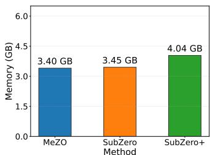
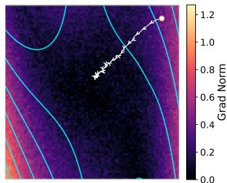
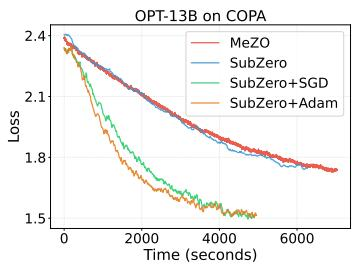
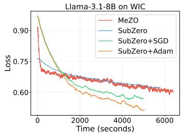
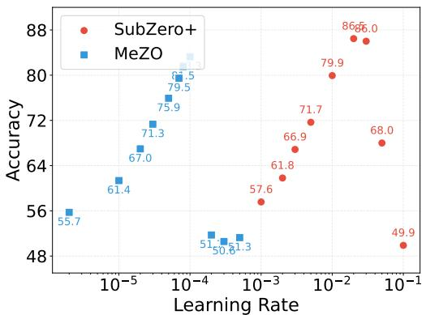

# SUBZERO+: EFFICIENT ZEROTH-ORDER LLM FINE-TUNING VIA LARGE LEARNING RATES

Ziming Yu<sup>1</sup>, Shuyao Xiao<sup>1</sup>, Xingyu Zhao<sup>1</sup>, Sike Wang<sup>1</sup>, Pan Zhou<sup>2</sup>, Peiyu Zang<sup>1</sup>, Xiangda Yan<sup>3</sup>, Yongjie Yang<sup>3</sup>, Jia Li<sup>1,4,5∗</sup> 

<sup>1</sup> Beijing Normal University <sup>2</sup> Singapore Management University <sup>3</sup> Xiaomi Inc. 

Beijing Key Laboratory of Artificial Intelligence for Education 

<sup>5</sup> Engineering Research Center of Intelligent Technology and Educational Application (MOE) {zimingyu, shuyaoxiao, xingyuzhao, sikewang}@mail.bnu.edu.cn panzhou@smu.edu.sg, jiali@bnu.edu.cn 

## ABSTRACT

Zeroth-order (ZO) optimization enables backpropagation-free fine-tuning of large language models, but existing ZO methods suffer from high-variance gradient estimators, making convergence unstable and highly sensitive to learning rates. We propose SubZero+, an improved SubZero framework that improves stability in three complementary ways: (i) multi-query gradient estimation within layer specific low-rank subspaces to reduce variance without exhibiting the multi-query paradox; (ii) a subspace Adam optimizer that performs adaptive updates using in-subspace multi-query gradient statistics; and (iii) a sign correction for QR-based subspace construction to ensure Haar-distributed projection matrices, eliminating implementation-dependent orientation ambiguity. Experiments on models from 1.3B to 32B across SuperGLUE, under both full-parameter tuning and LoRA, show that SubZero+ consistently outperforms prior ZO baselines, enlarges the stable learning-rate range, and narrows the gap to first-order methods with minimal extra memory overhead. 

## 1 INTRODUCTION

Fine-tuning large language models (LLMs), such as OPT (Zhang et al., 2022), LLaMA (Touvron et al., 2023), GPT (Achiam et al., 2023), and Qwen (Yang et al., 2025), is a standard paradigm for adapting pre-trained models to downstream tasks. Most existing approaches rely on backpropagation (BP) to compute first-order (FO) gradients for optimization (Amari, 1993; Kingma & Ba, 2015). As a principled alternative, zeroth-order (ZO) optimization enables fine-tuning LLMs without backward passes (Malladi et al., 2023; Zhang et al., 2024; Liu et al., 2024; Yu et al., 2025). By eliminating BP, ZO methods can substantially reduce activation-memory overhead, simplify training pipelines, and make fine-tuning feasible in settings where BP is impractical or inefficient (Liu et al., 2026). 

Despite the promise of ZO optimization (Malladi et al., 2023), matching the convergence behavior of FO methods remains challenging. A key bottleneck is the high variance of gradient estimates, which typically grows with the parameter dimension d (Duchi et al., 2015; Nesterov & Spokoiny, 2017). This becomes particularly severe for fine-tuning LLMs, where d is extremely large, often resulting in a significant performance gap relative to FO optimizers. Numerous efforts have focused on developing improved gradient estimators and variance-reduction strategies. Representative directions include imposing sparsity priors on perturbations (Liu et al., 2024; Guo et al., 2024), exploiting low-rank structure (Chen et al., 2025; Yu et al., 2025), incorporating second-order Hessian information (Zhao et al., 2025), and orthogonalizing perturbations in random subspaces (Lang et al., 2026). 

Among these methods, SubZero (Yu et al., 2025) is a promising approach for fine-tuning LLMs. It projects gradients onto layer-specific low-dimensional subspaces, which reduces both the difficulty and the variance of gradient estimation. Since fine-tuning gradients often exhibit low-rank structure (Zhang et al., 2023; Malladi et al., 2023; Zhao et al., 2024; Hao et al., 2024), these subspace approximations can preserve the most informative optimization directions. As a result, the variance reduction from operating in a smaller space can outweigh the loss in gradient fidelity, yielding substantial practical improvements. However, like many ZO fine-tuning methods, SubZero is sensitive to hyperparameters, especially the learning rate. A large learning rate amplifies the effect of estimator noise, which can cause oscillations or divergence (Ghadimi & Lan, 2013). As shown in Figure 1(a), MeZO (Malladi et al., 2023) requires an unusually small learning rate to remain stable. We observe that this sensitivity also limits SubZero in practice. While averaging multiple queries can mitigate noise, it increases query cost. Moreover, the gains from additional queries are often sublinear and may even suffer from the multi-query paradox (Lin et al., 2025). Therefore, enabling larger effective learning rates for SubZero through further variance reduction remains an open challenge. 


(a) Learning-rate sensitivity


(b) Convergence speed





(c) GPU memory usage


Figure 1: Learning-rate sensitivity, convergence speed, and GPU memory usage for full-parameter tuning of OPT-1.3B on SST-2. (a) MeZO is highly sensitive to the learning rate. (b) SubZero+ produces smoother training curves and supports larger learning rates, leading to faster convergence. (c) SubZero+ adds only ∼0.6GB of GPU memory overhead compared with MeZO and SubZero while improving both stability and performance.


To achieve faster convergence with larger learning rates, we propose SubZero+, which improves training stability in three complementary aspects. First, we perform multi-query gradient estimation within the same low-rank subspace to reduce variance while mitigating the multi-query paradox. Second, because multiple queries yield a more accurate gradient estimate, we apply Adam (Kingma & Ba, 2015) for parameter updates inside the subspace. This leads to more effective training of LLMs (Glentis et al., 2026) while retaining a low memory footprint. Third, we introduce a sign correction for the QR-based subspace construction to ensure that the resulting projection matrices are Haar-distributed (Mezzadri, 2007), removing implementation-dependent orientation ambiguities. 

## Our main contributions are summarized as follows:

• We extend SubZero’s single-query estimator by averaging multiple independent perturbations within the same low-rank subspace. This reduces gradient variance without incurring the multi-query paradox. All statistics are computed in-subspace, so the memory footprint remains comparable to inference-time (see Figures 1(c) and 2). 

• We propose a low-rank subspace Adam for parameter updates. Adam is executed entirely within the low-rank subspace, and multi-query gradient norms are used to set per-layer, per-direction adaptive step sizes. This adds overhead proportional to the subspace size and yields low-noise, curvature-aware updates that improve stability and optimization quality. 

• We apply a sign correction to the QR-based subspace construction so that the projection matrices are Haar-distributed, eliminating orientation ambiguities introduced by implementation details. 

• We conduct extensive experiments on models from 1.3B to 32B across SuperGLUE, under both full-parameter tuning (FT) and LoRA (Hu et al., 2022). SubZero+ consistently outperforms prior ZO baselines, significantly enlarges the stable learning-rate range (see Figure 1(b)), and narrows the performance gap to first-order methods. 

## 2 RELATED WORK

ZO Gradient Estimation. ZO optimization replaces BP with finite-difference gradient estimates using only forward passes. MeZO (Malladi et al., 2023) pioneered SPSA-based ZO fine-tuning for LLMs (Spall, 1992), achieving inference-level memory but suffering from variance that scales with parameter dimension d (Nesterov & Spokoiny, 2017; Duchi et al., 2015). Subsequent work mitigates this through sparse perturbations (Liu et al., 2024; Guo et al., 2024) and low-rank subspace projections (Chen et al., 2025; Yu et al., 2025). LOZO (Chen et al., 2025) factorizes perturbations as low-rank matrices, while SubZero (Yu et al., 2025) enforces column-orthonormal projection matrices via QR decomposition. Both operate with a single query per iteration, limiting their variance reduction capability. 

ZO Parameter Update. Standard ZO methods including MeZO (Malladi et al., 2023) and Sub-Zero (Yu et al., 2025) apply vanilla SGD to the estimated gradients. LOZO (Chen et al., 2025) applies SGDM within the low-rank subspace, incurring negligible memory overhead. TeZO (Sun et al., 2025) further exploits temporal low-rankness across gradients, and can be extended to an Adam variant. However, the Adam extension does not yield consistent improvement over its SGD counterpart. Indeed, MeZO, SubZero, and (Guo et al., 2025) all observe that Adam offers no advantage over SGD in ZO fine-tuning, as the noisy gradient estimates render the second-moment preconditioning unreliable. Extending adaptive optimizers to ZO is challenging for two reasons: the high variance of gradient estimates makes the second-moment estimate unreliable, and full-size moment buffers violate the memory-efficient premise. Running adaptive optimization within a compressed subspace, where moment buffers are proportionally reduced, remains an open challenge. 

Multi-Query ZO. Averaging $K > 1$ independent perturbation evaluations reduces per-step gradient variance by a factor of K (Duchi et al., 2015). However, Lin et al. (2025) identified the multi-query paradox: under a fixed budget of total forward passes, using K queries reduces the number of training steps by a factor of $K ,$ , and the per-step variance reduction is exactly canceled by the fewer update steps, yielding no net gain over single-query training. Recent works seek to break this trade-off through gradient normalization (Dang et al., 2026), projection alignment (Lin et al., 2025), and gradient orthogonalization (Liu et al., 2025). A complementary direction is to leverage shared structure across queries, such as a common low-rank subspace, to align signal components before averaging, potentially circumventing the paradox without additional computational overhead. 

## 3 PRELIMINARIES

We first introduce the standard ZO optimization formulation and the SubZero framework upon which SubZero+ builds. We adopt the notation convention from SubZero (Yu et al., 2025): bold lower-case letters (w) denote vectors, bold upper-case letters (W) denote matrices, and calligraphic letters (W) denote sets of matrices. 

Problem Setup. Consider fine-tuning a pre-trained LLM consisting of l layers, where the trainable parameters of the i-th layer are represented as a matrix $W _ { i } \in \mathbb { R } ^ { \bar { m } _ { i } \times n _ { i } } \ ( \mathbf { e . g } .$ ., weight matrices of linear projections in attention and feed-forward blocks). Let ${ \mathcal { W } } = \{ W _ { i } \} _ { i = 1 } ^ { l }$ denote the set of all trainable parameter matrices, and let $\pmb { w } = [ \mathrm { v e c } ( \pmb { W } _ { 1 } ) ^ { \top } , \bot \bot , \mathrm { v e c } ( \pmb { W } _ { l } ) ^ { \top } ] ^ { \top } \overset { } { \in } \mathbb { R } ^ { d }$ be their flattened concatenation, where $\begin{array} { r } { d = \sum _ { i = 1 } ^ { l } m _ { i } n _ { i } } \end{array}$ is the total parameter count. The fine-tuning objective is to minimize a loss function $\mathcal { L } ( \mathcal { W } )$ over a training dataset D. 

ZO Gradient Estimation (MeZO). The classical ZO approach, popularized for LLM fine-tuning by MeZO (Malladi et al., 2023), employs the simultaneous perturbation stochastic approximation (SPSA) estimator (Spall, 1992). For a minibatch $B \subset D$ , the central-difference ZO gradient estimate w.r.t. the flattened parameters w is: 

$$
\widehat {\nabla} _ {\boldsymbol {w}} \mathcal {L} (\boldsymbol {w}; \mathcal {B}) = \frac {\mathcal {L} (\boldsymbol {w} + \varepsilon \boldsymbol {z} ; \mathcal {B}) - \mathcal {L} (\boldsymbol {w} - \varepsilon \boldsymbol {z} ; \mathcal {B})}{2 \varepsilon} \boldsymbol {z},\tag{1}
$$

where $\boldsymbol { z } \sim \mathcal { N } ( \mathbf { 0 } , \boldsymbol { I } _ { d } )$ is a random Gaussian perturbation vector, and $\varepsilon > 0$ is the perturbation scale. This estimator requires only two forward passes and provides an unbiased estimate of the gradient of the smoothed objective $\mathbb { E } _ { z } \big [ \mathscr { L } ( \pmb { w } + \varepsilon z ) \big ]$ . However, its variance scales as $O ( d )$ (Nesterov & Spokoiny, 2017), making gradient estimates extremely noisy for large d. 

Subspace ZO Optimization (SubZero). SubZero (Yu et al., 2025) reduces gradient estimation variance by restricting perturbations to a low-rank subspace constructed per layer. For the i-th layer, SubZero generates two column-orthonormal projection matrices $U _ { i } \in \mathbf { \tilde { \mathbb { R } } } ^ { m _ { i } \times \mathbf { \dot { r } } }$ and $V _ { i } \in \mathbb { R } ^ { n _ { i } \times r }$ via QR decomposition of random Gaussian matrices, where $r \ll$ min $\{ m _ { i } , n _ { i } \}$ is the subspace rank. The perturbation for layer i is then constructed as: 

$$
\tilde {\mathbf {Z}} _ {i} = \mathbf {U} _ {i} \mathbf {Z} _ {i} \mathbf {V} _ {i} ^ {\top} \in \mathbb {R} ^ {m _ {i} \times n _ {i}},\tag{2}
$$

where $\pmb { Z } _ { i } \in \mathbb { R } ^ { r \times r }$ is a low-dimensional random matrix with i.i.d. $\mathcal { N } ( 0 , 1 )$ entries. The loss difference is computed globally: 

$$
\rho = \frac {\mathcal {L} (\mathcal {W} + \varepsilon \tilde {\mathcal {Z}} ; \mathcal {B}) - \mathcal {L} (\mathcal {W} - \varepsilon \tilde {\mathcal {Z}} ; \mathcal {B})}{2 \varepsilon},\tag{3}
$$

where $\tilde { \mathcal { Z } } = \{ \tilde { Z } _ { i } \} _ { i = 1 } ^ { l }$ denotes the set of layer-wise perturbations. The gradient estimate for layer i is then $\widehat { \nabla } _ { W _ { i } } \mathcal { L } = \rho \tilde { Z } _ { i }$ , and parameters are updated via SGD: $W _ { i }  W _ { i } - \eta \widehat \nabla _ { W _ { i } } \mathcal { L }$ 

By Lemma 1 of (Yu et al., 2025), the vectorized perturbation vec $( \tilde { Z } _ { i } ) = ( V _ { i } \otimes U _ { i } ) \mathrm { v e c } ( Z _ { i } )$ where $V _ { i } \otimes U _ { i }$ is a column-orthonormal matrix of size $m _ { i } n _ { i } \times r ^ { 2 }$ . Thus, SubZero effectively performs $\mathrm { _ { Z O } }$ gradient estimation in an $r ^ { 2 }$ -dimensional subspace per layer, reducing variance from $O ( m _ { i } n _ { i } )$ to ${ \bar { O } } ( r ^ { 2 } )$ . The total effective subspace dimension is $q = l r ^ { 2 } \ll d .$ 

Limitations of SubZero. Despite its advantages, SubZero has three key limitations that motivate SubZero+. First, it uses only a single query $\bar { ( \cal K } = 1 )$ per iteration, leaving substantial variance reduction on the table. Second, it employs vanilla SGD in the compressed subspace, missing the opportunity for per-layer adaptive optimization. Third, its QR-based subspace construction is implementation-dependent. 

## 4 THE SUBZERO+ FRAMEWORK

SubZero+ extends the SubZero framework along three synergistic axes: multi-query subspace gradient estimation (Sec. 4.1), low-rank subspace Adam (Sec. 4.2), and QR-based subspace construction with sign correction (Sec. 4.3). These components form a dependency chain: the QR-based subspace construction with sign correction improves subspace stability; multi-query estimation provides lownoise gradient norms that better capture per-layer curvature; and subspace Adam then leverages these signals to determine adaptive step sizes. Notably, both multi-query estimation and low-rank subspace Adam operate entirely within an $r \times r$ subspace, so all persistent optimizer state scales as $O ( r ^ { 2 } )$ per layer. We describe each component in turn and then present the complete algorithm. 

## 4.1 MULTI-QUERY SUBSPACE GRADIENT ESTIMATION

SubZero estimates the gradient from a single perturbation, leaving its variance at $O ( r ^ { 2 } )$ per layer. In principle, averaging over $K > 1$ independent perturbations should reduce this by a factor of $K$ . However, naive multi-query averaging in the full space suffers from the multi-query paradox (Lin et al., 2025): the per-iteration variance reduction is offset by the $K \times$ increase in query cost. Our key insight is that the subspace structure of SubZero naturally resolves this paradox: when multiple queries share the same low-rank subspace (defined by fixed projection matrices $U _ { i } , V _ { i } )$ , their gradient estimates are aligned along the subspace basis directions. Averaging across queries reinforces signal components within the subspace while canceling orthogonal noise components, yielding variance reduction that translates into genuine optimization improvement. Critically, subspace-based fusion avoids the $O ( d )$ auxiliary state that full-space multi-query averaging would require, preserving the defining advantage of ZO optimization—inference-level memory (see Figure 2). 

Formally, let $U _ { i } \in \mathbb { R } ^ { m _ { i } \times r }$ and $V _ { i } \in \mathbb { R } ^ { n _ { i } \times r }$ be fixed projection matrices for layer i at the current step. For each query $k = 1 , \ldots , K$ , we independently sample $Z _ { i } ^ { ( k ) } \in \mathbb { R } ^ { r \times r }$ with i.i.d. $\mathcal { N } ( 0 , 1 )$ entries, and construct the full-space perturbation: 

$$
\tilde {\mathbf {Z}} _ {i} ^ {(k)} = \mathbf {U} _ {i} \mathbf {Z} _ {i} ^ {(k)} \mathbf {V} _ {i} ^ {\top}.\tag{4}
$$

Let $\tilde { \mathcal { Z } } ^ { ( k ) } = \{ \tilde { Z } _ { i } ^ { ( k ) } \} _ { i = 1 } ^ { l }$ denote the set of perturbations across all l layers. We compute the baseline loss $\ell _ { 0 } = \mathcal { L } ( \mathrm { \dot { \mathcal { W } } } ; B )$ and the perturbed loss for each query: 

$$
\ell_ {k} = \mathcal {L} (\mathcal {W} + \varepsilon \tilde {\mathcal {Z}} ^ {(k)}; \mathcal {B}).\tag{5}
$$

Using the forward-difference scheme, the multi-query gradient estimate for layer i is: 

$$
\widehat {\nabla} _ {\boldsymbol {W} _ {i}} \mathcal {L} (\mathcal {W}; \mathcal {B}) = \frac {1}{K} \sum_ {k = 1} ^ {K} \frac {\ell_ {k} - \ell_ {0}}{\varepsilon} \tilde {\boldsymbol {Z}} _ {i} ^ {(k)} = \frac {1}{K \varepsilon} \boldsymbol {U} _ {i} \left(\sum_ {k = 1} ^ {K} \left(\ell_ {k} - \ell_ {0}\right) \boldsymbol {Z} _ {i} ^ {(k)}\right) \boldsymbol {V} _ {i} ^ {\top}.\tag{6}
$$

From variance reduction to curvature awareness. Beyond variance reduction, multi-query estimation unlocks a signal that single-query estimation is too noisy to provide: the per-layer gradient norm $\| \overline { { Z } } _ { i } ^ { t } \| _ { F }$ , where $\begin{array} { r } { \breve { \pmb { Z } } _ { i } ^ { t } = \frac { 1 } { K } \sum _ { k = 1 } ^ { \breve { K } } \rho _ { k } ^ { t } \pmb { Z } _ { i } ^ { \left( k \right) } } \end{array}$ is the aggregated low-rank gradient. With multiple queries, this norm becomes a reliable proxy for local loss landscape curvature, serving as the foundation for the per-layer adaptive optimization developed next (Figure 3 provides a 2D illustration). 

## 4.2 LOW-RANK SUBSPACE ADAM

SubZero applies vanilla SGD in the compressed subspace with a uniform learning rate η across all layers. However, the per-layer multi-query gradient norm $\gamma _ { i } ^ { t } = \| \overline { { Z } } _ { i } ^ { t } \| _ { F }$ can differ by an order of magnitude across layers. A uniform learning rate treats a layer in a flat basin identically to one on a sharp ridge, resulting in either overly conservative updates (slowing convergence) or dangerously aggressive ones (risking divergence). 

We address this by running the Adam optimizer (Kingma & Ba, 2015) entirely within the $r \times r$ low-rank space. For each layer i, we maintain first- and second-moment estimates $M _ { i } ^ { t } , V _ { i } ^ { t } \in \mathbb { R } ^ { r \times r }$ 

$$
\pmb {M} _ {i} ^ {t} = \beta_ {1} \pmb {M} _ {i} ^ {t - 1} + (1 - \beta_ {1}) \overline {{\pmb {Z}}} _ {i} ^ {t},\tag{7}
$$

$$
\pmb {V} _ {i} ^ {t} = \beta_ {2} \pmb {V} _ {i} ^ {t - 1} + (1 - \beta_ {2}) (\overline {{\pmb {Z}}} _ {i} ^ {t} \odot \overline {{\pmb {Z}}} _ {i} ^ {t}),\tag{8}
$$

where ⊙ denotes element-wise multiplication and $\beta _ { 1 } , \beta _ { 2 } \in [ 0 , 1 )$ are decay rates. After bias correction 

$$
\hat {\boldsymbol {M}} _ {i} ^ {t} = \boldsymbol {M} _ {i} ^ {t} / (1 - \beta_ {1} ^ {t}), \qquad \hat {\boldsymbol {V}} _ {i} ^ {t} = \boldsymbol {V} _ {i} ^ {t} / (1 - \beta_ {2} ^ {t}),\tag{9}
$$

the parameter update is: 

$$
\boldsymbol {W} _ {i} ^ {t + 1} = \boldsymbol {W} _ {i} ^ {t} - \eta \boldsymbol {U} _ {i} ^ {t} \left(\frac {\hat {\boldsymbol {M}} _ {i} ^ {t}}{\sqrt {\hat {\boldsymbol {V}} _ {i} ^ {t}} + \epsilon_ {\mathrm{adam}}}\right) (\boldsymbol {V} _ {i} ^ {t}) ^ {\top},\tag{10}
$$

where division and square-root are element-wise. The element-wise preconditioning by $1 / \sqrt { \hat { V } _ { i } ^ { t } }$ automatically assigns smaller effective step sizes to layers with large gradient magnitudes (steep curvature) and larger steps to layers with small magnitudes (flat regions). Both moment buffers reside in $\mathbb { R } ^ { r \times r }$ , contributing only $2 r ^ { 2 }$ floats per layer, negligible relative to the model size. 

Figure 2 quantifies this advantage for FT of OPT-13B on SST-2. MeZO’s memory grows from 25.9 GB (single-query SGD) to 97.2 GB (multi-query Adam)—a 3.8× increase—due to $O ( d )$ gradient accumulation and moment buffers. SubZero+ runs the same multi-query Adam configuration at only 27.9 GB, because all auxiliary states are confined to $r \times r$ subspace buffers. All four SubZero+ variants (SGD or Adam, single- or multi-query) consume identical memory, underscoring that the subspace design decouples optimizer sophistication from memory cost. 


Figure 2: GPU memory breakdown on OPT-13B.


## 4.3 IMPLEMENTATION AND ALGORITHM

Why Multi-Query and Adam Must Work Together. Figure 3 illustrates this synergy on a 2D loss landscape. With K = 1 (Figure 3(b)), the gradient norm field is dominated by noise. With $K = 1 0 0$ (Figure 3(c)), it faithfully reflects local curvature. Subspace Adam exploits this signal to assign adaptive step sizes—small on steep walls, large on flat regions—enabling near-monotone descent. 

QR Subspace Construction with Sign Correction. The projection matrices $U _ { i } , V _ { i }$ are regenerated every F steps by drawing random Gaussian matrices $\Omega _ { U } ^ { - } \in \mathbb { R } ^ { m _ { i } \times r } , \Omega _ { V } \in \mathbb { R } ^ { { n _ { i } } \times { r } }$ and computing their QR decompositions. Standard QR implementations (e.g., torch.linalg.qr) do not guarantee a positive diagonal on the triangular factor $\scriptstyle { R , }$ leaving the column signs of $Q$ arbitrary among $2 ^ { r }$ choices. Only the unique sign configuration satisfying $R _ { i i } > 0$ produces a Haar-distributed $Q .$ which is rotationally invariant and directionally unbiased (Mezzadri, 2007). We enforce this via a simple post-hoc correction: 


(a) Loss landscape.


(b) Standard ZO (∥gˆ∥, K = 1).





(c) SubZero+ (∥gˆ∥, K = 100).


Figure 3: Multi-query and Adam are synergistic. (a) A 2D loss surface with steep walls and a flat valley. (b) Standard ZO gradient norm $( K = 1 )$ : noise dominates, obscuring curvature. (c) SubZero+ gradient norm $( K = 1 0 0 )$ : curvature structure emerges, enabling adaptive step sizes. All panels share the same domain and starting point.


$$
\boldsymbol {U} _ {i} = \tilde {\boldsymbol {U}} _ {i} \operatorname{diag} (\operatorname{sgn} (\tilde {\boldsymbol {R}} _ {U, 1 1}), \dots , \operatorname{sgn} (\tilde {\boldsymbol {R}} _ {U, r r})), \boldsymbol {V} _ {i} = \tilde {\boldsymbol {V}} _ {i} \operatorname{diag} (\operatorname{sgn} (\tilde {\boldsymbol {R}} _ {V, 1 1}), \dots , \operatorname{sgn} (\tilde {\boldsymbol {R}} _ {V, r r})),\tag{11}
$$

which multiplies each column of $\tilde { Q }$ by the sign of the corresponding $\tilde { R }$ diagonal entry. This correction restores the missing sign symmetry and makes the basis distribution invariant to implementationdependent QR sign conventions. We apply this procedure independently to the left and right projection matrices. The cost is $O ( r )$ column sign flips per layer, negligible compared to the $\bar { O } ( m _ { i } n _ { i } r )$ QR cost. See Appendix A.3 for empirical validation. 

Complete Algorithm. Algorithm 1 constructs the Haar-corrected projection matrices, Algorithm 2 generates and applies perturbations, and Algorithm 3 gives the full SubZero+ training loop. Each iteration requires K + 1 forward passes—one baseline and K perturbed—and remains entirely BPfree. SubZero+ inherits SubZero’s compatibility with full-parameter tuning (FT), LoRA (Hu et al., 2022), prefix tuning (Li & Liang, 2021), and prompt tuning (Lester et al., 2021). The multi-query estimation and low-rank Adam are applied to the trainable parameters in each scheme. 

## 5 EXPERIMENTS

We conduct comprehensive experiments to evaluate SubZero+ against state-of-the-art ZO baselines across diverse models, tasks, and fine-tuning schemes. Due to space constraints, detailed hyperparameter configurations and additional results are provided in Appendix A.2. 

## 5.1 EXPERIMENTAL SETUP

Comprehensive Validation. We evaluate autoregressive (decoder-only) LLMs including OPT-1.3B, OPT-13B (Zhang et al., 2022), OPT-30B (Zhang et al., 2022), LLaMA3.1-8B (Team & AI@Meta, 2024), and Qwen2.5-32B (Team, 2024). Tasks span the SuperGLUE benchmark (Wang et al., 2019), covering classification, multiple-choice, and generation tasks. We cover the FT and LoRA (r = 8, α = 16) schemes. We compare against: MeZO (Malladi et al., 2023) and SubZero (Yu et al., 2025). For FO reference, we include Adam (FT). Zero-shot inference serves as a lower bound. 

Hyperparameters. Default settings for SubZero+: queries $K = 9 9$ , Adam parameters $\beta _ { 1 } =$ $0 . { \overset { \cdot } { 9 } } , { \overset { \cdot } { \beta _ { 2 } } } = 0 . 9 5$ , and $\epsilon _ { \mathrm { a d a m } } = 1 0 ^ { - 8 }$ . Subspace rank r and update frequency $\bar { F }$ are specified in Appendix A.2. Learning rates and perturbation scales are tuned via grid search per benchmark (see Appendix A.2). All ZO methods use batch size 16 and select the best checkpoint by validation loss, following (Malladi et al., 2023). MeZO and SubZero employ two-point gradient estimation, consuming 2 forward passes per step, for a total forward-pass budget of 40K over 20K steps. SubZero+ uses $K + { \bar { 1 } }$ forward passes per step (K perturbed and one baseline). For fair comparison, we adjust 

```csv
Algorithm 1 HaarProjMatrix(r, mi, ni) Algorithm 2 PerturbParams(W, U, V, r, ε, s)
Input: Rank r, dimensions mi, ni.
1: Draw ΩU ∈ Rmi×r, ΩV ∈ Rni×r with i.i.d. N(0, 1)
2: U̅i, RU ← QR(ΩU); V̅i, RV ← QR(ΩV)
3: su ← [sgn(RU,11), ..., sgn(RU,rr)]T;
4: si ← [sgn(RV,11), ..., sgn(RV,rr)]T
5: Ui ← U̅i diag(sU); Vi ← V̅i diag(sV)
6: return Ui, Vi
Input: Model parameters W, projection sets U, V, rank r, perturbation scale ε, seed s.
1: Reset RNG with seed s
2: Z ← ∅
3: for i = 1, 2, ..., l do
4: Generate Zi ∈ Rr×r with i.i.d. N(0, 1) entries
5: Z ← Z ∪ {Zi}
6: Wi ← Wi + ε Ui Zi ViT
7: return W, Z 
```

Algorithm 3 SubZero+
Input: Parameter matrices $W_{i} \in R^{m_{i} \times n_{i}}$ for $i = 1, \ldots, l$ , loss L, step budget T, perturbation scale $\varepsilon$ , learning rate $\eta$ , subspace change frequency F, rank r, query count K, Adam parameters $\beta_{1}, \beta_{2}, \epsilon_{adam}$ .

1: Initialize $M_{i}^{0} \leftarrow 0$ , $V_{i}^{0} \leftarrow 0$ for all i {r × r buffers}

2: for $t = 0, 1, \ldots, T - 1$ do

3: Sample a minibatch $B^{t} \subset D$ 4: for $i = 1, 2, \ldots, l$ do

5: if t mod $F \equiv 0$ then

6: $U_{i}^{t}, V_{i}^{t} \leftarrow \text{HaarProjMatrix}(r, m_{i}, n_{i})$ 7: else

8: $U_{i}^{t} \leftarrow U_{i}^{t-1}, V_{i}^{t} \leftarrow V_{i}^{t-1}$ 9: Compute baseline loss: $\ell_{0}^{t} \leftarrow \mathcal{L}(\mathcal{W}^{t}; \mathcal{B}^{t})$ 10: Initialize $\overline{Z}_{i}^{t} \leftarrow 0 \in R^{r \times r}$ for all i

11: for $k = 1, 2, \ldots, K$ do

12: Sample a random seed $s_{k}^{t}$ 13: $W^{t}, Z_{k}^{t} \leftarrow PerturbParams(W^{t}, U^{t}, V^{t}, r, \varepsilon, s_{k}^{t})$ 14: $\ell_{k}^{t} \leftarrow \mathcal{L}(W^{t}; B^{t})$ 15: $W^{t}, -\leftarrow PerturbParams(W^{t}, U^{t}, V^{t}, r, -\varepsilon, s_{k}^{t})$ 16: $\rho_{k}^{t} \leftarrow (\ell_{k}^{t} - \ell_{0}^{t}) / \varepsilon$ 17: for i = 1, 2, $\ldots, l$ do

18: $\overline{Z}_{i}^{t} \leftarrow \overline{Z}_{i}^{t} + \rho_{k}^{t} \cdot Z_{k,i}^{t}$ 19: for i = 1, 2, $\ldots, l$ do

20: $\overline{Z}_{i}^{t} \leftarrow \overline{Z}_{i}^{t}/K$ 21: Update $W_{i}^{t+1}$ via Adam (Eqs. (7)–(10)) with gradient $\overline{Z}_{i}^{t}$ 22: return $W^{T}$ 

SubZero+’s step count so that its total forward-pass budget matches the 40K budget; with the default $K = 9 9$ , SubZero+ runs for 400 steps, consuming $9 9 \stackrel { \cdot } { + } 1 = 1 0 0$ forwards per step, matching the $2 \times 2 0 \mathrm { K } = 4 0 \mathrm { K }$ total budget of MeZO and SubZero. 

## 5.2 MAIN RESULTS

## 5.2.1 AUTO-REGRESSIVE LLMS UNDER FT SCHEME

We first evaluate on three autoregressive models of varying scales: OPT-1.3B, LLaMA3.1-8B, and OPT-13B. Following prior ZO work (Malladi et al., 2023; Zhao et al., 2025), we use the FT scheme for all ZO methods. Results are presented in Table 1. SubZero+ consistently outperforms all ZO baselines across all three model scales. On OPT-1.3B, SubZero+ achieves 66.3% average accuracy across 9 tasks, outperforming SubZero (65.5%) and MeZO (64.6%). On LLaMA3.1-8B, SubZero+ reaches 83.3%, surpassing SubZero (82.5%) and MeZO (82.3%). On OPT-13B, SubZero+ attains 73.0% average accuracy, again improving over SubZero (70.3%) and MeZO (69.9%). On LLaMA3.1-8B, subspace SGD marginally outperforms subspace Adam (83.7% vs. 83.3%), attributable to different learning rate search spaces. Representative loss trajectories are illustrated in Figure 4. 


Table 1: Main results on autoregressive LLMs under the FT scheme. SubZero+ uses K = 99 queries. All methods share a 40K forward-pass budget.


<table><tr><td>Model</td><td>Method Task type</td><td>SST-2</td><td colspan="2">RTE — Classification</td><td colspan="2">WIC — Classification</td><td>MultiRC</td><td>COPA — Multi-choice —</td><td>ReCoRD — Multi-choice —</td><td>SQuAD — Generation —</td><td>DROP — Generation —</td><td>Avg.</td></tr><tr><td rowspan="6">OPT-1.3B</td><td>Zero-shot</td><td>53.5</td><td>53.4</td><td>45.5</td><td>57.5</td><td>45.4</td><td>75.0</td><td>70.5</td><td>27.2</td><td>11.1</td><td>48.8</td><td></td></tr><tr><td>FO (Adam)</td><td>92.0</td><td>78.0</td><td>75.8</td><td>66.0</td><td>70.9</td><td>77.0</td><td>71.1</td><td>81.7</td><td>31.1</td><td>71.5</td><td></td></tr><tr><td>MeZO</td><td>90.2</td><td>64.3</td><td>65.0</td><td>58.3</td><td>59.7</td><td>74.0</td><td>71.0</td><td>76.4</td><td>22.5</td><td>64.6</td><td></td></tr><tr><td>SubZero</td><td>90.9</td><td>67.5</td><td>65.4</td><td>58.1</td><td>59.5</td><td>75.0</td><td>70.9</td><td>76.4</td><td>25.4</td><td>65.5</td><td></td></tr><tr><td>SubZero+/SGD</td><td>90.0</td><td>60.3</td><td>66.4</td><td>60.0</td><td>61.7</td><td>75.0</td><td>71.9</td><td>77.2</td><td>25.4</td><td>65.3</td><td></td></tr><tr><td>SubZero+/Adam</td><td>92.1</td><td>65.7</td><td>66.9</td><td>59.4</td><td>61.4</td><td>76.0</td><td>72.3</td><td>77.2</td><td>25.4</td><td>66.3</td><td></td></tr><tr><td rowspan="6">LLaMA3.1-8B</td><td>Zero-shot</td><td>59.8</td><td>46.6</td><td>76.3</td><td>59.6</td><td>62.3</td><td>64.9</td><td>83.7</td><td>85.0</td><td>28.5</td><td>63.0</td><td></td></tr><tr><td>FO (Adam)</td><td>95.9</td><td>88.1</td><td>87.7</td><td>76.3</td><td>89.3</td><td>84.0</td><td>75.8</td><td>91.4</td><td>70.1</td><td>84.3</td><td></td></tr><tr><td>MeZO</td><td>91.6</td><td>85.9</td><td>83.3</td><td>66.3</td><td>86.7</td><td>89.0</td><td>82.6</td><td>90.3</td><td>65.1</td><td>82.3</td><td></td></tr><tr><td>SubZero</td><td>91.2</td><td>83.8</td><td>83.3</td><td>65.5</td><td>87.2</td><td>90.0</td><td>82.6</td><td>90.9</td><td>67.8</td><td>82.5</td><td></td></tr><tr><td>SubZero+/SGD</td><td>95.4</td><td>84.8</td><td>84.2</td><td>69.6</td><td>87.2</td><td>92.0</td><td>82.0</td><td>90.7</td><td>67.5</td><td>83.7</td><td></td></tr><tr><td>SubZero+/Adam</td><td>93.3</td><td>84.1</td><td>85.0</td><td>69.4</td><td>87.6</td><td>91.0</td><td>82.2</td><td>90.8</td><td>66.6</td><td>83.3</td><td></td></tr><tr><td rowspan="6">OPT-13B</td><td>Zero-shot</td><td>58.8</td><td>59.6</td><td>59.0</td><td>55.0</td><td>46.9</td><td>80.0</td><td>81.2</td><td>46.2</td><td>14.6</td><td>55.7</td><td></td></tr><tr><td>FO (Adam)</td><td>95.1</td><td>83.4</td><td>80.6</td><td>68.0</td><td>78.9</td><td>88.0</td><td>81.8</td><td>87.0</td><td>34.7</td><td>77.5</td><td></td></tr><tr><td>MeZO</td><td>91.3</td><td>67.5</td><td>67.1</td><td>59.1</td><td>61.5</td><td>87.0</td><td>81.4</td><td>83.6</td><td>30.6</td><td>69.9</td><td></td></tr><tr><td>SubZero</td><td>90.8</td><td>66.4</td><td>68.3</td><td>58.3</td><td>66.8</td><td>88.0</td><td>81.2</td><td>83.6</td><td>29.2</td><td>70.3</td><td></td></tr><tr><td>SubZero+/SGD</td><td>92.8</td><td>70.8</td><td>74.4</td><td>60.7</td><td>69.5</td><td>88.0</td><td>81.2</td><td>85.3</td><td>30.6</td><td>72.5</td><td></td></tr><tr><td>SubZero+/Adam</td><td>93.5</td><td>74.0</td><td>75.2</td><td>63.2</td><td>64.7</td><td>89.0</td><td>81.7</td><td>85.2</td><td>30.6</td><td>73.0</td><td></td></tr></table>




Figure 4: Visualization of selected loss curves in Table 1.





## 5.2.2 AUTO-REGRESSIVE LLMS UNDER LORA SCHEME

We further evaluate SubZero+ under the LoRA scheme (r = 8, α = 16) on OPT-13B, LLaMA3.1-8B, and OPT-30B. LoRA learns low-rank adaptation matrices for attention projections, and is widely used in practice. We compare the best results from each ZO method across hyperparameter searches. Results are presented in Table 2. As shown in Table 2, SubZero+ outperforms both MeZO and SubZero under LoRA scheme on both model scales. On OPT-13B, SubZero+ achieves 70.7% average accuracy, outperforming MeZO (68.7%) by +2.0% and SubZero (68.6%) by +2.1%. On LLaMA3.1- 8B, SubZero+ achieves 83.4% average accuracy, outperforming MeZO (81.2%) by +2.2% and SubZero (81.5%) by +1.9%. For the larger OPT-30B, SubZero+ further boosts the average accuracy to 72.2%, surpassing MeZO (70.1%) by +2.1% and SubZero (69.4%) by +2.8%. The results are consistent with those obtained under the FT scheme. 

## 5.2.3 SCALING TO QWEN2.5-32B

To validate SubZero+ on a substantially larger model, we additionally evaluate on Qwen2.5- 32B (Team, 2024) under the FT scheme. We compare against the zero-shot baseline, MeZO, MeZO with LoRA, and SubZero. Results are presented in Table 3. 

On Qwen2.5-32B, SubZero+ achieves the highest score on every task, with an average accuracy of 87.4%—outperforming SubZero (85.1%) by +2.3%, MeZO (83.6%) by +3.8%, MeZO-LoRA (76.7%) by +10.7%, and the zero-shot baseline (76.0%) by +11.4%. The gains are particularly large on SST-2 (+5.9% over SubZero) and WIC (+4.7% over SubZero). 


Table 2: Main results on autoregressive LLMs under the LoRA scheme.


<table><tr><td>Model</td><td>Method Task type</td><td>SST-2</td><td colspan="2">RTE — Classification</td><td colspan="2">BoolQ Classification</td><td colspan="2">MultiRC — Multi-choice</td><td colspan="2">COPA — Multi-choice —</td><td colspan="2">ReCoRD — Generation —</td><td colspan="2">SQuAD — SQuAD — DROP — Avg.</td></tr><tr><td rowspan="3">OPT-13B</td><td>MeZO</td><td>93.6</td><td>62.1</td><td>69.1</td><td>56.9</td><td>57.8</td><td>86.0</td><td>81.4</td><td>83.0</td><td>28.7</td><td>68.7</td><td></td><td></td><td></td></tr><tr><td>SubZero</td><td>92.2</td><td>62.5</td><td>66.7</td><td>56.7</td><td>58.3</td><td>87.0</td><td>81.8</td><td>83.7</td><td>28.3</td><td>68.6</td><td></td><td></td><td></td></tr><tr><td>SubZero+</td><td>93.0</td><td>71.5</td><td>73.9</td><td>60.2</td><td>60.5</td><td>86.0</td><td>80.4</td><td>82.5</td><td>28.6</td><td>70.7</td><td></td><td></td><td></td></tr><tr><td rowspan="3">LLaMA3.1-8B</td><td>MeZO</td><td>91.3</td><td>78.0</td><td>83.6</td><td>61.0</td><td>85.8</td><td>92.0</td><td>83.8</td><td>90.4</td><td>65.4</td><td>81.2</td><td></td><td></td><td></td></tr><tr><td>SubZero</td><td>90.6</td><td>83.8</td><td>83.5</td><td>61.1</td><td>87.3</td><td>88.0</td><td>83.5</td><td>90.4</td><td>65.3</td><td>81.5</td><td></td><td></td><td></td></tr><tr><td>SubZero+</td><td>93.3</td><td>84.8</td><td>84.1</td><td>69.0</td><td>87.6</td><td>89.0</td><td>84.3</td><td>91.1</td><td>66.9</td><td>83.4</td><td></td><td></td><td></td></tr><tr><td rowspan="3">OPT-30B</td><td>MeZO</td><td>92.6</td><td>68.2</td><td>63.6</td><td>60.0</td><td>65.4</td><td>86.0</td><td>80.5</td><td>83.6</td><td>30.6</td><td>70.1</td><td></td><td></td><td></td></tr><tr><td>SubZero</td><td>93.0</td><td>65.3</td><td>61.4</td><td>58.2</td><td>64.0</td><td>85.0</td><td>81.7</td><td>83.2</td><td>32.5</td><td>69.4</td><td></td><td></td><td></td></tr><tr><td>SubZero+</td><td>94.2</td><td>72.6</td><td>71.5</td><td>60.3</td><td>67.0</td><td>86.0</td><td>80.9</td><td>84.7</td><td>33.0</td><td>72.2</td><td></td><td></td><td></td></tr></table>


Table 3: Performance comparison on Qwen2.5-32B across tasks. All averages are computed over 5 tasks (SST-2, RTE, BoolQ, WIC, SQuAD). SubZero+ scores are oracle best values from task-specific optimal hyperparameter configurations.


<table><tr><td>Method</td><td>SST-2</td><td>RTE</td><td>BoolQ</td><td>WIC</td><td>SQuAD</td><td>Avg.</td></tr><tr><td>Zero-shot</td><td>61.5</td><td>87.0</td><td>84.3</td><td>61.8</td><td>85.5</td><td>76.0</td></tr><tr><td>MeZO</td><td>87.5</td><td>90.3</td><td>86.7</td><td>65.7</td><td>87.9</td><td>83.6</td></tr><tr><td>MeZO-LoRA</td><td>62.0</td><td>87.4</td><td>84.8</td><td>64.7</td><td>84.7</td><td>76.7</td></tr><tr><td>SubZero</td><td>89.1</td><td>90.3</td><td>87.7</td><td>68.8</td><td>89.6</td><td>85.1</td></tr><tr><td>SubZero+</td><td>93.4</td><td>91.3</td><td>88.5</td><td>73.5</td><td>90.3</td><td>87.4</td></tr></table>

## 5.2.4 LEARNING RATE ROBUSTNESS

A key claim of SubZero+ is that multi-query estimation dramatically improves learning rate robustness. We validate this by fine-tuning Qwen3-0.6B with LoRA on SST-2, sweeping learning rates across four orders of magnitude for both SubZero+ and MeZO. As shown in Figure 5(a), SubZero+ achieves the highest training accuracy of 86.5% at $\mathrm { L R } = 2 \times 1 0 ^ { - 2 }$ , and retains above 79.0% accuracy across a 3× LR range $( 1 \bar { 0 } ^ { - 2 } \sim 3 \stackrel { . } { \times } 1 0 ^ { - 2 } )$ . In comparison, MeZO reaches its best accuracy of 83.3% at LR $= 1 \times 1 0 ^ { - 4 }$ , but its performance window is considerably narrower. When LR is doubled to $2 \times 1 0 ^ { - 4 }$ MeZO’s accuracy plummets by over 31 percentage points to 51.7%, whereas SubZero+ drops by only 0.5 percentage points when LR is increased by 1.5× to $3 \times 1 0 ^ { - 2 }$ 

To eliminate the scale difference in optimal LRs, we normalize each method’s LR by its own optimum in Figure 5(b). The normalized view reveals that SubZero+ exhibits a broad, symmetric performance plateau around the optimal LR, with a standard deviation of merely 2.98% within the [opt/2, 2 × opt] interval. MeZO, on the other hand, shows highly asymmetric behavior: its accuracy degrades gracefully when LR is below the optimum but collapses abruptly when LR is even slightly above it. This suggests that SubZero+ is substantially more robust to learning rate selection in practical LoRA fine-tuning scenarios, where the exact optimal LR is often unknown a priori. 

## 5.2.5 HAAR-CORRECTED QR-BASED SUBSPACE CONSTRUCTION

We conduct a comprehensive ablation study to quantify the contribution of Haar-corrected QR subspaces across tasks, optimizers, and evaluation metrics. The experimental setup is as follows: OPT-1.3B with full-parameter tuning, K = 99 queries, and a fixed total forward-pass budget of 30,000. We compare Haar-corrected QR subspaces (sign correction applied per Eq. (11)) against standard QR subspaces (raw output of torch.linalg.qr) under both subspace SGD and subspace Adam optimizers. Results are reported across 9 SuperGLUE tasks in Table 4. 

As shown in Table 4, Haar-corrected subspaces improve average accuracy under both Adam (+0.7%, from 61.5% to 62.2%) and SGD (+0.3%, from 65.1% to 65.3%). The improvement is larger under Adam, consistent with the hypothesis that adaptive per-layer scaling benefits more from unbiased directional coverage. MultiRC shows the most consistent gain (+2.8% under Adam, +2.6% under SGD). RTE exhibits striking optimizer-dependent behavior: Haar correction provides +4.6% under 




(a) Varying learning rates


(b) Normalized performance


Figure 5: Learning rate robustness of SubZero+ and MeZO for LoRA of Qwen3-0.6B on SST-2. (a) Training accuracy under varying learning rates. SubZero+ maintains high accuracy across a wide LR range, while MeZO degrades sharply beyond its optimum. (b) Normalized view with each LR scaled by its optimal value. SubZero+ exhibits a symmetric plateau, while MeZO collapses when LR exceeds the optimum.


Table 4: Comparison of Haar-corrected and standard QR-based subspaces. Results on OPT-1.3B across 9 SuperGLUE tasks with both Adam and SGD subspace optimizers. “Haar” denotes Haarcorrected QR subspaces; “No Haar” denotes raw QR from torch.linalg.qr without sign correction. All experiments use subspace rank r = 64, K = 99 queries, and FT scheme. Best results between Haar and No Haar for each optimizer are bolded.


<table><tr><td rowspan="2">Task</td><td colspan="3">Adam</td><td colspan="3">SGD</td></tr><tr><td>Haar</td><td>No Haar</td><td><eq>\Delta</eq></td><td>Haar</td><td>No Haar</td><td><eq>\Delta</eq></td></tr><tr><td>BoolQ</td><td>65.6</td><td>68.2</td><td>-2.6</td><td>66.4</td><td>66.4</td><td>0.0</td></tr><tr><td>COPA</td><td>77.0</td><td>75.0</td><td>+2.0</td><td>75.0</td><td>74.0</td><td>+1.0</td></tr><tr><td>DROP</td><td>23.8</td><td>24.3</td><td>-0.4</td><td>25.4</td><td>24.2</td><td>+1.2</td></tr><tr><td>MultiRC</td><td>56.0</td><td>53.2</td><td>+2.8</td><td>61.7</td><td>59.1</td><td>+2.6</td></tr><tr><td>RTE</td><td>65.2</td><td>60.6</td><td>+4.6</td><td>60.3</td><td>63.5</td><td>-3.2</td></tr><tr><td>ReCoRD</td><td>57.2</td><td>61.2</td><td>-4.0</td><td>71.9</td><td>72.2</td><td>-0.3</td></tr><tr><td>SQuAD</td><td>67.2</td><td>65.9</td><td>+1.3</td><td>77.2</td><td>76.5</td><td>+0.7</td></tr><tr><td>SST-2</td><td>91.0</td><td>91.4</td><td>-0.4</td><td>90.0</td><td>91.3</td><td>-1.2</td></tr><tr><td>WIC</td><td>56.6</td><td>54.0</td><td>+2.6</td><td>60.0</td><td>58.5</td><td>+1.6</td></tr><tr><td>Avg.</td><td>62.2</td><td>61.5</td><td>+0.7</td><td>65.3</td><td>65.1</td><td>+0.3</td></tr></table>

Adam but −3.2% under SGD, suggesting that RTE’s loss landscape benefits from Haar-uniform exploration only when combined with adaptive step sizes. On SST-2 and ReCoRD, both optimizers show small differences (< 1.3%), indicating low sensitivity to directional bias. We note that SGD achieves higher absolute accuracy than Adam on average, attributable to different learning rate search spaces. SGD with Haar correction remains a strong baseline for accuracy maximization, while subspace Adam is preferred for robustness and convergence speed. 

## 5.3 QUERY COUNT ABLATION

Multi-query estimation is a central innovation of SubZero+, with the number of queries K controlling the trade-off between gradient estimate variance (∝ 1/K) and per-step computational cost (∝ K). We conduct a systematic ablation of K across three tasks with distinct characteristics: SST-2 (binary sentiment classification), RTE (binary entailment), and MultiRC (multi-choice reading comprehension). 

Experimental setup. All experiments use OPT-1.3B with SubZero+ (Haar-corrected QR subspaces, r = 24, Z-space Adam), full-parameter tuning, and a fixed total forward-pass budget of 30,000. This means that as K increases, the number of training steps decreases proportionally (steps = $\lfloor 3 0 , 0 0 0 / K \rfloor )$ . Learning rates are tuned per K via grid search (see Appendix A.2 for details). Results are presented in Table 5. 


Table 5: Ablation study on query count K (denoted q) across tasks. Results on OPT-1.3B with SubZero+ (Haar-corrected QR subspaces, r = 24, Z-space Adam) across SST-2, RTE, and MultiRC. Total forward-pass budget is fixed at 30,000 for all K; larger K uses proportionally fewer steps. All experiments use full-parameter tuning. The best accuracy for each task is bolded, and the best overall K for the average is bolded in the Avg. column.


<table><tr><td>K (Queries)</td><td>SST-2</td><td>RTE</td><td>MultiRC</td><td>Avg.</td></tr><tr><td>1</td><td>50.9</td><td>47.7</td><td>55.5</td><td>51.4</td></tr><tr><td>5</td><td>52.6</td><td>52.7</td><td>55.5</td><td>53.6</td></tr><tr><td>10</td><td>56.7</td><td>49.8</td><td>52.3</td><td>52.9</td></tr><tr><td>20</td><td>69.8</td><td>57.0</td><td>59.8</td><td>62.2</td></tr><tr><td>30</td><td>88.3</td><td>62.8</td><td>57.6</td><td>69.6</td></tr><tr><td>50</td><td>90.9</td><td>63.9</td><td>60.0</td><td>71.6</td></tr><tr><td>70</td><td>91.5</td><td>58.1</td><td>58.2</td><td>69.3</td></tr><tr><td>80</td><td>91.6</td><td>60.3</td><td>59.3</td><td>70.4</td></tr><tr><td>100</td><td>92.2</td><td>57.0</td><td>59.6</td><td>69.6</td></tr><tr><td>150</td><td>89.9</td><td>61.4</td><td>58.7</td><td>70.0</td></tr><tr><td>200</td><td>89.7</td><td>61.0</td><td>61.1</td><td>70.6</td></tr><tr><td>Δ (K=100 vs. K=1)</td><td>+41.3</td><td>+9.3</td><td>+4.1</td><td>+18.2</td></tr></table>


Table 6: Peak GPU memory on OPT-13B (GB, batch size 16, fp16). Under FT, SubZero+ incurs ∼1% overhead over MeZO due to per-layer subspace buffers. Under LoRA, all three methods consume identical memory because the trainable LoRA parameters dominate.


<table><tr><td rowspan="2">Task</td><td colspan="4">FT</td><td colspan="4">LoRA</td></tr><tr><td>MeZO</td><td>SubZero</td><td>SubZero+</td><td>Δ%</td><td>MeZO</td><td>SubZero</td><td>SubZero+</td><td>Δ%</td></tr><tr><td>RTE</td><td>30.4</td><td>30.5</td><td>30.7</td><td>+1.1</td><td>30.4</td><td>30.4</td><td>30.4</td><td>+0.0</td></tr><tr><td>BoolQ</td><td>34.1</td><td>34.2</td><td>34.5</td><td>+1.0</td><td>34.1</td><td>34.1</td><td>34.1</td><td>0.0</td></tr><tr><td>SQuAD</td><td>30.8</td><td>30.9</td><td>31.1</td><td>+1.0</td><td>30.8</td><td>30.8</td><td>30.8</td><td>+0.0</td></tr><tr><td>DROP</td><td>50.4</td><td>50.5</td><td>50.8</td><td>+0.6</td><td>50.4</td><td>50.4</td><td>50.4</td><td>0.0</td></tr></table>

Table 5 reveals strikingly different K–accuracy profiles across tasks. SST-2 benefits dramatically from large K: accuracy rises from 50.9% at $\dot { K } \stackrel { = } { = } 1$ (barely above random) to 92.2% at $K = 1 0 { \dot { 0 } } .$ a gain of +41.3 percentage points, with a critical jump at $K = 3 0 ( 6 9 . 8 \%  8 8 . 3 \% )$ . RTE peaks at $K = 5 0 ( 6 3 . 9 \% )$ , with performance degrading for $K > 5 0$ as the reduced step count limits convergence. MultiRC is the least sensitive to K (varying only $5 2 . 3 \% { - } 6 1 . 1 \% )$ , suggesting that this task is bottlenecked by factors other than gradient estimation quality. For all three tasks, $K \leq 1 0$ yields accuracy within 5–7 points of random guessing, confirming that single-query estimates are too noisy for effective optimization. 

## 5.4 MEMORY ANALYSIS

We measure the peak GPU memory usage of MeZO, SubZero, and SubZero+ using OPT-13B under both FT and LoRA schemes across four representative tasks. Results are presented in Table 6. 

## 6 CONCLUSION

We have presented SubZero+, a memory-efficient ZO fine-tuning framework that integrates multiquery subspace gradient estimation, low-rank subspace Adam, and QR-based subspace construction with sign correction. Experiments across models (1.3B–32B), tasks, and FT/LoRA schemes demon strate that SubZero+ consistently outperforms existing ZO baselines while maintaining inference-level memory, with substantially improved learning rate robustness and convergence speed. 

Limitations and Future Work. The fundamental trade-off of SubZero+ is that its random subspaces are data-independent. While this ensures memory efficiency, it may also discard important gradient directions. In addition, the subspace is regenerated from scratch every F steps rather than being adapted based on prior optimization history. Incorporating data-dependent subspace construction and adaptive subspace updating are promising directions for future work. 

Broader Impact. SubZero+ lowers the barrier to LLM customization by reducing memory cost and hyperparameter sensitivity. We see no specific negative societal impacts beyond those generally associated with LLM fine-tuning. 

## REFERENCES


Josh Achiam, Steven Adler, Sandhini Agarwal, Lama Ahmad, Ilge Akkaya, Florencia Leoni Aleman, Diogo Almeida, Janko Altenschmidt, Sam Altman, Shyamal Anadkat, et al. GPT-4 technical report. arXiv:2303.08774, 2023. 


Shun-ichi Amari. Backpropagation and stochastic gradient descent method. Neurocomputing, 5(4-5):185–196, 1993. 


Yiming Chen, Yuan Zhang, Liyuan Cao, Kun Yuan, and Zaiwen Wen. Enhancing zeroth-order fine-tuning for language models with low-rank structures. In Proceedings of the International Conference on Learning Representations, 2025. 


Sizhe Dang, Yanjun Zhao, Xiaodong Zheng, Guang Dai, Ivor Tsang, and Haishan Ye. FZOO: Fast zeroth-order optimizer for fine-tuning large language models towards adam-scale speed. In International Conference on Learning Representations, volume 2026, pp. 113760–113792, 2026. 


John C Duchi, Michael I Jordan, Martin J Wainwright, and Andre Wibisono. Optimal rates for zero-order convex optimization: The power of two function evaluations. IEEE Transactions on Information Theory, 61(5): 2788–2806, 2015. 


Saeed Ghadimi and Guanghui Lan. Stochastic first-and zeroth-order methods for nonconvex stochastic programming. SIAM Journal on Optimization, 23(4):2341–2368, 2013. 


Athanasios Glentis, Dawei Li, Chung-Yiu Yau, and Mingyi Hong. Revisiting the Adam-SGD gap in LLM pre-training: The role of large effective learning rates. arXiv:2605.17787, 2026. 


Wentao Guo, Jikai Long, Yimeng Zeng, Zirui Liu, Xinyu Yang, Yide Ran, Jacob R Gardner, Osbert Bastani, Christopher De Sa, Xiaodong Yu, et al. Zeroth-order fine-tuning of LLMs with extreme sparsity. arXiv:2406.02913, 2024. 


Wentao Guo, Jikai Long, Yimeng Zeng, Zirui Liu, Xinyu Yang, Yide Ran, Jacob Gardner, Osbert Bastani, Christopher De Sa, Xiaodong Yu, et al. Zeroth-order fine-tuning of LLMs with transferable static sparsity. In Proceedings ofthe International Conference on Learning Representations, volume 2025, pp. 14814–14854, 2025. 


Yongchang Hao, Yanshuai Cao, and Lili Mou. FLoRA: Low-rank adapters are secretly gradient compressors. In Proceedings ofthe International Conference on Machine Learning, 2024. 


Edward J Hu, Yelong Shen, Phillip Wallis, Zeyuan Allen-Zhu, Yuanzhi Li, Shean Wang, Lu Wang, and Weizhu Chen. LoRA: Low-rank adaptation of large language models. In Proceedings ofthe International Conference on Learning Representations, 2022. 


Diederik P Kingma and Jimmy Ba. Adam: A method for stochastic optimization. In Proceedings of the International Conference on Learning Representations, 2015. 


Yicheng Lang, Changsheng Wang, Yihua Zhang, Mingyi Hong, Zheng Zhang, Wotao Yin, and Sijia Liu. Powering up zeroth-order training via subspace gradient orthogonalization. arXiv:2602.17155, 2026. 


Brian Lester, Rami Al-Rfou, and Noah Constant. The power of scale for parameter-efficient prompt tuning. In Proceedings of the Conference on Empirical Methods in Natural Language Processing, pp. 3045–3059, 2021. 


Xiang Lisa Li and Percy Liang. Prefix-tuning: Optimizing continuous prompts for generation. In Proceedings of the Annual Meeting ofthe Associationfor Computational Linguistics and the International Joint Conference on Natural Language Processing, pp. 4582–4597, 2021. 


Yukang Lin et al. The multi-query paradox in zeroth-order optimization. arXiv:2509.15552, 2025. 


Sijia Liu, Yicheng Lang, Soumyadeep Pal, Changsheng Wang, Yancheng Huang, Chongyu Fan, James Diffenderfer, Bhavya Kailkhura, and Yihua Zhang. Position: Zeroth-order optimization in deep learning is underexplored, not underpowered. In Proceedings ofthe International Conference on Machine Learning, 2026. 


Sijia Liu et al. ZO-Muon: Subspace gradient orthogonalization for zeroth-order optimization. arXiv:2602.17155, 2025. 


Yong Liu, Zirui Zhu, Chaoyu Gong, Minhao Cheng, Cho-Jui Hsieh, and Yang You. Sparse MeZO: Less parameters for better performance in zeroth-order LLM fine-tuning. arXiv:2402.15751, 2024. 


Sadhika Malladi, Tianyu Gao, Eshaan Nichani, Alex Damian, Jason D Lee, Danqi Chen, and Sanjeev Arora. Fine-tuning language models with just forward passes. Advances in Neural Information Processing Systems, 36:53038–53075, 2023. 


Francesco Mezzadri. How to generate random matrices from the classical compact groups. Notices of the American Mathematical Society, 54(5):592–604, 2007. 


Yurii Nesterov and Vladimir Spokoiny. Random gradient-free minimization of convex functions. Foundations of Computational Mathematics, 17:527–566, 2017. 


James C Spall. Multivariate stochastic approximation using a simultaneous perturbation gradient approximation. IEEE Transactions on Automatic Control, 37(3):332–341, 1992. 


Yan Sun, Tiansheng Huang, Liang Ding, Li Shen, and Dacheng Tao. TeZO: Empowering the low-rankness on the temporal dimension in the zeroth-order optimization for fine-tuning LLMs. arXiv:2501.19057, 2025. 


LLaMA Team and AI@Meta. The LLaMA 3 herd of models. arXiv:2407.21783, 2024. 


Qwen Team. Qwen2.5 technical report. arXiv:2412.15115, 2024. 


Hugo Touvron, Thibaut Lavril, Gautier Izacard, Xavier Martinet, Marie-Anne Lachaux, Timothée Lacroix, Baptiste Rozière, Naman Goyal, Eric Hambro, Faisal Azhar, et al. LLaMA: Open and efficient foundation language models. arXiv:2302.13971, 2023. 


Alex Wang, Yada Pruksachatkun, Nikita Nangia, Amanpreet Singh, Julian Michael, Felix Hill, Omer Levy, and Samuel R. Bowman. SuperGLUE: A stickier benchmark for general-purpose language understanding systems. arXiv:1905.00537, 2019. 


An Yang, Anfeng Li, Baosong Yang, Beichen Zhang, Binyuan Hui, Bo Zheng, Bowen Yu, Chang Gao, Chengen Huang, Chenxu Lv, Chujie Zheng, Dayiheng Liu, Fan Zhou, Fei Huang, Feng Hu, Hao Ge, Haoran Wei, Huan Lin, Jialong Tang, Jian Yang, Jianhong Tu, Jianwei Zhang, Jianxin Yang, Jiaxi Yang, Jing Zhou, Jingren Zhou, Junyang Lin, Kai Dang, Keqin Bao, Kexin Yang, Le Yu, Lianghao Deng, Mei Li, Mingfeng Xue, Mingze Li, Pei Zhang, Peng Wang, Qin Zhu, Rui Men, Ruize Gao, Shixuan Liu, Shuang Luo, Tianhao Li, Tianyi Tang, Wenbiao Yin, Xingzhang Ren, Xinyu Wang, Xinyu Zhang, Xuancheng Ren, Yang Fan, Yang Su, Yichang Zhang, Yinger Zhang, Yu Wan, Yuqiong Liu, Zekun Wang, Zeyu Cui, Zhenru Zhang, Zhipeng Zhou, and Zihan Qiu. Qwen3 technical report. arXiv:2505.09388, 2025. 


Ziming Yu, Pan Zhou, Sike Wang, Jia Li, Mi Tian, and Hua Huang. Zeroth-order fine-tuning of LLMs in random subspaces. In Proceedings ofthe IEEE/CVF International Conference on Computer Vision, pp. 4475–4485. IEEE, 2025. 


Susan Zhang, Stephen Roller, Naman Goyal, Mikel Artetxe, Moya Chen, Shuohui Chen, Christopher Dewan, Mona Diab, Xian Li, Xi Victoria Lin, et al. OPT: Open pre-trained transformer language models. arXiv:2205.01068, 2022. 


Yihua Zhang, Pingzhi Li, Junyuan Hong, Jiaxiang Li, Yimeng Zhang, Wenqing Zheng, Pin-Yu Chen, Jason D. Lee, Wotao Yin, Mingyi Hong, Zhangyang Wang, Sijia Liu, and Tianlong Chen. Revisiting zeroth-order optimization for memory-efficient LLM fine-tuning: A benchmark. In Proceedings of the International Conference on Machine Learning, pp. 59173–59190, 2024. 


Zhong Zhang, Bang Liu, and Junming Shao. Fine-tuning happens in tiny subspaces: Exploring intrinsic taskspecific subspaces of pre-trained language models. In Proceedings ofthe Annual Meeting ofthe Association for Computational Linguistics, pp. 1701–1713, 2023. 


Jiawei Zhao, Zhenyu Zhang, Beidi Chen, Zhangyang Wang, Anima Anandkumar, and Yuandong Tian. GaLore: Memory-efficient LLM training by gradient low-rank projection. In Proceedings of the International Conference on Machine Learning, 2024. 


Yanjun Zhao, Sizhe Dang, Haishan Ye, Guang Dai, Yi Qian, and Ivor Tsang. Second-order fine-tuning without pain for LMMs: A Hessian informed zeroth-order optimizer. In Proceedings ofthe International Conference on Learning Representations, volume 2025, pp. 43496–43520, 2025. 


## A APPENDIX

## A.1 IMPLEMENTATION DETAILS

For the subspace construction with sign correction, we draw random Gaussian matrices $\Omega _ { U } \ \in$ $\mathbb { R } ^ { m _ { i } \times r } , \Omega _ { V } \dot { \in } \mathbb { R } ^ { n _ { i } \times r }$ , compute standard thin QR decomposition (PyTorch’s torch.linalg.qr), and apply the sign correction as described in §4.3 (multiplying each column of $\tilde { U _ { i } } , \tilde { V _ { i } }$ by the sign of the corresponding diagonal entry of $\tilde { R } _ { U } , \tilde { R } _ { V } )$ . 

SubZero+ inherits the random seed trick and per-layer parameter update strategy from SubZero (Yu et al., 2025) for memory-efficient perturbation regeneration. The subspace projection matrices $U _ { i } , V _ { i }$ are regenerated every $\dot { F }$ steps and cached in between. All Adam moment buffers $M _ { i } ^ { t } , V _ { i } ^ { t }$ are stored in $\mathbb { R } ^ { r \times r }$ , contributing only $2 r ^ { \bar { 2 } }$ floats per layer. The multi-query perturbations are generated sequentially within each iteration, with each query’s perturbation regenerated from its random seed before the forward pass and then immediately subtracted after the loss computation, keeping peak memory at inference levels. 

## A.2 ADDITIONAL EXPERIMENTAL DETAILS

Hyperparameter Configurations. All experiments are conducted on a single NVIDIA H200 (141GB) GPU, except for OPT-1.3B which is run on a single NVIDIA RTX 4090 (24GB) GPU. We use PyTorch 2.1.0 with CUDA 12.1. 

For MeZO and SubZero, we follow the hyperparameter search grids from prior work (Malladi et al., 2023; Yu et al., 2025). For SubZero+, we additionally tune the subspace rank r, subspace update frequency $F ,$ , queries K, and Adam parameters. For full-parameter tuning (FT), the subspace rank r is model-dependent: $r = 1 6$ for OPT-1.3B and $r = 1 2 8$ for all other models (OPT-13B, LLaMA3.1-8B), following the same scheme as SubZero. Tables 7 and 8 summarize the search grids for the FT and LoRA schemes, respectively. All ZO methods use batch size 16 and constant learning rate schedule. Learning rates and perturbation scales are selected via grid search on the validation set. 


Table 7: Hyperparameter search grids for the FT scheme.


<table><tr><td>Method</td><td>Hyperparameter</td><td>Value</td></tr><tr><td rowspan="4">MeZO</td><td>batch size</td><td>16</td></tr><tr><td>learning rate</td><td>{1e-7, 5e-7, 1e-6}</td></tr><tr><td>ε</td><td>1e-3</td></tr><tr><td>training steps</td><td>20,000</td></tr><tr><td rowspan="6">SubZero</td><td>batch size</td><td>16</td></tr><tr><td>learning rate</td><td>{1e-7, 5e-7, 1e-6}</td></tr><tr><td>ε</td><td>1e-3</td></tr><tr><td>rank r</td><td>16 (OPT-1.3B) / 128 (others)</td></tr><tr><td>subspace update freq. F</td><td>{500, 1000, 2000}</td></tr><tr><td>training steps</td><td>20,000</td></tr><tr><td rowspan="8">SubZero+</td><td>batch size</td><td>16</td></tr><tr><td>learning rate</td><td>{1e-3, 5e-3, 1e-2}</td></tr><tr><td>ε</td><td>1e-3</td></tr><tr><td>rank r</td><td>16 (OPT-1.3B) / 128 (others)</td></tr><tr><td>subspace update freq. F</td><td>{50, 100}</td></tr><tr><td>queries K</td><td>99</td></tr><tr><td>training steps</td><td>400</td></tr><tr><td>Adam β1, β2</td><td>0.9, 0.95</td></tr></table>

Forward-Pass Budget. MeZO and SubZero employ two-point (central difference) gradient estimation, consuming 2 forward passes per step, for a total forward-pass budget of $2 \times \mathrm { { 2 0 K } = 4 0 K }$ SubZero+ uses $K \bar { + } 1$ forward passes per step (K perturbed and one baseline). For fair comparison, we adjust SubZero+’s step count so that its total forward-pass budget matches the 40K budget of MeZO and SubZero. With the default $K = 9 9$ , SubZero+ runs for 400 steps, consuming $9 9 + 1 = 1 0 0$ forward passes per step, matching the 40K budget. All methods use the same total forward-pass budget in all experiments unless otherwise noted. 


Table 8: Hyperparameter search grids for the LoRA scheme. LoRA rank is 8 and $\alpha = 1 6$ for all methods.


<table><tr><td>Method</td><td>Hyperparameter</td><td>Value</td></tr><tr><td rowspan="4">MeZO</td><td>batch size</td><td>16</td></tr><tr><td>learning rate</td><td>{1.5e-5, 3e-5, 5e-5}</td></tr><tr><td>ε</td><td>1e-3</td></tr><tr><td>training steps</td><td>20,000</td></tr><tr><td rowspan="6">SubZero</td><td>batch size</td><td>16</td></tr><tr><td>learning rate</td><td>{1.5e-5, 3e-5, 5e-5}</td></tr><tr><td>ε</td><td>1e-3</td></tr><tr><td>rank r</td><td>{4, 8, 16}</td></tr><tr><td>subspace update freq. F</td><td>{500, 1000, 2000}</td></tr><tr><td>training steps</td><td>20,000</td></tr><tr><td rowspan="8">SubZero+</td><td>batch size</td><td>16</td></tr><tr><td>learning rate</td><td>{5e-3, 1e-2, 5e-2}</td></tr><tr><td>ε</td><td>1e-3</td></tr><tr><td>rank r</td><td>{4, 8, 16}</td></tr><tr><td>subspace update freq. F</td><td>{50, 100}</td></tr><tr><td>queries K</td><td>99</td></tr><tr><td>training steps</td><td>400</td></tr><tr><td>Adam β1, β2</td><td>0.9, 0.95</td></tr></table>

## A.3 EMPIRICAL VALIDATION OF HAAR-CORRECTED QR SUBSPACES

We empirically validate that torch.linalg.qr without sign correction fails to produce Haardistributed matrices. We generate $m \times r$ matrices with i.i.d. $\mathbf { \bar { \mathcal { N } } } ( 0 , 1 )$ entries $( m = 5 0 , r = 1 0 )$ compute QR decomposition, and extract the first column of Q with and without sign correction (Eq. (11)). As reference, we use normalized Gaussian vectors (uniform on $S ^ { m - 1 } )$ . Results are averaged over 2000 trials. 


(a) Seed = 0


(b) Seed = 42


Figure 6: torch.linalg.qr without sign correction does not produce Haar-distributed Q. Histograms of a single coordinate of the first column of $\pmb { Q } \in \mathbb { R } ^ { 5 0 \times 1 0 } \mathbf { \bar { \tau } } ( n = 2 0 0 0 )$ ). Blue: reference (normalized Gaussian, uniform on $S ^ { 4 9 } )$ . Red: raw Q from torch.linalg.qr. Green: Q after sign correction. The raw $Q$ deviates systematically from the Haar distribution, while the signcorrected $Q$ closely matches the reference.


Table 9: Two-sample KS test against the Haar reference. $D = \mathrm { K S }$ statistic (lower is better). $p > 0 . 0 5$ indicates failure to reject the null of identical distributions


<table><tr><td>Method</td><td>Seed</td><td>KS statistic D</td><td>p-value</td></tr><tr><td>Raw QR (torch.linalg.qr)</td><td>0</td><td>0.071</td><td><eq>1.2 \times 10^{-4}</eq></td></tr><tr><td>Sign-corrected QR (Haar)</td><td>0</td><td>0.019</td><td>0.47</td></tr><tr><td>Raw QR (torch.linalg.qr)</td><td>42</td><td>0.068</td><td><eq>3.1 \times 10^{-4}</eq></td></tr><tr><td>Sign-corrected QR (Haar)</td><td>42</td><td>0.021</td><td>0.38</td></tr></table>

Figure 6 shows the empirical distribution of a single coordinate of the first column of $Q .$ The sign-corrected $Q$ (green) is virtually indistinguishable from the reference (blue), while the raw $Q$ (red) is concentrated closer to zero with lighter tails. Table 9 confirms this quantitatively: the raw $Q$ is strongly rejected by the KS test $( p \ll 0 . 0 \bar { 0 } 1 )$ , while the sign-corrected $Q$ passes $( p > 0 . 0 5 )$ . The same holds across different random seeds, CPU and GPU backends, and both standard and column-pivoted QR variants. The empirical variance of the raw $Q \mathrm { { ' s } }$ first coordinate is 0.0177 (vs. theoretical 0.02), an 11.5% deficit confirming the broken rotational symmetry, while the sign-corrected $Q$ achieves 0.0201, consistent with theory. 