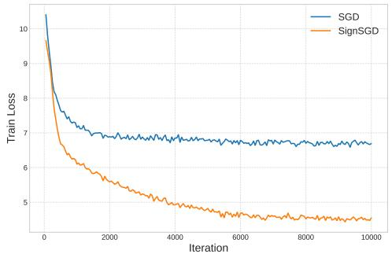
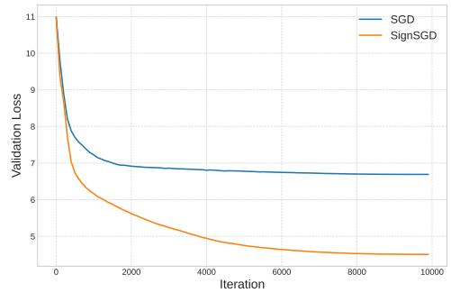
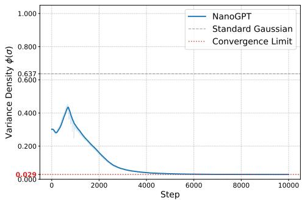
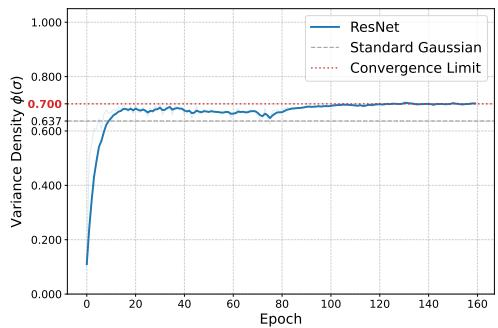
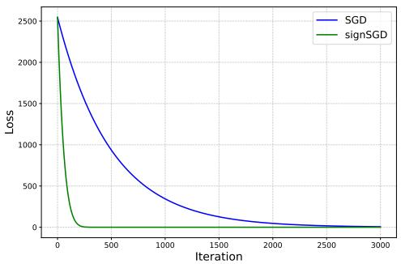
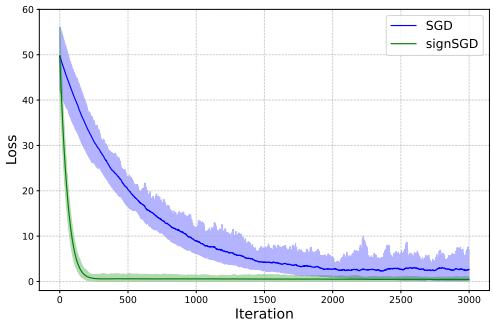

# When and Why SignSGD Outperforms SGD: A Theoretical Study Based on ℓ1-norm Lower Bounds

Hongyi Tao1,* Dingzhi Yu1,2,* Lijun Zhang1,2 

1State Key Laboratory of Novel Software Technology, Nanjing University, Nanjing 210023, China 2School of Artificial Intelligence, Nanjing University, Nanjing 210023, China 221220032@smail.nju.edu.cn,{yudz,zhanglj}@lamda.nju.edu.cn *Equal Contribution 

## Abstract

Sign-based optimization algorithms, such as SignSGD and Muon, have garnered significant attention for their remarkable performance in training large foundation models. Despite this empirical success, we still lack a theoretical understanding of when and why these sign-based methods outperform vanilla SGD. The core obstacle is that under standard smoothness and finite variance conditions, SGD is known to be minimax optimal for finding stationary points measured by ℓ2-norms, thereby fundamentally precluding any complexity gains for sign-based methods in standard settings. To overcome this barrier, we analyze sign-based optimizers leveraging ℓ -norm stationarity, ℓ -smoothness, and a separable noise model, which can better capture the coordinate-wise nature of signed updates. Under this distinct problem geometry, we derive matched upper and lower bounds for SignSGD and explicitly characterize the problem class in which SignSGD provably dominates SGD. Specifically, we compare the upper bound ofSignSGD with the lower bound ofSGD, illustrating that SignSGD effectively reduces the complexity by a factor of d under sparse noise, where d is the problem dimension. Furthermore, we elevate this framework to the matrix domain, providing an equivalent optimal lower bound for the Muon optimizer, proving that extending the sign operator to matrices preserves this optimal scaling with dimensionality. Finally, we bridge our theoretical bounds to practice, demonstrating that the theoretical superiority of SignSGD accurately predicts its faster convergence during the pretraining of a 124M parameter GPT-2 model. Code is available at https://github.com Dingzhen230/SignSGD_Outperforms_SGD. 

## 1 Introduction

Efficient and scalable stochastic optimization algorithms play an indispensable role in the huge success of large foundation models [Devlin et al., 2019, Brown et al., 2020, Achiam et al., 2023, Touvron et al., 2023, Team et al., 2023]. Among these, sign-based optimization algorithms, such as SignSGD [Bernstein et al., 2018] and Muon [Jordan et al., 2024], have attracted increasing focus due to substantial empirical edges over stochastic gradient descent (SGD) [Robbins and Monro, 1951]. SignSGD leverages 1-bit signed gradient to update the model, which naturally enjoys many favorable empirical properties in distributed environments [Bernstein et al., 2019] and low-precision training regimes [Yu et al., 2026a]. Muon optimizes using the matrix sign operator, implemented via Newton–Schulz iterations [Kovarik, 1970, Björck and Bowie, 1971]. Numerous empirical studies [Liu et al., 2025, Shah et al., 2025, Wen et al., 2025, Semenov et al., 2025] have shown its consistent speedup over AdamW [Loshchilov and Hutter, 2019], and it has become a new industrial paradigm for pretraining massive-scale large language models (LLMs) [Team et al., 2025, 2026, Zeng et al., 2025, 2026, Cheng et al., 2026, DeepSeek-AI, 2026]. 

The empirical success of sign-based optimizers has motivated a fruitful line of work that attempts to justify their advantages theoretically. From an optimization theory perspective, the convergence of sign-based methods under various assumptions has been extensively studied [Bernstein et al., 2018, 2019, Safaryan and Richtárik, 2021, Sun et al., 2023, Jiang et al., 2025b, Yu et al., 2026b]. However, a complete theoretical understanding of why sign-based optimizers outperform SGD remains elusive. The biggest obstacle preventing any theoretical advances is that SGD is already worst-case optimal when the objectivefunction is smooth and stochastic gradients are unbiased with bounded variance [Arjevani et al., 2023]. Under these standard assumptions, any first-order algorithm requires at least $\Omega ( \epsilon ^ { - 4 } )$ queries to find an ϵ-stationary point measured by the $\ell _ { 2 } { \mathrm { - n o r m } }$ , a complexity tightly matched by SGD [Ghadimi and Lan, 2013]. Consequently, evaluating the performance of sign-based methods under the aforementioned problem class and $\ell _ { 2 }$ -stationary measure inherently fails to deliver any provable gains we desire. 

In this paper, we systematically investigate when and why sign-based methods can outperform SGD by delving into a new problem class and performance measure that depart from the canonical setting in Arjevani et al. [2023]. Specifically, instead of the traditional $\ell _ { 2 }$ -geometry based on $\ell _ { 2 } -$ smoothness, finite variance, and $\ell _ { 2 } { \mathrm { - s t a t i o n a r i t y } } ,$ , we consider an $\ell _ { \infty }$ -geometry with $\ell _ { \infty }$ -smoothness, coordinate-wise finite variance, and $\ell _ { 1 } { \mathrm { - s t a t i o n a r i t y } }$ . This geometry shift is motivated by the insight that sign-based updates are intrinsically aligned with $\ell _ { \infty } { - } \ g$ eometry [Balles et al., 2020, Bernstein and Newhouse, 2024, Xie et al., 2025a,b]. Under this alternative geometry, we provide the first rigorous characterization of a problem class in which SignSGD provably outperforms SGD. 

To clarify this geometric shift, it is essential to highlight the distinction between these conditions. Standard ℓ2-smoothness assumes the loss landscape curves uniformly across all directions, while $\ell _ { \infty } -$ smoothness bounds the gradient change based on the maximum coordinate-wise distance, providing a hypercube-based geometric assumption that aligns with coordinate-wise, scaled updates of sign-based methods. Define $\overset { \vartriangle } { \boldsymbol { D } } _ { f } ( \mathbf { x } , \mathbf { y } ) : = f ( \mathbf { \bar { y } } ) - ( f ( \mathbf { x } ) + \langle \nabla f ( \mathbf { x } ) , \mathbf { y } - \mathbf { x } \rangle )$ as Bregman Divergence of $f _ { i }$ , the above two smooth model can be expressed as 

$$
| D _ {f} (\mathbf {x}, \mathbf {y}) | \leq \frac {L _ {2}}{2} \| \mathbf {y} - \mathbf {x} \| _ {2} ^ {2}, \quad \ell_ {2} \text {-smoothness}; \quad | D _ {f} (\mathbf {x}, \mathbf {y}) | \leq \frac {L _ {\infty}}{2} \| \mathbf {y} - \mathbf {x} \| _ {\infty} ^ {2}, \quad \ell_ {\infty} \text {-smoothness}.
$$

Furthermore, we adopt a separable noise model where variance is tracked independently for each coordinate via a vector $\pmb { \sigma } = [ \sigma _ { 1 } , \sigma _ { 2 } , \dots , \sigma _ { d } ]$ . This fine-grained characterization is more suitable for analyzing the highly imbalanced noise prevalent in modern deep learning [Sagun et al., 2017, Zhu et al., 2019, Zhang et al., 2020, Pan et al., 2022, Wu et al., 2022, Pan et al., 2024]: 

$$
\mathbb {E} \left[ \| \mathbf {g} _ {t} ^ {b} - \nabla f (\mathbf {x} _ {t}) \| _ {2} ^ {2} \mid \mathcal {F} _ {t - 1} \right] \leq \sigma^ {2},
$$

Standard noise model; 

$$
\forall i \in [ d ], \mathbb {E} \left[ \left| \mathbf {g} _ {t, i} ^ {b} - \nabla_ {i} f (\mathbf {x} _ {t}) \right| ^ {2} \mid \mathcal {F} _ {t - 1} \right] \leq \sigma_ {i} ^ {2},
$$

Separable noise model. 

Under this refined geometry, we develop a clean, self-contained lower bound analysis for SignSGD. We prove an $\ell _ { 1 }$ -norm lower bound that matches its upper bound, thereby giving a tight characterization of its convergence rate. We further derive an $\ell _ { 1 }$ -norm lower bound for SGD under the same setting. Comparing the upper bound ofSignSGD with the lower bound ofSGD reveals a strict separation: when the coordinate-wise noise is sparse or highly heterogeneous, SignSGD achieves a better dimension dependence. Finally, we extend this framework to matrix optimization and establish the first lower bound for Muon measured by the nuclear norm with matching upper bounds. 

The main contributions of this paper are summarized as follows. 

• Tight Bounds for SignSGD: Let $L _ { \infty }$ and σ denote the $\ell _ { \infty }$ -smooth Lipschitz constant and the noise variance vector, respectively. We establish that the convergence rate of SignSGD with a constant step size is: $\begin{array} { r } { \mathbb { E } \left[ \operatorname* { m i n } _ { t } \lVert \nabla f ( \mathbf { x } _ { t } ) \rVert _ { 1 } \right] = \Theta \left( \sqrt { L _ { \infty } \Delta \big / N } + \left( \lVert \sigma \rVert _ { 1 } ^ { 2 } L _ { \infty } \Delta \big / N \right) ^ { \frac { 1 } { 4 } } \right) } \end{array}$ 

• Provable Dimensional Gains of SignSGD over SGD: By comparing SignSGD’s upper bound with SGD’s lower bound, we prove that SignSGD achieves a strictly superior dimension dependence. We show that when the noise $\sigma$ is sparse, SignSGD’s complexity can be d times better than that of SGD. We validate these theoretical findings by demonstrating accelerated convergence during the pretraining of a 124M-parameter GPT-2 model. 

• Unified Extension to Matrix Optimizers: We elevate our theoretical framework into the matrix domain, mapping separable operations to orthogonalized matrix steps. By applying spectral norm smoothness and matrix variance, we provide equivalent upper and lower bounds for the recently proposed Muon optimizer [Jordan et al., 2024], proving for the first time that Muon handles large-scale matrix parameters just as effectively as SignSGD handles flat vectors. 

## 2 Related Work

Sign-based methods: vector optimizers The idea of using only gradient signs dates back at least to RProp [Riedmiller and Braun, 1993], while the modern stochastic formulation was introduced by Bernstein et al. [2018], who studied SignSGD and its momentum variant Signum for smooth non-convex optimization. Since SignSGD replaces the stochastic gradient by its coordinate-wise sign, its natural stationarity measure is $\ell _ { 1 }$ -norm rather than the usual $\ell _ { 2 }$ -norm. This geometry is also closely tied to communication efficiency, as one-bit sign updates and majority vote make SignSGD attractive in distributed learning environments [Bernstein et al., 2019, Jin et al., 2020, Safaryan and Richtárik, 2021]. 

A fundamental limitation of vanilla sign updates appears in non-smooth optimization. Even for simple convex non-smooth objectives, SignSGD can fail to converge because the discontinuity of the sign map may repeatedly select an unfavorable subgradient direction [Karimireddy et al., 2019, Xiao et al., 2023]. Error feedback repairs this issue by accumulating and correcting compression errors [Karimireddy et al., 2019]. More recently, StoSignSGD [Yu et al., 2026a] takes a different route by injecting unbiased structural stochasticity directly into the sign conversion. Its coordinate-wise max-buffer controls the stochastic sign scale, and its noise level is coupled with the gradient signal. This design preserves the numerical simplicity of sign updates while resolving the non-smooth non-convergence pathology of deterministic SignSGD. 

In smooth stochastic optimization, a separate line of work sharpens the convergence theory of signbased methods through momentum-based analyses [Sun et al., 2023, Jiang et al., 2025b], stochastic sign mechanisms [Jin et al., 2020, Safaryan and Richtárik, 2021], variance reduction [Chzhen and Schechtman, 2023, Jiang et al., 2024], and heavy-tailed noise analyses [Kornilov et al., 2025, Yu et al., 2026b]. Sign-based vector optimizers are also closely related to adaptive methods. Several works interpret the optimization dynamics of Adam [Kingma and Ba, 2015] through signed or normalized update directions [Balles and Hennig, 2018, Crawshaw et al., 2022, Kunstner et al., 2023, Peng et al., 2025], while Lion [Chen et al., 2023] has emerged as a representative momentum-based sign optimizer with strong empirical performance and growing theoretical support [Chen et al., 2024, Dong et al., 2024, Jiang and Zhang, 2025, Sfyraki and Wang, 2025, Yu et al., 2026b]. Most relevant to our motivation, Yu et al. [2026b] demonstrate that SignSGD- and Lion-type methods can provably outperform AdamW, especially in LLM training regimes where the noise is heavy-tailed [Zhang et al., 2020]. 

Sign-based methods: matrix optimizers Matrix sign optimizers extend the sign-based philosophy from coordinate-wise vector updates to structured matrix updates. The representative example is Muon [Jordan et al., 2024], which applies an orthogonalized matrix sign direction: for a matrix gradient $G = U \Sigma V ^ { \top }$ , the update direction is msign $( G ) = U V ^ { \top }$ . In practice, this matrix sign operation is efficiently approximated by Newton–Schulz iterations [Kovarik, 1970, Björck and Bowie, 1971]. Subsequent variants, such as MuonLight, incorporate Nesterov momentum, learning-rate alignment, and implementation refinements, and have been used or benchmarked in massive-scale language model training [Liu et al., 2025, Zeng et al., 2025, Team et al., 2025, Wen et al., 2025, Semenov et al., 2025, DeepSeek-AI, 2026]. These works suggest that matrix-level normalization can provide optimization benefits beyond coordinate-wise sign updates. 

Theoretical understanding of Muon and related matrix optimizers is still developing. Existing studies analyze Muon from several complementary perspectives, including spectral and nuclear-norm geometry, normalized matrix descent, preconditioning, connections to Adam-type methods, and empirical justifications for its superiority [Li and Hong, 2025, Shen et al., 2025, Chang et al., 2025, Si et al., 2025, Sfyraki and Wang, 2025, Chen et al., 2025, Huang et al., 2025, Li et al., 2025b, Qian et al., 2025, Tveit et al., 2025, Page et al., 2025, Mehta et al., 2025, Vasudeva et al., 2025a,b, Frans et al., 2025, Pan et al., 2025, Wang et al., 2025, Zhang and Gao, 2025, Zhang et al., 2025, Su, 2025, Crawshaw et al., 2025, Ma et al., 2026, Du and Su, 2026]. 

Lower complexity bounds Complexity lower bounds are the standard tool for determining whether an apparent algorithmic improvement is genuine or merely an artifact of analysis. The oraclecomplexity viewpoint goes back to the classical framework of Nemirovski and Yudin [1983], and was later developed extensively for stochastic convex optimization [Agarwal et al., 2012]. These results identify how noise, dimension, and geometry constrain the best possible rates in stochastic first-order optimization. 

For smooth non-convex optimization, the classical target is an ϵ-stationary point measured by $\| \nabla f ( x ) \| _ { 2 }$ . In the deterministic setting, Carmon et al. [2020, 2021] established sharp lower bounds for finding stationary points of smooth high-dimensional functions, while Chewi et al. [2023] showed that even in one dimension the query complexity depends delicately on whether the algorithm is deterministic or randomized and whether it can access first-order or zeroth-plus-first-order information. In the stochastic setting, Ghadimi and Lan [2013] gave the standard ${ \cal O } ( \dot { \epsilon } ^ { - 4 } )$ upper bound for SGD under unbiased bounded-variance gradients, and subsequent lower-bound work showed that this rate is essentially unavoidable. In particular, Drori and Shamir [2020] studied worst-case lower bounds for SGD itself, and Arjevani et al. [2023] proved that any stochastic first-order method requires $\Omega ( \epsilon ^ { - 4 } )$ stochastic-gradient queries under the standard bounded-variance model, with a corresponding $\Omega ( \epsilon ^ { - 3 } )$ lower bound under mean-squared smoothness. Thus, in the usual $\ell _ { 2 }$ -geometry, SGD is minimax optimal, and one should not expect a worst-case improvement without changing the geometry, the oracle model, or the stationarity criterion. 

A more recent line of work asks whether adaptive or sign-based methods can provably improve over SGD once the problem structure is refined. Jiang et al. [2025a] show that this is possible for AdaGrad under coordinate-wise smoothness and coordinate-wise noise assumptions: by adopting an $\ell _ { 1 }$ -stationarity measure, they prove both an AdaGrad upper bound and an SGD lower bound, yielding regimes where AdaGrad improves over SGD by a factor of the dimension. Complementarily, Crawshaw and Liu [2025] study lower bounds for adaptive gradient algorithms under $( L _ { 0 } , L _ { 1 } )$ )-smoothness, showing that several AdaGrad variants necessarily incur higher-order dependence on the relaxedsmoothness parameters. 

## 3 SignSGD: Upper Bound and Lower Bound

In this section, we give the first tight characterization of the convergence of SignSGD. 

## 3.1 Notations and Assumptions

We write [T] for $\{ 1 , 2 , \ldots , T \}$ , |x| for element-wise absolute value of $\mathbf { x } \in \mathbb { R } ^ { d }$ . The L-weighted vector norm for $\mathbf { L } \in \mathbb { R } _ { + } ^ { d }$ is defined as $\| \mathbf { x } \| _ { \mathbf { L } } ^ { 2 } : = \mathbf { x } ^ { \top } \mathrm { d i a g } ( \mathbf { L } ) \mathbf { x }$ . For vector descent methods, we study the optimization problem min $\mathbf { \phi } _ { \mathbf { X } \in \mathbb { R } ^ { d } } f ( \mathbf { x } )$ , where $f : \mathbb { R } ^ { d } $ R is differentiable. Given a point $\mathbf { x } \in \mathbb { R } ^ { d }$ we can only access the gradient $\overbar { \nabla } f ( \mathbf { x } ) = [ \nabla _ { 1 } f ( \mathbf { x } ) , \cdots , \nabla _ { d } f ( \mathbf { x } ) ] \in \mathbb { R } ^ { d }$ in a noisy manner which we will later define in Assumption 2a. We use sign (·) to denote the sign operator, and WLOG, use the convention sign $( 0 ) = 0$ , which our lower bound analysis may encounter. Below, we list some necessary assumptions. 

Assumption 1a (Lower bounded objective). The function f is bounded from below. There exists $f ^ { * } > - \infty$ such that $f ( \mathbf { x } ) \geq f ^ { * }$ , for all $\mathbf { x } \in \mathbb { R } ^ { d }$ . We further denote $\Delta = f ( \mathbf { x } _ { 0 } ) - \operatorname* { i n f } _ { \mathbf { x } \in \mathbb { R } ^ { d } } f ( \mathbf { x } )$ 

Assumption 2a (Separable noise model). At step t we observe a mini-batch of mutually independent gradients $\dot { \mathbf { \mu } } _ { g _ { t } } ~ = ~ \{ \mathbf { g } _ { t } ^ { 1 } , \cdots , \mathbf { g } _ { t } ^ { B } \}$ satisfying $\mathbb { E } \left[ \mathbf { g } _ { t } ^ { b } | \mathcal { F } _ { t - 1 } \right] \ = \ \nabla f ( \mathbf { x } _ { t } ) , \forall b \in \ [ B ]$ where $\mathcal { F } _ { t } = \sigma ( g _ { 1 } , \ldots , g _ { t } )$ denotes the natural filtration. Moreover, the coordinate-wise conditional variance is bounded separably: there exist non-negative constants $\pmb { \sigma } = [ \sigma _ { 1 } , \sigma _ { 2 } , \cdots , \sigma _ { d } ]$ such that 

$$
\mathbb {E} \left[ \left| \mathbf {g} _ {t, i} ^ {b} - \nabla_ {i} f (\mathbf {x} _ {t}) \right| ^ {2} \mid \mathcal {F} _ {t - 1} \right] \leq \sigma_ {i} ^ {2}, \quad \forall i \in [ d ], \forall b \in [ B ].
$$

Assumption 1a is standard and necessary for stochastic non-convex optimization [Arjevani et al., 2023]. Assumption 2a is widely used in analysis of adaptive methods like AdaGrad [Duchi et al., 2011], and sign-based methods like SignSGD [Bernstein et al., 2018, Li et al., 2025a, Jiang et al., 2025a, Yu et al., 2026b]. 

Assumption 3a $( \ell _ { \infty }$ -smoothness). The objective function f is $\ell _ { \infty }$ -smooth if there exists non-negative constant $L _ { \infty }$ such that for all $\mathbf { x } , \mathbf { y } \in \mathbb { R } ^ { d }$ , we have 

$$
| f (\mathbf {y}) - (f (\mathbf {x}) + \langle \nabla f (\mathbf {x}), \mathbf {y} - \mathbf {x} \rangle) | \leq \frac {L _ {\infty}}{2} \| \mathbf {y} - \mathbf {x} \| _ {\infty} ^ {2}.
$$

Algorithm 1 SignSGD [Bernstein et al., 2018]

1: Require iteration number T, initial point $x_{0}$ , batch size B, learning rate $\eta$ 2: for step t = 0 to T - 1 do

3: Compute stochastic gradient: $g_{t} = \frac{1}{B} \sum_{b=1}^{B} g_{t}^{b}$ 4: $x_{t+1} = x_{t} - \eta \text{ sign } (g_{t})$ 5: end for

Algorithm 2 Muon [Jordan et al., 2024]

1: Require iteration number T, initial point $W_{0}$ , batch size B, learning rate $\eta$ .

2: for step t = 0 to T - 1 do

3: Compute stochastic gradient: $G_{t} = \frac{1}{B} \sum_{b=1}^{B} G_{t}^{b}$ 4: $W_{t+1} = W_{t} - \eta \text{ msign } (G_{t})$ 5: end for 

Assumption 4a (Separable smoothness). The objective function $f$ is L-separable smooth if there exists a non-negative vector $\mathbf { L } = [ L _ { 1 } , L _ { 2 } , \ldots , L _ { d } ]$ such that for all $\mathbf { x } , \mathbf { y } \in \mathbb { R } ^ { d }$ , we have 

$$
| f (\mathbf {y}) - (f (\mathbf {x}) + \langle \nabla f (\mathbf {x}), \mathbf {y} - \mathbf {x} \rangle) | \leq \frac {1}{2} \| \mathbf {y} - \mathbf {x} \| _ {\mathbf {L}} ^ {2}.
$$

Separable smoothness (Assumption 4a) is widely used in analyses of SignSGD methods [Bernstein et al., 2018, 2019, Safaryan and Richtárik, 2021, Yu et al., 2026b], which naturally aligns with sign descent methods due to their separable nature. Balles et al. [2020] further discussed the relationship between Assumptions 3a and 4a, pointing out that the latter is a more generalized assumption. We present the following lemma to formalize this claim, whose proof can be found in Appendix A. Lemma 1. If f is L-separable smooth, then it is also $\ell _ { \infty }$ -smooth with $L _ { \infty } = \| \mathbf { L } \| _ { 1 }$ 

## 3.2 Upper Bound Theory of SignSGD

For completeness, the whole algorithmic procedure of SignSGD is listed in Algorithm 1. Though the upper bounds of SignSGD and its variants under various settings have been widely studied [Bernstein et al., 2018, Karimireddy et al., 2019, Sun et al., 2023, Jiang et al., 2024, 2025b, Jiang and Zhang, 2025, Yu et al., 2026b], we present the upper bound analysis here for consistency of the paper. 

Theorem 1. Run Algorithm 1 for T iterations under Assumptions 1a to 3a, by setting the hyperparameters as: 

$$
\eta = \sqrt {\frac {2 \Delta}{L _ {\infty} T}}, \quad B = \max \left\{1, \frac {\| \pmb {\sigma} \| _ {1} ^ {2}}{\Delta L _ {\infty}} T \right\}.\tag{1}
$$

Denote $N = B T$ as the total complexity, Algorithm 1 guarantees: 

$$
\mathbb {E} \left[ \frac {1}{T} \sum_ {t = 1} ^ {T} \| \nabla f (\mathbf {x} _ {t}) \| _ {1} \right] = \mathcal {O} \left(\sqrt {\frac {L _ {\infty} \Delta}{N}} + \left(\frac {\| \boldsymbol {\sigma} \| _ {1} ^ {2} L _ {\infty} \Delta}{N}\right) ^ {\frac {1}{4}}\right).\tag{2}
$$

## 3.3 Lower Bound Theory of SignSGD

After establishing an upper bound for Algorithm 1, we present a corresponding lower bound under the same conditions, which immediately verifies the sharpness of the upper bound in Theorem 1. Theorem 2. Fix $T \geq 1$ and a scaling parameter $\eta > 0$ , and consider running Algorithm 1 for T iterations with batch size $B .$ . For any given parameters $L _ { \infty } , \sigma$ , and $\Delta$ , there exists a function $f : \mathbb { R } ^ { d }  \mathbb { R }$ and a stochastic gradient oracle such that: 

1. f satisfies Assumptions 1a and 3a; 

2. the stochastic gradients gt satisfy Assumption 2a; 

3. denote $N = B T$ , the iterates generated by Algorithm 1 satisfy 

$$
\mathbb {E} \left[ \min _ {0 \leq t <   T} \| \nabla f (\mathbf {x} _ {t}) \| _ {1} \right] = \Omega \left(\sqrt {\frac {L _ {\infty} \Delta}{N}} + \left(\frac {\| \boldsymbol {\sigma} \| _ {1} ^ {2} L _ {\infty} \Delta}{N}\right) ^ {\frac {1}{4}}\right).\tag{3}
$$

To the best of our knowledge, Theorem 2 is the first known tight lower bound for the SignSGD algorithm that does not depend on the dimension d explicitly. We briefly illustrate our proof techniques below, with the full analysis postponed to Appendix B.2. 

Proof Sketch. To analyze the complexity of SignSGD, we divide the proof into five main steps. 

Step 1: Dimensional Decomposition. We first reduce the d-dimensional optimization into d parallel one-dimensional problems by constructing a separable objective function $\begin{array} { r } { f ( \mathbf { x } ) = \sum _ { i = 1 } ^ { d } p _ { i } ( \mathbf { x } _ { i } ) } \end{array}$ where $\mathbf { x } _ { i }$ denotes the i-th coordinate. Utilizing Lemma 1, we can safely distribute the global $\ell _ { \infty } .$ smoothness constant $L _ { \infty }$ and the suboptimality $\Delta$ across coordinates such that $\| { \bf L } \| _ { 1 } = L _ { \infty }$ and $\begin{array} { r } { \sum _ { i = 1 } ^ { d } \Delta _ { i } = \Delta } \end{array}$ 

Step 2: Constructing a 1D Resisting Oracle. We establish the worst-case lower bound for a single coordinate by constructing a “resisting oracle” [Nesterov et al., 2018]. Specifically, in the deterministic setting, we design a hard 1D function $p _ { i }$ that maintains a constant slope $p _ { i } ^ { \prime } ( x ) = - \epsilon$ across a sequence of $N$ query points. Consequently, any algorithm that fails to escape this predefined region is strictly prevented from finding an ϵ-stationary point, as the gradient magnitude is uniformly bounded away from zero. 

Step 3: Inducing Stall via Adversarial Bimodal Noise. To extend the 1D construction to the stochastic setting, we introduce an adversarial noise distribution. We define a specialized gradient oracle 

$$
\mathbb {P} \left(g _ {t} ^ {b} = 0 \mid x _ {t}\right) = \frac {\sigma_ {i} ^ {2}}{\sigma_ {i} ^ {2} + \epsilon^ {2}}, \quad \mathbb {P} \left(g _ {t} ^ {b} = \frac {\sigma_ {i} ^ {2} + \epsilon^ {2}}{\epsilon^ {2}} p _ {i} ^ {\prime} (x _ {t}) \mid x _ {t}\right) = \frac {\epsilon^ {2}}{\sigma_ {i} ^ {2} + \epsilon^ {2}}.\tag{4}
$$

This oracle is unbiased and has an exact variance of $\sigma _ { i } ^ { 2 } .$ . Crucially, this specific noise structure is designed to force the optimizer to stall, so that more total steps are needed to escape from previously defined “resisting oracle” when the variance $\sigma _ { i } ^ { 2 }$ is large. We yield a rigorous 1D complexity lower bound under stochastic setting as: 

$$
\mathbb {E} \left[ \min _ {t} | p ^ {\prime} (x _ {t}) | \right] \geq C \max \left\{\sqrt {\frac {L \Delta}{N}}, \left(\frac {L \Delta \sigma^ {2}}{N}\right) ^ {\frac {1}{4}} \right\}.
$$

Step 4: Dimensional Lifting and Adversarial Tuning. Finally, we aggregate the 1D lower bounds across all d dimensions. By adversarially tuning the coordinate-wise smoothness $( L _ { i } \propto \sigma _ { i } )$ and the suboptimality $( \Delta _ { i } )$ subject to their global constraints, we maximize the aggregated lower bound. This step successfully lifts the 1D result to the d-dimensional setting and recovers the exact dependency on $\scriptstyle \left\lceil \left. \pmb { \sigma } \right. \right.$ 1 as stated in the theorem. □ 

## 4 Why Sign Operator Works: Comparison Between SignSGD and SGD

In this section, we compare SignSGD with SGD from both theoretical and empirical perspectives. This comparison highlights the role of sign descent beyond its classical interpretation as a gradientcompression mechanism [Bernstein et al., 2018]: under Assumption 3a, the sign operator can also lead to provably improved complexity bounds. 

## 4.1 Theoretical Study: SignSGD Converges Provably Faster than SGD

We introduce the following $\ell _ { 1 } { \mathrm { - n o r m } }$ lower bound for SGD, whose proof can be found in Appendix C. This result characterizes the intrinsic hardness faced by SGD under our $\ell _ { \infty }$ -smooth geometry, and therefore serves as the key benchmark for comparing against the upper bound of $\mathrm { S i g n \bar { S } G D }$ 

Theorem 3 (SGD lower bound). Fix $T \geq 1$ and a scaling parameter $\eta > 0$ , and consider running vanilla SGD for T iterations with batch size $B = 1$ . For any given parameters $L _ { \infty } , \sigma .$ , and $\Delta .$ , there exists a function $f :  { \mathbb { R } ^ { d } } \to  { \mathbb { R } }$ and a stochastic gradient oracle such that: 

1. f satisfies Assumptions 1a and 3a; 

2. the stochastic gradients gt satisfy Assumption 2a; 

3. the iterates generated by vanilla SGD satisfy 

$$
\mathbb {E} \left[ \min _ {t \in [ T ]} \| \nabla f (\mathbf {x} _ {t}) \| _ {1} \right] = \Omega \left(\sqrt {\frac {d L _ {\infty} \Delta}{T}} + \left(\frac {d \| \boldsymbol {\sigma} \| _ {2} ^ {2} L _ {\infty} \Delta}{T}\right) ^ {\frac {1}{4}}\right).\tag{5}
$$

ProofSketch. We reduce the claim to the coordinate-wise lower bound of Jiang et al. [2025a]. Under Assumption 4a with smoothness vector $\mathbf { L } = \left( L _ { 1 } , \ldots , L _ { d } \right)$ and separable variance vector $\pmb { \sigma } = ( \sigma _ { 1 } , \ldots , \sigma _ { d } )$ , their result gives a hard instance for vanilla SGD as (24). 

The key observation is that Lemma 1 converts any L-separable smooth function into an $\ell _ { \infty }$ -smooth function with constant $\lVert \mathbf { L } \rVert _ { 1 }$ 1. Therefore, under the constraint $\| { \bf L } \| _ { 1 } = L _ { \infty }$ , the adversary is free to allocate the curvature across coordinates. Optimizing this allocation yields the desired lower bound under Assumption 3a. 

For the deterministic term in (24), we choose a highly imbalanced smoothness vector, for example $L _ { 1 } \geq \| \mathbf { L } \| _ { 1 } { \big / } _ { 2 }$ and $\| { \bf L } \| _ { 1 } = L _ { \infty }$ . Then $\| \mathbf { L } \| _ { \infty } = \Omega ( \breve { L } _ { \infty } )$ , and the coordinate-wise lower bound gives 

$$
\mathbb {E} \left[ \min _ {t \in [ T ]} \| \nabla f (\mathbf {x} _ {t}) \| _ {1} \right] = \Omega \left(\sqrt {\frac {d L _ {\infty} \Delta}{T}}\right).\tag{6}
$$

This shows that, in the worst case, SGD suffers an additional factor d even in the noiseless part of the complexity. 

For the stochastic term in (24), we allocate the curvature according to the noise profile by setting $L _ { i } = \left( \sigma _ { i } ^ { 2 } / \| \pmb { \sigma } \| _ { 2 } ^ { 2 } \right) L _ { \infty } , i \in [ d ]$ so that $\textstyle \sum _ { i = 1 } ^ { d } L _ { i } = L _ { \infty }$ and it yields that 

$$
\mathbb {E} \left[ \min _ {t \in [ T ]} \| \nabla f (\mathbf {x} _ {t}) \| _ {1} \right] = \Omega \left(\left(\frac {d \| \boldsymbol {\sigma} \| _ {2} ^ {2} L _ {\infty} \Delta}{T}\right) ^ {1 / 4}\right).\tag{7}
$$

The two constructions above give two valid $\ell _ { \infty }$ -smooth hard instances satisfying the same global parameters $L _ { \infty } , \sigma , \Delta$ . Taking the worse of them, and using max $\{ a , b \} = \Omega ( a + b )$ for non-negative quantities $a , b ,$ we obtain the result in Theorem 3. □ 

Comparison based on density function $\phi ( \pmb { \sigma } )$ . We proceed to compare the rate obtained in Theorem 1, which is the upper bound for SignSGD, and Theorem 3, which is the lower bound for SGD. We define the density function $\phi : \mathbb { R } ^ { d } \overset { = } {  }$ R for noise σ as follows: 

$$
\phi (\boldsymbol {\sigma}) = \frac {\| \boldsymbol {\sigma} \| _ {1} ^ {2}}{d \| \boldsymbol {\sigma} \| _ {2} ^ {2}} \in \left[ \frac {1}{d}, 1 \right].\tag{8}
$$

The above function ϕ is a measure of how “dense” a vector is. $\phi ( \pmb { \sigma } ) \approx { \mathrm { 1 } } / { \ o { d } }$ corresponds to highly skewed noise acting on only a few coordinates, whereas $\phi ( \pmb { \sigma } ) = 1$ represents perfectly uniform noise across all parameters. Now, we are able to compare SignSGD with SGD: to find an ϵ-stationary point in terms of the $\ell _ { 1 } { \mathrm { - n o r m } }$ , the required complexity is 

$$
\Theta \left(\frac {L _ {\infty} \Delta}{\epsilon^ {2}} + \frac {\| \boldsymbol {\sigma} \| _ {1} ^ {2} L _ {\infty} \Delta}{\epsilon^ {4}}\right) \quad \text { for   SignSGD },\tag{9}
$$

$$
\text { and } \quad \Omega \left(\frac {d L _ {\infty} \Delta}{\epsilon^ {2}} + \frac {\| \boldsymbol {\sigma} \| _ {1} ^ {2} L _ {\infty} \Delta}{\phi (\boldsymbol {\sigma}) \epsilon^ {4}}\right) \quad \text { for   SGD. }\tag{10}
$$

In view of the above two complexity bounds, we make the following observations. 

1. Deterministic term. For the first noiseless term, SignSGD reduces the complexity of SGD by a factor of d, revealing its superior dependence on the dimensional factors. 

2. Stochastic term. Since $^ 1 / d \le \phi ( \pmb { \sigma } ) \le 1$ , we underline that the second noise-dependent term of SignSGD is still strictly better than SGD. Moreover, when the distribution of the noise σ is sparse, SignSGD further reduces the required iteration count of SGD by a factor of d. 

As shown above, our results provide the first problem setting in which SignSGD achieves a provably better complexity bound (in terms of the dimensional dependence) than SGD. 

## 4.2 Empirical Study

In previous sections, we have discussed how SignSGD can potentially outperform SGD, especially under the $\ell _ { \infty }$ -smooth and sparse noise settings. To verify the theoretical results, we conduct a comprehensive empirical study for SignSGD and SGD under a variety of regimes. Our code is available at https://github.com/Dingzhen230/SignSGD_Outperforms_SGD. 

Figure 1: The training and validation loss for nanoGPT trained on C4.

## 4.2.1 Experiments on Numerical Examples

To amplify the difference between the two optimizers, we manually crafted two numerical example functions that fit into the extreme cases stated in Section 4.1. Due to limited space, the experimental results of these numerical examples are shown in Figure 3. Our findings are summarized as follows. 

1. Deterministic example. SignSGD outperforms SGD when facing $\mathbf { a } \ { \boldsymbol { \ell } } _ { \infty } .$ -geometry target and a sufficiently large d. Therefore, we set our target function as an imbalanced quadratic objective $f ( \mathbf { x } ) = 1 / 2 \sum _ { i = 1 } ^ { d } L _ { i } x _ { i } ^ { 2 }$ for $\mathbf { x } \in \mathbb { R } ^ { d }$ . To better demonstrate the difference, we set $d = 5 0 0 0$ and L1 = 1000, $\bar { L _ { i } } = 1 , i \ge 2$ . From Figure 3a we can observe that SGD performs worse than SignSGD because it is heavily penalized for the 1st coordinate where $L _ { 1 }$ dominates $L _ { \infty }$ 

2. Stochastic example. SignSGD outperforms SGD when facing sparse noise structure. We switch to a simple quadratic objective function $f ( x ) = \| { \bf x } \| _ { 2 } ^ { 2 } / 2 \mathrm { f o r } { \bf x } \in \mathbb { R } ^ { 1 0 0 }$ . Then we add Gaussian noise $\mathcal { N } ( \mathrm { 0 } , 1 0 0 ^ { 2 } )$ to only the first component of the gradient, which further results in maximizing the sparsity of σ as $\phi ( \pmb { \sigma } ) = 1 / \AA _ { d }$ under such a setting. Results in Figure 3b align with our findings, as SignSGD consistently outperforms SGD facing sparse noise. 

## 4.2.2 Experiments on nanoGPT Pretraining

Following the setup detailed in Appendix E, we train the nanoGPT model [Karpathy, 2022] on the C4 dataset [Raffel et al., 2020] using SGD and SignSGD [Bernstein et al., 2018]. The training and validation learning curves are shown in Figure 1. We observe a substantial performance gap between the two optimizers: while SGD achieves a rapid decrease in loss during the very early stages of training, its progress drastically slows down and plateaus shortly after. In contrast, SignSGD maintains a consistent and significantly faster convergence rate throughout the entire pretraining process. 

To understand the fundamental cause of this severe performance degradation in SGD, and to verify whether it stems from the highly sparse noise distribution identified in our theory, we leverage the empirical framework in Bernstein et al. [2018] to investigate the noise distributions in practice. Specifically, we track the dynamic evolution of the gradient noise density function $( \phi ( \pmb { \sigma } ) )$ during training and compare the optimization trajectory of our LLM against a standard CNN baseline (ResNet-20 [He et al., 2016] on CIFAR-10 [Krizhevsky et al., 2009]). The comparative results are presented in Figure 2. 

As illustrated in Figure 2, the noise distribution trends between CNN and LLM training exhibit a striking discrepancy. In the CNN training, the gradient noise starts relatively sparse but rapidly homogenizes during the early epochs, eventually stabilizing into a highly dense state $( \phi \approx 0 . 7 )$ . This aligns perfectly with classical assumptions where noise become more Gaussian-like over time, as the expected density ϕ for an isotropic Gaussian distribution analytically converges to $2 / \pi \approx 0 . 6 3 7$ Conversely, the LLM starts with a distribution with $\phi \approx 0 . 3$ and becomes increasingly sparse as training progresses, plunging to extreme levels of $\phi  0 . 0 3$ before the middle of training procedure. 

These empirical findings perfectly corroborate our theoretical insights by providing a unified explanation for the contrasting optimization dynamics observed across different modalities. In CNNs, where the gradient noise rapidly homogenizes into a dense state as visualized in Figure 2b, our theory correctly predicts that SignSGD and SGD should perform comparably, as seen in Bernstein et al. [2018]. Conversely, in LLM pretraining, Figure 2a shows that the noise distribution becomes increasingly sparse and heavily skewed. Standard SGD, whose updates are proportional to gradient magnitudes, is paralyzed by this extreme variance heterogeneity. Sign-based optimizers, however, safely navigate this extreme sparsity by utilizing coordinate-wise updates that are invariant to gradient magnitudes (yielding the decisive performance advantage seen in Figure 1). Our theoretical framework successfully reconciles both the performance parity in CNNs and the significant superiority of SignSGD in LLMs, confirming that sign-based methods are intrinsically more suited for LLMs as established in Section 4.1. 

(a) Noise density on nanoGPT.

(b) Noise density on ResNet-20.

Figure 2: Evolution of gradient noise sparsity density $\phi ( \pmb { \sigma } )$ along the training trajectory of SGD. Figure 2a shows noise density of LLM(nanoGPT-124m) tracked continuously across 10000 iterations. Figure 2b shows noise density of CNN (ResNet-20) tracked continuously across 160 epochs.

## 5 Matrix Optimizers

While vector-based sign methods effectively handle separable scaling, modern LLM architectures rely heavily on matrix multiplications. This motivates extending our framework to the matrix domain. The Muon algorithm is introduced by Jordan et al. [2024], and there lies essential similarity between SignSGD and Muon: Bernstein and Newhouse [2024] pointed out that SignSGD can be regarded as steepest descent under infinity norm, while Muon can be regarded as steepest descent under spectral norm. Now that we have already illustrated the edge of SignSGD in Section 4, we will show in the sequel that it’s natural to extend our previous framework from vectors to the matrix domain. 

## 5.1 Notations and Assumptions

We denote the set of $m \times m$ positive semi-definite (PSD) matrices by $\mathbb { S } ^ { m }$ . For any $\mathbf { X } \in \mathbb { R } ^ { m \times n }$ The matrix sign operator is defined as msign $\mathbf { \Xi } ( \mathbf { X } ) : = \mathbf { U } \mathbf { V } ^ { \top }$ , where $\mathbf { X } = \mathbf { U } \pmb { \Sigma } \mathbf { V } ^ { \top }$ is the (compact) singular value decomposition (SVD) of $\bar { \mathbf { X } } \in \mathbf { \bar { \mathbb { R } } } ^ { i n \times n }$ . Following common practice [Li and Hong, 2025, Shen et al., 2025, Sato et al., 2025, Chang et al., 2025, Pan et al., 2025], we assume zero numerical error in Newton–Schulz algorithm. The inner product between matrices X, $\mathbf { Y } \in \mathbb { R } ^ { m \times n }$ is denoted by $\langle \mathbf { Y } , \mathbf { X } \rangle : = \operatorname { T r } \left( \mathbf { Y } ^ { \top } \mathbf { X } \right)$ . We let $\left\| \cdot \right\| _ { \mathrm { o p } } , \left\| \cdot \right\| _ { * }$ , and $\lVert \cdot \rVert _ { \mathrm { F } }$ denote the matrix operator norm, nuclear norm, and Frobenius norm, respectively. For a vector $\mathbf { v } \in \mathbb { R } ^ { m }$ , diag $\mathbf { \tau } ( \mathbf { v } ) \in \mathbb { R } ^ { m \times m }$ denotes the rectangular diagonal matrix whose elements are given by $( \mathrm { d i a g } ( { \bf v } ) ) _ { i j } = v _ { i } \mathrm { i f } i = j$ and 0 otherwise. Throughout this section, we consider the matrix optimization problem minRm×n $F ( \mathbf { W } )$ under the following assumptions. 

Assumption 1b (Lower bounded objective). The function $F \in \mathbb { R } ^ { m \times n } $ R is bounded from below. There exists $F ^ { * } > - \infty$ such that ${ \bf { \bar { \mathit { F } } } } ( \mathbf { W } ) \geq { \bf { \mathit { F } } } ^ { * }$ holds for all $\mathbf { W } \in \mathbb { R } ^ { m \times n }$ . We further denote $\Delta = F ( \mathbf { W } _ { 0 } ) - \operatorname* { i n f } _ { \mathbf { W } \in \mathbb { R } ^ { m \times n } } F ( \mathbf { W } )$ 

Assumption 2b (Extension of Assumption 2a in matrix form). At step t we observe a mini-batch of mutually independent gradients $G _ { t } \overset { \cdot } { = } \{ \mathbf { G } _ { t } ^ { 1 } , \cdot \cdot \cdot , \mathbf { G } _ { t } ^ { B } \}$ satisfying E $\left[ \dot { \mathbf { G } } _ { t } ^ { b } | \mathcal { F } _ { t - 1 } \right] = \nabla f ( \mathbf { W } _ { t } ) , \forall b \in$ [B] where $\mathcal { F } _ { t } = \sigma ( G _ { 1 } , \dots , G _ { t } )$ denotes the natural filtration. Denote by $\mathbf { N } _ { t } ^ { b } = \mathbf { G } _ { t } ^ { b } - \nabla f ( \mathbf { W } _ { t } )$ , there exists $\pmb { \Sigma } \in \mathbb { S } ^ { m }$ such that 

$$
\mathbb {E} \left[ (\mathbf {N} _ {t} ^ {b}) (\mathbf {N} _ {t} ^ {b}) ^ {\top} | \mathcal {F} _ {t - 1} \right] \preceq \boldsymbol {\Sigma} ^ {2}, \quad \forall b \in [ B ].
$$

Assumption 3b (Spectral norm smoothness). We say $F : \mathbb { R } ^ { m \times n }  \mathbb { R }$ is $L _ { * }$ -spectral norm smooth if for any W, $\mathbf { W ^ { \prime } } \in \mathbf { \bar { \mathbb { R } } } ^ { m \times n }$ , it holds that 

$$
\left| F \left(\mathbf {W} ^ {\prime}\right) - \left(F (\mathbf {W}) + \langle \nabla F (\mathbf {W}), \mathbf {W} ^ {\prime} - \mathbf {W} \rangle\right) \right| \leq \frac {L _ {*}}{2} \| \mathbf {W} ^ {\prime} - \mathbf {W} \| _ {\mathrm{op}} ^ {2}.
$$

Assumption 2b can be viewed as an extension of Assumption 2a into matrix space, and has been widely used for analyzing Muon and other matrix Optimizers (An et al. [2025, Assumption 3], Pan et al. [2025, Assumption 3]). Assumption 3b accounts for the distinct structure of matrix parameters, which can be viewed as an extension of Assumption 3a into matrix space. 

## 5.2 Upper bound Theory of Muon

The Muon algorithm is presented in Algorithm 2. We state its upper bound below, with the proof deferred to Appendix D.1. 

Theorem 4 (Muon upper bound). Run Algorithm 2 for T iterations under Assumptions 1b to 3b, by setting the hyperparameters as: 

$$
\eta = \sqrt {\frac {2 \Delta}{L _ {*} T}}, \quad B = \max \left\{1, \frac {\| \pmb {\Sigma} \| _ {*} ^ {2}}{\Delta L _ {*}} T \right\}.\tag{11}
$$

Denote $N = B T$ as the total complexity, Algorithm 2 guarantees: 

$$
\mathbb {E} \left[ \frac {1}{T} \sum_ {t = 1} ^ {T} \| \nabla F (\mathbf {W} _ {t}) \| _ {*} \right] = \mathcal {O} \left(\sqrt {\frac {L _ {*} \Delta}{N}} + \left(\frac {\| \boldsymbol {\Sigma} \| _ {*} ^ {2} L _ {*} \Delta}{N}\right) ^ {1 / 4}\right).\tag{12}
$$

A key feature of Theorem 4 is that the bound does not depend explicitly on the matrix dimension min $\{ m , n \}$ , in sharp contrast to existing analyses of Muon that incur such dimension dependence [Li and Hong, 2025, Shen et al., 2025, Chang et al., 2025, Huang et al., 2025]. 

## 5.3 Lower bound Theory of Muon

After establishing the upper bound for Algorithm 2, we present a corresponding lower bound under the same conditions, which verifies the sharpness of Theorem 4. The proof is deferred to Appendix D.2. Theorem 5 (Muon lower bound). Fix $\bar { T } \geq 1$ and a scaling parameter $\eta > 0$ , and consider running Algorithm 2 for $T$ iterations with batch size B. For any given parameters $L _ { \infty } , \sigma$ , and $\Delta$ , there exists a function $f : \mathbb { R } ^ { m \times n }  \mathbb { R }$ and a stochastic gradient oracle such that: 

1. f satisfies Assumptions 1b and 3b; 

2. the stochastic gradients $\mathbf { G } _ { t }$ satisfy Assumption 2b; 

3. denote $N = B T$ , the iterates generated by Algorithm 2 satisfy 

$$
\mathbb {E} \left[ \min _ {t} \| \nabla F (\mathbf {W} _ {t}) \| _ {*} \right] = \mathcal {O} \left(\sqrt {\frac {L _ {*} \Delta}{N}} + \left(\frac {\| \boldsymbol {\Sigma} \| _ {*} ^ {2} L _ {*} \Delta}{N}\right) ^ {1 / 4}\right).\tag{13}
$$

To our best knowledge, Theorem 5 is the first lower complexity bound for Muon. Existing stochastic lower bounds, such as Arjevani et al. [2023], are formulated for vector-valued methods under Euclidean geometry, and thus do not directly apply to spectral-norm smoothness and nuclear-norm stationarity. Our theorem fills this gap and shows that the dimension-free upper bound in Theorem 4 is unimprovable in our matrix geometry. We outline the proof below. 

Proof Sketch. Our proof establishes a strict geometric and dynamic equivalence, mathematically reducing the Muon optimization in the matrix domain to the SignSGD optimization in the vector domain. We outline the proof in the following five steps. 

Step 1: Constructing the Matrix Objective with Orthogonal Alignments. We lift the hard vector instance $f ( \mathbf { x } )$ into the matrix domain by defining $\begin{array} { r } { F ( \mathbf { W } ) = \sum _ { i = 1 } ^ { m ^ { \setminus } } f _ { i } \big ( ( \mathbf { Q } \mathbf { W } \mathbf { P } ^ { \top } ) _ { i i } \big ) } \end{array}$ . The reasons why we addtionally introduce two orthogonal matrices $\mathbf { Q }$ and P here are: 

• Q is explicitly used to align the separable vector noise with the target matrix covariance $\Sigma ;$ 

• P is used as the projection matrix, projecting the $m \times n$ matrix into an $m \times m$ subspace. 

Step 2: Designing the Structured Matrix Oracle. To mirror the stochasticity, we construct a structured stochastic matrix gradient $\mathbf { G } _ { t } = \mathbf { Q } ^ { \top } \operatorname { d i a g } ( \mathbf { g } _ { t } ) \mathbf { P }$ . Driven by the alignment in Step 1, this specific design perfectly satisfies the required matrix noise covariance $\pmb { \Sigma } = \mathbf { Q } ^ { \top } \mathrm { d i a g } ( \pmb { \sigma } ) \mathbf { Q } .$ , while safely isolating the worst-case vector noise $\mathbf { g } _ { t }$ strictly within the projected subspace. 

Step 3: Establishing Trajectory Equivalence via SVD. Since $\mathbf { Q } ^ { \top }$ and P are naturally orthogonal matrices, they seamlessly form the left and right singular vectors of $\mathbf { G } _ { t }$ without altering the SVD transformation. Consequently, the SVD orthogonalization bypasses them and explicitly acts as a scalar sign (·) operator on the inner diagonal entries. Muon’s matrix update $\mathbf { W } _ { t + 1 } = \mathbf { W } _ { t } - \eta$ msign (Gt) mathematically collapses into the exact SignSGD vector update: $\mathbf { x } _ { t + 1 } = \mathbf { x } _ { t } - \eta \mathrm { s i g n } \left( \mathbf { g } _ { t } \right)$ 

Step 4: Aligning Geometric Constraints. We establish a rigorous one-to-one mapping between the governing metrics of both domains. We prove that the vector $\ell _ { \infty }$ -smoothness flawlessly translates to the matrix spectral norm smoothness $( L _ { * } = L _ { \infty } )$ , and the trace norm of the matrix noise covariance matches the $\ell _ { 1 }$ -norm of the vector noise $( \| \pmb { \Sigma } \| _ { * } = \| \pmb { \sigma } \| _ { 1 } )$ 

Step 5: Transferring the Complexity Bound. Finally, because orthogonal transformations preserve singular values, we show that the trace norm (nuclear norm) of the matrix gradient $\left\| \nabla F ( \bar { \mathbf { W } } _ { t } ) \right\|$ is precisely equivalent to the $\ell _ { 1 } { \mathrm { - n o r m } }$ of the vector gradient $\left\| \nabla f ( \mathbf { x } _ { t } ) \right\| .$ , enabling us to directly invoke the vector bounds from Theorem 2 to establish the exact $\Omega ( \cdot )$ lower bound for Muon. □ 

## 6 Conclusion

In this work, we bridge the longstanding gap between the empirical superiority of sign-based optimizers and their theoretical guarantees in non-convex stochastic optimization. By moving from the standard $\ell _ { 2 }$ framework to an $\ell _ { \infty }$ -smooth, coordinate-wise noise setting with $\ell _ { 1 }$ -stationarity, we give an optimal complexity-theoretic characterization of SignSGD and identify a problem geometry in which it provably outperforms SGD. Specifically, we prove matching upper and lower bounds for SignSGD, establish a strictly worse lower bound for SGD, and show that the resulting separation becomes most pronounced under sparse or highly heterogeneous noise. We further extend this framework to matrix optimization and obtain matching bounds for Muon under spectral norm smoothness and nuclear norm stationarity. Our empirical results corroborate these theoretical findings. Both controlled sparse noise toy problems and GPT-2 pretraining exhibit the skewed gradient noise structure leveraged by our theory, supporting the viewpoint that sign-based methods enjoy a genuine geometric advantage in real-world high-dimensional problems, such as LLM pretraining. 

## References

Josh Achiam, Steven Adler, Sandhini Agarwal, Lama Ahmad, Ilge Akkaya, Florencia Leoni Aleman, Diogo Almeida, Janko Altenschmidt, Sam Altman, Shyamal Anadkat, et al. GPT-4 technical report. arXiv preprint arXiv:2303.08774, 2023. 

Alekh Agarwal, Peter L Bartlett, Pradeep Ravikumar, and Martin J Wainwright. Information-theoretic lower bounds on the oracle complexity of stochastic convex optimization. IEEE Transactions on Information Theory, 58(5):3235–3249, 2012. 

Kang An, Yuxing Liu, Rui Pan, Yi Ren, Shiqian Ma, Donald Goldfarb, and Tong Zhang. ASGO: Adaptive structured gradient optimization. In Advances in Neural Information Processing Systems 38 (NeurIPS), pages 126775–126814, 2025. 

Yossi Arjevani, Yair Carmon, John C. Duchi, Dylan J Foster, Nathan Srebro, and Blake Woodworth. Lower bounds for non-convex stochastic optimization. Mathematical Programming, 199(1): 165–214, 2023. 

Lukas Balles and Philipp Hennig. Dissecting Adam: The sign, magnitude and variance of stochastic gradients. In Proceedings of the 35th International Conference on Machine Learning (ICML), pages 404–413, 2018. 

Lukas Balles, Fabian Pedregosa, and Nicolas Le Roux. The geometry of sign gradient descent. arXiv preprint arXiv:2002.08056, 2020. 

Jeremy Bernstein and Laker Newhouse. Old optimizer, new norm: An anthology. In OPT 2024: Optimizationfor Machine Learning, 2024. URL https://openreview.net/forum?id= ux18f5nOpD. 

Jeremy Bernstein, Yu-Xiang Wang, Kamyar Azizzadenesheli, and Animashree Anandkumar. SignSGD: Compressed optimisation for non-convex problems. In Proceedings of the 35th International Conference on Machine Learning (ICML), pages 560–569, 2018. 

Jeremy Bernstein, Jiawei Zhao, Kamyar Azizzadenesheli, and Anima Anandkumar. SignSGD with majority vote is communication efficient and fault tolerant. In International Conference on Learning Representations (ICLR), 2019. 

Åke Björck and Clazett Bowie. An iterative algorithm for computing the best estimate of an orthogonal matrix. SIAM Journal on Numerical Analysis, 8(2):358–364, 1971. 

Tom Brown, Benjamin Mann, Nick Ryder, Melanie Subbiah, Jared D Kaplan, Prafulla Dhariwal, Arvind Neelakantan, Pranav Shyam, Girish Sastry, Amanda Askell, Sandhini Agarwal, Ariel Herbert-Voss, Gretchen Krueger, Tom Henighan, Rewon Child, Aditya Ramesh, Daniel Ziegler, Jeffrey Wu, Clemens Winter, Chris Hesse, Mark Chen, Eric Sigler, Mateusz Litwin, Scott Gray, Benjamin Chess, Jack Clark, Christopher Berner, Sam McCandlish, Alec Radford, Ilya Sutskever, and Dario Amodei. Language models are few-shot learners. In Advances in Neural Information Processing Systems 33 (NeurIPS), pages 1877–1901, 2020. 

Yair Carmon, John C. Duchi, Oliver Hinder, and Aaron Sidford. Lower bounds for finding stationary points i. Mathematical Programming, 184(1):71–120, 2020. 

Yair Carmon, John C. Duchi, Oliver Hinder, and Aaron Sidford. Lower bounds for finding stationary points II: First-order methods. Mathematical Programming, 185(1):315–355, 2021. 

Da Chang, Yongxiang Liu, and Ganzhao Yuan. On the convergence of Muon and beyond. arXiv preprint arXiv:2509.15816, 2025. 

Lizhang Chen, Bo Liu, Kaizhao Liang, and Qiang Liu. Lion secretly solves a constrained optimization: As lyapunov predicts. In International Conference on Learning Representations (ICLR), pages 35404–35439, 2024. 

Lizhang Chen, Jonathan Li, and Qiang Liu. Muon optimizes under spectral norm constraints. arXiv preprint arXiv:2506.15054, 2025. 

Xiangning Chen, Chen Liang, Da Huang, Esteban Real, Kaiyuan Wang, Hieu Pham, Xuanyi Dong, Thang Luong, Cho-Jui Hsieh, Yifeng Lu, et al. Symbolic discovery of optimization algorithms. In Advances in Neural Information Processing Systems 36 (NeurIPS), pages 49205–49233, 2023. 

Xin Cheng, Wangding Zeng, Damai Dai, Qinyu Chen, Bingxuan Wang, Zhenda Xie, Kezhao Huang, Xingkai Yu, Zhewen Hao, Yukun Li, et al. Conditional memory via scalable lookup: A new axis of sparsity for large language models. arXiv preprint arXiv:2601.07372, 2026. 

Sinho Chewi, Sébastien Bubeck, and Adil Salim. On the complexity of finding stationary points of smooth functions in one dimension. In Proceedings ofThe 34th International Conference on Algorithmic Learning Theory (ALT), pages 358–374, 2023. 

Evgenii Chzhen and Sholom Schechtman. SignSVRG: fixing SignSGD via variance reduction. arXiv preprint arXiv:2305.13187, 2023. 

Michael Crawshaw and Mingrui Liu. Complexity lower bounds of adaptive gradient algorithms for non-convex stochastic optimization under relaxed smoothness. In International Conference on Learning Representations (ICLR), 2025. 

Michael Crawshaw, Mingrui Liu, Francesco Orabona, Wei Zhang, and Zhenxun Zhuang. Robustness to unbounded smoothness of generalized SignSGD. In Advances in Neural Information Processing Systems 35 (NeurIPS), pages 9955–9968, 2022. 

Michael Crawshaw, Chirag Modi, Mingrui Liu, and Robert M Gower. An exploration of non-Euclidean gradient descent: Muon and its many variants. arXiv preprint arXiv:2510.09827, 2025. 

DeepSeek-AI. DeepSeek-V4: Towards Highly Efficient Million-Token Context Intelligence, 2026. 

Jacob Devlin, Ming-Wei Chang, Kenton Lee, and Kristina Toutanova. BERT: Pre-training of deep bidirectional transformers for language understanding. In Proceedings ofthe 2019 Conference of the North American Chapter of the Association for Computational Linguistics: Human Language Technologies, pages 4171–4186, 2019. 

Yiming Dong, Huan Li, and Zhouchen Lin. Convergence rate analysis of LION. arXiv preprint arXiv:2411.07724, 2024. 

Yoel Drori and Ohad Shamir. The complexity of finding stationary points with stochastic gradient descent. In Proceedings ofthe 37th International Conference on Machine Learning (ICML), pages 2658–2667, 2020. 

Zhehang Du and Weijie Su. The newton-muon optimizer. arXiv preprint arXiv:2604.01472, 2026. 

John Duchi, Elad Hazan, and Yoram Singer. Adaptive subgradient methods for online learning and stochastic optimization. Journal ofMachine Learning Research (JMLR), 12(7), 2011. 

Kevin Frans, Pieter Abbeel, and Sergey Levine. What really matters in matrix-whitening optimizers? arXiv preprint arXiv:2510.25000, 2025. 

Saeed Ghadimi and Guanghui Lan. Stochastic first-and zeroth-order methods for nonconvex stochastic programming. SIAM Journal on Optimization, 23(4):2341–2368, 2013. 

Kaiming He, Xiangyu Zhang, Shaoqing Ren, and Jian Sun. Deep residual learning for image recognition. In Proceedings of the IEEE/CVF Conference on Computer Vision and Pattern Recognition (CVPR), pages 770–778, 2016. 

Jordan Hoffmann, Sebastian Borgeaud, Arthur Mensch, Elena Buchatskaya, Trevor Cai, Eliza Rutherford, Diego de Las Casas, Lisa Anne Hendricks, Johannes Welbl, Aidan Clark, Tom Hennigan, Eric Noland, Katie Millican, George van den Driessche, Bogdan Damoc, Aurelia Guy, Simon Osindero, Karen Simonyan, Erich Elsen, Jack W. Rae, Oriol Vinyals, and Laurent Sifre. Training compute-optimal large language models. In Advances in Neural Information Processing Systems 35 (NeurIPS), pages 30016–30030, 2022. 

Feihu Huang, Yuning Luo, and Songcan Chen. LiMuon: Light and fast Muon optimizer for large models. arXiv preprint arXiv:2509.14562, 2025. 

Ruichen Jiang, Devyani Maladkar, and Aryan Mokhtari. Provable complexity improvement of Ada-Grad over SGD: Upper and lower bounds in stochastic non-convex optimization. In Proceedings ofthe 38th Conference on Learning Theory (COLT), pages 3124–3158, 2025a. 

Wei Jiang and Lijun Zhang. Convergence analysis of the Lion optimizer in centralized and distributed settings. arXiv preprint arXiv:2508.12327, 2025. 

Wei Jiang, Sifan Yang, Wenhao Yang, and Lijun Zhang. Efficient sign-based optimization: Accelerating convergence via variance reduction. In Advances in Neural Information Processing Systems 37 (NeurIPS), pages 33891–33932, 2024. 

Wei Jiang, Dingzhi Yu, Sifan Yang, Wenhao Yang, and Lijun Zhang. Improved analysis for sign-based methods with momentum updates. arXiv preprint arXiv:2507.12091, 2025b. 

Richeng Jin, Yufan Huang, Xiaofan He, Huaiyu Dai, and Tianfu Wu. Stochastic-Sign SGD for federated learning with theoretical guarantees. arXiv preprint arXiv:2002.10940, 2020. 

Keller Jordan, Yuchen Jin, Vlado Boza, Jiacheng You, Franz Cesista, Laker Newhouse, and Jeremy Bernstein. Muon: An optimizer for hidden layers in neural networks, 2024. URL https: //kellerjordan.github.io/posts/muon/. 

Sai Praneeth Karimireddy, Quentin Rebjock, Sebastian Stich, and Martin Jaggi. Error feedback fixes SignSGD and other gradient compression schemes. In Proceedings ofthe 36th International Conference on Machine Learning (ICML), pages 3252–3261, 2019. 

Andrej Karpathy. NanoGPT, 2022. URL https://github.com/karpathy/nanoGPT. 

Diederik P. Kingma and Jimmy Ba. Adam: A method for stochastic optimization. In International Conference on Learning Representations (ICLR), 2015. 

Nikita Kornilov, Philip Zmushko, Andrei Semenov, Mark Ikonnikov, Alexander Gasnikov, and Alexander Beznosikov. Sign operator for coping with heavy-tailed noise in non-convex optimization: High probability bounds under $( L _ { 0 } , L _ { 1 } )$ )-smoothness. arXiv preprint arXiv:2502.07923, 2025. 

Zdislav Kovarik. Some iterative methods for improving orthonormality. SIAM Journal on Numerical Analysis, 7(3):386–389, 1970. 

Alex Krizhevsky, Geoffrey Hinton, et al. Learning multiple layers of features from tiny images.(2009), 2009. 

Frederik Kunstner, Jacques Chen, Jonathan Wilder Lavington, and Mark Schmidt. Noise is not the main factor behind the gap between SGD and Adam on transformers, but sign descent might be. In International Conference on Learning Representations (ICLR), 2023. 

Huan Li, Yiming Dong, and Zhouchen Lin. On the $O ( { \sqrt { d } } / T ^ { 1 / 4 } )$ convergence rate of rmsprop and its momentum extension measured by $\ell _ { 1 }$ norm. Journal of Machine Learning Research (JMLR), 26(131):1–25, 2025a. 

Jiaxiang Li and Mingyi Hong. A note on the convergence of Muon and further. arXiv preprint arXiv:2502.02900, 2025. 

Zichong Li, Liming Liu, Chen Liang, Weizhu Chen, and Tuo Zhao. NorMuon: Making Muon more efficient and scalable. arXiv preprint arXiv:2510.05491, 2025b. 

Jingyuan Liu, Jianlin Su, Xingcheng Yao, Zhejun Jiang, Guokun Lai, Yulun Du, Yidao Qin, Weixin Xu, Enzhe Lu, Junjie Yan, et al. Muon is scalable for LLM training. arXiv preprint arXiv:2502.16982, 2025. 

Ilya Loshchilov and Frank Hutter. Decoupled weight decay regularization. In International Conference on Learning Representations (ICLR), 2019. 

Jianhao Ma, Yu Huang, Yuejie Chi, and Yuxin Chen. Preconditioning benefits of spectral orthogonalization in Muon. arXiv preprint arXiv:2601.13474, 2026. 

Sushant Mehta, Raj Dandekar, Rajat Dandekar, and Sreedath Panat. Muon: Training and trade-offs with latent attention and moe. arXiv preprint arXiv:2509.24406, 2025. 

Arkadi Semen Nemirovski and David Berkovich Yudin. Problem complexity and method efficiency in optimization. Wiley-Interscience, 1983. 

Yurii Nesterov et al. Lectures on convex optimization, volume 137. Springer, 2018. 

Saurabh Page, Advait Joshi, and SS Sonawane. Muonall: Muon variant for efficient finetuning of large language models. arXiv preprint arXiv:2511.06086, 2025. 

Rui Pan, Haishan Ye, and Tong Zhang. Eigencurve: Optimal learning rate schedule for SGD on quadratic objectives with skewed Hessian spectrums. In International Conference on Learning Representations (ICLR), 2022. 

Rui Pan, Yuxing Liu, Xiaoyu Wang, and Tong Zhang. Accelerated convergence of stochastic heavy ball method under anisotropic gradient noise. In International Conference on Learning Representations (ICLR), pages 55989–56028, 2024. 

Rui Pan, Yang Luo, Yuxing Liu, Yang You, and Tong Zhang. Unbiased gradient low-rank projection. arXiv preprint arXiv:2510.17802, 2025. 

Hanyang Peng, Shuang Qin, Yue Yu, Fangqing Jiang, Hui Wang, and Zhouchen Lin. Simple convergence proof of Adam from a sign-like descent perspective. arXiv preprint arXiv:2507.05966, 2025. 

Xun Qian, Hussein Rammal, Dmitry Kovalev, and Peter Richtarik. Muon is provably faster with momentum variance reduction. arXiv preprint arXiv:2512.16598, 2025. 

Colin Raffel, Noam Shazeer, Adam Roberts, Katherine Lee, Sharan Narang, Michael Matena, Yanqi Zhou, Wei Li, and Peter J. Liu. Exploring the limits of transfer learning with a unified text-to-text transformer. Journal ofMachine Learning Research (JMLR), 21(140):1–67, 2020. 

Martin Riedmiller and Heinrich Braun. A direct adaptive method for faster backpropagation learning: The RPROP algorithm. In IEEE International Conference on Neural Networks, pages 586–591. IEEE, 1993. 

Herbert Robbins and Sutton Monro. A stochastic approximation method. The Annals ofMathematical Statistics, pages 400–407, 1951. 

Mher Safaryan and Peter Richtárik. Stochastic sign descent methods: New algorithms and better theory. In Proceedings of the 38th International Conference on Machine Learning (ICML), pages 9224–9234, 2021. 

Levent Sagun, Utku Evci, V Ugur Guney, Yann Dauphin, and Leon Bottou. Empirical analysis of the Hessian of over-parametrized neural networks. arXiv preprint arXiv:1706.04454, 2017. 

Naoki Sato, Hiroki Naganuma, and Hideaki Iiduka. Convergence bound and critical batch size of Muon optimizer. arXiv preprint arXiv:2507.01598, 2025. 

Andrei Semenov, Matteo Pagliardini, and Martin Jaggi. Benchmarking optimizers for large language model pretraining. arXiv preprint arXiv:2509.01440, 2025. 

Maria-Eleni Sfyraki and Jun-Kun Wang. Lions and Muons: Optimization via stochastic frank-wolfe. arXiv preprint arXiv:2506.04192, 2025. 

Ishaan Shah, Anthony M Polloreno, Karl Stratos, Philip Monk, Adarsh Chaluvaraju, Andrew Hojel, Andrew Ma, Anil Thomas, Ashish Tanwer, Darsh J Shah, et al. Practical efficiency of Muon for pretraining. arXiv preprint arXiv:2505.02222, 2025. 

Wei Shen, Ruichuan Huang, Minhui Huang, Cong Shen, and Jiawei Zhang. On the convergence analysis of Muon. arXiv preprint arXiv:2505.23737, 2025. 

Chongjie Si, Debing Zhang, and Wei Shen. Adamuon: Adaptive Muon optimizer. arXiv preprint arXiv:2507.11005, 2025. 

Weijie Su. Isotropic curvature model for understanding deep learning optimization: Is gradient orthogonalization optimal? arXiv preprint arXiv:2511.00674, 2025. 

Tao Sun, Qingsong Wang, Dongsheng Li, and Bao Wang. Momentum ensures convergence of SIGNSGD under weaker assumptions. In Proceedings ofthe 40th International Conference on Machine Learning (ICML), pages 33077–33099, 2023. 

Gemini Team, Rohan Anil, Sebastian Borgeaud, Jean-Baptiste Alayrac, Jiahui Yu, Radu Soricut, Johan Schalkwyk, Andrew M Dai, Anja Hauth, Katie Millican, et al. Gemini: a family of highly capable multimodal models. arXiv preprint arXiv:2312.11805, 2023. 

Kimi Team, Yifan Bai, Yiping Bao, Guanduo Chen, Jiahao Chen, Ningxin Chen, Ruijue Chen, Yanru Chen, Yuankun Chen, Yutian Chen, et al. Kimi K2: Open agentic intelligence. arXiv preprint arXiv:2507.20534, 2025. 

Kimi Team, Tongtong Bai, Yifan Bai, Yiping Bao, SH Cai, Yuan Cao, Y Charles, HS Che, Cheng Chen, Guanduo Chen, et al. Kimi K2.5: Visual Agentic Intelligence. arXiv preprint arXiv:2602.02276, 2026. 

Hugo Touvron, Thibaut Lavril, Gautier Izacard, Xavier Martinet, Marie-Anne Lachaux, Timothée Lacroix, Baptiste Rozière, Naman Goyal, Eric Hambro, Faisal Azhar, et al. Llama: Open and efficient foundation language models. arXiv preprint arXiv:2302.13971, 2023. 

Amund Tveit, Bjørn Remseth, and Arve Skogvold. Muon optimizer accelerates grokking. arXiv preprint arXiv:2504.16041, 2025. 

Bhavya Vasudeva, Puneesh Deora, Yize Zhao, Vatsal Sharan, and Christos Thrampoulidis. How Muon’s spectral design benefits generalization: A study on imbalanced data. arXiv preprint arXiv:2510.22980, 2025a. 

Bhavya Vasudeva, Jung Whan Lee, Vatsal Sharan, and Mahdi Soltanolkotabi. The rich and the simple: On the implicit bias of Adam and SGD. In Advances in Neural Information Processing Systems 38 (NeurIPS), page to appear, 2025b. 

Shuche Wang, Fengzhuo Zhang, Jiaxiang Li, Cunxiao Du, Chao Du, Tianyu Pang, Zhuoran Yang, Mingyi Hong, and Vincent YF Tan. Muon outperforms Adam in tail-end associative memory learning. arXiv preprint arXiv:2509.26030, 2025. 

Kaiyue Wen, David Hall, Tengyu Ma, and Percy Liang. Fantastic pretraining optimizers and where to find them. arXiv preprint arXiv:2509.02046, 2025. 

Lei Wu, Mingze Wang, and Weijie Su. The alignment property of sgd noise and how it helps select flat minima: A stability analysis. In Advances in Neural Information Processing Systems 35 (NeurIPS), pages 4680–4693, 2022. 

Nachuan Xiao, Xiaoyin Hu, and Kim-Chuan Toh. Stochastic subgradient methods with guaranteed global stability in nonsmooth nonconvex optimization. arXiv preprint arXiv:2307.10053, 2023. 

Shuo Xie, Mohamad Amin Mohamadi, and Zhiyuan Li. Adam exploits ℓ∞-geometry of loss landscape via coordinate-wise adaptivity. In International Conference on Learning Representations (ICLR), pages 7937–7965, 2025a. 

Shuo Xie, Tianhao Wang, Beining Wu, and Zhiyuan Li. A tale of two geometries: Adaptive optimizers and non-Euclidean descent. arXiv preprint arXiv:2511.20584, 2025b. 

Dingzhi Yu, Rui Pan, Yuxing Liu, and Tong Zhang. StoSignSGD: Unbiased Structural Stochasticity Fixes SignSGD for Training Large Language Models. arXiv preprint arXiv:2604.15416, 2026a. 

Dingzhi Yu, Hongyi Tao, Yuanyu Wan, Luo Luo, and Lijun Zhang. Sign-based optimizers are effective under heavy-tailed noise. arXiv preprint arXiv:2602.07425, 2026b. 

Aohan Zeng, Xin Lv, Qinkai Zheng, Zhenyu Hou, Bin Chen, Chengxing Xie, Cunxiang Wang, Da Yin, Hao Zeng, Jiajie Zhang, et al. GLM-4.5: Agentic, reasoning, and coding (arc) foundation models. arXiv preprint arXiv:2508.06471, 2025. 

Aohan Zeng, Xin Lv, Zhenyu Hou, Zhengxiao Du, Qinkai Zheng, Bin Chen, Da Yin, Chendi Ge, Chengxing Xie, Cunxiang Wang, et al. GLM-5: from vibe coding to agentic engineering. arXiv preprint arXiv:2602.15763, 2026. 

Jingzhao Zhang, Sai Praneeth Karimireddy, Andreas Veit, Seungyeon Kim, Sashank Reddi, Sanjiv Kumar, and Suvrit Sra. Why are adaptive methods good for attention models? In Advances in Neural Information Processing Systems 33 (NeurIPS), pages 15383–15393, 2020. 

Minxin Zhang, Yuxuan Liu, and Hayden Schaeffer. Adagrad meets Muon: Adaptive stepsizes for orthogonal updates. arXiv preprint arXiv:2509.02981, 2025. 

Xinwen Zhang and Hongchang Gao. On provable benefits of Muon in federated learning. arXiv preprint arXiv:2510.03866, 2025. 

Zhanxing Zhu, Jingfeng Wu, Bing Yu, Lei Wu, and Jinwen Ma. The anisotropic noise in stochastic gradient descent: Its behavior of escaping from sharp minima and regularization effects. In Proceedings of the 36th International Conference on Machine Learning (ICML), pages 7654–7663, 2019. 

## A Proof of Lemma 1

Suppose f is L-separable smooth, we have 

$$
\begin{array}{r l} & {| f (\mathbf {y}) - (f (\mathbf {x}) + \langle \nabla f (\mathbf {x}), \mathbf {y} - \mathbf {x} \rangle) | \leq \frac {1}{2} \| \mathbf {y} - \mathbf {x} \| _ {\mathbf {L}} ^ {2} = \frac {1}{2} \sum_ {i = 1} ^ {d} L _ {i} (\mathbf {y} _ {i} - \mathbf {x} _ {i}) ^ {2}} \\ & {\qquad \leq \frac {1}{2} \sum_ {i = 1} ^ {d} L _ {i} \| \mathbf {y} - \mathbf {x} \| _ {\infty} ^ {2} = \frac {\| \mathbf {L} \| _ {1}}{2} \| \mathbf {y} - \mathbf {x} \| _ {\infty} ^ {2}.} \end{array}
$$

Therefore $f$ also satisfies Assumption 3a with $L _ { \infty } = \| \mathbf { L } \| _ { 1 }$ 1. 

## B Analysis for SignSGD

## B.1 Upper Bound for SignSGD

Proof of Theorem 1. Under Assumption 3a, we have: 

$$
\begin{array}{r l} {f (\mathbf {x} _ {t + 1}) \leq} & {f (\mathbf {x} _ {t}) + \langle \nabla f (\mathbf {x} _ {t}), \mathbf {x} _ {t + 1} - \mathbf {x} _ {t} \rangle + \frac {L _ {\infty}}{2} \| \mathbf {x} _ {t + 1} - \mathbf {x} _ {t} \| _ {\infty} ^ {2}} \\ {=} & {f (\mathbf {x} _ {t}) - \langle \nabla f (\mathbf {x} _ {t}), \eta \mathrm{sign} (\mathbf {g} _ {t}) \rangle + \frac {\eta^ {2} L _ {\infty}}{2}} \\ {=} & {f (\mathbf {x} _ {t}) + \langle \nabla f (\mathbf {x} _ {t}), \eta (\mathrm{sign} (\nabla f (\mathbf {x} _ {t})) - \mathrm{sign} (\mathbf {g} _ {t})) \rangle} \\ & {- \langle \nabla f (\mathbf {x} _ {t}), \eta \mathrm{sign} (\nabla f (\mathbf {x} _ {t})) \rangle + \frac {\eta^ {2} L _ {\infty}}{2}} \\ {=} & {f (\mathbf {x} _ {t}) + \langle \nabla f (\mathbf {x} _ {t}), \eta (\mathrm{sign} (\nabla f (\mathbf {x} _ {t})) - \mathrm{sign} (\mathbf {g} _ {t})) \rangle - \eta \| \nabla f (\mathbf {x} _ {t}) \| _ {1} + \frac {\eta^ {2} L _ {\infty}}{2}} \\ {\leq} & {f (\mathbf {x} _ {t}) + 2 \eta \| \nabla f (\mathbf {x} _ {t}) - \mathbf {g} _ {t} \| _ {1} - \eta \| \nabla f (\mathbf {x} _ {t}) \| _ {1} + \frac {\eta^ {2} L _ {\infty}}{2},} \end{array}
$$

where the last inequality is due to 

$$
\begin{array}{l} \langle \nabla f (\mathbf {x} _ {t}), \eta (\text {sign} (\nabla f (\mathbf {x} _ {t})) - \text {sign} (\mathbf {g} _ {t})) \rangle \\ = \sum_ {i = 1} ^ {d} \nabla_ {i} f (\mathbf {x} _ {t}) * \eta (\text {sign} (\nabla_ {i} f (\mathbf {x} _ {t})) - \text {sign} (\mathbf {g} _ {t, i})) \\ \leq \sum_ {i = 1} ^ {d} 2 \eta | \nabla_ {i} f (\mathbf {x} _ {t}) | * \mathbb {I} (\text {sign} (\nabla_ {i} f (\mathbf {x} _ {t})) \neq \text {sign} (\mathbf {g} _ {t, i})) \\ \leq 2 \eta \sum_ {i = 1} ^ {d} | \nabla_ {i} f (\mathbf {x} _ {t}) - \mathbf {g} _ {t, i} | * \mathbb {I} (\text {sign} (\nabla_ {i} f (\mathbf {x} _ {t})) \neq \text {sign} (\mathbf {g} _ {t, i})) \\ \leq 2 \eta \sum_ {i = 1} ^ {d} | \nabla_ {i} f (\mathbf {x} _ {t}) - \mathbf {g _ {t , i}} | = 2 \eta \| \nabla f (\mathbf {x} _ {t}) - \mathbf {g} _ {t} \| _ {1}. \end{array}
$$

Rearranging the obtained relation and summing up yields 

$$
\mathbb {E} \left[ \frac {1}{T} \sum_ {t = 1} ^ {T} \| \nabla f (\mathbf {x} _ {t}) \| _ {1} \right] \leq \frac {\Delta}{\eta T} + 2 \mathbb {E} \left[ \frac {1}{T} \sum_ {t = 1} ^ {T} \| \nabla f (\mathbf {x} _ {t}) - \mathbf {g} _ {t} \| _ {1} \right] + \frac {\eta L _ {\infty}}{2}.\tag{14}
$$

we denote $\xi _ { t } = \nabla f ( \mathbf { x } _ { t } ) - \mathbf { g } _ { t }$ as the noise of gradient in iteration t. Due to i.i.d characteristic of $\xi _ { t }$ , we have: 

$$
\begin{array}{c} \mathbb {E} \left[ \frac {1}{T} \sum_ {t = 1} ^ {T} \| \nabla f (\mathbf {x} _ {t}) - \mathbf {g} _ {t} \| _ {1} \right] = \mathbb {E} \left[ \frac {1}{T} \sum_ {t = 1} ^ {T} \| \xi_ {t} \| _ {1} \right] = \frac {1}{T} \sum_ {t = 1} ^ {T} \mathbb {E} \left[ \| \xi_ {t} \| _ {1} \right] \\ = \frac {1}{T} \sum_ {t = 1} ^ {T} \sum_ {i = 1} ^ {d} \mathbb {E} [ | \xi_ {t, i} | ] \leq \frac {\| \boldsymbol {\sigma} \| _ {1}}{\sqrt {B}}, \end{array}\tag{15}
$$

where the inequality follows from Jensen’s inequality for the variance of the mini-batch mean. Putting (15) back to (14), and setting $\eta = \sqrt { 2 \Delta / L _ { \infty } T }$ , We get: 

$$
\mathbb {E} \left[ \frac {1}{T} \sum_ {t = 1} ^ {T} \| \nabla f (\mathbf {x} _ {t}) \| _ {1} \right] \leq \sqrt {\frac {2 \Delta L _ {\infty}}{T}} + 2 \frac {\| \boldsymbol {\sigma} \| _ {1}}{\sqrt {B}}.\tag{16}
$$

If the first term dominates, which means 

$$
\sqrt {\frac {2 \Delta L _ {\infty}}{T}} \geq 2 \| \boldsymbol {\sigma} \| _ {1} \geq 2 \frac {\| \boldsymbol {\sigma} \| _ {1}}{\sqrt {B}},\tag{17}
$$

by setting $B = 1$ , we have 

$$
\mathbb {E} \left[ \frac {1}{T} \sum_ {t = 1} ^ {T} \| \nabla f (\mathbf {x} _ {t}) \| _ {1} \right] \leq \sqrt {\frac {2 \Delta L _ {\infty}}{T}} + 2 \frac {\| \boldsymbol {\sigma} \| _ {1}}{\sqrt {B}} \leq (2 + \sqrt {2}) \sqrt {\frac {\Delta L _ {\infty}}{N}}.
$$

Otherwise, we set $B = \| \pmb { \sigma } \| _ { 1 } ^ { 2 } / \Delta L _ { \infty } T$ , which implies 

$$
\sqrt {\frac {2 \Delta L _ {\infty}}{T}} = \left(\frac {4 \| \boldsymbol {\sigma} \| _ {1} ^ {2} \Delta L _ {\infty}}{N}\right) ^ {\frac {1}{4}}.\tag{18}
$$

Plugging (18) into (16), we get 

$$
\mathbb {E} \left[ \frac {1}{T} \sum_ {t = 1} ^ {T} \| \nabla f (\mathbf {x} _ {t}) \| _ {1} \right] \leq \left(\frac {4 \| \boldsymbol {\sigma} \| _ {1} ^ {2} \Delta L _ {\infty}}{N}\right) ^ {\frac {1}{4}} + 2 \left(\frac {\| \boldsymbol {\sigma} \| _ {1} ^ {2} \Delta L _ {\infty}}{N}\right) ^ {\frac {1}{4}}.\tag{19}
$$

Combining the above two cases together, we have 

$$
\mathbb {E} \left[ \frac {1}{T} \sum_ {t = 1} ^ {T} \| \nabla f (\mathbf {x} _ {t}) \| _ {1} \right] = \mathcal {O} \left(\sqrt {\frac {\Delta L _ {\infty}}{N}} + \frac {(\| \boldsymbol {\sigma} \| _ {1}) ^ {\frac {1}{2}} (\Delta L _ {\infty}) ^ {\frac {1}{4}}}{(N) ^ {\frac {1}{4}}}\right).
$$

This completes the proof. 

## B.2 Lower Bound for SignSGD

To exploit the separable nature of SignSGD before generalizing to d dimensions, we start by bounding the complexity of Algorithm 1 in finding stationary points in one dimension: 

Lemma 2. For any positive integer n, suppose that ϵ satisfies 

$$
\epsilon \leq \frac {1}{2 \sqrt {n}}\tag{20}
$$

Let $x _ { 1 } \in \mathbb { R }$ and $x _ { t } = x _ { 1 } + ( t - 1 ) \eta$ for any $2 \leq t \leq n + 1$ . Then there exists a function $p : \mathbb { R } $ R such that: $( \mathrm { i } ) p$ has a 1-Lipschitz gradient; (ii) $p ( x _ { 1 } ) -$ inf $p \leq 1 \ ( \mathrm { i i i } ) p ^ { \prime } ( x _ { t } ) = - \epsilon$ for any $t \in [ 1 , n ]$ 

Proof. We construct the function p as: 

$$
p (x) = \left\{ \begin{array}{l l} - \epsilon (x - x _ {1}) & x \in (- \infty , x _ {1} ]; \\ \phi_ {t, \epsilon} (x) + c _ {t} & x \in (x _ {t}, x _ {t + 1} ]; \\ \frac {1}{2} (x - x _ {t + 1}) ^ {2} - \epsilon (x - x _ {t + 1}) + c _ {N + 1} & x \in (x _ {n + 1}, \infty), \end{array} \right.
$$

where the values $\{ c _ { t } \} _ { t = 1 } ^ { n }$ are chosen to ensure that the function p is continuous. The function $\phi _ { t , \epsilon } ( x )$ is defined as below: 

$$
\phi_ {t, \epsilon} (x) = \left\{ \begin{array}{l l} \frac {1}{2} (x - x _ {t}) ^ {2} - \epsilon (x - x _ {t}) & x \in \left(x _ {t}, \frac {x _ {t} + x _ {t + 1}}{2} \right]; \\ - \frac {1}{2} (x - x _ {t + 1}) ^ {2} - \epsilon (x - x _ {t + 1}) & \\ + \frac {(x _ {t + 1} - x _ {t}) ^ {2}}{4} - (x _ {t + 1} - x _ {t}) \epsilon & x \in \left(\frac {x _ {t} + x _ {t + 1}}{2}, x _ {t + 1} \right]. \end{array} \right.
$$

Without loss of generality we can assume $x _ { 1 } = \eta$ , otherwise we just need to perform a translation to our function p. Plugging in $x _ { t } = t \eta$ , we have: 

$$
\phi_ {t, \epsilon} (x) = \left\{ \begin{array}{l l} \frac {1}{2} (x - t \eta) ^ {2} - \epsilon (x - t \eta) & x \in \left(x _ {t}, \frac {x _ {t} + x _ {t + 1}}{2} \right]; \\ - \frac {1}{2} (x - (t + 1) \eta) ^ {2} - \epsilon (x - (t + 1) \eta) + \frac {\eta^ {2}}{4} - \eta \epsilon & x \in \left(\frac {x _ {t} + x _ {t + 1}}{2}, x _ {t + 1} \right]. \end{array} \right.
$$

Further, we can give the value $c _ { t }$ as follows: 

$$
c _ {1} = 0, \quad c _ {t + 1} = t \left(\frac {1}{4} \eta^ {2} - \eta \epsilon\right).\tag{21}
$$

From the definition of $p ,$ we have 

$$
p (x) \geq \left\{ \begin{array}{l l} 0, & x \in (- \infty , x _ {1} ]; \\ \min \left\{c _ {t} - \frac {1}{2} \epsilon^ {2}, c _ {t + 1} \right\}, & x \in (x _ {t}, x _ {t + 1} ]; \\ c _ {n + 1} - \frac {1}{2} \epsilon^ {2}, & x \in (x _ {n + 1}, + \infty), \end{array} \right.
$$

which can be written as 

$$
\begin{array}{l} \inf p \geq \min _ {t} c _ {t} - \frac {1}{2} \epsilon^ {2} \\ = \min \left\{0, n \left(\frac {1}{4} \eta^ {2} - \eta \epsilon\right) \right\} - \frac {1}{2} \epsilon^ {2}. \end{array}
$$

This implies that 

$$
\begin{array}{l} p (\mathbf {x} _ {1}) - \inf p \leq \max \left\{\frac {1}{2} \epsilon^ {2}, n \left(\eta \epsilon - \frac {1}{4} \eta^ {2}\right) + \frac {1}{2} \epsilon^ {2} \right\} \\ \leq \max \left\{\frac {1}{2} \epsilon^ {2}, n \epsilon^ {2} + \frac {1}{2} \epsilon^ {2} \right\} \\ = n \epsilon^ {2} + \frac {1}{2} \epsilon^ {2}. \end{array}
$$

With (20), we have 

$$
n \epsilon^ {2} + \frac {1}{2} \epsilon^ {2} \leq \frac {1}{4} + \frac {1}{8 n} <   1.
$$

This completes the proof. 

Lemma 3. Consider running SignSGD on a one-dimensional smooth function $p$ with the scaling parameter η and batch size ${ \bar { B } } .$ . For any $L > 0$ and $\Delta > 0$ , there exists a function $p : \mathbb { R } $ R and a corresponding stochastic gradient oracle $g _ { t }$ such that: (i) p has L-Lipschitz gradients and $p ( x _ { 1 } ) - \operatorname* { i n f } { \bar { p } } \leq \Delta$ (ii) the stochastic gradient $g _ { t } ^ { b }$ is unbiased and has a bounded variance of $\sigma ^ { 2 }$ (iii) Given ϵ such that $\epsilon \leq \sqrt { L \Delta }$ , if $N = B T \leq L \Delta { \left( 4 \epsilon ^ { 2 } + \sigma ^ { 2 } \right) } / 1 2 8 \epsilon ^ { 4 }$ , then we have E[min $\left| p ^ { \prime } ( x _ { i } ) \right| ] \geq \epsilon .$ Which further implies that: 

$$
\mathbb {E} \left[ \min _ {t} | p ^ {\prime} (x _ {t}) | \right] \geq C \max \left\{\left(\frac {L \Delta \sigma^ {2}}{N}\right) ^ {\frac {1}{4}}, \sqrt {\frac {L \Delta}{N}} \right\}.
$$

ProofofLemma 3. We set $x _ { 1 } = \eta .$ . Without loss of generality, we can assume that $L = 1$ and $\Delta = 1$ Now we define $N : = { } ^ { 1 / 1 6 \epsilon ^ { 2 } }$ , which surely satisfies the requirement in (20) with $2 \epsilon$ . According to Lemma 2, there exists a function $p : \mathbb { R }  \mathbb { R }$ such that (i) its gradient is 1-Lipschitz; (ii) p(x1) − inf $p \leq 1 ;$ (iii) $p ^ { \prime } ( x _ { t } ) = - 2 \epsilon$ for any $1 \leq t \leq N + 1$ 

Consider running SignSGD on function p with the stochastic gradient oracle $g _ { t } ^ { b }$ given as below: 

$$
\mathbb {P} \left(g _ {t} ^ {b} = 0 \mid x _ {t}\right) = \frac {\sigma^ {2}}{\sigma^ {2} + 4 \epsilon^ {2}}, \mathbb {P} \left(g _ {t} ^ {b} = \frac {\sigma^ {2} + 4 \epsilon^ {2}}{4 \epsilon^ {2}} p ^ {\prime} (x _ {t}) \mid x _ {t}\right) = \frac {4 \epsilon^ {2}}{\sigma^ {2} + 4 \epsilon^ {2}}. b \in [ B ]
$$

It is straightforward to verify that $g _ { t } ^ { b }$ satisfies the requirement. 

Now we denote $m _ { t }$ as the number of steps that $g _ { t }$ is non-zero during the first t steps with $m _ { 0 } = 0$ which means that for $m _ { t }$ steps the $x _ { t }$ goes forward by η and $t - m _ { t }$ steps the algorithm does nothing to $x _ { t }$ since $g _ { t } = 0 , \mathrm { s i g n } \left( g _ { t } \right) = 0$ . We denote $M = m _ { T }$ . By definition, we have 

$$
\mathbb {E} (M) = T \times \left(1 - \left(1 - \frac {4 \epsilon^ {2}}{\sigma^ {2} + 4 \epsilon^ {2}}\right) ^ {B}\right) \leq T \times \left(1 - 1 + \frac {4 B \epsilon^ {2}}{\sigma^ {2} + 4 \epsilon^ {2}}\right) = \frac {4 \epsilon^ {2}}{\sigma^ {2} + 4 \epsilon^ {2}} B T.
$$

According to Markov’s inequality we have 

$$
\mathbb {P} (M \geq 2 \mathbb {E} [ M ]) \leq \frac {1}{2},
$$

which means that with probability at least ${ \frac { 1 } { 2 } } ,$ , we have $M \leq 2 \mathbb { E } [ M ] \leq n$ . Moreover, we can use induction to prove that $x _ { t } = \eta + \eta M _ { t - 1 }$ , which means that $p ^ { \prime } ( x _ { t } ) = - 2 \epsilon$ . Finally, we can bound 

$$
\mathbb {E} \left[ \min _ {t} | p ^ {\prime} (x _ {t}) | \right] \geq \frac {1}{2} \mathbb {E} \left[ \min _ {t} | p ^ {\prime} (x _ {t}) | \mid M \leq n \right] = \epsilon .
$$

Since the equation above holds for any $N = T B \leq L \Delta \big ( 4 \epsilon ^ { 2 } + \sigma ^ { 2 } \big ) \big / 1 2 8 \epsilon ^ { 4 }$ , by setting $\epsilon = \sqrt { L \Delta / 3 2 N }$ , we get 

$$
N = \frac {L \Delta}{3 2 \epsilon^ {2}} \leq L \Delta \frac {4 \epsilon^ {2} + \sigma^ {2}}{1 2 8 \epsilon^ {4}}.\tag{22}
$$

Similarly we can set $\epsilon = \left( { L \Delta \sigma ^ { 2 } } / { 1 2 8 N } \right) ^ { 1 / 4 }$ to satisfy the condition. Therefore for some constant $C .$ , we have 

$$
\mathbb {E} \left[ \min _ {t} | p ^ {\prime} (x _ {t}) | \right] \geq C \max \left\{\left(\frac {L \Delta \sigma^ {2}}{N}\right) ^ {\frac {1}{4}}, \sqrt {\frac {L \Delta}{N}} \right\}.\tag{23}
$$

This completes the proof. 

Lemma 3 states the complexity lower bound for Algorithm 1 for a one-dimensional function. Now we can extend to a dimension d result, which will yield the bound in Theorem 2. 

Proof of Theorem 2. First by applying Lemma 3 to each coordinate, we have 

$$
\mathbb {E} \left[ \min _ {t} \| \nabla f (\mathbf {x} _ {t}) \| _ {1} \right] \geq \sum_ {i = 1} ^ {d} \max \left\{\left(\frac {L _ {i} \Delta_ {i} \sigma_ {i} ^ {2}}{N}\right) ^ {\frac {1}{4}}, \sqrt {\frac {L _ {i} \Delta_ {i}}{N}} \right\}.
$$

By choosing $\Delta _ { i } = L _ { i } \Delta / | | L | | _ { 1 }$ , we have: 

$$
\mathbb {E} \left[ \min _ {t} \| \nabla f (\mathbf {x} _ {t}) \| _ {1} \right] \geq \sum_ {i = 1} ^ {d} \sqrt {\frac {L _ {i} \Delta_ {i}}{N}} = \sum_ {i = 1} ^ {d} L _ {i} \sqrt {\frac {\Delta}{\| L \| _ {1} N}} = \sqrt {\frac {\| L \| _ {1} \Delta}{N}}.
$$

Then, by choosing $\Delta _ { i } = \frac { \sigma _ { i } ^ { \frac { 2 } { 3 } } L _ { i } ^ { \frac { 1 } { 3 } } } { \sum _ { j = 1 } ^ { d } \sigma _ { j } ^ { \frac { 2 } { 3 } } L _ { j } ^ { \frac { 1 } { 3 } } } \Delta$ , we get 

$$
\begin{array}{c} \mathbb {E} \left[ \min _ {t} \| \nabla f (\mathbf {x} _ {t}) \| _ {1} \right] \geq \sum_ {i = 1} ^ {d} \left(\frac {L _ {i} \Delta_ {i} \sigma_ {i} ^ {2}}{N}\right) ^ {\frac {1}{4}} = \sum_ {i = 1} ^ {d} \left(\frac {\sigma_ {i} ^ {\frac {8}{3}} L _ {i} ^ {\frac {4}{3}} \Delta}{\sum_ {j = 1} ^ {d} \sigma_ {j} ^ {\frac {2}{3}} L _ {j} ^ {\frac {1}{3}} N}\right) ^ {\frac {1}{4}} \\ = \left(\frac {\left(\sum_ {i = 1} ^ {d} \sigma_ {i} ^ {\frac {2}{3}} L _ {i} ^ {\frac {1}{3}}\right) ^ {3} \Delta}{N}\right) ^ {\frac {1}{4}}. \end{array}
$$

Further, by setting $L _ { i } = \left( \sigma _ { i } / \| \pmb { \sigma } \| _ { 1 } \right) \| \mathbf { L } \| _ { 1 } = \frac { \sigma _ { i } } { \| \pmb { \sigma } \| _ { 1 } } L _ { \infty }$ , we get 

$$
\mathbb {E} \left[ \min _ {t} \| \nabla f (\mathbf {x} _ {t}) \| _ {1} \right] \geq \left(\frac {\| \boldsymbol {\sigma} \| _ {1} ^ {2} L \Delta}{N}\right) ^ {\frac {1}{4}}.
$$

This completes the proof. 

## C Proof of Theorem 3

Proof. In Jiang et al. [2025a], the lower bound of SGD is established as follows. 

Lemma 4. (Jiang et al. [2025a, Theorem 4.1]) Run vanilla SGD for T iterations with a batch size $B ,$ there exists a function which satisfies Assumption 1a with $f ( \mathbf { x } _ { 1 } ) -$ inf $f \leq \Delta$ , Assumption 4a with $\mathbf { L } = [ L _ { 1 } , L _ { 2 } , \ldots , L _ { d } ]$ , and Assumption 2a with $\pmb { \sigma } = [ \sigma _ { 1 } , \sigma _ { 2 } , \ldots , \sigma _ { d } ] ,$ , and we have: 

$$
\mathbb {E} \left[ \min _ {t} \| \nabla f (\mathbf {x} _ {t}) \| _ {1} \right] = \Omega \left(\sqrt {\frac {d \| \mathbf {L} \| _ {\infty} \Delta}{T}} + \left(\frac {d \Delta (\sum_ {i = 1} ^ {d} \sigma_ {i} \sqrt {L _ {i}}) ^ {2}}{T}\right) ^ {\frac {1}{4}}\right).\tag{24}
$$

Now with Lemma 1, we know that any L separable smooth function $f$ is also $\ell _ { \infty }$ -smooth with $L _ { \infty } = \| \mathbf { L } \| _ { 1 } .$ . So we can properly set $L _ { i }$ to maximize (24) to get the lower bound of SGD under Assumption 3a. 

For the first term, let’s consider a case where $L _ { \infty } = \| \mathbf { L } \|$ 1 is imbalanced and dominated by a certain coordinate, for example, we have 

$$
L _ {1} > \frac {1}{2} \| \mathbf {L} \| _ {1}, \| \mathbf {L} \| _ {\infty} = L _ {1} \geq \frac {1}{2} \| \mathbf {L} \| _ {1} = \frac {1}{2} L _ {\infty}.
$$

So under this case, 

$$
\mathbb {E} \left[ \min _ {t} \| \nabla f (\mathbf {x} _ {t}) \| _ {1} \right] = \Omega \left(\sqrt {\frac {d \| \mathbf {L} \| _ {\infty} \Delta}{T}}\right) = \Omega \left(\sqrt {\frac {d L _ {\infty} \Delta}{T}}\right).\tag{25}
$$

Then, for the second term, by setting $L _ { i } = \left( \sigma _ { i } ^ { 2 } / \Vert \pmb { \sigma } \Vert _ { 2 } ^ { 2 } \right) L _ { \infty } ,$ , we get 

$$
\mathbb {E} \left[ \min _ {t} \| \nabla f (\mathbf {x} _ {t}) \| _ {1} \right] = \Omega \left(\left(\frac {d L _ {\infty} \Delta \| \boldsymbol {\sigma} \| _ {2} ^ {2}}{T}\right) ^ {\frac {1}{4}}\right).\tag{26}
$$

Putting the two cases in (25) and (26) together and we can obtain (5). This completes the proof. 

## D Analysis for Muon

## D.1 Upper Bound for Muon

Proof of Theorem 4. Under Assumption 3b, we have: 

$$
\begin{array}{l} F (\mathbf {W} _ {t + 1}) \leq F (\mathbf {W} _ {t}) + \langle \nabla F (\mathbf {W} _ {t}), \mathbf {W} _ {t + 1} - \mathbf {W} _ {t} \rangle + \frac {L _ {*}}{2} \| \mathbf {W} _ {t + 1} - \mathbf {W} _ {t} \| _ {\mathrm{op}} ^ {2} \\ = F (\mathbf {W} _ {t}) - \langle \nabla F (\mathbf {W} _ {t}), \eta \operatorname{msign} (\mathbf {G} _ {t}) \rangle + \frac {L _ {*}}{2} \| \eta \operatorname{msign} (\mathbf {G} _ {t}) \| _ {\mathrm{op}} ^ {2} \\ = F (\mathbf {W} _ {t}) - \eta \left\langle \mathbf {G} _ {t}, \operatorname{msign} (\mathbf {G} _ {t}) \right\rangle - \eta \left\langle \nabla F (\mathbf {W} _ {t}) - \mathbf {G} _ {t}, \operatorname{msign} (\mathbf {G} _ {t}) \right\rangle + \frac {L _ {*} \eta^ {2}}{2} \\ \leq F (\mathbf {W} _ {t}) - \eta \| \mathbf {G} _ {t} \| _ {*} + \eta \| \nabla F (\mathbf {W} _ {t}) - \mathbf {G} _ {t} \| _ {*} \| \operatorname{msign} (\mathbf {G} _ {t}) \| _ {\mathrm{op}} + \frac {L _ {*} \eta^ {2}}{2} \\ \leq F (\mathbf {W} _ {t}) - \eta \| \nabla F (\mathbf {W} _ {t}) \| _ {*} + 2 \eta \| \nabla F (\mathbf {W} _ {t}) - \mathbf {G} _ {t} \| _ {*} + \frac {L _ {*} \eta^ {2}}{2}, \end{array}
$$

where the second inequality is due to $| \langle A , B \rangle | \leq \| A \| _ { * } \| B \| _ { \mathrm { o p } }$ . Summing over $t = 0 , \ldots , T - 1$ , we get 

$$
F (\mathbf {W} _ {T}) - F (\mathbf {W} _ {1}) \leq - \eta \sum_ {t = 0} ^ {T - 1} \| \nabla F (\mathbf {W} _ {t}) \| _ {*} + 2 \eta \sum_ {t = 0} ^ {T - 1} \| \nabla F (\mathbf {W} _ {t}) - \mathbf {G} _ {t} \| _ {*} + \frac {L _ {*} \eta^ {2} T}{2}.\tag{27}
$$

Under Assumption 1b, $F ( \mathbf { W } _ { 1 } ) - F ( \mathbf { W } _ { T } ) \leq F ( \mathbf { W } _ { 1 } ) - \operatorname* { i n f } F \leq \Delta$ , take expectation on both sides, and we get 

$$
\frac {1}{T} \sum_ {t = 0} ^ {T - 1} \mathbb {E} \left[ \| \nabla F (\mathbf {W} _ {t}) \| _ {*} \right] \leq \frac {\Delta}{\eta T} + \frac {2}{T} \sum_ {t = 0} ^ {T - 1} \mathbb {E} \left[ \| \nabla F (\mathbf {W} _ {t}) - \mathbf {G} _ {t} \| _ {*} \right] + \frac {L _ {*} \eta}{2}.\tag{28}
$$

Define $\mathbf { N } _ { t } = \nabla F ( \mathbf { W } _ { t } ) - \mathbf { G } _ { t }$ . Consider Batch size $B ,$ we denote the gradient on each sample is $\mathbf { G } _ { t } ^ { b }$ $1 \leq b \leq B$ , and the noise on each sample as $\mathbf { N } _ { t } ^ { b } = \nabla F ( \mathbf { W } _ { t } ) - \mathbf { G } _ { t } ^ { b }$ . We have the following lemma: 

Lemma 5. (An et al. [2025, Lemma 9]) Under Assumption 2b, with batch size B, we have 

$$
\mathbb {E} \left[ \mathbf {N} _ {t} \mathbf {N} _ {t} ^ {\top} \right] \preceq \frac {\pmb {\Sigma} ^ {2}}{B}.\tag{29}
$$

Under the fact that the map $X \mapsto \operatorname { T r } \left( X ^ { \frac { 1 } { 2 } } \right)$ is concave on the positive semi-definite cone, we can apply Jensen’s inequality to get 

$$
\mathbb {E} \left[ \| \mathbf {N} _ {t} \| _ {*} \right] = \mathbb {E} \left[ \operatorname{Tr} \left(\sqrt {\mathbf {N} _ {t} \mathbf {N} _ {t} ^ {\top}}\right) \right] \leq \operatorname{Tr} \left(\sqrt {\mathbb {E} \left[ \mathbf {N} _ {t} \mathbf {N} _ {t} ^ {\top} \right]}\right) \leq \frac {\| \boldsymbol {\Sigma} \| _ {*}}{\sqrt {B}}.\tag{30}
$$

Plugging (30) back to (28) and set $\eta = \sqrt { 2 \Delta / L _ { * } T }$ , we get 

$$
\frac {1}{T} \sum_ {t = 0} ^ {T - 1} \mathbb {E} \left[ \| \nabla F (\mathbf {W} _ {t}) \| _ {*} \right] \leq \sqrt {\frac {2 \Delta L _ {*}}{T}} + 2 \frac {\| \boldsymbol {\Sigma} \| _ {*}}{\sqrt {B}}.\tag{31}
$$

If $T \leq \Delta L _ { * } / | | \Sigma | | _ { * } ^ { 2 }$ , By setting $B = 1$ , we have 

$$
\mathbb {E} \left[ \frac {1}{T} \sum_ {t = 1} ^ {T} \| \nabla F (\mathbf {W} _ {t}) \| _ {*} \right] \leq \sqrt {\frac {2 \Delta L _ {*}}{T}} + 2 \| \boldsymbol {\Sigma} \| _ {*} \leq (2 + \sqrt {2}) \sqrt {\frac {\Delta L _ {*}}{N}}
$$

Otherwise, we set $B = \Vert \Sigma \Vert _ { * } ^ { 2 } / \Delta L _ { * } T$ , which implies 

$$
\sqrt {\frac {2 \Delta L _ {*}}{T}} = \left(\frac {4 \| \boldsymbol {\Sigma} \| _ {*} ^ {2} \Delta L _ {*}}{B T}\right) ^ {\frac {1}{4}}.\tag{32}
$$

Bringing (32) back to (31) 

$$
\begin{array}{c} \mathbb {E} \left[ \frac {1}{T} \sum_ {t = 1} ^ {T} \| \nabla F (\mathbf {W} _ {t}) \| _ {*} \right] \leq 2 \left(\frac {\| \boldsymbol {\Sigma} \| _ {*} ^ {2} \Delta L _ {*}}{B T}\right) ^ {\frac {1}{4}} + \left(\frac {4 \| \boldsymbol {\Sigma} \| _ {*} ^ {2} \Delta L _ {*}}{B T}\right) ^ {\frac {1}{4}} \\ = \mathcal {O} \left(\left(\frac {\| \boldsymbol {\Sigma} \| _ {*} ^ {2} \Delta L _ {*}}{B T}\right) ^ {\frac {1}{4}}\right). \end{array}
$$

Putting the above two cases together, we have 

$$
\mathbb {E} \left[ \frac {1}{T} \sum_ {t = 1} ^ {T} \| \nabla F (\mathbf {W} _ {t}) \| _ {*} \right] = \mathcal {O} \left(\sqrt {\frac {\Delta L _ {*}}{N}} + \left(\frac {\| \boldsymbol {\Sigma} \| _ {*} ^ {2} \Delta L _ {*}}{N}\right) ^ {\frac {1}{4}}\right).
$$

## D.2 Lower Bound for Muon

Assume the target weight matrix is $\mathbf { W } \in \mathbb { R } ^ { m \times n }$ . Without loss of generality, we assume $m \leq n$ . We introduce a projection matrix $\mathbf { P } = [ \mathbf { I } _ { m } , \mathbf { 0 } _ { m \times ( n - m ) } ] \in \mathbb { R } ^ { m \times n }$ which pads an m × m matrix with zeros to match the $m \times n$ dimension. Let $\pmb { \Sigma } \in \mathbb { R } ^ { m \times m }$ be the target matrix noise covariance, which can be diagonalized via an orthogonal matrix $\mathbf { Q } \in \mathbb { R } ^ { m \times m }$ as $\pmb { \Sigma } = \mathbf { Q } ^ { \top }$ diag(σ)Q. 

We construct our worst-case matrix objective function by extracting the diagonal elements of the transformed matrix $\mathbf { Q } \mathbf { W } \mathbf { P } ^ { \top } \in \mathbb { R } ^ { m \times m }$ : 

$$
F (\mathbf {W}) = \sum_ {i = 1} ^ {m} f _ {i} \left(\left(\mathbf {Q W P} ^ {\top}\right) _ {i i}\right),\tag{33}
$$

where $\begin{array} { r } { f ( \mathbf { x } ) = \sum _ { i = 1 } ^ { m } f _ { i } ( \mathbf { x } _ { i } ) } \end{array}$ is the hard 1D vector instance constructed in Theorem 2. 

First, we provide two lemmas to establish the strict geometric equivalence between the vector domain and the matrix domain. 

Lemma 6. Assume that the separable vector function $f ( \mathbf { x } ) : \mathbb { R } ^ { m }  \mathbb { R }$ satisfies Assumption 2a with bounded variance $\sigma ^ { 2 }$ . Then the constructed matrix function $F ( \mathbf { W } ) : \mathbb { R } ^ { m \times n } $ R satisfies Assumption 2b with matrix noise covariance $\pmb { \Sigma } ^ { 2 } = \mathbf { Q } ^ { \top } \mathrm { d i a g } ( \pmb { \sigma } ^ { 2 } ) \mathbf { Q }$ 

Proof. By the chain rule, the exact gradient of $F ( \mathbf { W } )$ is given by: 

$$
\nabla F (\mathbf {W}) = \mathbf {Q} ^ {\top} \operatorname{diag} \bigl (\nabla f (\mathbf {x}) \bigr) \mathbf {P},\tag{34}
$$

where $\mathbf { x } \in \mathbb { R } ^ { m }$ with $\mathbf { x } _ { i } = ( \mathbf { Q } \mathbf { W } \mathbf { P } ^ { \top } ) _ { i i }$ . Let $\mathbf { g } \in \mathbb { R } ^ { m }$ be the stochastic gradient oracle for $f ( \mathbf { x } )$ . We construct the corresponding stochastic matrix gradient G for $F ( \mathbf { W } )$ as: 

$$
\mathbf {G} = \mathbf {Q} ^ {\top} \operatorname{diag} (\mathbf {g}) \mathbf {P}.\tag{35}
$$

The estimation error matrix is $\mathbf { G } - \nabla F ( \mathbf { W } ) = \mathbf { Q } ^ { \top } \mathrm { d i a g } ( \mathbf { g } - \nabla f ( \mathbf { x } ) ) \mathbf { P }$ . Computing the uncentered covariance, we have: 

$$
\begin{array}{c} \mathbb {E} \left[ (\mathbf {G} - \nabla F (\mathbf {W})) (\mathbf {G} - \nabla F (\mathbf {W})) ^ {\top} \right] = \mathbb {E} \left[ \mathbf {Q} ^ {\top} \operatorname{diag} (\mathbf {g} - \nabla f (\mathbf {x})) \mathbf {P P} ^ {\top} \operatorname{diag} (\mathbf {g} - \nabla f (\mathbf {x})) \mathbf {Q} \right] \\ = \mathbf {Q} ^ {\top} \mathbb {E} \left[ \operatorname{diag} \left((g _ {i} - \nabla f _ {i} (\mathbf {x} _ {i})) ^ {2}\right) \right] \mathbf {Q}. \end{array}
$$

Here we used the property that $\mathbf { P } \mathbf { P } ^ { \top } = \mathbf { I } _ { m }$ . Under Assumption 2a, we have E $\left[ ( g _ { i } - \nabla f _ { i } ( \mathbf { x } _ { i } ) ) ^ { 2 } \right] \leq$ $\sigma _ { i } ^ { 2 } .$ , which implies: 

$$
\mathbb {E} \left[ (\mathbf {G} - \nabla F (\mathbf {W})) (\mathbf {G} - \nabla F (\mathbf {W})) ^ {\top} \right] \preceq \mathbf {Q} ^ {\top} \operatorname{diag} \left(\boldsymbol {\sigma} ^ {2}\right) \mathbf {Q} = \boldsymbol {\Sigma} ^ {2}.
$$

This completes the proof. 

Lemma 7. Assume that $f ( \mathbf { x } ) : \mathbb { R } ^ { m } $ R satisfies Assumption 3a with $L _ { \infty }$ -smoothness parameter L. Then the constructed matrix function $F ( \mathbf { W } ) : \mathbb { R } ^ { m \times n } \stackrel { \cdot } {  } \mathbb { R }$ satisfies Assumption 3b with spectral norm smoothness $L _ { * } = L$ 

Proof. Let X, $\mathbf { Y } \in \mathbb { R } ^ { m \times n }$ be two arbitrary matrices, and define $\boldsymbol { \Delta } = \mathbf { Y } - \mathbf { X }$ . We map these matrices to vectors $\mathbf { x } , \mathbf { y } \in \mathbb { R } ^ { m }$ by defining $\mathbf { x } _ { i } = ( \mathbf { Q } \mathbf { X } \mathbf { P } ^ { \top } ) _ { i i }$ and $\mathbf { y } _ { i } = ( \mathbf { Q } \mathbf { Y } \mathbf { P } ^ { \top } ) _ { i i }$ . Let their difference be $\delta = \mathbf { y } - \mathbf { x } ,$ where $\delta _ { i } = ( \mathbf { Q } \Delta \mathbf { P } ^ { \top } ) _ { i i } .$ . By definition, $F ( \mathbf { X } ) = f ( \mathbf { x } )$ and $F ( \mathbf { Y } ) = f ( \mathbf { y } )$ 

First, we bridge the Frobenius inner product of the matrices with the Euclidean inner product of the vectors. Let $\begin{array} { r } { \dot { \mathbf { S } } = \mathrm { d i a g } ( \nabla f ( \mathbf { x } ) ) } \end{array}$ . Using (34) and the cyclic property of the trace operator, we have: 

$$
\begin{array}{r l} \langle \nabla F (\mathbf {X}), \Delta \rangle_ {F} & = \mathrm{tr} \big ((\mathbf {Q} ^ {\top} \mathbf {S P}) ^ {\top} \Delta \big) \\ & = \mathrm{tr} \big (\mathbf {P} ^ {\top} \mathbf {S} ^ {\top} \mathbf {Q} \Delta \big) \\ & = \mathrm{tr} \big (\mathbf {S} ^ {\top} (\mathbf {Q} \Delta \mathbf {P} ^ {\top}) \big). \end{array}
$$

Let $\mathbf { M } = \mathbf { Q } \Delta \mathbf { P } ^ { \top } \in \mathbb { R } ^ { m \times m }$ . Since S is diagonal, the trace $\operatorname { t r } ( \mathbf { S } ^ { \top } \mathbf { M } )$ perfectly reduces to the element-wise sum of their main diagonals: 

$$
\operatorname{tr} \left(\mathbf {S} ^ {\top} \mathbf {M}\right) = \sum_ {i = 1} ^ {m} \mathbf {S} _ {i i} \mathbf {M} _ {i i} = \sum_ {i = 1} ^ {m} \nabla f _ {i} (\mathbf {x} _ {i}) \delta_ {i} = \langle \nabla f (\mathbf {x}), \mathbf {y} - \mathbf {x} \rangle .
$$

Therefore, the Taylor expansion residuals in both domains are strictly identical: 

$$
F (\mathbf {Y}) - (F (\mathbf {X}) + \langle \nabla F (\mathbf {X}), \mathbf {Y} - \mathbf {X} \rangle_ {F}) = f (\mathbf {y}) - (f (\mathbf {x}) + \langle \nabla f (\mathbf {x}), \mathbf {y} - \mathbf {x} \rangle).\tag{36}
$$

Taking the absolute value and applying the $L _ { \infty }$ -smoothness of $f ( \mathbf { x } )$ , we obtain: 

$$
| F (\mathbf {Y}) - F (\mathbf {X}) - \langle \nabla F (\mathbf {X}), \mathbf {Y} - \mathbf {X} \rangle_ {F} | \leq \frac {L}{2} \| \mathbf {y} - \mathbf {x} \| _ {\infty} ^ {2}.\tag{37}
$$

To bound the vector $\ell _ { \infty }$ -norm using the matrix spectral norm, we examine the maximum component of δ. For any $i \in \{ 1 , \ldots , m \}$ : 

$$
\left| \mathbf {y} _ {i} - \mathbf {x} _ {i} \right| = \left| (\mathbf {Q} \Delta \mathbf {P} ^ {\top}) _ {i i} \right| = \left| \mathbf {e} _ {i} ^ {\top} \mathbf {Q} \Delta \mathbf {P} ^ {\top} \mathbf {e} _ {i} \right| = \left| \mathbf {q} _ {i} ^ {\top} \Delta \tilde {\mathbf {e}} _ {i} \right|,
$$

where $\mathbf { e } _ { i } \in \mathbb { R } ^ { m }$ is the standard basis vector, $\mathbf { q } _ { i } = \mathbf { Q } ^ { \top } \mathbf { e } _ { i } \in \mathbb { R } ^ { m }$ , and $\tilde { \mathbf { e } } _ { i } = \mathbf { P } ^ { \top } \mathbf { e } _ { i } \in \mathbb { R } ^ { n }$ . Since Q is orthogonal and P is a standard projection, both vectors preserve their unit Euclidean lengths: $\| \mathbf { q } _ { i } \| _ { 2 } = 1$ and $\| \tilde { \mathbf e } _ { i } \| _ { 2 } = 1$ . By the definition of the induced matrix 2-norm (spectral norm), we have: 

$$
\left| \mathbf {q} _ {i} ^ {\top} \Delta \tilde {\mathbf {e}} _ {i} \right| \leq \| \mathbf {q} _ {i} \| _ {2} \| \Delta \| _ {\mathrm{op}} \| \tilde {\mathbf {e}} _ {i} \| _ {2} = \| \mathbf {Y} - \mathbf {X} \| _ {\mathrm{op}}.
$$

Taking the maximum over all i yields $\| \mathbf { y } - \mathbf { x } \| _ { \infty } \leq \| \mathbf { Y } - \mathbf { X } \| _ { \mathrm { o p } }$ . Substituting this into (37) establishes that $\check { F } ( \mathbf { W } )$ is $L _ { * }$ -spectral norm smooth with $L _ { * } = L$ □ 

ProofofTheorem 5. We now demonstrate that under this construction, the optimization trajectory of Muon in the matrix space exactly replicates that of SignSGD in the vector space. 

Recall the constructed stochastic matrix gradient is $\mathbf { G } _ { t } = \mathbf { Q } ^ { \top } \mathrm { d i a g } ( \mathbf { g } _ { t } ) \mathbf { P }$ . The Muon optimizer updates the weight matrix W by moving in the direction of the orthogonalized gradient, computed via the thin $\mathrm { S V D } \colon { \mathbf G } _ { t } = { \mathbf U } { \mathbf A } { \mathbf V } ^ { \dagger }$ , where the update direction is msign $\mathbf { \bar { \Psi } } ( \mathbf G _ { t } ) = \bar { \mathbf { U } } \mathbf { V } ^ { \top }$ 

We can explicitly write the SVD of our constructed $\mathbf { G } _ { t } .$ . Let $\mathbf { S } = \mathrm { d i a g } ( \mathrm { s i g n } \left( \mathbf { g } _ { t } \right) )$ and $\mathbf { \Lambda } = \mathrm { d i a g } ( | \mathbf { g } _ { t } | )$ We have: 

$$
\mathbf {G} _ {t} = \mathbf {Q} ^ {\top} \mathbf {S} \boldsymbol {\Lambda} \mathbf {P} = \left(\mathbf {Q} ^ {\top} \operatorname{diag} (\operatorname{sign} \left(\mathbf {g} _ {t}\right))\right) \operatorname{diag} (| \mathbf {g} _ {t} |) \mathbf {P}.
$$

Notice that $\mathbf { Q } ^ { \top } \mathrm { d i a g } ( \mathrm { s i g n } \left( \mathbf { g } _ { t } \right) )$ is an $m \times m$ matrix with orthonormal columns (since both $\mathbf { Q } ^ { \top }$ and $\mathrm { d i a g ( \pm 1 ) }$ are orthogonal), $\mathrm { d i a g } ( | \mathbf { g } _ { t } | )$ is an $m \times m$ non-negative diagonal matrix, and P is an m $\times \textit { n }$ matrix with orthonormal rows. This strictly matches the definition of the thin SVD. Thus, the orthogonal factor is uniquely identified as: 

$$
\operatorname{msign} \left(\mathbf {G} _ {t}\right) = \mathbf {U V} ^ {\top} = \mathbf {Q} ^ {\top} \operatorname{diag} (\operatorname{sign} \left(\mathbf {g} _ {t}\right)) \mathbf {P}.
$$

The Muon update rule $\mathbf { W } _ { t + 1 } = \mathbf { W } _ { t } - \eta \operatorname * { m s i g n } \left( \mathbf { G } _ { t } \right)$ then translates to: 

$$
\mathbf {W} _ {t + 1} = \mathbf {W} _ {t} - \eta \mathbf {Q} ^ {\top} \mathrm{diag} (\mathrm{sign} (\mathbf {g} _ {t})) \mathbf {P}.
$$

Left-multiplying by Q and right-multiplying by $\mathbf { P } ^ { \top }$ , we obtain: 

$$
\mathbf {Q} \mathbf {W} _ {t + 1} \mathbf {P} ^ {\top} = \mathbf {Q} \mathbf {W} _ {t} \mathbf {P} ^ {\top} - \eta \operatorname{diag} (\operatorname{sign} (\mathbf {g} _ {t})).
$$

By isolating the diagonal entries $\mathbf { x } _ { t , i } = ( \mathbf { Q } \mathbf { W } _ { t } \mathbf { P } ^ { \top } ) _ { i i } ,$ , we recover the exact SignSGD coordinate-wise update: 

$$
\mathbf {x} _ {t + 1} = \mathbf {x} _ {t} - \eta \operatorname{sign} \left(\mathbf {g} _ {t}\right).
$$

This establishes a strict dynamic isomorphism: the sequence of the extracted diagonal entries perfectly replicates the trajectory of SignSGD running on the vector function $f ( \mathbf { x } )$ 

By Lemma 6 and Lemma 7, $F ( \mathbf { W } )$ satisfies Assumption 2b with noise covariance $\begin{array} { r l } { \pmb { \Sigma } } & { { } = } \end{array}$ $\mathbf { Q } ^ { \top } \mathrm { d i a g } ( { \pmb { \sigma } } ) \mathbf { Q }$ and Assumption 3b with $L _ { * } = L _ { \infty }$ . Furthermore, the trace norm (nuclear norm) of the noise covariance matrix strictly aligns: $\| \pmb { \Sigma } \| _ { * } = \operatorname { t r } ( \pmb { \Sigma } ) = \| \pmb { \sigma } \| _ { 1 }$ 

Finally, observe the true gradient $\nabla F ( \mathbf { W } _ { t } ) = \mathbf { Q } ^ { \top } \mathrm { d i a g } ( \nabla f ( \mathbf { x } _ { t } ) ) \mathbf { P }$ . Because orthogonal transformations preserve singular values, the singular values of $\nabla F ( \mathbf { W } _ { t } )$ are exactly the absolute values of the components of $\nabla f ( \mathbf { x } _ { t } )$ . Thus, the nuclear norm of the matrix gradient equals the $\ell _ { 1 } { \mathrm { - n o r m } }$ of the vector gradient: 

$$
\left\| \nabla F (\mathbf {W} _ {t}) \right\| _ {*} = \left\| \nabla f (\mathbf {x} _ {t}) \right\| _ {1}.
$$

Because the optimization trajectories are identical and all bounding metrics perfectly correspond, we can directly invoke the vector lower bound from Theorem 2 to establish the matrix lower bound for Muon: 

$$
\mathbb {E} \left[ \min _ {t} \| \nabla F (\mathbf {W} _ {t}) \| _ {*} \right] = \Omega \left(\sqrt {\frac {L _ {*} \Delta}{N}} + \left(\frac {\| \boldsymbol {\Sigma} \| _ {*} ^ {2} L _ {*} \Delta}{N}\right) ^ {\frac {1}{4}}\right).
$$

This completes the proof. 

## E Experimental Details

In this section, we will present the omitted details for experiments. 

## E.1 Experimental Details for LLMs

Here, we present the omitted details for the experiments in Section 4.2.2 and Figure 2a. We conduct all experiments using PyTorch and Distributed Data Parallel (DDP) across four NVIDIA Pro 6000 GPUs (96GB VRAM each). Our results are based on the codebase provided by Semenov et al. [2025], which can be found at https://github.com/epfml/llm-optimizer-benchmark/tree/ main/scripts. The GPT2-small model is trained for 10k steps with a global batch size of 512 sequences, and we use a standard sequence length of 512, thus totaling approximately 1× the Chinchilla-optimal token count as suggested by Hoffmann et al. [2022]. The best learning rates of SignSGD and SGD are found via grid search in $\{ 1 e - 2 , 1 e - 3 , 1 e - 4 \}$ . We employ a linear warm-up period of 10% total iterations at the start of pretraining. 

(a) Deterministic case with anisotropic curvature.

(b) Stochastic example with sparse noise.

Figure 3: Empirical toy problems demonstrating settings where SignSGD converges provably faster than SGD. Figure 3a illustrates the deterministic convergence on an imbalanced quadratic objective $\textstyle f ( x ) = \sum _ { i = 1 } ^ { d } L _ { i } \mathbf { x } _ { i } ^ { 2 } / 2$ for $x \in \mathbb { R } ^ { 5 0 0 0 }$ , where the curvature is dominated by a single dimension $( L _ { 1 } = 1 0 \overline { { 0 0 } } ) , \bar { L _ { i > 1 } } \bar { = } 1 )$ . This highly skewed $\ell _ { \infty }$ -smooth geometry severely bottlenecks the learning rate of SGD, whereas SignSGD maintains steady convergence. Figure 3b demonstrates the training loss curve on a simple isotropic quadratic objective $f ( x ) = \| \mathbf { x } \| ^ { 2 } / 2 \operatorname { f o r } \mathbf { x } \in \mathbb { R } ^ { 1 0 0 }$ , where we inject Gaussian noise $\mathcal { N } ( \bar { 0 } , 1 0 0 ^ { 2 } )$ exclusively into the first gradient component to simulate extreme noise sparsity. 

Here, we present the omitted details for the experiments on Figure 2b. We followed the codebase in Bernstein et al. [2018], which can be found at https://github.com/jxbz/signSGD. To ensure a fully standard and exact mathematical comparison with our LLM framework, we ported their precise architectural definitions to modern PyTorch and implemented a fully distributed variancetracking system using PyTorch’s Distributed Data Parallel (DDP). Then, we conduct all experiments across four NVIDIA Pro 6000 GPUs (96GB VRAM each). 

## E.2 Experimental Details for CNNs