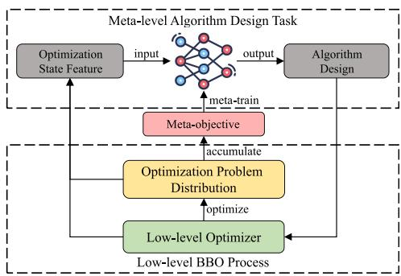
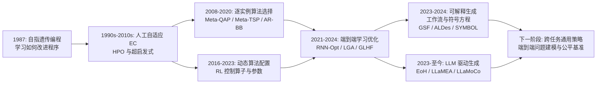
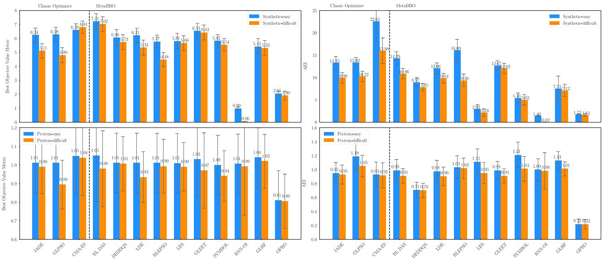
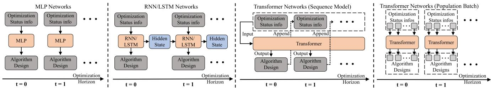
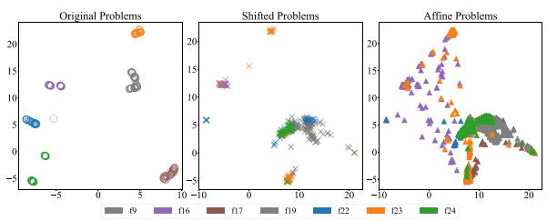

# Toward Automated Algorithm Design: A Survey and Practical Guide to Meta-Black-Box-Optimization

## 核心信息

- **论文类型**：领域综述与实践指南，不是单一新算法论文。
- **作者**：Zeyuan Ma, Hongshu Guo, Yue-Jiao Gong, Jun Zhang, Kay Chen Tan。
- **发布时间**：arXiv 初版于 2024-11-01；本文地版本为 IEEE 期刊排版稿。
- **研究对象**：用元学习自动设计黑盒优化器，简称 Meta-Black-Box Optimization（MetaBBO）。
- **核心问题**：给定一类黑盒问题，怎样从优化过程的状态中学习一个策略，使其能自动选择、配置、替代或生成低层优化算法，并迁移到未见问题。
- **原文**：[arXiv](https://arxiv.org/abs/2411.00625) | [MetaBBO 文献合集](https://github.com/MetaEvo/Awesome-MetaBBO) | [MetaBox](https://github.com/MetaEvo/MetaBox)

> **一句话结论：** MetaBBO 把“调算法”本身视为跨问题分布学习的序贯决策问题。它已经从“为既有算法选参数”走向“直接生成更新规则或程序”，但泛化、训练成本和公平评测仍是决定其能否落地的三道硬门槛。

## 摘要与核心贡献

### 英文摘要

> In this survey, we introduce meta-black-box optimization (MetaBBO) as an emerging avenue within the evolutionary computation community, which incorporates meta-learning approaches to assist automated algorithm design. Despite the success of MetaBBO, the current literature provides insufficient summaries of its key aspects and lacks practical guidance for implementation. To bridge this gap, we offer a comprehensive review of recent advances in MetaBBO, providing an in-depth examination of its key developments. We begin with a unified definition of the MetaBBO paradigm, followed by a systematic taxonomy of algorithm design tasks: algorithm selection, algorithm configuration, solution manipulation, and algorithm generation. We also summarize the learning methodologies behind current MetaBBO works, including reinforcement learning, supervised learning, neuroevolution, and in-context learning with large language models. A comprehensive evaluation of representative methods is then carried out, alongside an analysis of optimization performance, computational efficiency, and generalization ability. Finally, we identify core designs that improve generalization and learning effectiveness, and outline trends and future directions.

### 中文概述

作者将 MetaBBO 定义为一个双层学习框架：低层求解具体黑盒问题，高层策略观察低层状态并决定怎样改造该优化过程；低层的收益再反哺高层训练。文章的价值不在于罗列文献，而在于给出两条正交分类轴：

1. **设计任务轴**：选择已有算法、配置已有算法、直接操作解、生成新算法。
2. **学习范式轴**：强化学习、监督学习、神经进化、基于大语言模型的上下文学习。

其后用 MetaBox 对十个代表方法做统一的概念验证，并从网络结构、状态特征、训练分布和元目标四个可操作部件中提炼经验。

### 这篇综述真正解决了什么

| 层面 | 文章给出的答案 | 对读者的意义 |
|---|---|---|
| 术语边界 | 用统一的双层框架描述 MetaBBO | 可区分它与普通 HPO、超启发式、传统自适应 EA 和一般 L2O |
| 方法分类 | 四类设计任务与四类学习范式交叉组织 | 不再按论文逐篇记忆，而是按“动作空间”和“学习信号”理解 |
| 实证判断 | 同看精度、函数评估次数、运行复杂度与泛化 | 避免仅凭最终最优值判断 MetaBBO 是否优于传统优化器 |
| 实践建议 | 状态、分布、奖励和网络结构是关键设计点 | 给出搭建新系统时最值得优先验证的变量 |

## 背景：为什么需要 MetaBBO

黑盒优化只允许查询目标函数值，通常拿不到梯度、解析式或可靠的局部模型。进化算法、群智能和演化策略因此常被用于优化下列问题：

$$
\min_x f(x)
$$

传统方法的困难不是“没有好算法”，而是没有一个算法能稳定适配全部地形、维度、预算和约束。No-Free-Lunch 定理并不等于算法之间没有可学习的规律；它提醒我们，任何优势都必须相对于一个明确的问题分布而言。

人在此处通常承担四类工作：选优化器、调超参数、切换算子、设计新规则。传统 HPO、超启发式和自适应进化算法已能减少一部分人工工作，但它们往往针对固定算法或固定场景，且仍依赖人预先规定可调变量与反应规则。MetaBBO 的转变是：把这些设计决策做成策略的输出，并在一批训练问题上学习该策略。

## 统一框架：把“设计算法”写成双层优化

令元任务由问题分布、低层优化器和算法设计空间组成：

$$
\mathcal{T} = \{\mathcal{P}, \mathcal{A}, \Omega\}
$$

其中，$\mathcal{P}$ 是训练与测试问题的分布，$\mathcal{A}$ 是已有优化器、算法池或生成器，$\Omega$ 是可执行设计的空间。高层策略 $\pi_\theta$ 读取第 $t$ 步的状态 $s_i^t$，输出设计决策 $\omega_i^t$：

$$
\omega_i^t = \pi_\theta(s_i^t)
$$

训练目标是在问题分布上最大化累计优化收益：

$$
J(\theta) \approx \frac{1}{N} \sum_{i=1}^{N} \sum_{t=1}^{T} r(\mathcal{A}, \omega_i^t, f_i)
$$

这里的关键不是公式形式，而是信息闭环：**状态特征决定策略看见什么，设计空间决定策略能改什么，收益函数决定策略会偏好什么**。这三者共同定义了 MetaBBO 的能力上界与偏差来源。

> 图1：低层负责对具体黑盒函数进行函数评估与搜索；高层不直接求解目标，而是学习如何改变低层搜索行为。训练阶段跨多个问题实例累积经验，部署阶段将已训练策略迁移到未见实例。

### 与相邻概念的边界

| 概念 | 共同点 | MetaBBO 的区别 |
|---|---|---|
| 超参数优化 | 都会调参数 | HPO 常为一个固定任务离线寻找固定配置；MetaBBO 学习可随问题或时间步变化的策略 |
| 自适应进化算法 | 都会动态调整 | 自适应规则多由人工编写；MetaBBO 将规则本身参数化并从问题分布学习 |
| 超启发式 | 都在算法层做选择或生成 | 超启发式传统上更集中于组合优化与启发式管理；MetaBBO 强调连续 BBO、神经策略及跨实例泛化 |
| Learning to Optimize | 都在“学习优化” | L2O 的对象可为梯度优化或任务特定求解器；MetaBBO 明确聚焦无梯度 BBO 与进化计算语境 |
| 神经架构搜索 | 都是双层自动设计 | NAS 的设计对象是神经网络架构；MetaBBO 的设计对象是优化器本身 |

## 技术发展路线图

### 一条主线：从人工规则到可生成的优化器

这张图的变化可概括为三个“扩张”。

1. **动作空间扩张**：从选一个已有算法，到调参数与算子，再到改变解的位置，最后到输出完整算法或代码。
2. **观测与表示扩张**：从人工问题特征，到优化轨迹、种群关系、符号 token 与自然语言问题描述。
3. **学习信号扩张**：从离线分类标签，到在线回报、可微目标、模仿轨迹和 LLM 的评估反馈。

### 另一条主线：评测对象从“最终精度”扩展为“综合效益”

> **理解要点：** 对 MetaBBO 而言，“测试时最后值更低”不是充分结论。若元策略消耗了大量训练预算、在线推理时间或额外函数评估，它在真实预算下可能不如 CMA-ES、JADE 等传统基线。

## 四类算法设计任务：MetaBBO 到底在改什么

| 任务 | 策略输出 | 代表工作 | 优点 | 根本限制 |
|---|---|---|---|---|
| 算法选择 AS | 算法池中的算法编号 | Meta-QAP、AR-BB、RL-DAS | 动作空间小，易部署，解释清楚 | 上限由候选池决定；切换成本可能被忽略 |
| 算法配置 AC | 参数、算子、种群规模等 | DE-DDQN、LDE、GLEET、LES | 最成熟，能复用可靠基算法 | 仍受人工模板与参数化方式限制 |
| 解操作 SM | 下一步的一个解或整个种群 | RNN-Opt、LGA、GLHF、RIBBO | 可端到端直接学习搜索动力学 | 策略黑箱化，连续多峰地形泛化非常困难 |
| 算法生成 AG | 工作流、符号更新式或程序 | GSF、ALDes、SYMBOL、EoH、LLaMEA | 表达力最大，可能发现人类未写过的规则 | 搜索空间巨大；正确性、复现性与成本难控制 |

### 任务之间的关系，不是四条互斥赛道

- **AS 是在算法集合上做离散决策**。它适合已有多个可信求解器、但不知道何时用哪个的情形。
- **AC 是在固定骨架内做局部改造**。它是最现实的起点，因为 DE、PSO、CMA-ES 等已有稳定保底行为。
- **SM 是把神经策略本身当作优化器**。不再明确区分“元控制器”与“低层优化器”，但可解释性与训练稳定性代价上升。
- **AG 是先产生一个低层优化器，再让该优化器执行搜索**。它与 SM 的差异在于：SM 输出下一步搜索动作，AG 输出的是规则或程序本身。

> **实践上的选择原则：** 新场景若预算有限且已有可靠优化器，先从 AC 或 AS 开始；只有当固定模板已明显成为瓶颈、且有足够评测预算时，再进入 SM 或 AG。不要把“更能生成”误当成“更容易得到更好算法”。

## 四种元学习范式：策略如何学会设计

| 范式 | 学习信号 | 最合适的动作空间 | 代表方法 | 强项 | 主要代价 |
|---|---|---|---|---|---|
| 强化学习 RL | 逐步优化收益 | 离散或连续控制 | DE-DDQN、LDE、GLEET、RL-DAS、SYMBOL | 不要求目标函数可微；天然处理序贯决策 | 回报稀疏、样本成本高、奖励设计敏感 |
| 监督学习 SL | 可微目标或教师轨迹 | 直接操纵解、轨迹预测 | RNN-OI、RNN-Opt、GLHF、RIBBO | 梯度学习通常更稳定高效 | 需可微代理或高质量教师；可能只会模仿教师偏差 |
| 神经进化 NE | 策略在任务集上的适应度 | 长时程、难反传的策略 | LTO-POMDP、LES、LGA | 无需可微，适合复杂网络参数 | 每代要评估一组策略，样本开销大 |
| 上下文学习 ICL | 提示中的历史轨迹和运行反馈 | 解操作、程序生成 | OPRO、EoH、LLaMEA | 无需额外训练即可利用代码与语义知识 | token 成本、代码错误、提示脆弱与数学推理不足 |

### RL 的 MDP 化是本文最核心的技术桥梁

在 MetaBBO-RL 中，低层优化过程就是环境：状态为优化状态特征，动作是算法设计，奖励是性能改善。连续状态与连续动作时，策略直接输出参数分布；离散动作时，常见做法是用 Q-learning、DQN 或 DDQN 选算子。

一个常见的、跨函数尺度可比较的单步收益可写为：

$$
r_t = \frac{f_t^* - f_{t+1}^*}{f_1^* - f_e^*}
$$

其中，$f_t^*$ 是第 $t$ 步已发现的当前最优目标值，$f_e^*$ 是对未知最优值的估计。归一化避免大尺度函数在训练中压过小尺度函数；但估计误差与后期稀疏回报又会引入新偏差。因此，奖励不是一个无害的实现细节，而是把研究者偏好写入策略的接口。

## 评测：原文的证据到底说明了什么

### 设置

作者借助 MetaBox 对三类传统优化器和十种 MetaBBO 方法做概念验证。

| 类别 | 纳入方法 |
|---|---|
| 传统基线 | JADE、GLPSO、CMA-ES |
| 算法选择 | RL-DAS |
| 算法配置 | DE-DDQN、LDE、RLEPSO、GLEET、LES |
| 算法生成 | SYMBOL |
| 解操作 | RNN-OI、GLHF、OPRO |
| 问题集 | Synthetic-10D、Noisy-Synthetic-10D、Protein-Docking-12D；含 easy 与 difficult 划分 |

论文使用 AEI 综合考察最终优化结果、函数评估次数与运行复杂度，分数越高越好；并使用 MGD 与 MTE 衡量泛化衰减和元迁移效率。应注意，AEI 是特定基准平台定义的加权指标，不应被解释为领域内唯一正确的“总分”。

> 图2：左侧比较最终优化精度，右侧比较包含效率的 AEI。图的关键讯息是“精度相近”与“综合效益领先”可以给出相反结论。

### 原文支持的结论

1. **部分 RL 方法在最终精度上可与传统优化器持平或更优**，例如 RL-DAS、LDE 和 GLEET；但并非所有 MetaBBO 方法都优于传统基线。
2. **计算开销会改变排序**。纳入运行复杂度后，CMA-ES 的综合权衡表现更强，说明元策略推理与训练不是免费午餐。
3. **在更复杂的蛋白质对接任务上，MetaBBO 与传统方法的差距缩小**。这是“复杂现实任务值得继续探索”的积极信号，不能直接推广为“MetaBBO 已普遍胜出”。
4. **该次比较中 RL 系列整体强于所选 NE、SL 和 ICL 基线**。这是该实验配置下的观察，不是四种范式的普适理论排序。
5. **迭代提示型 ICL 的 AEI 很低**。其主要警示是多轮 LLM 调用的时间和 token 预算可能吞噬优化收益。

### 评测的边界

- 十个方法不足以代表所有任务、实现质量和调参预算；尤其 AG 与 ICL 的发展速度很快。
- 同一方法的训练集、算力、预训练模型与实现细节会显著影响结论；“统一接口”不等于“训练资源天然公平”。
- Synthetic 与 Protein-Docking 已比单一 BBOB 更好，但离工业仿真、昂贵实验、约束与动态环境仍有距离。
- MGD/MTE 是有价值的补充，但不能替代对分布外地形、维度、预算、噪声和约束变化的逐项报告。

## 四个关键设计杠杆

### 1. 网络结构：时间依赖与种群空间依赖

> 图3：MLP 只看当前特征；RNN/LSTM 聚合历史；Transformer 可处理长轨迹，亦可在种群个体之间通过注意力共享信息。

| 结构 | 适合处理的信息 | 取舍 |
|---|---|---|
| MLP | 当前代的聚合状态 | 训练和推理轻，但看不到长程过程与个体交互 |
| RNN/LSTM | 优化历史、部分可观测状态 | 比 MLP 更会“记忆”，长优化轨迹仍可能有梯度问题 |
| 时间 Transformer | 长轨迹与行为克隆 | 能建模长程关系，但显存和数据需求更高 |
| 空间 Transformer | 种群中个体之间的相对关系 | 能做个体化配置，但复杂度随种群规模增长 |

**由此得到的实践判断：** 若动作按代统一施加，先用 MLP 建立可复现实验；若错误的根源是看不见早期搜索历史，再考虑时间模型；若希望对每个个体作不同决策，空间注意力才是合理增加的复杂度。

### 2. 状态特征：策略究竟看到了什么

| 特征类别 | 示例 | 价值 | 风险 |
|---|---|---|---|
| 问题识别特征 | ELA 的曲率、局部搜索、偏度等 | 识别整体地形，利于逐实例选择 | 往往需额外采样，消耗昂贵 FEs |
| 种群画像特征 | 多样性、粗糙度、适应度距离相关等 FLA 指标 | 判断当前群体所在局部区域 | 估计随种群规模和采样方式波动 |
| 优化进度特征 | 已用 FEs、最优值改善、目标分布 | 几乎零额外查询，直接反映当前阶段 | 对陌生任务的静态识别能力较弱 |

文章的重要反直觉结论是：**更丰富的地形特征不一定更好**。在固定函数评估预算下，计算 ELA/FLA 所消耗的查询会挤占真正优化；若进度特征已足以支撑泛化，它反而可能优于昂贵的显式地形分析。

### 3. 训练分布：泛化的主战场

> 图4：仅做平移和旋转会增加实例数，却未必显著扩大地形覆盖；MA-BBOB 的仿射组合在特征空间覆盖更广。

对于一个基础函数 $f(x)$，常见增广是平移与旋转：

$$
f'(x) = f(M^\top(x-o))
$$

其中，$M$ 是旋转矩阵，$o$ 是最优点偏移。它能避免策略死记函数坐标，却不能凭空制造新的多峰结构、可分性、条件数和噪声机制。

**更严谨的训练分布设计流程：**

1. 先明确部署时最可能变化的是维度、预算、噪声、约束还是地形结构。
2. 用独立于训练的 ELA/行为特征检查训练集是否覆盖这些变化，而不是只报告函数个数。
3. 将外推测试与插值测试分开报告，例如未见维度、未见预算、未见函数族和真实任务。
4. 让训练增广、奖励和架构一起做消融，因为它们会共同影响泛化而不是独立贡献。

### 4. 元目标：优化“变好”还是优化“尽快变好”

简单的正负奖励会丢失改善幅度；直接用绝对目标下降又会受不同函数尺度影响。论文讨论了归一化收益与为后期进展放大的奖励，但其消融也表明，额外的时间缩放并不总能提高效果。

因此，一个元目标至少应明确回答：

- 是否奖励最终最优值、任意时刻的 AUC，还是固定预算内的改善？
- 是否将函数评估、墙钟时间、内存和 LLM token 直接计入成本？
- 未知全局最优值时，归一化的参照从哪里来，是否泄漏基准信息？
- 是否需要显式保持种群多样性，避免策略过早把探索换成短期奖励？

## 相关工作定位

### MetaBox：让比较开始变得可复现

**MetaBox: A Benchmark Platform for Meta-Black-Box Optimization with Reinforcement Learning**（Ma 等，NeurIPS 2023）提供统一模板、300 多个从合成到真实的问题实例、19 个基线及标准化指标。它是本文实证部分的基础，也解释了为什么本文能不只做文献罗列，而能比较精度、效率和泛化。[论文](https://proceedings.neurips.cc/paper_files/paper/2023/hash/232eee8ef411a0a316efa298d7be3c2b-Abstract-Datasets_and_Benchmarks.html)

**关系：** MetaBox 是评测基础设施；本文把它扩展为面向 AS、AC、SM、AG 和多学习范式的解释框架。后续的 **MetaBox-v2** 又把范围扩展到 18 类合成与真实任务、1900 多个实例，并支持 RL、进化与梯度式方法，说明原文提出的“统一公平基准”正在继续演进。[MetaBox-v2](https://openreview.net/forum?id=415T06x0vG)

### SYMBOL：从参数控制走向可读的更新规则生成

**SYMBOL: Generating Flexible Black-Box Optimizers through Symbolic Equation Learning**（Chen 等，ICLR 2024）以符号方程生成器在每一步产生闭式更新规则，并用 RL 学习生成策略。相比把神经网络直接当搜索器，SYMBOL 的输出可被人阅读、分析和复用；相比 AC，它不局限于预先固定的 DE 或 PSO 模板。[论文](https://proceedings.iclr.cc/paper_files/paper/2024/hash/b742b708fc846830e3aaeba2e6becd47-Abstract-Conference.html)

**关系：** 它是本文 AG 分支的标志性工作，说明“生成”可以不等于黑箱代码生成。但它也揭示 AG 的核心矛盾：符号集过小会限制新颖性，符号集过大又会使搜索和信用分配变难。

### EoH 与 LLaMEA：LLM 将程序空间变成搜索空间

**Evolution of Heuristics**（Liu 等，ICML 2024）让 LLM 先产生自然语言的启发式思路，再转为代码，并在演化循环中变异和筛选思路与程序。[论文](https://icml.cc/virtual/2024/poster/34705)

**LLaMEA**（van Stein 和 Bäck，IEEE TEVC 2025）将 LLM 放在迭代生成、变异、评估和选择循环中，自动生成连续黑盒优化的元启发式；其跨维度实验展示了潜力，也保留了评测预算、代码可靠性和模型依赖等问题。[论文](https://arxiv.org/abs/2405.20132)

**关系：** 两者代表本文所说的 AG 与 ICL 交汇处：搜索对象由参数变为程序。它们很适合激发新算子或新结构，但不应绕过标准基准、单元测试、资源核算与统计检验。

## 对文章的批判性评价

### 优势

1. **分类真正可用。** “任务轴 × 学习轴”的二维结构将大量异质工作放入相同坐标系，比按 DE、PSO、LLM 等关键词分章更利于迁移。
2. **有实证而非只综述。** 通过 MetaBox 同时看精度、效率和学习能力，纠正了许多单论文只报最终值的倾向。
3. **把泛化还原为设计问题。** 网络、状态、训练分布和奖励四项建议正好对应可复现实验的四个主要旋钮。
4. **对 LLM 保持审慎。** 它没有把代码生成当作自动算法设计的终点，明确指出 token、错误率、提示依赖和推理脆弱性。

### 局限与阅读时的防误解

1. **“MetaBBO”边界仍有约定性。** 与超启发式、自动算法设计、L2O 的边界在任务层面连续，而非天然割裂；分类有助沟通，不应当作严格数学分区。
2. **统一评测仍是有限切片。** 十个代表方法和有限任务集难以消除实现质量、训练算力、预训练资源、调参时间带来的混杂因素。
3. **AEI 依赖指标构造。** 任何把精度、FEs 和时间合并的分数都包含权重偏好，因此需要同时展示原始指标和敏感性分析。
4. **真实昂贵优化尚未被充分覆盖。** 在一次实验成本极高的科学实验、工程仿真或在线业务中，Meta-training 的前置成本何时能摊薄，仍需要任务级经济账。
5. **LLM 部分变化最快。** 原文中关于模型能力和 token 成本的结论应视为当时方法的证据，而不是对后续模型或具备工具验证闭环的系统的永久判断。

## 给研究者的落地路线

### 从零搭建一个可信 MetaBBO 系统

1. **先选任务粒度。** 首次实验优先选择 AC，例如为 DE 的两个参数或若干变异算子建立有限动作空间；这样能隔离“是否学到策略”而非同时调试生成器、执行器和奖励。
2. **建立传统强基线。** 以 CMA-ES、JADE 或对应领域强算法为保底，并给每个方法相当的函数评估、墙钟时间和调参预算。
3. **从廉价状态起步。** 先使用进度与种群统计特征，只有在它们无法区分关键情形时才加入需要额外查询的 ELA/FLA。
4. **显式设计分布外测试。** 分别留出函数族、维度、预算、噪声或现实任务，而不是只做同分布随机划分。
5. **报告完整成本。** 训练函数评估、训练 GPU 时间、测试推理时间、内存、失败率和 LLM token 都应单独列出。
6. **再扩大表达力。** 只有在固定模板确实限制性能时，才升级到 SM、符号 AG 或 LLM 程序 AG；并加入语法约束、沙箱执行、单元测试与统计复验。

### 方法选择速查

| 你的条件 | 建议首选 | 原因 |
|---|---|---|
| 有多个成熟求解器，想按问题选一个 | AS | 风险低，结果可解释，直接估计选择价值 |
| 已有 DE/PSO/CMA-ES，想动态调参数 | AC + RL | 最成熟，动作空间可控，基线清晰 |
| 目标可微或有强教师轨迹 | SM + SL | 可利用梯度或模仿，训练效率通常优于纯 RL |
| 长时程且难以反传 | NE | 不依赖可微路径，但需接受更高评估成本 |
| 希望发现可解释新更新式 | 符号 AG | 输出可审查；需小心符号集和搜索预算 |
| 希望生成启发式程序 | LLM-AG | 语义表达力强；必须将执行验证和成本控制纳入闭环 |

## 未来方向：从“会调参”到“可信自主设计”

原文提出的三条愿景可进一步具体化为可检验的研究问题。

| 方向 | 需要回答的问题 | 成功证据 |
|---|---|---|
| 任务混合泛化 | 一个策略能否跨优化器、跨问题类型工作，而不是每个组合单训？ | 在未见算法模块与未见问题族上仍超过对应强基线 |
| 全流程自主 | 能否连状态表示、问题表述、目标构造和优化器设计一起学习？ | 去除手工特征后不只“能运行”，还在资源受限下有稳定增益 |
| 更聪明的 LLM 整合 | 如何让 LLM 提出假设而非充当昂贵随机搜索器？ | 代码通过率、评估效率、结构新颖性与可解释性同时可量化提升 |
| 公平评测 | 如何比较预训练 LLM、在线 RL 和传统算法的全部资源投入？ | 报告可复现的总成本曲线与多预算 Pareto 前沿，而非单点排名 |
| 安全与可靠性 | 生成算法如何避免数值错误、违反约束和隐性基准泄漏？ | 语法验证、执行沙箱、单元测试、独立复现实验和失败率报告 |

## 综合评价

| 维度 | 分数 | 理由 |
|---|---:|---|
| 创新性 | 8.5/10 | 统一 MetaBBO 概念，并以任务轴和学习轴系统化领域 |
| 技术质量 | 8.5/10 | 定义、分类、关键设计因素和局限讨论形成了完整论证链 |
| 实验充分性 | 8.0/10 | 统一实证很有价值，但方法数、任务覆盖和资源公平性仍有限 |
| 写作质量 | 9.0/10 | 结构清晰，能把综述、实验与实践建议连接起来 |
| 实用性 | 8.0/10 | 对方法选型与实验设计直接有用，但实现成本依然不低 |
| **总体** | **8.4/10** | 是进入 MetaBBO 的高质量地图；读者仍应回到代表性原始论文核验方法细节 |

> **最重要的启示：** MetaBBO 的优势不来自给传统优化器套上一层神经网络，而来自用合适的任务分布、状态表示、动作空间和成本感知目标，把“何时探索、何时利用、如何改规则”变成可迁移的经验。

## 阅读顺序建议

1. 先读本文的定义、四类任务和 Fig. 2，建立“高层设计、低层搜索”的基本模型。
2. 再读 RL-DAS 或 GLEET，理解 AC/AS 在有限动作空间中怎样落地。
3. 读 SYMBOL，观察从配置到生成的表达力跃迁及其可解释性代价。
4. 读 MetaBox 与 MetaBox-v2，先掌握怎样做公平评测，再尝试复现或提出新算法。
5. 最后读 EoH、LLaMEA 一类 LLM-AG 工作，并用本文的成本、可靠性和泛化检查表审视其结果。

## 外部资源

- [原论文 arXiv](https://arxiv.org/abs/2411.00625)
- [MetaBox: NeurIPS 2023 官方论文页](https://proceedings.neurips.cc/paper_files/paper/2023/hash/232eee8ef411a0a316efa298d7be3c2b-Abstract-Datasets_and_Benchmarks.html)
- [MetaBox GitHub](https://github.com/MetaEvo/MetaBox)
- [MetaBox-v2: NeurIPS 2025 OpenReview 页面](https://openreview.net/forum?id=415T06x0vG)
- [SYMBOL: ICLR 2024 官方论文页](https://proceedings.iclr.cc/paper_files/paper/2024/hash/b742b708fc846830e3aaeba2e6becd47-Abstract-Conference.html)
- [EoH: ICML 2024 官方页面](https://icml.cc/virtual/2024/poster/34705)
- [LLaMEA: arXiv](https://arxiv.org/abs/2405.20132)
- [Awesome-MetaBBO](https://github.com/MetaEvo/Awesome-MetaBBO)

## 我的笔记

- 我关心的目标问题分布是什么？是函数族、维度、预算、噪声，还是约束发生变化？
- 我能接受的总成本是什么？训练 FEs、线上时延、GPU 时间和 LLM token 应如何折算？
- 当前问题的瓶颈真的是算法结构，还是数据、建模、约束表述和评测协议？
- 若一个生成的算法更强，我能否解释、复现并在独立任务上验证它为何更强？
