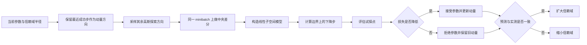
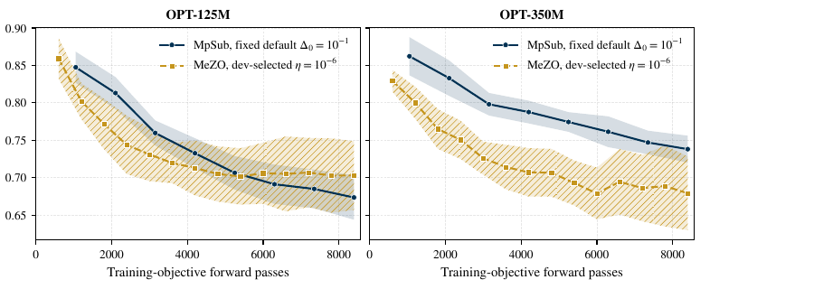
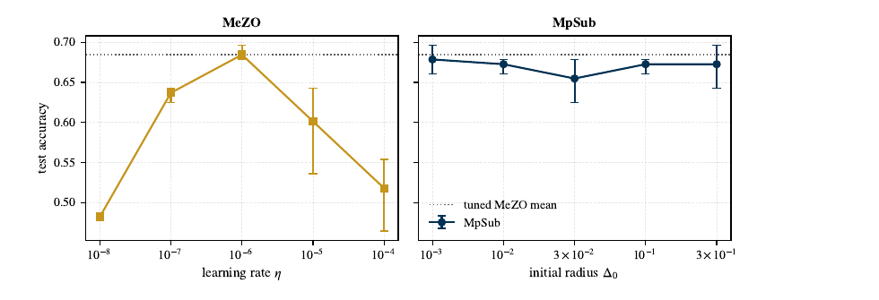
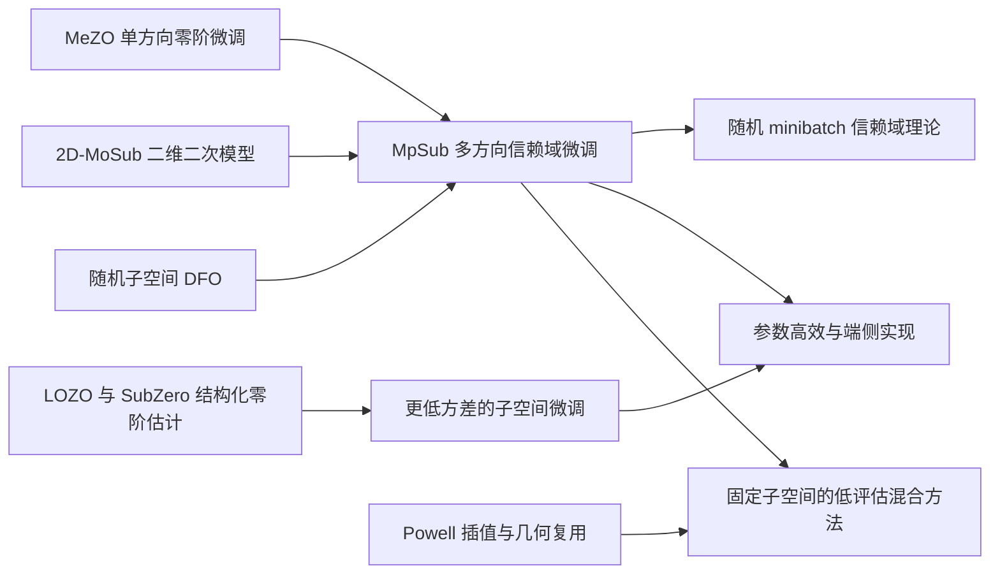

# MpSub: A Momentum $p$-Dimensional Subspace Trust-Region Method for Derivative-Free Fine-Tuning of Large Language Models

## 核心信息

- **中文题目**：MpSub：面向大语言模型无导数微调的动量 $p$ 维子空间信赖域方法
- **论文类型**：理论算法 + 实证方法
- **论文 ID**：arXiv:2609.07666v1
- **作者**：Yuyang Wang、Haoyu Yao、Pengcheng Xie
- **机构**：西安交通大学、劳伦斯伯克利国家实验室
- **发布时间**：2026-09-07
- **本地材料**：[原始 PDF](../../../01-raw/2026-09/MpSub_A_Momentum_$p$_Dimensional_Subspace_Trust_Region_Method_for_Derivative_Free_Fine_Tuning_of_Large_Language_Models.pdf) | [解析 Markdown](../../../02-markdown/2026-09/MpSub_A_Momentum_$p$_Dimensional_Subspace_Trust_Region_Method_for_Derivative_Free_Fine_Tuning_of_Large_Language_Models.md)
- **在线版本**：[arXiv](https://arxiv.org/abs/2609.07666) | [PDF](https://arxiv.org/pdf/2609.07666)

> **最强版本的一句话贡献：** MpSub 把 2D-MoSub 的“上一成功方向加随机探索”扩展到 $p$ 维，以中央差分构造线性子空间模型，并用信赖域半径同时承担扰动尺度和步长控制，从而在两个小型 OPT 模型上以统一参数达到与调过学习率的 MeZO 相近的准确率。

> **一句话审计结论：** 方法构造简洁，确实降低了对学习率搜索的依赖，但现有理论只覆盖固定确定性目标，实验只覆盖一个分类数据集、两个小模型和三次随机重复；“适合端侧”尚未被本文的硬件、内存或能耗证据支持。

## 摘要翻译

### 英文摘要

Full-parameter fine-tuning of large language models has a substantial memory cost because backpropagation requires storing activations and gradients. Zeroth-order optimization avoids that by estimating update directions from loss evaluations, but existing methods often depend on a learning rate that must be retuned for each model and task. We propose the momentum p-dimensional subspace trust-region method (MpSub). At each iteration, MpSub searches within a p-dimensional subspace: one direction preserves the historical information carried by the most recent accepted step, while the remaining directions promote exploration through fresh random sampling. The subspace gradient is estimated by central differences, a trial step is computed from a linear trust-region model, and the trust-region radius is updated according to the agreement between predicted and observed loss reduction. The radius controls both the finite-difference perturbation and the trust-region bound on the subspace step, so no learning rate is required. In the LLM setting, all evaluations within an iteration share one minibatch, and the directions are regenerated from stored seeds and applied in place to the model weights, so training uses forward evaluations alone. For smooth deterministic objectives under Gaussian direction sampling without orthogonalization, we bound the finite-difference error, quantify the gradient captured by the random subspace, and prove that the gradient norm converges to zero almost surely under a safeguarded radius update. Under a matched budget of 8,400 training-objective forward passes per configuration, we fine-tune OPT-125M and OPT-350M on CommitmentBank. With the same preset parameters at both model sizes, MpSub attains mean test accuracies of 0.673 and 0.690 over three seeds, while the MeZO configurations selected by development accuracy attain 0.685 at both sizes. These results show that MpSub attains accuracy comparable to tuned MeZO without a learning-rate search.

### 中文翻译

大语言模型全参数微调的内存成本很高，因为反向传播需要保存激活和梯度。零阶优化通过函数值评估估计更新方向，能够绕过这一成本，但现有方法通常依赖学习率，而且学习率需要针对不同模型和任务重新调节。

本文提出动量 $p$ 维子空间信赖域方法 MpSub。每次迭代只在一个 $p$ 维子空间中搜索：其中一个方向保留最近一次成功步携带的历史信息，其余方向由新的随机采样提供探索。算法用中央差分估计子空间梯度，从线性信赖域模型得到试探步，并依据预测下降与实际下降的一致程度更新信赖域半径。该半径同时控制有限差分扰动和子空间步长，因此不再需要显式学习率。

在 LLM 微调中，同一迭代内的所有函数评估共用一个 minibatch；随机方向通过种子重新生成并原地施加到模型权重上，所以训练只需要前向评估。对采用未正交化高斯方向的光滑确定性目标，作者给出有限差分误差界、随机子空间捕获梯度能量的结果，并在带保护的半径更新下证明梯度范数几乎必然趋于零。

在每个配置均使用 8,400 次训练目标前向评估的预算下，作者在 CommitmentBank 上全参数微调 OPT-125M 和 OPT-350M。MpSub 对两个模型使用同一组预设参数，三次随机重复的平均测试准确率分别为 0.673 和 0.690；按开发集选择配置的 MeZO 在两个模型上均为 0.685。作者据此认为，MpSub 无需学习率搜索即可达到与调参 MeZO 相近的准确率。

### 核心要点提炼

1. **步长机制**：以自适应信赖域半径替代外部学习率。
2. **搜索空间**：一个动量方向加 $p-1$ 个新高斯方向。
3. **模型构造**：每个方向做中央差分，形成 $p$ 维线性局部模型。
4. **内存实现**：用随机种子重建方向，避免显式保存包含 $n\cdot p$ 个元素的方向矩阵。
5. **理论结果**：固定确定性目标下证明几乎必然一阶全局收敛，但没有给出函数评估复杂度。
6. **实证结果**：在一个任务、两个小模型上与调参后的 MeZO 基本相当，而不是稳定优于 MeZO。
7. **关键边界**：实验中的随机 minibatch 不在主要收敛定理覆盖范围内。

## 研究背景与动机

### 为什么零阶 LLM 微调仍然难

MeZO 一类方法只需前向计算和参数原地扰动，显著减少反向传播激活和梯度的存储。然而，一个随机方向对高维梯度的投影通常很小，估计方差随环境维度恶化；同时，学习率对模型、任务和提示模板可能高度敏感。

本文把问题拆成两个设计目标：

1. 用多个方向提高单次局部搜索所捕获的梯度信息。
2. 用模型预测与实际下降的一致性自动校准步长，避免重新搜索学习率。

### 为什么不直接构造 $p$ 维二次插值模型

论文直接前序工作 2D-MoSub 在二维子空间内维护二次插值模型。若机械扩展到 $p$ 维，完整二次模型需要：

$$
\frac{(p+1)(p+2)}{2}
$$

个插值点。取 $p=20$ 时需要 231 个点，初始评估代价很高。MpSub 因此放弃二次插值，改用每个方向上的中央差分，只需与 $p$ 线性相关的评估数。

## 方法概述

### 优化问题

理论部分考虑无约束光滑问题：

$$
\min_{x\in\mathbb{R}^n}f(x)
$$

实验中， $f$ 是每次迭代重新采样 minibatch 后得到的经验损失。这里存在一个重要区分：理论中的 $f$ 固定不变，实验中的 $f_k$ 会随 minibatch 改变。

### 算法流程

### 1. 动量加随机探索的子空间

若已有成功步 $m_k$，第一条方向取为：

$$
d_1^{(k)}=\frac{m_k}{\Vert m_k\Vert_2}
$$

其余 $p-1$ 个方向由标准高斯向量除以 $\sqrt{n}$ 得到。作者不执行 Gram-Schmidt 正交化，理由是在 $n$ 极大时独立高斯方向天然近似正交，而且显式正交化会增加计算和内存。

这一构造中的“动量”不是 Adam 那样的指数滑动平均，而是最近一次被接受的完整参数位移。若连续成功步方向相关，它能把上一轮的有效信息带入下一轮。

### 2. 中央差分子空间梯度

第 $i$ 个子空间分量估计为：

$$
g_{k,i}=\frac{f(x_k+\Delta_kd_i^{(k)})-f(x_k-\Delta_kd_i^{(k)})}{2\Delta_k}
$$

同一迭代的基准点、正负扰动点和试探点全部使用同一个 minibatch。这一步很关键：否则比值会同时混入参数变化和样本变化，信赖域半径可能因数据噪声而错误振荡。

每轮评估数为：

$$
2p+2
$$

其中包括基准点、 $2p$ 个中央差分点和一个试探点。论文默认 $p=20$，所以每轮需要 42 次训练目标前向评估。

### 3. 线性模型与试探步

算法在子空间坐标中使用线性模型。试探坐标步直接落在信赖域边界：

$$
s_k=-\Delta_k\frac{g_k}{\Vert g_k\Vert_2}
$$

全空间试探点为 $x_k+D_ks_k$。模型预测下降为 $\Delta_k\Vert g_k\Vert_2$，实际下降与预测下降的比值为：

$$
\rho_k=\frac{f(x_k)-f(x_k+D_ks_k)}{\Delta_k\Vert g_k\Vert_2}
$$

### 4. 接受规则与半径更新分离

MpSub 只要观察到试探点损失严格下降，就接受该点；是否扩大半径则由 $\rho_k$ 决定。这与经典信赖域“只有比值超过阈值才接受”不同。

这种分离有实际动机：零阶评估已经很贵，若试探点确实下降，仅因模型预测不够准确而丢弃它会浪费评估。但它也意味着在随机 minibatch 下，偶然下降可能被写入参数轨迹，理论中的单调性不能直接沿用。

### 5. 面向 LLM 的种子重建与原地扰动

显式保存方向矩阵需要 $pn$ 个数。论文用由全局 seed、迭代编号和方向编号确定的随机种子，逐张量重建每条方向，并原地执行正扰动、负扰动和恢复。

但是实现并非零额外全参数存储：论文明确保留一个全参数动量位移和一个全参数试探步累加器，两者都是 $n$ 维。它避免的是 $p$ 份方向存储和反向图，不等于严格的“只有模型权重”的推理内存。

## 理论结果

### 有限差分误差

在梯度 Lipschitz 连续的假设下，论文证明中央差分误差满足：

$$
\left|g_{k,i}-\nabla f(x_k)^\top d_i^{(k)}\right|\le\frac{L\Delta_k}{2}\Vert d_i^{(k)}\Vert_2^2
$$

仅假设梯度 Lipschitz 时，误差是一阶的 $\mathcal{O}(\Delta_k)$；若 Hessian 进一步 Lipschitz，可得到二阶误差，但后续证明没有使用更强条件。

### 随机子空间捕获的梯度能量

对 $p-1$ 个高斯探索方向，条件期望为：

$$
\mathbb{E}\left[\sum_{i=2}^{p}\left(\nabla f(x_k)^\top d_i^{(k)}\right)^2\mid\mathcal{F}_k\right]
=\frac{p-1}{n}\Vert\nabla f(x_k)\Vert_2^2
$$

它说明增加 $p$ 会线性增加期望捕获的梯度能量，但当 $p\ll n$ 时，随机部分仍只捕获很小比例。动量方向是否能显著弥补这一点，论文只通过最终结果间接观察，没有单独消融。

### 下降界与全局收敛

Proposition 3.4 给出一般非正交 frame 下的实际下降下界，误差项由有限差分误差和 $D_k$ 的谱范数共同决定。

证明链为：

1. Lemma 3.5：带 safeguard 的更新规则使信赖域半径平方可求和，因此半径趋于零。
2. Theorem 3.6：高概率“好 frame”会迫使半径扩张，从而反证梯度不可能永远远离零，得到子序列收敛。
3. Lemma 3.7：在梯度大于任意固定阈值的迭代集合上，半径之和有限。
4. Theorem 3.8：结合步长总长度控制和梯度 Lipschitz 性，推出完整梯度序列几乎必然趋于零。

### 理论边界与待核查点

- 定理只覆盖固定、光滑、有下界的确定性目标。
- 理论要求 $\Delta_{min}=0$，实验却使用 $\Delta_{min}=10^{-12}$。
- 理论半径更新含有额外条件 $\Vert g_k\Vert_2\ge\kappa\Delta_k$，算法 2.1 和实验描述没有报告 $\kappa$ 的取值或明确说明实际启用该 safeguard。
- 没有给出达到给定梯度精度所需的迭代或函数评估复杂度。
- Lemma 3.7 从“好 frame 子集上的加权和有限”推进到“全部大梯度迭代上的和有限”时，只援引未具体陈述和引用的 standard renewal property；随后从矩条件得到加权和结论也高度压缩。Theorem 3.8 依赖这一步，建议复核完整证明或向作者确认。

## 实验结果

### 实验设置

| 项目 | 设置 |
|---|---|
| 数据集 | SuperGLUE CommitmentBank，三分类自然语言推断 |
| 数据规模 | 100 训练、50 开发、56 测试 |
| 模型 | OPT-125M、OPT-350M |
| 参数形式 | 全参数 FP32 |
| batch size | 8 |
| 主基线 | MeZO |
| 重复次数 | 3 个随机 seed |
| 单配置预算 | 8,400 次训练目标前向评估 |
| MpSub 默认设置 | $p=20$， $\Delta_0=10^{-1}$， $\gamma_1=0.5$， $\gamma_2=2$， $\eta=0.1$ |
| 硬件披露 | $p$ 消融报告 NVIDIA RTX 4060 Ti；主实验总墙钟与峰值内存未报告 |

### 匹配前向预算的主结果

| 模型 | 方法 | 开发损失 | 开发准确率 | 测试准确率 |
|---|---|---:|---:|---:|
| OPT-125M | MpSub | **0.674** | **0.773** | 0.673 |
| OPT-125M | MeZO | 0.703 | 0.760 | **0.685** |
| OPT-350M | MpSub | 0.738 | **0.787** | **0.690** |
| OPT-350M | MeZO | **0.679** | 0.780 | 0.685 |

结果是“各有胜负”而不是 MpSub 全面更好。MpSub 在 OPT-125M 的开发损失和开发准确率更好，但测试准确率低 0.012；在 OPT-350M 上测试准确率高 0.005，开发损失却更差。三次随机重复的范围重叠较多，论文没有显著性检验。

> 图1：在 OPT-125M 上，MpSub 后期开发损失低于 MeZO；在 OPT-350M 上则是 MeZO 更低。该图支持“MpSub 可竞争”，但不支持“MpSub 稳定优于 MeZO”。阴影为三个 seed 的标准误。

### 步长敏感性

> 图2：MeZO 在学习率 $10^{-6}$ 附近最好，偏离一个数量级后准确率明显下降；MpSub 在测试的五个初始半径上相对平稳。该证据只来自 OPT-125M 和 CommitmentBank，尚不能证明跨任务免调参。

论文把 MeZO 在 OPT-125M 上搜索五个学习率的成本计为 42,000 次前向，在 OPT-350M 上搜索三个学习率计为 25,200 次。这个成本说明信赖域自校准可能具有系统价值，但比较仍有两个限制：MpSub 自身也选择了 $p$、半径上下界、收缩扩张因子和接受阈值；而默认 $\Delta_0=10^{-1}$ 是否完全独立于当前任务选定，正文没有提供预注册证据。

### 子空间维数消融

| $p$ | 每步前向次数 | 开发准确率 | 测试准确率 | 每步时间 |
|---:|---:|---:|---:|---:|
| 5 | 12 | 0.70 | 0.643 | 3.0 秒 |
| 10 | 22 | 0.72 | 0.661 | 4.4 秒 |
| 15 | 32 | 0.74 | 0.661 | 6.0 秒 |
| 20 | 42 | 0.78 | 0.679 | 7.7 秒 |
| 25 | 52 | 0.78 | 0.679 | 8.7 秒 |
| 30 | 62 | 0.76 | 0.661 | 10.1 秒 |

该消融固定为 100 个优化步骤，而不是固定总前向预算。因此 $p=5$ 只使用 1,200 次前向， $p=20$ 使用 4,200 次， $p=30$ 使用 6,200 次。准确率随 $p$ 上升可能来自更丰富的方向，也可能只是更多计算，现有实验不能把两者分离。这个混杂使“ $p=20$ 是方向信息与成本的最佳平衡”只能视为初步观察。

## 深度分析

### 可归因的净增量

1. 把 2D-MoSub 的动量加探索结构扩展到任意小维度 $p$，并用中央差分避免二次插值点数的平方增长。
2. 用一个信赖域半径同时控制差分扰动和更新步长，实证展示初始半径比 MeZO 学习率更不敏感。
3. 给出未正交化高斯 frame 下的有限差分、梯度捕获和几乎必然收敛分析。
4. 给出适合 LLM 全参数扰动的 seed 重建与同 minibatch 评估实现。

这些贡献主要是已知模块的针对性组合与理论适配，而不是新的零阶估计器、低秩结构或函数评估复杂度突破。

### 优势

- 算法结构清晰，半径比值提供了比固定学习率更可解释的步长反馈。
- 明确区分接受试探点与扩大半径，减少已支付前向评估的浪费。
- 同 minibatch 比较是把确定性信赖域思想迁移到随机训练时必要且实用的工程选择。
- seed 重建使方向矩阵内存不随 $p$ 成倍增长。
- 作者主动承认确定性理论不覆盖更换 minibatch 的实验过程。

### 局限性

- 只有 CommitmentBank 一个小数据集，无法评估生成、长上下文、指令微调和持续个性化。
- 只测试 OPT-125M 与 OPT-350M，不能证明对 1B 以上模型或不同架构有效。
- 主比较只有 MeZO，缺少 LOZO、SubZero、SPSA、参数高效一阶方法和 2D-MoSub。
- 每个设置仅三个 seed，报告 min-max 而无显著性检验。
- 未报告峰值内存、总墙钟、能耗和参数扰动开销。
- $p$ 消融没有匹配前向预算，难以归因。
- 没有动量方向消融，无法判断收益来自信赖域、多个方向还是历史方向。
- 未发现论文对应的公开实现，复现只能依靠伪代码与超参数描述。

### 致命问题与非致命局限

- **已证实的致命问题**：未发现。
- **潜在理论关键缺口**：Lemma 3.7 的 renewal 推进和后续加权可和性论证过于简略；如果这一步不成立，完整序列收敛 Theorem 3.8 会失去支撑，但 Theorem 3.6 的子序列结论仍可能保留。
- **实证主张的关键限制**：论文只能支持“在当前两个配置上与调参 MeZO 相近”，不能支持“大模型普适免调参”或“适合端侧部署”。
- **非致命局限**：任务和模型覆盖窄、基线少、无显著性检验、无系统指标、无公开代码。

### 复现审计

| 项目 | 状态 | 评价 |
|---|---|---|
| 算法伪代码 | 完整 | 足以实现主循环 |
| 主要超参数 | 已报告 | 两个模型使用同一 MpSub 参数 |
| 数据划分 | 已报告 | 训练、开发和测试规模明确 |
| 随机种子具体值 | 未报告 | 只说明三个 seed |
| 代码 | 未发现 | 搜索未找到作者公开实现 |
| 主实验硬件与墙钟 | 不完整 | 只在 $p$ 消融中明确 RTX 4060 Ti |
| 峰值内存 | 未报告 | 无法核实“推理级内存”表述 |
| 统计检验 | 未报告 | 三次重复不足以稳定判断小差异 |
| 理论与实现一致性 | 部分一致 | safeguard 和 $\Delta_{min}$ 存在差异 |

## 主张-证据-限制矩阵

| 主要主张 | 证据位置 | 证据是否充分 | 替代解释或风险 | 置信度 |
|---|---|---|---|---|
| 不需要学习率即可获得竞争性能 | 表 4.1、图 4.2 | 对当前任务基本充分 | 引入了 $p$、半径上下界和更新阈值；跨任务未验证 | 中 |
| 初始半径比 MeZO 学习率稳健 | 图 4.2 | 局部充分 | 只测一个任务和一个模型，默认值选择过程不透明 | 中 |
| 增大 $p$ 提高捕获的梯度能量 | Lemma 3.3 | 理论充分 | 期望结论不等于有限预算下准确率提升 | 高 |
| $p=20$ 取得较好成本效果平衡 | 表 4.2 | 不充分 | 固定步数导致总前向预算随 $p$ 增长 | 低 |
| 梯度范数几乎必然收敛到零 | Theorem 3.8 | 待独立核查 | Lemma 3.7 与加权可和性论证简略 | 中低 |
| 适用于随机 minibatch LLM 微调 | 第 2.4 节、表 4.1 | 有经验支持 | 理论不覆盖变化 minibatch，只测试小规模分类 | 中低 |
| 内存保持在推理水平 | 第 2.4.2 节 | 不充分 | 仍保存两个 $n$ 维辅助缓冲，且没有峰值内存实测 | 低 |

## 与最接近工作对比

| 工作 | 搜索结构 | 每步函数评估 | 步长机制 | 历史信息 | 理论与实证边界 | MpSub 的净增量 |
|---|---|---:|---|---|---|---|
| [MeZO](https://arxiv.org/abs/2305.17333) | 单随机方向 | 2 | 固定学习率 | 可用优化器状态 | 多模型多任务实证 | 用 $p$ 方向和信赖域替代单方向固定学习率 |
| [2D-MoSub](https://arxiv.org/abs/2309.14855) | 动量方向加探索方向 | 二维二次插值所需评估 | 信赖域 | 二维插值集与上一成功步 | 通用大规模 DFO | 扩展到 $p$ 维并把二次插值换成中央差分线性模型 |
| [LOZO](https://arxiv.org/abs/2410.07698) | 低秩结构化方向 | 低秩零阶估计 | 学习率 | 可加低内存动量 | 多模型多任务，含收敛分析 | MpSub 自适应步长，但没有利用矩阵低秩梯度结构 |
| [SubZero](https://arxiv.org/abs/2410.08989) | 随机低维或低秩子空间 | 零阶估计 | 学习率 | 子空间更新 | 多任务，强调方差降低 | MpSub 引入动量方向和信赖域反馈 |
| [Powell-Style Model-Based DFO](../Powell_Style_Model_Based_Derivative_Free_Optimization_with_Complexity_Guarantees/精读.md) | 维护插值点集，可随机子空间 | 稳态常为 1 至 2，几何修复另计 | 信赖域 | 历史函数值、二次曲率与几何 | 有噪复杂度理论，LLM 未验证 | MpSub 给出 LLM 原地实现；Powell 路线更强调样本复用与复杂度 |

### 与 2D-MoSub 的关系

这是最直接的方法学祖先。MpSub 保留“上一成功步作为一个轴、随机方向作为探索轴”的思想，但没有保留二次插值。它用 $2p$ 次中央差分换取一个线性模型，因此对 $p$ 的成本从二次增长降为线性增长。

### 与 MeZO、LOZO、SubZero 的关系

这些方法都通过函数值构造更新方向。MeZO 强在每步只需两次前向且实现成熟；LOZO 和 SubZero 强在利用低秩或低维结构降低方差。MpSub 的独特位置是把方向估计放进信赖域反馈环，目标不是发明更低方差的估计器，而是减少学习率选择依赖。

### 与 Powell 风格方法的关系

两者共同使用信赖域、随机子空间和函数值反馈，但“模型从哪里来”完全不同：MpSub 每轮用新中央差分即时重建线性模型；Powell 风格方法维护跨迭代插值点和低阶多项式，通过自校正和几何校正复用历史函数值。前者更容易适应更换 minibatch，后者在固定或可控目标上更节省新函数评估。

## 技术路线定位

MpSub 位于“LLM 零阶微调”和“随机子空间信赖域”交叉处。它解决的是步长自校准与多方向搜索问题，没有解决零阶估计的高方差、全参数辅助存储和端侧系统执行问题。

## 可证伪的后续研究机会

| 假设 | 最小验证 | 指标 | 资源成本 | 停止条件 |
|---|---|---|---|---|
| MpSub 的收益主要来自信赖域而非动量方向 | 去掉动量方向，保持 $p$ 与预算一致 | 测试准确率、开发损失、前向次数 | 低 | 差异小于 seed 方差 |
| $p=20$ 在等前向预算下仍优于小 $p$ | 固定总前向次数，改变 $p$ 和迭代数 | 预算-性能曲线 | 低 | 排名随预算反转 |
| Powell 样本复用可把每步 42 次前向降到个位数 | 固定子空间与 minibatch 缓冲，比较 MpSub 与 Y-Z 插值 | 达标前向次数、模型误差 | 中 | 几何修复抵消节省 |
| LoRA-MpSub 更适合端侧 | 冻结量化基座，仅扰动 LoRA 参数 | 峰值 RAM、焦耳、准确率 | 中 | 内存或能耗不优于 MeZO/MeBP |
| 随机 minibatch 下半径仍稳定 | 对固定 batch、共享 batch、独立 batch 做对照 | 半径振荡、接受率、收敛 | 中 | 独立 batch 破坏稳定且无修复方案 |
| Lemma 3.7 可在明确条件下严格成立 | 补出 renewal 证明或构造反例 | 定理条件完整性 | 中 | 发现满足假设的反例 |

## 我的综合评价

| 维度 | 分数 | 证据位置 | 理由 | 置信度 |
|---|---:|---|---|---|
| 问题重要性与界定 | 4.0 | 第 1 节、图 4.2 | 零阶 LLM 微调的学习率敏感性真实且代价明确 | 高 |
| 原创性与净增量 | 3.5 | 第 2 节、与 2D-MoSub 对比 | 多方向、动量与信赖域组合有净增量，但模块多为已知 | 中高 |
| 技术正确性与严谨性 | 3.0 | 第 3 节 | 主体推导合理，Lemma 3.7 和实现 safeguard 仍需核查 | 中 |
| 证据强度与替代解释 | 2.5 | 表 4.1、表 4.2 | 主结果范围窄， $p$ 消融存在预算混杂 | 高 |
| 可复现性与透明度 | 2.5 | 第 4.1 节、算法 2.1 | 超参数较全，但无代码、seed、主实验系统指标 | 中高 |
| 外推边界与稳健性 | 2.0 | 第 4 节、第 5 节 | 一个任务、两个小模型，不能外推至大模型或端侧 | 高 |
| 研究生成力 | 4.0 | 第 5 节、本文分析 | 打开随机 minibatch、低秩、端侧和样本复用等明确问题 | 中高 |
| 当前课题契合度 | 4.0 | 第 2.4 节、我的笔记 | 与端侧无导数微调直接相关，但迁移改造较大 | 高 |

**学术价值分：5.5/10。** 按理论算法与实证方法混合型论文处理，前七项采用共享准则默认权重，加权均值为 3.15，映射后约为 5.5。分数较低主要不是因为结果为负，而是核心经验主张的覆盖范围和理论到随机训练的外推证据有限。

**当前课题优先级：精读。** 对端侧无导数微调，本文直接提供了信赖域替代学习率、seed 重建和同 minibatch 比较三个可复用设计；但不应把它当作端侧可部署方案。

**评价置信度：中。** 已核对全文、主要定理、表格和原图，并比较主要近邻；没有公开代码和独立复现实验，Lemma 3.7 也尚未完成形式化复核。

### 突出亮点

- 将信赖域步长控制直接落到 LLM 零阶微调流程中。
- 用 seed 重建避免方向矩阵随 $p$ 倍增。
- 初始半径敏感性实验直指 MeZO 的调参成本。
- 对理论不覆盖随机 minibatch 的边界表述诚实。

### 可借鉴点

- 同一迭代内共享 minibatch，把数据噪声从局部模型比值中尽量剥离。
- 接受下降点与调整半径分离，避免浪费已经评估的候选。
- 把最近成功位移当作结构化方向，同时保留随机探索。
- 对函数评估预算和超参数搜索预算分开核算。

### 批判性思考

- “无学习率”不等于“无调参”，只是把敏感参数从学习率换成了 $p$、半径和更新阈值。
- 每步 42 次前向是否值得，取决于它能否减少达到目标所需的总前向和总能耗，而不只是优化步数。
- 全参数 momentum 与 trial buffer 可能成为端侧真正的内存瓶颈。
- 若最终目标是端侧个性化，参数高效子空间可能比全参数随机子空间更重要。

> **关键启示：** MpSub 最有价值的不是“多采 20 个方向”，而是把零阶方向估计接入一个会根据预测失配自动调节尺度的反馈系统。

> **注意事项：**
> - 主实验只证明与调参 MeZO 相近，不证明普遍更优。
> - 理论不覆盖实际的随机 minibatch 训练。
> - “推理级内存”缺少峰值内存实测，且算法保存两个全参数辅助向量。
> - $p$ 消融没有匹配总前向预算。

## 我的笔记

### 与 Powell 风格论文是什么关系

对照论文：[Powell-Style Model-Based Derivative-Free Optimization with Complexity Guarantees](../Powell_Style_Model_Based_Derivative_Free_Optimization_with_Complexity_Guarantees/精读.md)。

两篇论文不是简单的前后继承关系，而是同一信赖域思想的两种取舍：

| 维度 | MpSub | Powell 风格方法 | 含义 |
|---|---|---|---|
| 局部模型 | 每轮中央差分得到线性模型 | 历史插值点拟合线性或二次模型 | MpSub 模型更新直接，Powell 模型复用更强 |
| 子空间 | 一个动量方向加新高斯方向，每轮刷新 | 可在固定或重抽随机子空间中维护点集 | MpSub 避免长期几何退化，但丢失历史函数值 |
| 每轮评估 | $2p+2$ | 稳态常为 1 至 2，几何修复另计 | 端侧能耗上 Powell 更有吸引力 |
| 历史信息 | 最近一次成功位移 | 整个 Y-Z 点集、函数值和曲率 | 两者对“动量”的定义不同 |
| 几何处理 | 依赖高维高斯方向近似正交 | 显式维护 $\Lambda$-poised 性 | 小维固定子空间中 Powell 更稳健 |
| 噪声理论 | 固定确定性目标，无随机 minibatch 保证 | 有界确定性噪声与随机子空间复杂度 | 两者都没有直接覆盖端侧随机训练噪声 |
| 理论结论 | 几乎必然渐近收敛，无复杂度率 | 函数评估复杂度和噪声精度地板 | Powell 理论更重，MpSub 实现更贴近 LLM |
| LLM 工程 | shared minibatch、seed 重建、原地扰动 | 没有 LLM 实现 | MpSub 补上了工程接口 |

最直接的关系可以概括为：**MpSub 用“新鲜中央差分”解决高维 LLM 的即时方向问题，Powell 用“历史插值几何”解决昂贵函数值的复用问题。** 它们是互补的，而不是谁包含谁。

### 为什么 MpSub 没有直接采用 Powell 的 Y-Z 插值集

LLM 实验每轮更换 minibatch。同一个参数点在不同 batch 上得到的损失并不属于同一个确定性函数，历史函数值不能直接放进同一个插值系统。MpSub 在每轮内固定 batch，并为当前 frame 重新计算全部中央差分，牺牲前向次数来换取局部一致性。

Powell 方法若用于 LLM，需要在一个 trust-region 阶段内固定校准缓冲区，或用控制变量把不同 batch 的损失对齐。否则 Y-Z 点集的几何即使很好，函数值也不可比。

### 能否用于端侧大模型

**结论：可以作为端侧研究原型，但论文中的全参数 MpSub 不能直接视为端侧方案。**

#### 有利因素

1. 只需前向损失，不要求反向图和激活保存。
2. 随机方向可由 seed 重建，不保存 $p$ 个全参数方向。
3. 信赖域半径比固定学习率更适合设备、模型和用户任务持续变化的场景。
4. 同 batch 比较可在本地私有数据上完成，不需要上传样本。
5. 算法状态可恢复，适合设备空闲或充电时断续运行。

#### 直接落地的主要障碍

1. **前向次数过高**：默认 $p=20$ 时每步 42 次前向。单设备无法像 GPU 集群那样轻易并行这些方向，延迟、能耗和温升可能不可接受。
2. **仍有两个全参数缓冲**：动量位移与试探步累加器都是 $n$ 维。若缓冲使用 FP16，1.3B 模型每个缓冲约 2.6 GB；即使基座为 4 bit，辅助缓冲也可能主导内存。
3. **实验不是端侧实验**：模型是 FP32 OPT-125M/350M，硬件是 RTX 4060 Ti；没有手机、NPU、量化、峰值 RAM、焦耳或热降频数据。
4. **运行时能力未验证**：推理引擎通常使用静态量化图，未必支持高频原地全参数扰动、训练损失计算和精确随机重放。
5. **理论目标不匹配**：端侧个性化数据少、分布变化快、噪声异方差，固定确定性目标假设不成立。

已有 [PocketLLM](https://aclanthology.org/2024.privatenlp-1.10/) 证明零阶微调可以在手机上运行；[MobiZO / P-RGE](https://arxiv.org/abs/2409.15520) 则明确指出朴素多次前向在端侧仍然昂贵。MpSub 正好可能改善步长调节，却把每步前向提高到 $2p+2$，所以必须用真实能耗实验判断净收益。

### 更可行的端侧版本

我更看好 **LoRA-MpSub 或固定低维 adapter 坐标上的 MpSub-Powell 混合方法**，而不是全参数 MpSub。

建议方案：

1. 冻结 4 bit 基座，仅让 FP16 LoRA 或 soft prompt 可变。
2. 在云端学习一个 4 至 8 维 adapter 基，端侧只保存低维系数与低维动量，不保存两个全参数缓冲。
3. 一个本地会话内固定校准缓冲区，确保试探点损失可比。
4. 首轮用 MpSub 的中央差分快速确定方向和半径；子空间稳定后切换到 Powell Y-Z 插值，用历史点把每轮新前向降到 1 至 2 次。
5. 把 Powell 的 resolution floor 绑定到量化步长、损失噪声和设备能耗，不在不可分辨尺度继续缩小半径。
6. 当用户分布变化或模型预测误差持续升高时，丢弃旧插值模型，重新执行一次 MpSub 探索阶段。

这个混合的逻辑是：MpSub 擅长冷启动和适应变化，Powell 擅长在局部稳定后复用昂贵评估。端侧恰好同时需要这两种能力。

### 端侧最小验证实验

| 项目 | 设计 |
|---|---|
| 设备 | 8 GB 至 12 GB Android 手机或 Jetson，记录 SoC 与推理后端 |
| 模型 | 0.5B 至 1.5B 的 4 bit 基座 + FP16 LoRA |
| 方法 | MeZO、LoRA-MpSub、固定子空间 Powell、MpSub-Powell 混合 |
| 参数维度 | $p\in\{2,4,8\}$，严格匹配总前向 token |
| 任务 | 本地文本分类加一个短生成个性化任务 |
| 系统指标 | 峰值 RAM、焦耳、墙钟、温度、前向 token、闪存写入 |
| 质量指标 | 个性化得分、通用能力保持率、跨 seed 方差 |
| 成功条件 | 同等质量下比 MeZO 至少减少 20% 能量或 20% 前向 token |
| 停止条件 | 42 次式多方向评估导致能耗不降，或低维 adapter 基损失超过 2 个百分点 |

### 最终判断

MpSub 比前一篇 Powell 论文更接近“如何真的在 LLM 权重上只用前向计算”，而 Powell 论文更接近“如何把每一次昂贵函数评估榨出更多信息”。对端侧大模型，单独照搬任何一篇都不够；最有研究价值的是把 MpSub 的 seed 重建、shared minibatch 和自适应半径，与 Powell 的历史样本复用、几何维护和噪声分辨率下限组合起来。

## 相关论文

- [Powell-Style Model-Based Derivative-Free Optimization with Complexity Guarantees](../Powell_Style_Model_Based_Derivative_Free_Optimization_with_Complexity_Guarantees/精读.md)（Chaudhry, Scheinberg, Sun, 2026）— 历史插值几何、噪声与复杂度的互补路线。
- **Fine-Tuning Language Models with Just Forward Passes**（Malladi et al., 2023）— MeZO 基线与推理级零阶微调范式。
- **A New Two-Dimensional Model-Based Subspace Method for Large-Scale Unconstrained Derivative-Free Optimization: 2D-MoSub**（Xie and Yuan, 2026）— MpSub 的直接方法学前身。
- **Enhancing Zeroth-Order Fine-Tuning for Language Models with Low-Rank Structures**（Chen et al., 2025）— LOZO，以低秩梯度结构降低零阶方差。
- **Zeroth-Order Fine-Tuning of LLMs in Random Subspaces**（Yu et al., 2025）— 随机子空间零阶微调路线。
- **PocketLLM: Enabling On-Device Fine-Tuning for Personalized LLMs**（Peng et al., 2024）— 手机端无导数微调的直接实证参照。

## 外部资源

- [本文 arXiv 页面](https://arxiv.org/abs/2609.07666)
- [MeZO](https://arxiv.org/abs/2305.17333)
- [2D-MoSub](https://arxiv.org/abs/2309.14855)
- [LOZO](https://arxiv.org/abs/2410.07698)
- [SubZero](https://arxiv.org/abs/2410.08989)
- [PocketLLM](https://aclanthology.org/2024.privatenlp-1.10/)
- [MobiZO / P-RGE](https://arxiv.org/abs/2409.15520)
- **代码状态**：截至本次分析，未找到本文对应的公开代码仓库。
