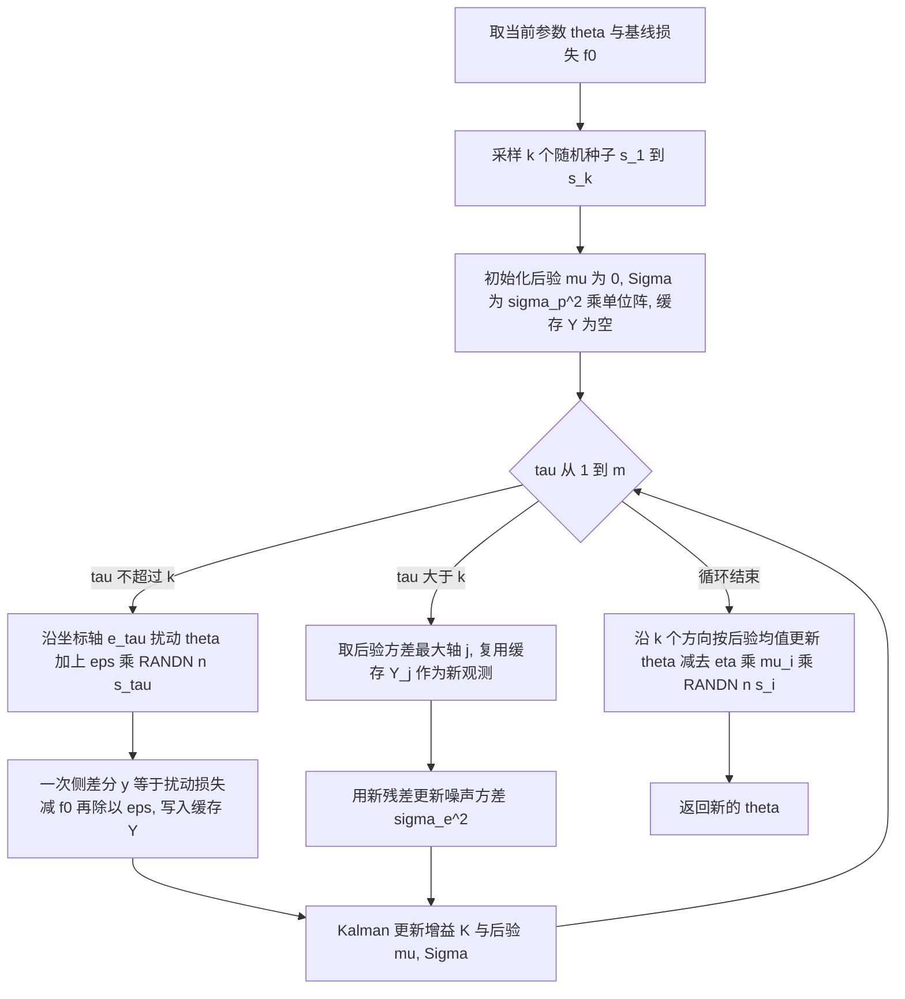
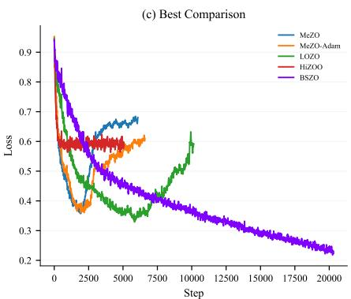

# Robust and Efficient Zeroth-Order LLM Fine-Tuning via Adaptive Bayesian Subspace Optimizer

## 核心信息

- **论文ID**：arXiv:2601.01452（PDF 页脚标注 `arXiv:2601.01452v4 [cs.LG] 16 Jan 2026`，正文首页另写 `Preprint. January 19, 2026`，两处日期不一致，以 v4 提交戳为准）
- **作者**：Jian Feng、Zhihong Huang（通讯，stswzh@mail.sysu.edu.cn）
- **机构**：School of Mathematics, Sun Yat-sen University（中山大学数学学院），Guangzhou
- **发布时间**：2026-01-16（v4）
- **会议/期刊**：预印本，未见会议录用信息
- **链接**：[arXiv](https://arxiv.org/abs/2601.01452) | [PDF](../../../01-raw/2026-09/Robust_and_Efficient_Zeroth_Order_LLM_Fine_Tuning_via_Adaptive_Bayesian_Subspace_Optimizer.pdf) | [解析稿](../../../02-markdown/2026-09/Robust_and_Efficient_Zeroth_Order_LLM_Fine_Tuning_via_Adaptive_Bayesian_Subspace_Optimizer.md)
- **代码**：论文声称开源于 `github.com/AeonianQuill/BSZO`；**本次核验未通过**（当前网络环境访问 GitHub 与 arXiv API 均超时），可复现性尚未证实

## 一句话贡献（最强版本）

把零阶梯度估计从"多次差分取平均"改写成"对子空间投影梯度的贝叶斯后验推断"：用 Kalman 更新把同一批内 $k$ 个扰动方向的一次侧差分融合成一个后验均值 $\mu$，再用残差自适应噪声方差，于是**同样（甚至更少）的前向次数、$O(k^2)$ 额外显存**下收敛率改善 $k/\gamma$ 倍，并且在 fp16/bf16 下不崩——而 HiZOO、LOZO 在同一精度下会溢出或掉 14 个点。

## 摘要翻译

### 英文摘要

Fine-tuning large language models (LLMs) with zeroth-order (ZO) optimization reduces memory by approximating gradients through function evaluations. However, existing methods essentially perform updates in a one-dimensional space, and suffer from collapse or substantial performance degradation under low-precision training. We introduce BSZO, an adaptive Bayesian Subspace Zeroth-Order Optimizer, which applies Kalman filtering to combine finite-difference information across multiple perturbation directions within a subspace. By treating each finite-difference measurement as a noisy observation, BSZO builds a posterior distribution over the subspace-projected gradient and updates it through Bayesian inference, with a residual-based adaptive mechanism to adapt to noise variations. Theoretical analysis shows that BSZO improves the convergence rate by a factor of k/γ compared to standard ZO methods. Experiments on RoBERTa, Mistral, and OPT models show that BSZO outperforms the baselines across various tasks, achieving up to 6.67% absolute average improvement on OPT-13B while remaining robust under fp16/bf16 precision and keeping memory usage close to inference-only baselines (1.00×–1.08× of MeZO).

### 中文翻译

用零阶（ZO）优化微调大语言模型（LLM）通过函数评估近似梯度从而降低显存。然而现有方法本质上在一维空间中做更新，并且在低精度训练下会崩溃或出现明显性能退化。我们提出 BSZO，一种自适应贝叶斯子空间零阶优化器，它在子空间内用 Kalman 滤波融合多个扰动方向上的有限差分信息。BSZO 把每一次有限差分测量视为一次含噪观测，从而在子空间投影梯度上构建后验分布并通过贝叶斯推断更新，同时用基于残差的自适应机制应对噪声水平变化。理论分析表明，相比标准 ZO 方法，BSZO 的收敛速率改善 $k/\gamma$ 倍。在 RoBERTa、Mistral 与 OPT 模型上的实验显示，BSZO 在各类任务上优于基线，在 OPT-13B 上平均绝对提升最高达 6.67%，同时在 fp16/bf16 精度下保持稳健，显存占用接近纯推理基线（MeZO 的 1.00×–1.08×）。

### 核心要点提炼

- **研究背景**：MeZO 类零阶微调把显存压到推理级别，但有限差分梯度估计方差大、收敛慢；HiZOO/MeZO-Adam 靠额外优化器状态换性能，又把显存抬回 1.7×–2.7×。
- **研究动机**：现有方法"一批一方向一更新"，同一批内多个扰动之间的信息关系被丢弃；且噪声水平随训练阶段剧烈变化，方法不感知，导致低精度下震荡、跳出极小值域乃至崩溃。
- **核心方法**：以 $k$ 个高斯扰动方向张成子空间 $B$，把归一化子空间梯度 $\tilde{g} = B^{\top} g$ 当隐变量、把一次侧差分当含噪线性观测，用 Kalman/贝叶斯线性回归闭式更新后验 $(\mu, \Sigma)$；噪声方差由预测残差滚动估计；扰动向量按随机种子存，额外空间 $O(k^2)$。
- **主要结果**：OPT-13B（bf16）平均 73.76% vs MeZO 67.09%（+6.67）；Mistral-7B（fp16）77.83% vs MeZO 75.31%；OPT-1.3B（fp32）74.92% vs MeZO 71.95%；RoBERTa-large（fp32）77.28% vs MeZO 77.04%（+0.24）。
- **研究意义**：给 ZO 优化提供一条"信息融合"而非"额外状态"的降方差路线，把低精度稳健性变成一等公民指标。

## 研究背景与动机

### 领域现状

13B 模型全量微调需要 100 GB 级以上显存，约为推理的 10 倍，因此学术界与工业界普遍转向两条省显存路线：PEFT（LoRA、Adapter，仍需反向传播）与零阶优化（只用前向，MeZO 把显存压到推理级别）。零阶路线的代价是收敛慢、需要远多于一阶的迭代步数，根源是有限差分梯度估计的高方差。

围绕这个方差问题，后续工作各自切一个瓶颈：Sparse-MeZO 只更新有影响力的参数；HiZOO 用对角 Hessian 估计做自适应预条件；LOZO 利用梯度低秩结构；TeZO 利用跨迭代时间相关性。

### 现有方法的局限性

论文自陈三点，实测证据在 Figure 1 与 Table 3：

1. **一维更新、信息丢弃**。多数 ZO 优化器每批沿单一随机方向更新；即便增加扰动方向，也只是把它们独立平均，不使用"这些测量之间如何相互约束"的信息。
2. **噪声不感知**。ZO 估计的噪声水平在训练中变化很大，固定步长尺度会让更新在局部极小附近剧烈震荡、跳出吸引域，最终崩溃。
3. **低精度脆弱**。fp16/bf16 下基线方法崩溃或严重退化：HiZOO 在 OPT-13B(bf16) 上平均从 69.48% 掉到 55.58%，TREC 崩到 19.8%、WSC 46.15%（接近随机）；HiZOO 与 LOZO 在 Mistral-7B(fp16) 的 TREC 直接数值溢出（论文用 `*` 标记）。

还有一条方法论层面的不满：部分方法为提升精度引入可观显存开销，与零阶优化"最小化显存"的初衷相冲突。

### 研究动机

在同等甚至更少前向次数、且显存不高于 MeZO 的前提下，把同一批内多次函数评估的信息真正用起来，得到方差更低的梯度估计，并让算法自适应地跟踪噪声变化。

## 研究问题

**主问题**：能否把零阶梯度估计形式化为一个推断问题——给定 $k$ 次含噪的方向导数测量，真实子空间梯度的最优猜测是什么——从而在不引入 $O(n)$ 额外状态的情况下同时改善收敛速率与低精度稳健性？

**判据**：(i) 前向次数不高于同量级基线（BSZO 默认 $k=2, m=3$，与 HiZOO 的 3 次持平）；(ii) 额外显存 $o(n)$；(iii) 收敛率相对 ZO-SGD 有可证明的改善因子；(iv) fp16/bf16 下不退化。

## 方法概述

### 核心思想

先抛开 Kalman 这个词，本文的实际做法是：在参数空间随机取 $k$ 个高斯方向 $z_1, z_2, ..., z_k$ 张成一个 $k$ 维子空间，把"这个子空间里的梯度分量"当成一个未知的 $k$ 维向量 $\tilde{g}$ 去猜。每做一次扰动前向，就得到关于 $\tilde{g}$ 的一个线性方程（带噪声）；做 $m$ 次就得到 $m$ 个方程。$m > k$ 时方程组超定，最小二乘解比单点估计更稳。作者指出这套"带先验的递推最小二乘"就是 Kalman 滤波，于是可以直接写出闭式后验，并且天然给出一个收缩因子 $\gamma$ 来限制更新幅度——噪声越大，$\gamma$ 越小，步子自动收着走。

关键取舍在于：**用"对同一批观测做统计融合"替代"存额外优化器状态"**，所以显存只随 $k$ 增长而不随参数量 $n$ 增长。

### 方法框架

论文没有方法架构图（Figure 1 是损失曲线、Figure 2 是显存柱状图），下面按 Algorithm 1 重绘单步流程：

### 数学公式

优化问题（论文式 (1)）：

$$
\min_{\theta \in \mathbb{R}^n} \mathcal{L}(\theta) := \mathbb{E}_{\xi \sim \mathcal{D}}[\mathcal{L}(\theta; \xi)]
$$

子空间由 $k$ 个独立高斯方向拼成（定义 3.3）：$B = [z_1, z_2, ..., z_k] \in \mathbb{R}^{n \times k}$，$z_i \sim \mathcal{N}(0, I_n)$。沿子空间方向 $d$ 的一次侧差分（定义 3.4，式 (5)）：

$$
\hat{y}(\theta; \xi, d) = \frac{\mathcal{L}(\theta + \varepsilon B d; \xi) - \mathcal{L}(\theta; \xi)}{\varepsilon}
$$

链式法则给出子空间梯度与真实梯度的关系（式 (6)）：

$$
g_d := \nabla_d \mathcal{L}(\theta + \varepsilon B d \mid d = 0) = \varepsilon B^{\top} g
$$

其中 $g := \nabla \mathcal{L}$ 是真实梯度。为了让数值尺度可控，作者定义**归一化子空间梯度** $\tilde{g} := B^{\top} g$。引理 3.5（式 (7)）说明一次侧差分是它的近似无偏测量：

$$
\mathbb{E}[\hat{y}(d)] = d^{\top} B^{\top} g + O(\varepsilon L) \approx d^{\top} \tilde{g}
$$

于是写出观测模型（式 (8)）与高斯先验：

$$
\hat{y}(d) = d^{\top} \tilde{g} + \nu, \nu \sim \mathcal{N}(0, \sigma_e^2 \Vert d \Vert^2), \tilde{g} \sim \mathcal{N}(0, \sigma_p^2 I_k)
$$

$m$ 次观测后的闭式后验（式 (9)，即贝叶斯线性回归）：

$$
\Sigma^{(m)} = \left(\sigma_p^{-2} I_k + D^{\top} R^{-1} D\right)^{-1}, \mu^{(m)} = \Sigma^{(m)} D^{\top} R^{-1} Y
$$

其中 $D \in \mathbb{R}^{m \times k}$ 是设计矩阵、$Y \in \mathbb{R}^m$ 是观测向量、$R$ 是对角噪声协方差矩阵，其第 $i$ 个对角元为 $\sigma_e^2 \Vert d^{(i)} \Vert^2$。

推论 3.6 是全文的支点：默认取坐标轴采样 $d^{(i)} = e_i$ 且 $m = k$ 时，后验退化为

$$
\Sigma^{(k)} = \gamma I_k, \mu^{(k)} = \gamma Y, \gamma := \frac{\sigma_p^2}{\sigma_p^2 + \sigma_e^2} \in (0, 1)
$$

即**后验均值就是 $k$ 个方向差分乘以同一个收缩因子**。参数更新（式 (10)）：

$$
\Delta \theta = -\eta B \mu^{(k)}
$$

定理 3.7（式 (12)）说明这个更新方向在期望意义下对齐负梯度，等效学习率被放大 $k$ 倍、被 $\gamma$ 缩回：

$$
\mathbb{E}[\Delta \theta] = -\eta \gamma k \nabla \mathcal{L}(\theta) + O(\varepsilon^3)
$$

残差自适应机制（式 (13)）用预测残差滚动估计噪声尺度：

$$
r_{\tau} := \frac{\hat{y}^{(\tau)} - d^{(\tau)\top} \mu^{(\tau-1)}}{\Vert d^{(\tau)} \Vert}, (\sigma_e^{(\tau)})^2 = (1-\alpha)(\sigma_e^{(\tau-1)})^2 + \alpha r_{\tau}^2
$$

噪声分解（定义 4.1，式 (14)）把观测噪声拆成有限差分截断误差与随机梯度噪声两部分：

$$
\sigma_e^2 = \sigma_{\varepsilon}^2 + tr(\Sigma), tr(\Sigma) \leq \sigma_g^2
$$

主定理 4.2（式 (15)），记有效维度 $\tilde{n} = n + k + 1$、$\beta(\eta) := 1 - \frac{L \eta \gamma \tilde{n}}{2}$，在 $\eta < \frac{2}{L \gamma \tilde{n}}$ 下有：

$$
\frac{1}{T} \sum_{t=0}^{T-1} \mathbb{E}[\Vert \nabla \mathcal{L}(\theta_t) \Vert^2] \leq \frac{\mathcal{L}(\theta_0) - \mathcal{L}^{*}}{\beta(\eta) \eta \gamma k T} + \frac{L \eta \gamma (\tilde{n} tr(\Sigma) + n \sigma_{\varepsilon}^2)}{2 \beta(\eta)}
$$

取 $\eta = \frac{1}{L \gamma \tilde{n}}$（此时 $\beta = 1/2$）得推论 4.3（式 (16)）：

$$
\frac{1}{T} \sum_{t=0}^{T-1} \mathbb{E}[\Vert \nabla \mathcal{L}(\theta_t) \Vert^2] \leq \frac{2 L \gamma \tilde{n} \Delta_0}{k T} + tr(\Sigma) + \frac{n}{\tilde{n}} \sigma_{\varepsilon}^2
$$

读法：首项是 $O(1/(kT))$ 的收敛项，相比 ZO-SGD 的 $O(1/T)$ 快了 $k$ 倍；$\gamma$ 在分子上会削弱这一收益，但它是稳定性的代价；噪声地板 $tr(\Sigma) + \frac{n}{\tilde{n}} \sigma_{\varepsilon}^2$ 不随 $T$ 消失，说明**BSZO 改善的是收敛速度，不是最终精度上限**。

### 各模块详细说明

**（1）子空间与坐标轴采样。** $k$ 个方向不显式存储，只存 $k$ 个随机种子（沿用 MeZO 的技巧），因此"额外空间 $O(k^2)$"指的是后验协方差 $\Sigma$ 与缓存，与 $n$ 无关。默认 $k = 2$。

**（2）Kalman 递推而非批量求逆。** Algorithm 1 用 $K \leftarrow \Sigma d / (d^{\top} \Sigma d + \sigma_e^2)$、$\mu \leftarrow \mu + K(y - d^{\top}\mu)$、$\Sigma \leftarrow \Sigma - K d^{\top} \Sigma$ 逐条观测更新，避免 $m \times m$ 矩阵求逆，也让 $\sigma_e^2$ 能在递推中被就地修正。

**（3）$m = k+1$ 的"免费"额外观测。** 坐标轴采样下 $\Sigma^{(k)} = \gamma I_k$ 是各向同性的，任何坐标轴都是等价的最大不确定方向——退化使自适应采样失去意义。残差更新打破了这种退化（使对角元不再相等），于是第 $k+1$ 步取对角元最大的轴 $j$，**直接复用缓存的 $Y[j]$** 而不再做一次前向。这是本文显存/前向预算控制的巧点：$k=2, m=3$ 只需 3 次前向。

**（4）BSZO-B（无缓存基版本，Algorithm 2）。** 第 $k+1$ 步真的再扰动做一次前向。作者指出在低精度下由于 GPU 算子的非确定性以及"扰动-还原"后参数无法完全复原，这次前向会得到与缓存不同的值，反而更贴近扰动点的局部地形，因此 BSZO-B 在多数设置下略优于 BSZO（OPT-13B bf16：74.51 vs 73.76；Mistral fp16：78.51 vs 77.83）。代价是多一次前向（4 次 vs 3 次）。

**（5）自适应噪声估计。** 动机是"优化中后期有限差分估计的范数因数值精度限制而变大"，用残差平方 EMA 跟踪 $\sigma_e$，$\alpha$ 为平滑因子。

### 关键创新

1. 首次把贝叶斯推断 / Kalman 滤波用于 LLM 的零阶梯度估计（作者自陈的首创性声明）。
2. 残差驱动的自适应机制，免去手工调更新尺度。
3. 收敛率相对标准 ZO 改善 $k/\gamma$ 倍的分析（定理 4.2 与推论 4.3）。
4. 缓存 $(d, y)$ 使自适应采样不增加前向次数，从而显存与 MeZO 同级（$O(k^2)$ 额外空间）。

## 实验结果

### 数据集与设置

| 数据集 | 训练样本 | 验证样本 | 任务类型 |
|---|---|---|---|
| SST-2 | 1000 | 500 | 情感分类 |
| RTE | 1000 | 500 | NLI |
| BoolQ | 1000 | 500 | 是非问答 |
| COPA | 300 | 100 | 常识推理 |
| WIC | 1000 | 500 | 词义判断 |
| WSC | 450 | 100 | 指代消解 |
| CB | 200 | 50 | 蕴含/承诺 |
| TREC | 1000 | 500 | 问题分类 |

模型：RoBERTa-large(355M, fp32)、OPT-1.3B(fp32)、Mistral-7B(fp16)、OPT-13B(bf16)；基线：MeZO、MeZO-Adam、HiZOO、LOZO；单卡 H200；$\varepsilon = 10^{-4}$、batch size 16、最多 20000 步、早停耐心 4000 步；BSZO/BSZO-B 默认 $k=2, m=3$；学习率按各方法自身网格搜索后取验证集最优再报测试精度。

### 主要结果（论文自述数据）

RoBERTa-large（fp32，5 次运行均值±标准差）：

| 方法 | SST-2 | RTE | CB | WIC | TREC | AVG |
|---|---|---|---|---|---|---|
| MeZO | 92.22 (±0.42) | 66.35 (±3.06) | 86.07 (±5.56) | 55.20 (±3.73) | 85.36 (±2.33) | 77.04 |
| MeZO-Adam | 92.34 (±0.50) | 63.61 (±1.41) | 81.07 (±2.71) | 52.85 (±4.19) | 78.80 (±5.76) | 73.73 |
| HiZOO | 91.44 (±0.45) | 59.21 (±2.46) | 76.43 (±1.96) | 53.60 (±2.93) | 63.44 (±2.61) | 68.82 |
| LOZO | 91.83 (±0.30) | 62.60 (±2.31) | 84.29 (±3.87) | 54.20 (±1.32) | 77.76 (±2.15) | 74.14 |
| BSZO | 92.66 (±0.21) | 67.80 (±1.52) | 85.71 (±1.79) | 56.05 (±1.47) | 84.16 (±0.54) | 77.28 |
| BSZO-B | 92.27 (±0.41) | 68.38 (±1.94) | 84.29 (±1.49) | 57.21 (±0.98) | 84.80 (±1.57) | 77.39 |

三个模型（测试精度 %，`*` 表示 fp16 下数值溢出崩溃）：

| 模型 / 方法 | SST-2 | RTE | COPA | WIC | WSC | TREC | AVG |
|---|---|---|---|---|---|---|---|
| OPT-1.3B MeZO | 91.74 | 64.98 | 76.0 | 58.78 | 59.62 | 80.6 | 71.95 |
| OPT-1.3B HiZOO | 91.51 | 62.09 | 77.0 | 56.58 | 63.46 | 66.2 | 69.48 |
| OPT-1.3B **BSZO** | 92.43 | **66.79** | 79.0 | **59.88** | **64.42** | 87.0 | **74.92** |
| OPT-1.3B BSZO-B | 93.01 | 64.98 | **81.0** | 59.09 | 61.54 | **87.4** | 74.50 |
| Mistral-7B(fp16) MeZO | 90.94 | 64.26 | 88.0 | 56.58 | 63.46 | 88.6 | 75.31 |
| Mistral-7B(fp16) HiZOO | 93.01 | 63.90 | 90.0 | 55.64 | 63.46 | * | 73.20 |
| Mistral-7B(fp16) LOZO | 92.43 | 61.37 | 86.0 | 57.83 | 63.46 | * | 72.22 |
| Mistral-7B(fp16) **BSZO** | **94.50** | 75.81 | 87.0 | **60.03** | 59.62 | 90.0 | 77.83 |
| Mistral-7B(fp16) BSZO-B | 94.04 | **78.70** | 87.0 | 59.72 | 60.58 | **91.0** | **78.51** |
| OPT-13B(bf16) MeZO | 85.89 | 62.09 | 80.0 | **54.55** | 60.58 | 59.4 | 67.09 |
| OPT-13B(bf16) MeZO-Adam | 79.82 | 61.73 | 81.0 | 54.39 | 57.69 | 62.2 | 66.14 |
| OPT-13B(bf16) HiZOO | 72.71 | 62.46 | 80.0 | 52.35 | 46.15 | 19.8 | 55.58 |
| OPT-13B(bf16) LOZO | 86.12 | 57.04 | 80.0 | 55.96 | 59.62 | 60.4 | 66.52 |
| OPT-13B(bf16) **BSZO** | **93.23** | 69.31 | 83.0 | 56.27 | 61.54 | 79.2 | 73.76 |
| OPT-13B(bf16) BSZO-B | 91.86 | **71.84** | **85.0** | 53.14 | **64.42** | **80.8** | **74.51** |

显存与单步时间（Table 4）：

| 方法 | OPT-1.3B Mem/Time | Mistral-7B Mem/Time | OPT-13B Mem/Time |
|---|---|---|---|
| MeZO | 9.1 GB / 109.7 ms | 18.3 GB / 283.9 ms | 30.0 GB / 464.2 ms |
| MeZO-Adam | 19.7 / 135.1 | 47.6 / 373.1 | 82.1 / 614.5 |
| HiZOO | 15.7 / 188.0 | 34.3 / 540.2 | 58.9 / 877.1 |
| LOZO | 9.3 / 102.0 | 18.3 / 274.2 | 30.0 / 452.0 |
| BSZO | 9.8 / 97.0 | 18.8 / 275.7 | 30.1 / 440.5 |

### 结果分析

- **增益随模型规模与精度压力增大**：fp32 小模型上 BSZO 相对 MeZO 只赢 0.24（RoBERTa）到 2.97（OPT-1.3B）个点；bf16 的 OPT-13B 上赢 6.67 个点。也就是说，BSZO 的主要收益来自**别人在低精度下崩了而它没崩**，而不是同精度公平条件下的普遍优势。
- **方差显著更小**：RoBERTa 上 BSZO 各任务标准差普遍是基线的 1/2 到 1/10（TREC ±0.54 vs MeZO ±2.33；CB ±1.79 vs MeZO ±5.56），这与其"融合观测降方差"的主张一致，是全文最可信的一条实证证据。
- **消融方向一致但非单调**：$m = k+1$ 在 RTE 上稳定 +1~2 个点（$k=2$：64.26→66.79；$k=8$：66.07→68.59）；$k$ 从 1 增到 4 时 RTE 从 60.29 升到 67.51，但 $k=8$ 回落到 66.07，说明 $k$ 并非越大越好。自适应噪声在 OPT-13B(bf16) 的 6 个任务里 5 个变好（RTE +6.13），但在 OPT-1.3B(bf16) 的 $k=1,2$ 档反而变差（54.15 vs 55.24；57.76 vs 56.32 中仅 $k=4,8$ 明显占优）。
- **效率结论存疑**：BSZO 每步 3 次前向却报告比 1 次前向的 MeZO 更快（OPT-13B：440.5 vs 464.2 ms），论文未解释，需核验是否为实现/测量口径差异。

> 图1(a)：MeZO / MeZO-Adam 在 bf16 下的损失曲线。同一方法换学习率后曲线形态差异极大（lr=1e-7 的 MeZO-Adam 长期停在 0.7 附近不动，lr=1e-5 的 MeZO 在 0.65 处反弹），直观呈现"噪声不感知 → 震荡/停滞"的问题。BSZO（紫色）在 20000 步内单调降到 0.23 左右。

> 图1(b)：LOZO / HiZOO 的损失曲线。HiZOO lr=1e-6（红色）在约 2500 步后完全平台化在 0.70，LOZO lr=1e-7（橙色）在 6000 步后反弹到 0.6 以上——这是低精度下"跳出吸引域"的直接证据。

> 图1(c)：每个方法取其调优后的最佳学习率再比较。即便基线已是最优配置，BSZO（紫色）仍单调收敛到最低损失，其余方法停在 0.55~0.70 区间或明显反弹。这是本文主张的核心可视化证据。

> 图2：显存对比。BSZO（浅绿）与 MeZO（深蓝）几乎齐平（OPT-1.3B 9.8 vs 9.1 GB、Mistral-7B 18.8 vs 18.3 GB、OPT-13B 30.1 vs 30.0 GB），而 MeZO-Adam 与 HiZOO 分别是 MeZO 的 2.0×~2.7× 与 1.7×~2.0×。这张图支撑了"不靠额外状态换性能"的定位。

## 深度分析

### 研究价值

真正的贡献不在"又一个 ZO 优化器"，而在**换了一个降方差的坐标系**：以往工作要么改采样（Sparse-MeZO、ConMeZO）、要么加状态（HiZOO、MeZO-Adam）、要么加结构先验（LOZO 低秩、TeZO 时间相关），BSZO 把问题改写成"同一批内 $m$ 个线性含噪方程如何最优地反解 $k$ 维未知量"，这是一个统计融合问题而不是优化器状态问题，因此额外成本是 $O(k^2)$ 而非 $O(n)$。对显存受限的单卡微调场景，这个取舍方向是对的。

### 优势

1. **显存-精度-前向三者同时守住**：$O(k^2)$ 额外空间、与 MeZO 同级显存、前向次数与 HiZOO 持平（3 次）却不需要 Hessian 状态。
2. **低精度稳健性有硬证据**：Table 3 中基线在 fp16/bf16 出现溢出（`*`）与崩塌（HiZOO TREC 19.8%），BSZO 全部跑通且不退化，OPT-13B(bf16) 上 BSZO-B 相对自身 fp32 小模型仅 74.51 vs 74.50。
3. **估计方差下降可量化**：RoBERTa 5 次运行的标准差系统性小于所有基线。
4. **实现门槛低**：在 MeZO 之上只多一个 $k \times k$ 后验与一个残差 EMA，不需要二阶信息或模型结构假设。
5. **理论-算法闭环可读**：推论 3.6 把 Kalman 更新化简成"差分乘 $\gamma$"，让定理 4.2 的 $k/\gamma$ 因子有直观来源。

### 局限性

1. **理论未覆盖其卖点之一**。第 4 节明确写"For analytical tractability, we assume that $\sigma_e$ is fixed"，而定理 B.7 只处理自适应**采样方向**，式 (13) 的自适应**噪声方差**始终不在任何定理的假设内。因此"残差自适应带来 $k/\gamma$ 改善"这一表述不成立——改善来自 $k$ 倍融合，自适应只是工程补丁。
2. **观测噪声的各向同性近似是实质妥协**。引理 B.2 给出的是条件方差 $(Bd)^{\top} \Sigma (Bd)$，只有对 $B$ 取期望后才等于 $tr(\Sigma)$。式 (8) 直接用 $\sigma_e^2 \Vert d \Vert^2$ 意味着 Kalman 增益用的是"平均方差"，当 $\Sigma$ 高度各向异性（LLM 梯度噪声实际就是如此，HiZOO 的全部动机即在此）时，增益会系统性偏离最优。
3. **偏差阶表述自相矛盾**。定理 3.7 与式 (12) 写 $O(\varepsilon^3)$，而附录 B.4 Step 4 的推导得到 $O(\varepsilon^2 L)$ 后才"记作" $O(\varepsilon^3)$；引理 B.1 的偏差本身是 $O(\varepsilon L)$。三处口径不一致。
4. **假设 3.1 的"等价"不成立**。式 (2) 要求损失函数值之差本身被 $L \Vert \theta - \theta' \Vert$ 控制（函数值 Lipschitz），式 (3) 才是梯度 Lipschitz 的标准 smoothness 上界；后者并不等价于前者（还需 $\nabla \mathcal{L}$ 有界），且原文用范数符号包裹标量损失差。属于表述瑕疵，不影响主证明（证明只用式 (3)）。
5. **fp32 公平条件下优势很小**。RoBERTa 上 +0.24 且 MeZO 的 CB/WIC 标准差达 ±5.56/±3.73，未做显著性检验，无法排除"打平"。
6. **最近邻基线缺席**。子空间方向的核心竞品（随机子空间 ZO、subspace DFO）未被比较，HiZOO 之外没有与任何"融合多方向信息"的方法（如方差缩减 ZO）对照。
7. **有效维度 $\tilde{n} = n + k + 1$ 的引入使学习率条件与 $n$ 相关**，$\eta < 2/(L \gamma \tilde{n})$ 在 $n \sim 10^{10}$ 时是极小步长，与"通过大学习率加速"的直觉相反；论文没有讨论这个约束在实践中意味着什么。
8. **BSZO 与 BSZO-B 的差别依赖非确定性算子**。作者把 BSZO-B 更好的表现归因于 cuDNN 非确定性算法与"扰动-还原后参数不完全复原"，这等于承认有一部分增益来自数值噪声而非算法设计，可复现性风险较高。

### 致命问题与非致命局限

- **非致命**：$O(\varepsilon^3)$ 与 $O(\varepsilon^2)$ 的口径不一致、Assumption 3.1 的等价性表述、Table 4 时间反常——这些都能通过修订证明与重测解决。
- **接近致命的一条**：**"改善 $k/\gamma$ 倍收敛率"这一理论主张与其实现条件不匹配**。定理要求 $\sigma_e$ 固定，而算法的默认形态是自适应 $\sigma_e$ 且第 $k+1$ 步复用缓存观测（即 $D$ 矩阵出现重复行，$R$ 中的方差已被新残差改写）。在这个真实执行路径下，式 (9) 的后验解释（"独立高斯观测的贝叶斯融合"）不再严格成立，因此 $k/\gamma$ 的改善因子不能直接搬到默认算法上。要修补需要重做定理（把缓存复用建模为带相关噪声的重复观测），工作量不小但可完成——所以判为"接近致命但可修"。
- **另一条需要警惕的**：论文最强的实证卖点是低精度稳健性，而稳健性的机理被部分归因于数值非确定性。若在同一硬件、固定种子、确定性算子下重跑，BSZO 与 BSZO-B 的排序以及 BSZO 对 MeZO 的增益幅度都可能变化。

### 复现可行性评估（未实测）

- 论文实验在单卡 H200（141 GB）上完成，OPT-13B 用 bf16、Mistral-7B 用 fp16。
- 本地 3060 6 GB：只能覆盖 OPT-1.3B fp32/fp16 的 $k=2, m=3$ 设置（MeZO 级显存约 9.1 GB 仍超出，需 gradient checkpointing 或换 350M 级模型 + LoRA-free 全量微调不可行）→ 建议改为 RoBERTa-large(355M) 的 fp32 复现，Table 1 可直接对照。
- 服务器 V100 无 bf16：**论文主打的 OPT-13B(bf16) 稳健性结论无法在 V100 上复现**，只能退到 fp16 或 fp32 口径，而这恰好是 BSZO 相对 MeZO 增益最小的区间。若要把这篇论文纳入自己的实验对照，必须事先声明精度口径不可比。
- 代码仓库链接本次网络不可达，尚未核验是否真的可运行。

### 适用场景

- 适用：单卡/低显存下对 1B~13B 模型做全参数微调；低精度（fp16/bf16）训练且基线不稳定；任务数据量小（千级样本）、可接受万级前向步数；不希望引入二阶信息或结构先验。
- 不适用：需要最高最终精度且显存不是瓶颈（直接用一阶 Adam）；目标函数不可前向采样（不适用 ZO）；$k$ 需要很大才能见效但前向预算被严格限制；需要可证的复杂度界（本文只给速率，不给复杂度保证）；对数值可复现性要求极严格的场景。

## 主张-证据-限制矩阵

| 论文主张 | 支撑证据 | 证据强度 | 未覆盖的限制 |
|---|---|---|---|
| 收敛率比标准 ZO 改善 $k/\gamma$ 倍 | 定理 4.2 + 推论 4.3；消融 Table 5(a)(b) 中 $k$、$m$ 的趋势 | 中 | 定理假设 $\sigma_e$ 固定，默认算法是自适应 + 缓存复用；$k=8$ 时 RTE 反而回落 |
| 低精度下稳健而基线崩溃 | Table 3 的 `*` 与 HiZOO 55.58%；Figure 1 三张损失曲线 | 强 | 增益部分来自基线崩塌；同精度 fp32 下优势缩小到 0.24~2.97 |
| 显存接近纯推理基线 | Table 2 复杂度 $O(k^2)$；Table 4 实测 1.00×~1.08×；Figure 2 | 强 | 未报告 $k=8$ 时的显存与时间 |
| 梯度估计方差更低 | Table 1 标准差系统性最小；Table 11 原始 5 次运行 | 中强 | 仅 RoBERTa 有 5 次运行，三个 LLM 未见重复次数说明 |
| 残差自适应无需人工调参 | Table 5(c)(d)：OPT-13B(bf16) 6 任务中 5 个变好 | 中 | OPT-1.3B $k=1,2$ 时 w/ 反而差于 w/o；无 $\alpha$ 敏感性分析 |
| BSZO 更快 | Table 4 单步 440.5 ms（低于 MeZO 的 464.2 ms） | 弱 | 3 次前向快于 1 次前向，未解释口径 |

## 与最接近工作对比

### **Fine-Tuning Language Models with Just Forward Passes（MeZO）**（Malladi et al., NeurIPS 2023）

- 关系：直接基线与改进对象。
- 差异与改进点：MeZO 用单次 SPSA 式差分沿一个随机方向更新，"一批一更新"；BSZO 在同一批内取 $m = k+1$ 个方向观测并做贝叶斯融合，把"多方向"从"平均"升级为"信息约束"。BSZO 沿用 MeZO 的种子重生成技巧来省显存，因此两者显存同级，而 MeZO 的方差随 $n$ 线性增长这一问题并未被 BSZO 消除，只是被 $k$ 倍融合摊薄。
- 本地原文：[../../../01-raw/2026-09/Fine_Tuning_Language_Models_with_Just_Forward_Passes.pdf](../../../01-raw/2026-09/Fine_Tuning_Language_Models_with_Just_Forward_Passes.pdf)

### **Zeroth-Order Fine-Tuning of LLMs in Random Subspaces**（Yu et al., ICCV 2025）

- 关系：同一"子空间"思路的并行工作，**BSZO 既未引用也未比较**，是本文相关工作覆盖上的实质缺口。
- 差异与改进点：该工作明确指出 ZO 估计方差随扰动维度（即参数量）线性增长，并把微调限制在随机低维子空间内以降低有效维度；BSZO 同样在低维子空间工作，但把降方差寄托在"跨方向观测融合 + 收缩因子"，而不是降低有效维度。两者可以叠加（在随机子空间内再做贝叶斯融合），这本身是一个可做的实验。
- 本地原文：[../../../01-raw/2026-09/Zeroth_Order_Fine_Tuning_of_LLMs_in_Random_Subspaces.pdf](../../../01-raw/2026-09/Zeroth_Order_Fine_Tuning_of_LLMs_in_Random_Subspaces.pdf)

### **Enhancing Zeroth-Order Fine-Tuning for Language Models with Low-Rank Structures（LOZO）**（Chen et al., 2024）

- 关系：同为"利用结构信息降方差"的竞品，但结构假设不同。
- 差异与改进点：LOZO 假设梯度具有低秩结构并在低秩子空间内估计；BSZO 不依赖任何模型结构先验，子空间由随机高斯方向张成。实验上 LOZO 在 Mistral-7B(fp16) 的 TREC 溢出崩溃、OPT-13B(bf16) 平均 66.52%，BSZO 分别为 77.83% 与 73.76%，说明结构先验在低精度下反而更脆。
- 本地原文：[../../../01-raw/2026-09/Enhancing_Zeroth_order_Fine_tuning_for_Language_Models_with_Low_rank_Structures.pdf](../../../01-raw/2026-09/Enhancing_Zeroth_order_Fine_tuning_for_Language_Models_with_Low_rank_Structures.pdf)

### **Second-Order Fine-Tuning Without Pain for LLMs: A Hessian Informed Zeroth-Order Optimizer（HiZOO）**（Zhao et al., ICLR 2025）

- 关系：同为"每步 3 次前向"的直接竞品，也是低精度崩溃最严重的对照。
- 差异与改进点：HiZOO 用对角 Hessian 估计做自适应预条件，需 $O(n)$ 额外显存；BSZO 只用 $O(k^2)$。二者对噪声的处理方向相反：HiZOO 试图用曲率重标定步长，BSZO 用后验收缩压低噪声影响。OPT-13B(bf16) 上 HiZOO 平均 55.58%（TREC 19.8%）vs BSZO 73.76%。**本地无 HiZOO 原文**（仅有处理类似问题的 HELENE），对比依据为本文 Table 3/Figure 1 的转述。

### **Variance-Reduced Zeroth-Order Methods for Fine-Tuning Language Models**（Gautam et al.）

- 关系：同一目标（降方差）的另一条技术路线，BSZO 未比较。
- 差异与改进点：该路线把经典 SVRG/SARAG 式方差缩减嫁接到 ZO，需要维护快照/历史梯度，属于"用额外状态换方差"；BSZO 属于"用同批信息融合换方差"，不引入 $O(n)$ 状态。这构成 BSZO 主张"不靠额外状态"时最该对照的一组。
- 本地原文：[../../../01-raw/2026-09/Variance_reduced_Zeroth_Order_Methods_for_Fine_Tuning_Language_Models.pdf](../../../01-raw/2026-09/Variance_reduced_Zeroth_Order_Methods_for_Fine_Tuning_Language_Models.pdf)

### **MpSub: A Momentum $p$-Dimensional Subspace Trust-Region Method for Derivative-Free Fine-Tuning of Large Language Models**（本地已精读）

- 关系：同样在 $p$ 维子空间内做无梯度 LLM 微调，是"子空间 + 大模型"这条线上最贴近的方法学对照。
- 差异与改进点：MpSub 走的是信赖域 + 插值模型路线，给的是复杂度保证；BSZO 走贝叶斯融合路线，给的是速率改善因子但没有复杂度界。二者对"子空间内多方向信息"的用法不同：一个用来构造可验证的局部模型与半径接受/拒绝，一个用来构造后验均值。
- 本地笔记：[MpSub 精读](../MpSub_A_Momentum_$p$_Dimensional_Subspace_Trust_Region_Method_for_Derivative_Free_Fine_Tuning_of_Large_Language_Models/精读.md)

### **Powell-Style Model-Based Derivative-Free Optimization with Complexity Guarantees**（本地已精读）

- 关系：经典 DFO 的路线坐标，用来界定 BSZO 的"信息利用"程度。
- 差异与改进点：Powell 式方法与本文同属"只用函数值"，但它显式构造下模型并给出复杂度保证；BSZO 只给一阶平稳点的收敛速率，且没有接受/拒绝机制（步长完全由 $\gamma$ 与残差决定）。对照后可看出 BSZO 放弃了 DFO 的可验证性换取了可扩展性。
- 本地笔记：[Powell 式 DFO 精读](../Powell_Style_Model_Based_Derivative_Free_Optimization_with_Complexity_Guarantees/精读.md)

### **SubZero+: Efficient Zeroth-Order LLM Fine-Tuning via Large Learning Rates**（同目录，另一条稳定化路线）

- 关系：同样针对 ZO 在 LLM 微调中的噪声/步长问题，但切入点是学习率尺度而非信息融合。细节待其精读笔记定稿后再展开对照，此处不作机制层面的判断。
- 本地笔记：[SubZero+ 精读](../SubZero+_Efficient_Zeroth_Order_LLM_Fine_Tuning_via_Large_Learning_Rates/精读.md)

## 技术路线定位

零阶 LLM 微调可以按"方差从哪里来、用什么代价去压"分成三代：

1. **采样层**：MeZO（单方向 SPSA）→ Sparse-MeZO（只动关键参数）、ConMeZO（自适应下降方向采样）——改变"往哪儿扰动"。
2. **状态层**：MeZO-Adam（动量）、HiZOO（对角 Hessian）、TeZO（时间相关）——用 $O(n)$ 额外状态换方差，代价是与 ZO 的省显存初衷冲突。
3. **结构层**：LOZO（低秩）、Low-Rank Curvature、随机子空间 ZO——把更新限制在假设存在的低维结构里。

BSZO 属于第四种，也是本文的位置：**融合层**——不改采样、不加状态、不假设结构，只把同一批内的多次测量当成一个统计推断问题。它与"状态层"的 HiZOO 在前向预算上直接竞争（都是 3 次），与"结构层"的随机子空间方法在有效维度上互补，与经典 DFO（Powell 式、MpSub）在"是否给复杂度保证"上形成鲜明对照。

在控制论视角上，它是把 Kalman 滤波从"隐状态估计"平移到"梯度估计"的一次干净的 re-scope，方法论迁移价值高于单点性能提升。

## 可证伪的后续研究机会

1. **各向异性观测噪声**。把式 (8) 的 $\sigma_e^2 \Vert d \Vert^2$ 换成用历史差分对角估计出的 $\hat{\Sigma}_B$，Kalman 增益相应改为矩阵形式。预测：在 OPT-1.3B 上 RTE 提升 1 个点以上，且额外显存仍为 $O(k^2)$；若提升低于 0.3 个点，则说明各向同性近似并非瓶颈，本文对该缺陷的担忧可以排除。
2. **把自适应 $\sigma_e$ 纳入理论**。将式 (13) 写成时变 $\gamma_t$ 的随机逼近递推，检验步长条件是否需从 $\eta < 2/(L \gamma \tilde{n})$ 收紧。预测：Table 5(c) 中 $k=1,2$ 时 w/ 差于 w/o（54.15 vs 55.24）能被同一分析解释为 $\gamma_t$ 在早期被大残差推高、导致有效步长被过度收缩。
3. **与随机子空间 ZO 的公平对照**。固定前向预算与精度（fp32、$k=2$、$m=3$），比较"降维"与"融合"各自的贡献，并测试二者叠加。预测：叠加后优于任一单项；若 BSZO 在 fp32 下与随机子空间法打平，则其增益主要来自低精度稳健性而非融合本身。
4. **显著性与崩塌归因**。对 Table 3 全部配置补 5 次重复 + 配对检验，并在确定性算子（关闭 cuDNN 非确定性、固定种子）下重跑 BSZO 与 BSZO-B。预测：fp32 小模型上 BSZO vs MeZO 不显著；BSZO-B 与 BSZO 的排序在确定性设置下收敛为一致。
5. **时间口径复核**。同一实现框架内测 MeZO(1 前向) 与 BSZO(3 前向) 的 wall-clock 与"每 token 成本"。预测：BSZO 单步时间应约为 MeZO 的 2.5~3 倍，Table 4 中反而更快的结论很可能来自实现差异。
6. **噪声地板的实际意义**。推论 4.3 的地板项 $tr(\Sigma) + \frac{n}{\tilde{n}} \sigma_{\varepsilon}^2$ 与 $n$ 同阶，意味着大模型上 BSZO 无法靠增大 $T$ 逼近更低的损失。可用"固定任务、$n$ 从 1.3B 到 13B 变化时最终损失是否上移"来检验；若明显上移，则 $k$ 必须随 $n$ 增长，而这会吃掉前向预算优势。

## 我的综合评价

| 维度 | 分数 | 理由 |
|---|---|---|
| 创新性 | 7.5/10 | "把 ZO 梯度估计重述为贝叶斯线性回归 + Kalman 递推"是有效且优雅的组合迁移，但组件（子空间 DFO、SPSA、Kalman）全部成熟，且与随机子空间 ZO 的边界未被讨论 |
| 技术质量 | 6.5/10 | 算法设计自洽且工程巧点实在（缓存复用免前向、种子存扰动）；但理论与默认实现脱节（$\sigma_e$ 固定假设）、偏差阶口径三处不一致、观测噪声各向同性近似缺乏误差量化 |
| 实验充分性 | 6.5/10 | 4 模型 × 6~8 任务 + 4 组消融 + 显存/时间；缺最近邻基线（随机子空间、方差缩减 ZO）、缺显著性检验、三个 LLM 未说明重复次数、时间结论反常未解释 |
| 写作质量 | 7/10 | 结构与动机清楚，推论 3.6 的化简让理论可读；符号小错（假设 3.2 声明的方差常数是带上划线形式，式 (4) 里却用无上划线的 $\sigma_g^2$）、Assumption 3.1 的"等价"表述、Algorithm 伪代码在解析稿中层级丢失 |
| 实用性 | 7.5/10 | 与 MeZO 同级显存、超参少、低精度不崩，对单卡微调直接可用；但 V100 等无 bf16 的硬件恰好复现不了其最强卖点 |

**综合研究价值：7.0/10**（判断置信度：中——未复现、代码仓库与 arXiv 版本历史本次未能核验）。

### 突出亮点

- 把"降方差"从优化器状态问题转成统计融合问题，因此额外成本与 $n$ 解耦，这是路线层面的贡献。
- 低精度稳健性不是附带声明，而是有崩塌证据支撑的一等结论（Figure 1 + Table 3 的 `*`）。
- 标准差系统性下降，与理论主张方向一致，属于少见的"理论和实证说同一件事"。

### 可借鉴点

- **残差 EMA 作为噪声尺度探针**：任何用差分/采样估计量的方法都可以套这个机制，成本一行代码。
- **缓存 $(d, y)$ 换掉一次前向**：在预算敏感的场景里，"重复使用旧观测 + 更新其噪声方差"是通用技巧。
- **把"退化"当论据写出来**：作者用"坐标轴采样使 $\Sigma = \gamma I$ 各向同性退化 → 自适应采样失去意义 → 残差打破退化"完成了一个漂亮的动机链条，值得在自己的写作里复用。
- **BSZO-B 现象的启示**：低精度下的非确定性算子会让"同一扰动、两次前向"给出不同值，这既是噪声源，也可以被主动利用。

### 批判性思考

- 摘要里"up to 6.67% absolute average improvement"取自 bf16 的 OPT-13B，即基线崩得最狠的那一格；同一句话在 fp32 的 RoBERTa 上只剩 0.24%。读这篇论文时，"BSZO 更好"应精确理解为"BSZO 在低精度下不崩，因此在允许 bf16 的设置下赢"。
- 定理 4.2 的步长条件与 $\tilde{n} = n + k + 1$ 绑定，说明收敛率改善并没有解决 ZO 的根本困难——噪声地板随 $n$ 增长；$k$ 倍融合只是把斜率变好，终点没变低。
- "首次把贝叶斯推断用于 ZO"这一首创性声明限定在"for LLMs"，限定语很关键：贝叶斯优化与 Bayesian filtering 在 DFO 里早有应用，本文的新意在于应用场景与融合对象，而不是推断框架本身。
- 与随机子空间 ZO（ICCV 2025）未对照，是这篇论文最容易被审稿人抓的一条：两者动机、手段、收益声明高度重叠，而差异恰好是本文的立论核心。

## 我的笔记

### 一句话记住这篇

同一批多方向差分 = 一个超定含噪线性方程组 → 用 Kalman 解它 → 得到后验均值 $\mu = \gamma Y$ → 沿 $k$ 个方向各走一步；省显存、抗低精度，但只改善收敛速度、不降低噪声地板。

### 我的后续待办

- [ ] 核验 `github.com/AeonianQuill/BSZO` 是否可运行（本次网络不可达）
- [ ] 在 RoBERTa-large / fp32 上复现 Table 1 的 5 次运行标准差（唯一有重复次数的表）
- [ ] 用本地 3060 6 GB 或 V100 跑 OPT-1.3B 的 fp16 版本，确认 bf16 缺失时增益是否仍在
- [ ] 与随机子空间 ZO 做同前向预算对照（见后续机会 3）
- [ ] 检查式 (12) 的 $O(\varepsilon^3)$ 与附录 B.4 的 $O(\varepsilon^2 L)$ 是否可统一

## 相关论文

- **Fine-Tuning Language Models with Just Forward Passes**（Malladi et al., NeurIPS 2023）— 直接基线，单方向 SPSA 零阶微调
- **Zeroth-Order Fine-Tuning of LLMs in Random Subspaces**（Yu et al., ICCV 2025）— 同用低维子空间但走降方差/降维路线，BSZO 未引用
- **Enhancing Zeroth-Order Fine-Tuning for Language Models with Low-Rank Structures（LOZO）**（Chen et al., 2024）— 结构先验路线的对照
- **Second-Order Fine-Tuning Without Pain: A Hessian Informed Zeroth-Order Optimizer（HiZOO）**（Zhao et al., ICLR 2025）— 额外状态路线的对照，前向预算相同
- **Sparse MeZO: Less Parameters for Better Performance in Zeroth-Order LLM Fine-Tuning**（Liu et al., 2024）— 采样层改造
- **Variance-Reduced Zeroth-Order Methods for Fine-Tuning Language Models**（Gautam et al.）— 经典方差缩减，最该对照而缺席的一组
- **Revisiting Zeroth-Order Optimization for Memory-Efficient LLM Fine-Tuning: A Benchmark**（Zhang et al., ICML 2024）— 本文实验设置（步数、早停、数据切分）的来源之一
- **Scalable Derivative-Free Optimization Algorithms with Low-Dimensional Subspace Techniques**（Zhang, 2025）— 本文子空间思想的直接引用来源
- [MpSub 精读](../MpSub_A_Momentum_$p$_Dimensional_Subspace_Trust_Region_Method_for_Derivative_Free_Fine_Tuning_of_Large_Language_Models/精读.md) — 子空间 + 信赖域 + 复杂度保证
- [Powell 式模型无梯度优化精读](../Powell_Style_Model_Based_Derivative_Free_Optimization_with_Complexity_Guarantees/精读.md) — 显式下模型路线的参照系

## 外部资源

- arXiv 摘要页：https://arxiv.org/abs/2601.01452
- 本地原文 PDF：[01-raw/2026-09/Robust_and_Efficient_...pdf](../../../01-raw/2026-09/Robust_and_Efficient_Zeroth_Order_LLM_Fine_Tuning_via_Adaptive_Bayesian_Subspace_Optimizer.pdf)
- 解析 Markdown：[02-markdown/2026-09/Robust_and_Efficient_....md](../../../02-markdown/2026-09/Robust_and_Efficient_Zeroth_Order_LLM_Fine_Tuning_via_Adaptive_Bayesian_Subspace_Optimizer.md)
- 代码仓库（论文自述，本次未核验）：github.com/AeonianQuill/BSZO
- 通讯作者邮箱：stswzh@mail.sysu.edu.cn
