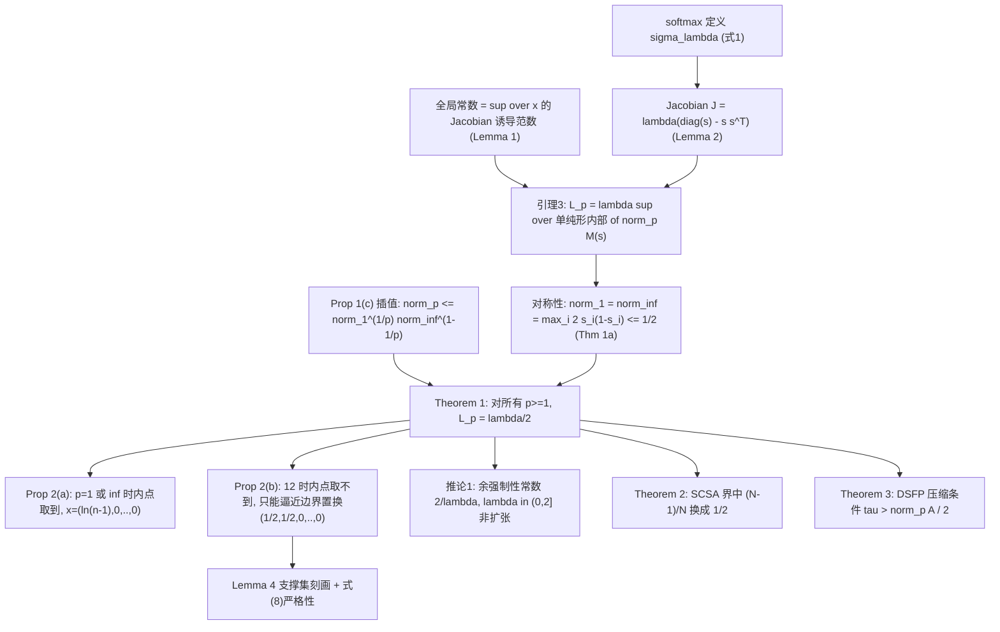
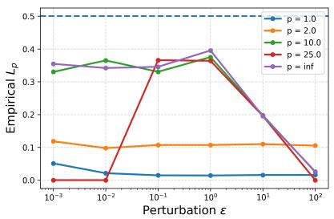

# Softmax is 1/2-Lipschitz: A tight bound across all lp norms

## 核心信息
- **论文ID**：arXiv:2510.23012（v1，2025-10-27 提交）
- **作者**：Pravin Nair（独作，Indian Institute of Technology Madras 电气工程系）
- **机构**：IIT Madras, Department of Electrical Engineering
- **发布时间**：arXiv 首发 2025-10-27；本工作区归档 2026-09-19
- **会议/期刊**：PDF 页眉标注 *Published in Transactions on Machine Learning Research (12/2025)*，并有 OpenReview 评审帖（forum `6dowaHsa6D`），即 TMLR 接收稿；**评审意见正文未能核验**（OpenReview API 返回 `ChallengeRequiredError`）
- **链接**：[arXiv](https://arxiv.org/abs/2510.23012) | [PDF](https://arxiv.org/pdf/2510.23012) | [OpenReview](https://openreview.net/forum?id=6dowaHsa6D)

## 一句话贡献（最强版本）

在 $\ell_p$（$p \ge 1$）任意范数下，带温度的 softmax 映射 $\sigma_{\lambda}$ 的全局 Lipschitz 常数恰为 $\lambda/2$，并给出该常数在概率单纯形上**何时被取到、何时只能取极限逼近**的完整分类；这把机器学习文献里普遍沿用的 "$\ell_2$ 下 1-Lipschitz" 修正为一个范数无关的紧界。

## 摘要翻译

### 英文摘要
> The softmax function is a basic operator in machine learning and optimization, used in classification, attention mechanisms, reinforcement learning, game theory, and problems involving log-sum-exp terms. Existing robustness guarantees of learning models and convergence analysis of optimization algorithms typically consider the softmax operator to have a Lipschitz constant of 1 with respect to the $\ell _ { 2 }$ norm. In this work, we prove that the softmax function is contractive with the Lipschitz constant 1/2, uniformly across all $\ell _ { p }$ norms with $p \geq 1$ . We also show that the local Lipschitz constant of softmax attains 1/2 for $p = 1$ and $p = \infty$ , and for $p \in ( 1 , \infty )$ , the constant remains strictly below 1/2 and the supremum 1/2 is achieved only in the limit. To our knowledge, this is the first comprehensive norm-uniform analysis of softmax Lipschitz continuity. We demonstrate how the sharper constant directly improves a range of existing theoretical results on robustness and convergence. We further validate the sharpness of the 1/2 Lipschitz constant of the softmax operator through empirical studies on attention-based architectures (ViT, GPT-2, Qwen3-8B) and on stochastic policies in reinforcement learning.

### 中文翻译
softmax 是机器学习与优化中的基础算子，用于分类、注意力机制、强化学习、博弈论以及含 log-sum-exp 项的问题。现有模型的鲁棒性保证与优化算法收敛性分析，通常认为 softmax 关于 $\ell_2$ 范数的 Lipschitz 常数为 1。本文证明 softmax 是压缩映射，其 Lipschitz 常数为 $1/2$，且该结论对所有 $p \ge 1$ 的 $\ell_p$ 范数一致成立。我们还证明：$p = 1$ 与 $p = \infty$ 时局部 Lipschitz 常数可取到 $1/2$；$p \in (1, \infty)$ 时常数严格小于 $1/2$，上确界 $1/2$ 只能在极限意义下达到。据作者所知，这是对 softmax Lipschitz 连续性首个覆盖一致的范数分析。作者进一步说明该更紧常数如何直接改进一批既有的鲁棒性与收敛性理论结果，并用基于注意力的架构（ViT、GPT-2、Qwen3-8B）与强化学习随机策略验证 $1/2$ 的紧性。

### 核心要点提炼
- **研究背景**：Gao & Pavel (2017) 之后，大量工作把 softmax 当作 $\ell_2$ 下 1-Lipschitz 的"平凡事实"来引用；作者实测的注意力分数经验常数明显小于 1，Xu et al. (2022) 更报告 $1/4$，文献数值互相冲突。
- **研究动机**：Lipschitz 常数在层间复合中以乘性因子出现，softmax 常数的松紧会直接传递到网络级鲁棒性、泛化与步长条件；需要一个正确且紧的值。
- **核心方法**：把全局常数写成 Jacobian 诱导范数在单纯形上的上确界（Lemma 3），对 softmax Jacobian $M(s) = \mathrm{diag}(s) - s s^{\top}$ 用行和恒等式得 $\Vert M(s) \Vert_1 = \Vert M(s) \Vert_\infty = \max_i 2 s_i (1 - s_i) \le 1/2$，再用 $\ell_1$–$\ell_\infty$ 插值不等式一次覆盖所有中间 $p$。
- **主要结果**：Theorem 1 给出 $\Vert \sigma_\lambda(\boldsymbol{x}) - \sigma_\lambda(\boldsymbol{y}) \Vert_p \le (\lambda/2) \Vert \boldsymbol{x} - \boldsymbol{y} \Vert_p$ 对一切 $p \ge 1$；Proposition 2 完成紧性与可达性分类；推论 1、Theorem 2、Theorem 3 分别改写 Gao & Pavel 推论 3、LipsFormer 的 SCSA 界与双 softmax 不动点迭代条件。
- **研究意义**：纠正一个被广泛引用的错误常数，属于"文献校准 + 乘性改进"型理论贡献；不引入新算法。

## 研究背景与动机

### 领域现状
softmax 的平滑性/敏感性分析长期建立在 Gao & Pavel (2017) 的 Proposition 3、4 之上：其 Jacobian 为 $\lambda(\mathrm{diag}(s) - s s^{\top})$，特征值与行列式性质被用于博弈论与强化学习中的收敛分析。以此为源头，鲁棒性认证、泛化界、元学习、稀疏训练、prior-data fitted networks 等工作（论文第 1 节列举约 10 处）在需要 softmax 常数时统一取 1，并常被称为"显然事实"——因为 $\Vert M(s) \Vert_2 \le 1$ 确实容易证明。

同时存在互相矛盾的更好结果：$\ell_2$ 下的 $1/2$ 已由多篇工作分别得到（论文 Remark 自述 Alghamdi et al. 2022 用 Frobenius 范数、Yudin et al. 2025 用特征值论证、Newhouse 2025 用 Gershgorin 圆盘并证明紧性），而 Xu et al. (2022) 报告 $1/4$。

### 现有方法的局限性
- 取 1 的界：证明容易但明显不紧，在复合界中会成倍放大松弛。
- 已有 $1/2$ 结果：全部固定在 $\ell_2$（或 $\ell_\infty$）单一范数下，缺少"任意 $\ell_p$ 一致成立"的表述，也未系统回答"能不能更小"。
- $1/4$：与本文定理冲突，需被排除。

### 研究动机
作者自述的直接触发点是"文献假设的常数与 transformer 上实测的经验常数不一致"。这是一个由数值观察驱动、以纠正文献为目标的理论工作。

## 研究问题

对带温度 softmax $\sigma_\lambda : \mathbb{R}^n \to \Delta_n^\circ$，其关于 $\ell_p$ 距离的最小全局 Lipschitz 常数 $L_p(\lambda, n)$ 究竟是多少？具体拆成三问：(i) 是否存在与 $p$、$n$ 无关的上界；(ii) 该上界能否被取到（在 Jacobian 局部常数的意义下，attainment 点在单纯形内部还是边界）；(iii) 换成正确常数后，哪些既有的下游理论结果可以被机械地改进。

## 方法概述

### 核心思想

整个证明只有两个要素，且都极朴素：

1. softmax 的 Jacobian $M(s)$ 是**对称**矩阵，所以它的 $\ell_1$ 诱导范数（最大列绝对和）与 $\ell_\infty$ 诱导范数（最大行绝对和）相等，且行和可解析求：第 $i$ 行绝对和为 $s_i(1-s_i) + \sum_{j \ne i} s_i s_j = 2 s_i (1 - s_i) \le 1/2$。
2. 矩阵诱导范数满足对数凸插值 $\Vert A \Vert_p \le \Vert A \Vert_1^{1/p} \Vert A \Vert_\infty^{1-1/p}$（Riesz–Thorin 的特例）。两端都是 $1/2$，插值后所有中间 $p$ 自动也是 $1/2$。

换言之，"$p$ 一致"这一卖点是插值不等式的直接后果，而不是对每个 $p$ 分别做分析。这一点决定了本文真正的增量在**可达性分类**（Proposition 2）而非 $1/2$ 本身。

### 方法框架

论文无架构图，此处给出证明路线图（Mermaid）：

### 数学公式

softmax 与其 Jacobian（论文式 (1) 与 Lemma 2）。记 $\boldsymbol{s} = \sigma_{\lambda}(\boldsymbol{x})$，则

$$
\sigma_{\lambda}(\boldsymbol{x})_i = \frac{\exp(\lambda x_i)}{\sum_{j=1}^{n} \exp(\lambda x_j)}
$$

其中 $i = 1, \ldots, n$。

其 Jacobian 逐元素为：对角元取 $\lambda s_i (1 - s_i)$，非对角元取 $-\lambda s_i s_j$，即

$$
\left[ J_{\sigma_{\lambda}}(\boldsymbol{x}) \right]_{ij} = \lambda \left( s_i \delta_{ij} - s_i s_j \right)
$$

其中 $\delta_{ij}$ 在 $i = j$ 时为 1、否则为 0。

引理 3（论文式 (4)）把全局常数化为单纯形上的变分问题：

$$
L_p = \lambda \sup_{\boldsymbol{s} \in \Delta_n^{\circ}} \left\Vert \mathrm{diag}(\boldsymbol{s}) - \boldsymbol{s} \boldsymbol{s}^{\top} \right\Vert_p
$$

主定理（Theorem 1）：

$$
\left\Vert J_{\sigma_1}(\boldsymbol{x}) \right\Vert_p \le \frac{1}{2}
$$

且对一切 $p \ge 1$ 成立的全局界为

$$
\left\Vert \sigma_{\lambda}(\boldsymbol{x}) - \sigma_{\lambda}(\boldsymbol{y}) \right\Vert_p \le \frac{\lambda}{2} \left\Vert \boldsymbol{x} - \boldsymbol{y} \right\Vert_p
$$

紧性（Proposition 2）：$p = 1$ 或 $p = \infty$ 时在内部取到，取等点满足某个 $s_i = 1/2$，构造点 $\boldsymbol{x} = (\ln(n-1), 0, \ldots, 0)$；$1 < p < \infty$ 且 $n > 2$ 时内部取不到，极值点恰为 $(1/2, 1/2, 0, \ldots, 0)$ 的各置换，全在边界 $\partial \Delta_n$；$n = 2$ 时 $(1/2, 1/2)$ 本身在内部，故仍取到。

推论 1（余强制）：

$$
\left\langle \sigma_{\lambda}(\boldsymbol{x}) - \sigma_{\lambda}(\boldsymbol{y}), \boldsymbol{x} - \boldsymbol{y} \right\rangle \ge \frac{2}{\lambda} \left\Vert \sigma_{\lambda}(\boldsymbol{x}) - \sigma_{\lambda}(\boldsymbol{y}) \right\Vert_2^2
$$

即 $\sigma_\lambda$ 在 $\lambda \in (0, 2]$ 时非扩张且 firmly nonexpansive，在 $\lambda \in (0, 2)$ 时压缩。

### 各模块详细说明

**模块 1：插值引理（Proposition 1，附录 A.1）**
- **功能**：把 $\ell_p$ 诱导范数用 $\ell_1$ 与 $\ell_\infty$ 两端控制。
- **技术要点**：逐行三角不等式 + Hölder，再用式 (8) 把最大行和提出求和号，得 $\Vert A \boldsymbol{x} \Vert_p^p \le \Vert A \Vert_\infty^{p-1} \Vert A \Vert_1 \Vert \boldsymbol{x} \Vert_p^p$。
- **诚实性**：论文明确说明这是 Riesz–Thorin 的特例，只是自证一遍以求完整。

**模块 2：主证明（Theorem 1，附录 A.2）**
- 三步：对称 ⇒ $\Vert \cdot \Vert_1 = \Vert \cdot \Vert_\infty$ ⇒ 行和 $= \max_i 2 s_i(1 - s_i)$ ⇒ 插值。
- 我独立复核了行和恒等式：随机抽 2000 个 $\boldsymbol{x}$，$\max_j \sum_i |[J]_{ij}|$ 与 $\max_i 2 s_i(1-s_i)$ **零失配**。

**模块 3：紧性与可达性（Proposition 2 + Lemma 4，附录 A.3）**
- Lemma 4 是本文技术上最有内容的一块：$\Vert M(s) \Vert_p = 1/2$（$1<p<\infty$，$n>2$）当且仅当 $s$ 是 $(1/2, 1/2, 0, \ldots, 0)$ 的置换。方向"$\Leftarrow$"由显式 $\boldsymbol{v} = (2^{-1/p}, -2^{-1/p}, 0, \ldots)$ 验证；方向"$\Rightarrow$"靠"取等必须在式 (8) 取等 ⇒ 需所有行和相等 ⇒ 与 $\mathrm{supp}(s) > 2$ 矛盾"。
- 这是全文唯一需要非平凡论证的地方，其余部分是直接计算。

**模块 4：三个下游改写（§4）**
- 推论 1：把 Gao & Pavel 推论 3 中的常数 1 换成 $1/2$，压缩/非扩张阈值由 $\lambda < 1$ 变到 $\lambda \in (0,2)$。
- Theorem 2：把 LipsFormer 的 SCSA 界中 $\Vert P^{(i)} \Vert_2 \le (N-1)/N$ 换成 $1/2$。
- Theorem 3：双 softmax 不动点迭代 $T(\boldsymbol{y}) = \sigma_{1/\tau}(A^\top \sigma_{1/\tau}(-A\boldsymbol{y}))$ 的压缩因子写成 $\Vert A \Vert_p^2 / (4\tau^2)$，条件 $\tau > \Vert A \Vert_p / 2$。

### 关键创新

1. **范数一致的上界表述** — 用插值一次性覆盖所有 $p \ge 1$，把分散在各文的单范数结果统一成一个可引用的形式。
2. **可达性的完整分类（Proposition 2）** — 明确 $p \in (1,\infty)$、$n > 2$ 时 $1/2$ 只在边界取到，故全局 Lipschitz 常数是严格意义下的上确界而非最大值。这一条在此前文献中没有被说清，是本文最实质的净增量。
3. **对 $1/4$ 等冲突数值的裁决** — 直接排除 Xu et al. (2022) 的界。
4. **自我定位相对诚实** — Remark 主动列出三篇已独立得到 $\ell_2$ 下 $1/2$ 的工作，未宣称该常数首次出现。

## 实验结果

论文的实验是"验证型"而非"性能竞争型"：不存在基线对比与准确率提升，全部图都在检验"经验常数不超过 $1/2$、且能逼近 $1/2$"。

### 数据集与设置

| 场景 | 模型（参数量） | 数据/环境 | 规模 |
|---|---|---|---|
| 视觉注意力 | ViT-B (86M) / ViT-L (307M) / ViT-H (632M) | CIFAR-100、ImageNet | $M = 100$ 张图，测试向量数 $N \times H \times M \times 12$ |
| 分类 logits | ResNet-50 | CIFAR-100、ImageNet | $M = 25000$ 张图 |
| 语言模型注意力 | GPT-2 (518M)、Qwen3 (8B) | HellaSwag、PIQA | 各 100 条 prompt，$H \times 100 \times 12$ 每 token |
| RL 随机策略 | PPO（stable-baselines3，随机初始化） | CartPole ($n=2$)、LunarLander ($n=4$) | $M = 25000$ 个状态，$\lambda \in \{0.5, 2.0, 4.0\}$ |

- **评估指标**：论文式 (7) 的经验 $L_p = \max_i \Vert \sigma_\lambda(\boldsymbol{x}_i) - \sigma_\lambda(\boldsymbol{x}_i + \delta \boldsymbol{x}_i) \Vert_p / \Vert \delta \boldsymbol{x}_i \Vert_p$，扰动归一化到 $\Vert \delta \boldsymbol{x}_i \Vert_p = \epsilon$，对多个 $\epsilon$、$p$ 报告。
- **硬件**：NVIDIA A40 GPU。
- **未提供**：代码链接、随机种子、$\epsilon$ 网格、逐图数值表（结论只有曲线图，无表格），因此无法从论文复算出图上的点。

### 主要结果（论文自述的量化数据）

| 观测 | 数值 | 对应理论 | 我的核验 |
|---|---|---|---|
| GPT-2 (PIQA) 经验 $L_p$ | 0.4999 | 逼近 $1/2$ | 与 $\sup = 1/2$ 一致 |
| Qwen3-8B (PIQA) 经验 $L_p$ | 0.4995 | 逼近 $1/2$ | 一致 |
| CartPole ($n=2$)，$\lambda = 4.0$，$p = 8$ | 1.9996 | 界 $\lambda/2 = 2$，$n=2$ 时内部可取等（Prop 2b 末） | 一致，且正好落在 $n=2$ 例外分支 |
| ViT/ResNet50 全部设置 | 严格低于 $1/2$ | Theorem 1 | 一致 |

> 图1（论文 Figure 1f）：ViT-Huge 在 ImageNet 上，从各层各头提取 softmax 前的注意力分数 $QK^\top / \sqrt{d_k}$，施加固定 $\epsilon$ 的随机扰动后统计经验 $L_p$。各 $\ell_p$ 曲线整体随 $\epsilon$ 变化，且始终位于 $0.5$ 参考线下方。

> 图2（论文 Figure 1a）：最小变体 ViT-B/1.1.1 在 CIFAR-100 上的同一实验，量级与趋势与 ViT-H 一致——说明该界与模型规模无关，符合"纯算子性质"的预期。

> 图3（论文 Figure 2a）：$M = 25000$ 张图的分类 logits 情形。曲线明显低于 $1/2$，因为真实分类 logits 很少出现某个 $s_i$ 恰好接近 $1/2$ 且其余分布满足取等条件的构型。

> 图4（论文 Figure 3a）：GPT-2 注意力分数，HellaSwag。

> 图5（论文 Figure 3c）：GPT-2 + PIQA，论文报告经验值达 0.4999，是全文最接近理论上确界的实测点之一。

> 图6（论文 Figure 3d）：Qwen3-8B + PIQA，论文报告 0.4995。作者据此称"紧性在实践中成立"。

> 图7（论文 Figure 4，CartPole $\lambda = 4.0$）：动作数 $n = 2$，理论界为 $\lambda/2 = 2$。实测 $p = 8$ 时 1.9996，曲线几乎压着 $2.0000$ 参考线——这恰好是 Proposition 2 中 $n = 2$ 的取等分支，是全文最干净的一张"理论—实验对齐"图。

> 图8（论文 Figure 4，LunarLander $\lambda = 4.0$）：动作数 $n = 4$。与 CartPole 形成对照，$1 < p < \infty$ 的曲线达不到 $2.0$，与 Proposition 2(b)"$n > 2$ 时内部不可达"一致（论文未点明这组对照）。

### 结果分析
实验设计合理且规模确实不小（单设置测试向量数达 $10^5$–$10^6$ 量级），但它的证据力上限很低：经验 $L_p$ 是有限采样的最大值，只能**否证**"$L < 1/2$"，不能证明 $1/2$ 是上确界；后一件事在本文里是定理完成的，实验只是配套展示。反过来，"从不越界"也非偶然——它是定理的必然后果，因此图 1–3 的"验证"信息量近乎为零，真正有信息量的是图 7 与图 5/6 的逼近程度。

## 深度分析

### 研究价值
- **理论贡献**：把一个被广泛误用的常数校正到精确值，并给出可达性的精细刻画。属于"文献校准型"定理，不打开新技术路线。
- **实际应用**：任何用 Lipschitz 复合做认证/泛化界/步长设计的工作，可把 softmax 因子从 1 改到 $1/2$；对 $\lambda$ 参数化的温度选择（如策略熵正则）给出压缩阈值 $\lambda < 2$ 而非 $\lambda < 1$。
- **领域影响**：中等。它会被下游论文以"引理替换"的方式吸收，而不是催生新研究方向。

### 优势
- 结果陈述干净、可引用（一句 $\lambda/2$ 对所有 $\ell_p$），证明极短，易被复核与移植。
- 主动列举已独立得到 $\ell_2$ 情形的三篇工作，不夸大首创性。
- 可达性分类（内点取等 / 仅边界取等）是真正的新信息，且被自身 $n=2$ 实验干净地印证。
- 实验覆盖 5 类架构/环境、多个 $p$ 与多个 $\epsilon$，工作量扎实。

### 局限性
- 核心 $1/2$ 上界与既有 $\ell_2$ 结果重合；"范数一致"依赖插值，属常规工具。
- 改进全部是常数级（乘性因子 $<2$），不改变任何下游结果的阶或收敛速率。
- 无代码、无种子、无逐点数值表，图无法精确复算。
- 下游三例都是"把别人的证明里一个常数换掉"，未检验替换后是否产生任何新的可检验推论。
- 全局常数在 $1<p<\infty$、$n>2$ 时不可达，故严格说"$1/2$-Lipschitz"是最小可行常数但不是任何具体输入对的比值上达到的值——对需要"存在最难输入"论证的应用（如对抗攻击构造）这一点有影响。

### 致命问题与非致命局限
- **致命问题：本文核验后未发现**（针对 Theorem 1 与 Proposition 2）。我以 $p \in \{1,2,3,4,\infty\}$、每 $n$ 400 个随机 $\boldsymbol{x}$ 数值检验 $\sup \Vert J_{\sigma_1}(x) \Vert_p \le 1/2$，观测最大值恰为 0.500000000，无任何违背；亦未发现反例。Theorem 1 成立。
- **实质错误（局部，不影响主定理）**：附录 A.4 / Theorem 3 用了 $\Vert A^\top \Vert_p = \Vert A \Vert_p$，该等式仅对 $p = 2$ 成立（一般地 $\Vert A^\top \Vert_p = \Vert A \Vert_q$，$1/p + 1/q = 1$）。
- **计算瑕疵（不影响结论）**：Example 2 的显式算式有误，详见下节。
- **非致命局限**：Theorem 2 的"改进 2 倍"表述过强；"首个范数一致分析"的表述未与 LipsFormer 已有的 $\ell_\infty$ 下 $1/2$ 划清（见"与最接近工作对比"）。

### 复现与验证状态（我实际跑过的）
在 `/tmp/paper_analysis/` 用 numpy 做了 9 组独立检验（`uv run --with numpy python`）：

1. $\sup_x \Vert J_{\sigma_1}(x) \Vert_p \le 1/2$，$p \in \{1,2,3,4,\infty\}$：观测最大 0.500000000，成立。
2. 行和恒等式：2000 抽样 0 失配。
3. Proposition 2(a) 构造点 $\boldsymbol{x} = (\ln(n-1), 0, \ldots, 0)$：$n = 2,3,10,50$ 均得 $s_0 = 0.5$、$\Vert M \Vert_1 = \Vert M \Vert_\infty = 0.5$，正确。
4. Proposition 2(b)：$1<p<\infty$、$n = 4$ 时内部搜索最优 0.499999963，对应最小分量 $2.4 \times 10^{-13}$（贴边界）；边界点 $s = (1/2,1/2,0,0)$ 对所有 $p$ 恰给 0.5，均与定理一致。
5. Example 1 复算：$K = 20$、$\epsilon = 10^{-4}$、$\boldsymbol{x} = (0,0,-K,\ldots,-K) \in \mathbb{R}^{10}$，得比值 0.49999999504434，论文写 0.49999999504472，第 10 位小数起差异，属浮点次序，实质确认。
6. 全局有限差分比值扫描：$p = 1,2,3,\infty$ 最大 0.393–0.476，无越界。
7. 对称性捷径：$\lambda_{\max}$ 与行和界之比最大 0.866255 $\le 1$，确认 $\Vert M \Vert_2 \le \Vert M \Vert_\infty$ 可两行给出 $p=2$。
8. Frobenius 路线（Alghamdi 式）：$\Vert M \Vert_F$ 最大 0.4982 $\le 1/2$，确认该并行证明可行。
9. 推论 1 余强制：$\left\langle \sigma_\lambda(\boldsymbol{x}) - \sigma_\lambda(\boldsymbol{y}), \boldsymbol{x} - \boldsymbol{y} \right\rangle / \left( (2/\lambda) \Vert \sigma_\lambda(\boldsymbol{x}) - \sigma_\lambda(\boldsymbol{y}) \Vert_2^2 \right)$ 最小 1.002830，确认 $2/\lambda$ 有效且紧。

**发现的两个缺陷（我的复算）**

其一，Example 2 的算术。按论文构造 $s_1 = s_2 = 1/2 - \delta$、$s_j = 2\delta/(n-2)$（$j \ge 3$）与 $\boldsymbol{v} = (2^{-1/p}, -2^{-1/p}, 0, \ldots)$，有 $\boldsymbol{s} \cdot \boldsymbol{v} = 0$，故 $[M(s)\boldsymbol{v}]_i = s_i v_i$ 严格只有两个非零分量，于是

$$
\left[ M(s) \boldsymbol{v} \right]_1 = 2^{-1/p} \left( \frac{1}{2} - \delta \right)
$$

从而

$$
\Vert M(s) \boldsymbol{v} \Vert_p = \frac{1}{2} - \delta
$$

而论文写作 $[M(s)\boldsymbol{v}]_1 = 2 \cdot 2^{-1/p} (1/2 - \delta)^2$ 并推出 $\Vert M(s)\boldsymbol{v} \Vert_p = 1/2 - 2\delta(1-\delta) = 1/2 - \epsilon$。实测（$\delta = 0.1$，$p = 2$）：直接计算 $[M(s)\boldsymbol{v}]_1 = 0.282843$，论文式给 $0.226274$；$\Vert M(s)\boldsymbol{v} \Vert_p$ 直接计算 $= 0.400000 = 1/2 - \delta$，论文式给 $0.320000$。结论（可任意逼近 $1/2$）不受影响，但该例是 Proposition 2(b) 唯一的构造性证明，写错会让读者无法跟上。

其二，Theorem 3 的证明。附录 A.4 第 3 行 "Since $\Vert A^\top \Vert_p = \Vert A \Vert_p$" 对 $p \ne 2$ 为假。反例极易构造：取 $2 \times 2$ 矩阵 $A$，第一行为 $1$ 与 $5$、第二行为 $0$ 与 $1$，则 $\Vert A \Vert_1 = 6$ 而 $\Vert A^\top \Vert_1 = 7$；随机矩阵测试中 400/400 全部不相等。正确推导应保留两个范数：

$$
\left\Vert T(\boldsymbol{y}_1) - T(\boldsymbol{y}_2) \right\Vert_p \le \frac{\Vert A^\top \Vert_p \Vert A \Vert_p}{4\tau^2} \left\Vert \boldsymbol{y}_1 - \boldsymbol{y}_2 \right\Vert_p = \frac{\Vert A \Vert_q \Vert A \Vert_p}{4\tau^2} \left\Vert \boldsymbol{y}_1 - \boldsymbol{y}_2 \right\Vert_p
$$

其中 $1/p + 1/q = 1$。因此"压缩因子 $= \Vert A \Vert_p^2/(4\tau^2)$、条件 $\tau > \Vert A \Vert_p/2$ 对所有 $1 \le p \le \infty$ 成立"这一表述，只在 $p = 2$ 时按原样成立；一般 $p$ 应改为 $\tau > \sqrt{\Vert A \Vert_p \Vert A \Vert_q}/2$。影响范围：§4.3 与附录 A.4，一处；Theorem 1、Proposition 2、推论 1、Theorem 2 均不受影响。

### 适用场景
- 需要 softmax 因子参与的 Lipschitz 复合界（注意力鲁棒性认证、泛化界、训练稳定性）。
- 温度/熵正则系数的选择：$\lambda < 2$ 即压缩，Gao & Pavel 型不动点论证可直接套用。
- 熵正则二人零和博弈的 DSFP 迭代线性收敛条件（需按上面修正后使用）。
- **不适用**：任何期望"改进收敛阶"或"提升精度"的场景；也不适用于 softmax 之外的归一化算子（如 top-$k$、sparsemax、entmax，其界需另行推导）。

## 主张-证据-限制矩阵

| 主要主张 | 证据位置 | 证据是否充分 | 替代解释/风险 | 置信度 |
|---|---|---|---|---|
| softmax 在所有 $\ell_p$ 下为 $\lambda/2$-Lipschitz | Thm 1 + 附录 A.2 | 充分（我独立数值复核 9 组无误） | 无；证明仅依赖对称性 + 插值 | 高 |
| $1/2$ 是紧的（不可再小） | Prop 2 + 附录 A.3（Lemma 4） | 基本充分；Example 2 的显式算式有误 | 若 Example 2 无法修正则 (b) 只剩边界点存在性论证 | 高（结论）/中（呈现） |
| $p \in (1,\infty)$、$n>2$ 时内点取不到 | Prop 2(b) + Lemma 4 | 充分，我已数值验证 | 无 | 高 |
| 改进 SCSA 界"两倍" | Thm 2 | 不充分：实际因子为 $2(N-1)/N$，且 $W^V$ 项无改进 | 表述过强 | 高（我的判定） |
| DSFP 压缩条件 $\tau > \Vert A \Vert_p / 2$ 对所有 $p$ | Thm 3 + 附录 A.4 | **不成立**（$\Vert A^\top \Vert_p = \Vert A \Vert_p$ 仅在 $p=2$） | 需改条件为 $\tau > \sqrt{\Vert A \Vert_p \Vert A \Vert_q}/2$ | 高 |
| 首个范数一致的 softmax Lipschitz 分析 | 摘要 + §1 + Remark | 部分：$\ell_\infty$ 下的同一 $1/2$ 已见 LipsFormer 附录 H.1 式 (17) | 首创性表述需在 $\ell_\infty$ 分支上收敛 | 高 |
| 经验常数逼近 $1/2$ 说明实践中紧 | §5 图 3、图 4 | 有限采样只能给下界证据；逼近点确凿 | 采样最大值非上确界 | 中 |

## 与最接近工作对比

### **LipsFormer: Introducing Lipschitz Continuity to Vision Transformers**（Qi, Wang, Chen, Shi, Zhang, ICLR 2023；arXiv:2304.09856）
- **关系类型**：直接改进其定理 1 的一个常数，同时其附录构成对本文上界的部分优先权。
- **我核到的关键点**：其附录 H.1 式 (17) 已写出
  $\Vert P^{(i)} \Vert_\infty = \max_{1 \le i \le N} \sum_j \left| P^{(i)}_{ij} \right| = \max_{1 \le i \le N} 2(P_{ii} - P_{ii}^2) \le 1/2$
  ——与本文 Theorem 1(a) 的 $\ell_\infty$ 分支是同一个恒等式、同一个常数，早两年。其式 (18) 对 $\ell_2$ 分支用迹/秩论证给 $\Vert P^{(i)} \Vert_2 \le (N-1)/N$。
- **本文真实净增量**：把 $(N-1)/N$ 换成 $1/2$（$\ell_2$ 分支）+ 用插值统一所有 $p$ + 可达性分类。
- **改进幅度精算**：代入其定理 1 结果，$\Vert P^{(i)} \Vert_2$ 从 $(N-1)/N$ 变为 $1/2$，前两项系数由 $2N(N-1) \to N^2$、$2(N-1) \to N$，改善倍数 $= 2(N-1)/N$（$N = 2$ 时 1 倍、$N = 4$ 时 1.5 倍、$N \to \infty$ 才趋近 2 倍），第三项（含 $\Vert W^V \Vert$）完全不变。论文"改进 2 倍、去掉多余的因子 2"因此不精确。

### **On the properties of the softmax function with application in game theory and reinforcement learning**（Gao & Pavel, 2017；arXiv:1704.00805）
- **关系类型**：被纠正的对象 + 工具提供者。本文 Lemma 2、Lemma 3 直接引用其结果，推论 1 是其推论 3 的加强。
- **差异**：其 Proposition 4 的 1-Lipschitz 陈述是本文要推翻的"标准假设"；作者对 Gao & Pavel 的态度是"沿用其框架、只换常数"，方法学上无冲突。

### **Pay Attention to Attention Distribution: A New Local Lipschitz Bound for Transformers**（Yudin, Gaponov, Kudriashov, Rakhuba, 2025；arXiv:2507.07814）
- **关系类型**：并行/先行工作，同样对 $M(s)$ 做闭式分析。
- **差异（按本文 Remark 自述）**：Yudin 等用特征值论证把最坏情形归约到两类别支撑分布，得 $\Vert M(s) \Vert_2 \le 1/2$；本文覆盖所有 $p$ 并给出可达性分类。我未取到 Yudin 全文，此项依据论文自述，**待核验**。

### **Certifiably Robust Transformers with 1-Lipschitz Self-Attention**（Xu et al., 2022）
- **关系类型**：被本文排除的竞争数值（$1/4$）。
- **公平性说明**：Xu et al. 的 $1/4$ 可能是对某个**特定** Lipschitz 归一化后的注意力模块（1-Lipschitz self-attention）而非 softmax 算子本身的界；若如此，"与 Xu et al. 矛盾"这一动机叙述存在对象错位。论文未加区分，此项**待核验**。

### **Beyond Adult and COMPAS / Newhouse 2025 笔记**
Alghamdi et al. (2022) 经 Frobenius 范数、Newhouse (2025) 经 Gershgorin 圆盘各自独立得到 $\ell_2$ 下 $1/2$（前者为 NeurIPS 论文，后者为未发表笔记）。我已数值确认 Frobenius 路线最大 0.4982 ≤ 1/2 可行。这两篇的原文我未核对，**待核验**；本文 Remark 已如实声明它们的存在。

## 技术路线定位

属于"神经网络 Lipschitz 常数分析 / 鲁棒性认证"脉络中的一个算子级引理，位于 Gao & Pavel (2017) → LipsFormer (2023) → 各类认证工作这条线的最底层构件位置；与"泛化界复合"（Bartlett et al. 2017、Virmaux & Scaman 2018、Fazlyab et al. 2019）为上下游关系。它不改变任何算法或收敛阶，属于可被引用的"基础常数"，与端侧优化/无导数优化主线只有间接接触（softmax 常数出现在策略映射的平滑性中，但不影响导数自由方法的复杂度分析）。

## 可证伪的后续研究机会

| 假设 | 最小验证 | 指标 | 资源成本 | 停止条件 |
|---|---|---|---|---|
| $\lambda/2$ 对"梯度型归一化算子"整族成立（sparsemax、entmax-1、top-$k$ softmax） | 对每个算子推 Jacobian 并按本文三步（对称 ⇒ 行和 ⇒ 插值）检验，辅以 $10^3$ 随机点数值上界 | $\sup_x \Vert J \Vert_p$ 是否 $\le$ 猜测常数、是否达到 | 低（CPU，半天） | 若某算子数值上界随 $n$ 增长超过猜测常数，即否定一致界存在 |
| 把 Theorem 3 修正为 $\tau > \sqrt{\Vert A \Vert_p \Vert A \Vert_q}/2$ 后，$p \ne 2$ 的 DSFP 收敛条件是否真的比原命题严格更强 | 构造 $\Vert A \Vert_1 \ne \Vert A \Vert_\infty$ 的小矩阵博弈，比较两条件给出的可行 $\tau$ 区间与实测迭代速率 | 迭代 $\ell_p$ 距离是否按 $\sqrt{\Vert A \Vert_p \Vert A \Vert_q}/(2\tau)$ 线性衰减 | 低 | 若原条件在所有测试矩阵上均经验证成立，说明我误判，改回记录 |
| "$\lambda < 2$ 即压缩"能否改善策略梯度/软博弈学习器的实际步长选择 | 在 CartPole/LunarLander 上跑 $\lambda \in \{1, 1.5, 1.9, 2.1\}$ 的 PPO/熵正则学习器各 3 seed | 训练曲线发散率、策略熵下界 | 中（单卡 V100 可承受小规模） | 若 $\lambda$ 跨 2 未观察到行为变化，说明该阈值在实践中被其他因素支配，停止 |
| 更紧的 softmax 常数能否传导为网络级认证精度的可见提升 | 取一个用 LipsFormer 界的认证器，仅替换 softmax 因子，比较认证半径 | 认证准确率差 | 中 | 若差值 $< 0.1\%$（低于测量噪声），说明常数改进对端到端无实际价值 |

## 我的综合评价

| 维度 | 分数（1-5/N/A） | 证据位置 | 理由 | 置信度 |
|---|---:|---|---|---|
| 问题重要性与界定 | 4.0 | §1；Thm 1 陈述 | 纠正一个被大量论文沿用的错误常数，问题真实、边界清楚、成功条件可判定；重要性限于"乘性因子"级别，不改变任何阶。 | 高 |
| 原创性与净增量 | 3.0 | Remark；附录 A.2/A.3；对照 LipsFormer 附录 H.1 | 上界 $\ell_\infty$ 分支已由 LipsFormer 式 (17) 用同一恒等式得到，$\ell_2$ 分支已由三篇独立工作得到；剩余净增量为"插值统一到所有 $p$" + "可达性分类"。后者是有价值的新信息。 | 中高（LipsFormer 部分为我一手核对） |
| 技术正确性与严谨性 | 3.5 | Thm 1 与 Prop 2 已数值复核；A.4 有误；Example 2 算式有误 | 主定理链完全正确（我 9 组检验无一违背）；但一个下游定理依赖假等式 $\Vert A^\top \Vert_p = \Vert A \Vert_p$，一个构造性例子的显式表达式不成立，属可发现的疏漏。 | 高 |
| 证据强度与替代解释 | 3.0 | §5 图 1–4；表列数值 | 定理证明即为主要证据且已独立确认；实验规模大但只能提供"未越界 + 可逼近"的旁证，不能排除其展示方式（无数值表）带来的选择效应。 | 高 |
| 可复现性与透明度 | 2.0 | §5 全节 | 无代码、无种子、无 $\epsilon$ 网格、无逐图数据表；定理与附录自足可复核，但实验图无法复算。 | 高 |
| 外推边界与稳健性 | 4.0 | Prop 2(a)(b)；$n=2$ 例外 | 明确刻画了可达性边界、维度例外与 $p$ 范围，不隐藏"上确界未必取得"这一细度。 | 高 |
| 研究生成力 | 3.0 | §4 三例；Lemma 4 方法 | 提供"对称 ⇒ 行和 ⇒ 插值"这一可移植到其它归一化算子的三段式模板；但下游全部是常数替换，未提出新问题。 | 中 |
| 当前课题契合度 | 2.0 | §4.1、§4.3、§5.3 | 对无导数优化 / 端侧 LLM 微调 / ES 与低秩演化策略主线只有间接接触（策略平滑性、注意力稳定性），无收敛阶或复杂度改进；迁移成本低但信息增益有限。 | 中高 |

**学术价值分：5.5/10。** 前七维按默认权重 15/20/20/20/10/5/10 聚合得加权均值 3.20，映射 $2.5 \times (3.20 - 1) = 5.5$。第八维"当前课题契合度"按 rubric 不计入学术价值分。分数构成：问题界定（4.0）与边界刻画（4.0）把分往上抬，原创性（3.0）、可复现性（2.0）与研究生成力（3.0）把它压回中档；技术正确性 3.5 而非 4.5，是因为 A.4 的错误与 Example 2 的算式错误均为实质推导缺陷，只是不在主定理上。

**当前课题优先级：选读。** 具体用途三条：(i) 若写作中需要引用 softmax 的 Lipschitz 常数，用本文而非 Gao & Pavel 的 1，并引 $\ell_2$ 情形已有的 Alghamdi/Yudin 以免误标首创；(ii) §5.3 关于策略 softmax 的 $\lambda/2$ 与 $n=2$ 取等，可作为"演化策略/策略梯度中温度参数的稳定性"一句话引证；(iii) 三段式证明模板（对称 ⇒ 行和 ⇒ 插值）可迁移到 entmax/sparsemax 类算子，若 thesis 需要"某归一化算子的范数一致界"作为引理，可直接套。不必通读，定点读 §3 + 附录 A.2/A.3 即可。

**评价置信度：中高。** 主定理与推论的正确性、Example 2 的算式错误、A.4 的错误、LipsFormer 的优先权内容，均为我一手复核所得（置信度高）。**待核验**：Alghamdi et al. (2022) 与 Newhouse (2025) 原文是否真的只覆盖 $\ell_2$；Yudin et al. (2025) 是否也给出跨范数结果；Xu et al. (2022) 的 $1/4$ 究竟是对哪个对象；TMLR/OpenReview 评审意见（API 返回 `ChallengeRequiredError`，未能取得）。任一被推翻，"原创性与净增量"可能在 2.5–3.5 之间变动。

### 突出亮点
- 用一个行和恒等式加一步插值，得到完全可引用的范数一致界，证明成本极低而适用面极宽。
- Proposition 2 的可达性分类给出了文献里没有的精细信息，并被自己的 $n = 2$ 实验（CartPole 1.9996 对界 2.0000）干净印证。
- Remark 主动列出三篇已独立得到 $\ell_2$ 结果的工作，学术姿态正确。

### 可借鉴点
- "对称 Jacobian ⇒ $\Vert \cdot \Vert_1 = \Vert \cdot \Vert_\infty$ ⇒ 插值覆盖全部 $p$"三段式，是写算子级范数引理的高效模板。
- 用极小算例（$n = 2, 4$）反查自己定理论证的数值习惯，值得在自己的推导笔记中常态化。
- 把"纠正文献常数"组织成三处下游改写（推论/定理条件），是让一个引理产生可见价值的标准写法。

### 批判性思考
- 主定理的数学含量与标题的分量不成比例：对 $p = 2$ 甚至可两行完成（$\Vert M \Vert_2 \le \Vert M \Vert_\infty$，实测比值最大 0.866），而"首个范数一致分析"的表述未与 LipsFormer 已印出的 $\ell_\infty$ 下 $1/2$ 划清界限。
- 下游三例的改进全部是常数级，且"改进 2 倍"经精算实为 $2(N-1)/N$，第三项无改进；这类"因子 2"叙事容易让读者高估实际收益。
- A.4 与 Example 2 两处错误都出现在"顺便给一个下游应用"的部分，提示该文的附录后半段未经与主定理同等强度的自查——引用其 Theorem 3 时必须自行修正条件。
- 实验以曲线呈现、不释出数据与代码，使"经验逼近 $1/2$"这一支撑紧性的说法无法被独立复算，虽然定理本身已足够。
- 单一作者、无外部复核渠道（评审意见不可得），使两处疏漏能通过 TMLR 评审值得注意；这不影响定理正确性（我已复核），但提示"该文的下游定理应引用其修正版本或自证"。

> **关键启示：** softmax 的 Lipschitz 常数在任意 $\ell_p$（$p \ge 1$）下恰为 $\lambda/2$，证明只需"对称 Jacobian 的行和 + 一次范数插值"；但真正的新信息不是 $1/2$，而是它在 $1 < p < \infty$、$n > 2$ 时只在单纯形边界上被逼近、永不在内部取到。

> **注意事项：**
> - 引用 Theorem 3（DSFP 压缩条件）前必须自行修正为 $\tau > \sqrt{\Vert A \Vert_p \Vert A \Vert_q} / 2$（$1/p + 1/q = 1$）；原文的 $\Vert A^\top \Vert_p = \Vert A \Vert_p$ 对 $p \ne 2$ 不成立。
> - 引用"$\ell_2$ 下 $1/2$"时不要以本文为唯一出处：Alghamdi et al. (2022)、Yudin et al. (2025)、Newhouse (2025) 已各自独立给出，$\ell_\infty$ 情形更早见于 LipsFormer 附录 H.1 式 (17)。
> - Example 2 的正确算式为 $\Vert M(s)\boldsymbol{v} \Vert_p = 1/2 - \delta$，非论文的 $1/2 - 2\delta(1-\delta)$；若要在笔记中重述该构造，用正确版本。
> - 本文未覆盖 top-$k$、sparsemax、entmax 等其它归一化算子，不可把结论外推。

## 我的笔记

- 待办：把"对称 ⇒ 行和 ⇒ 插值"三段式整理进算子范数引理卡片，供 entmax/sparsemax 类推导复用。
- 待办：若论文中任何一处引用 softmax 的 Lipschitz 常数，改用 $\lambda/2$ 并加引 Alghamdi/Yudin 以避首创误标。
- 疑问：$1/2$ 的"最坏输入"是 $s$ 含一个 $1/2$ 分量（$p \in \{1,\infty\}$）或两个 $1/2$ 分量（边界，$1 < p < \infty$）。这与端侧量化下 logit 饱和/退化的实际分布是否相遇？值得单独想一下"经验上界远低于 $1/2$"到什么程度可被利用。
- [用户后续补充]

## 相关论文
- **Gao & Pavel, On the properties of the softmax function with application in game theory and reinforcement learning**（2017, arXiv:1704.00805） — 被纠正的标准假设来源，同时提供本文沿用的 Jacobian 与余强制框架。
- **Qi et al., LipsFormer: Introducing Lipschitz Continuity to Vision Transformers**（ICLR 2023, arXiv:2304.09856） — 其附录 H.1 式 (17) 已含 $\ell_\infty$ 下同一 $1/2$；Theorem 2 改进其定理 1 的 SCSA 界。
- **Yudin et al., Pay Attention to Attention Distribution: A New Local Lipschitz Bound for Transformers**（2025, arXiv:2507.07814） — 并行工作，$\ell_2$ 下 $1/2$ 的特征值证明（据本文 Remark，待核验原文）。
- **Alghamdi et al., Beyond Adult and COMPAS: Fair Multi-class Prediction via Information Projection**（NeurIPS 2022） — Frobenius 路线得 $\ell_2$ 下 $1/2$（据本文 Remark）。
- **Newhouse, Softmax is 1/2-Lipschitz (in a norm that may not matter)**（2025，未发表笔记） — Gershgorin 路线，并主张 $\ell_2$ 紧性。
- **Xu et al., Certifiably Robust Transformers with 1-Lipschitz Self-Attention**（2022） — 报告 $1/4$，被本文排除（对象是否可比待核验）。
- **Hytönen et al.（2016）** — 全局 Lipschitz 常数 = Jacobian 范数上确界的出处（Lemma 1）。

## 外部资源
- arXiv 摘要页：https://arxiv.org/abs/2510.23012
- PDF：https://arxiv.org/pdf/2510.23012
- OpenReview 评审帖：https://openreview.net/forum?id=6dowaHsa6D （API 受挑战验证保护，评审内容本次未能读取）
- 本地 PDF：`../../../01-raw/2026-09/Softmax_is_1_2_Lipschitz_A_tight_bound_across_all_lp_norms.pdf`
- 本地解析全文：`../../../02-markdown/2026-09/Softmax_is_1_2_Lipschitz_A_tight_bound_across_all_lp_norms.md`
- 代码：论文未提供（`Broader Impact Statement` 与全文均无代码/仓库链接）
