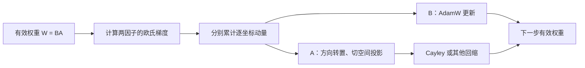
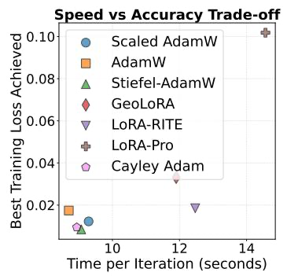
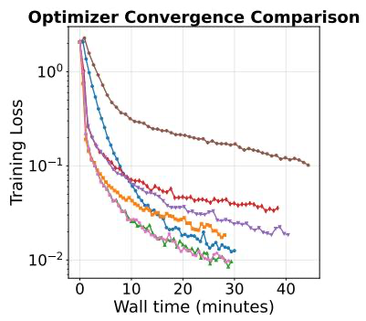
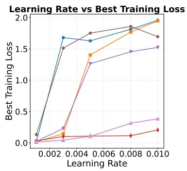
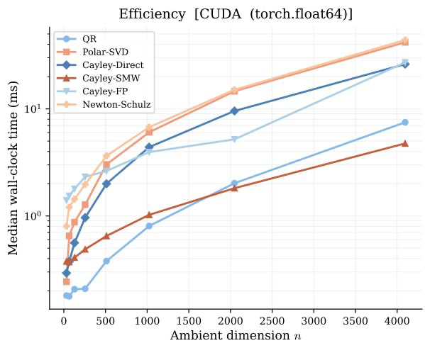
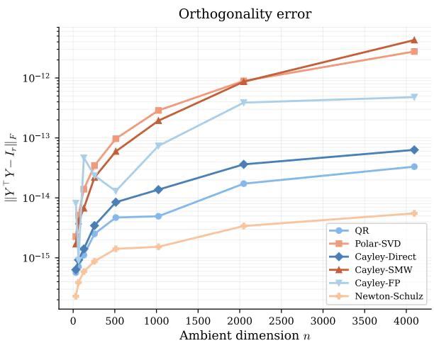

# Stiefel-AdamW：线性分解块的几何感知 AdamW

## 核心信息与阅读结论

- **论文类型**：理论算法与实证方法混合型。
- **发布时间**：2026-09-17，arXiv v1；[原文](https://arxiv.org/abs/2609.21039) · [本地 PDF](../../../01-raw/2026-09/Stiefel_AdamW_Geometry_Aware_AdamW_for_Linear_Factorization_Blocks.pdf) · [解析正文](../../../02-markdown/2026-09/Stiefel_AdamW_Geometry_Aware_AdamW_for_Linear_Factorization_Blocks.md)。
- **最强版本的一句话贡献**：把线性低秩乘积的一侧规范成正交行基，保留另一侧的逐坐标 AdamW，再仅对正交侧施加切空间投影与回缩，以较小的额外操作换取更有界的参数表示。
- **阅读判断**：方法构造有用，ViT 结果值得复核；普遍稳定性、优化器换基不变性和标准收敛保证，现有论证尚不足以直接接受。

## 摘要翻译

### 英文摘要

> A pervasive structural pattern in modern deep learning is the linear factorization block: a submodule of the form $W=BA$ in which two parameter matrices are multiplied directly, with no intervening nonlinearity. Such blocks appear in LoRA adapters, low-rank compressed layers, query-key products of self-attention, and share a common pathology: the factorization is non-unique, which can destabilize training and limit usable learning rates. Despite this, factorization blocks are typically optimized with standard Euclidean methods that ignore the underlying geometry. We introduce Stiefel-AdamW, a near drop-in replacement for AdamW for use wherever such blocks appear. By constraining one factor on the Stiefel manifold while leaving the other Euclidean, Stiefel-AdamW relaxes the full general linear gauge symmetry to a compact orthogonal symmetry, ruling out factor blow-up while retaining the coordinate-wise diagonal preconditioning that gives AdamW its practical strength. Moment estimation is performed in the ambient Euclidean space, with geometry entering only through a tangent-space projection and a manifold retraction. The implementation overhead over AdamW is minimal, and we show that the resulting optimizer inherits both the stability benefits of Riemannian methods and standard convergence guarantees. We validate Stiefel-AdamW on LoRA-style fine-tuning of GPT2, ViT, and Mistral 7B and on full pretraining of GPT2 on OpenWebText, showing consistent improvements over strong baselines at essentially no additional cost over AdamW.

以上按用户提供的本地 PDF 摘要转录；性能与理论措辞属于**作者主张**。

### 中文翻译

现代深度学习中常见线性分解块，即两个矩阵直接相乘、其间没有非线性的子模块。LoRA 适配器、低秩压缩层和自注意力的查询—键乘积都具有这种结构。分解表示不唯一，可能使训练失稳并限制可用学习率，但实际训练通常仍直接使用忽略几何结构的欧氏优化器。作者提出 Stiefel-AdamW：约束其中一个因子位于 Stiefel 流形，另一个仍在欧氏空间更新，从而把一般可逆变换造成的表示冗余限制为紧的正交变换，同时保留 AdamW 的逐坐标对角预条件。动量在环境欧氏空间中累计，仅在更新正交因子时进行切空间投影与回缩。作者声称，这带来很小的额外开销、训练稳定性和常规收敛保证；在 GPT-2、ViT、Mistral 7B 的 LoRA 微调以及 GPT-2 预训练上报告了相对基线的改进。

### 核心要点

1. 目标是缓解 $W=BA$ 的表示冗余所致数值尺度问题，同时保留 AdamW 的对角自适应。
2. 几何约束缩小了**表示纤维**，不等于逐坐标 AdamW 更新对任意正交换基不变。
3. 较强的经验信号集中在 ViT 微调；其他若干差值小且统计与协议说明不足。
4. 理论证明存在需修补的关键等式，不能据此直接推出实际非凸训练的收敛性。

## 研究背景与问题界定

令 $B$ 为 $m$ 行 $r$ 列、 $A$ 为 $r$ 行 $n$ 列，则有效权重为：

$$
W=BA.
$$

对任意可逆的 $r$ 阶矩阵 $M $ ， $BA=(BM)(M^{-1}A) $ 。故相同有效权重可对应尺度极不平衡的因子；一般的逐坐标 AdamW 也依赖所选坐标。本文希望用一个正交因子控制这种冗余，又避免完整商流形优化通常需要的矩阵级预条件和状态传输。论文第 1–3 节把 LoRA、低秩预训练和注意力查询—键乘积放在同一框架下；这不能自动外推到含中间非线性或其他耦合的模块。

当 $r\leq n $ 、乘积确为训练目标中的线性块，并能把初始有效权重重新分解时，约束 $AA^\top=I_r$ 不减少秩不超过 $r$ 的可表达权重集合；但因子坐标、优化轨迹和正则化效果会改变。对标准 LoRA 的零增量初始化，需令 $B=0$ 并选正交的 $A$ 行，不能原样沿用任意随机初始化。

## 方法详解

作者令 $X=A^\top $ ，要求 $X^\top X=I_r $ 。这使固定 $W$ 的可行因子有界：给定 $A $ ， $B=WA^\top $ ，所以 $B$ 的范数由 $W$ 控制。满秩时仍存在正交换基的表示冗余。此结论针对**同一个固定有效矩阵**的纤维；它不保证整个训练过程中 $W$ 或 $B$ 有界。

切空间的欧氏投影可写为：

$$
P_X(Z)=Z-X\frac{X^\top Z+Z^\top X}{2}.
$$

设有效权重上的梯度为 $G=\nabla_W L(W) $ 。链式法则给出：

$$
G_B=GA^\top, G_A=B^\top G.
$$

对两因子分别累计一阶与二阶逐元素动量，形成 AdamW 式预条件方向。 $B$ 直接作欧氏 AdamW 步；对 $A $ ，先把方向转置到 $X$ 的形状，再投影到 $X$ 的切空间，最后用 Cayley、QR 或极分解等回缩映回约束集合。转置是维度必需的；论文算法 1 中 $D_t$ 写成 $A$ 的形状却直接送入 $X$ 的投影，符号不匹配，实施时应依据第 3.2 节的意图与链式法则。

> 图示：依据算法 1 绘制；论文没有单独的总体架构图。

**净创新**：相对直接 AdamW，新增的是一侧正交规范化、切向投影和回缩；相对全固定秩流形方法，牺牲完整换基不变性以保留逐坐标自适应。回缩本身、AdamW 动量、低秩几何均非首创。第 3.3 节给出低秩回缩典型复杂度随 $nr^2+r^3$ 增长；当 $r$ 接近 $n$ 或有大量小块时，额外开销未必可忽略。附录 A 分析了定点 Cayley 的收缩，但有限次迭代的输出一般只**近似正交**，不是严格值域位于 Stiefel 流形的回缩。

## 理论与证明审计

### 定理 4.2 的真实范围

定理报告次线性遗憾界，形式为常数项、 $\sqrt{T} $ 、 $\sqrt{1+\log T}$ 和 $\log T$ 项之和。假设 4.1 包括：可由欧氏严格凸函数延拓的目标、几何衰减的一阶动量系数、有界的 $B$ 与梯度、二阶动量的 AMSGrad 式逐项最大化、以及投影方向朝全局最优解的对齐条件。定理还令学习率随步数衰减且权重衰减为零。这些条件与第 5 节实际非凸网络训练、常见固定动量系数和算法 1 的普通二阶动量更新不同。特别是对齐条件接近把关键优化难点作为前提。因此，“标准收敛保证”只能限缩为**附加假设下的遗憾主张**。

**证明链中的实质缺口**：附录 B 在式 (B.5) 到 (B.6) 之间定义投影与对角预条件的复合算子，随后直接使用其逆作用于已投影方向“等于完整动量”。一般对角预条件不与切空间投影交换，法向动量可经预条件混入切向；即使预条件是标量，反解通常也只恢复切向动量，而非完整动量。下一步据此上界 $\langle G_A,A-A^*\rangle $ ，故需要额外法向项、条件或新证明。**目前不宜把定理 4.2 当作已复核的正确保证。**

附录 B 式 (B.12) 的跨时间梯度混合范数乘 $\sqrt{1+\log T} $ ；仅有逐步梯度有界时，该混合范数可随 $\sqrt{T}$ 增长，末尾把它吸收进与 $T$ 无关常数尚缺明确论证。正文又称每步回缩误差 $\delta$ 只给总遗憾界添加单个常数倍项，未展示跨 $T$ 步如何累积。两处均需作者澄清。

### 命题 4.3 与换基

命题比较固定 $W$ 的无约束分解纤维与正交侧受限纤维上的梯度上确界：前者可因缩放而无界，后者因受限纤维紧而有界（第 4.2 节、附录 C）。这支持“移除**同一 $W$ 下**的因子爆炸路径”，不单独给出 AdamW 全轨迹有界、最大稳定学习率或泛化保证。正文二次损失例子只针对特定梯度下降动力学。

约束后， $BQ$ 与 $Q^\top A$ 对正交 $Q$ 仍给出同一个 $W $ 。但逐元素平方动量与逐元素除法在一般正交旋转下不会按相同方式旋转，所以等价初始分解未必产生相同的下一步有效权重。这与第 6 节承认的残余换基问题一致。适宜说法是**表示纤维变为紧集**，而非算法已实现完整正交等变。

## 实验结果与成本

| 场景及原文位置 | AdamW | Stiefel-AdamW | 可支持的判断 |
|---|---:|---:|---|
| GPT-2／E2E，LoRA 秩 4；表 1 | BLEU 68.41 ± 0.495 | 69.20 ± 0.964 | 均值增加 0.79，波动范围重叠；相对 Scaled AdamW 的 69.17 几乎持平 |
| ViT-Base／CIFAR-10，秩 32；表 1 | 95.60 ± 0.20 | 95.91 ± 0.19 | 增加 0.31 个百分点 |
| ViT-Base／CIFAR-10，秩 64；表 1 | 95.55 ± 0.15 | 96.04 ± 0.15 | 增加 0.49 个百分点，值得复核 |
| ViT-Base／CIFAR-10，秩 128；表 1 | 95.82 ± 0.29 | 96.41 ± 0.10 | 增加 0.59 个百分点 |
| Mistral 7B／GLUE 九任务平均；表 2 | 89.00 | 89.57 | 增加 0.57 个百分点；各任务指标混合平均，未报方差 |
| GPT-2／OpenWebText 预训练；表 3 | 测试损失 3.260 ± 0.05 | 3.236 ± 0.07 | 差值 0.024，小于报告的波动量；两者峰值显存均 13.8 GB |
| Qwen2 约 100M／WikiText-103；表 4 | 损失 2.66 ± 0.05 | 2.59 ± 0.004 | 五种子均值较好；需澄清“LoRA 预训练”的设置与预算 |

表中“±”沿用论文报告；表 1 明确 ViT 为五次随机初始化，表 4 明确 Qwen2 为五个种子；其他场景的独立重复次数与波动量生成方式未完整交代。波动量重叠不能直接替代显著性检验，小差值亦不能写成稳定优势。

> 图1a：图 1 左面板。Stiefel-AdamW 在该 ViT 设置中取得较低训练损失和较短单步时间；这不是所有模型的端到端成本结论。

> 图1b：图 1 中面板。单条轨迹未展示随机种子不确定性。

> 图1c：图 1 右面板。所试较大学习率下几何方法损失较低，但图中画的是训练期间最好损失。

> 图2a：附录图 2 左面板。各回缩成本随维度变化，不能视为等价。

> 图2b：附录图 2 右面板。定点 Cayley 的误差一般非零，实际训练应监测漂移。

### 消融、公平性与复现信息

- **回缩消融**：表 3 右半对比六种回缩；秩 128 时 QR 为 93.71%，Cayley direct 和 Polar 为 96.61%，故“回缩选择影响很小”不适用于这一列。未报告该消融的多种子误差。
- **关键缺口**：没有充分隔离“正交初始化”“每步回缩”“切向投影”“逐坐标自适应”“动量参数”各自的净效应，也缺同预算的周期性 QR 基线。
- **基线超参**：附录表 5 的 E2E 实验中，Stiefel-AdamW 与 AdamW 的权重衰减分别为 $10^{-4}$ 与 $10^{-2} $ ，动量亦不同；表 1 差异不能全归因于几何更新。Mistral 的部分基线数值来自旧工作，本文方法另设动量值；未给统一调参搜索预算。
- **协议矛盾**：第 5.2 节称 GPT-2 预训练 7000 次迭代，表 3 标题称 6000 次，应先确定评测检查点。
- **成本证据**：ViT 图 1 有单步时间，GPT-2 预训练仅报峰值显存，缺端到端墙钟、吞吐和 GPU 小时。论文称大多数实验用一张 A100 80 GB，GPT-2 预训练用两张 H100 80 GB（第 5.1 节）。
- **代码与参数**：正文给出算法框架、硬件和部分超参，但本版本未提供可核实的专属代码仓库、全部种子及完整训练记录。第 5.2 节脚注引用 [nanoGPT](https://github.com/karpathy/nanoGPT)，并非本文优化器的实现仓库。

## 主张—证据—限制矩阵

| 作者主张 | 正文证据 | 替代解释或边界 | 判断与置信度 |
|---|---|---|---|
| 正交侧消除同一有效权重下的因子爆炸 | 第 3.1 节；命题 4.3、附录 C | 只针对固定 $W$ 的纤维；近似回缩有漂移 | 几何命题基本成立，高 |
| 保留 AdamW 的逐坐标自适应 | 算法 1、第 3.2 节 | 成立于所选环境坐标；不具一般正交换基不变性 | 成立但须限缩，高 |
| 获得常规收敛保证 | 定理 4.2、附录 B | 假设不匹配实际训练；关键投影逆等式待修补 | 证据不足，中高 |
| 大学习率更稳定 | 命题 4.3、图 1 右面板 | 命题不直接推及 AdamW；有限网格、只报最好训练损失 | 局部经验支持，中 |
| 性能普遍优于强基线 | 表 1–4 | E2E 与预训练差值小；混合指标平均；超参和统计缺口 | 仅部分任务支持，中 |
| 基本没有额外成本 | 图 1、表 3、附录图 2 | 缺端到端 GPU 小时；回缩代价依维度和实现而变 | 证据不足，中 |

## 最强近邻与净增量

以下比较依据各论文原文或正式论文页；处理目标并不完全相同，横向成绩不能直接当统一基准。

| 工作 | 共同问题与做法 | 相对本文的差异及比较边界 |
|---|---|---|
| [Riemannian Preconditioned LoRA](https://arxiv.org/abs/2402.02347)（Zhang、Pilanci，2024） | LoRA 失衡；低秩侧小型矩阵预条件可结合 AdamW | 本文改参数化并加回缩；原方法不强制一侧正交。本文引用其 E2E／GLUE 结果，超参未完全统一 |
| [GeoLoRA](https://arxiv.org/abs/2410.18720)（Schotthöfer 等，2025） | 低秩适配的几何结构；动态低秩积分与秩自适应 | 本文强调固定秩、逐坐标 AdamW 与较简单更新；GeoLoRA 的秩分配能力不在本文目标内 |
| [LoRA Done RITE](https://arxiv.org/abs/2410.20625)（Yen 等，2025） | 换基导致轨迹变化；低秩侧矩阵预条件 | 本文缩小表示纤维并保留对角自适应，未获得同等级别的变换不变性 |
| [Riemannian Adaptive Optimization Methods](https://openreview.net/pdf?id=r1eiqi09K7)（Bécigneul、Ganea，2019） | 流形上的自适应；乘积流形各因子间自适应及遗憾分析 | 本文在环境坐标逐元素预条件，更新前投影；自适应粒度与几何一致性取舍不同 |
| [RAdaGrad and RAdamW](https://papers.neurips.cc/paper_files/paper/2025/hash/5679173c400b332796426e443ab5ea0d-Abstract-Conference.html)（Bian 等，2025） | 低秩矩阵权重的几何优化；直接在固定秩权重流形更新 | 本文保留两因子实现与 AdamW 状态；原方法避免分解冗余。未见同预算直接实验 |

较可信的净增量是简洁的一侧正交化构造，以及对 LoRA/注意力块的统一调用方式。完整变换不变性、超越所有几何低秩方法的性能和一般非凸理论，均不是已证实的净增量。

## 技术路线、局限与复现决策

技术脉络是“欧氏 AdamW 更新因子 → 缩放／矩阵预条件修正 → 固定秩商流形或动态低秩方法 → 本文的一侧正交化折中”。它处理了**表示尺度任意漂移**这一瓶颈，留下逐坐标更新对正交换基敏感、近似回缩约束漂移、预条件与投影不交换等问题。对全参数训练的注意力查询—键块，还须检验缩放、位置编码、权重衰减及其他参数的耦合；一个 GPT-2 预训练实例不足以覆盖“任意线性分解块”。

**致命问题（针对理论主张）**：附录 B 的投影逆等式不能一般成立，因此定理 4.2 现有证明不足以支持所声称的遗憾界；作者若给出新证明或额外可核验条件，判断可改变。**非致命局限**：表 5 超参不齐、成本核算不全、表 3 步数矛盾、组件消融不足。这些限制经验结论的强度，不否定算法可以运行。

## 可证伪的后续研究机会

| 假设 | 最小验证 | 指标与资源 | 停止条件 |
|---|---|---|---|
| 几何约束而非超参差异产生 ViT 增益 | CIFAR-10 ViT 秩 32、64、128 统一学习率、衰减、动量搜索及种子；加仅正交初始化与周期性 QR 基线 | 五至十种子准确率、GPU 小时；单卡 | 同预算提升的置信区间覆盖零且额外耗时明显时暂停扩大任务 |
| 对角预条件造成等价换基的轨迹分叉 | 同一 $W$ 的两种正交分解做一步和多步更新 | 相对 $W$ 差异、梯度范数；小型合成矩阵 | 轨迹在数值精度内相同则检查实现并终止机制解释 |
| 有限次 Cayley 逼近能长期维持约束 | 比较 1、2、4 次定点迭代与精确 QR | $\Vert X^\top X-I_r\Vert $ 、验证损失、耗时；ViT 子任务 | 误差系统累积到影响性能时改周期性精确正交化 |
| 遗憾界能容纳真正的对角预条件 | 写出投影与预条件交换子或法向项，构造二维反例/新上界 | 次线性界是否成立；纸笔与数值 | 若有满足假设却线性遗憾的反例，放弃原定理形式 |

**最小复现顺序**：先做合成矩阵的算法维度、正交性与换基测试，再复现 ViT 秩 64 的同预算五种子结果，最后考虑预训练。保存每步墙钟、峰值显存、训练/验证损失、正交误差和完整超参；向作者核实 GPT-2 的 6000/7000 步差异和附录 B 的关键等式。

## 综合评价与阅读决策

| 维度 | 分数 | 证据位置与理由 | 置信度 |
|---|---:|---|---|
| 问题重要性与界定 | 4.0/5 | 第 1、3 节；LoRA 与注意力有直接相乘块，适用边界仍需收紧 | 高 |
| 原创性与净增量 | 3.0/5 | 第 2、3 节及近邻对照；一侧正交化是清晰折中，组件已有先例 | 中 |
| 技术正确性与严谨性 | 2.0/5 | 定理 4.2、附录 B；投影逆等式需修补，算法 1 有维度记号问题 | 中高 |
| 证据强度与替代解释 | 2.5/5 | 表 1–5、图 1；ViT 有信号，预训练差值、统计与超参归因不足 | 中 |
| 可复现性与透明度 | 2.0/5 | 第 5 节、附录 D；部分设置可得，代码、种子、统一搜索预算缺失且步数矛盾 | 中 |
| 外推边界与稳健性 | 2.5/5 | 命题 4.3、图 1、表 3–4；局部稳定性无法覆盖全部分解块 | 中 |
| 研究生成力 | 3.5/5 | 第 3、6 节；投影与对角自适应的张力有后续研究价值 | 中 |
| 当前课题契合度 | 4.5/5 | 工作区关注大模型优化器、自适应更新和收敛理论；直接命中 | 中高 |

**学术价值分：4.5/10**。按共享准则前七项默认权重 15%、20%、20%、20%、10%、5%、10%，加权均值 2.775/5；经 $2.5\left(2.775-1\right)$ 映射并四舍五入到 0.5 分得 4.5/10。此分数评价当前版本的**论证与证据**。写作可读性尚可，但交叉引用、步数及算法符号有编辑问题；写作未单独纳入学术分。

**当前课题优先级：精读**。重点读第 3 节、定理 4.2 与附录 B、表 1/3/5；把“对角自适应与流形投影是否兼容”作为可验证切口。**评价置信度：中**；作者修补证明、公开实现与统一预算多种子实验最可能改变评分。

> **关键启示：** 一侧正交基约束表示尺度可成为实用设计，但“表示几何有界”“更新等变”“训练稳定”和“遗憾收敛”必须分别验证。

## 我的笔记

（留给后续复现或作者回应。）

## 外部资源

- [本文 arXiv 页面](https://arxiv.org/abs/2609.21039)
- [本文原始 PDF](https://arxiv.org/pdf/2609.21039)
- [nanoGPT 基础训练仓库](https://github.com/karpathy/nanoGPT)（论文脚注所引复现框架）
