# SubZero+: Efficient Zeroth-Order LLM Fine-Tuning via Large Learning Rates

## 核心信息

- **中文题目**：SubZero+：通过大学习率实现高效的零阶大语言模型微调
- **论文类型**：实证方法 + 实现工程（混合型，偏实证）。全文**没有任何定理、引理或收敛性分析**，只引用 SubZero 的 Lemma 1 做方差维度论证
- **论文 ID**：arXiv:2608.15665v1 [cs.LG]
- **作者**：Ziming Yu、Shuyao Xiao、Xingyu Zhao、Sike Wang、Pan Zhou、Peiyu Zang、Xiangda Yan、Yongjie Yang、Jia Li（通讯）
- **机构**：北京师范大学、新加坡管理大学、小米；含北京市人工智能重点实验室与教育部智能技术与教育应用工程中心
- **发布时间**：2026-08-16（取自 PDF 首页 arXiv 水印。本次会话中 arXiv API 未返回数据，元数据以本地 PDF 为准）
- **本地材料**：[原始 PDF](../../../01-raw/2026-09/SubZero+_Efficient_Zeroth_Order_LLM_Fine_Tuning_via_Large_Learning_Rates.pdf) | [解析 Markdown](../../../02-markdown/2026-09/SubZero+_Efficient_Zeroth_Order_LLM_Fine_Tuning_via_Large_Learning_Rates.md)
- **在线版本**：[arXiv abs/2608.15665](https://arxiv.org/abs/2608.15665)
- **前作代码**：[zimingyy/SubZero](https://github.com/zimingyy/SubZero)（ICCV 2025 版本，最后一次推送 2024-11-22，**不含 SubZero+**）

> **最强版本的一句话贡献：** 在 SubZero 的逐层低秩子空间里，把单查询换成共享同一子空间的 $K=99$ 查询聚合，并把优化器从子空间 SGD 换成子空间 Adam，同时把 QR 分解的列符号规范到 $R$ 的对角元为正；在匹配 40K 次前向预算的前提下，用 400 步达到优于 MeZO 与 SubZero 的 SuperGLUE 平均准确率，并把可用学习率区间从约 2 倍放宽到约 3 倍。

> **一句话审计结论：** 结果表覆盖 1.3B 到 32B、FT 与 LoRA，工程口径（内存、前向预算）交代得比多数同类论文清楚；但三项"贡献"里有两项的因果解释站不住——第三项（Haar 符号校正）在该算法的扰动分布上可证明为恒等操作，第二项（Adam 的"曲率感知步长"）与 Adam 自身的尺度不变性矛盾；而第一项的收益被一个论文未讨论的实现选择污染：SubZero+ 把 SubZero 的两点差分换成了共享基线的一点差分，引入了被 $1/\varepsilon$ 放大的基线泄漏项，这足以解释其表 5 中 $K\le 10$ 全部接近随机猜测的反常结果。

## 摘要翻译

### 英文摘要

Zeroth-order (ZO) optimization enables backpropagation-free fine-tuning of large language models, but existing ZO methods suffer from high-variance gradient estimators, making convergence unstable and highly sensitive to learning rates. We propose SubZero+, an improved SubZero framework that improves stability in three complementary ways: (i) multi-query gradient estimation within layer specific low-rank subspaces to reduce variance without exhibiting the multi-query paradox; (ii) a subspace Adam optimizer that performs adaptive updates using in-subspace multi-query gradient statistics; and (iii) a sign correction for QR-based subspace construction to ensure Haar-distributed projection matrices, eliminating implementation-dependent orientation ambiguity. Experiments on models from 1.3B to 32B across SuperGLUE, under both full-parameter tuning and LoRA, show that SubZero+ consistently outperforms prior ZO baselines, enlarges the stable learning-rate range, and narrows the gap to first-order methods with minimal extra memory overhead.

### 中文翻译

零阶优化可以在不做反向传播的前提下微调大语言模型，但现有零阶方法的梯度估计方差很高，导致训练不稳定且对学习率极度敏感。本文提出 SubZero+，在三个互补方面改进 SubZero 的稳定性：(i) 在逐层低秩子空间内做多查询梯度估计，在不触发"多查询悖论"的前提下降低方差；(ii) 子空间 Adam 优化器，利用子空间内的多查询梯度统计量做自适应更新；(iii) 对基于 QR 分解构造子空间做符号校正，使投影矩阵服从 Haar 分布，从而消除由实现细节引入的方向歧义。在 1.3B 到 32B 的模型上、SuperGLUE 任务集、全参数微调与 LoRA 两种方案下的实验表明，SubZero+ 一致优于已有零阶基线，扩大了稳定学习率区间，收窄了与一阶方法的差距，且额外内存开销很小。

### 核心要点提炼

1. **问题**：零阶微调的估计方差随参数维度增长，学习率窗口极窄（论文用 MeZO 在 OPT-1.3B/SST-2 上 $10^{-6}$ 就停在 63.4% 作为引子）。
2. **手段一（多查询）**：在同一组固定的 $U_i,V_i$ 下采 $K$ 个 $r\times r$ 高斯扰动，把 $K$ 个标量差分在子空间坐标里平均，声称把方差降 $1/K$ 且规避多查询悖论。
3. **手段二（子空间 Adam）**：一阶、二阶矩都存成 $r\times r$，更新写成 $U_i(\hat M_i/(\sqrt{\hat V_i}+\epsilon))V_i^\top$，声称用多查询梯度范数实现逐层自适应步长。
4. **手段三（Haar 校正）**：把 QR 的 $Q$ 列按 $R$ 对角元符号翻转，声称消除实现相关的方向偏差。
5. **预算口径**：每步 $K+1$ 次前向， $K=99$ 时只跑 400 步，与 MeZO/SubZero 的 $2\times 20\mathrm{K}=40\mathrm{K}$ 前向对齐。
6. **主要结果**：OPT-1.3B 平均 66.3（SubZero 65.5）、OPT-13B 73.0（SubZero 70.3）、Qwen2.5-32B 87.4（SubZero 85.1，且明确写"oracle best"）；内存相对 MeZO 增加约 0.6 GB（1.3B）到约 1%（13B）。
7. **未做的事**：没有收敛性定理；没有多随机种子与方差；没有"两点单查询 + 子空间 Adam"这一关键对照；没有 prefix/prompt tuning 实验（虽声称继承兼容性）。

## 研究背景与动机

### 零阶微调的方差—学习率链条

MeZO 用 SPSA 中央差分（论文式 (1)）：

$$
\widehat{\nabla}_{\boldsymbol{w}}\mathcal{L}(\boldsymbol{w};\mathcal{B})=\frac{\mathcal{L}(\boldsymbol{w}+\varepsilon\boldsymbol{z};\mathcal{B})-\mathcal{L}(\boldsymbol{w}-\varepsilon\boldsymbol{z};\mathcal{B})}{2\varepsilon}\boldsymbol{z}
$$

方差随环境维度 $d$ 线性增长，因此需要很小的 $\eta$ 才能不发散；而 $\eta$ 一小，收敛就慢。论文用图 1(a) 展示这一点。

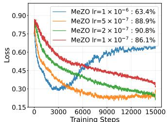

> 图1(a)：MeZO 训练损失对 $\mathrm{lr}\in\{10^{-7},2\times10^{-7},5\times10^{-7},10^{-6}\}$ 的响应，最终准确率分别为 86.1%、90.8%、88.9%、63.4%。注意纵轴是**前向损失**、横轴是**训练步数**： $\eta=10^{-6}$ 并未发散，而是停在 0.6 左右的平台。也就是说，这里的"敏感"主要表现为**有效区间窄、偏离即掉点**，而不是字面意义的震荡发散；论文正文用 "oscillations or divergence" 描述，与该图的实际形态略有出入。

SubZero 把扰动限制在逐层 $r\times r$ 子空间： $\tilde{\boldsymbol{Z}}_i=U_iZ_iV_i^\top$，其中 $U_i\in\mathbb{R}^{m_i\times r}$、 $V_i\in\mathbb{R}^{n_i\times r}$ 列正交， $Z_i$ 为 i.i.d. $\mathcal{N}(0,1)$。由 $\mathrm{vec}(\tilde{\boldsymbol{Z}}_i)=(V_i\otimes U_i)\mathrm{vec}(Z_i)$ 且 $V_i\otimes U_i$ 列正交，等效估计维度从 $m_in_i$ 降到 $r^2$，总有效维度 $q=lr^2\ll d$。

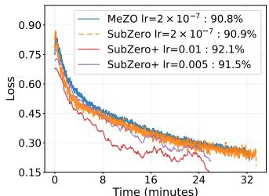

> 图1(b)：OPT-1.3B / SST-2 上 MeZO、SubZero、SubZero+（学习率 $\eta=0.01$ 与 $0.005$）的损失—**分钟**曲线，最终准确率 90.8%、90.9%、92.1%、91.5%。SubZero+ 用 400 步在约 20 分钟内到达基线 32 分钟处的损失水平。横轴是墙钟时间而非前向次数，这一点在后面"收敛速度"主张的审计中很关键。

> 图1(c)：MeZO 3.40 GB、SubZero 3.45 GB、SubZero+ 4.04 GB，正文所述"约 0.6 GB 额外开销"与此一致。

### 论文自陈的 SubZero 三点局限

单查询 $K=1$ 留下了方差下降空间；子空间内用 vanilla SGD 放弃了逐层自适应；QR 构造依赖实现。这三点即后文三项贡献的动机。

## 方法概述

### 核心思想

先降维（继承 SubZero 的逐层低秩子空间），再在**同一个低维坐标帧内**把"多探测一次"的收益榨干： $K$ 次前向共享同一批数据、同一基线损失、同一组基，因此 $K$ 个估计天然对齐，可以在 $r\times r$ 坐标里直接平均；平均后的坐标更可信，于是把 Adam 也搬进这 $r\times r$ 坐标里跑，矩缓冲只占 $2r^2$ 个数。

### 方法框架

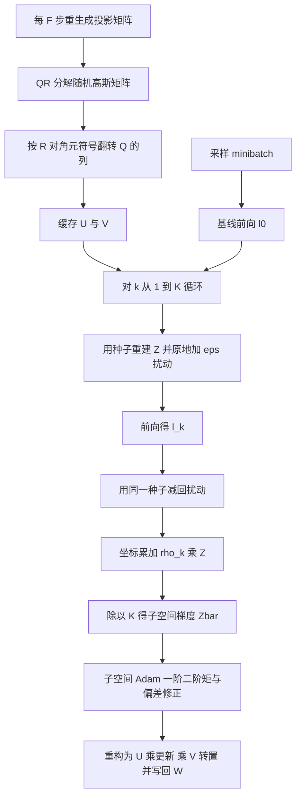

### 1. 多查询子空间梯度估计（§4.1）

第 $k$ 个查询的扰动为 $\tilde{\mathbf{Z}}_i^{(k)}=U_iZ_i^{(k)}V_i^\top$，基线损失 $\ell_0=\mathcal{L}(\mathcal{W};B)$，扰动损失 $\ell_k=\mathcal{L}(\mathcal{W}+\varepsilon\tilde{\mathcal{Z}}^{(k)};B)$，估计器（论文式 (6)）：

$$
\widehat{\nabla}_{W_i}\mathcal{L}(\mathcal{W};\mathcal{B})=\frac{1}{K}\sum_{k=1}^{K}\frac{\ell_k-\ell_0}{\varepsilon}\tilde{\mathbf{Z}}_i^{(k)}=\frac{1}{K\varepsilon}U_i\left(\sum_{k=1}^{K}(\ell_k-\ell_0)Z_i^{(k)}\right)V_i^\top
$$

聚合后的低秩坐标梯度记为 $\overline{\boldsymbol{Z}}_i^t=\frac{1}{K}\sum_{k=1}^{K}\rho_k^t\boldsymbol{Z}_i^{(k)}$，其范数 $\gamma_i^t=\Vert\overline{\boldsymbol{Z}}_i^t\Vert_F$ 被论文当作"局部曲率代理"。**注意两点**：(a) 这是**一点前向差分**，不是 SubZero 的两点中央差分；(b) $K$ 个查询共用同一个 $\ell_0$。这两点是后文审计 A1 的对象。

论文的解释机制是"平均强化了子空间内的信号分量、抵消了正交噪声分量"。严格说，每个 $\tilde{\mathbf{Z}}_i^{(k)}$ 由构造就落在同一子空间内，**不存在正交噪声可抵消**；真正的机制只是"同一坐标帧内 $K$ 次独立探测取平均，方差降 $1/K$"。

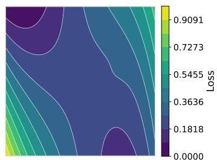

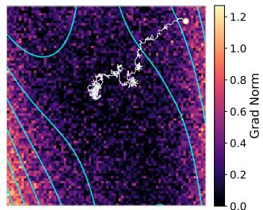

> 图3：作者在人造二维损失面上演示"查询数越多，梯度范数字段越能反映真实曲率"。这是一个示意实验，即取 $K=100$ 的暴力平均，不是 LLM 上的证据；它说明的是"估计越准"，但没有说明"在固定前向预算下更准是否换来更好的最终结果"——而那正是多查询论的问题所在。

### 2. 低秩子空间 Adam（§4.2）

$$
\boldsymbol{M}_i^t=\beta_1\boldsymbol{M}_i^{t-1}+(1-\beta_1)\overline{\boldsymbol{Z}}_i^t
$$

$$
\boldsymbol{V}_i^t=\beta_2\boldsymbol{V}_i^{t-1}+(1-\beta_2)(\overline{\boldsymbol{Z}}_i^t\odot\overline{\boldsymbol{Z}}_i^t)
$$

偏差修正后（论文式 (10)）：

$$
\boldsymbol{W}_i^{t+1}=\boldsymbol{W}_i^t-\eta\boldsymbol{U}_i^t\left(\frac{\hat{\boldsymbol{M}}_i^t}{\sqrt{\hat{\boldsymbol{V}}_i^t}+\epsilon_{\mathrm{adam}}}\right)(\boldsymbol{V}_i^t)^{\top}
$$

其中 $\odot$ 为逐元素乘，除法与开方逐元素进行，矩缓冲每层 $2r^2$ 个浮点数。**这里有一个真实的符号冲突**： $\boldsymbol{V}_i^t$ 在同一式子里既表示右投影矩阵 $(\boldsymbol{V}_i^t)^\top$，又表示二阶矩 $\hat{\boldsymbol{V}}_i^t$；算法 3 第 1 行用 $V_i^0\leftarrow 0$ 初始化矩缓冲，第 6 至 8 行又用 $V_i^t$ 表示投影矩阵。见审计 A5。

### 3. QR 子空间的 Haar 符号校正（§4.3）

设未校正的薄 QR 给出 $\tilde{U}_i$ 与 $\tilde{R}_{U,i}$，校正为（论文式 (11)）：

$$
\boldsymbol{U}_i=\tilde{\boldsymbol{U}}_iS_U, \boldsymbol{V}_i=\tilde{\boldsymbol{V}}_iS_V
$$

其中 $S_U$、 $S_V$ 是对角元素为 $\pm1$ 的对角符号矩阵，取值来自 $\tilde R$ 对角元的符号。目的是让 $Q$ 成为 Haar 分布（Mezzadri, 2007）。成本每层 $O(r)$ 次列翻转。见审计 A2——这一步在**本算法实际使用的对象**（扰动 $\tilde{\mathbf{Z}}$ 与坐标梯度 $\overline{\boldsymbol{Z}}$）上是分布恒等的。

### 4. 完整算法与预算

每步 $K+1$ 次前向（1 次基线 + $K$ 次扰动），全程无反向。默认 $K=99$、 $\beta_1=0.9$、 $\beta_2=0.95$、 $\epsilon_{\mathrm{adam}}=10^{-8}$；FT 时 $r=16$（OPT-1.3B）或 $r=128$（其余），LoRA 时 $r\in\{4,8,16\}$； $F\in\{50,100\}$； $\eta\in\{10^{-3},5\times10^{-3},10^{-2}\}$（FT）。400 步乘 100 前向等于 40K，与基线 $20\mathrm{K}\times2=40\mathrm{K}$ 对齐。

## 实验结果

### 实验设置

| 项目 | 设置 |
|---|---|
| 任务 | SuperGLUE 9 任务（SST-2、RTE、BoolQ、WIC、MultiRC、COPA、ReCoRD、SQuAD、DROP） |
| 模型 | OPT-1.3B、OPT-13B、OPT-30B、LLaMA3.1-8B、Qwen2.5-32B；学习率鲁棒性另用 Qwen3-0.6B |
| 微调方案 | 全参数微调 FT；LoRA（秩 $r_{\mathrm{LoRA}}=8$、 $\alpha=16$） |
| 基线 | MeZO、SubZero；一阶参考 Adam(FT)；Zero-shot 作为下界 |
| 预算 | 统一 40K 次前向（Haar 与 $K$ 消融为 30K） |
| 批大小 | 16，常数学习率，按验证损失选最优 checkpoint |
| 硬件 | 单张 H200 141GB；OPT-1.3B 用单张 RTX 4090 24GB；PyTorch 2.1.0 加 CUDA 12.1 |
| 随机种子 | 扰动重放用种子重建（继承 SubZero）；**未报告实验重复次数** |

### 主结果：FT 方案（表 1）

| 模型 | 方法 | SST-2 | RTE | BoolQ | WIC | MultiRC | COPA | ReCoRD | SQuAD | DROP | Avg. |
|---|---|---:|---:|---:|---:|---:|---:|---:|---:|---:|---:|
| OPT-1.3B | MeZO | 90.2 | 64.3 | 65.0 | 58.3 | 59.7 | 74.0 | 71.0 | 76.4 | 22.5 | 64.6 |
| OPT-1.3B | SubZero | 90.9 | 67.5 | 65.4 | 58.1 | 59.5 | 75.0 | 70.9 | 76.4 | 25.4 | **65.5** |
| OPT-1.3B | SubZero+/SGD | 90.0 | 60.3 | 66.4 | 59.4 | 61.7 | 75.0 | 71.9 | 77.2 | 25.4 | 65.3 |
| OPT-1.3B | **SubZero+/Adam** | 92.1 | 65.7 | 66.9 | 59.4 | 61.4 | 76.0 | 72.3 | 77.2 | 25.4 | **66.3** |
| LLaMA3.1-8B | MeZO | 91.6 | 85.9 | 83.3 | 66.3 | 86.7 | 89.0 | 82.6 | 90.3 | 65.1 | 82.3 |
| LLaMA3.1-8B | SubZero | 91.2 | 83.8 | 83.3 | 65.5 | 87.2 | 90.0 | 82.6 | 90.9 | 67.8 | 82.5 |
| LLaMA3.1-8B | SubZero+/SGD | 95.4 | 84.8 | 84.2 | 69.6 | 87.2 | 92.0 | 82.0 | 90.7 | 67.5 | **83.7** |
| LLaMA3.1-8B | **SubZero+/Adam** | 93.3 | 84.1 | 85.0 | 69.4 | 87.6 | 91.0 | 82.2 | 90.8 | 66.6 | 83.3 |
| OPT-13B | MeZO | 91.3 | 67.5 | 67.1 | 59.1 | 61.5 | 87.0 | 81.4 | 83.6 | 30.6 | 69.9 |
| OPT-13B | SubZero | 90.8 | 66.4 | 68.3 | 58.3 | 66.8 | 88.0 | 81.2 | 83.6 | 29.2 | 70.3 |
| OPT-13B | SubZero+/SGD | 92.8 | 70.8 | 74.4 | 60.7 | 69.5 | 88.0 | 81.2 | 85.3 | 30.6 | 72.5 |
| OPT-13B | **SubZero+/Adam** | 93.5 | 74.0 | 75.2 | 63.2 | 64.7 | 89.0 | 81.7 | 85.2 | 30.6 | **73.0** |

> **表格列序说明：** 解析出的表头把 BoolQ 的列标签吞掉了、任务类型标签跨列错位。我按"9 个数值加 1 个平均"重排，并逐行校验平均值：上表以及下面表 2、表 3、表 4 共 34 行的算术平均都与论文报告的 Avg. 吻合（最大偏差 0.09，属四舍五入）。这既确认了列序推断（SST-2、RTE、BoolQ、WIC、MultiRC、COPA、ReCoRD、SQuAD、DROP）可靠，也说明表格数值本身没有算错。

**读表要点：**

- 提升集中在 **OPT-13B**（70.3 → 73.0，+2.7）与 **LLaMA3.1-8B**（82.5 → 83.7，SGD 版本）。
- 在 **OPT-1.3B 上，多查询加子空间 SGD（65.3）没有超过单查询两点的 SubZero（65.5）**；且 SubZero+/SGD 的 RTE 只有 60.3，比 SubZero 的 67.5 低 7.2 点。
- LLaMA3.1-8B 上 SGD（83.7）优于 Adam（83.3），论文归因于"不同的学习率搜索空间"——这是一个未被排除的混杂，而非已验证的解释。
- 单任务波动幅度（可达 7 点）远大于平均提升幅度（+0.8 到 +2.7 点），而全文没有报告任何 seed 数或方差。

### 主结果：LoRA 方案（表 2）

| 模型 | 方法 | SST-2 | RTE | BoolQ | WIC | MultiRC | COPA | ReCoRD | SQuAD | DROP | Avg. |
|---|---|---:|---:|---:|---:|---:|---:|---:|---:|---:|---:|
| OPT-13B | MeZO | 93.6 | 62.1 | 69.1 | 56.9 | 57.8 | 86.0 | 81.4 | 83.0 | 28.7 | 68.7 |
| OPT-13B | SubZero | 92.2 | 62.5 | 66.7 | 56.7 | 58.3 | 87.0 | 81.8 | 83.7 | 28.3 | 68.6 |
| OPT-13B | **SubZero+** | 93.0 | 71.5 | 73.9 | 60.2 | 60.5 | 86.0 | 80.4 | 82.5 | 28.6 | **70.7** |
| LLaMA3.1-8B | MeZO | 91.3 | 78.0 | 83.6 | 61.0 | 85.8 | 92.0 | 83.8 | 90.4 | 65.4 | 81.2 |
| LLaMA3.1-8B | SubZero | 90.6 | 83.8 | 83.5 | 61.1 | 87.3 | 88.0 | 83.5 | 90.4 | 65.3 | 81.5 |
| LLaMA3.1-8B | **SubZero+** | 93.3 | 84.8 | 84.1 | 69.0 | 87.6 | 89.0 | 84.3 | 91.1 | 66.9 | **83.4** |
| OPT-30B | MeZO | 92.6 | 68.2 | 63.6 | 60.0 | 65.4 | 86.0 | 80.5 | 83.6 | 30.6 | 70.1 |
| OPT-30B | SubZero | 93.0 | 65.3 | 61.4 | 58.2 | 64.0 | 85.0 | 81.7 | 83.2 | 32.5 | 69.4 |
| OPT-30B | **SubZero+** | 94.2 | 72.6 | 71.5 | 60.3 | 67.0 | 86.0 | 80.9 | 84.7 | 33.0 | **72.2** |

LoRA 下增益（+2.0、+1.9、+2.1、+2.8）大于 FT 下增益，且主要来自 RTE 与 BoolQ 两个小测试集任务（OPT-13B RTE 62.5 → 71.5，+9 点）。§5.2.2 明确写"比较各方法在超参搜索中的最好结果"，即三方都是 best-of-grid，这一口径是公平的。

### Qwen2.5-32B（表 3）

| 方法 | SST-2 | RTE | BoolQ | WIC | SQuAD | Avg. |
|---|---:|---:|---:|---:|---:|---:|
| Zero-shot | 61.5 | 87.0 | 84.3 | 61.8 | 85.5 | 76.0 |
| MeZO | 87.5 | 90.3 | 86.7 | 65.7 | 87.9 | 83.6 |
| MeZO-LoRA | 62.0 | 87.4 | 84.8 | 64.7 | 84.7 | 76.7 |
| SubZero | 89.1 | 90.3 | 87.7 | 68.8 | 89.6 | 85.1 |
| **SubZero+** | 93.4 | 91.3 | 88.5 | 73.5 | 90.3 | **87.4** |

> **注意事项：** 表 3 标题自己写明 SubZero+ 的分数是 "oracle best values from task-specific optimal hyperparameter configurations"，即**逐任务挑最优配置**，而基线不是。这是全文最大的一次选择性比较，+2.3 的领先不能按公平对照读。

### 学习率鲁棒性（§5.2.4，图 5）

> 图5(a)：横轴学习率跨四个数量级，纵轴为**训练准确率**。MeZO 峰值约 81.5%，出现在 $10^{-4}$ 附近，超过 $2\times10^{-4}$ 后塌到 51%；SubZero+ 在 $2\times10^{-2}$ 与 $3\times10^{-2}$ 达 86.6%、86.0%， $[10^{-2},3\times10^{-2}]$ 内保持 79% 以上，但到 $5\times10^{-2}$、 $10^{-1}$ 也分别掉到 68.0%、49.9%。

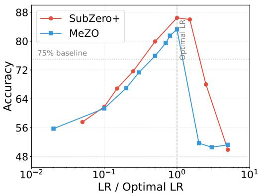

> 图5(b)：归一化视图。作者据此说明 SubZero+ 呈"对称平台"，MeZO 呈"低于最优缓慢退化、高于最优突然崩溃"。

**四点必须记录的限定：**

1. 纵轴是**训练准确率**，不是测试准确率；用来支撑"实用中不必调学习率"的主证据不是最终评价指标。
2. 模型是 **Qwen3-0.6B**，既不在 §5.1 的模型清单里，也不在标题宣称的"1.3B 到 32B"范围内。
3. 正文与图不一致：正文称 MeZO 最优 83.3%、SubZero+ 最优 86.5%，图中标注为 81.5% 与 86.6%。差异不大但说明二者来自不同运行，需作者核对。
4. "放宽稳定区间"实际是**约 3 倍对约 2 倍**（SubZero+ 的 79% 以上区间是 $10^{-2}$ 到 $3\times10^{-2}$），量级上确实更宽，但不是正文语气给人的"数量级"印象。

### 收敛速度证据（图 4）

> 图4(a)：OPT-13B / COPA。MeZO 与 SubZero 跑到约 7000 秒，SubZero+ 的 SGD 与 Adam 两条曲线在约 4500 秒就结束且损失更低。这张图支持"更快"。

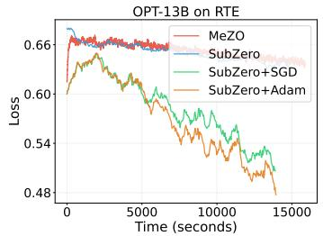

> 图4(b)：OPT-13B / RTE。基线在约 7000 秒停止，而 SubZero+ 的两条曲线一直跑到约 14000 秒，即**墙钟时间是基线的约 2 倍**；代价是最终损失明显更低（0.48 对 0.66）。这张图与"更快"相反，但在"更低损失"上支持本文。

> 图4(c)：LLaMA3.1-8B / WIC。SubZero+ 约 4000 秒结束，基线约 6300 秒，损失更低。

**结论：** 三张子图方向不一致（两张更快、一张慢约 2 倍），而横轴是墙钟时间而不是前向次数。在"匹配 40K 前向预算"的实验设定下，衡量收敛速度的正确横轴应当是前向次数或样本数；用墙钟时间会让结果同时受数据加载摊销、算子启动开销与早停策略影响。因此"SubZero+ 收敛更快"这一主张目前只能读作**"在部分任务上，达到更低损失所需的墙钟时间更短"**，而不是算法意义上的收敛加速。

### Haar 符号校正消融（表 4）

| 任务 | Adam Haar | Adam No Haar | Δ | SGD Haar | SGD No Haar | Δ |
|---|---:|---:|---:|---:|---:|---:|
| BoolQ | 65.6 | 68.2 | −2.6 | 66.4 | 66.4 | 0.0 |
| COPA | 77.0 | 75.0 | +2.0 | 75.0 | 74.0 | +1.0 |
| DROP | 23.8 | 24.3 | −0.4 | 25.4 | 24.2 | +1.2 |
| MultiRC | 56.0 | 53.2 | +2.8 | 61.7 | 59.1 | +2.6 |
| RTE | 65.2 | 60.6 | +4.6 | 60.3 | 63.5 | −3.2 |
| ReCoRD | 57.2 | 61.2 | −4.0 | 71.9 | 72.2 | −0.3 |
| SQuAD | 67.2 | 65.9 | +1.3 | 77.2 | 76.5 | +0.7 |
| SST-2 | 91.0 | 91.4 | −0.4 | 90.0 | 91.3 | −1.2 |
| WIC | 56.6 | 54.0 | +2.6 | 60.0 | 58.5 | +1.6 |
| **Avg.** | **62.2** | 61.5 | +0.7 | **65.3** | 65.1 | +0.3 |

设置：OPT-1.3B、FT、 $r=64$、 $K=99$、总前向 30,000。

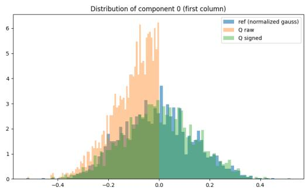

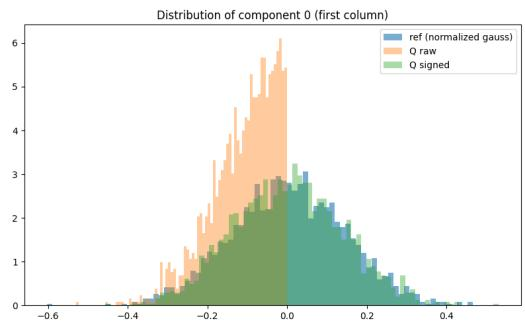

> 图6：附录 A.3 的分布检验。未校正 $Q$ 的坐标分布明显向 0 收紧（经验方差 0.0177 对理论 0.02，缺 11.5%），KS 检验 $p\ll0.001$；校正后 $Q$ 通过检验， $p>0.05$。**这个检验本身是规范的**，但它检验的是 $Q$ 的列——一个从未进入更新公式的中间对象。见审计 A2。

**这张表的问题**：Adam 与 SGD 的平均增益只有 +0.7 与 +0.3 点，而单任务 Δ 的散布达到 ±4.6 点、且 RTE 在两种优化器下符号相反（+4.6 对 −3.2）。若校正真的改变了扰动的分布，不应出现这种"随优化器翻符号"的形态；这正是单次运行噪声的典型形状。

### 查询数消融（表 5）

| $K$ | SST-2 | RTE | MultiRC | Avg. |
|---:|---:|---:|---:|---:|
| 1 | 50.9 | 47.7 | 55.5 | 51.4 |
| 5 | 52.6 | 52.7 | 55.5 | 53.6 |
| 10 | 56.7 | 49.8 | 52.3 | 52.9 |
| 20 | 69.8 | 57.0 | 59.8 | 62.2 |
| 30 | 88.3 | 62.8 | 57.6 | 69.6 |
| 50 | 90.9 | **63.9** | 60.0 | **71.6** |
| 70 | 91.5 | 58.1 | 58.2 | 69.3 |
| 80 | 91.6 | 60.3 | 59.3 | 70.4 |
| 100 | **92.2** | 57.0 | 59.6 | 69.6 |
| 150 | 89.9 | 61.4 | 58.7 | 70.0 |
| 200 | 89.7 | 61.0 | **61.1** | 70.6 |

设置：OPT-1.3B、FT、 $r=24$、子空间 Adam、总前向 30,000、逐 $K$ 调学习率。

**三个可直接核验的问题：**

1. **$K=1$ 行与论文自己的基线矛盾。** SubZero+ 在 $K=1$ 时每步也只需 $K+1=2$ 次前向，与 MeZO/SubZero 的每步成本完全相同，步数还更多（30,000 对 20,000），却得到 50.9%（SST-2 随机水平）；而 SubZero 用同样 2 次前向的单查询**两点**估计得到 90.9%。论文把这行解释为"单查询估计太噪"，但同一篇论文里的 SubZero 就是单查询且成绩很好。差别不在查询数，而在估计器形式与基线共享方式。见审计 A1。
2. **预算公式与成本不一致。** §5.3 写步数等于 $\lfloor30000/K\rfloor$，而每步实际花 $K+1$ 次前向。 $K=1$ 时真实前向为 60,000（名义预算的 2 倍）， $K=5$ 时 1.2 倍， $K\ge50$ 才在 2% 以内。也就是说小 $K$ 行是被**多给了计算**仍然失败的。
3. **默认 $K=99$ 不是消融里的最优。** 平均最优是 $K=50$（71.6）， $K=100$ 只有 69.6；主表却统一用 $K=99$。

### 内存分析（表 6 与图 2）

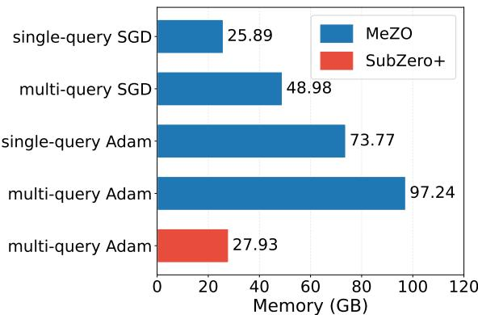

> 图2：MeZO 单查询 SGD 25.89 GB、MeZO 多查询 SGD 48.98 GB、MeZO 单查询 Adam 73.77 GB、MeZO 多查询 Adam 97.24 GB；SubZero+ 多查询 Adam 27.93 GB。正文所述"3.8 倍"与"27.9 GB"与图一致。图中只画了 SubZero+ 的一种配置，正文"SubZero+ 四种配置显存相同"的说法在该图中并未展示。

| 任务 | FT MeZO | FT SubZero | FT SubZero+ | Δ% | LoRA MeZO | LoRA SubZero | LoRA SubZero+ | Δ% |
|---|---:|---:|---:|---:|---:|---:|---:|---:|
| RTE | 30.4 | 30.5 | 30.7 | +1.1 | 30.4 | 30.4 | 30.4 | 0.0 |
| BoolQ | 34.1 | 34.2 | 34.5 | +1.0 | 34.1 | 34.1 | 34.1 | 0.0 |
| SQuAD | 30.8 | 30.9 | 31.1 | +1.0 | 30.8 | 30.8 | 30.8 | 0.0 |
| DROP | 50.4 | 50.5 | 50.8 | +0.6 | 50.4 | 50.4 | 50.4 | 0.0 |

内存主张是本文**证据最扎实的一类**：有具体数值、有跨任务表、有可视化，且与"所有辅助状态都在 $r\times r$"的设计一致。

## 独立审计：六个可检验的技术问题

本节全部为我的独立推导或交叉核对，不是论文主张的转述。除 A6 外，每一条都给出了可判定的验证方式。

### A1 一点差分加共享基线，引入了被 $1/\varepsilon$ 放大的泄漏项（**最关键**）

把式 (6) 按 $\ell_k$ 与 $\ell_0$ 拆开：

$$
\widehat{\nabla}_{W_i}\mathcal{L}=\frac{1}{K\varepsilon}\sum_{k=1}^{K}\ell_k\tilde{\mathbf{Z}}_i^{(k)}-\frac{\ell_0}{\varepsilon}\bar{\tilde{\mathbf{Z}}}_i
$$

其中 $\bar{\tilde{\mathbf{Z}}}_i$ 是 $K$ 个查询扰动的均值，第二项就是基线泄漏。由 $V_i\otimes U_i$ 列正交， $\Vert\tilde{\mathbf{Z}}_i^{(k)}\Vert_F=\Vert Z_i^{(k)}\Vert_F\approx r$，故 $\Vert\bar{\tilde{\mathbf{Z}}}_i\Vert_F\approx r/\sqrt{K}$，泄漏项范数量级为 $\ell_0r/(\varepsilon\sqrt{K})$。取 $\ell_0\approx0.5$、 $\varepsilon=10^{-3}$、 $r=24$： $K=1$ 时约 $1.2\times10^{4}$， $K=99$ 时约 $1.2\times10^{3}$。它与信号之比随 $\varepsilon$ 缩小而**发散**，这正是零阶优化文献（Duchi et al., 2015；Nesterov & Spokoiny, 2017）偏好两点估计、而 SubZero 原方案用中央差分的原因。

**后果：** 论文用"方差正比 $1/K$"论证多查询收益，但 SubZero+ 的方差实际是 $\Vert\nabla\mathcal{L}\Vert^2$ 与 $\ell_0^2/\varepsilon^2$ 两项之和再除 $K$ 的形态； $K$ 越大越能用，可能只是因为 $1/\sqrt K$ 把泄漏压到了可用范围。因此"多查询在共享子空间中打破了多查询悖论"这一核心叙事，存在一个更简单的替代解释：**收益来自修掉了一个自己引入的估计器缺陷**。这同时解释了表 5 的 $K\le10$ 崩溃，而论文对该行的解释（单查询太噪）与自家基线 SubZero 的 90.9% 直接冲突。

**零成本的候选修复（我的推导，值得实验验证）：** 把平均方向对查询均值做中心化，用 $\tilde{\mathbf{Z}}_i^{(k)}-\bar{\tilde{\mathbf{Z}}}_i$ 代替 $\tilde{\mathbf{Z}}_i^{(k)}$。由于 $\sum_k(\tilde{\mathbf{Z}}^{(k)}-\bar{\tilde{\mathbf{Z}}})=0$，含 $\ell_0$ 的项**精确消零**，剩下的是 $-(\bar{\ell}-\ell_0)\bar{\tilde{\mathbf{Z}}}_i/\varepsilon$，而 $\bar{\ell}-\ell_0$ 为 $O(\varepsilon\Vert\nabla\mathcal{L}\Vert)$ 量级，泄漏不再被 $1/\varepsilon$ 放大。不增加任何前向次数。

### A2 Haar 符号校正在本算法的扰动分布上可证明为恒等（**推翻第三项贡献**）

设未校正因子为 $\tilde{U}_i,\tilde{V}_i$，校正后 $U_i=\tilde{U}_iS_U$、 $V_i=\tilde{V}_iS_V$， $S_U,S_V$ 对角 $\pm1$。则

$$
U_iZ_iV_i^\top=\tilde{U}_i\left(S_UZ_iS_V\right)\tilde{V}_i^\top
$$

$S_U,S_V$ 完全由 $\Omega_U,\Omega_V$ 决定，与逐查询新采的 $Z_i$ 独立；而 $Z_i$ 是 i.i.d. $\mathcal{N}(0,1)$，逐元素变号不改变其分布，故条件于 $(\tilde{U}_i,\tilde{V}_i,S_U,S_V)$ 时 $S_UZ_iS_V$ 与 $Z_i$ 同分布。于是**校正前后的扰动 $\tilde{\mathbf{Z}}_i$ 同分布**。另外符号翻转不改变列空间，而 i.i.d. 高斯矩阵的列空间本就是 Grassmann 均匀的。

再往下游看： $\rho_k$ 只依赖扰动后的损失， $\overline{\boldsymbol{Z}}_i^t$ 是 i.i.d. 高斯坐标的加权和，Adam 矩在一个窗口内只做线性与逐元素运算，这两类运算都对坐标整体变号不变。因此在"$Z$ 逐查询独立采样、每个 $F$ 窗口内基固定"的实际实现下，**两种版本整条训练轨迹同分布**，差异只体现在具体随机数落点（即 seed 运气）。

**推论：** 表 4 的 +0.7 与 +0.3 平均增益、以及 RTE 在 Adam/SGD 下符号相反（+4.6 对 −3.2）这一形态，与"分布被改善"不相容，与"单 seed 噪声"完全相容。附录 A.3 的 KS 检验测的是 $Q$ 的第一列——一个不进入任何更新公式的中间量；它证明的是"未校正的 $Q$ 不是 Haar"（正确且已知），而不是"校正会改善训练"。

**诚实的边界（什么时候它确实有用）：** 当 $Z$ 的分布不对称号翻转不变时（例如对扰动做正交化或极分解一类的子空间正交化路线，如文中引用的 ZO-Muon、Lang et al.），或当你需要**跨窗口比较或复用同一坐标帧**（例如把矩缓冲在固定基上热启动）时，符号约定才会改变算法行为。本文两种都没用。所以这一步作为"实现卫生"值得保留、几乎零成本，但**不应算作带实测收益的贡献点**。

**验证方式（CPU 级、几十行代码）：** 固定 $\Omega$ 与 $Z$ 的随机流，分别用未校正与校正的 $U,V$ 生成 $\tilde{\mathbf{Z}}$，比较两者的经验分布（而不是 $Q$ 的列），并比较同一 seed 下长程训练中 $\overline{\boldsymbol{Z}}$ 序列的分布。

### A3 "梯度范数到曲率再到逐层步长"的叙事与 Adam 的尺度不变性矛盾

§4.2 原文称 $1/\sqrt{\hat V_i^t}$ 的逐元素预条件"给梯度大的层更小步长、给梯度小的层更大步长"。但 Adam 的更新是 $\eta\hat M/(\sqrt{\hat V}+\epsilon_{\mathrm{adam}})$，在 $\sqrt{\hat V}$ 远大于 $\epsilon_{\mathrm{adam}}$ 时对梯度整体缩放**近似不变**：某层梯度大一倍，其每坐标步长仍约为 $\eta$，不会变小。也就是说式 (10) 的实际行为恰恰相反——它把各层的**有效步长拉平到同一量级**，而不是按幅值反比缩放。

另外，式 (10) 是子空间内的**逐坐标**预条件，与 §4.1、§4.2 反复强调的"per-layer, per-direction adaptive step sizes from gradient norms"不是同一个机制；论文定义的 $\gamma_i^t=\Vert\overline{\boldsymbol{Z}}_i^t\Vert_F$ 这个量在更新式里并未被显式使用。

**这条不推翻实验结果，但推翻了论文对结果的解释。** 对做优化器理论的人来说，这恰恰是更值得追的问题：子空间 Adam 的收益如果真实存在，其来源更可能是"逐坐标归一化加少步数下的大有效步长"，而不是"曲率感知"。

### A4 前向预算核算在消融中不一致

主表按 $K+1$ 核算， $K=99$ 时 400 步合 40K，正确；§5.3 的消融按 $\lfloor30000/K\rfloor$ 核算，导致 $K=1,5,10$ 行分别得到名义预算的 2.0、1.2、1.1 倍。方向上**不利于**论文结论（小 $K$ 拿了更多计算仍然失败），因此这更像笔误而非操纵，但必须记录：表 5 的"$K$ 与精度关系"曲线并非严格等预算。

### A5 符号冲突、引文与表格来源问题

- **符号冲突**： $\boldsymbol{V}_i^t$ 在式 (8) 与式 (10) 中同时是二阶矩和右投影矩阵；算法 3 第 1 行与第 6 至 8 行对同一记号给出两种赋值。按论文原样实现会直接写错代码，实现者必须自行改名。
- **引文缺陷（已在 PDF 原文核对）**：Lang et al. 2026（*Powering up zeroth-order training via subspace gradient orthogonalization*）与 Liu et al. 2025（*ZO-Muon: Subspace gradient orthogonalization for zeroth-order optimization*）两条参考文献共用同一编号 arXiv:2602.17155，其中至少一条是错的。
- **表格来源待核**：表 4 的 "SGD Haar" 列 9 项中有 8 项与表 1 的 "SubZero+/SGD" 行完全相同（仅 WIC 为 60.0 对 59.4），而两表的子空间秩不同， $r=64$ 对 $r=16$；预算也不同（30K 对 40K）。相比之下表 4 的 Adam 列与表 1 的 Adam 行差异很大。这种"一列几乎复制、另一列完全不同"的不对称需要作者说明数据来源。
- **正文与图不一致**：§5.2.4 的 83.3% 与 86.5% 对图 5(a) 的 81.5% 与 86.6%。
- **算术自洽性（正面证据）**：我重算了表 1 至表 4 共 34 行的平均值，全部与论文报告的 Avg. 吻合（最大偏差 0.09）。表格数值层面没有发现计算错误。

### A6 公平性与"内存 $O(r^2)$"口径

- 学习率网格不重叠（MeZO 与 SubZero 用 $10^{-7}$ 到 $10^{-6}$，SubZero+ 用 $10^{-3}$ 到 $10^{-2}$），三方各取 best-of-3 并按验证损失挑 checkpoint。这在方法间是对称协议，但只有 3 个点，且**表 3 明确改用逐任务 oracle 配置**，破坏了这一对称。
- "所有持久状态 $O(r^2)$"只对矩缓冲成立。层间缓存的投影矩阵是 $(m_i+n_i)r$ 个浮点数，与 $2r^2$ 之比约为 $(m_i+n_i)/(2r)$——OPT-13B、 $r=128$ 时约 40 倍。所以真正的持久开销来自投影矩阵而非 Adam 缓冲；表 6 的 +1% 开销与此一致，但正文的记号口径会让人低估它。
- LoRA 侧： $A\in\mathbb{R}^{r_{\mathrm{LoRA}}\times n}$、 $B\in\mathbb{R}^{m\times r_{\mathrm{LoRA}}}$ 且 $r_{\mathrm{LoRA}}=8$，而 LoRA 网格允许 $r\in\{4,8,16\}$。当 $r\ge8$ 时短边方向上"子空间投影"不再降维， $O(m_in_i)$ 到 $O(r^2)$ 的方差论证在该侧失效。论文未讨论。
- 全文**没有**报告随机种子重复次数、方差、置信区间或显著性检验。按 MeZO 与 SubZero 协议（前作仓库示例为 train 1000、dev 500、eval 1000，此点待核验），单任务在 $n\approx1000$ 上 95% 置信半宽约 2 个百分点——这足以吞掉表 4 的 ±0.7 与表 2 的部分 +2.x。

## 主张-证据-限制矩阵

| 主要主张 | 证据位置 | 是否充分 | 替代解释或风险 | 置信度 |
|---|---|---|---|---|
| SubZero+ 一致优于已有零阶基线 | 表 1、表 2 | 平均意义上基本成立 | FT 上 +0.8 到 +2.7；OPT-1.3B 的 SGD 版本反而略低于 SubZero；无 seed 与方差 | 中 |
| 多查询在共享子空间中规避多查询悖论 | §4.1、表 5 | 不充分 | 无定理；且 $K$ 收益可被 A1 的基线泄漏完全解释 | 低 |
| 子空间 Adam 通过梯度范数实现曲率感知逐层步长 | §4.2、图 3 | 不充分 | A3：Adam 尺度不变性使该机制描述反向； $\gamma_i^t$ 未进入更新式 | 低 |
| Haar 符号校正提升精度 | 表 4 | 不充分（且与理论冲突） | A2：扰动同分布，表 4 形态符合单 seed 噪声 | 低 |
| 显著放宽稳定学习率区间 | 图 5、§5.2.4 | 局部充分 | 用训练准确率、用清单外的 0.6B 模型；实际是 3 倍对 2 倍 | 中 |
| 内存开销可忽略 | 图 1(c)、图 2、表 6 | 充分 | 唯一有跨任务实测支撑的主张；但 $O(r^2)$ 记号低估投影矩阵开销 | 高 |
| 收敛更快 | 图 1(b)、图 4 | 部分充分 | 横轴为墙钟时间；图 4 三张子图方向不一致（COPA 与 WIC 更快，RTE 反而慢约 2 倍） | 低 |
| 兼容 FT、LoRA、prefix、prompt | §4.4 声称、表 1、表 2 | 部分 | 只做了 FT 与 LoRA；prefix 与 prompt 未实验 | 中 |
| 32B 上领先 +2.3 | 表 3 | 不充分 | 论文自认 oracle best 配置对非 oracle 基线 | 低 |

## 深度分析

### 可归因的净增量

1. 把 SubZero 的单查询子空间估计改成**同帧多查询聚合**，并给出跨 1.3B 到 32B、FT 与 LoRA 的一致（但幅度有限）实证提升。
2. 给出**子空间内 Adam 的完整可跑配置**（取 $K=99$、 $F=50$ 到 $100$、 $\eta$ 在 $10^{-2}$ 量级），把"零阶方法上 Adam 不比 SGD 好"这一多篇论文的共识在子空间设定下部分推翻——这是最有价值的一条经验事实，尽管论文给它的解释是错的。
3. 一套较诚实的预算与内存核算口径（40K 前向对齐、 $K+1$ 前向、逐任务显存表），可直接被后续工作复用或反驳。
4. QR 符号规范化作为实现卫生（分布上恒等，但确实消除了一个不必要的实现依赖）。

### 优势

- 问题选得准：学习率窗口与多查询预算是零阶微调真正卡人的两处。
- 覆盖面在同方向论文里算宽：5 个模型、9 个任务、2 种参数方案、内存与前向预算都有量化。
- 三个组件写成了依赖链（稳定子空间 → 低噪梯度范数 → 自适应步长），便于读者定位失败环节——尽管该链的中间环节（A3）不成立。
- 明确写出局限性：随机子空间与数据无关、每 $F$ 步从头重生成而非自适应更新。
- 表格算术自洽、图与正文数值大多对得上，说明作者对自己的数据是认真的。

### 局限性（论文自陈之外）

- **无任何理论**：核心主张"规避多查询悖论"是纯经验陈述。
- **估计器形式变更未被披露为设计选择**：从两点改一点是本文与 SubZero 的实质差异之一，正文只在式 (6) 与"$K+1$ 次前向"中隐含出现，从未讨论其方差代价。
- **缺关键对照**：没有"单查询两点加子空间 Adam"（固定估计器形式、只改优化器）的消融，因此无法把多查询、Adam、更大学习率网格三者的贡献分离。
- **无重复实验**：所有增益都是单次运行差值。
- **矩缓冲跨坐标帧污染未讨论**： $\boldsymbol{M}_i$ 与 $\boldsymbol{V}_i$ 存于 $r\times r$ 坐标，而坐标帧每 $F$ 步整体更换且不做基变换。 $\beta_2=0.95$ 的记忆长度约 20 步， $F=50$ 时每个窗口约有 40% 的步数在混合新旧两套坐标的数字。这不改变 A2 的同分布结论，但影响"子空间 Adam 到底在平均什么"的解释。
- **收敛速度用墙钟时间衡量**，而墙钟受"同一批数据连续 100 次前向可摊薄数据加载与算子启动开销"影响，与算法质量无关。

### 复现审计

| 项目 | 状态 | 评价 |
|---|---|---|
| 算法伪代码 | 完整但含符号冲突 | 需自行区分投影矩阵与二阶矩的 $V$ |
| 估计器形式 | 已明确 | 一点差分加共享基线， $K+1$ 前向 |
| 超参网格 | 较完整 | FT 与 LoRA 各给表 7、表 8； $r$、 $F$、 $K$、 $\beta$ 齐全 |
| 数据协议 | 未明确 | 未写训练与验证样本规模；按前作仓库推断为 1000/500 子采样，待核验 |
| 随机种子 | 部分 | 扰动重放用 seed，但未报告实验重复数与 seed 值 |
| 代码 | **未发布** | PDF 内无任何 URL；前作仓库自 2024-11 未更新，不含 SubZero+ |
| 硬件与耗时 | 已报告 | 单张 H200 或 4090，PyTorch 2.1.0 加 CUDA 12.1 |
| 峰值内存 | 已报告 | 图 2、表 6、图 1(c) 三处交叉一致 |
| 统计检验 | 未报告 | 全文无 |
| 理论 | 无 | 无定理、无引理、无证明 |

### 致命问题与非致命局限

- **已证实的致命问题**：未发现（表格算术自洽，内存证据扎实）。
- **可证明的贡献失效**：A2 表明第三项贡献在该算法的实际对象上分布恒等，因此表 4 不能作为其有效性证据。这不使方法失效，但使"三项贡献"变成"两项经验性改进加一项卫生修复"。
- **主张解释的关键缺口**：A1 与 A3。若"两点单查询加子空间 Adam"对照能复现大部分增益，则多查询叙事与曲率叙事都要重写。
- **非致命局限**：无理论、无 seed、消融预算不严格对齐、墙钟口径、表 3 的 oracle 比较、LoRA 侧降维论证退化。

## 与最接近工作对比

| 工作 | 扰动结构 | 每步前向 | 步数（等预算） | 优化器 | 理论 | 本文的净增量 |
|---|---|---:|---|---|---|---|
| [MeZO](https://arxiv.org/abs/2305.17333) | 全空间单随机方向，两点 | 2 | 20K | SGD | 无（LLM 场景） | 子空间加多查询加 Adam，学习率区间更宽 |
| **Zeroth-Order Fine-Tuning of LLMs in Random Subspaces**（SubZero, Yu et al., 2025） | 逐层 $UZV^\top$，QR 正交基，两点 | 2 | 20K | 子空间 SGD | 有（引理 1：方差从 $O(mn)$ 到 $O(r^2)$） | 同帧多查询聚合加子空间 Adam 加 QR 符号规范化 |
| [LOZO](https://arxiv.org/abs/2410.07698)（Chen et al., 2025） | 低秩因子化扰动 | 少 | 多 | 子空间 SGDM | 有 | 本文用正交基加多查询；LOZO 已在子空间内用动量 |
| **TeZO**（Sun et al., 2025） | 时间维低秩 | 少 | 多 | SGD 与 Adam 变体 | 有 | 本文主张"子空间内 Adam 可用"，而 TeZO 的 Adam 变体未获一致收益 |
| **The multi-query paradox in zeroth-order optimization**（Lin et al., 2025） | — | — | — | — | 有（悖论本身） | 本文声称规避该悖论，但未给定理，且存在 A1 的替代解释 |
| [Sparse MeZO](https://arxiv.org/abs/2402.15751) 与 extreme sparsity 路线（Guo et al., 2024, 2025） | 稀疏扰动 | 2 | 多 | SGD | 部分 | 本文走低秩子空间而非稀疏，两者正交 |
| [MpSub](../MpSub_A_Momentum_$p$_Dimensional_Subspace_Trust_Region_Method_for_Derivative_Free_Fine_Tuning_of_Large_Language_Models/精读.md)（2026） | 动量方向加 $p-1$ 个随机方向，两点 | $2p+2$ | 少 | 信赖域（无学习率） | 有（几乎必然收敛） | 同为"多探测换稳定步长"，MpSub 用信赖域反馈，本文用固定 $\eta$ 加 Adam 归一化 |
| [Powell-Style Model-Based DFO](../Powell_Style_Model_Based_Derivative_Free_Optimization_with_Complexity_Guarantees/精读.md)（2026） | 插值点集加随机子空间 | 稳态 1 到 2 | 多 | 信赖域 | 有（复杂度界） | 本文每步 100 次前向，与"复用历史函数值把评估降到个位数"的路线相反 |

### 与 SubZero 的实质差异（最要紧的一条）

SubZero+ 相对 SubZero 的**唯一结构性改动**，是把两点中央差分换成共享基线的一点前向差分（为了每步只多花 $K-1$ 次前向而不是 $2K$ 次），其余都是多查询、Adam 与符号规范化。而 SubZero 本身有引理 1 支撑其方差论证，SubZero+ 没有任何方差界。因此二者比较的正确读法是：**SubZero+ 用一次未被分析的估计器替换，换来了 50 倍的步数缩减和更大的可用学习率。** 这笔交易在 13B 与 30B 上看起来是赚的（+2.2 到 +2.8），在 1.3B 上是平的（−0.2 到 +0.8）。

## 技术路线定位

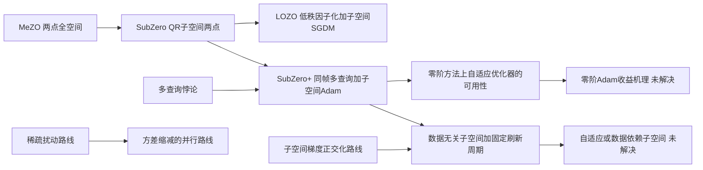

本文处在"零阶 LLM 微调 → 子空间方差缩减"这条线目前最靠工程的一端：它不提出新的估计器理论，而是把三个已知部件在同一个 $r\times r$ 坐标帧里组装起来，用实测显存与实测准确率证明"这样组装是划算的"。它留下的真正未解问题不是"能不能更快"，而是**在匹配估计器形式与匹配前向预算之后，多查询在零阶微调里到底有没有净收益**——这恰好是一个 6GB 显存就能判定的小实验。

## 可证伪的后续研究机会

| 假设 | 最小验证 | 指标 | 资源成本 | 停止条件 |
|---|---|---|---|---|
| A2：Haar 校正在 i.i.d. 高斯 $Z$ 下不改变扰动分布 | 固定 $\Omega$ 与 $Z$ 的随机流，比较校正前后 $\tilde{\mathbf{Z}}$ 的坐标分布与 KS 统计量 | 两样本 KS 的 $p$ 值、坐标方差 | 极低（CPU，纯线性代数） | 若分布相同，则表 4 增益判为噪声，放弃该贡献点 |
| A1：表 5 的 $K\le10$ 崩溃源于基线泄漏而非"单查询太噪" | OPT-1.3B 或 OPT-125M / SST-2， $K\in\{1,10\}$，一点对两点估计器，同 $r$、同步数、同 lr 网格 | 测试准确率、泄漏项与信号项范数比 | 低（单卡） | 若两点 $K=1$ 恢复到 90% 附近，则多查询叙事需重写 |
| A1 修复：查询均值中心化消除泄漏且不增加前向 | 在式 (6) 中把 $\tilde{\mathbf{Z}}^{(k)}$ 换成 $\tilde{\mathbf{Z}}^{(k)}-\bar{\tilde{\mathbf{Z}}}$ | 等前向预算下 SST-2 与 RTE 的准确率、达标所需 $K$ | 低 | 若无提升则该修复无效，A1 的替代解释减弱 |
| A3：子空间 Adam 的收益来自逐坐标归一化而非曲率感知 | 补齐论文缺的对照：单查询两点点加子空间 Adam，再多查询化 | 准确率、达到目标损失的前向数 | 中 | 若单查询 Adam 已接近多查询成绩，则多查询贡献独立失效 |
| 多查询悖论在子空间中是否真的被打破 | 固定总前向 $B$，扫 $K\in\{1,5,25,125\}$，两点估计器、同一 lr 网格、每点 3 seed | 预算-精度曲线随 $K$ 的漂移 | 中 | 曲线在对数尺度上平坦则悖论成立，本文主张被否 |
| 矩缓冲跨坐标帧污染是否损害收敛 | 每次换帧时把矩做基变换或直接清零，与论文原样对比 | 准确率、损失曲线抖动 | 低 | 若清零更好，则现有子空间 Adam 的实现方式应改 |
| 学习率区间放宽是否可归因于 Adam 而非多查询 | 同 $K$ 下 SGD 对 Adam 扫 $\eta$ 四个数量级，报告测试准确率 | 稳定区间宽度（测试集口径） | 低 | 若 SGD 区间同样宽，则图 5 的归因需改 |

**与本地算力对齐**：A2 与"矩缓冲清零"两条不需要 LLM 训练，纯 CPU 或单卡即可；A1 与悖论扫描可用 OPT-1.3B（论文用 4090 24GB 跑通，本地 3060 6GB 需把 batch 降到 4 并改用冻结基座加 LoRA）；V100 无 bf16 不影响，本文全程 fp16。

## 我的综合评价

| 维度 | 分数 | 证据位置 | 理由 | 置信度 |
|---|---:|---|---|---|
| 问题重要性与界定 | 4.0 | §1、图 1、§5.2.4 | 学习率窗口与多查询预算权衡真实且代价可量化；但"稳定区间"用训练准确率、鲁棒性实验用了清单外的 0.6B 模型 | 高 |
| 原创性与净增量 | 2.5 | §4.1 至 §4.3、与 SubZero 对比 | 三个部件分别来自子空间估计、Adam 与 Mezzadri 规范化；第三项经 A2 为分布恒等；第二项 TeZO 已试且未获一致收益 | 中高 |
| 技术正确性与严谨性 | 2.5 | 式 (6)(10)、算法 3、§4.2 | 无理论；A1 的 $1/\varepsilon$ 泄漏未讨论；A3 的机理描述与 Adam 尺度不变性矛盾； $V$ 符号冲突；引文编号重复 | 中高 |
| 证据强度与替代解释 | 2.5 | 表 1 至表 6、图 4、图 5 | 覆盖广但全部单次运行；缺"两点单查询加 Adam"关键对照；表 3 自认 oracle；图 4 墙钟方向不一致 | 高 |
| 可复现性与透明度 | 3.0 | 附录 A.1、A.2、表 6 | 超参、硬件、显存、前向预算交代充分；但无代码（前作仓库未更新）、无 seed、数据子采样规模未写 | 中高 |
| 外推边界与稳健性 | 3.0 | §6 Limitations、A6 | 明确承认子空间数据无关与固定刷新；但 prefix 与 prompt 未验证、LoRA 侧降维论证退化、内存记号低估投影矩阵 | 中 |
| 研究生成力 | 3.5 | A1 至 A4、后续机会表 | 提供三个廉价且可判定的问题（估计器形式、符号约定是否改变分布、多查询净收益），能直接改变后续子空间零阶方法的设计 | 高 |
| 当前课题契合度 | 3.5 | 与 MpSub、Powell 精读对照 | 是 SubZero 线的最新节点，与正在推进的无导数微调专题直接相关；但无理论，对收敛性分析类工作的可迁移内容有限 | 高 |

- **学术价值分：5.0/10。** 按默认权重（15%、20%、20%、20%、10%、5%、10%，第八项不计入）加权均值为 2.90，映射 $2.5\times(2.90-1)=4.75$，按 0.5 分粒度取 5.0。定位是"合格且有用的增量工作，核心主张基本成立但证据覆盖与机理解释有限"。
- **当前课题优先级：精读（针对子空间零阶微调线）。** 用途不是借用它的方法，而是把它当作一个**反例来源与廉价实验清单**：A1、A2 两条都是低成本、可判定、且会改变"如何设计零阶子空间估计器"结论的实验。若近期只做定点核查，按 A2、A1、A3 的顺序读即可。
- **评价置信度：中高。** 已核对全文与附录、逐张查看 14 幅原图、重算 34 行平均值、核对 PDF 参考文献原文、确认前作仓库状态（最后推送 2024-11-22，不含 SubZero+）。**未经独立数值验证**的是 A1 与 A2 的经验后果（推导本身是初等的，但其对训练结果的影响幅度需实验确认）；表 4 与表 1 的数据来源、以及训练数据子采样规模需向作者确认。

### 突出亮点

- 内存与前向预算的核算口径清楚，是同类论文里较少见的好处，可直接被引用与反驳。
- 在 13B 与 30B 规模上给出了跨 FT 与 LoRA 一致的增益，且增益最大处（RTE、BoolQ）恰好是零阶方法历来最弱的任务。
- 把"零阶方法上 Adam 不比 SGD 好"这一共识在子空间设定下部分推翻，即使解释错了，这条经验事实本身有价值。
- 附录 A.3 的 KS 检验做得规范（多 seed、CPU 与 GPU 后端、标准与列主元 QR 都验），只是检验对象选错了。

### 可借鉴点

- **共享基线省前向是有代价的**：任何"用 $K+1$ 次前向做 $K$ 查询"的设计都应显式检查 $\ell_0/\varepsilon$ 泄漏项，或直接改用查询均值中心化形式。
- **把优化器搬进低维坐标帧**这一做法本身可行且内存友好，但必须处理坐标帧切换与矩缓冲的一致性（本文未处理）。
- **等前向预算而非同步数**的比较口径，以及"每步前向数乘步数"的显式核算表，值得在自己的实验协议里照抄。
- 报告"稳定学习率区间宽度"作为一个独立指标（而不是只报最优点），比报单点 SOTA 更有信息量。

### 批判性思考

- 三项贡献中，真正改变算法行为的只有一项（多查询），而它恰好也是唯一存在更简单替代解释的一项。
- "实现依赖的方向歧义"听起来像理论缺陷，实际是随机数落点差异；这类"分布层面的恒等与实现层面的差异"值得在自己的论文里主动区分。
- 论文最大的方法论问题不是缺实验，而是**缺一个对照**：把估计器形式固定住，多查询与 Adam 的贡献才谈得上分离。
- 400 步就训完一个 13B 模型，这个事实本身应该让审稿人追问 checkpoint 选择与验证集规模的匹配度，而不是只夸它快。

> **关键启示：** 子空间零阶微调的瓶颈不在"采多少个方向"，而在"估计器是否把基线值带进了更新方向"——把 $K+1$ 次前向的省法与两点差分放在同一预算下对照，才是这一类方法真正的分水岭。

> **注意事项：**
> - 表 4 的 Haar 增益不能作为该组件有效的证据（A2 给出分布恒等论证）。
> - §4.2 关于"Adam 按梯度幅值反比缩放步长"的描述与 Adam 自身的尺度不变性矛盾，不要按字面实现或引用。
> - 表 3 的 32B 结果是 oracle-best 对非 oracle 基线，引用时需注明。
> - 表 5 的 $K\le10$ 行实际用了超过名义前向预算，其崩溃不能直接归因于"单查询太噪"。
> - 图 1(b) 与图 4 的横轴是墙钟时间，等前向预算的比较必须自己重画成前向次数轴。
> - 按论文式 (10) 与算法 3 原样实现会因 $V$ 的符号冲突写错代码。

## 我的笔记

（留白，供后续手动补充。）

## 相关论文

- **Zeroth-Order Fine-Tuning of LLMs in Random Subspaces**（Yu et al., ICCV 2025）— 本文的直接前作 SubZero；本地仅有原文 PDF，尚未精读。
- [MpSub: A Momentum $p$-Dimensional Subspace Trust-Region Method for Derivative-Free Fine-Tuning of LLMs](../MpSub_A_Momentum_$p$_Dimensional_Subspace_Trust_Region_Method_for_Derivative_Free_Fine_Tuning_of_Large_Language_Models/精读.md)（2026）— 同为"多探测换稳定步长"，但用信赖域反馈替代固定学习率。
- [Powell-Style Model-Based Derivative-Free Optimization with Complexity Guarantees](../Powell_Style_Model_Based_Derivative_Free_Optimization_with_Complexity_Guarantees/精读.md)（2026）— 复用历史函数值把每步评估降到个位数，与本文每步 100 次前向形成对照。
- **Fine-Tuning Language Models with Just Forward Passes**（Malladi et al., 2023）— MeZO，本文内存与预算口径的来源。
- **Enhancing Zeroth-Order Fine-Tuning for Language Models with Low-Rank Structures**（Chen et al., 2025）— LOZO，子空间内已用过 SGDM。
- **TeZO: Empowering the low-rankness on the temporal dimension in the zeroth-order optimization**（Sun et al., 2025）— 其 Adam 变体未获一致收益，是本文第二项贡献的直接语境。
- **The multi-query paradox in zeroth-order optimization**（Lin et al., 2025）— 本文第一项贡献声称规避的对象。

## 外部资源

- [本文 arXiv abs/2608.15665](https://arxiv.org/abs/2608.15665)
- [SubZero（ICCV 2025 论文页）](https://openaccess.thecvf.com/content/ICCV2025/html/Yu_Zeroth-Order_Fine-Tuning_of_LLMs_in_Random_Subspaces_ICCV_2025_paper.html)
- [zimingyy/SubZero 代码仓库](https://github.com/zimingyy/SubZero) — 前作实现，最后推送 2024-11-22，**不含 SubZero+**
- [princeton-nlp/MeZO](https://github.com/princeton-nlp/MeZO) — 基线协议来源
- [ZO-Bench/ZO-LLM](https://github.com/ZO-Bench/ZO-LLM) — SubZero 仓库声明的上游基准代码
- **代码状态**：截至本次分析，未找到 SubZero+ 的公开实现；PDF 全文不含任何 URL。
