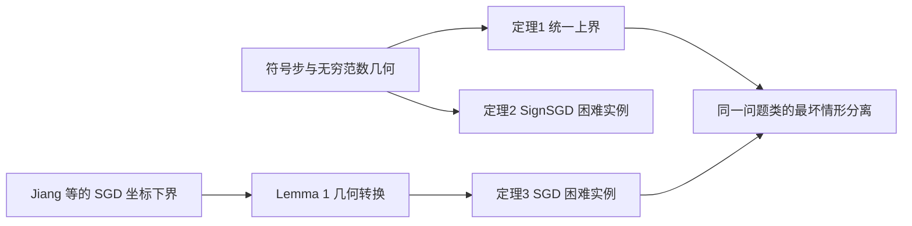
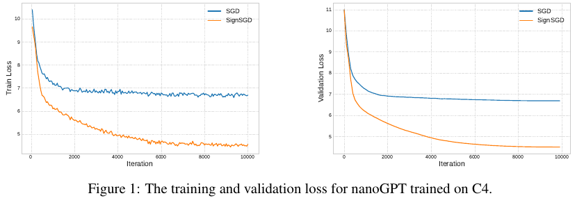
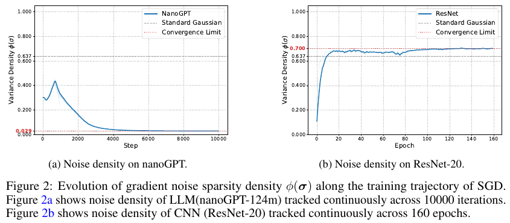
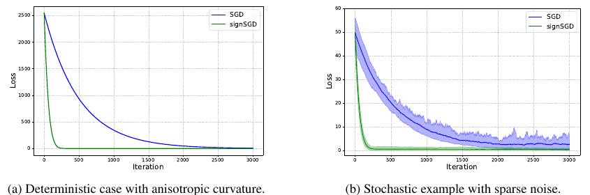

# When and Why SignSGD Outperforms SGD: A Theoretical Study Based on $\ell_1$-norm Lower Bounds

## 核心信息

- **论文类型**：理论算法为主，附带数值例子与小模型预训练实验。
- **作者**：Hongyi Tao、Dingzhi Yu、Lijun Zhang；南京大学。
- **版本**：arXiv:2605.06615v1，2026-05-07 首发；本工作区 2026-09-23 入库。
- **原始材料**：[本地 PDF](../../../01-raw/2026-09/When_and_Why_SignSGD_Outperforms_SGD_A_Theoretical_Study_Based_on_l1_norm_Lower_Bounds.pdf)；[解析 Markdown](../../../02-markdown/2026-09/When_and_Why_SignSGD_Outperforms_SGD_A_Theoretical_Study_Based_on_l1_norm_Lower_Bounds.md)。本文定理与公式以 PDF 为准，解析稿有公式识别错误。
- **在线资源**：[arXiv](https://arxiv.org/abs/2605.06615)；[官方代码](https://github.com/Dingzhen230/SignSGD_Outperforms_SGD)。

> **一句话贡献：** 在全局 $\ell_\infty$ 光滑、逐坐标有限方差、以梯度 $\ell_1$ 范数衡量驻点的同一问题类上，论文给出 SignSGD 匹配的上、下界，并借用既有 SGD 下界证明两者的最坏情形查询复杂度可分离；随后把向量构造约化到 Muon 的矩阵几何。

## 摘要与翻译

### 英文摘要

以下完整保留 [本地 PDF 第 1 页](../../../01-raw/2026-09/When_and_Why_SignSGD_Outperforms_SGD_A_Theoretical_Study_Based_on_l1_norm_Lower_Bounds.pdf) 的英文摘要；仅合并 PDF 排版换行，并把范数和维度符号改写为 Markdown 公式。

Sign-based optimization algorithms, such as SignSGD and Muon, have garnered significant attention for their remarkable performance in training large foundation models. Despite this empirical success, we still lack a theoretical understanding of when and why these sign-based methods outperform vanilla SGD. The core obstacle is that under standard smoothness and finite variance conditions, SGD is known to be minimax optimal for finding stationary points measured by $\ell_2$-norms, thereby fundamentally precluding any complexity gains for sign-based methods in standard settings. To overcome this barrier, we analyze sign-based optimizers leveraging $\ell_1$-norm stationarity, $\ell_\infty$-smoothness, and a separable noise model, which can better capture the coordinate-wise nature of signed updates. Under this distinct problem geometry, we derive matched upper and lower bounds for SignSGD and explicitly characterize the problem class in which SignSGD provably dominates SGD. Specifically, we compare the upper bound of SignSGD with the lower bound of SGD, illustrating that SignSGD effectively reduces the complexity by a factor of $d$ under sparse noise, where $d$ is the problem dimension. Furthermore, we elevate this framework to the matrix domain, providing an equivalent optimal lower bound for the Muon optimizer, proving that extending the sign operator to matrices preserves this optimal scaling with dimensionality. Finally, we bridge our theoretical bounds to practice, demonstrating that the theoretical superiority of SignSGD accurately predicts its faster convergence during the pretraining of a 124M parameter GPT-2 model. Code is available at https://github.com/Dingzhen230/SignSGD_Outperforms_SGD.

### 中文翻译

SignSGD 与 Muon 等符号型优化器在大型基础模型训练中表现突出，但现有理论尚未充分解释它们何时、为何能够超过普通 SGD。标准光滑性和有限方差条件下，以梯度 $\ell_2$ 范数定义驻点时，SGD 已达到最坏情形最优复杂度，因此在该框架中无法证明符号方法有更好的复杂度阶。本文改用梯度的 $\ell_1$ 驻点度量、目标函数的 $\ell_\infty$ 光滑性以及逐坐标噪声模型。作者在这个问题类中为 SignSGD 建立匹配的上、下界，并通过 SignSGD 上界与 SGD 下界比较，刻画符号更新在稀疏噪声下至多可获得维度量级的复杂度优势。作者还把这一构造提升到矩阵优化，在谱范数光滑与核范数驻点的设置下建立 Muon 的匹配界；最后用 124M 参数 GPT-2 预训练实验展示符号更新的训练损失优势。

### 核心要点提炼

- **问题**：标准 $\ell_2$ 驻点框架中，SGD 已有最坏情形最优性，无法在相同条件下证明符号法的复杂度优势。
- **方法**：改用 $\ell_\infty$ 光滑性、$\ell_1$ 驻点和逐坐标噪声模型，以配合符号更新的坐标结构。
- **理论结果**：给 SignSGD 匹配的上、下界，并与 SGD 的下界比较；稀疏噪声时，两个界所表示的最坏情形查询复杂度可相差维度因子。
- **延伸与实践**：把构造扩展到理想化 Muon 的矩阵符号；124M GPT-2 实验报告 SignSGD 在该训练配置下收敛更快。代码地址见英文摘要末尾。

### 阅读时要保留的限定

这里的“优于”是**同一问题类上的最坏情形复杂度分离**：一个算法有统一上界，另一个算法有困难实例下界。它并未证明每个具体训练任务中 SignSGD 都比 SGD 快，也未比较 SignSGD 与 AdamW、PowerStep 的一般优劣。

## 研究背景与问题定义

通常的随机非凸优化以梯度 $\ell_2$ 范数定义驻点。在相应的欧氏光滑与有界方差条件下，SGD 的查询复杂度已达到已知的最坏情形阶；想建立严格优势，必须明确换了哪一项假设或评价指标。本文把更新方向、光滑性和驻点度量放进一组对偶几何：

| 角色 | 本文选择 | 含义 |
|---|---|---|
| 参数步长几何 | $\ell_\infty$ | 控制所有坐标中最大的参数变化；符号步每个非零坐标幅值相同。 |
| 光滑性 | $L_\infty$ | 二阶余项由参数差的 $\ell_\infty$ 范数平方控制。 |
| 驻点指标 | 梯度 $\ell_1$ 范数 | $\ell_\infty$ 的对偶范数；对应符号方向的最大线性下降。 |
| 随机噪声 | 各坐标方差上界 $\sigma_i^2$ | 能区分噪声集中于少数坐标与均匀分散。 |

关键假设（§3.1，Assumptions 1a–3a）为目标函数有下界、批内梯度条件无偏且互相独立，并满足：

$$
\mathbb{E}\left[(g_{t,i}^{b}-\nabla_i f(x_t))^2\mid\mathcal{F}_{t-1}\right]\le\sigma_i^2
$$

$$
\left|f(y)-f(x)-\nabla f(x)^\top(y-x)\right|\le\frac{L_\infty}{2}\Vert y-x\Vert_\infty^2
$$

这些是**全局**条件。论文图 2 测了噪声密度，但没有测完整 Transformer 损失是否满足可用的全局 $L_\infty$ ；因此理论条件与 GPT-2 实验的对应仍是待证的。

## 方法与理论主线

### 为什么 SignSGD 对应 $\ell_\infty$ 最速下降

固定一个点 $x$ ，在线性近似下选择 $\Vert v\Vert_\infty\le1$ 的更新方向，有：

$$
\max_{\Vert v\Vert_\infty\le1}\nabla f(x)^\top v=\Vert\nabla f(x)\Vert_1
$$

最大值的方向是梯度的坐标符号；做下降时取负号。实际算法用小批量梯度 $g_t$ 的符号。 $\ell_\infty$ 光滑性使一次符号步的二阶代价至多与 $L_\infty\eta^2$ 同阶，而一阶收益以 $\Vert\nabla f(x_t)\Vert_1$ 计。附录 B.1 用“符号识别错误由小批量梯度的 $\ell_1$ 误差控制”得到：

$$
\frac{1}{T}\sum_{t=1}^{T}\mathbb{E}\left[\Vert\nabla f(x_t)\Vert_1\right]
\le\frac{\Delta}{\eta T}+\frac{2\Vert\sigma\Vert_1}{\sqrt{B}}+\frac{L_\infty\eta}{2}
$$

其中 $\Delta$ 是初始函数值到下确界的差， $B$ 是每步批量， $T$ 是更新次数， $N=BT$ 是样本梯度查询总数。这个式子比只写最终速率更有解释力：步长平衡“前进”和“曲率代价”，批量控制噪声导致的错误符号。

### 上界、下界与分离

定理 1 选取步长与批量后给出 SignSGD 的 $\ell_1$ 驻点平均上界：

$$
O\left(\sqrt{\frac{L_\infty\Delta}{N}}+
\left(\frac{\Vert\sigma\Vert_1^2L_\infty\Delta}{N}\right)^{1/4}\right)
$$

定理 2 给同一算法建立匹配阶的存在性下界，目标是轨迹上最小梯度 $\ell_1$ 范数。构造方法是把 $d$ 个一维困难函数拼起来，在平坦斜坡上让零梯度观测使算法停滞；再分配坐标曲率和函数值差，得到 $\Vert\sigma\Vert_1$ 依赖。附录 B.2 的一维随机 oracle 取零值或非零值，保持无偏并把方差设为 $\sigma_i^2$ 。这说明上界对该算法与此问题类而言，阶上基本不可改进。

定理 3 把 Jiang 等（2025）的坐标光滑 SGD 下界，经 Lemma 1 的“可分光滑推出 $\ell_\infty$ 光滑”转换到本文的假设类。其对象是**批量为 1、固定标量步长的 vanilla SGD**，得到：

$$
\Omega\left(\sqrt{\frac{dL_\infty\Delta}{N}}+
\left(\frac{d\Vert\sigma\Vert_2^2L_\infty\Delta}{N}\right)^{1/4}\right)
$$

为说明噪声结构，论文定义（§4.1，式 (8)）：

$$
\phi(\sigma)=\frac{\Vert\sigma\Vert_1^2}{d\Vert\sigma\Vert_2^2}
$$

只要 $\sigma$ 非零， $\phi$ 在 $1/d$ 与 1 之间。仅一个坐标有噪声时， $\phi=1/d$ ；所有坐标噪声幅值相同时， $\phi=1$ 。按照论文式 (9)–(10)，达到相同 $\ell_1$ 驻点阈值所需的理论查询数，确定性项的最坏情形差距可达 $d$ ；噪声项的比值由 $1/\phi$ 控制，稀疏噪声时亦可达 $d$ 。**均匀非零噪声时随机项同阶**；零噪声时 $\phi$ 未定义，应直接看确定性项。

### Muon 的矩阵延伸

§5 把向量的 $\ell_\infty$ / $\ell_1$ 对偶对换成矩阵的谱范数 / 核范数对偶对。理想化 Muon 更新用矩阵梯度的奇异向量构造矩阵符号方向。定理 4 给核范数驻点上界；定理 5 借助旋转后的对角矩阵，把向量 SignSGD 困难实例嵌入矩阵问题，附录 D.2 得到对应下界。

**文本审计：** 正文定理 5 的式 (13) 把“下界”写成大 $O$ ，但定理标题、证明叙述和附录 D.2 末尾均使用大 $\Omega$ 。按上下文应是符号排版错误；引用该结论时应指向附录 D.2，并留意后续版本是否修订。§5.1 同时明确假设 Newton–Schulz 的矩阵符号近似没有数值误差，因而这一理论并未直接覆盖实际 Muon 的有限次迭代实现。

## 实验结果与证据强度

| 证据 | 设置与指标 | 论文报告的结果 | 能支持到哪里 |
|---|---|---|---|
| 图 3a | $d=5000$ 的各向异性二次函数；损失对迭代数 | SignSGD 曲线比 SGD 更快到达低损失 | 说明人为构造的曲率不均衡场景可产生明显分离。 |
| 图 3b | $d=100$ 二次函数，第一坐标注入标准差 100 的高斯噪声；损失对迭代数 | SignSGD 曲线更快、波动较小 | 支持稀疏噪声机制的可实现性；仍是特定构造。 |
| 图 1 | nanoGPT-124M，C4，10,000 步；训练与验证损失 | SignSGD 两条损失曲线持续低于 SGD | 显示这一训练配方下的实际优势；图中未见多随机种子误差条。 |
| 图 2 | nanoGPT 与 ResNet-20 的梯度噪声密度 | 前者约从 0.3 降到 0.03，后者趋近 0.7 | 与理论中的“稀疏度”方向一致；不能单独证明噪声稀疏是损失差距的唯一原因。 |

> 图1：论文 PDF 第 8 页 Figure 1。橙色 SignSGD 曲线在该配方下后期持续下降，蓝色 SGD 曲线较早趋于平台；图为训练现象，不等于一般化的复杂度保证。

> 图2：论文 PDF 第 9 页 Figure 2。两种模型的估计密度轨迹不同；估计是在给定训练轨迹上取得的，尚需干预实验确认因果解释。

> 图3：论文 PDF 第 25 页 Figure 3。左图隔离曲率不均衡，右图隔离噪声集中于一个坐标，是理论困难情形的可视化。

附录 E.1 报告四张 NVIDIA Pro 6000（96 GB）、全局 batch 512、序列长 512、10,000 步、前 10% 线性 warmup，并在 $\{10^{-2},10^{-3},10^{-4}\}$ 中搜索 SGD 与 SignSGD 学习率。作者公开了实验代码。但论文没有在同一条件下与动量 SGD、AdamW、PowerStep 对照，也没有给 Muon 实验来验证矩阵定理的实际实现效果；关于“SignSGD 特别适合所有 LLM”的外推应谨慎。

## 主张—证据—限制矩阵

| 主要主张 | 正文证据 | 替代解释或边界 | 判断与置信度 |
|---|---|---|---|
| SignSGD 在该几何下有匹配复杂度 | 定理 1–2，附录 B.1–B.2 | 只在给定无偏、有限方差、全局光滑和批量选择下；证明未被本笔记逐行形式化复核 | 基本支持；中高 |
| SGD 在同类问题上有较差维度依赖 | 定理 3、附录 C；调用 Jiang 等定理 4.1 | 下界针对指定 vanilla SGD 配置与存在性困难实例 | 支持这个范围；中 |
| 稀疏噪声使理论差距可达 $d$ | 式 (8)–(10)，图 3b | 差距是最坏情形的查询复杂度； $\phi=1$ 时随机项无严格分离 | 数学对比成立于指定范围；高 |
| GPT-2 实验说明理论机制在实践中发挥作用 | 图 1–2，附录 E.1 | 噪声密度与优化器表现相关，未通过控制密度的干预排除学习率、曲率、梯度幅值等解释 | 现象支持，因果机制待核验；中低 |
| Muon 继承相同阶的矩阵界 | 定理 4–5，附录 D.1–D.2 | 理想矩阵符号，零 Newton–Schulz 误差；正文式 (13) 有符号笔误 | 理想模型下有证明路线；中 |

### 致命问题与非致命局限

在已检查的 PDF v1 正文与关键附录中，**没有确认足以否定 SignSGD 主定理的推导错误**；这并不等于对全文进行了形式化证明。正文定理 5 式 (13) 的大 $O$ / 大 $\Omega$ 冲突是明确的文本问题，附录给出的下界方向与研究目标一致，属于需在引用时纠正的非致命错误。实验外推、算法比较范围、理想 Muon 假设则是主要研究边界。

## 与最接近工作对照

| 工作 | 共同问题 | 关键差异 | 本文可归因的净增量 |
|---|---|---|---|
| [Jiang 等，COLT 2025](https://proceedings.mlr.press/v291/jiang25c.html) | 逐坐标光滑与噪声下，用梯度 $\ell_1$ 范数比较优化器和 SGD | 前作针对 AdaGrad；本文针对 SignSGD，给出新的符号算法下界，并把 SGD 下界转到 $\ell_\infty$ 光滑类 | 不应把“首次发现非凸场景可比 SGD 好 $d$ 倍”归于本文；新意在符号算法的匹配界及矩阵延伸。 |
| [Balles 等，2020](https://arxiv.org/abs/2002.08056) | SignSGD 与 $\ell_\infty$ 最速下降的联系 | 前作重点刻画几何、可分光滑和 Hessian 条件；本文加逐坐标随机噪声、匹配复杂度界和 SGD 下界 | 从几何解释走向随机查询复杂度分离。 |
| [Bernstein 等，2018](https://arxiv.org/abs/1802.04434) | SignSGD 的非凸随机优化与相对几何 | 前作引入算法并分析符号更新；本文强调同一几何问题类中严格的最坏情形复杂度比较 | 给已有算法补上更明确的紧界与对比范围。 |

## 与 PowerStep、Softmax 的 $\ell_p$ 范数对比

三篇论文共享“范数选择会改变能证明什么”的主题，但范数作用在**不同对象与箭头**上：

| 论文 | 范数作用对象 | 核心问题与公式角色 | 可直接迁移的结论 |
|---|---|---|---|
| **本文 SignSGD** | 参数步 $\ell_\infty$ ，梯度驻点 $\ell_1$ ，逐坐标噪声 | 用对偶范数把符号步的下降量与查询复杂度联系起来；另有 Muon 的谱范数 / 核范数版本 | 可提供“更新几何与评价指标必须配对”的设计原则。 |
| [PowerStep 精读](../PowerStep_Memory_Efficient_Adaptive_Optimization_via_lp_Norm_Steepest_Descent/精读.md) | 参数更新的 $\ell_p$ 最速下降几何；保号幂指数 $\beta=1/(p-1)$ | 用动量后的幂变换在幅值 SGD 与符号步之间连续插值，目标是少一个优化器状态仍保持训练效果 | $p\to\infty$ 时方向近似符号步；但动量、非线性变换和假设不同，本文界不能直接推出 PowerStep 收敛。 |
| [Softmax 精读](../Softmax_is_1_2_Lipschitz_A_tight_bound_across_all_lp_norms/精读.md) | logit 与概率向量之间，输入输出使用同一个 $\ell_p$ 范数 | 证明 softmax 映射的紧 Lipschitz 常数为 $\lambda/2$ ；讨论常数的可达性 | 可收紧输出算子的扰动界；它本身不是参数损失的 $L_\infty$ ，不能直接代入本文定理。 |

对 PowerStep 的方向几何还可以写得更精确：当 $p\ge2$ 时，对偶指数满足 $q=p/(p-1)$ ，最速下降方向中第 $i$ 个坐标的幅值与梯度幅值的 $q-1=1/(p-1)=\beta$ 次幂成正比。 $p=2$ 时保留线性梯度幅值； $p$ 趋于无穷时只保留符号，正好解释 SignSGD 为什么位于方向族的端点。这里说的是**方向构造**，并未把 PowerStep 的动量或随机误差假设消去。

### PowerStep 与 SignSGD：相邻算法，未共享现成定理

PowerStep 对动量 $m_t$ 做保号幂变换， $\beta=0$ 是**带动量的符号更新**， $\beta=1$ 是 heavy-ball 动量 SGD；本文定理研究的是对小批量梯度直接取符号的算法。因此“$p\to\infty$”只说明方向族的联系，不意味着本文上、下界沿着 $\beta$ 连续有效。PowerStep 的现有本地精读还在附录 F 指出其主收敛定理证明中的阶数相除、范数方向和 Jensen 方向问题；比较时应主要依赖它的算法定义和实验，暂不把其声称的最优收敛阶当作已建立基线。

这两篇论文的实验结论表面上也可能不同：PowerStep 的本地笔记记录其 Qwen3-8B 试验中带动量 SignSGD 不稳定，而本文 nanoGPT/C4 上的无动量 SignSGD 比普通 SGD 好。模型、数据、训练配方、符号算法版本和比较对象都不相同；这些结果提示“几何适配具有条件性”，不能互相证伪。

### Softmax 与 SignSGD：同写 $\ell_p$ ，映射层级不同

Softmax 论文证明的是：

$$
\Vert\sigma_\lambda(z)-\sigma_\lambda(z')\Vert_p\le\frac{\lambda}{2}\Vert z-z'\Vert_p
$$

即 logit 扰动到概率扰动的**同范数算子界**。本文需要的则是参数空间目标函数的二阶余项由 $\Vert y-x\Vert_\infty^2$ 控制；参数梯度从 $\ell_\infty$ 扰动到对偶 $\ell_1$ 变化的界可作为充分条件。把 Softmax 常数接到完整 Transformer 损失，仍需处理 logit 对参数的 Jacobian、其他层的二阶项、注意力与残差复合、数据损失与噪声。两篇论文共同提醒：写“$\ell_p$ 光滑”时必须注明是哪个函数、哪个输入输出空间，以及是否用了对偶范数。

### 一个统一但可检验的视角

可以把三篇工作排成“算子 → 损失几何 → 更新方向”的链：Softmax 界约束一个模型算子的扰动；SignSGD 理论假设完整损失的几何与噪声结构；PowerStep 在这一几何可能启发的方向族中选择可训练且省内存的更新。链的每一段都需要额外证明或测量，不能只凭共同出现 $\ell_p$ 符号就连成完整收敛证明。

## 严谨性、复现与外推审计

1. **最坏情形与逐实例不同。** 定理 1 的统一上界与定理 3 的存在性下界比较，可证明该算法类在某些困难实例上的复杂度分离；不能推出每个目标函数同样有优势。定理 3 的 SGD 也不是带坐标预条件器、动量、方差缩减或最优自适应批量的全部方法。
2. **查询数与训练成本不同。** 理论明确按 $N=BT$ 计梯度样本，但并未把 GPU 并行度、通信、SignSGD 的数值稳定性和批量相关的墙钟时间纳入复杂度。图 1 报的是迭代损失，不能直接解释为相同算力预算下的速度比。
3. **噪声密度只是一个摘要统计。** $\phi$ 相同的噪声分布可有不同尾部、时间相关性、梯度信噪比；在实际模型中还会随参数轨迹变化。本文的条件方差假设与图 2 的估计之间需要更直接的检验。
4. **实践对照不充分。** 图 1 与图 2 可支持一种解释，却未进行固定曲率和学习率、主动改变噪声稀疏度的干预；未看到多随机种子置信区间或完整训练成本表。图 1 不应被写成“大模型中 SignSGD 普遍优于所有 SGD 配方”。
5. **复现材料。** 官方仓库已公开 toy、nanoGPT、ResNet 目录和依赖文件；README 里仍有图号、结果路径和目录名的占位或不一致，重跑时需先核实实际脚本与配置。本文笔记没有运行模型训练或独立重证全部定理。

## 可证伪的后续研究机会

| 假设 | 最小验证 | 指标与判定 | 成本与停止条件 |
|---|---|---|---|
| 噪声密度能预测符号方向的相对收益 | 在固定二次目标、相同 $L_\infty$ 与总方差下，把噪声支持集从 1 个坐标增至 $d$ 个；比较 SGD、SignSGD、带动量符号法 | 固定梯度查询数和学习率搜索预算，画达到 $\ell_1$ 驻点阈值的样本数对 $\phi$ 曲线；若次序不随 $\phi$ 系统变化，否定简单密度解释 | 低；多个维度与至少 5 个种子仍不复现即停止。 |
| PowerStep 的最优 $\beta$ 随噪声稀疏度变化 | 同一模型和数据固定动量、batch 与调参预算，扫描 $\beta=0,0.1,0.2,0.5,1$ 并在线估计 $\phi$ | 验证损失、梯度 $\ell_1$ 指标、数值故障率和显存；若跨种子无一致交互效应，拒绝“按密度调 $\beta$” | 中；先在 124M 规模做，效果不足时不扩展。 |
| Softmax 的紧界能改善 SignSGD 分析中的可测光滑常数 | 先只训练线性输出头，对固定特征的交叉熵推导参数空间 $L_\infty$ 上界，再与数值 Hessian/局部余项比较 | 证明链须显式包含 logit 对参数映射；若紧界没有减小参数空间上界，停止向全模型推广 | 低；解析推导失败即停止。 |
| 理想 Muon 下界可延伸到有限 Newton–Schulz 步数 | 给矩阵符号近似误差加可测上界，重做 §5 的单步下降与困难实例约化 | 得到误差随迭代数的附加项；若与主界同阶或更大，说明现有理论不能解释实践配置 | 中；先处理小矩阵与固定 3–5 次迭代。 |

## 综合评价与阅读决策

| 维度 | 分数（1–5） | 证据位置 | 理由与不确定性 | 置信度 |
|---|---:|---|---|---|
| 问题重要性与界定 | 4.5 | §1、Assumptions 1a–3a | 明确解释为何标准 $\ell_2$ 框架无法给出该类优势，并重设可比较的问题类；对实际损失假设的适用范围未测。 | 高 |
| 原创性与净增量 | 4.0 | 定理 1–5；对照 Jiang 2025、Balles 2020 | SignSGD 匹配界和 Muon 矩阵约化是可归因增量；“$d$ 倍优于 SGD”的问题框架已有 AdaGrad 前作。 | 中高 |
| 技术正确性与严谨性 | 3.5 | 附录 B–D；正文式 (13) | 上界下降式和下界构造路线清楚，矩阵约化有明确结构；正文大 $O$ 符号笔误，且未逐行形式化复核全部证明。 | 中 |
| 证据强度与替代解释 | 3.0 | 图 1–3、附录 E | 理论主张有证明，实践仅 toy 与单一 GPT-2 配方；图 2 对机制是相关性而非干预。 | 中高 |
| 可复现性与透明度 | 3.0 | 附录 E、官方代码仓库 | 硬件、批量与学习率网格已写明，代码公开；README 占位、随机种子与多次波动报告不足。 | 中 |
| 外推边界与稳健性 | 2.5 | Assumptions 2a–3b、§5.1 | 全局光滑、逐坐标有限方差、指定 SGD 配置与理想矩阵符号都限制了实践外推；边界虽可识别但没有充分测量。 | 高 |
| 研究生成力 | 4.0 | §4–5 | 把噪声密度、符号几何和矩阵约化连成可检验问题，能直接产生与 PowerStep 的后续对照实验。 | 中 |
| 当前课题契合度 | 4.5 | 本笔记三文对照 | 对理解 $\ell_p$ 优化几何及构造 SignSGD / PowerStep 比较很直接；对 Softmax 的联系则较间接。 | 中 |

**学术价值分：6.5/10。** 前七维使用共享准则默认权重 15/20/20/20/10/5/10，加权均值为 3.60，按 $2.5\times(3.60-1)$ 映射为 6.5；课题契合度单列、不计入学术价值。此分数反映明确的理论增量，也保留对实践因果解释和矩阵实现差距的折扣。

**当前课题优先级：精读。** 如果当前要比较符号更新、PowerStep 幂变换与范数几何，优先读本文 §3–5、附录 B.1/B.2/C/D.2，再读两篇对照笔记中的定理边界；没有必要把 Softmax 的算子常数当作 SignSGD 的现成光滑性条件。

**评价置信度：中。** 论文 PDF、关键附录、两篇本地笔记与最近邻原文的元数据已核对；尚未独立完成形式化证明检查、代码重跑或多种子实验。

> **关键启示：** 范数选择只有和“扰动发生在哪里、梯度在哪个对偶空间测量、噪声怎样分布”同时说明，才会变成可比较的优化结论。

## 我的笔记

### 三篇论文联读后的判断

这三篇文章分别控制优化过程的三个环节：[Softmax 精读](../Softmax_is_1_2_Lipschitz_A_tight_bound_across_all_lp_norms/精读.md) 约束 logit 到概率的映射；本文 SignSGD 规定完整目标函数的光滑性、噪声及驻点指标；[PowerStep 精读](../PowerStep_Memory_Efficient_Adaptive_Optimization_via_lp_Norm_Steepest_Descent/精读.md) 在实际训练中选择更新方向与优化器状态。共同写作 $\ell_p$ 并不能自动接成一条证明链，因为每一步的输入、输出和对偶空间不同。

| 论文 | 我从中拿到的可用结论 | 与另外两篇之间还缺什么 |
|---|---|---|
| SignSGD | 当目标满足 $\ell_\infty$ 光滑性、逐坐标噪声条件，且用梯度 $\ell_1$ 范数定义驻点时，符号方向有匹配复杂度界；噪声集中度 $\phi$ 控制与指定 SGD 下界的随机项差距 | 真实模型中需测定或界定这些参数空间条件；结论未覆盖对动量做幂变换的 PowerStep。 |
| PowerStep | 幂指数 $\beta=1/(p-1)$ 连续调节动量更新中的坐标幅值；$\beta=0$ 给带动量的符号方向，$\beta=1$ 给动量 SGD | 最优 $\beta$ 是否由 $\phi$ 或局部几何预测，尚无直接证据；现有精读指出其主收敛证明的关键步骤有问题。 |
| Softmax | logit 到概率的同范数 Lipschitz 常数为 $\lambda/2$ ，是输出映射的紧界 | 要进入 SignSGD 或 PowerStep 的收敛分析，还须经过 logit 对参数的映射、损失函数及原范数到对偶范数的转换。 |

最值得检验的连接是“噪声结构决定符号化程度”。SignSGD 的 $\phi$ 衡量坐标方差是否集中；PowerStep 的 $\beta$ 调节保留多少梯度幅值。如果噪声集中在少数坐标，较小 $\beta$ 可能更稳健；如果各坐标信噪比接近，保留部分幅值信息可能更有利。这只是研究假设，不能从 SignSGD 的两个端点界推导出中间 $\beta$ 的最优性，因为 PowerStep 还引入动量和非线性噪声变换。

Softmax 提供另一个独立约束：即便 logit 到概率的 $\ell_p\to\ell_p$ 敏感度有紧界，优化器需要的是完整参数损失的光滑性及其对偶梯度界。先在固定特征、只训练线性输出头的设置里写清这段映射，才能判断 $\lambda/2$ 是否真正收紧 SignSGD 所用的 $L_\infty$ ；在全 Transformer 上直接代入会跳过关键链式项。

### 后续可以研究的点

1. **噪声稀疏度是否预测 PowerStep 的幂指数？** 在相同二次目标上固定维度、曲率、总噪声方差、查询预算和调参预算，仅改变噪声支持坐标数；若非零坐标方差相等且支持集大小为 $k$，则 $\phi=k/d$。比较 SGD、SignSGD、动量符号法和多个 $\beta$ 的 PowerStep，记录 $\phi$、达到同一梯度 $\ell_1$ 阈值的查询数及跨种子方差。若最佳 $\beta$ 与 $\phi$ 没有稳定关系，就放弃用单一噪声密度调节幂指数的假设。
2. **Softmax 的紧界能否转成有用的参数空间 $L_\infty$ 界？** 从固定特征的 softmax 线性输出头开始，明确推导 logit 映射、交叉熵梯度以及 $\ell_\infty$ 扰动到对偶 $\ell_1$ 梯度变化的界；与局部 Hessian 或二阶余项的数值估计对照。如果维度因子或特征范数使 $\lambda/2$ 的改进消失，就不把这一常数推广为整个网络的光滑性优势。
3. **三篇论文能否在同一个可控任务中闭环？** 用 softmax 回归任务同时改变最大两类 logit 的间隔、梯度噪声稀疏度和 PowerStep 的 $\beta$，在相同样本梯度查询数下比较损失、梯度 $\ell_1$ 指标和数值稳定性。先验证输出映射界与参数光滑性测量是否一致，再检验噪声结构与更新几何的交互；若各变量无法被单独控制，就仅报告相关性，不声称因果机制。

## 相关论文

- [PowerStep：Memory-Efficient Adaptive Optimization via $\ell_p$-Norm Steepest Descent](../PowerStep_Memory_Efficient_Adaptive_Optimization_via_lp_Norm_Steepest_Descent/精读.md)：符号方向的动量幂变换延伸，主定理证明需谨慎。
- [Softmax is 1/2-Lipschitz：A tight bound across all $\ell_p$ norms](../Softmax_is_1_2_Lipschitz_A_tight_bound_across_all_lp_norms/精读.md)：相同范数记号作用于不同映射层级。
- [Jiang、Maladkar、Mokhtari，2025](https://proceedings.mlr.press/v291/jiang25c.html)：AdaGrad 与 SGD 的最接近复杂度前作。
- [Balles、Pedregosa、Le Roux，2020](https://arxiv.org/abs/2002.08056)：符号梯度下降的 $\ell_\infty$ 几何前作。

## 外部资源

- [arXiv 原文与版本信息](https://arxiv.org/abs/2605.06615)
- [官方实验代码](https://github.com/Dingzhen230/SignSGD_Outperforms_SGD)
