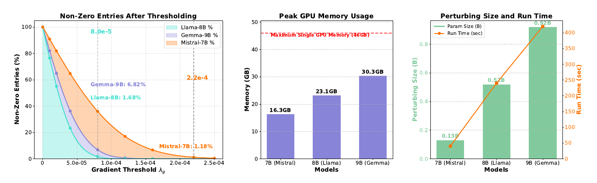
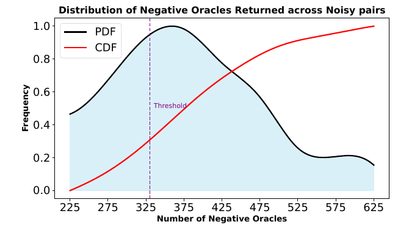

# A Zeroth-Order Paradigm for LLM Preference Alignment

## 核心信息与阅读结论

- **作者**：Peter Chen、Xi Chen、Wotao Yin、Tianyi Lin；署名机构包括 UC Berkeley、NYU、Alibaba DAMO Academy 与 Columbia University。
- **分析版本**：本地 39 页 PDF，首页标记 arXiv:2609.19144v1、16 Sep 2026、Preprint. Under review。正文称其为 NeurIPS 2025 ComPO 的期刊扩展版；不能据此认定已经期刊录用。
- **日期口径**：arXiv v1 提交于 2026-09-16 17:59:35 UTC，即北京时间 2026-09-17 01:59:35；本工作区入库日期及本次精读日期均为 2026-10-04。[版本记录](https://arxiv.org/abs/2609.19144v1)
- **主要来源**：[原始 PDF](../../../01-raw/2026-10/A_Zeroth_Order_Paradigm_for_LLM_Preference_Alignment.pdf)、[解析正文](../../../02-markdown/2026-10/A_Zeroth_Order_Paradigm_for_LLM_Preference_Alignment.md)。摘要、公式、表格和证明以本地 PDF 为准，修正解析中的连字丢失及表格错位；未混用会议版摘要。
- **论文类型**：理论算法与实证方法混合型。已阅读正文、附录 B 的证明和附录 C 的案例；未运行模型训练、评测或作者代码。
- **近邻核验**：查阅五篇原始论文及作者代码页面，访问日期为 2026-10-04。OpenReview PDF 遇到浏览器验证，会议版对照改用 arXiv:2505.05465v2 原文。
- **学术价值**：5.0/10，中置信度。主要价值是将低 margin 偏好对重新用作比较反馈，以及揭示可研究的多目标几何；证据尚不能把实际算法与理论保证完整连接起来。
- **阅读决策**：结合项目配置中的“大模型优化器设计、梯度裁剪、状态内存、随机梯度理论”，建议**选读**，重点读 §3、附录 B 与表 4–6。具体在研课题尚不明确；若研究比较反馈或零阶后训练，应升为精读。

> **最重要的判断：** ComPO 是有实验收益的稀疏后训练补丁。离线收敛结论依赖非常强的标量目标兼容假设；在线性能界依赖额外覆盖与奖励误差条件，并不证明实验实现会收敛或满足真实 KL 约束。

## 一句话贡献

对参考模型难以区分的偏好对，ComPO 用“好回答概率上升且坏回答概率下降”的扰动比较信号构造稀疏方向，作为 DPO/SimPO 的补充；扩展版再用当前策略生成的无标签数据调节步长，并为一个独立的、精确检查 KL 的理想算法建立条件性能界。

## 摘要翻译

### 英文摘要：论文原文，完整转录

以下与本地 PDF 第 1 页摘要逐句核对，仅合并排版换行与断词。

Direct preference alignment methods are widely used to align large language models (LLMs) with human preferences because of their computational and memory efficiency. However, likelihood displacement motivates alternative ways to extract information from preference pairs with small likelihood margins. In this paper, we propose and analyze Comparison-based Preference Optimization (ComPO), a zeroth-order alignment method based on comparison oracles. ComPO extracts directional information from these pairs without directly optimizing a differentiable preference loss on them. We establish a convergence guarantee for its basic offline scheme under smoothness, gradient sparsity, and compatibility between the oracle and a latent objective. We further introduce online ComPO, which retains the offline comparison mechanism and uses unlabeled policy generations for reverse-KL control relative to a reference policy. Following the coverage perspective of preference fine-tuning, we establish a performance guarantee for a basic constrained scheme under local coverage and in-distribution pairwise reward accuracy. Experiments on Mistral, Llama, Gemma-2, Qwen3, and Gemma-3 models demonstrate improvements over existing direct alignment methods, including length-controlled win rates, with pair-level diagnostics providing evidence consistent with mitigating likelihood displacement.

### 中文翻译：逐句对应

1. 由于计算和内存效率较高，直接偏好对齐方法被广泛用于使大语言模型（LLM）与人类偏好对齐。
2. 然而，似然位移促使人们寻找其他方式，从似然差距较小的偏好对中提取信息。
3. 本文提出并分析了基于比较的偏好优化（Comparison-based Preference Optimization，ComPO），这是一种基于比较 oracle 的零阶对齐方法。
4. ComPO 从这些偏好对中提取方向信息，而不直接针对它们优化可微的偏好损失。
5. 在平滑性、梯度稀疏性，以及 oracle 与某个潜在目标相兼容的条件下，我们为其基本离线方案建立了收敛保证。
6. 我们进一步引入在线 ComPO，它保留离线比较机制，并利用策略生成的无标签样本，相对于参考策略进行反向 KL 控制。
7. 沿用偏好微调的覆盖视角，我们在局部覆盖和分布内成对奖励准确性的条件下，为一个基本约束方案建立了性能保证。
8. 在 Mistral、Llama、Gemma-2、Qwen3 和 Gemma-3 模型上的实验显示，相对于现有直接对齐方法存在改进，包括长度控制胜率的改进；偏好对级诊断提供了与缓解似然位移相一致的证据。

### 核心要点提炼：分析者的理解

问题不是“所有偏好标签都有噪声”，而是参考模型给两条回答的序列似然差距较小。本文将这样的子集称为 noisy；这不是标签错误的判定。技术选择是把它们转换成关于附近参数扰动的二值反馈，而不继续优化同一种 margin 损失。实际算法只搜索输出层，再裁剪估计方向中的小坐标。

结果最稳定的部分是若干配置的 AlpacaEval 2 长度控制胜率改善；并非所有任务指标提高。理论分别回答“在可标量化 oracle 下能否找到潜在目标的近似驻点”和“在 KL 可行域及局部覆盖下，奖励误差如何约束策略性能”，没有证明这两条链在真实 LLM 中同时成立。重点待核验的是：oracle 的可标量化程度、增益相对同预算额外训练的净值，以及在线实现的真实序列 KL。

## 研究背景、任务与成功判据

### 为什么增大偏好 margin 仍可能损害好回答

给定提示 $x$ 与偏好对 $(y^+,y^-)$，DPO 使用参考策略修正后的 log-likelihood margin。用 $M_\theta$ 表示论文式 (1) 中 sigmoid 的输入：

$$
M_\theta=\beta\log\frac{\pi_\theta(y^+\mid x)}{\pi_{\mathrm{ref}}(y^+\mid x)}
-\beta\log\frac{\pi_\theta(y^-\mid x)}{\pi_{\mathrm{ref}}(y^-\mid x)}.
$$

损失是 $-\log\sigma(M_\theta)$。提高 $M_\theta$ 不要求好回答的绝对概率上升：两者一起下降，坏回答下降更多，同样能改善损失。本文 §2.1 将这一现象与 likelihood displacement 联系起来。概率还可能转移给训练对以外的回答，因此“相对排序更好”不等价于“采样行为更好”。

也不能把好回答概率下降一概认定为坏事。更好的第三种回答可能获得概率质量。本文提供的局部双条件是设计准则，而不是完整的人类效用定义；它会排除某些合理的泛化方向，也没有直接检查其他回答的质量。这是解释实验时必须保留的边界。

### 本文输入、输出与操作范围

输入包括已有 SFT/对齐 checkpoint、离线偏好数据、参考策略以及扰动与门控超参数。输出是更新后的参数；主要实验冻结主干，只修改完整 lm_head 中部分坐标。在线版还接收提示分布 $P_{\mathrm{on}}$，从当前策略采样回答，但不为这些回答获取新偏好标签。

参考策略用来按式 (10) 划分数据。若两个回答的序列 log-likelihood 差距绝对值不超过 $\delta_{\mathrm{margin}}$，就进入低 margin 子集。正文采用阈值 3。这个定义受回答长度、参考模型和 tokenizer 影响，不能直接等同于语义相似、CHES 高分或标签不可靠。本文表 1 也表明，仅过滤低 margin 对并不稳定提高 DPO。

合理的成功判据至少有三个：在固定 checkpoint 上改善未见提示的评测；在同训练/查询预算下优于更简单的继续训练；降低具有负面行为后果的位移，而不是仅改善已用偏好对的似然。本文对第一个提供了一定证据，对后两个还缺直接对照和系统测量。

## 方法主线：从比较反馈到稀疏后训练

### 流程及四种算法的关系

论文没有独立的方法架构图。下图是分析者依据 §3 和算法 1–4 绘制的流程；原始实验图见后文。

~~~mermaid
flowchart TD
    A[离线偏好对与参考模型] --> B[按参考似然差距划分]
    B --> C[普通偏好对使用 DPO 或 SimPO]
    B --> D[低 margin 偏好对]
    C --> E[已有对齐模型]
    E --> F[冻结主干 扰动输出层]
    D --> G[检查好回答上升与坏回答下降]
    F --> G
    G --> H[聚合二值信号 归一化 裁剪小坐标]
    H --> I[成功比例门控]
    I --> J[稀疏参数更新]
    E --> K[在线版从当前策略生成无标签回答]
    K --> L[计算长度归一化 log-ratio]
    L --> M[阻尼步长]
    M --> J
    I --> N[记录通过门控的偏好批次]
    N --> D
~~~

离线实际版是算法 2。算法 1 则固定比较集合、搜索全部参数、精确求解稀疏估计问题，是定理 3.2 的对象。在线实际版算法 4 加入步长阻尼和偏好批次重放；算法 3 对候选策略做精确序列 KL 检查，是定理 3.4 的对象。不要把编号不同的方案当成有相同保证的实现细节。

### 比较 oracle：局部双条件而非奖励查询

对固定非空集合 $S$，式 (8) 分别计算好回答和坏回答的平均 log-likelihood 变化：

$$
\Delta_S^+(\theta,\theta')=
\frac{1}{\lvert S\rvert}
\sum_{(x,y^+,y^-)\in S}
\left(\log\pi_{\theta'}(y^+\mid x)-\log\pi_\theta(y^+\mid x)\right).
$$

$$
\Delta_S^-(\theta,\theta')=
\frac{1}{\lvert S\rvert}
\sum_{(x,y^+,y^-)\in S}
\left(\log\pi_{\theta'}(y^-\mid x)-\log\pi_\theta(y^-\mid x)\right).
$$

定义 3.1 将同时满足 $\Delta_S^+>0$ 与 $\Delta_S^-<0$ 的候选标为 $-1$，其余全部标为 $+1$。这里 $-1$ 表示成功扰动。单对样本要求这对回答分别改善；mini-batch 情形只要求平均改善，可能掩盖个别样本恶化。

区别于人类比较反馈，oracle 直接计算模型对既有标签回答的似然。它没有向人类询问新策略是否更好，也没有评估新生成回答。它把两个数值压成一个 bit，避免定义显式偏好损失，但并不因此自动获得关于真实奖励的无偏梯度信息。

### 理论方向：一位压缩感知的稀疏恢复

算法 1 在单位球面采样 $m$ 个方向 $z_i$，比较 $\theta_t$ 与 $\theta_t+r z_i$，得到标签 $y_i$。若 oracle 真是某个平滑标量函数的比较 oracle，小半径下标签近似于该函数梯度的投影符号。式 (9) 求解：

$$
\hat g_t=
\arg\max_{\Vert g\Vert_1\le\sqrt{s}, \Vert g\Vert_2\le1}
\sum_{i=1}^{m}y_i z_i^\top g.
$$

$\Vert g\Vert_1$ 约束控制有效稀疏度；二范数约束控制尺度。一位反馈无法恢复梯度幅值，目标是归一化梯度方向。更新为 $\theta_{t+1}=\theta_t-\eta\hat g_t$，方向符号与“成功标签为负”的约定一致。这不是逐坐标 SignSGD；它从随机方向的一位测量重建整个更新方向。

### 实际方向：输出层限制、归一化与两个阈值

算法 2 将参数分成冻结主干 $\bar\theta$ 与输出层 $\theta^o$。它不求解式 (9)，而计算：

$$
u_t=\sum_{i=1}^{m}y_i z_i,
\hat g_t^o=\frac{u_t}{\Vert u_t\Vert_2}.
$$

当 $u_t=0$ 时设估计为零。随后将绝对值小于 $\lambda_g$ 的坐标置零；按伪代码，裁剪后不再次归一化。记 $k_t$ 为成功扰动数量，$p_t=k_t/m$。只有 $p_t>\lambda$ 时更新：

$$
\theta_{t+1}^o=\theta_t^o-\gamma p_t\hat g_t^o.
$$

两个阈值作用不同：$\lambda_g$ 控制保留坐标，$\lambda$ 决定本次是否更新。成功比例还缩放步长。裁剪会改变方向和范数，因此实际步长由 $\gamma$、$p_t$ 与剩余方向范数共同决定。仅报告 $\gamma$ 不足以描述更新强度。

该实现省去全模型反向传播、逐方向长期存储与精确稀疏求解。但所有扰动仍覆盖整个输出层；“最终只更新约 1% 坐标”不等于“每次查询只搜索这 1%”。每个比较需要计算偏好批次的前向似然，一次迭代可能有 1600–1800 次候选查询。流式累加空间随输出层维数增长，算术和前向成本也不会仅因理论中的对数维度项消失。

### 与理论算法的差异有多实质

固定 $S$ 换成变化的 $S_t$，一般就换了 oracle；即便每个批次可对应一个目标，也没有证明它们共有同一个 $f$。同时，限制到输出层、用归一化总和替代约束优化、裁剪、成功率门控和重放选择，都改变了定理算法。不能用实验上增加 $m$ 后分数变好，作为算法 2 满足定理 3.2 的验证。

## 离线理论：证明了什么，以及缺了哪座桥

### 定理 3.2 的假设与量级

对固定集合 $S$，存在下有界、$\ell$-smooth 的函数 $f$，并满足两个关键条件：

- 对任意两组参数，偏好 oracle 返回 $-1$ 当且仅当 $f(\theta')<f(\theta)$，否则返回 $+1$。
- 全域梯度可压缩：$\Vert\nabla f(\theta)\Vert_1\le\sqrt{s}\Vert\nabla f(\theta)\Vert_2$。

令 $\Delta$ 上界初始目标差距。定理取：

$$
T=\left\lceil\frac{10\ell\Delta}{\epsilon^2}\right\rceil,
\eta=\sqrt{\frac{2\Delta}{\ell T}},
r=\frac{\epsilon}{40\ell\sqrt d}.
$$

$$
m=\left\lceil c_m
\left(s\log\frac{2d}{s}+\log\frac{2T}{\Lambda}\right)
\right\rceil.
$$

独立重采样并精确求解式 (9) 后，以至少 $1-\Lambda$ 的概率，前 $T$ 次迭代中存在梯度范数小于 $\epsilon$ 的点。它是 **best-iterate 近似驻点保证**，不是最后一次迭代最优性、泛化性能或人类偏好保证。

总比较次数的主量级是 $T$ 乘以上式的 $m$。当 $s$ 固定时，环境维数只以对数形式进入查询数；但 $r$ 仍按 $1/\sqrt d$ 缩小，每次处理方向仍有维度成本。若有效稀疏度随 $d$ 成比例增长，查询数也不会保持纯对数维度依赖。正文图 1 的裁剪后稀疏率，不能验证潜在目标真实梯度的可压缩性。

### 附录 B 的证明链

第一步是用平滑性控制 Taylor 余项：

$$
\left|f(\theta+r z)-f(\theta)-r z^\top\nabla f(\theta)\right|
\le\frac{\ell r^2}{2}.
$$

引理 B.2 在梯度范数大于 $\epsilon/2$ 时，将可能翻转的标签限制在与梯度几乎正交的窄带。命题 B.1 再利用球面对称性，使理想符号测量的均值沿归一化梯度方向；窄带内标签可依赖采样方向，证明仍控制这种偏差。经验波动通过稀疏支撑网与统一集中界处理，得到方向误差不超过 $1/2$。

引理 B.3 对历史条件化，避免把自适应迭代点误当成与全部样本独立；每轮新采样后再做 union bound。方向误差界保证内积至少为梯度范数的一半，于是：

$$
f(\theta_{t+1})
\le f(\theta_t)-\frac{\eta}{2}\Vert\nabla f(\theta_t)\Vert_2
+\frac{\ell\eta^2}{2}.
$$

求和得到：

$$
\min_{1\le t\le T}\Vert\nabla f(\theta_t)\Vert_2
\le\frac{2\Delta}{\eta T}+\ell\eta
=\sqrt{\frac{8\ell\Delta}{T}}.
$$

定理的 $10$ 倍常数给出所需精度余量。沿这一链检查，主要估计和下降逻辑在所列假设下相互吻合。命题 B.1 的证明存在 A/B 与 b/C 的符号切换、常数 $a$ 未显式先定义的排版问题；按上下文取 $a=1/40$ 可跟随主界，仍应核对源码，不能把本文审读当成正式证明认证。

### 兼容假设不是由 oracle 定义推出的：三策略反例

这是分析者根据定义 3.1 与定理 3.2 构造的反例，不是作者实验结果。固定同一个提示和偏好对，令三种策略的 log-likelihood 为：

| 策略 | 好回答 log-likelihood | 坏回答 log-likelihood |
|---|---:|---:|
| A | -3 | -3 |
| B | -2 | -4 |
| C | -1 | -2 |

三行均可实现为合法三响应分布：好、坏回答概率分别是对应数值的指数，其余概率分配给第三个响应，且均为正。

B 相对 A 同时满足好回答上升、坏回答下降，因此必须有 $f(B)<f(A)$。C 与 A 的两个似然都上升，没有任一方向满足双条件：两个方向的 oracle 都为 $+1$，标量兼容性遂要求 $f(C)=f(A)$。同理，C 与 B 两个方向都不成功，要求 $f(C)=f(B)$。三者矛盾。

所以这种“严格同时改善两个量”的 Pareto 比较关系，一般不能表示成一个完整标量顺序。反例只否定“定义自动蕴含兼容性”，不否定定理在额外假设下的逻辑，也不证明实际 checkpoint 必然包含这三种策略。它却明确说明：论文需要验证策略类和比较集合具有什么额外结构，才能把抽象收敛定理应用到实际 LLM。

局部几何也指向同一问题。令两个平均似然梯度为 $a$ 和 $b$，成功扰动要求 $a^\top z>0$ 且 $b^\top z<0$，通常是两个半空间的交。标量函数的一阶下降区域是单个半空间。除非出现特殊梯度关系或限制可查询方向，两者不能直接等同。实际 signed-sum 可以是有用的多目标改进方向，却未必是所声称潜在函数的梯度估计。

## 在线扩展：可行性、性能界和实践之间的距离

### 理论对象是候选策略的精确序列 KL

式 (3) 对提示分布和整条响应定义反向 KL：

$$
D_{\mathrm{RKL}}(\pi\Vert\pi_{\mathrm{ref}})
=\mathbb{E}_{x\sim P_{\mathrm{on}},,y\sim\pi(\cdot\mid x)}
\left[\log\frac{\pi(y\mid x)}{\pi_{\mathrm{ref}}(y\mid x)}\right].
$$

算法 3 先形成候选参数，再精确评估候选策略的 KL；不超过 $\tau$ 就接受，否则保留原策略。从可行点出发保持可行性，是这个接受/拒绝规则直接给出的归纳结论。它没有回溯搜索，也没有保证每轮可以接受非零更新；在边界上可以反复拒绝。

定义 2.2 另要求 KL 邻域内每个策略的逐提示、逐响应密度比不超过统一常数 $C_\tau$。KL 是平均信息量；密度比是点态最坏值。前者有限不蕴含后者小或有限。稀有响应的概率质量略微增加，就可能产生巨大比例。对无限序列支持上的不受限策略类，若参考概率可以任意小，甚至不必存在统一有限常数；有最大长度的有限支持或受限策略类也需要实际核算常数。论文 §2.3 已明确承认覆盖是额外假设，但没有在 LLM 实验中估计它。

### 定理 3.4 是奖励误差到性能差距的转换

式 (5) 定义真实奖励减去 KL 正则的总体目标 $J_\beta$，式 (6) 定义策略的隐式奖励：

$$
\hat r_\pi(x,y)=\beta\log\frac{\pi(y\mid x)}{\pi_{\mathrm{ref}}(y\mid x)}.
$$

式 (7) 的误差比较真实奖励差与隐式奖励差。两个响应独立来自参考策略，而不是任意 UltraFeedback 偏好对。记这一均方误差为 $\mathrm{err}(\pi)$。局部覆盖与可行性下：

$$
\sup_{\pi\in\Pi_\tau}J_\beta(\pi)-J_\beta(\pi_{\theta_t})
\le C_\tau\sqrt{\mathrm{err}(\pi_{\theta_t})}.
$$

附录 B.3 用 $e=r^\star-\hat r_{\pi_{\theta_t}}$ 展开目标差，得到残差期望减去一个非负的策略间 KL 项。丢弃该项后应用 Cauchy–Schwarz；比较策略与当前策略的两个密度比相乘，二阶矩最多放大 $C_\tau^2$，开平方后得到上式。

这个推导基本是对**任意可行策略**的误差—性能关系，方向估计如何得到并不是证明的核心。论文没有证明算法 3 使 $\mathrm{err}$ 随迭代下降；也没有将定理 3.2 的潜在目标 $f$ 与这里的真实奖励 $r^\star$ 建立关系。故不能串成“离线驻点保证 + 在线界 = 收敛到最优人类偏好策略”。在 $C_\tau$ 很大或奖励误差未知时，界还可能没有实际判别力。

### 算法 4 用的是长度归一化、当前策略统计

式 (13) 在真正从当前策略采样时，是当前策略序列 KL 的无偏估计。实践改成式 (14)：

$$
\hat d_t=\frac{1}{B}\sum_{j=1}^{B}
\frac{\log\pi_{\theta_t}(\tilde y_j\mid\tilde x_j)
-\log\pi_{\mathrm{ref}}(\tilde y_j\mid\tilde x_j)}
{\max\{1,\lvert\tilde y_j\rvert\}}.
$$

除以响应长度会改变总体量；它不必非负，不能叫真实序列 KL 的无偏估计。式 (15) 只降低步长：

$$
\gamma_t=\frac{\gamma}{1+\rho\max\{\hat d_t-\tau_p,0\}}.
$$

当前策略统计无法保证更新后的候选仍可行；软阻尼也没有拒绝更新。因此 $\tau_p$ 不等于理论约束半径 $\tau$。采样温度、截断、停止条件还会改变实际生成分布，需确保与所计算策略概率的定义一致；这属于复现核验项，本文没有展示相关误差审计。

### 重放改善经验指标，但不是已证明的方差缩减

算法 4 每 $n$ 轮替换缓存，缓存只保留上一块中通过成功率门控的偏好 mini-batch；以概率 $\alpha$ 重访，否则取新低 margin 批次。每次重访重新采扰动，不重用旧方向。论文在线实验使用 $n=50$。

“成功”仅代表过去某点通过门控，既不保证当前还有效，也不保证长期奖励改善。缓存引入了样本选择偏差，在线生成数据则只改步长，两者角色不同。表 10 的联合收益不足以证明重放降低了估计方差，需要独立的 replay-only 对照和方向方差测量。

## 实验设置与结果核算

### 数据、checkpoint 和评测口径

§4.1 使用 UltraFeedback，借用 SimPO 工作采用的 SFT/指令模型初始化。DPO 与仅 clean 对的 DPO 都训练一轮；随后 ComPO 在低 margin 对上做 100 次迭代，正文称只用前 100 对。该说法不等于随机抽样覆盖全体 noisy 数据；选择顺序、完整子集规模及训练去重名单应在复现中明确。

| 项目 | 本文已报告的设置 | 尚需核验的信息 |
|---|---|---|
| 离线模型 | Mistral-7B Base/Instruct、Llama-3-8B Base/Instruct、Gemma-2-9B-it | 各 checkpoint 的固定 revision |
| 后加的在线模型 | Qwen3-4B-Base、Llama-3.2-3B-Instruct、Gemma-3-4B-it | 独立在线提示池、生成协议 |
| 训练数据 | UltraFeedback；margin 阈值 3 | clean/noisy 总数、前 100 对 ID、污染与去重审计 |
| Mistral 默认 | 扰动半径 0.0005；1600 扰动；坐标阈值 0.00022；门控 0.2 | 基线等预算调参 |
| Llama/Gemma-2 默认 | 半径 0.00075；1800 扰动；坐标阈值 0.00008；门控 0.2 | 参数缩放与数值精度一致性 |
| 硬件 | 所有 ComPO 实验使用 30 张 A40，每张报告 46 GB | 全程 GPU 小时、通信与生成成本 |

AlpacaEval 2 报告 raw win rate（WR）与 length-controlled win rate（LC）；旧模型评测以 GPT-4 Turbo 为参考和裁判。Arena-Hard 的旧模型参考为 GPT-4-0314、裁判为 GPT-4 Turbo；表 5、7、8 改用 GPT-4.1 的 Arena-Hard 裁判，表 10 使用 GPT-4.1 配置。MT-Bench 报告 10 分制的两轮分数与均值，不能与百分比胜率混算。

标准评测规模为 AlpacaEval 2 的 805 个提示、Arena-Hard 的 500 个提示、MT-Bench 的 80 个问题。这是从本文沿用的 [SimPO 原文 §3、表 2](https://arxiv.org/html/2405.14734v2#S3) 核对的标准协议规模；本篇没有展示逐条评测清单，故不能据此证明所有样本实际完成或版本完全一致。

### 离线主结果：LC 一致改善，其他指标存在负例

以下重排本文表 1；胜率差是同一模型、同一评测内的**百分点**，不是相对百分比。参照 DPO 全数据基线可观察总体补丁效果，参照 DPO-clean 才更接近第二阶段的增量。

| 模型 | DPO LC (%) | DPO-clean LC (%) | clean+ComPO LC (%) | 比 DPO 的 LC 差 | DPO Arena-Hard WR (%) | clean+ComPO Arena-Hard WR (%) |
|---|---:|---:|---:|---:|---:|---:|
| Mistral-7B-Base | 9.71 | 9.41 | 11.66 | +1.95 | 2.9 | 3.2 |
| Mistral-7B-Instruct | 24.14 | 23.89 | 26.17 | +2.03 | 14.4 | 10.5 |
| Llama-3-8B-Base | 4.14 | 4.28 | 5.39 | +1.25 | 12.1 | 12.1 |
| Llama-3-8B-Instruct | 32.59 | 32.92 | 35.79 | +3.20 | 22.9 | 23.1 |

例如 Llama-Instruct 的相对 LC 增幅是 $(35.79-32.59)/32.59=9.82\%$，但通常报告 +3.20 个百分点更易比较。相对其 clean checkpoint 的 LC 增量是 +2.87 点；两种口径不能混用。

Mistral-Instruct 在 Arena-Hard 上下降 3.9 点，相对下降约 27.1%。正文记录平均响应长度从 513 变成 468，约缩短 8.77%，但没有在该段明确给出长度单位，不能擅自写成词或 token。作者提出裁判偏长可能解释分数下降；这只是竞争解释，不排除内容质量下降。LC 的提高本身也不证明回答更短。

MT-Bench 的 Mistral-Instruct 均值从 5.86 升到 7.69，而 Mistral-Base 从 5.79 降到 5.77。这既显示模型异质性，也提示一个大幅收益需要原始逐提示结果和重复种子验证。表 1 是点估计，不能用某个消融的误差条给整张主表补上统计显著性。

### 强 checkpoint 上的 SimPO 补丁更接近实际用途

本文表 3 用已有 SimPO checkpoint 加 ComPO，省去重新训练 clean 阶段。以下均来自同表，差值按列直接相减：

| 模型 | SimPO LC (%) | +ComPO LC (%) | LC 差（百分点） | Arena-Hard WR 变化 | MT-Bench 均值变化 |
|---|---:|---:|---:|---|---|
| Mistral-7B-Instruct | 40.22 | 42.27 | +2.05 | 20.8 → 22.0 | 7.62 → 7.64 |
| Llama-3-8B-Instruct | 48.71 | 49.53 | +0.82 | 36.3 → 37.3 | 7.66 → 7.70 |
| Gemma-2-9B-it | 60.36 | 62.42 | +2.06 | 61.1 → 61.1 | 8.77 → 8.79 |

这支持“能作为另一种对齐方法的后续修补”，而不是“替代 SimPO”。0.02–0.04 分的 MT 均值增益没有重复评测置信区间，不能断言稳健提高。表 8 还报告直接从全数据 DPO checkpoint 加补丁：Mistral-Instruct 的 LC 24.14 → 27.03，增加 2.89 点。它使用不同 Arena-Hard 裁判，不能把该表 11.40 与表 1 的 14.4 混成同协议下降。

### 对偏好对的诊断是局部 sanity check

表 2 的 Llama-Instruct 首次试验从 $(-46.761,-47.410)$ 变到 $(-46.728,-47.520)$。好回答 log-likelihood 增加 0.033，坏回答减少 0.110；对应似然倍率约为 1.034 与 0.896。Gemma 的若干结果变化接近三位小数的报告精度，甚至不变。

三次扰动试验说明选定训练对能按设计方向变化，但样本极少，且用的正是构造更新信号的回答。没有说明全体未见偏好对的下降比例，更没有测量第三类回答、拒答率或真实奖励。因此它是机制符合设计的局部证据，不能单独确立因果性的位移治理。

### 消融：查询数、裁剪、层数和样本数

| 对照 | 本文数值 | 同口径差异 | 可以支持的结论与边界 |
|---|---|---|---|
| 表 4，扰动 800 → 5400 | WR 17.32±0.86 → 19.69±0.36；LC 24.72±1.02 → 26.49±0.81 | WR +2.37 点；LC +1.77 点；查询数 6.75 倍 | 更多查询通常有益，收益低于成本增长；不能证明理论收敛 |
| 表 6，不裁剪 → 保留约 1% | LC 23.42±1.03 → 25.91±0.95 | +2.49 点 | 稀疏化对该模型重要；不等于真实梯度就是稀疏的 |
| 表 6，保留 6% vs 1% | LC 26.06±0.81 vs 25.91±0.95 | 6% 高 0.15 点 | 无证据宣称 1% 是通用最优阈值 |
| 表 5，一层 → 三层 | LC 25.02±0.91 → 26.00±0.89 | +0.98 点 | 搜索更多层可有益，变化小于两组标准差量级 |
| 表 7，100 → 300 对 | LC 25.91±0.95 → 26.28±0.81；AH 11.02±0.13 → 11.76±0.30 | LC +0.37 点；AH +0.74 点 | 更多低 margin 对可带来增益，不证明全面数据扩展规律 |

表 4–6 明确采用五次运行均值、标准差，并在括号列最佳运行；表 7 的 caption 写均值和标准差，但未在该 caption 单独给出运行次数。标准差不是均值置信区间，也不覆盖裁判随机性。主表中 Mistral-Instruct 的 26.17 恰与表 4 的 1600 扰动最佳运行值一致；只能指出统计口径需要核验，不能据此认定全部主结果经过挑选。

表 6 在保留 0.15% 坐标时 LC 降为 23.82，说明“越稀疏越好”不成立。阈值是在归一化方向上定义，维数、扰动分布和归一化实现变化都可能改变合适数值。更自然的可迁移对照是保留固定比例、相对幅值或控制裁剪后的方向偏差，而不是跨模型直接套绝对阈值。

### 原图与资源解释

> 图 1：从本地 PDF 第 17 页直接渲染并裁剪。左图记录阈值后的稀疏率；中图单张 A40 的峰值为 16.3、23.1、30.3 GB；右图是 30 张 A40 完成 600 个扰动的 wall-clock 时间。图像出处与提取信息见 [图片来源](images/_sources.md)。

Mistral 输出层约 0.13B 参数，保留 1.18% 约为 153 万参数，约占完整 7B 的 0.0219%。这有部署/存储意义，但扰动和方向累加仍处理完整输出层。稀疏更新也不会减少推理时完整模型的基本权重存储。

本文拿 Llama 的 A40 ComPO 峰值约 23 GB，与 H100 上 DPO 的 77 GB、SimPO 的 69 GB 作描述性比较。它表明无需承受某些全模型反传配置的单卡峰值，不能当作固定硬件、精度、batch 与并行策略下的严格资源排名。30 张卡的总资源、通信以及在线采样也必须计入成本。

表 5 的一层与三层搜索，峰值为 16.3 → 16.7 GB；600 扰动耗时为 50 → 60 秒，分别约增加 2.45% 与 20%。右图的近似线性关系只有三个模型点，模型架构与词表大小也同时变化；不能独立推出只由参数维数决定的普适 scaling law。

> 图 2：从同一 PDF 页提取；虚线切掉成功比较数量较少的尾部。表 9 对十个偏好对的八次运行给出成功计数均值和标准差，可支持门控信号有一定重复性，不能直接证明更新方向正确或筛出的样本更有价值。

### 在线扩展：收益较小但方向一致，需要独立机制对照

本文表 10 的三个指标依次是 AlpacaEval LC、AlpacaEval WR、Arena-Hard WR。以下只比较同一表的离线、阻尼、阻尼加重放，全部为百分比：

| 模型 | 离线 ComPO | 加在线阻尼 | 阻尼加重放 |
|---|---|---|---|
| Qwen3-4B-Base | 16.20 / 16.27 / 30.8 | 17.43 / 17.74 / 31.4 | 18.57 / 17.95 / 32.6 |
| Llama-3.2-3B-Instruct | 12.35 / 12.50 / 11.9 | 12.70 / 13.23 / 12.4 | 13.05 / 13.85 / 12.8 |
| Gemma-3-4B-it | 40.00 / 58.57 / 57.7 | 42.07 / 60.40 / 63.3 | 42.55 / 60.93 / 63.7 |

在线阻尼相对离线的 LC 增量分别为 1.23、0.35、2.07 点；再加重放分别为 1.14、0.35、0.48 点。Gemma 的 Arena-Hard 阻尼增量 5.6 点较突出，其他模型对应仅 0.6、0.5 点。收益并不按模型统一缩放。

表中没有重复种子方差、真实序列 KL 轨迹、同预算 HyPO、纯 replay 对照或仅固定降低学习率的对照。因此最强结论是“该复合流程在已报配置上分数更高”，还不能把改进分别归因于 KL 控制、方差缩减或覆盖改善。正文 §4.3 已主动说明实现没有执行定理的硬约束，这是优点；读者仍须避免将其命名当成已测量的机制。

### 失败案例与未覆盖行为

附录 C 只有少量定性输出：加警示前言不能证明更安全；把内容列成优缺点不能证明更准确；预算问题两种输出都只是给出相同关系，不能证明数学能力增强。作者在附录开头也这样限定它们。本文没有系统安全 benchmark、数学准确率、跨领域保留能力或第三类响应概率流向审计。对这些用途，现有证据应标为“未验证”。

## 主张—证据—限制矩阵

| 主要主张 | 证据位置 | 能支持的最强结论 | 竞争解释或限制 | 置信度 |
|---|---|---|---|---|
| 比较反馈可以给出离线收敛保证 | 定理 3.2；命题 B.1、引理 B.2–B.3 | 固定 oracle、兼容标量目标、可压缩梯度下，理论算法存在近似驻点 | 兼容性不由定义推出；实际算法不精确解稀疏问题 | 条件推导中；实际适用性低 |
| 低 margin 对仍能改善已有对齐模型 | 表 1、3、8 | 多个 checkpoint 的长度控制胜率提高 | 额外训练预算、坐标裁剪、样本选择也能解释部分收益 | 中 |
| 能缓解有害的似然位移 | 表 2；附录 C | 极少量训练对的似然变化符合设计 | 无总体奖励、安全行为或未见对诊断；概率可流向第三类回答 | 局部高；总体低 |
| 在线样本带来 KL 控制下的性能保证 | 定理 3.4、附录 B.3；式 (14)–(15) | 理想算法保持可行；奖励误差在覆盖下控制性能差距 | 实际版不执行候选精确 KL；误差下降未证明 | 条件界中；实践桥接低 |
| 内存与稀疏参数更新有实际优势 | 图 1、表 5 | 报告的 A40 配置可以较低单卡显存运行 | 30 卡、上千查询；跨硬件 baseline；缺 GPU 小时对照 | 中 |

## 最接近工作与净增量

下列五篇均核对原始论文，不只转述本文 Related Work。横向分数只有在同模型、同 checkpoint 和同裁判时才可比较；未将不同论文的排行榜数字混用。

| 工作 | 共同问题 | 与本文的关键区别 | 对新颖性或归因的影响 |
|---|---|---|---|
| ComPO 会议版，Chen 等，2025 | 比较反馈与稀疏后训练 | 已有离线 oracle、方向估计和主要旧模型实验 | 2026 版新增重点是在线扩展与新模型 |
| SCOBO，Cai 等，2022 | 从一位比较恢复方向 | 分析可压缩梯度的凸/受限强凸目标及带噪 oracle | 稀疏一位恢复不是本文原创 |
| HyPO，Song 等，2024 | 无标签在线数据与离线偏好混合 | 对显式 DPO 与在线 KL 正则做梯度更新 | 在线生成作正则不是本文首次提出 |
| Likelihood displacement，Razin 等，2025 | 位移原因与数据几何 | CHES 诊断、过滤和安全行为验证 | 低 margin 不能直接代替 CHES |
| SimPO，Meng 等，2024 | 高效偏好训练 | 长度归一化显式奖励、目标 margin、无需参考策略 | 本文是增量补丁，需同预算继续训练对照 |

### 1. ComPO: Preference Alignment via Comparison Oracles

会议版 §3 已包含输出层扰动、归一化 signed-sum、坐标裁剪、成功率缩放，以及低 margin 数据划分。因而 2026 扩展版不能把这些再计作独立新发明；其新增对象是在线约束/阻尼、重放和 Qwen3/Gemma-3 等评测。扩展版还更明确地区分条件定理与实践。对前版的文字澄清有价值，但不等于新的离线查询复杂度突破。[会议版原文](https://arxiv.org/html/2505.05465v2)

### 2. A One-bit, Comparison-Based Gradient Estimator（SCOBO）

原文 §1.1、§3–5 已将比较投影与一位压缩感知结合，使用梯度可压缩条件并分析凸、受限强凸目标及带噪比较。本文将同一恢复框架用于偏好似然 oracle，并给出非凸驻点界。净增量在应用接口与条件分析；本文要求精确的潜在标量兼容性，不能说相对带噪 oracle 的前作“全面放宽假设”。[SCOBO 原文](https://arxiv.org/html/2010.02479v3)

### 3. The Importance of Online Data: Understanding Preference Fine-tuning via Coverage（HyPO）

HyPO §5、算法 1 已用离线数据计算 DPO 项、无标签当前策略样本计算 KL 正则并更新参数。本文改为比较方向加步长调节，理论借用覆盖到性能的路径。区别需要检验方向、硬约束或软阻尼的净值，而不能归于“首次使用无标签在线数据”。缺乏同预算 HyPO 对照，是在线增量归因的重要缺口。[HyPO 原文](https://proceedings.neurips.cc/paper_files/paper/2024/file/16c628ab12dc4caca8e7712affa6c767-Paper-Conference.pdf)

### 4. Unintentional Unalignment: Likelihood Displacement in Direct Preference Optimization

该文 §4–6 用 hidden-embedding 几何定义 CHES，并在位移与拒答行为上验证过滤。ComPO 用更廉价的序列 margin 分组，再尝试利用被过滤数据。两种分组并非同义；要确认净增量，应比较 CHES 过滤、CHES 分组加 ComPO、margin 分组加 ComPO，并测实际行为。现有主文未完成这组因果对照。[Razin 等原文](https://proceedings.iclr.cc/paper_files/paper/2025/file/3df38ca67befaed9c03b95ffee07d9f8-Paper-Conference.pdf)

### 5. SimPO: Simple Preference Optimization with a Reference-Free Reward

SimPO §2 用平均 token log-probability 构造无参考奖励，并加入目标 margin；其 §3 也是本文评测协议的重要来源。本文表 3 在已有 SimPO 上再训练，支持补充性而非替代性。应比较同额外预算的 SimPO、输出层一阶微调和 ComPO，才能排除“只是继续训练或只改输出层”的解释。[SimPO 原文](https://arxiv.org/html/2405.14734v2)

## 深度评价与适用范围

### 优势及值得借鉴的部分

最有用的贡献是改变低 margin 样本的处理方式：过滤后不必丢弃，可转换成局部更新判据。判据能接在不同 checkpoint 后，表 3、8 支持这一用途。算法用完整输出层搜索、稀疏提交更新的拆分，也为“方向估计与最终参数修改密度分别设计”提供了研究视角。

扩展版对证据边界的表达相当明确：LC 不代表直接缩短输出；训练对诊断不是总体保证；重放没有单独的方差缩减证明；实际 online 不在硬约束定理范围内。这些限定降低了误读风险，但限定本身不补足验证缺口。

附录 B 的一位估计证明允许窄带内错误依赖扰动方向，并对每轮历史条件化，这些步骤对研究带偏比较反馈有参考价值。需要迁移的是这段证明技术，而不是把其终结条件直接套到新的 LLM oracle。

### 实质问题与非致命局限

**实质的理论适用性问题**是潜在目标兼容性。前述反例足以否定它是一般双条件 oracle 的自然性质；未给出实际模型类满足条件的证据。故用该定理认证实际偏好对齐是不成立的推断。它还没有把驻点与奖励误差连接起来。

**实质的实证归因问题**是缺少同预算继续训练、输出层一阶法、CHES 与 HyPO 对照，以及真实 KL 和独立 replay 消融。它们不会把已报分数“变成不存在”，却可能把机制解释从新颖偏好几何改写为稀疏小步后训练。

**非致命局限**包括只测试中小规模模型、主要单训练数据源、主表缺误差条、少量行为案例、跨硬件内存比较、阈值依赖维度，以及没有公开本次运行的完整资产清单。条件界的排版符号错误需要修正，但目前没有证据认定它们推翻主要条件推导。

没有发现足以否定全部实验结果的泄漏证据，也没有执行独立复现。应将污染和运行可靠性标为尚未审计，而不是预先判有问题或判完全可靠。

### 适用与不适用场景

适合已有较强对齐 checkpoint、希望用少量偏好数据作局部修补、显存受限但能接受很多前向查询，并能严格控制评测预算的场景。若研究目标是比较反馈、稀疏方向与门控设计，本文尤其适合作为反证和新理论的起点。

不宜直接作为免调参优化器、全模型训练速度方案、具有安全保证的对齐方法，或已经证明满足 KL trust region 的在线算法。论文用了多个半径、阈值、步长和重放参数；“不用反向传播”并不自动带来参数自由、低总成本或隐私保证。

## 可复现性审计与最小验证计划

### 已有资源和代码对应关系

[作者仓库](https://github.com/PeterLauLukChen/ComparisonPO) 提供分布式脚本，README 将其标为 NeurIPS 2025 示例，并给出阈值等配置。它支持“有公开离线实现入口”，不证明 2026 在线扩展已完整可复现。README 中示例扰动数与正文默认值不同，必须逐项对齐。

静态查看 [compute_gradients.py](https://github.com/PeterLauLukChen/ComparisonPO/blob/main/compute_gradients.py) 的聚合段，除成功数量门控外，还先测试固定尺度 5 的候选再决定是否提交实际缩放更新；批次检查也应与论文平均变化 oracle 对齐。这是代码—伪代码核验点，不代表已经完成全仓库审计。页面取自主分支，未锁定 commit、未执行。

| 复现要素 | 当前证据 | 需要补齐的最低材料 |
|---|---|---|
| 模型与数据 | 名称、若干资源脚注、公开旧版实现 | checkpoint revision、tokenizer、样本 ID 与数据预处理 |
| 离线算法 | 算法 2、半径和阈值、旧版脚本 | 球面方向生成、扰动缩放、精度、代码附加门控 |
| 在线算法 | 算法 4；重放窗口 50；部分新模型参数 | 在线批量 B、rho、tau-p、alpha 的完整运行配置及 prompt 池 |
| 统计与评测 | 消融部分重复运行；主表点估计 | 种子、逐提示输出、裁判快照、置信区间、评测费用 |
| 系统成本 | A40 数量与若干峰值/耗时 | 全程 GPU 小时、在线生成、同步和通信成本 |

### 第一阶段：无需 GPU 的理论反证核验

用三个合法三响应策略复算双条件 oracle，在两个不可比较对上强制标量相等，检查与严格改善对的矛盾。该步骤已经做了数值合法性检查；它验证假设不普遍成立，不是对真实模型的实验反证。

进一步应在一个小型 softmax 模型上分析参数空间中的比较关系与局部方向，区分“具有 Pareto 改进”与“确有可优化标量势函数”。若只有多目标结构，停止继续将结果解释为定理 3.2 的实证验证，转向合适的多目标保证。

### 第二阶段：固定 checkpoint 的离线机制与预算对照

建议先选论文中的 Mistral-Instruct checkpoint，固定同一批 100 个低 margin 对和独立的至少 500 个验证偏好对；后一个数量是本计划建议，不是原文规模。用三种子先筛问题，有稳定信号再增加种子及正式 judge 评测。

至少比较：不更新、ComPO、不裁剪 ComPO、同 checkpoint 的输出层一阶偏好微调，以及同额外预算的原对齐方法继续训练。分开匹配训练数据量与 GPU 小时，报告原始查询数，不能用其中一种“公平”替代另一种。

每次真实提交更新后统计训练/验证对的两种似然变化、成功率、方向范数、稀疏度、响应长度、未见任务分数和模型保留能力。单卡可顺序执行原本并行的候选查询，但耗时会上升；A40 16.3 GB 是原文特定离线配置，不是任意硬件的内存承诺。算力不足可先用更小模型审计机制，但应明确不属于原文数值复现。

**成功条件**：在独立验证和固定评测上获得跨种子的收益，且同 GPU 小时对照不能解释全部增益。**停止条件**：仅训练对改善、验证恶化；或收益在等预算对照下消失。此时可以保留局部更新现象，但不继续宣传方法级优势。

### 第三阶段：独立检验在线“KL 控制”和重放

固定一个离线 checkpoint，比较四组：离线、仅阻尼、仅重放、阻尼加重放；另加固定小学习率与 HyPO 风格正则对照。相同提示、偏好采样、生成数量与评测预算。记录未归一化的序列 log-ratio、长度归一化代理量及候选/提交策略的估计 KL；有限样本有噪声，不强行把一条轨迹称作精确约束满足。

若实际 KL 经常超过拟定预算而分数提高，结论应改为“步长启发式有效”，不能保留“硬约束控制有效”的机制解释。若单独重放无益，仅联用有益，则需要报告交互作用，而不是简单宣称重放具有方差缩减作用。

## 可证伪的后续研究机会

| 假设 | 来源缺口 | 最小验证与指标 | 资源 | 失败或停止判据 |
|---|---|---|---|---|
| 实际 oracle 的优势来自共同改进锥，而非潜在标量目标 | 定义 3.1 与兼容性反例 | 小 softmax 模型测不可比较关系、方向对两种似然的改善；再推多目标驻点界 | CPU；可选单卡小模型 | 估计方向频繁离开共同改进锥，且门控无法解释 |
| 保留比例或相对阈值比固定坐标阈值更易迁移 | 图 1、表 6 的模型依赖 | 固定预算比较固定阈值与比例阈值；测跨模型验证分数、调参次数、方向失真 | 一到两类小模型，多种子 | 同调参预算下无跨模型优势 |
| online 的收益主要来自小步稳定化，真实 KL 不是关键机制 | 式 (14)–(15)、表 10 | 固定小步、动态代理阻尼、真实 KL 估计门控及独立 replay 对照 | 单卡机制试验；正式 judge 有额外费用 | 固定小步不能解释收益，而真实 KL 控制稳定胜出，应否定该假设 |

这些是可被实验推翻的方向，不是对本文已经做到的总结。第一项最接近项目的优化理论兴趣；第二项更接近裁剪与自适应设计；第三项需要偏好评测资源，优先级取决于具体课题。

## 八维综合评价

评分遵循共享研究准则，整数或半分。下表前七维用于学术价值，第八维只影响阅读决策。

| 维度 | 分数（1–5） | 证据位置 | 理由 | 置信度 |
|---|---:|---|---|---|
| 问题重要性与界定 | 4.0 | §1–2；定义 3.1；式 (10) | 低 margin 对如何利用是具体问题，扩展版限定较清楚；真实效用与双似然判据仍有距离 | 高 |
| 原创性与净增量 | 3.0 | §3.2；与会议版、SCOBO、HyPO 对照 | 有新应用组合和在线扩展，核心离线结构已有前版；在线正则范式亦已有近邻 | 中 |
| 技术正确性与严谨性 | 2.5 | 定理 3.2、3.4；附录 B；兼容性反例 | 条件推导可跟随，但兼容假设强、两套目标未桥接、实际算法脱离理论对象 | 中 |
| 证据强度与替代解释 | 3.0 | 表 1、3–8、10；附录 C | 有多模型和重复消融及负例，缺同预算强对照、在线机制分离和主表不确定性 | 中 |
| 可复现性与透明度 | 2.5 | §4 设置；公开仓库；代码聚合段 | 有实现入口与主要离线参数，运行资产与在线扩展对应关系仍需补齐 | 中 |
| 外推边界与稳健性 | 2.5 | 表 1 负例；图 1；表 10 | 边界声明较诚实，跨数据源、规模、安全、真实 KL 与成本证据有限 | 中 |
| 研究生成力 | 4.0 | oracle 几何、附录 B、式 (14)–(15) | 能导出可证伪的多目标理论、裁剪迁移和代理控制问题 | 中 |
| 当前课题契合度 | 3.5（方向级） | 项目共享配置 | 与低内存、稀疏方向、裁剪和优化理论相关；不直接解决免调参或全模型训练，具体课题契合度待定 | 中低 |

采用默认权重：15%、20%、20%、20%、10%、5%、10%。前七维加权均值为 3.075；按共享公式 $2.5\times(3.075-1)=5.1875$，四舍五入到半分得到 **5.0/10**。它表示有用但尚有实质适用性和归因缺口的增量工作，不是对作者、会议或引用量的评价。

**当前阅读优先级：选读。** 先读 §3.1 的 oracle 与定理假设，再读附录 B 的一位恢复证明，最后读表 6 与 §3.2 的代理阻尼。若当前研究正涉及多目标比较反馈，可将兼容性问题作为精读核心；若只寻找通用 LLM 训练优化器，暂不优先投入完整 30 卡复现。

**整体置信度：中。** 高置信部分是本地 PDF 的算法定义、原始表值、同表差值及三策略反例；仍待核验的是作者实际运行、全部代码与论文对应、主表统计、训练污染、真实 KL 和同预算净收益。

> **关键启示：** 一位比较可以构造有用更新，但“同时改善两个似然”与“比较一个标量目标”之间需要额外数学结构；把这座桥补上，比直接套用现有收敛率更有研究价值。

## 我的笔记

供后续补充具体课题、公式疑问和复现实验结果。

## 外部资源与版本

- [本文 arXiv v1](https://arxiv.org/abs/2609.19144v1)：主分析版本，本地 PDF 为正文权威来源。
- [ComPO 会议版 v2](https://arxiv.org/html/2505.05465v2)：离线方法及前作定位。
- [SCOBO v3](https://arxiv.org/html/2010.02479v3)：一位梯度恢复与可压缩假设。
- [HyPO，NeurIPS 2024](https://proceedings.neurips.cc/paper_files/paper/2024/file/16c628ab12dc4caca8e7712affa6c767-Paper-Conference.pdf)：覆盖与无标签在线 KL 正则。
- [Razin 等，ICLR 2025](https://proceedings.iclr.cc/paper_files/paper/2025/file/3df38ca67befaed9c03b95ffee07d9f8-Paper-Conference.pdf)：CHES 与位移行为证据。
- [SimPO v2](https://arxiv.org/html/2405.14734v2)：强 checkpoint 与标准评测口径。
- [作者公开仓库](https://github.com/PeterLauLukChen/ComparisonPO)：2026-10-04 访问的旧版实现入口；尚未确认与扩展版的完整对应。
