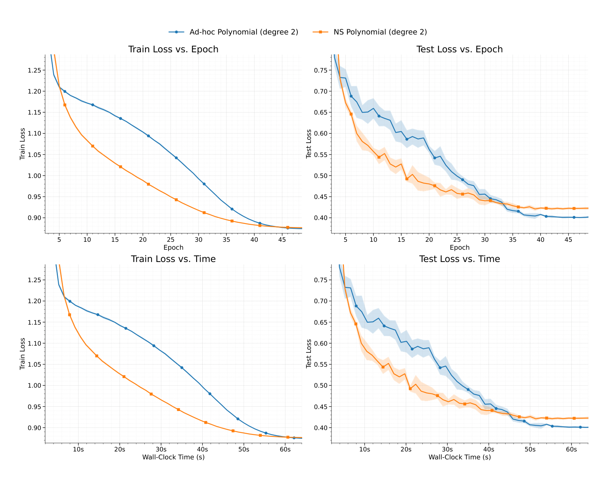
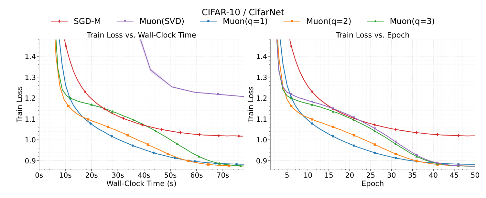
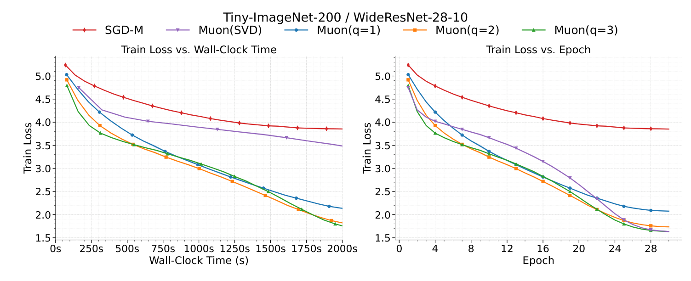

# Convergence of Muon with Newton–Schulz

## 核心信息与阅读结论

- 作者：Gyu Yeol Kim、Min-hwan Oh，首尔大学。
- 初次公开：2026-01-27；[arXiv v1 页面](https://arxiv.org/abs/2601.19156v1) 标注 Accepted at ICLR 2026。本地 PDF 页眉也标注 Published as a conference paper at ICLR 2026。
- 分析对象：用户提供的 46 页 [PDF](../../../01-raw/2026-10/Convergence_of_Muon_with_Newton_Schulz.pdf) 与 [MinerU Markdown](../../../02-markdown/2026-10/Convergence_of_Muon_with_Newton_Schulz.md)。版本编号沿用用户原始文件名中的 v1；未对远程 PDF 做字节级同一性核验。以本地 PDF 正文、附录和摘要为评价依据。
- 类型：**理论算法为主，辅以训练实验的混合型论文**。访问、核查与分析日期：2026-10-10。
- 审计范围：主定理 1–4、附录 A–E 的关键证明链、附录 F–H 的协议及全部结果图表；近邻原始文献定点查阅。不宣称完成每个证明细节的形式验证或 GPU 训练复现。

**一句话贡献：** 将 Taylor 型有限步 Newton–Schulz 的谱残差显式接入 Muon 的非凸下降分析，在额外控制全程谱误差的条件下得到接近精确极分解的迭代阶，并展示精度与计算成本的权衡。

**阅读决策：精读，作为条件化理论与证明工具使用。** 对当前 Lp、APS 与 Muon 的结合课题，它最有用的内容是“近似方向质量如何进入下降证书”。不能直接拿它为常用 Muon 系数、任意两三步 NS 或自适应步长的优越性背书。学术价值暂评 **5.5/10，中等置信度**；当前课题契合度 **4.5/5**。分数依据见末节。

## 摘要：原文、对应译文与分析者理解

### 英文摘要（本地 PDF 第 1 页，完整转录）

We analyze MUON as originally proposed and used in practice—using the momentum orthogonalization with a few NEWTON–SCHULZ steps. The prior theoretical results replace this key step in MUON with an exact SVD-based polar factor. We prove that MUON with NEWTON–SCHULZ converges to a stationary point at the same rate as the SVD-polar idealization, up to a constant factor for a given number q of NEWTON–SCHULZ steps. We further analyze this constant factor and prove that it converges to 1 doubly exponentially in q and improves with the degree of the polynomial used in NEWTON–SCHULZ for approximating the orthogonalization direction. We also prove that MUON removes the typical square-root-of-rank loss compared to its vector-based counterpart, SGD with momentum. Our results explain why MUON with a few low-degree NEWTON–SCHULZ steps matches exact-polar (SVD) behavior at a much faster wall-clock time and explain how much momentum matrix orthogonalization via NEWTON–SCHULZ benefits over the vector-based optimizer. Overall, our theory justifies the practical NEWTON–SCHULZ design of MUON, narrowing its practice–theory gap.

转录仅消除了 PDF 换行及断词，保留大小写、句序与限定词。arXiv 页面使用 Muon、Newton-Schulz 等不同排版，未用页面文字替换本地 PDF 摘要。

### 中文翻译（逐句对应）

我们分析最初提出并在实践中使用的 MUON，即通过少量 Newton–Schulz 步骤对动量进行正交化。此前的理论结果将 MUON 中这一关键步骤替换成基于精确奇异值分解（SVD）的极分解因子。我们证明，对于给定的 Newton–Schulz 步数 q，采用 Newton–Schulz 的 MUON 以与 SVD 极分解理想化版本相同的速率收敛到驻点，只相差一个常数因子。我们进一步分析这个常数因子，证明它随 q 增大以双指数速度趋于 1，并随 Newton–Schulz 中用于近似正交化方向的多项式次数提高而改善。我们还证明，相比向量形式的对应算法——带动量的 SGD，MUON 消除了通常出现的秩平方根损失。我们的结果解释了为什么采用少量低次数 Newton–Schulz 步骤的 MUON 能以快得多的实际运行时间匹配精确极分解（SVD）的行为，也解释了通过 Newton–Schulz 对动量矩阵进行正交化相对于向量形式优化器能带来多大益处。总体而言，我们的理论为 MUON 的实用 Newton–Schulz 设计提供了依据，缩小了实践与理论之间的差距。

### 核心要点（分析者概括）

作者没有提出新的优化器，而是研究既有更新中的近似计算。理论有两层：先把极分解误差当作参数分析非凸下降，再用一类特殊多项式把误差写成 NS 步数和初始谱残差的函数。实验主要对照 SGD-M、精确 SVD 与 Taylor-NS，验证同轮数与同时间下的行为。最重要的待核验点是：全程谱间隙是否成立、实际系数是否属于定理范围、相同学习率是否公平，以及语言模型训练损失能否对应验证性能。

## 研究背景、问题与成功判据

线性层权重本来是矩阵，逐元素或向量化更新无法直接表达其奇异方向。设动量有紧致分解 $M=U\Sigma V^{\top}$ ，普通动量 SGD 使用 $M$ ，其强奇异方向获得大步、弱方向获得小步；精确极分解使用 $P=UV^{\top}$ ，把非零奇异值统一成 1。这里的“正交化”是对更新方向做谱变换，不是把模型权重强制成正交矩阵，也不是估计 Hessian 的二阶方法。[§1、§3.3]

精确 SVD 提供了易分析的方向，却会增加训练开销。实际 Muon 用多次矩阵乘法近似该方向。理论问题因此不是“能否证明一个昂贵替身”，而是“有限步近似方向还保留多少下降能力”。成功判据包括：在同一驻点指标下保持迭代阶；把损失明确归因于 NS 精度；说明精度、步数、多项式次数、运行时间的关系。本文主要完成第二项中的 Taylor 型谱分析，对完整实用实现仍有边界。[§4、附录 H.4]

作者声称首次分析有限 NS。经近邻核查，更稳妥的定位是**显式分析 Taylor-NS 残差并接入 Muon 收敛界**：2025 年公开的 inexact-LMO 工作已经研究近似 Muon 的误差及超参耦合，详见近邻对照。不能把“首次研究近似 Muon”当作已独立核实的历史事实。

## 数学对象、假设和算法

### 几何、噪声与驻点指标

论文最小化 $f(W)=\mathbb{E}_{\xi}[f(W;\xi)]$ ，其中 $W\in\mathbb{R}^{m\times n}$ ，目标下界有限。记 $D=f(W_0)-f^*$ ， $r=\min\{m,n\}$ 。**此处的 r 是最大可能秩的维度参数，不是实际动量秩或有效秩。** 核范数是奇异值之和，算子范数是最大奇异值，Frobenius 范数是奇异值平方和开根。[§3.1–3.2]

假设 1 是算子—核范数对偶几何中的光滑性：

$$
\Vert\nabla f(X)-\nabla f(Y)\Vert_*
\le L\Vert X-Y\Vert_{op}.
$$

它产生算子范数中的二阶下降代价。不能把它简单等同于常见的 Frobenius 光滑性，并认为常数 L 完全相同。若只有 Frobenius 光滑常数 $L_F$ ，范数转换一般只能给出 $L\le rL_F$ 的可用上界；例如 $f(W)=\Vert W\Vert_F^2/2$ 的最小算子—核光滑常数就是 r，而 Frobenius 常数为 1。因此“不含显式 r 的项”不必然意味着真实问题上完全无维度代价。这是比较同一函数、不同几何时必须核算的常数。[假设 1；分析者范数换算]

假设 2 要求随机梯度无偏、单样本 Frobenius 方差至多 $\sigma^2$ ；独立批量 B 降低方差至 $\sigma^2/B$ 。严格使用时要理解为对迭代历史条件化后的无偏性；否则不能在自适应轨迹上随意消去噪声交叉项。[假设 2；附录 B 式 (5)–(6)]

收敛对象是平均核范数梯度：

$$
\frac{1}{T}\sum_{t=1}^{T}\mathbb{E}[\Vert\nabla f(W_{t-1})\Vert_*]\le\epsilon.
$$

它意味着均匀随机选取历史迭代点的期望驻点保证，不等同于最后一点保证，更不是找到全局最优。由于 $\Vert G\Vert_F\le\Vert G\Vert_*\le\sqrt{r}\Vert G\Vert_F$ ，同数值阈值下核范数条件更强，但也天然引入维度效应。[定义 1；附录 A.1]

### Algorithm 1 的实际数据流

论文先计算批梯度，再累积未乘 EMA 系数的动量：

$$
G_t=\frac{1}{B}\sum_{i=1}^{B}\nabla f(W_{t-1};\xi_{t,i}),
$$

$$
M_t=\beta M_{t-1}+G_t,
,

X_{t,0}=\frac{M_t}{\alpha_t},
,

\alpha_t=\max\{1,\Vert M_t\Vert_F\}.
$$

接着在当前更新内循环 q 次：

$$
X_{t,j+1}=p_{\kappa}(X_{t,j}X_{t,j}^{\top})X_{t,j},
,

O_t=X_{t,q},
,

W_t=W_{t-1}-\eta O_t.
$$

动量消减采样噪声，但会跟不上移动中的真实梯度；NS 改善谱方向，却需要矩阵乘法。两者分别控制统计误差与方向误差。证明中引入 $N_t=(1-\beta)M_t$ ，得到标准 EMA 递推，便于计算方差。精确极分解对正比例缩放不变，不过 **Algorithm 1 的缩放含 1 的截断，有限 NS 不总能继承这种尺度不变性**；这点影响小梯度区域和谱间隙。[§3.3；附录 B]

论文的多项式定义为在 1 处截断逆平方根的 Taylor 展开：

$$
p_{\kappa}(\lambda)=\sum_{s=0}^{\kappa}c_s(1-\lambda)^s,
,

c_s=\frac{(2s)!}{4^s(s!)^2}.
$$

具体有 $p_1(\lambda)=3/2-\lambda/2$ ，以及 $p_2(\lambda)=15/8-5\lambda/4+3\lambda^2/8$ 。次数 $\kappa=2$ 是关于 Gram 特征值的二次式，作用到奇异值时是五次映射，不能与“五步 NS”混淆。[定义 2；附录 D.1]

## 理论主线：为什么近似正交化仍能下降

### 1. 把矩阵问题降为标量谱递推

对初始矩阵的每个正奇异值 s，一次 NS 将其变为 $s p_{\kappa}(s^2)$ ，左右奇异向量不变。多项式在区间内为正，因此支撑空间也不变。设 $\Pi_t$ 是动量列空间投影，定义：

$$
\delta_{t,j}=\Vert\Pi_t-X_{t,j}X_{t,j}^{\top}\Vert_{op},
,

\varepsilon_{t,q}=\Vert O_t-P_t\Vert_{op}.
$$

用投影而非全空间单位矩阵，是为了正确处理秩亏。否则零奇异方向会永久贡献残差 1。正文 §4.4 一处写成 I，笔记按定义 3 与附录 D 的支撑版本解释。[定义 3；Lemma 9–10]

Taylor 多项式保持奇异值不超过 1，因此最小正奇异值控制最坏方向误差：

$$
\varepsilon_{t,q}=1-\sqrt{1-\delta_{t,q}}.
$$

这里是**最坏奇异方向**的保证；它不区分该方向承担了多少核范数质量。极小但非零的奇异值可以让最坏误差接近 1，即使主方向已足够准确。[Lemma 1]

定义残差映射：

$$
\phi(u)=1-(1-u)[p_{\kappa}(1-u)]^2.
$$

Lemma 2–3 给出 $\delta_{t,j+1}=\phi(\delta_{t,j})\le\delta_{t,j}^{\kappa+1}$ 。所以 q 次后：

$$
\delta_{t,q}\le\delta_{t,0}^{(\kappa+1)^q}.
$$

内层指数随 q 指数增长，才称“双指数”。这不是每个谱从任意初值都立即接近 1，更不意味着 q 对矩阵大小、最小奇异值没有依赖。[Theorem 2]

### 2. 把谱误差转成下降损失

算子—核对偶性给出 $\langle N_t,P_t\rangle_F=\Vert N_t\Vert_*$ ，并把极分解偏差的损失控制为 $\varepsilon_{t,q}\Vert N_t\Vert_*$ 。设真实梯度与 EMA 的差为 $e_t=\nabla f(W_{t-1})-N_t$ ，得到附录 B 式 (1) 的关键不等式：

$$
f(W_t)\le f(W_{t-1})
-\eta(1-\varepsilon_q)\Vert\nabla f(W_{t-1})\Vert_*
+2\eta\Vert e_t\Vert_*
+\frac{L\eta^2}{2}(1+\varepsilon_q)^2.
$$

这里采用论文的统一误差写法 $\varepsilon_q=\sup_t\varepsilon_{t,q}$ 。下降项的系数缩成 $1-\varepsilon_q$ ，所以除过去就得到放大因子 $\chi_q=(1-\varepsilon_q)^{-1}$ 。Taylor 情形本可用 $\Vert O_t\Vert_{op}\le1$ 改善末项常数，论文选择较宽松的统一控制。[附录 B 式 (1)–(2)]

EMA 误差进一步拆成真实梯度漂移与采样噪声。按附录 B 式 (7)，漂移量级为 $\beta L\eta(1+\varepsilon_q)/(1-\beta)$ ，噪声量级为 $\sigma\sqrt{r(1-\beta)/(B(1+\beta))}$ ，还有衰减的初始化项。较大动量减少方差却增加滞后，这个平衡最终产生随机情形的四次根项。[附录 B 式 (3)–(8)]

证明中式 (5) 等多处写成 $G_i-\nabla f(W_i)$ ，与梯度采样位置 $W_{i-1}$ 不一致。核对本地 PDF 后确认不只是 Markdown 解析错误。按采样时间把索引修正后，可以用鞅差正交性解释噪声交叉项为零；照原式直接使用无偏性不成立。属于需要修正的证明书写问题，不据此独断核心递推无法修复。

### 3. 主定理的量级、复杂度与秩比较

Theorem 1 选择 $\eta=\sqrt{(1-\beta)D/(TL)}$ ，以及 $\beta=1-\min\{\sqrt{LDB}/(\sigma\sqrt{rT}),1\}$ 。无噪声时要按极限取 $\beta=0$ ，避免直接除零。论文报告：

$$
\frac{1}{T}\sum_{t=1}^{T}\mathbb{E}[\Vert\nabla f(W_{t-1})\Vert_*]
\le\chi_q\mathcal{O}\left(
\sqrt{\frac{LD}{T}}+
\frac{\sigma r}{\sqrt{BT}}+
\left(\frac{r\sigma^2LD}{BT}\right)^{1/4}
\right).
$$

在 $\chi_q$ 可作为统一常数时，迭代复杂度为：

$$
T=\mathcal{O}\left(\max\left\{
\frac{\chi_q^2LD}{\epsilon^2},
\frac{\chi_q^2r^2\sigma^2}{B\epsilon^2},
\frac{\chi_q^4r\sigma^2LD}{B\epsilon^4}
\right\}\right).
$$

这是迭代数；随机样本调用还需要乘 B，NS 总计算量还要乘 q 及多项式评估成本。参数依赖未知的目标差、光滑性和噪声常数，不能直接视为实用超参推荐。[Theorem 1；附录 B]

Theorem 4 在精确 SVD 下令误差为零，Theorem 3 给出 SGD-M 的比较界：

$$
\mathcal{O}\left(
\sqrt{\frac{rLD}{T}}+
\left(\frac{r^2\sigma^2LD}{BT}\right)^{1/4}
\right).
$$

确定性项的形式优势是 $\sqrt{r}$ ；随机四次根项是 $r^{1/4}$ ，并非每个随机项都有 $\sqrt{r}$ 优势。Muon 还多出 $\sigma r/\sqrt{BT}$ 的初始化项。比较两份上界也不能证明实际耗时相差相同倍数：没有配套下界，界可能松，且 $\chi_q$ 可能随谱变坏而抵消表面优势。[Table 1；Theorem 3–4]

## 证明审计：可修复之处与实质条件缺口

### 一般次数的全区间收缩：原证明缺一步，但可补齐

附录 D 的一般证明先由 Taylor 余项得到 $\phi(u)=C_{\kappa}u^{\kappa+1}+\mathcal{O}(u^{\kappa+2})$ ，证明在足够小邻域内收缩，随后直接用于所有初始残差。局部结论不能直接推出全区间结论。对于次数 1、2，附录 D.1 已写出显式多项式，足以独立建立全区间收缩。

**分析者补充证明如下，非原文已有完整论证。** 记 $Q(u)=p_{\kappa}(1-u)$ 。附录 A.3 的系数恒等式给出：

$$
Q(u)-2(1-u)Q'(u)=(2\kappa+1)c_{\kappa}u^{\kappa}.
$$

因此 $\phi'(u)=(2\kappa+1)c_{\kappa}u^{\kappa}Q(u)$ ，结合 $\phi(0)=0$ 可以逐项积分得：

$$
\phi(u)=\sum_{s=0}^{\kappa}
\frac{(2\kappa+1)c_{\kappa}c_s}{\kappa+s+1}
u^{\kappa+s+1}.
$$

系数全正、指数均不小于 $\kappa+1$ ，且 $\phi(1)=1$ 意味着系数和为 1。于是对 $u\in[0,1]$ ，每个幂都不超过 $u^{\kappa+1}$ ，全区间界成立。本次还用有理数精确运算检查次数 1–20 的系数和，但数学证明本身适用于任意正整数次数。这个修复保住了 Lemma 3 的结论，不能把原证明缺口夸成定理已被反例推翻。

### 更实质的问题：逐点谱间隙不等于统一谱间隙

Remark 1 仅证明对每一步，最小正奇异值严格大于零，所以 $\delta_{t,0}<1$ 。Theorem 2 和 Corollary 1 却使用 $\delta_0=\sup_t\delta_{t,0}<1$ 。若考虑无限迭代，前者不能推出后者；例如非零矩阵序列 对角元素为 $1$ 和 $1/t$ 的 $M_t$ 的残差趋于 1。此例是对所用逻辑推断的反例，**不是已经构造出的 Muon 完整轨迹反例**。

对固定有限 T、固定样本路径，最大残差确实小于 1，但它可以依赖 T，随机路径上也未必存在共同的确定性上界。把路径相关的放大因子拿出期望，或把随 T 增长的因子当成与 T 无关常数，都需要额外论证。假设 1–2 只管光滑性与 Frobenius 噪声，未提供归一化最小正奇异值的统一下界。[Remark 1；Theorem 2；附录 B 末尾；附录 D]

更完整的定理应显式增加全程、几乎处处的统一条件，例如存在与 T 无关的 $\mu>0$ ，使非零支撑上的 $\sigma_{\min}^{+}(M_t)/\alpha_t\ge\mu$ ；或采用随时间变化的下降权重，避免把最坏误差一律作为外部常数。现有证据支撑**带统一谱误差条件的收敛界**，不足以由原列出的两条假设直接得到“常数只依赖 q”的无条件解释。

### 双指数率并不消除起始谱的成本

以次数 2、三步为例，按 Theorem 2 的上界独立核算：

| 初始最大残差 | 放大因子上界 | 单一最差奇异值递推的实际放大因子 |
|---:|---:|---:|
| 0.5 | 1.000000004 | 1.00000000007 |
| 0.9 | 1.0304 | 1.0081 |
| 0.99 | 2.0513 | 1.6895 |
| 0.9999 | 19.2575 | 15.1874 |

同样三步，效果可能完全不同。即使没有病态条件数，秩 r 的等奇异值矩阵在 Frobenius 归一化后，每个奇异值仅为 $1/\sqrt{r}$ ，初始残差是 $1-1/r$ 。三步 Taylor-NS 的实际极分解误差在 r=16、64、256 时分别为 0.0373、0.3008、0.6054；对应放大因子 1.0387、1.4302、2.5344。这是独立标量计算，不是论文训练实验。它直接否定了“任意高维良态矩阵只要三步就近乎精确”的泛化解读。

### 理论实现与实际 Muon 的边界

作者原始设计使用的系数是 $(3.4445,-4.7750,2.0315)$ ，允许奇异值在 1 附近波动；本文 Taylor 系数是 $(1.875,-1.25,0.375)$ 。两者只有多项式结构类似。[Muon 作者说明](https://kellerjordan.github.io/posts/muon/) 的实现及 Tuning the coefficients 明确展示了前一组系数。

附录 H.4 自己承认常用多项式不满足 Lemma 2 的单调性，其保证只覆盖 Taylor 家族。常用多项式在 1 处为 0.701，所以奇异值为 1 的方向下一步变成 0.701，精确极分解不是这个映射的固定点。作者强调“实际原版”的广泛表述，需要被这一适用边界收紧。

> 图11：提供特定训练设置下两套系数的行为对照；不把常用系数纳入本文定理范围，也不能证明 Taylor 在所有任务上更好。

附录 H.4 一处批评 $p(\lambda)\in[0,1]$ 不成立，但本文 Taylor 多项式本身也可大于 1；真正需要的是谱映射 $\lambda p(\lambda)^2$ 保持区间并满足单调性。独立计算常用系数的 $\tau'(1)=-0.506823$ ，与文中近似值略异，符号相同，因此不改变单调性失效的结论。

此外 Algorithm 1 不含 Nesterov 输入、矩阵形状增益及辅助参数路由的完整工程实现；F.2 用 $M/\Vert M\Vert_F$ ，不同于理论中的截断缩放，并在每步重新归一化权重。尤其权重重新归一化改变了目标轨迹，不能直接用无约束 Algorithm 1 的定理解释全部实验效果。

## 实验协议与结果核算

### 任务、规模、基线与预算

| 任务 | 模型参数 | 数据与预算 | 重复及关键设置 |
|---|---:|---|---|
| MNIST | MLP 0.5M | 60K 训练样本，50 epochs | 5 runs，B=256，学习率 0.08，动量 0.7 |
| CIFAR-10 | CifarNet 约 2M | 50K/10K，50 epochs | 5 runs，B=512；主学习率 0.0860632，动量 0.730778 |
| CIFAR-100 | ResNet-18 11.2M | 50K 训练样本，50 epochs | 5 runs，B=512，学习率 0.08，动量 0.7 |
| Tiny-ImageNet | WRN-28-10 36.6M | 100K 训练样本，30 epochs | 3 runs，B=128，学习率 0.08，动量 0.7 |
| FineWeb | NanoGPT 124.2M | 10M 训练、1M 验证 tokens，最多 6000 steps | B=8，学习率 0.02，动量 0.95，8 RTX-3090 |
| FineWeb | GPT-2 型 1313.63M | 同上；序列长 1024 | 同上；重复次数未在该配置条目明确 |

数据均据 §5 与附录 F–G；未把标准数据集常识补成论文明确报告的划分。FineWeb 配置列了大小模型的层数、头数、宽度，却随后用 768 和 12 层描述网络，缺少大模型完整的逐项配置。B=8 是全局还是每卡、是否累积梯度，也需代码核实。

基线是 SGD-M、精确 SVD、NS 的 q=1、2、3，次数扫描固定 q=3。CIFAR 主实验还包含辅助 SGD、标签平滑 0.2、梯度裁剪 1.0、5% warm-up 加 cosine。共享调度和架构有利于对照，但各方法用相同主学习率和动量，不等于各方法都被公平调到最佳。没有本文中的强 AdamW 训练基线，故本实验不能得出胜过调优 AdamW 的结论。[F.1–F.2]

### 主实验：按 epoch 接近 SVD，按时间优于昂贵替身

> 图1：上排比较学习轮数，下排比较运行时间；阴影为五次运行的标准差，不是均值置信区间。

q=2、3 在相同 epoch 下接近 SVD，q=1 更早降低部分训练损失，而增加 NS 步数也增加每步成本。图支持少量近似计算在该任务上的实用性，但没有测量每层谱残差并关联到理论常数，也没有证实误差沿 q 双指数下降。损失曲线接近不等于极分解误差已经很小；训练对最坏弱方向可能不敏感。[§5；Fig.1]

同时间的原始训练损失与独立差值计算如下。交叉熵损失的数值单位为无量纲；时间为秒。NS 行固定取 q=3，避免逐任务事后挑最优 q；GPT-1.3B 的 q=1 实际更低。

| 来源与固定时间 | SGD-M | SVD | NS q=3 | 对 SGD 的绝对降低 | 对 SGD 的相对降低 |
|---|---:|---:|---:|---:|---:|
| Table 3，CIFAR-10，60 s | 1.010 | 1.182 | 0.876 | 0.134 | 13.27% |
| Table 4，CIFAR-100，500 s | 2.072 | 2.522 | 1.481 | 0.591 | 28.52% |
| Table 5，Tiny-ImageNet，2000 s | 3.857 | 3.520 | 1.800 | 2.057 | 53.33% |
| Table 6，NanoGPT，600 s | 4.594 | 7.125 | 0.026 | 4.568 | 99.43% |
| Table 7，GPT-1.3B，3600 s | 2.0156 | 7.4930 | 0.0286 | 1.9870 | 98.58% |

计算口径为基线损失减 NS 损失，相对降低再除以基线损失。例如 CIFAR-10 为 $(1.010-0.876)/1.010$ 。这些百分比是**固定时间下训练损失的相对差异**，不是准确率提升百分比，更不是相同目标损失的训练加速倍数。表格没有给出这些单元格的误差条，不能据此判断统计显著性。

### 各模型图与异常结果的解释

> 图2：小 MLP 上 NS 避免了 SVD 的运行成本；Table 2 在 250 s 时 q=1、2、3 都为 0.501，SGD-M 为 0.513，差异远小于语言模型结果。

> 图3：固定时间下 q=1 早期较快，后期 q=2、3 略低，展示近似精度与成本之间的折中。

> 图4：在 500 s 时 q=3 为 1.481，低于 q=1 的 1.514；曲线不支持“多一步在所有时间预算上都更好”。

> 图5：在 2000 s 时 q=3 为 1.800，q=1 为 2.144；较大模型上高精度变体的收益可抵消内层成本。

> 图6：Table 6 的 q=3 训练损失在 600 s 降至 0.026，但图表主要展示训练损失，不能直接外推为语言建模泛化能力。

> 图7：Table 7 的 q=1、2、3 在 3600 s 为 0.0109、0.0113、0.0286；这组结果中步数最多的变体不是固定时间最优。

语言模型很低的训练损失需要谨慎解释。固定 10M tokens 只有 9765 个长度 1024 的序列；如果 B=8 是全局有效批量，6000 步约消费 49.15M token 位置，已反复遍历该小语料。若是每卡批量，则消费更多；在确认分布式采样前不能选定唯一训练遍数。这足以提示记忆训练集的竞争解释，但不是数据泄漏证据。文中虽提及 1M 验证 tokens，这些图表未提供对应验证损失或下游性能，无法把训练损失近零解释成常规大语料预训练的性能突破。[G.5–G.6]

### 消融是否真正检验理论机制

> 图8：固定 q=3 扫次数 1–5，增加次数改善部分 epoch 轨迹并增加时间，未报告各层的残差数据。

次数消融符合“提高内层计算量可能改善方向”的解释，但没有等 FLOPs 或等优化器时间的完整对照，无法排除仅因投入了更多计算而更好。需要同时记录谱残差、下降对齐、验证损失与 GPU 时间，才能从趋势升级为机制验证。[H.1]

> 图9：改变第一卷积层输出通道，测量平均核范数梯度；改变的是矩阵尺寸上界，不是对固定矩阵孤立控制其有效秩。

Table 8 原始 log–log 斜率依次为 SGD-M 0.292、SVD 0.102、NS -0.106；除以 $\sqrt{r}$ 后分别为 -0.208、-0.398、-0.606，恰好各减 0.5。这种归一化后的斜率变化是代数必然，不是新的独立证据。原始曲线确实显示 SGD 的维度依赖更强，但改变通道数也改变表达容量、参数量、损失几何、初始化与噪声，未保持 L、D、噪声常数固定。定理给的是最坏上界，不预测拟合斜率必须恰好为 0.5；本文也没有报告斜率置信区间。[H.2]

> 图10：B=64–1024 在固定 epochs 下同时改变噪声、更新次数与吞吐；本文设置中 1024 的时间表现最好。

固定 epochs 意味着大批量有更少的更新步数，步数调度也随之改变。实验没有隔离定理中的 B 方差项，因此不能声称单独验证 $1/\sqrt{B}$ 或四次根的具体率，也不能把 1024 当成普遍最优批量。[H.3]

## 实现成本与运行时间主张

附录 E 对 $m\le n$ 的单矩阵给出薄 SVD 成本量级 $4m^2n+8m^3$ ，按将多项式作用于 X 的 Horner 实现估计 NS 成本为 $2q(\kappa+1)m^2n$ 。这是具体求值方案下的乘法核算。次数 2 也可先在较小 Gram 矩阵上形成平方，实际 FLOPs、内存和 kernel 数量会不同，不能把一个求值形式当作所有实现的精确成本。

运行时间还要除以各自的有效吞吐。作者用 GEMM/SVD 的吞吐差解释 NS 优势，但吞吐比不是由光滑性定理推出的，也不是平台无关常数。完整训练时间应包含前反向、通信、优化器与数据加载；若前反向已经占绝大多数，内层快几倍不会转成整步快几倍。本文实验展示了所用环境中的曲线，仍缺相同目标验证损失的端到端成本、软件版本、同步计时细节及强实现基线。[Lemma 11；附录 E、G]

## 主张—证据—限制矩阵

| 核心主张 | 证据锚点 | 可支持的最强结论 | 主要限制或竞争解释 | 置信度 |
|---|---|---|---|---|
| 有限 NS 保持精确极分解的迭代阶 | Theorem 1、附录 B 式 (1)–(8) | 加上统一谱误差条件后的 Taylor-NS 收敛分析 | 原假设未推出统一谱间隙；轨迹随机因子与期望 | 中 |
| NS 残差随步数双指数下降 | Theorem 2、Lemma 1–3、附录 D | 固定初始谱的 Taylor 多项式残差界 | 一般证明需补全；常数依赖起始谱和次数 | 高，条件明确后 |
| 两三步足以接近 SVD | Fig.1、Theorem 2 的解释 | 指定任务上 epoch 损失接近 | 等谱高维例子也可能远离精确极分解 | 中低 |
| Muon 减弱秩依赖 | Table 1、Theorem 3–4、Table 8 | 同几何下若干上界项较好 | 维度参数非实际秩；隐藏 L、谱因子；无下界 | 中 |
| 解释实际 Muon、节省训练时间 | Appendix E、F.2、H.4、Tables 2–7 | Taylor 实现及所用平台的精度成本折中 | 常用系数不覆盖；权重重归一化；缺验证成本 | 中低 |

## 最接近工作与净增量

以下定点查阅均在 2026-10-10 完成；在线近邻分析不混入本地论文摘要或替换本地版本。没有把近邻的损失数字直接与本文比较，因为训练协议不一致。

| 工作及原始来源 | 共同问题与关键假设 | 关键差异 | 本文可归因的净增量 |
|---|---|---|---|
| [Muon 原始说明](https://kellerjordan.github.io/posts/muon/)，Jordan 等，2024 | 动量后谱变换，矩阵乘法避免 SVD | 使用常用启发式系数，接受非精确极分解；工程参数路由 | 对另一类 Taylor 系数建立误差证明，不能覆盖原版全部实现 |
| [A Note on the Convergence of Muon，v2](https://arxiv.org/html/2502.02900v2)，Li、Hong，2025 | EMA 误差与非凸下降 | §2 用精确 SVD、Frobenius 光滑性及不同指标/常数 | 把有限 NS 误差显式接入，对偶几何使比较更清楚 |
| [On the Convergence Analysis of Muon，v1](https://arxiv.org/html/2505.23737v1)，Shen 等，2025 | Assumption 3.2 与本文相同的算子—核光滑性，核范数驻点 | Algorithm 1 理论仍采用精确 SVD；Appendix E 介绍 NS | 并非首次采用这种几何，主要新增有限内层误差与多项式次数 |
| [Beyond the Ideal: Analyzing the Inexact Muon Update，v1](https://arxiv.org/html/2510.19933v1)，Shulgin 等，2025 | 在一般范数下研究近似 LMO 和随机动量 | 误差作为输入，允许方向超出单位球，研究误差、步长、动量耦合 | 本文显式推导 Taylor-NS 的误差与 q、次数、起始谱的关系 |

Li–Hong 的 §2 更接近“矩阵归一化 SGD”的早期理论路线；本文不是凭矩阵化就得到新阶，而是利用核范数对偶下降并隔离计算误差。[Li–Hong，§2、Theorem 2.1]

Shen 等已经把 Frobenius 与算子—核光滑性区分，并以 SVD 版本建立非凸界；对本文的新颖性判断应扣除已有几何和 EMA 证明骨架。本文的技术增量集中在有限近似的控制，比较时还要统一初始化、指标与噪声口径。[Shen 等，§3、Algorithm 1、§4.1]

Shulgin 等的 v1 于 2025-10-22 公开，早于本篇 arXiv 首发。他们已经给出包含方向误差的下降和随机动量分析，并讨论超参耦合。其 Theorem 1 同样要求逐步误差小于 1，常参数结果需要统一误差；因此也不是完全摆脱谱质量条件。本文较窄但可复用的贡献是专门展开 Taylor-NS 的谱递推，而“首次分析近似 Muon”这一宽泛措辞不能成立。是否早于所有同期会议稿，尚需完整提交时间记录，不能仅凭 arXiv 日期排定所有优先权。[Shulgin 等，§2–3、Theorem 1、Corollary 1–3]

## 深度评价与适用场景

**优势：** 误差以明确形式进入下降系数，读者能看见近似计算如何损失进展；算子—核几何说明了极分解的自然性；附录给出可独立检查的标量谱问题，次数 1、2 的收缩尤其清晰；实验同时展示 epoch 和时间，避免只比较迭代效率。对于从“精确方向”过渡到“有限近似”的研究，这是一套有价值的证明组织方式。[§4；附录 B、D；Fig.1]

**可能影响核心定理解释的实质缺口：** 原列出的假设没有推出与轨迹和 T 无关的统一谱间隙；因此不能直接接受不附加条件的固定常数迭代阶。本次没有构造满足全部设置而违反最终收敛结论的优化轨迹，故标为条件缺口，而不是已经证明算法不收敛。

**可修复与非致命局限：** 一般次数证明局部到全局缺一步可由本文恒等式补全；时间索引应统一；真实 Muon 系数超出证明范围限制实践外推；实验共享超参、权重重归一化、少量训练语料及欠缺验证结果限制性能归因。这些局限不会消除 Taylor 谱递推本身的意义，但会降低宽泛“理论完全解释实践”的可信度。

适合把它用于分析 Taylor 极分解近似、构建误差感知步长、研究近似 LMO 的下降证书。不适合据它直接推荐所有层 q=2/3、替换调优 AdamW、证明 Lp 变换与 Muon 的组合有效，或用本文训练损失作为大规模泛化收益的目标值。

## 最小复现与反证计划

本次已经完成的是算术和证明链审计，未运行训练。脚本与 JSON 结果在 [.planning 中的核算脚本](../../../.planning/analyze-muon-2026-10-10/audit.py) 和 [核算结果](../../../.planning/analyze-muon-2026-10-10/audit_results.json)。它们核算谱递推、残差上界、系数恒等式、表格差值；不提供训练复现证据。

1. **CPU 代数层，几秒到分钟级。** 用上述脚本验证全区间补充证明的系数；构造等谱、对数谱、秩亏及缩小整体尺度的矩阵，对照真实 SVD，记录最小正奇异值、极分解误差与下降对齐。误差界在其假设下若出现超越数值误差的违反，先停止训练并定位公式或实现问题。
2. **单 GPU CifarNet 层，预算由小规模计时确定。** 至少三种子，分开复现论文设置与无权重重归一化设置；q=0–5，Taylor 与常用系数，增加调优 SGD-M 和 AdamW。每方法共享超参之外再给相同搜索预算。指标为验证 loss、准确率、到目标验证 loss 的秒数、NS 时间比例；同时采样层谱和下降内积。若收益在公平调参后消失，不再追加大模型预算。
3. **现有 NanoGPT 层，固定训练 token 与验证集。** 使用当前项目已有配置，严格记录全局批量、梯度累积和每次数据遍历。以验证 loss 和端到端 GPU 时间判断，训练 loss 只用于诊断。先三种子短程试验，只有验证收益超过种子波动且预算差透明时扩展长度。无需从本文 8 卡设置起步。

尚缺本文训练代码链接、完整模型配置、种子编号、计时软件栈、语言模型验证轨迹；本地 PDF 未发现直接训练仓库地址。本次不据此断言作者从未公开代码，只记录当前材料不足。恢复这些信息可能明显改变可复现性评分。

## 面向 Lp、APS 与 Muon 的可证伪研究机会

当前课题依据项目已有 [Lp、APS 与 Muon 阅读路线](../../../07-research/2026-10-08-Lp_APS与Muon结合_阅读路线与研究推进.md)，并非仅由论文主题猜测。这里提出验证方向，不把已有组合包装成新颖性。

| 假设 | 证据缺口与最小验证 | 核心指标 | 资源与停止条件 |
|---|---|---|---|
| 按下降对齐而非最坏极分解误差分配 q，更能解释短 NS 的训练效果 | 本文用最小奇异值控制全部方向；在同一动量上扫 q 并记录质量加权对齐 | 动量内积、真实批梯度内积、验证 loss、优化器时间 | CPU 谱诊断加单卡短程；预算匹配后收益不稳则停止 |
| APS 与 NS 精度需要联合调参，独立调参会误判收益 | Theorem 1 暗含误差损失，近邻显示误差和超参耦合；先固定几何做步长与 q 的小网格 | 到验证目标的时间、被拒步率、额外前向成本 | 使用现有 NanoGPT；等预算下不超过固定 Muon 则停止 |
| Lp 或谱幂变换改变最小正奇异值，从而影响有限 NS 所需计算 | 本文残差依赖初始谱；在相同原始动量上区分坐标幂、谱幂以及变换顺序 | 小奇异值、方向对齐、q 成本、验证稳定性 | 先离线谱样本；改进仅见于最坏误差而不见于下降及验证则停止 |

第三项尤其要区分坐标 Lp 与 Schatten 谱几何：坐标幂一般会改变奇异向量，不能直接沿用本文“左右奇异向量不变”的递推。第一项可考虑质量加权误差：

$$
\rho_t=1-\frac{\langle N_t,O_t\rangle_F}{\Vert N_t\Vert_*}.
$$

Taylor 情形下，这个比值是各奇异方向输出幅度的核质量加权平均，比只看最小正奇异值更贴近下降。但它只衡量动量对齐，仍要控制动量与真实梯度之间的差，不能自动升级成新收敛定理。一般系数下还需控制方向算子范数与可能的谱过冲。

## 八维评价与综合判断

| 维度 | 分数 | 证据位置 | 理由 | 置信度 |
|---|---:|---|---|---|
| 问题重要性与界定 | 4/5 | §1、§3–4 | 有限计算与精确理论的差距真实；“实际原版”范围描述偏宽 | 高 |
| 原创性与净增量 | 3.5/5 | Theorem 2；近邻 §2–3 | 显式 Taylor-NS 误差桥接有用，近似 Muon 总框架已有工作 | 中 |
| 技术正确性与严谨性 | 2.5/5 | Remark 1、附录 B、D | 核心谱结论可修复；统一谱间隙和期望处理需要补充条件 | 中 |
| 证据强度与替代解释 | 3/5 | Fig.1、Tables 2–8、F–H | 多任务与种子，但未直接测机制；相同超参及小语料限制归因 | 中 |
| 可复现性与透明度 | 2.5/5 | F.1–F.2、G | 部分细节充分，代码、分布式批量与验证轨迹当前缺失 | 中 |
| 外推边界与稳健性 | 2/5 | H.4、Theorem 2、G.5–G.6 | 实际系数不覆盖，谱间隙与小数据泛化边界突出 | 高 |
| 研究生成力 | 4/5 | 下降式、残差定义及本次审计 | 可导出误差加权下降、谱预算、步长精度联合设计 | 中高 |
| 当前课题契合度 | 4.5/5 | 现有 Lp/APS/Muon 路线；附录 B | 直接服务近似方向与步长分析，不代替组合新颖性审计 | 高 |

学术价值采用共享准则前七维默认权重 15%、20%、20%、20%、10%、5%、10%；加权均值为 3.15，映射 $2.5(3.15-1)=5.375$ ，按 0.5 分四舍五入为 **5.5/10**。第八维不混入学术分。没有因为论文偏理论扣分；主要扣分来自条件闭合、实践适用边界和证据归因。

评价置信度为中：谱递推与具体核算较高，原定理在最弱假设下是否能通过另一条证明成立仍待研究；完整代码与后续版本也可能补足当前缺口。对当前课题仍建议精读附录 B、D、H.4，并联读 inexact-LMO 近邻。优先理解下降证书，再决定是否增加 NS 精度；追求更精确的极分解本身不是训练收益的充分条件。

## 我的笔记

此处留给用户补充阅读问题、推导与实验观察。

## 可核验来源

- [本地论文 PDF](../../../01-raw/2026-10/Convergence_of_Muon_with_Newton_Schulz.pdf)：本文公式、定理、实验数字和图像的主要来源。
- [本地解析 Markdown](../../../02-markdown/2026-10/Convergence_of_Muon_with_Newton_Schulz.md)：便于全文检索；公式和索引疑点回看 PDF。
- [arXiv:2601.19156v1](https://arxiv.org/abs/2601.19156v1)：日期、作者及会议标注，2026-10-10 核查。
- [Muon 作者说明](https://kellerjordan.github.io/posts/muon/)：原始系数与实践设计。
- [Li–Hong，2502.02900v2](https://arxiv.org/html/2502.02900v2)：精确 SVD 的早期理论。
- [Shen 等，2505.23737v1](https://arxiv.org/html/2505.23737v1)：算子—核几何的已有理论。
- [Shulgin 等，2510.19933v1](https://arxiv.org/html/2510.19933v1)：近似 LMO、误差及超参耦合。
