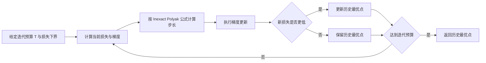
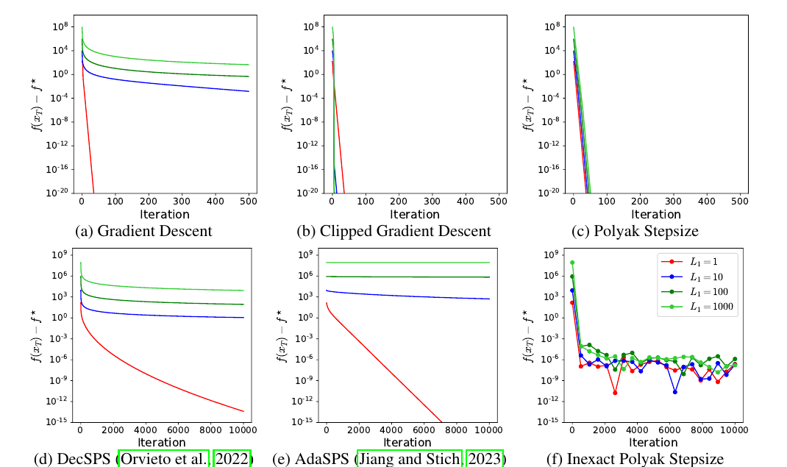
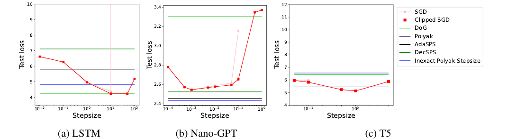
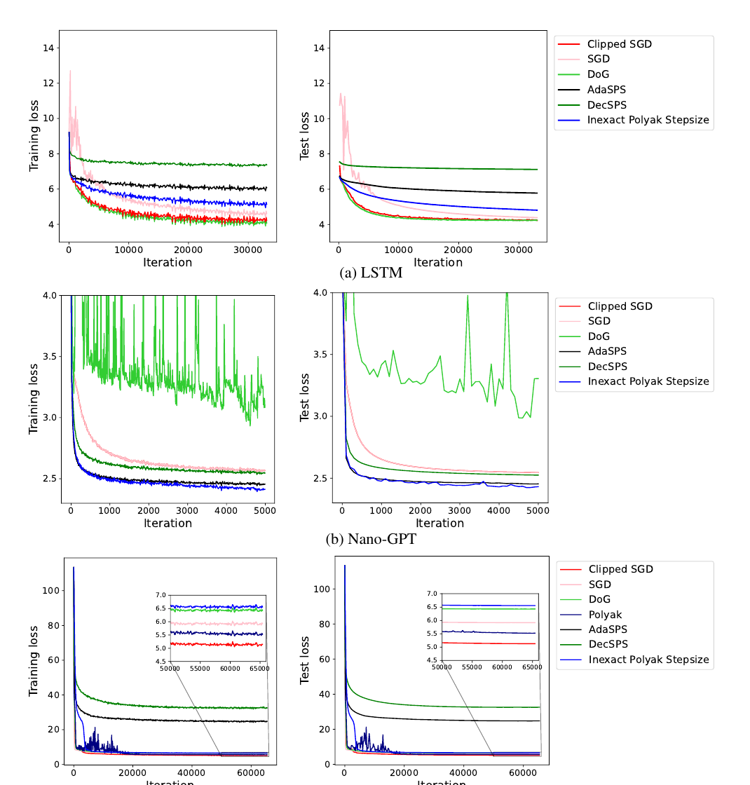

# Parameter-free Clipped Gradient Descent Meets Polyak

## 核心信息

- **中文题目**：无参数梯度裁剪与 Polyak 步长的结合
- **作者**：Yuki Takezawa、Han Bao、Ryoma Sato、Kenta Niwa、Makoto Yamada
- **会议**：NeurIPS 2024，Main Conference Track
- **论文编号**：arXiv:2405.15010
- **本地材料**：[原始 PDF](../../01-raw/Parameter_Free_Clipped_Gradient_Descent_Meets_Polyak.pdf) | [解析 Markdown](../../02-markdown/Parameter_Free_Clipped_Gradient_Descent_Meets_Polyak.md)
- **在线版本**：[arXiv](https://arxiv.org/abs/2405.15010) | [NeurIPS Proceedings](https://proceedings.neurips.cc/paper_files/paper/2024/hash/4ebba705ffdee81e0a638c99fe066ce2-Abstract-Conference.html) | [DOI](https://doi.org/10.52202/079017-1416)

> **一句话结论：** Polyak 步长在 $(L_0,L_1)$ 广义平滑条件下天然表现得像一个自动调好步长和裁剪阈值的梯度裁剪方法；Inexact Polyak Stepsize 再用损失下界替代未知最优值，从而减少调参，但代价是更慢的理论速率和更强的适用条件。

## 摘要翻译

### 英文摘要

Gradient descent and its variants are de facto standard algorithms for training machine learning models. As gradient descent is sensitive to its hyperparameters, we need to tune the hyperparameters carefully using a grid search. However, the method is time-consuming, particularly when multiple hyperparameters exist. Therefore, recent studies have analyzed parameter-free methods that adjust the hyperparameters on the fly. However, the existing work is limited to investigations of parameter-free methods for the stepsize, and parameter-free methods for other hyperparameters have not been explored. For instance, although the gradient clipping threshold is a crucial hyperparameter in addition to the stepsize for preventing gradient explosion issues, none of the existing studies have investigated parameter-free methods for clipped gradient descent. Therefore, in this study, we investigate the parameter-free methods for clipped gradient descent. Specifically, we propose Inexact Polyak Stepsize, which converges to the optimal solution without any hyperparameters tuning, and its convergence rate is asymptotically independent of L under L-smooth and (L0, L1)-smooth assumptions of the loss function, similar to that of clipped gradient descent with well-tuned hyperparameters. We numerically validated our convergence results using a synthetic function and demonstrated the effectiveness of our proposed methods using LSTM, Nano-GPT, and T5.

### 中文翻译

梯度下降及其变体是训练机器学习模型的事实标准，但它们对超参数十分敏感，通常需要通过网格搜索仔细调参。当算法同时包含多个超参数时，这一过程尤其耗时。近年来，研究者开始分析能够在线调整超参数的参数无关方法，但已有工作主要集中在步长上，尚未充分研究其他超参数。梯度裁剪阈值就是一个重要例子：它与步长一起影响训练稳定性，却仍然需要人工选择。

本文研究参数无关的梯度裁剪方法，并提出 Inexact Polyak Stepsize。该方法不需要针对具体问题调节步长或裁剪阈值，在凸、$L$ 光滑和 $(L_0,L_1)$ 广义平滑假设下收敛到最优解，而且其渐近收敛率不依赖全局平滑常数 $L$ 。作者通过合成函数验证理论，并在 LSTM、Nano-GPT 和 T5 上展示该方法的经验效果。

### 核心要点

- **问题**：普通梯度裁剪同时需要选择学习率与裁剪阈值，搜索成本高。
- **关键观察**：Polyak 步长在 $(L_0,L_1)$ 平滑条件下具有与调参后的梯度裁剪相同的两段式缩放结构。
- **方法**：用已知损失下界 $l^\star$ 替代未知最优值 $f^\star$ ，再除以 $\sqrt{T}$ 控制步长，并返回训练中损失最小的迭代点。
- **理论结果**：主导项不依赖全局平滑常数 $L$ ，也不依赖历史轨迹半径 $D_T$ 。
- **经验结果**：Inexact Polyak Stepsize 在三类神经网络上不是每次都最优，但比其他参数无关基线更稳定。

## 研究背景与动机

考虑无约束优化问题：

$$
x^\star=\arg\min_x f(x)
$$

若目标函数满足标准的 $L$ 光滑性，则梯度变化由一个全局常数控制：

$$
\Vert\nabla f(x)-\nabla f(y)\Vert\le L\Vert x-y\Vert
$$

固定步长梯度下降通常需要知道或估计 $L$ 。但在深度网络训练中，局部曲率沿轨迹变化很大，并且常与梯度范数正相关。$(L_0,L_1)$ 广义平滑性用下面的关系刻画这种现象：

$$
\Vert\nabla f(x)-\nabla f(y)\Vert
\le\left(L_0+L_1\Vert\nabla f(x)\Vert\right)\Vert x-y\Vert
$$

该条件只要求 $\Vert x-y\Vert\le 1/L_1$ 。直观上，梯度较大时允许局部曲率变大，梯度接近零时局部曲率回落到由 $L_0$ 控制的量级。

梯度裁剪的更新为：

$$
x_{t+1}=x_t-
\eta_t\min\left\{1,\frac{c}{\Vert\nabla f(x_t)\Vert}\right\}
\nabla f(x_t)
$$

其中 $c$ 是裁剪阈值。它把更新分成两种状态：梯度较小时使用普通梯度步，梯度较大时把更新长度限制在稳定范围内。问题在于，$\eta_t$ 和 $c$ 都要调节。本文的目标正是：能否保留梯度裁剪适应局部曲率的优点，同时不搜索这两个量？

## 方法概述

### 第一步：重新理解 Polyak 步长

经典 Polyak 步长为：

$$
\eta_t^P=\frac{f(x_t)-f^\star}{\Vert\nabla f(x_t)\Vert^2}
$$

它利用当前函数值与最优值之间的差距自动决定步幅。在 $(L_0,L_1)$ 平滑条件下，论文证明：

$$
\min\left\{
\frac{1}{4L_0},
\frac{1}{4L_1\Vert\nabla f(x_t)\Vert}
\right\}
\le\eta_t^P
$$

而使用理论最优参数的梯度裁剪，其乘在梯度上的有效系数具有同样的结构：

$$
\min\left\{
\frac{1}{L_0},
\frac{1}{L_1\Vert\nabla f(x_t)\Vert}
\right\}
$$

这给出全文最重要的解释：**Polyak 步长不是显式计算裁剪阈值，而是在函数值差与梯度范数的比值中，隐式产生了类似梯度裁剪的自适应行为。**

当梯度很大时，步长按梯度范数的倒数缩小，避免更新过猛；当梯度变小时，步长不会被全局常数 $L$ 永久限制，而可以回到由 $L_0$ 决定的较大尺度。

### 第二步：去掉未知的最优函数值

精确 Polyak 步长需要 $f^\star$ ，实际问题中通常不知道它。若直接用一个可知下界 $l^\star$ 替换，则有：

$$
\eta_t=\frac{f(x_t)-l^\star}{\Vert\nabla f(x_t)\Vert^2}
$$

当 $l^\star<f^\star$ 且梯度趋近零时，分子仍接近正常数，分母却趋近零，因此步长可能爆炸。DecSPS 和 AdaSPS 通过让步长单调下降来处理这一问题，但这种设计也压制了靠近最优点时增大步长的能力，因而可能失去梯度裁剪式的适应性。

本文提出的 Inexact Polyak Stepsize 改为：

$$
\eta_t^{IP}=\frac{f(x_t)-l^\star}{\sqrt{T}\Vert\nabla f(x_t)\Vert^2}
$$

其中 $T$ 是预先给定的总迭代次数。它不强制步长随时间单调下降，而是统一乘上 $1/\sqrt{T}$ ，并在最后返回历史最优迭代点。

### 算法流程

1. 输入总迭代次数 $T$ 和损失下界 $l^\star$ 。
2. 用初始点 $x_0$ 初始化当前历史最优点 $x_b$ 。
3. 在第 $t$ 次迭代计算 Inexact Polyak 步长 $\eta_t^{IP}$ 。
4. 按 $x_{t+1}=x_t-\eta_t^{IP}\nabla f(x_t)$ 更新参数。
5. 若 $f(x_{t+1})\le f(x_b)$ ，则令 $x_b=x_{t+1}$ 。
6. 完成 $T$ 次迭代后返回 $x_b$ 。

## 理论结果

### Polyak 步长与梯度裁剪具有相同量级

令初始距离 $R_0=\Vert x_0-x^\star\Vert$ ，论文定理 4 给出精确 Polyak 步长的界：

$$
f(x_\tau)-f(x^\star)
\le\mathcal{O}\left(
\frac{L_0R_0^2}{T}
+\frac{LL_1^2R_0^4}{T^2}
\right)
$$

其中 $x_\tau$ 是前 $T$ 个迭代点中函数值最小者。随着 $T$ 增大，第二项更快消失，主导项只含 $L_0$ 而不含 $L$ 。这与正确调节步长和裁剪阈值的梯度裁剪收敛率一致。

### Inexact Polyak Stepsize 的收敛界

定义损失下界误差：

$$
\sigma^2=f^\star-l^\star
$$

论文定理 5 给出：

$$
f(x_b)-f(x^\star)
\le\mathcal{O}\left(
\frac{L_0R_0^2+\sigma^2}{\sqrt{T}}
+\frac{LL_1^2R_0^4}{T}
+\frac{L_1^2L\sigma^4}{L_0^2T}
\right)
$$

这个结果有三个值得分开看的性质：

- **渐近不依赖 $L$**：后两项以 $1/T$ 衰减，最终由不含 $L$ 的第一项主导。
- **不依赖 $D_T$**：界只依赖初始距离 $R_0$ ，而不是所有迭代点到最优点的最大距离，因此避免了用一个可能随训练增长的量来陈述收敛。
- **迭代复杂度变慢**：主导项是 $O(1/\sqrt{T})$ ，弱于调参后的梯度裁剪和精确 Polyak 步长的 $O(1/T)$ 。

> **理论贡献的准确边界：** 论文证明的是确定性、凸目标上的函数值收敛。LSTM、Nano-GPT 和 T5 实验属于非凸随机优化证据，不能视为定理对深度网络的直接覆盖。

## 实验结果

### 合成函数

作者构造一个满足 $(L_0,L_1)$ 平滑性的四次函数，固定 $L_0=1$ 、$x_0=5$ 、$f^\star=1$ 和 $l^\star=0$ ，再改变 $L_1$ 。该实验专门检验算法是否会随着曲率变化增强而恶化。

> 图1：颜色对应不同的 $L_1$ 。普通梯度下降、DecSPS 和 AdaSPS 随 $L_1$ 增大明显变慢；调参后的梯度裁剪、精确 Polyak 步长和 Inexact Polyak Stepsize 对该变化更不敏感。

合成实验很好地验证了论文的理论主张，但它仍是为假设量身构造的一维目标。它证明了机制能够出现，不等同于证明高维神经网络中总会出现同样规律。

### 神经网络设置

| 模型 | 数据集 | 训练批大小 | 角色 |
|---|---:|---:|---|
| LSTM | Penn Treebank | 80 | 循环网络语言建模 |
| Nano-GPT | Shakespeare | 64 | 小型自回归 Transformer |
| T5 | C4 | 128 | 编码器-解码器预训练 |

所有实验使用 A100 GPU，并以三个随机种子取平均。SGD 与 Clipped SGD 通过验证集网格搜索步长；Clipped SGD 还要搜索裁剪阈值。其他基线包括精确形式的 Polyak 步长、DecSPS、AdaSPS 与 DoG。

> 图2：红线展示调参后的 Clipped SGD 对步长的敏感性，水平线表示参数无关方法。Inexact Polyak Stepsize 不需要逐任务搜索步长，但并不保证在每个模型上取得最低测试损失。

> 图3：Inexact Polyak Stepsize 在三个架构上均能稳定训练。DoG 在 LSTM 上很强但在 Nano-GPT 上明显不稳定；精确 Polyak 步长在 LSTM 和 Nano-GPT 上发散，因此主图省略了相应曲线。

### 主要观察

| 方法 | 是否需要任务级步长搜索 | 合成实验对曲率变化的敏感性 | 神经网络实验表现 |
|---|---|---|---|
| SGD | 是 | 高 | 调好后有竞争力，但部分设置发散 |
| Clipped SGD | 是，还需裁剪阈值 | 低 | 通常最强或接近最强，但搜索成本高 |
| Polyak | 需要最优损失值 | 低 | T5 较好，LSTM 与 Nano-GPT 不稳定 |
| DecSPS | 否，需损失下界 | 高 | 整体弱于本文方法 |
| AdaSPS | 否，需损失下界 | 高 | 整体弱于本文方法，T5 尤其差 |
| DoG | 基本不需要 | 未作为核心理论对象 | LSTM 最好，但 Nano-GPT 不稳定 |
| **Inexact Polyak** | **不搜索步长和裁剪阈值** | **低** | **三种架构上最一致，但不总是单项最好** |

论文最有说服力的经验结论不是“本文方法击败所有调参方法”，而是“在不做任务级步长和裁剪阈值搜索时，它跨模型失败得更少”。

## 深度分析

### 理论贡献

1. **建立了新的解释桥梁**：此前 Polyak 步长常被解释为自动适应光滑性或最优性差距；本文进一步把它解释成隐式梯度裁剪。
2. **指出单调衰减的结构性代价**：DecSPS 和 AdaSPS 为了稳定而压低后期步长，但这恰好破坏了在低梯度区域利用较大步长的能力。
3. **移除了轨迹半径依赖**：主定理不使用 $D_T$ ，使“最终会收敛”的陈述更闭合。

### 优势

- 更新公式简单，额外状态只有历史最优点。
- 不需要网格搜索学习率和裁剪阈值。
- 对损失非负的问题，可自然选择 $l^\star=0$ 。
- 合成实验直接对应理论变量，验证链条较完整。
- 在三类语言模型架构上表现出较好的跨任务稳定性。

### 局限性

- **“参数无关”不是“无需输入”**：算法仍需要总迭代预算 $T$ 和一个有效下界 $l^\star$ 。$T$ 改变时，整个训练过程中的步长都会改变。
- **下界并非总是自然可得**：交叉熵等非负损失可用零，但加入负奖励、偏置项或其他复合目标后，零未必是合法下界。
- **理论与实践存在假设鸿沟**：主定理同时要求凸、$L$ 光滑和 $(L_0,L_1)$ 平滑；神经网络目标通常不满足已证明的凸条件。
- **收敛速率有明显代价**：$O(1/\sqrt{T})$ 的主导项比调参后的 $O(1/T)$ 慢。
- **需要保存最佳点**：理论输出是函数值最小的历史迭代点。对大模型而言，若严格保存整份最佳参数，会增加一次模型副本的显存或存储开销。
- **数值实现需要保护**：当梯度范数非常小时，分母可能导致巨大步长；实际代码应处理零梯度、浮点下溢和异常损失，但论文算法描述没有展开这些工程细节。
- **实验规模有限**：只有三个模型与三个种子，没有报告把调参成本纳入后的总算力比较，也没有与 AdamW 等主流自适应优化器做系统比较。

### 适用场景

- 训练预算预先固定，且损失有可靠下界。
- 无法承受大规模学习率与裁剪阈值搜索。
- 更看重“一次训练不失败”的稳健性，而不是单个任务上的最优指标。
- 目标表现出明显的局部曲率变化，固定全局步长过于保守。

### 不适用或需谨慎的场景

- 训练预算会频繁提前终止或动态延长。
- 目标函数没有已知有限下界。
- 强调最优迭代复杂度或极致最终精度。
- 分布式训练、混合精度训练或梯度累积场景中尚未验证数值稳定性。
- 需要严格理论保证的非凸随机优化问题。

## 与相关论文对比

### **Why Gradient Clipping Accelerates Training**（Zhang et al., 2020）

- [论文链接](https://arxiv.org/abs/1905.11881)
- 该工作从神经网络训练中的局部曲率现象出发，引入广义平滑条件，并解释梯度裁剪和归一化为何可能快于固定步长梯度下降。
- 本文继承这一理论环境，但研究问题从“为什么裁剪有效”推进到“如何不调裁剪阈值也获得类似适应性”。

### **Revisiting the Polyak Step Size**（Hazan and Kakade, 2019）

- [论文链接](https://arxiv.org/abs/1905.00313)
- 该工作重新分析 Polyak 步长在多类凸问题中的近最优收敛性质，强调不需要预先知道曲率参数。
- 本文的新意不是再次证明 Polyak 步长自适应，而是揭示它在 $(L_0,L_1)$ 平滑下与梯度裁剪的结构关系，并进一步处理未知 $f^\star$ 。

### **Adaptive SGD with Polyak Stepsize and Line-search**（Jiang and Stich, 2023）

- [论文链接](https://proceedings.neurips.cc/paper_files/paper/2023/hash/540eb9e0ee35d525231c3fd22d1dcbf2-Abstract.html)
- 该工作提出 AdaSPS 和 AdaSLS，用于插值与非插值随机优化；AdaSPS 使用最优函数值的下界并让步长自适应衰减。
- 本文认为单调衰减会损失梯度裁剪式的后期增步能力，因此用统一的 $1/\sqrt{T}$ 缩放和最佳迭代点返回机制替代。

### **DoG is SGD's Best Friend**（Ivgi et al., 2023）

- [论文链接](https://proceedings.mlr.press/v202/ivgi23a.html)
- DoG 根据参数离初始点的最大距离与累计梯度范数构造动态步长，不依赖 Polyak 的函数值差。
- 本文主要把 DoG 作为经验基线。实验说明 DoG 在某些任务上可以更强，但跨架构稳定性仍可能不足。

## 技术路线定位

本文位于“自适应步长”和“梯度裁剪理论”两条路线的交叉点。它的价值更多在于重新组织已有概念并暴露新的设计原则，而不是给出一个已经全面替代 AdamW 或调参 SGD 的成熟优化器。

## 未来工作建议

1. **去除已知训练预算**：设计 anytime 版本，使算法在任意停止时刻都有效，而不必预先知道 $T$ 。
2. **改进 $T$ 方向的速率**：寻找同时保持对 $L$ 渐近不敏感且达到 $O(1/T)$ 的参数无关方法。
3. **扩展到随机与非凸理论**：给出随机梯度噪声、鞍点和局部最优环境下的收敛保证。
4. **自动构造损失下界**：研究动态、安全的 $l^\star$ 更新规则，避免依赖损失非负这一特例。
5. **补全工程稳定性**：系统研究梯度范数保护、混合精度、梯度累积、权重衰减和分布式训练。
6. **公平计算预算评估**：把基线网格搜索耗费的所有训练运行计入总算力，再比较最终质量与成本。
7. **扩大现代基线范围**：与 AdamW、Adafactor、D-Adaptation、Prodigy 等方法在更大模型和更多任务上比较。

## 我的综合评价

| 维度 | 分数 | 理由 |
|---|---:|---|
| 创新性 | 8.0/10 | Polyak 步长与梯度裁剪之间的理论连接新颖，设计原则有启发性 |
| 技术质量 | 8.0/10 | 定理链条完整，明确处理了下界误差和轨迹半径问题，但假设较强 |
| 实验充分性 | 6.5/10 | 有理论对应的合成实验和三类网络，但规模、种子数与基线广度有限 |
| 写作质量 | 8.0/10 | 主线清楚，局限性和速率代价交代较坦率 |
| 实用性 | 7.5/10 | 更新简单且有减少调参的潜力，但仍依赖训练预算与损失下界 |
| **综合** | **7.6/10** | **一篇理论解释强于经验统治力、但很值得继续追踪的优化论文** |

> **关键启示：** 自适应算法是否有效，不只取决于“步长会不会下降”，还取决于它能否在梯度变小时重新放大有效步幅；过早强制单调衰减可能把稳定性和适应性一起压掉。

> **阅读时需要牢记：** “渐近不依赖 $L$ ”并不等于有限步数下完全不受 $L$ 影响，因为收敛界中的次主导项仍然包含 $L$ 。

## 我的笔记

<!-- 在此补充个人理解、疑问、公式推导或复现实验记录。 -->

## 外部资源

- [arXiv 论文页](https://arxiv.org/abs/2405.15010)
- [NeurIPS 2024 正式论文页](https://proceedings.neurips.cc/paper_files/paper/2024/hash/4ebba705ffdee81e0a638c99fe066ce2-Abstract-Conference.html)
- [NeurIPS 论文 PDF](https://proceedings.neurips.cc/paper_files/paper/2024/file/4ebba705ffdee81e0a638c99fe066ce2-Paper-Conference.pdf)
- [AWD-LSTM 代码](https://github.com/salesforce/awd-lstm-lm)
- [Nano-GPT 代码](https://github.com/karpathy/nanoGPT)
- [NanoT5 代码](https://github.com/PiotrNawrot/nanoT5)

