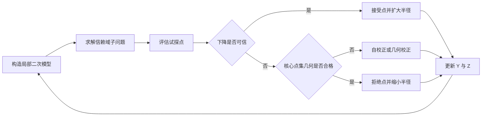
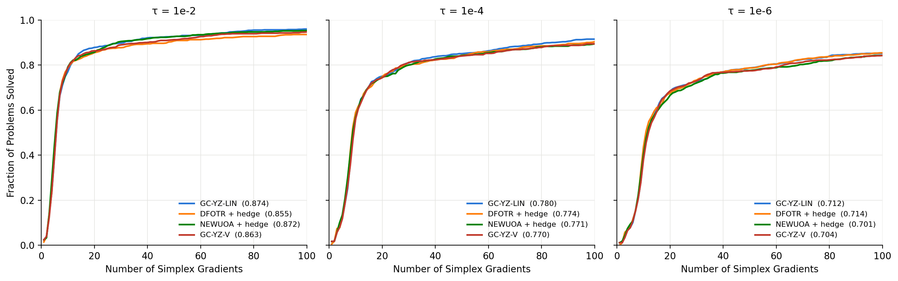
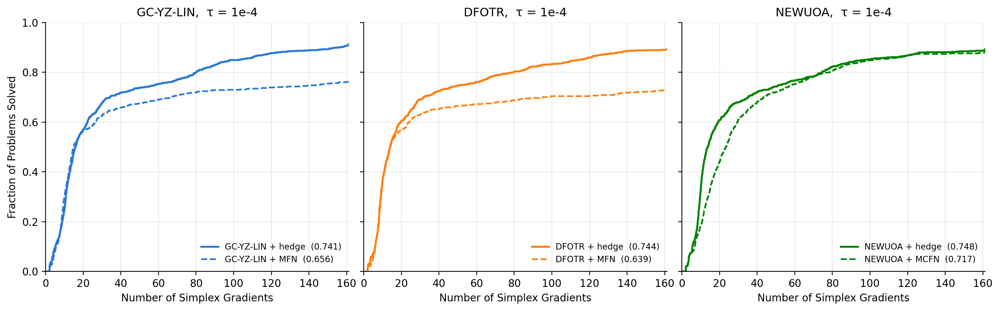
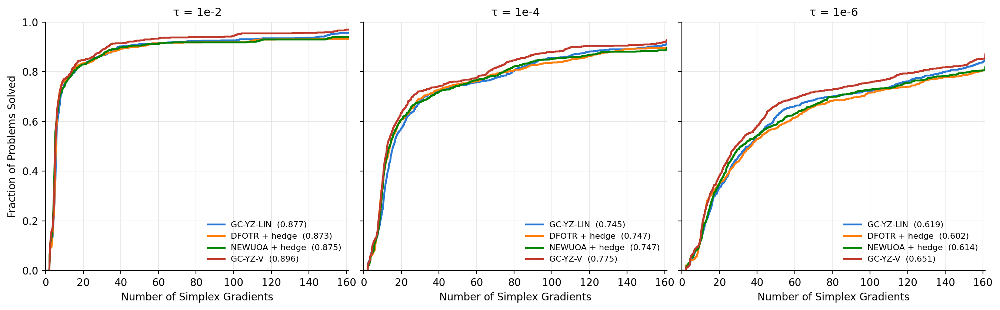
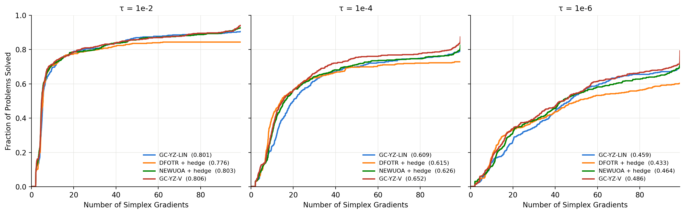
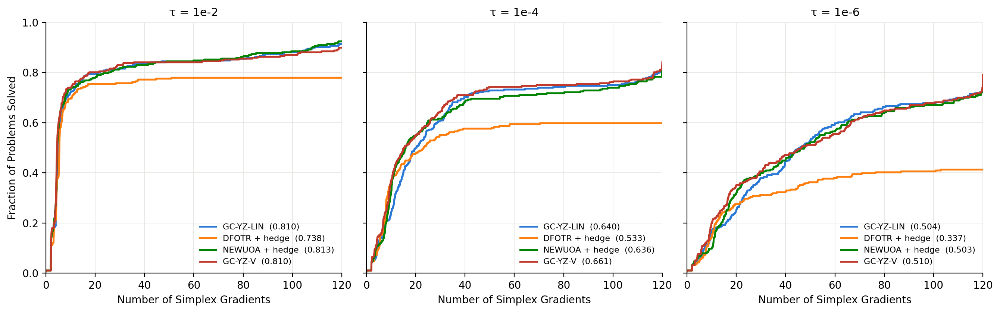
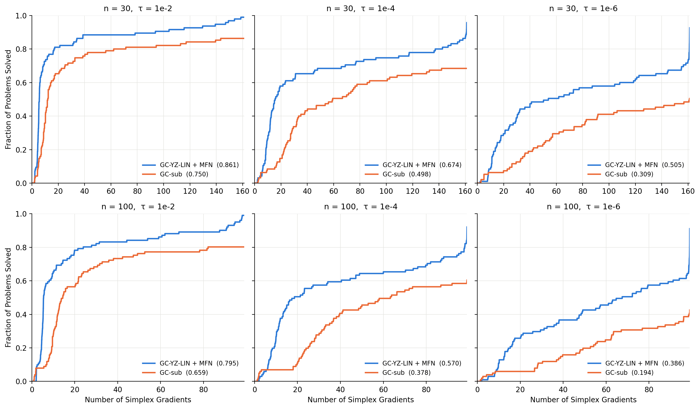
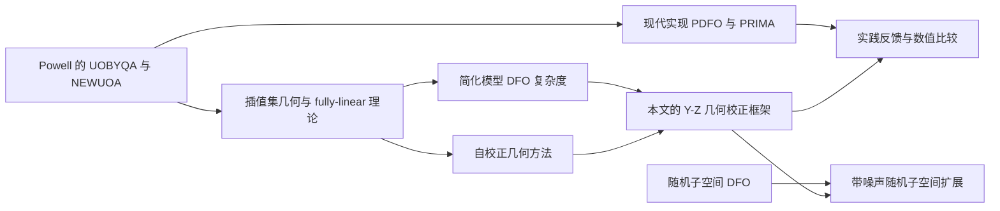

# Powell-Style Model-Based Derivative-Free Optimization with Complexity Guarantees

## 核心信息

- **中文题目**：具有复杂度保证的 Powell 风格模型无导数优化
- **作者**：Abraar Chaudhry、Katya Scheinberg、Scholar Sun
- **机构**：科罗拉多大学博尔德分校、佐治亚理工学院
- **发布时间**：2026-09-08，当前材料对应 arXiv v1
- **研究主题**：模型无导数信赖域、插值集几何维护、确定性噪声、随机子空间、函数调用复杂度
- **本地材料**：[原始 PDF](../../01-raw/Powell_Style_Model_Based_Derivative_Free_Optimization_with_Complexity_Guarantees.pdf) | [解析 Markdown](../../02-markdown/Powell_Style_Model_Based_Derivative_Free_Optimization_with_Complexity_Guarantees.md)
- **在线版本**：[arXiv](https://arxiv.org/abs/2609.09441) | [PDF](https://arxiv.org/pdf/2609.09441)

> **一句话结论：** 这篇论文第一次把接近 Powell 实际实现方式的“自校正加几何校正”样本维护纳入完整复杂度分析，并把确定性噪声与随机子空间统一进同一套框架；理论贡献扎实，但最漂亮的随机子空间复杂度尚未转化为有竞争力的实现，而实验中表现最好的 GC-YZ-V 又暂时没有对应理论。

## 摘要翻译

### 英文摘要

We propose variants of model-based trust region derivative free algorithms that are closest to methods initially proposed and implemented by Powell in [22, 21]. These methods rely on low degree polynomial interpolation and carefully maintain geometry of the interpolation sets. We are able to derive complexity bounds for these methods that make them theoretically competitive to other derivative free methods. Applying these methods in randomly generated subspaces recovers what we believe to be nearly tight complexity. This paper builds on recent results in [11] where complexity of a much simplified version of Powell’s methods was derived. Here we extend the analysis to fully incorporate Powell’s geometry handling approach, and conduct extensive numerical comparison of the model-based trust region methods connecting practical and theoretical performance. We also extend the analysis of subspace model-based trust region methods initially developed in [11] to the case of noisy function evaluations.

### 中文翻译

本文提出若干模型信赖域无导数优化算法的变体，它们比已有理论方法更接近 Powell 最初提出并实现的算法。这类方法依赖低阶多项式插值，并谨慎维护插值点集的几何性质。作者为这些方法建立了复杂度界，使其在理论上可以与其他无导数方法竞争。进一步把这些方法用于随机生成的子空间后，可以得到作者认为接近紧致的复杂度。

本文建立在近期工作 [11] 对 Powell 方法简化版本的复杂度分析之上。与该工作相比，本文完整纳入 Powell 风格的几何维护策略，对模型信赖域方法开展较全面的数值比较，从而连接实践表现与理论保证；同时还把子空间模型信赖域方法的分析扩展到带噪声函数评估的情形。

### 核心要点提炼

1. **理论对象更接近真实 Powell 方法**：不再依赖频繁完全重建模型，而是每次只替换少量样本点，在利用已有函数值的同时修复几何。
2. **统一自校正与几何校正**：试探点即使未被接受，也可以用于更新插值集；若几何仍不合格，再主动寻找高 Lagrange 多项式值的点。
3. **允许二次模型但只维护线性几何**：用一个核心点集保证一阶模型精度，额外点用于拟合曲率，从而降低几何维护成本。
4. **显式处理确定性噪声**：假设函数值误差有统一上界，推导可达到精度的噪声地板。
5. **随机子空间改善维度依赖**：当子空间维数固定时，理论上的维度依赖可由近似二次降到近似线性。
6. **理论与实现仍有距离**：全空间方法的表现具有竞争力，但随机子空间实现明显落后；最佳经验变体 GC-YZ-V 也未被现有定理覆盖。

## 研究背景与动机

### 问题设定

论文研究无约束光滑非凸问题：

$$
\min_{x\in\mathbb{R}^n}\phi(x)
$$

算法不能访问梯度，只能调用一个不精确的零阶 oracle。其误差满足：

$$
\left|f(x)-\phi(x)\right|\le\epsilon_f
$$

目标是在尽量少的函数评估后找到一个近似一阶稳定点：

$$
\Vert\nabla\phi(x_\epsilon)\Vert\le\epsilon
$$

这里的核心成本不是线性代数，而是函数评估。这个假设适合目标值来自昂贵仿真、实验或黑箱程序的场景。

### 为什么 Powell 方法难以分析

Powell 的 UOBYQA、NEWUOA、BOBYQA 等算法在实践中很成功，但它们并不是“每一轮重新采一整套点再拟合模型”。更典型的做法是：

1. 保留过去已经计算过的函数值。
2. 每轮只新增一个或两个函数评估。
3. 根据试探步和 Lagrange 多项式，决定替换哪个旧点。
4. 同时平衡函数下降与样本几何质量。

这种机制评估效率高，却让迭代之间高度耦合。较早的复杂度分析常通过完全重建模型或加入临界性步骤来简化证明，因此与 Powell 的真实实现存在明显距离。

### 本文要填补的缺口

前序论文 **On Complexity of Model-Based Derivative-Free Methods** 已证明一个简化的 Powell 风格方法能够获得有竞争力的最坏情形复杂度，但它会丢弃一些潜在有用的点，也未完整覆盖本文关注的噪声和实用模型维护机制。

本文要回答三个问题：

1. 保留 Powell 风格的自校正和几何校正后，能否仍然给出函数调用复杂度？
2. 当函数评估带有不可消除的确定性噪声时，算法最多能达到什么精度？
3. 随机低维子空间能否把高维问题的维度依赖降下来，而且仍保留噪声下的保证？

## 方法概述

### 基础信赖域框架

在第 $k$ 次迭代，算法在当前点 $x_k$ 附近构造二次模型：

$$
m_k(x_k+s)=f(x_k)+g_k^\top s+\frac{1}{2}s^\top H_ks
$$

然后在半径为 $\Delta_k$ 的球内近似最小化该模型，得到试探步 $s_k$ 。模型预测下降与实际函数值下降的比值为：

$$
\rho_k=
\frac{f(x_k)-f(x_k+s_k)}
{m_k(x_k)-m_k(x_k+s_k)}
$$

一次迭代可能有三种结果：

1. **成功迭代**：实际下降与模型预测足够一致，并且模型梯度不相对信赖域半径过小；接受试探点并扩大半径。
2. **模型改进迭代**：试探点不被接受，但当前样本集几何不足；保持半径，优先修复模型。
3. **失败迭代**：模型几何已经足够好，但试探步仍失败；拒绝试探点并缩小半径。

### Fully-linear 模型为什么关键

论文用 fully-linear 条件把“样本几何好不好”转化为“模型是否足够准确”。模型在当前信赖域内需要满足：

$$
\Vert\nabla m_k(x_k)-\nabla\phi(x_k)\Vert
\le\kappa_{eg}\Delta_k
$$

以及

$$
\left|m_k(x_k+s)-\phi(x_k+s)\right|
\le\kappa_{ef}\Delta_k^2
$$

一旦模型 fully-linear 且半径相对真实梯度足够小，迭代就必须成功。于是复杂度证明可以分成两部分：先数成功和失败迭代，再数为了恢复 fully-linear 模型所需的几何校正迭代。

### Lagrange 多项式与样本几何

给定插值点集 $Y=\{y_1,\ldots,y_p\}$ ，对应的 Lagrange 多项式满足第 $i$ 个多项式在自己的插值点取值 1，在其他插值点取值 0。

如果在整个信赖域内，每个 Lagrange 多项式的绝对值都不超过 $\Lambda$ ，则称点集是 $\Lambda$-poised。直观上：

- $\Lambda$ 较小表示插值点方向分布均衡，模型对扰动不敏感。
- $\Lambda$ 很大表示插值矩阵接近退化，微小函数值误差可能造成很大的梯度误差。
- 最大 Lagrange 多项式值还直接告诉算法“替换哪个点，几何改善最多”。

当 $Y$ 含有 $n$ 个点、 $\Lambda=1+\mathcal{O}(1/n)$ 且模型 Hessian 有界时，模型梯度误差常数满足：

$$
\kappa_{eg}=\mathcal{O}(\sqrt{n})
$$

这一步把几何质量、维度依赖与最终复杂度连接起来。

### Y-Z 分离：线性几何支撑二次模型

算法 2 同时维护两个点集：

- $Y_k$ 含 $n$ 个核心点，显式维护线性 Lagrange 多项式及 $\Lambda$-poised 性。
- $Z_k$ 保存额外点，用于拟合二次曲率，但只按距离等较便宜的规则维护。

模型通过带 Hessian 范数约束的最小二乘问题拟合。 $Y_k$ 上要求精确插值， $Z_k$ 上最小化残差。这样既可以使用二次模型，又不必维护完整二次插值集的昂贵几何。

### 自校正与几何校正

模型维护按以下优先级进行：

1. 删除离当前信赖域过远的 $Y_k$ 点。
2. 若试探点对应某个 Lagrange 多项式值很大，用试探点替换该多项式对应的旧点，这就是自校正。
3. 若几何仍不满足 $\Lambda$-poised，主动最大化某个 Lagrange 多项式并在该位置采样，这就是几何校正。
4. 把未被 $Y_k$ 使用但仍有信息的点加入 $Z_k$，或替换 $Z_k$ 中更远的点。

### 随机子空间版本

随机子空间方法每轮选择一个列正交矩阵 $Q_k\in\mathbb{R}^{n\times q}$，只在其张成的 $q$ 维子空间里构造和优化模型。试探步写成：

$$
s_k=Q_kv_k
$$

若随机子空间与真实梯度有足够投影，子空间步就能产生全空间意义上的进展。为了处理确定性噪声，算法 3 做了两项关键修改：

1. 在实际下降的分子中加入 $2\epsilon_f$，放宽成功判定。
2. 强制 $\Delta_k\ge\Delta_{\min}$，避免半径小到噪声完全淹没模型信号。

修改后的比值是：

$$
\rho_k=
\frac{f(x_k)-f(x_k+s_k)+2\epsilon_f}
{m_k(x_k)-m_k(x_k+s_k)}
$$

这两个修改不是工程细节，而是带固定噪声时证明成立的必要条件。

## 理论结果

### 噪声决定可达到的精度地板

函数值噪声进入差分或插值梯度后，会产生与 $\epsilon_f/\Delta_k$ 同量级的误差。半径太大时局部截断误差大，半径太小时噪声放大，因此最优平衡通常在：

$$
\Delta_k=\mathcal{O}(\sqrt{\epsilon_f})
$$

在本文的维度缩放下，可保证的一阶精度需要满足：

$$
\epsilon=\Omega(\sqrt{n\epsilon_f})
$$

这意味着固定噪声下不能无限逼近稳定点。维度越高，相同函数值噪声对应的最优性地板越差。

### 全空间复杂度

定理 4.1 证明：从任意几何状态出发，连续模型改进阶段的函数调用次数至多为 $\mathcal{O}(n\log n)$，其中额外依赖 $\Lambda$ 的部分只有双重对数。

取 $\Lambda=1+1/n$ 后，算法 2 的总函数调用复杂度为：

| 参数选择 | 函数调用复杂度 | 解释 |
|---|---:|---|
| $\eta_2=\sqrt{n}$ | $\mathcal{O}(n^{3/2}\log n/\epsilon^2)$ | 利用更强的模型梯度门控，改善维度依赖 |
| $\eta_2$ 为常数 | $\mathcal{O}(n^2\log n/\epsilon^2)$ | 更接近实现中的小常数选择，但理论维度依赖较差 |

这里的 $\log n$ 正是维护 Powell 式几何而付出的理论代价。它换来的是每次模型改进通常只使用一到两个新函数值，而不是直接重建整套模型。

### 随机子空间复杂度

若每次使用 $q$ 维随机子空间，并把最小半径取为：

$$
\Delta_{\min}=\Theta(\sqrt{\epsilon_f})
$$

则有限差分子空间方法的期望函数调用复杂度为：

$$
\mathbb{E}[\mathcal{C}_\epsilon]
\le\mathcal{O}\left(\frac{nq}{\epsilon^2}\right)
$$

加入 Powell 风格几何校正后，算法 4 的界变为：

$$
\mathbb{E}[\mathcal{C}_\epsilon]
\le\mathcal{O}\left(\frac{nq\log q}{\epsilon^2}\right)
$$

当 $q$ 是固定小常数时，主导维度依赖近似为线性 $n$ 。这是论文最强的复杂度结论。

### 复杂度结论的准确边界

- 目标函数必须有下界并具有 Lipschitz 连续梯度。
- 模型 Hessian 需要沿迭代保持有界。
- 确定性噪声需要存在已知统一上界 $\epsilon_f$ 。
- 随机子空间每轮“足够对齐”的条件概率必须严格大于一半。
- 子空间结论是期望复杂度，不是每条随机轨迹都满足的确定性界。
- 大 $O$ 隐藏了信赖域参数、Lipschitz 常数、模型误差常数和初始函数差距。

## 实验结果

### 实验设置

实验使用 CUTEst 无约束测试问题，并按维度分组：

| 组别 | 维度 | 问题数 | 最大插值集规模 |
|---|---:|---:|---:|
| 低维 | $2\le n\le5$ | 174 | 完整二次插值规模 |
| 中维 | $n=30$ | 95 | $2n+1$ |
| 高维 | $n=100$ | 101 | $2n+1$ |
| 高维 | $n=200$ | 92 | $2n+1$ |

主要比较方法包括 GC-YZ-LIN、GC-YZ-V、NEWUOA、DFOTR 和随机子空间版本 GC-sub。作者用数据剖面比较在给定函数评估预算下求解成功的问题比例，精度阈值取 $10^{-2}$ 、 $10^{-4}$ 和 $10^{-6}$ 。

### 低维结果

> 图1：在 $2\le n\le5$ 时，各方法曲线非常接近。此时插值集可以很快填满，GC-YZ-LIN/V 与 NEWUOA 的模型差异被削弱，因此几何维护策略的优势尚不明显。

### 自适应 Hessian 拟合

> 图2：实线为论文提出的 hedge 模型，虚线为各求解器默认拟合。GC-YZ-LIN 的面积分数由 0.656 提升到 0.741，DFOTR 由 0.639 提升到 0.744，NEWUOA 由 0.717 提升到 0.748。

Hedge 模型同时拟合最小 Frobenius 范数模型与最小 Hessian 变化模型，再用预测误差的指数滑动平均选择当前模型。这个改动对所有求解器都有帮助，也是实验中最稳定的工程增益之一。

### 维度 30

> 图3：在 $n=30$ 时，GC-YZ-V 在三个精度阈值下都取得最高面积分数；在 $10^{-6}$ 下，GC-YZ-V 为 0.651，GC-YZ-LIN 为 0.619，NEWUOA 为 0.614，DFOTR 为 0.602。

### 维度 100

> 图4：维度升高后，缺少显式几何维护的 DFOTR 开始明显落后。在 $10^{-6}$ 下，GC-YZ-V、NEWUOA、GC-YZ-LIN 和 DFOTR 的面积分数分别约为 0.486、0.464、0.459 和 0.433。

### 维度 200

> 图5：在最严格的 $10^{-6}$ 阈值下，DFOTR 的面积分数降到 0.337，而 GC-YZ-LIN、NEWUOA 和 GC-YZ-V 仍约为 0.504、0.503 和 0.510。几何维护在高维和高精度阶段的重要性最明显。

### 随机子空间结果

> 图6：GC-sub 在 $n=30$ 和 $n=100$ 、三个精度阈值下都落后于全空间 GC-YZ-LIN。例如 $n=100$ 、阈值 $10^{-6}$ 时，两者面积分数约为 0.194 与 0.386。

随机子空间的理论维度依赖更好，但实现需要在每次重抽子空间时至少重新获得 $\mathcal{O}(q)$ 个点，而且不能充分利用全空间二次曲率。全空间算法在实践中往往只需要少量连续几何校正，因此它远未达到理论最坏情形；这解释了“子空间理论更优、实际反而更慢”的表面矛盾。

### 实验结论

1. 自适应 Hessian 拟合对各求解器都有稳定收益。
2. 高维时，显式几何维护可以防止信赖域半径过早坍缩。
3. GC-YZ-LIN 只维护线性核心几何，却能基本匹配维护完整二次几何的 NEWUOA。
4. GC-YZ-V 整体最好，但它使用的 NEWUOA 风格二次自校正规则尚未被理论覆盖。
5. GC-sub 的当前实现没有兑现随机子空间复杂度的潜在优势。

## 深度分析

### 理论贡献

1. **把 Powell 式局部更新纳入复杂度分析**：证明不必周期性完全重建模型，也能控制达到合格几何所需的额外函数评估。
2. **用 Y-Z 分离连接线性几何与二次模型**：理论只要求一个 $n$ 点核心集保持良好几何，剩余点仍可贡献曲率信息。
3. **给出噪声下的明确精度地板**：把函数值噪声、维度与一阶稳定性精度联系起来。
4. **把随机子空间扩展到固定确定性噪声**：通过放宽接受比和设置半径下限，补上已有子空间分析中的缺口。
5. **证明几何校正次数只有近线性开销**：行列式增长论证说明连续几何修复不会无限持续。

### 优势

- 理论对象比许多已有分析更接近实际 Powell 求解器。
- 把算法设计、几何证明、复杂度和 CUTEst 实验串成了完整链条。
- 明确区分函数评估成本与额外线性代数成本，符合昂贵黑箱场景。
- 直接比较 NEWUOA、DFOTR 与不同几何维护强度，实验问题针对性强。
- 对随机子空间表现不佳给出了合理解释，没有用理论界掩盖经验失败。

### 局限性

- **理论参数与实践参数差距很大**：较优复杂度要求 $\eta_2=\sqrt{n}$ 和 $\Lambda=1+1/n$ ，实现却使用 $\eta_2=5\times10^{-9}$ 、 $\Lambda=1000$ 。前者要求非常严格的几何，后者只在几何极差时修复。
- **Hessian 有界条件在实现中几乎不激活**：实验把上界 $K$ 设为 $10^{100}$，这有利于拟合极端曲率，却使理论常数的实际含义变弱。
- **噪声理论缺少对应数值验证**：论文扩展了确定性噪声分析，但主要实验仍是标准 CUTEst 测试，没有系统改变 $\epsilon_f$ 来验证精度地板。
- **需要知道噪声上界**：子空间算法的接受规则和 $\Delta_{\min}$ 都依赖 $\epsilon_f$，实际黑箱程序通常很难给出可靠的统一误差界。
- **最佳经验方法没有理论**：GC-YZ-V 优于 GC-YZ-LIN 与 NEWUOA，但二次 Lagrange 自校正规则尚未进入复杂度证明。
- **随机子空间实现仍不成熟**：频繁初始化、没有跨子空间复用点、固定 $q=5$，都会抵消低维子问题的优势。
- **适用范围有限**：理论针对无约束、光滑目标和有界确定性噪声，不直接覆盖约束、非光滑或重尾随机噪声。
- **预印本阶段**：当前是 arXiv v1，尚未经过正式同行评审，复杂证明仍有必要由社区独立核查。

### 理论与实践的核心张力

论文最值得继续追问的地方不是某个复杂度指数，而是“什么样的几何才值得花函数评估去修复”。最坏情形理论偏好很小的 $\Lambda$ ，因为它给出紧的模型误差常数；实验却表明 $\Lambda=1000$ 更有效，因为大多数实际迭代并不接近最坏几何。

这说明下一步可能不应继续固定一个全局阈值，而应根据近期模型预测误差、半径变化和函数下降，自适应决定几何修复强度。论文的 hedge 模型已经沿这个方向迈出一步，但只用于选择 Hessian 拟合方式，还没有用于调节 $\Lambda$ 、 $\eta_2$ 或子空间重抽频率。

### 适用场景

- 单次函数评估昂贵，而中等规模线性代数相对便宜。
- 目标函数平滑，但梯度无法获得或不可信。
- 希望使用 NEWUOA 风格的局部二次建模，同时需要可解释的评估复杂度。
- 维度中等，完整二次插值集过大，但 $2n+1$ 个点仍可接受。
- 函数值存在稳定、可估计的确定性误差上界。

### 不适用或需谨慎的场景

- 梯度可低成本准确计算。
- 函数评估噪声是重尾、时变或没有统一上界。
- 目标明显非光滑，或包含复杂约束。
- 极高维问题中，连 $\mathcal{O}(n)$ 个核心点也无法维护。
- 需要随机子空间方法立即获得比全空间方法更强的实际表现。

## 与相关论文对比

### **On Complexity of Model-Based Derivative-Free Methods**（Chaudhry and Scheinberg, 2025/2026）

- [论文链接](https://arxiv.org/abs/2510.14935)
- **关系**：本文的直接前序工作。
- **前序贡献**：证明简化的模型信赖域方法可以达到与其他 DFO 方法同量级的最坏情形复杂度，并提出随机子空间版本。
- **本文扩展**：保留更多历史样本点，完整纳入自校正与几何校正，允许二次模型，并处理固定确定性噪声。
- **代价**：更真实的几何维护带来 $\log n$ 或 $\log q$ 因子，证明也明显更复杂。

### **Self-Correcting Geometry in Model-Based Algorithms for Derivative-Free Unconstrained Optimization**（Scheinberg and Toint, 2010）

- [论文链接](https://doi.org/10.1137/090748536)
- **关系**：提供本文自校正思想的重要理论来源。
- **核心思想**：利用正常试探步自然改善插值集，而不是频繁进入独立几何修复阶段。
- **本文推进**：把自校正与主动几何校正结合，并给出函数调用复杂度，而不只讨论渐近收敛。

### **Scalable Subspace Methods for Derivative-Free Nonlinear Least-Squares Optimization**（Cartis and Roberts, 2023）

- [论文链接](https://arxiv.org/abs/2102.12016)
- **关系**：随机子空间模型 DFO 的代表性前序路线。
- **前序重点**：在随机低维子空间中构造局部模型，降低高维非线性最小二乘的线性代数成本，并给出高概率复杂度。
- **本文差异**：研究一般光滑目标，强调函数调用复杂度和 Powell 式几何维护，并进一步纳入固定确定性噪声。
- **后续联系**：Cartis 与 Roberts 的 2026 年[复杂度说明](https://arxiv.org/abs/2608.17307)指出，适当缩放 Johnson-Lindenstrauss 变换也能达到接近线性的维度依赖。

### **PDFO 与 PRIMA**（Ragonneau and Zhang, 2024; Zhang, 2023）

- [PDFO 论文](https://doi.org/10.1007/s12532-024-00257-9) | [PRIMA 项目](https://github.com/libprima/prima)
- **关系**：代表 Powell 方法的现代工程实现，也是本文实践动机的重要来源。
- **工程贡献**：PDFO 提供 Python 与 MATLAB 接口，PRIMA 则重写并现代化 COBYLA、UOBYQA、NEWUOA、BOBYQA 和 LINCOA。
- **本文定位**：不是替代这些软件，而是解释为何接近它们核心机制的算法可以拥有有竞争力的复杂度保证。

## 技术路线定位

本文位于“Powell 实践算法”和“现代最坏情形复杂度理论”的交界处。它最重要的价值不是发明一个完全不同的新求解器，而是证明许多过去被认为过于复杂、难以分析的几何维护机制并不必然牺牲复杂度保证。

## 未来工作建议

1. 为 GC-YZ-V 的二次 Lagrange 自校正规则建立复杂度分析。
2. 设计自适应的 $\Lambda$ 、 $\eta_2$ 与 Hessian 上界，缩小理论参数和最佳实践参数的差距。
3. 在随机子空间重抽时复用历史样本点，避免每次至少重新评估 $\mathcal{O}(q)$ 个点。
4. 允许不完整初始点集，从一个或两个点逐步生长子空间模型。
5. 把确定性统一噪声界扩展为随机噪声、高概率噪声或可在线估计的噪声模型。
6. 增加受控噪声实验，直接验证 $\epsilon=\Omega(\sqrt{n\epsilon_f})$ 的精度地板。
7. 同时报告函数评估、线性代数时间和内存成本，避免只看 oracle 次数。
8. 扩展到有约束问题，并研究与 COBYLA、BOBYQA、LINCOA 的对应关系。

## 我的综合评价

| 维度 | 分数 | 理由 |
|---|---:|---|
| 创新性 | 8.0/10 | 把接近 Powell 实现的几何维护、确定性噪声和随机子空间放进统一复杂度框架 |
| 技术质量 | 8.5/10 | 证明链条完整，行列式增长与 fully-linear 模型的连接清晰，但复杂常数仍需独立核查 |
| 实验充分性 | 7.5/10 | CUTEst 维度覆盖和基线较好，但缺少噪声实验，随机子空间设置也较有限 |
| 写作质量 | 7.8/10 | 主线明确且愿意讨论负面结果，不过算法与常数较多，阅读门槛较高 |
| 实用性 | 7.5/10 | 全空间实现具有竞争力，随机子空间和理论参数尚未直接转化为最佳实践 |

**总体评分：7.9/10。** 这是连接 Powell 方法实践与复杂度理论的一篇重要工作。理论推进比算法命名本身更有价值；最值得关注的后续，不是再增加一个变体，而是把 GC-YZ-V、自适应几何阈值和样本复用纳入可证明框架。

### 突出亮点

- 证明“每轮只换少量点”的 Powell 风格维护不会导致不可控的几何修复开销。
- 用 Y-Z 分离在较低几何成本下支持二次模型。
- 明确揭示固定噪声、维度与可达精度之间的关系。
- 对随机子空间实践失败的分析坦率而有启发性。

### 可借鉴点

- 用可计算的代理量把抽象误差条件转化为算法事件。
- 把复杂算法拆成成功、失败和模型改进三类事件分别计数。
- 用行列式势函数证明几何校正的有限性。
- 在实验中把模型拟合策略作为独立变量，而不是把所有收益归因于主算法。

### 批判性思考

- 如果最佳实践长期偏好大 $\Lambda$ 和极小 $\eta_2$，那么最优维度复杂度是否描述了实际运行区域？
- 确定性噪声界通常未知，能否从重复评估或局部残差在线估计 $\epsilon_f$？
- 子空间方法若复用全空间历史点，是否仍能保持当前独立随机子空间分析？
- GC-YZ-V 的成功是否表明“完整二次自校正”比“严格线性几何保证”更值得优先分析？

> **关键启示：** Powell 方法的有效性不只是来自二次模型，而是来自对历史函数值、试探步和插值几何的精细复用；本文证明这种复用可以被复杂度理论捕捉，但理论上最优的几何强度并不等于实践中最划算的几何强度。

> **注意事项：**
> - 复杂度界衡量函数评估次数，不代表总运行时间；高维线性代数仍可能成为瓶颈。
> - 随机子空间的近线性维度依赖是期望最坏情形结果，当前数值实现没有优于全空间方法。
> - GC-YZ-V 的最佳实验表现不在现有定理覆盖范围内。
> - 论文是 2026 年 9 月发布的 arXiv v1，结论应随后续版本和同行评审继续核对。

## 我的笔记

[留白，供后续阅读时补充问题、公式推导和复现实验记录。]

## 相关论文

- **On Complexity of Model-Based Derivative-Free Methods**（Chaudhry and Scheinberg, 2025/2026）— 本文直接前序工作，分析更简化的模型维护机制。
- **Self-Correcting Geometry in Model-Based Algorithms for Derivative-Free Unconstrained Optimization**（Scheinberg and Toint, 2010）— 自校正插值几何的理论基础。
- **Scalable Subspace Methods for Derivative-Free Nonlinear Least-Squares Optimization**（Cartis and Roberts, 2023）— 随机子空间模型 DFO 的代表路线。
- **PDFO: A Cross-Platform Package for Powell's Derivative-Free Optimization Solvers**（Ragonneau and Zhang, 2024）— Powell 求解器的现代接口与工程基线。

## 外部资源

- [本文 arXiv 页面](https://arxiv.org/abs/2609.09441)
- [前序复杂度论文](https://arxiv.org/abs/2510.14935)
- [PDFO 代码仓库](https://github.com/pdfo/pdfo)
- [PRIMA 代码仓库](https://github.com/libprima/prima)
- [CUTEst 测试集](https://github.com/ralna/CUTEst)
