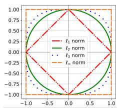
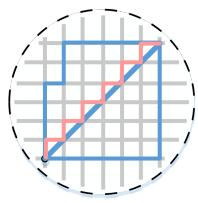
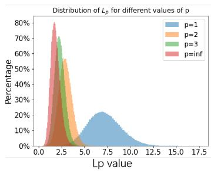
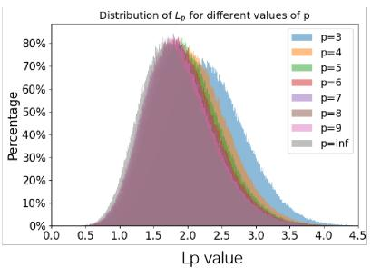
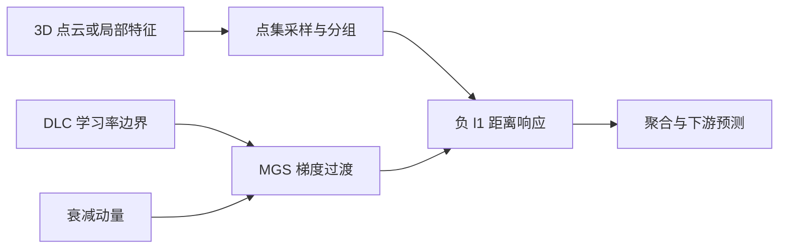
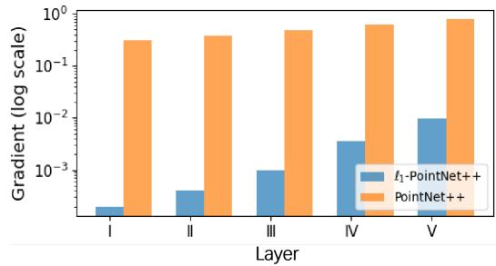
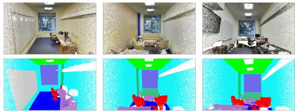
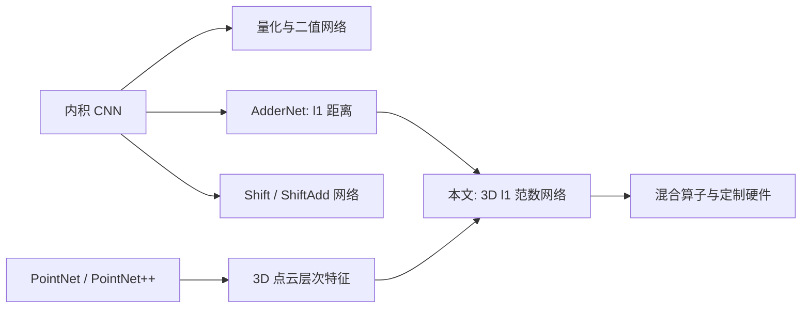

# Rethinking 3D Convolution in $\ell_p$-Norm Space

## 核心信息

- **中文译题**：在 $\ell_p$ 范数空间中重新思考 3D 卷积。
- **作者**：Li Zhang、Yan Zhong、Jianan Wang、Zhe Min、Rujing Wang、Liu Liu。
- **发表信息**：NeurIPS 2024 主会，*Advances in Neural Information Processing Systems 37*，页码 91012–91035。
- **DOI**：`10.52202/079017-2889`。
- **论文定位**：把传统内积响应替换为输入块与卷积核的范数距离，并将 $\ell_1$ 距离网络适配到 3D 点云任务。
- **正式链接**：[NeurIPS 论文页](https://proceedings.neurips.cc/paper_files/paper/2024/hash/a55dd7fc416d91fbb3817defe6a75df6-Abstract-Conference.html) | [PDF](https://proceedings.neurips.cc/paper_files/paper/2024/file/a55dd7fc416d91fbb3817defe6a75df6-Paper-Conference.pdf) | [OpenReview PDF](https://openreview.net/pdf?id=kMxdV4Blhn)
- **本地原文**：[论文 Markdown](../../02-markdown/Rethinking_3D_Convolution_in_lp-norm_Space.md)。
- **代码状态**：论文 checklist 称代码在补充材料中；未核验到独立的公开代码仓库。

> **一句话结论：** 这篇论文的实质是“3D 版 AdderNet + 专用优化”：前向用负 Manhattan 距离代替内积，反向用从 $\ell_2$ 型梯度向 $\ell_1$ 符号梯度过渡的 MGS，再配合 DLC 学习率约束；精度基本持平，理论能耗显著降低，但当前 GPU 实际延迟反而略高。

## 摘要翻译

### 英文摘要

Convolution is a fundamental operation in the 3D backbone. However, under certain conditions, the feature extraction ability of traditional convolution methods may be weakened. In this paper, we introduce a new convolution method based on $\ell_p$-norm. For theoretical support, we prove the universal approximation theorem for $\ell_p$-norm-based convolution, and analyze the robustness and feasibility of $\ell_p$-norms in 3D point cloud tasks. Concretely, $\ell_\infty$-norm-based convolution is prone to feature loss. $\ell_2$-norm-based convolution is essentially a linear transformation of the traditional convolution. $\ell_1$-norm-based convolution is an economical and effective feature extractor. We propose customized optimization strategies to accelerate the training process of $\ell_1$-norm-based Nets and enhance the performance. Besides, a theoretical guarantee is given for convergence by a regret argument. We apply our methods to classic networks and conduct related experiments. Experimental results indicate that our approach exhibits competitive performance with traditional CNNs, with lower energy consumption and instruction latency.

### 中文翻译

卷积是 3D 骨干网络中的基本操作，但在某些条件下，传统卷积的特征提取能力可能被削弱。本文提出一种基于 $\ell_p$ 范数的新卷积方法。在理论上，作者证明了 $\ell_p$ 范数卷积的通用逼近定理，并分析了 $\ell_p$ 范数在 3D 点云任务中的鲁棒性与可行性。具体而言， $\ell_\infty$ 卷积容易丢失特征； $\ell_2$ 卷积本质上是传统卷积的线性变换； $\ell_1$ 卷积则是经济而有效的特征提取器。作者为 $\ell_1$ 网络设计了专用优化策略，用于加快训练并提高性能，还通过 regret 分析给出了收敛保证。该方法被应用于多种经典网络。实验表明，其性能可与传统 CNN 竞争，同时具有更低的能耗和理论指令延迟。

### 核心要点

- **问题**：内积仅测量投影；输入块若近似与核正交，响应接近零，作者将这解释为特征丢失。
- **方法**：用负 $\ell_p$ 距离作为相似度；最终选择 $p=1$ 以用加减与绝对值取代大量乘法。
- **优化**：MGS 在训练早期使用平滑的差值梯度，后期过渡到符号梯度；DLC 把学习率限制在两个随迭代衰减的边界之间。
- **理论**：给出集函数的通用逼近声称、高斯噪声下的方差对比，以及凸在线优化设定下 $O(\sqrt{T})$ 的 regret 上界。
- **实验**：在 ShapeNet、S3DIS 和 GarmentNets Simulation 上与原骨干网络基本持平，S3DIS 的算术能耗估算下降约 $61\%$ 。
- **关键但书**：能耗是依据操作次数和旧硬件单操作常数估算的，不是整机实测；论文明确报告当前 GPU 上推理略慢。

## 研究背景与动机

### 从内积到距离

把一个局部输入块 $P_t$ 和核 $K$ 展平成向量后，传统卷积计算的是内积：

$$
C(P_t,K)=\sum_{i=1}^{m}\sum_{j=1}^{n}P_t(i,j)K(i,j)
$$

它可以理解为“输入在核方向上的投影”。作者关注一个几何极端情形：当 $P_t$ 接近与 $K$ 正交的子空间时， $C(P_t,K)$ 接近零。因此，作者尝试用距离代替投影：

$$
D_p(P_t,K)=\left(\sum_{i=1}^{m}\sum_{j=1}^{n}\left|P_t(i,j)-K(i,j)\right|^p\right)^{1/p}
$$

距离越小表示越相似，所以实际神经元响应取负值。对 $p=1$ ，得到：

$$
Y(P_t,K)=-\sum_{i=1}^{m}\sum_{j=1}^{n}\left|P_t(i,j)-K(i,j)\right|
$$

这与 AdderNet 的核心响应形式相同。本文的新问题不是“ $\ell_1$ 能否做卷积”，而是“它能否在不规则 3D 点集的层次特征提取中稳定训练，并展示理论与效率价值”。

> 图 1a：二维情形下不同 $p$ 对单位球几何的改变。 $p=1$ 对应菱形， $p=2$ 对应圆， $p$ 越大则越接近方形。

> 图 1b： $\ell_1$ 神经元用 Manhattan 距离衡量输入与核的差异，每个维度都会贡献绝对值差，不像 $\ell_\infty$ 只保留最大差异维度。

### 为什么最后选 $\ell_1$

| 选择 | 作者的判断 | 笔记解读 |
|---|---|---|
| $\ell_\infty$ | 只保留最大绝对差，易丢失其他维度信息 | 对高维局部特征来说是非常激进的聚合 |
| $\ell_p, p\ge3$ | 九维高斯模拟中，分布逐渐接近 $\ell_\infty$ | 这是低维特定分布的经验观察，不是对任意特征的定理 |
| $\ell_2$ | 展开平方后包含内积项 | 只在输入块模长可视为常数等条件下，才能近似视为经典卷积的仿射变换 |
| $\ell_1$ | 所有维度均参与，前向主要是减法、绝对值和加法 | 在定制硬件上有潜在能效优势，但反向优化更困难 |

> 图 2：作者在维度为 9 的标准高斯向量上比较 $\Vert G\Vert_p$ 的分布。这帮助解释为何实验不再逐一考察所有 $p\ge3$ ，但证据范围只限这一模拟设定。

## 方法概述

### 整体流程

前向路径与基线 PointNet、PointNet++、3DCNN 或 GarmentNets 保持一致，只替换指定的特征映射层。难点集中在反向传播：绝对值的导数只保留符号，而端到端梯度的幅值还可能远小于原网络。

### MGS：混合梯度策略

纯 $\ell_1$ 响应对核元素的局部导数是：

$$
g_1(P_t,K)=sgn\left(P_t-K\right)
$$

符号梯度舍弃了差值大小，可能与最速下降方向不对齐。论文在 S3DIS 的首次迭代中还观察到， $\ell_1$-PointNet++ 第一层权重梯度范数约为 $0.0002$ ，原 PointNet++ 约为 $0.3162$ 。

> 图 3：纵轴为对数刻度。前三层是 PointNet++ 的 SetAbstraction 模块，后两层为全连接层。梯度数量级差异是设计 MGS 的直接实验动机。

MGS 使用以训练步 $k$ 指数衰减的权重，在差值梯度与符号梯度之间过渡：

$$
g_k(P_t,K)=\left(1-\lambda^k\right)sgn\left(P_t-K\right)+\lambda^k\left(P_t-K\right)
$$

其中 $0<\lambda<1$ 。当 $k$ 很小时， $\lambda^k$ 接近 $1$ ，更像平滑的 $\ell_2$ 型更新；当 $k$ 增大后，它逐渐回到 $\ell_1$ 符号梯度。

> **阅读时需注意：** 正文先给出了归一化 $\ell_2$ 导数，随后 MGS 式却使用未归一化的 $P_t-K$ 。因此它更准确地说是“差值梯度到符号梯度的退火”，不是严格的两个范数导数的凸组合。

### DLC：动态学习率控制器

DLC 不直接生成学习率，而是对任意基础学习率算法 $A$ 的输出做夹取。下界与上界分别为：

$$
\alpha_1(k)=p_1\left(1+\frac{p_2}{e^k}\right)
$$

$$
\alpha_2(k)=p_1\left(1+\frac{p_3}{k}\right)
$$

夹取后的临时学习率是：

$$
\alpha_c(k)=\min\left(\max\left(\alpha_1(k),A(\alpha(k))\right),\alpha_2(k)\right)
$$

在理论算法 OMD 中，真正步长再除以 $\sqrt{k}$ 。两个边界都逐渐趋向 $p_1$ ，直觉上允许早期较大更新，后期把步长拉回稳定范围。

### OMD：MGS、DLC 与动量的组合

算法使用逐步衰减的动量系数：

$$
q_k=q_0q^k
$$

$$
m_k=q_km_{k-1}+\left(1-q_k\right)g_k
$$

再对可行域 $\mathcal{F}$ 作投影更新。动量的作用是打破 signSGD 在某些旋转目标上可能出现的周期轨迹。

## 理论结果

### 通用逼近声称

对紧集 $J$ 中的有限点集 $S$ ，其中 $J$ 是 $\mathbb{R}^d$ 的子集。若集函数 $f$ 对 Hausdorff 距离连续，论文声称存在 $\ell_p$-PointNet++ 使：

$$
\left|f(S)-\mathcal{P}(S)\right|\le\epsilon
$$

证明思路沿用 PointNet 的软占据构造：把空间划分成细网格，用局部响应表示每个网格是否被点占据，再用 max pooling 得到一个有限维占据向量。网格足够细时，重构点集与原点集的 Hausdorff 距离小于给定阈值，因而可以逼近 $f$ 。

论文还声称，对任意 $\ell_1$ 可积函数 $g$ ，存在网络 $\mathcal{P}'$ 使：

$$
\int_J\left|g(x)-\mathcal{P}'(x)\right|dx<\epsilon
$$

这一部分借用径向基函数网络的稠密性定理，但论文把范数函数本身当作径向基核，存在关键条件疑问，见后文“证据边界”。

### 高斯噪声下的方差

对独立高斯噪声矩阵 $G$ ，内积噪声项为：

$$
G\cdot K=\sum_{i=1}^{m}\sum_{j=1}^{n}G(i,j)K(i,j)
$$

其方差为 $\sigma^2\Vert K\Vert_2^2$ 。若核元素规模不随维度收缩，则方差随 $mn$ 线性增长。论文对中心高斯向量的 $\ell_2$ 范数给出维度无关的上界：

$$
\mathbb{V}\left[\Vert G\Vert_2\right]<2-\frac{1}{m}
$$

当维度为 9、噪声标准差为 1 时，文中数值结果为：

| $p$ | 1 | 2 | 3 | 4 | 5 | 6 | $\infty$ |
|---|---:|---:|---:|---:|---:|---:|---:|
| $\mathbb{V}[\Vert G\Vert_p]$ | 3.24655 | 0.48327 | 0.31248 | 0.27494 | 0.26078 | 0.26093 | 0.26875 |

这一对比说明范数输出的随机波动可以比未归一化内积小，但不能直接等同于下游任务的对抗鲁棒性或传感器噪声鲁棒性。

### Regret 上界

在有界可行域、有界梯度和每轮损失凸的前提下，定理 2 声称：

$$
R_T=\sum_{k=1}^{T}h_k(x_k)-\min_{x\in\mathcal{F}}\sum_{k=1}^{T}h_k(x)\le C_1\sqrt{T}+C_2
$$

因此当 $T$ 增大时，平均 regret $R_T/T$ 趋近于 0。这证明了一个抽象在线凸优化算法的 no-regret 性质，但它不是对实际深度网络非凸损失收敛到局部或全局最优点的证明。

## 实验结果

### 数据集与设置

| 数据集 | 任务 | 规模与指标 |
|---|---|---|
| ShapeNet Part | 全局形状的部件分割 | 16,881 个形状、16 类对象、50 种部件；指标为点级 mIoU |
| S3DIS | 室内场景语义分割 | 6 个区域、271 个房间、13 类；指标为 mIoU 与总体准确率 |
| GarmentNets Simulation | 服装规范姿态估计 | 6 种服装、约 1.72 TB；指标为对称 Chamfer 距离 |

通用设置为 AdamW、初始学习率 $10^{-3}$ 、权重衰减 $10^{-4}$ 、cosine decay、batch size 32、200 epochs、3 张 GeForce GTX 3090。GarmentNets 实验的 batch size 为 16。

### ShapeNet 部件分割

| 骨干 | 传统版 mIoU | $\ell_1$ 版 mIoU | 差值 |
|---|---:|---:|---:|
| 3DCNN | 79.4 | 79.4 | 0.0 |
| PointNet | 83.7 | 83.3 | -0.4 |
| PointNet++ | 86.2 | **86.5** | +0.3 |

结果支持的是“精度基本持平”，而不是稳定超越。分类别看， $\ell_1$-PointNet++ 在飞机、汽车、火箭等类别改善，但在帽子、椅子、耳机、灯等类别下降。论文把某些改善解释为 Manhattan 距离对稀疏、尺寸较大物体的长距离点更敏感，但没有额外的密度分层实验验证这一机制。

### S3DIS 场景语义分割与能耗估算

| 模型 | mIoU | 总体准确率 | 估算算术能耗 |
|---|---:|---:|---:|
| PointNet | 47.7 | **78.6** | 7.981 $\mu J$ |
| $\ell_1$-PointNet | 47.6 | 77.9 | **3.471 $\mu J$** |
| PointNet++ | 53.5 | **83.0** | 3.395 $\mu J$ |
| $\ell_1$-PointNet++ | **53.9** | 82.9 | **1.328 $\mu J$** |

$\ell_1$-PointNet++ 的 mIoU 提高 0.4 个百分点，总体准确率下降 0.1 个百分点，估算算术能耗从 3.395 $\mu J$ 降到 1.328 $\mu J$ ，降幅约 $60.9\%$ 。该能耗是用浮点加法 $0.9$ pJ、乘法 $3.7$ pJ 与操作次数相乘得到，未计入绝对值、数据搬运、内存层次、内核调度和硬件利用率。

> 图 4：上排为彩色点云输入，下排为相同视角下的语义分割输出。可视化说明输出与基准质量相当，但未展示与基准的逐点差异图。

### GarmentNets 密集姿态估计

| 模型 | Dress | Jumpsuit | Skirt | Top | Pants | Shirt | 六类均值 |
|---|---:|---:|---:|---:|---:|---:|---:|
| GarmentNets | 1.94 | **1.45** | 2.00 | 1.30 | 1.03 | 1.70 | 1.57 |
| $\ell_1$-GarmentNets | **1.83** | 1.56 | **1.91** | **1.26** | **0.99** | **1.62** | **1.53** |

指标为厘米，越低越好。 $\ell_1$ 版在 6 类中有 5 类更好，简单平均由约 1.57 降至 1.53；Jumpsuit 则由 1.45 变差到 1.56。由于论文未报告标准差或显著性，这些小差异宜解读为“性能可比”。

### 消融实验

S3DIS 上的优化消融最有信息量：

| 模型 | MGS | DLC | mIoU | 总体准确率 |
|---|---|---|---:|---:|
| $\ell_1$-PointNet 原始训练 | 否 | 否 | 33.2 | 56.3 |
| $\ell_1$-PointNet | 是 | 否 | 39.6 | 68.6 |
| $\ell_1$-PointNet | 否 | 是 | 42.8 | 70.1 |
| $\ell_1$-PointNet | 是 | 是 | **47.6** | **77.9** |
| $\ell_1$-PointNet++ 原始训练 | 否 | 否 | 38.9 | 55.6 |
| $\ell_1$-PointNet++ | 是 | 否 | 43.6 | 69.3 |
| $\ell_1$-PointNet++ | 否 | 是 | 48.4 | 75.6 |
| $\ell_1$-PointNet++ | 是 | 是 | **53.9** | **82.9** |

三个结论比较明确：

1. 直接把内积换成 $\ell_1$ 距离会造成严重的优化失败。
2. DLC 单独使用比 MGS 单独使用更有效，说明学习率幅值问题可能比梯度形状问题更突出。
3. 两者组合才能恢复到原网络的精度水平；优化方法不是附加项，而是新算子可用的必要组成。

替换 PointNet++ 三个 SA 模块中的一个时，mIoU 为 51.9–52.5；替换两个时为 52.2–53.2。这显示替换位置与比例都有影响，也提示混合块可能比“全部替换”更实际。

## 深度分析

### 这篇论文真正新在哪里

1. **从 2D 加法网络推进到 3D 点云骨干**。论文不只在一个分类数据集上试验，而是覆盖部件分割、场景分割与服装姿态估计，还适配了 PointNet、PointNet++、3DCNN 和 GarmentNets。
2. **把可训练性放在核心位置**。MGS 是一种梯度同伦或退火思路：前向从开始就是 $\ell_1$ ，反向则从平滑代理逐渐回到真实符号导数。
3. **尝试补上理论图景**。论文同时讨论表达能力、噪声方差和优化 regret，这比只给出硬件动机与精度表更完整。

### 优势

- **数值结果克制且一致**：主要结论是“持平”，与三组任务数据基本吻合。
- **消融击中真正瓶颈**：原始 $\ell_1$ 网络和 MGS、DLC 组合的差距很大，能证明优化设计确实解决了实际问题。
- **易于嵌入已有模型**：替换局部映射算子即可，不需重写点采样、聚合和任务头。
- **定制硬件潜力清晰**：核心算术从 MAC 转向减法、绝对值和加法，对 ASIC、FPGA 或专用 SIMD 内核有可操作的设计空间。

### 局限性与证据边界

#### 1. 第二个通用逼近论证的 RBF 条件存疑

论文引用的 RBF 稠密性定理要求核 $K$ 有界、可积，且积分非零。然而 $K(x)=\Vert x\Vert_p$ 在 $\mathbb{R}^d$ 上既不有界，也不可积。因此，“范数函数显然满足三个条件”这一句按文中写法不成立。可能的修复方向是在范数外加可积的径向激活，例如快速衰减的函数，然后重新证明它可由所述网络表示。

#### 2. 噪声方差证明对平移项的处理不充分

附录用“加常数不会显著改变方差”将 $\mathbb{V}[\Vert G+P_t-K\Vert_2]$ 近似为 $\mathbb{V}[\Vert G\Vert_2]$ 。对范数这样的非线性函数，固定平移一般会改变分布，这一近似需要误差界。结论未必是错的，但当前推导没有完整支撑它。

#### 3. 内积与范数的方差不是完全对等的鲁棒性比较

内积方差随维度增长的结论依赖于核元素大小不随维度收缩；实际网络初始化和归一化常会让 $\Vert K\Vert_2$ 受控。此外，两个算子的输出尺度、均值和后续非线性都不同。因此原始响应方差小，不能单独证明分类或分割对噪声更鲁棒。

#### 4. $\ell_2$ 与经典卷积的“等价”需要强条件

展开得：

$$
\Vert P_t-K\Vert_2^2=\Vert P_t\Vert_2^2+\Vert K\Vert_2^2-2P_t\cdot K
$$

只有当输入块模长在不同 $t$ 间近似不变，且妥善处理核模长和平方根时，才能把输出视为内积响应的单调变换。对未归一化的点云局部块，这不是自动成立的。

#### 5. Regret 定理与真实训练之间有明显距离

定理需要凸损失、有界梯度和显式有界可行域，而实际 3D 网络损失非凸，实验又使用 AdamW 与 cosine decay。因此，该定理是对理想化 OMD 样式的理论支持，不能被解读为实验配置的直接收敛保证。

#### 6. 能耗优势是理论估算，尚未变成通用 GPU 延迟优势

论文自身承认，由于 CUDA 和 cuDNN 没有针对 Manhattan 距离做类似卷积的深度优化， $\ell_1$ 网络的实际推理略慢。加法比乘法便宜是算术层事实，但端到端性能取决于内存访问、算子融合、向量化、硬件吞吐和库支持。

#### 7. 实验对比和统计证据仍可加强

- 主要对比是同一骨干的内积版，缺少与现代高效点云网络的精度–吞吐–能耗联合比较。
- 未报告多随机种子均值、标准差或显著性，而很多主结果差异只有 $0.1$ 到 $0.4$ 个百分点。
- 没有直接的噪声扰动曲线，因此“更鲁棒”主要依赖理论代理指标，没有被下游实验强验证。

### 适用与不适用场景

| 更适合 | 不宜直接使用 |
|---|---|
| 有自定义 CUDA、FPGA 或 ASIC 开发能力的边缘 3D 感知 | 仅使用通用 cuDNN 且延迟是首要指标的部署 |
| 希望保留原骨干拓扑、仅替换局部算子的研究 | 需要不加改造就使用现成高度优化卷积内核的系统 |
| 对混合内积块和距离块进行自动搜索 | 要求已有完整非凸收敛理论或强对抗鲁棒证明的应用 |
| 对乘法成本特别敏感的定制芯片 | 当数据搬运或邻域构建已经占主要延迟时的管线 |

## 与相关论文对比

### **AdderNet: Do We Really Need Multiplications in Deep Learning?**（Chen 等，2020）

- [论文页](https://openaccess.thecvf.com/content_CVPR_2020/html/Chen_AdderNet_Do_We_Really_Need_Multiplications_in_Deep_Learning_CVPR_2020_paper.html)
- **关系**：最直接的前身。AdderNet 已经用负 $\ell_1$ 距离替代 2D CNN 内积，并专门设计反向传播和自适应学习率。
- **本文扩展**：把相同核心算子推向 3D 点云网络，增加范数方案比较、集函数通用逼近声称、高斯噪声方差分析和 regret 分析。
- **差异**：AdderNet 重点是 ImageNet 上的 2D 视觉精度与无乘法前向；本文重点是不规则点集上的迁移性和优化可行性。

### **PointNet++: Deep Hierarchical Feature Learning on Point Sets in a Metric Space**（Qi 等，2017）

- [论文页](https://papers.nips.cc/paper_files/paper/2017/hash/d8bf84be3800d12f74d8b05e9b89836f-Abstract.html)
- **关系**：主要实验载体和通用逼近论证的架构背景。PointNet++ 用分层采样、邻域分组和局部 PointNet 捕捉多尺度几何。
- **本文改造**：保留 SetAbstraction 的层次结构，把其局部特征映射中的内积替换为 $\ell_1$ 距离。
- **要点**：PointNet++ 本来就在度量空间中组织点；本文进一步把“度量”放进可学习神经元的响应函数。

### **ShiftAddNet: A Hardware-Inspired Deep Network**（You 等，2020）

- [论文页](https://proceedings.neurips.cc/paper/2020/hash/1cf44d7975e6c86cffa70cae95b5fbb2-Abstract.html)
- **关系**：同属无乘法或低乘法网络技术路线。
- **差异**：ShiftAddNet 组合位移和加法层，并在 FPGA 上进行硬件实测；本文用 $\ell_1$ 距离重写相似度，能耗主要依据算术次数估算。
- **启示**：若要将本文的“理论节能”变成有说服力的系统结论，ShiftAddNet 式的 FPGA 或 ASIC 实测是下一步。

## 技术路线定位

本文位于两条技术线的交叉点：一条是从内积转向加法、位移或低比特算术的能效网络；另一条是为不规则 3D 点集设计局部、分层特征提取器。它的位置不是发明 $\ell_1$ 神经元，而是证明这一算子能以专用优化方法迁移到多种 3D 骨干和密度任务。

## 未来工作建议

1. **修正并收紧理论**：为 RBF 逼近选择真正有界、可积的径向核；用 Gaussian Poincare 不等式等工具给出含平移项的方差上界。
2. **把理论鲁棒性变成任务实验**：在不同高斯噪声、离群点、丢点和密度偏移强度下绘制精度曲线，并与范数归一化的内积基线比较。
3. **实测端到端效率**：报告 GPU、CPU、FPGA 或 ASIC 上的墙钟延迟、吞吐、峰值内存、平均功率与单样本能耗。
4. **搜索混合替换策略**：把每个 SA 块使用内积还是距离视为可学习或可搜索的离散选择，直接优化精度–延迟–能耗前沿。
5. **优化器与定理对齐**：明确实验中 AdamW、MGS、DLC 和 cosine decay 的实际组合方式，并对该实用版给出更贴近非凸随机优化的分析。
6. **扩展到现代 3D 算子**：考察稀疏卷积、点–体素混合网络、图卷积和点 Transformer，判断瓶颈到底是相似度计算还是邻域构建与内存访问。

## 我的综合评价

| 维度 | 分数 | 理由 |
|---|---:|---|
| 创新性 | 7.4/10 | $\ell_1$ 加法神经元并非首创，但把它系统迁移到 3D 点云、提出 MGS/DLC 并覆盖多种任务，是有价值的扩展 |
| 技术质量 | 6.2/10 | 方法直观、消融有力，但通用逼近、方差近似和 $\ell_2$ 等价性都有需要补强的条件或论证 |
| 实验充分性 | 6.8/10 | 三类任务、多种骨干和关键消融较完整；缺少硬件实测、噪声实验、多种子统计与现代效率基线 |
| 写作质量 | 6.5/10 | 主线清晰，但部分符号、公式索引和“等价”、“鲁棒”的表述过强，附录也有条件遗漏 |
| 实用性 | 7.3/10 | 易于嵌入已有 3D 骨干，定制硬件潜力较高；现有 GPU 软件栈下尚不能兑现延迟优势 |
| **综合** | **6.9/10** | 一篇思路有启发性、实验现象有价值，但理论结论需带条件阅读的工作 |

> **关键启示：** 替换神经网络中的基础算子，往往不能只改前向函数；还必须为新算子重新设计梯度尺度、优化路径和硬件执行方式。

> **阅读注意：**
> - “理论节能 $61\%$ ”不等于“实际系统功耗下降 $61\%$ ”。
> - $O(\sqrt{T})$ regret 不等于非凸深度网络的端到端收敛证明。
> - 通用逼近的第二部分按文中核函数选择不满足所引 RBF 定理的条件。

## 我的笔记

- 

## 相关论文

- **AdderNet: Do We Really Need Multiplications in Deep Learning?**（Chen 等，CVPR 2020）——直接的 $\ell_1$ 加法网络前身。
- **PointNet++: Deep Hierarchical Feature Learning on Point Sets in a Metric Space**（Qi 等，NeurIPS 2017）——本文主要 3D 骨干基线与集函数表示背景。
- **ShiftAddNet: A Hardware-Inspired Deep Network**（You 等，NeurIPS 2020）——以位移和加法实现低乘法网络，提供硬件实测参照。
- **GarmentNets: Category-Level Pose Estimation for Garments via Canonical Space Shape Completion**（Chi 与 Song，ICCV 2021）——本文密集预测任务的骨干与数据来源。

## 外部资源

- [NeurIPS 2024 正式论文页](https://proceedings.neurips.cc/paper_files/paper/2024/hash/a55dd7fc416d91fbb3817defe6a75df6-Abstract-Conference.html)
- [NeurIPS 2024 正式 PDF](https://proceedings.neurips.cc/paper_files/paper/2024/file/a55dd7fc416d91fbb3817defe6a75df6-Paper-Conference.pdf)
- [OpenReview 版本](https://openreview.net/pdf?id=kMxdV4Blhn)
- [DOI 页面](https://doi.org/10.52202/079017-2889)
- [AdderNet 论文](https://openaccess.thecvf.com/content_CVPR_2020/html/Chen_AdderNet_Do_We_Really_Need_Multiplications_in_Deep_Learning_CVPR_2020_paper.html)
- [PointNet++ 论文](https://papers.nips.cc/paper_files/paper/2017/hash/d8bf84be3800d12f74d8b05e9b89836f-Abstract.html)
- [ShiftAddNet 论文](https://proceedings.neurips.cc/paper/2020/hash/1cf44d7975e6c86cffa70cae95b5fbb2-Abstract.html)
