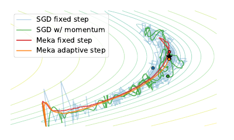
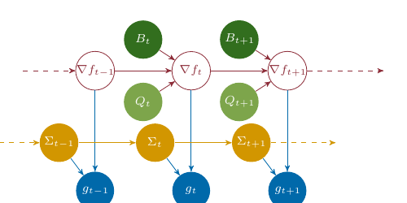
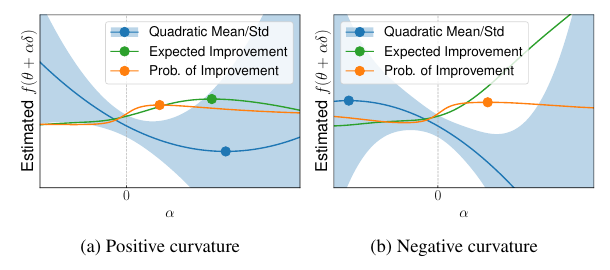
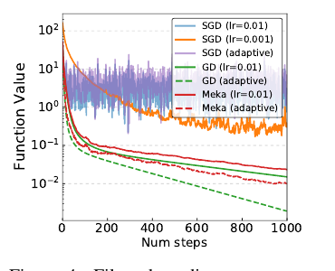
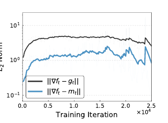
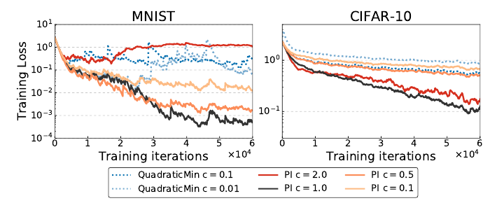
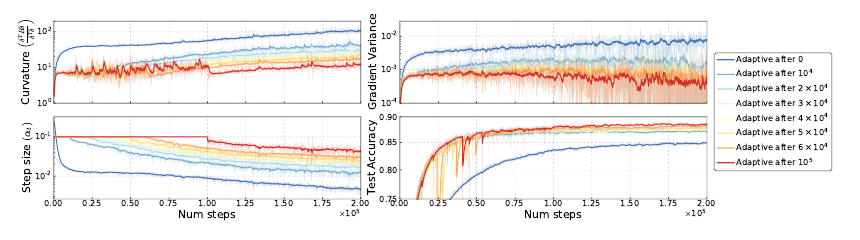
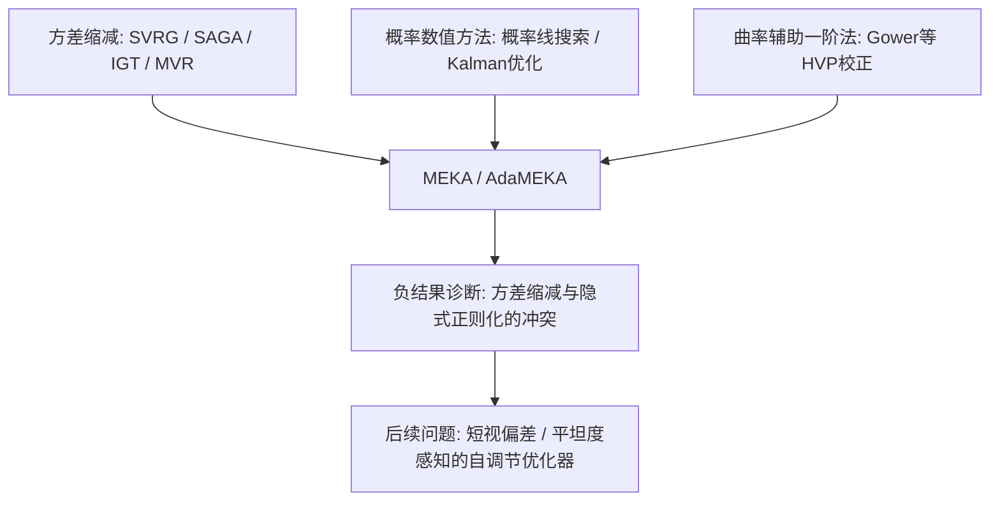

# Self-Tuning Stochastic Optimization with Curvature-Aware Gradient Filtering

## 核心信息

- **论文ID**：arXiv:2011.04803；正式收录于 PMLR v137（"I Can't Believe It's Not Better" Workshop @ NeurIPS 2020），编号 chen20a，页码 60–69。
- **作者**：Ricky T. Q. Chen、Dami Choi、Lukas Balles（三人同等贡献）、David Duvenaud、Philipp Hennig。
- **机构**：University of Toronto / Vector Institute；Max Planck Institute for Intelligent Systems（Tübingen）。
- **链接**：[arXiv](https://arxiv.org/abs/2011.04803) | [PMLR](https://proceedings.mlr.press/v137/chen20a.html) | [PDF](https://proceedings.mlr.press/v137/chen20a/chen20a.pdf)
- **论文类型**：方法 + 理论（噪声二次情形收敛证明）+ 负结果分析。发表在专门收录"想法合理但实验未达预期"工作的 ICBINB workshop，作者对方法在深度学习任务上未见增益的事实做了坦率的诊断。
- **说明**：手头 PDF（`chen20a-4.pdf`）为 10 页正文版本，不含附录 B/D/E/F；涉及附录的内容（步长滤波推导、三阶修正、完整实验配置）在本笔记中只能按正文引用转述。

> **一句话结论**
> 把"真实梯度"当作线性高斯动力系统的隐状态，用逐样本 Hessian 向量积做状态转移、逐样本方差做观测噪声，Kalman 滤波即可自动推断出方差缩减梯度与不确定性；再用改进概率（PI）自动选步长——整套流程无超参数、在噪声二次问题上有 $O(1/t)$ 收敛保证，但在深度网络上只能追平而非超越调优后的基线，原因被诊断为自适应步长会驶入高曲率高方差区域。

## 摘要翻译

### 英文摘要

Standard first-order stochastic optimization algorithms base their updates solely on the average mini-batch gradient, and it has been shown that tracking additional quantities such as the curvature can help de-sensitize common hyperparameters. Based on this intuition, we explore the use of exact per-sample Hessian-vector products and gradients to construct optimizers that are self-tuning and hyperparameter-free. Based on a dynamics model of the gradient, we derive a process which leads to a curvature-corrected, noise-adaptive online gradient estimate. The smoothness of our updates makes it more amenable to simple step size selection schemes, which we also base off of our estimates quantities. We prove that our model-based procedure converges in the noisy quadratic setting. Though we do not see similar gains in deep learning tasks, we can match the performance of well-tuned optimizers and ultimately, this is an interesting step for constructing self-tuning optimizers.

### 中文翻译

标准一阶随机优化算法只依据 mini-batch 平均梯度进行更新；已有研究表明，追踪曲率等额外量可以降低算法对常见超参数的敏感性。基于这一直觉，我们探索利用精确的逐样本 Hessian 向量积与逐样本梯度来构造自调节、无超参数的优化器。基于对梯度的动力学建模，我们推导出一个过程，得到经曲率校正、对噪声自适应的在线梯度估计。更新方向的平滑性使其更适合配合简单的步长选择方案，而步长选择同样基于我们估计出的量。我们证明该基于模型的过程在噪声二次情形下收敛。虽然在深度学习任务上没有看到类似增益，但我们能追平调优良好的优化器的表现；总体而言，这是构造自调节优化器的有意义一步。

### 核心要点提炼

- **研究动机**：SGD 一族的超参数（学习率、动量系数、调度）依赖人工调节；曲率与方差信息原则上可以把这些超参数"内生化"。
- **核心方法**：把 $\nabla f_t$ 视为隐 Markov 线性高斯系统的状态，用 Hessian 向量积 $B_t \delta_{t-1}$ 作状态转移、mini-batch 梯度 $g_t$ 作观测，Kalman 滤波给出后验 $\mathcal{N}(m_t, P_t)$；再对损失值 $f_t$ 做同样的滤波，用改进概率（PI）准则数值求解步长。
- **理论结果**：噪声二次问题上，滤波协方差以 $O(1/t)$ 收缩，常数步长即可获得 $E[f(\theta_t) - f_*] \in O(1/t)$（命题 1）。
- **实验结果**：合成问题上明显优于 SGD；MNIST/CIFAR-10 上 PI 步长天然处于正确量级（缩放因子 $c = 1$ 最优），梯度估计误差比 mini-batch 梯度小约 5 倍，但最终性能只能追平调优的基线，代价为 SGD 的 1.0–1.6 倍每步开销。
- **负结果诊断**：自适应步长使 MEKA 落入并停留在高曲率、高方差的尖锐极小值区域，而固定步长 SGD 会被梯度噪声"弹出"这些区域；作者猜想与一步前瞻式采集函数的 short-horizon bias 有关。

## 研究背景与动机

### 问题设定

论文考虑一般随机优化问题，即正文式 (1)：

$$
\arg\min_{\theta \in \mathbb{R}^d} f(\theta), \qquad f(\theta) = E_{\xi}[\tilde{f}(\theta, \xi)]
$$

只能获得样本 $\xi$。SGD 迭代 $\theta_{t+1} = \theta_t - \alpha_t g_t$，其中 mini-batch 梯度为正文式 (2)：

$$
g_t = \frac{1}{n} \sum_{i=1}^{n} \nabla_\theta \tilde{f}(\theta_t, \xi_t^{(i)}), \qquad \xi_t^{(1)}, \ldots, \xi_t^{(n)} \sim p(\xi)
$$

其中 $n$ 个样本独立同分布，$\alpha_t$ 是标量步长。

### 两个痛点

1. **梯度噪声导致扩散**：常数步长下 SGD 不收敛到最优点，而是在最优点附近进入扩散（diffusion）区（图 1、图 4 中可直接观察到）；收敛需要人工设计的递减步长调度。
2. **噪声方向不适合步长自适应**：方向本身不可靠时，基于局部模型的步长选择（如二次规则）会因高方差样本产生不可预测的行为甚至发散。传统补救是加 damping 常数和缩放因子，但这又引入了新的超参数。

> 图 1：二维问题上的优化轨迹。SGD 固定步长（浅蓝）在最优点附近进入扩散不再收敛，加动量（绿）仍明显震荡；MEKA 的滤波梯度（红）轨迹平滑地收敛，且平滑性使它能与自适应步长（橙）良好配合。

### 本文的切入点

近年自动微分工具（JAX 的 vmap、TensorFlow 的 auto-vectorization、BackPACK）使**逐样本**梯度和 Hessian 向量积可以在与 mini-batch 反向传播同阶的时间代价内算出。于是滤波模型所需的全部参数——状态转移量 $B_t \delta_{t-1}$、其方差 $Q_t$、观测方差 $\Sigma_t$——都能在每个 mini-batch 上**直接测量**而非人为设定。这是本文区别于既有 Kalman 优化工作的关键前提。

## 方法概述

### 核心思想

方法分两层，均建立在同一个线性高斯滤波框架上：

1. **梯度滤波（MEKA）**：推断真实梯度 $\nabla f_t$ 的后验分布，得到方差缩减的更新方向 $m_t$ 与不确定性 $P_t$。
2. **步长滤波 + 采集函数**：推断真实损失值 $f_t$ 的后验，进而得到 $f_{t+1} - f_t$ 的预测分布，用改进概率（PI）选出无需缩放的步长 $\alpha_t$。

> 图 2：隐 Markov 动力系统图模型。红色链是隐状态 $\nabla f_t$ 的转移（由 $B_t$、$Q_t$ 参数化），蓝色节点 $g_t$ 是观测（观测噪声 $\Sigma_t$）。所有动力学参数都能在每个 mini-batch 上被便宜地估计，并用 Kalman 滤波在时间上平滑；$\Sigma$ 本身再用指数滑动平均稳定（作者指出 EMA 本质上是另一种初等 Kalman 滤波）。

### 动力系统建模（第 2.1 节）

**观测模型**。假设 mini-batch 梯度服从高斯分布，即正文式 (3)：

$$
g_t \mid \nabla f_t \sim \mathcal{N}(\nabla f_t, \Sigma_t)
$$

依据：$g_t$ 是 $n$ 个 iid 项的均值（式 (2)），当 batch 足够大时中心极限定理支持高斯近似。$\Sigma_t$ 用逐样本梯度的经验方差直接估计。

**转移模型**。对梯度函数在 $\theta_t$ 处做一阶 Taylor 展开：

$$
\nabla f(\theta_{t-1}) \approx \nabla f(\theta_t) - \nabla^2 f(\theta_t) \delta_{t-1}
$$

其中 $\delta_{t-1} = \theta_t - \theta_{t-1}$ 是上一步的更新方向。用随机 Hessian 向量积 $B_t \delta_{t-1}$（满足 $E[B_t] = \nabla^2 f(\theta_t)$）近似梯度增量，再加高斯噪声假设，得正文式 (4)：

$$
\nabla f_t \mid \nabla f_{t-1} \sim \mathcal{N}(\nabla f_{t-1} + B_t \delta_{t-1}, Q_t)
$$

$Q_t$ 是 $B_t \delta_{t-1}$ 的协方差，刻画 $B_t$ 的抽样随机性。两点技术细节：

- 选择在 $\theta_t$（而非 $\theta_{t-1}$）处取 Hessian，使 $B_t \delta_{t-1}$ 与 $g_t$ 能在同一个 mini-batch 上、只多一次反向传播就同时算出，且全程不需要显式构造矩阵 $B_t$。
- 框架对 $\delta_t$ 的来源不敏感：无论 $\delta_t$ 怎么产生（后文取 $\delta_t = -\alpha_t m_t$），滤波推断本身都成立。

### Kalman 滤波推断（第 2.2 节，MEKA）

式 (3)(4) 构成线性高斯系统，对 $p(\nabla f_t \mid g_{1:t}, \delta_{1:t-1})$ 的精确推断就是标准 Kalman 滤波。定义先验/后验参数（正文式 (5)）：

$$
\nabla f_t \mid g_{1:t-1}, \delta_{1:t-1} \sim \mathcal{N}(m_t^-, P_t^-), \qquad \nabla f_t \mid g_{1:t}, \delta_{1:t-1} \sim \mathcal{N}(m_t, P_t)
$$

从先验 $\nabla f_0 \sim \mathcal{N}(m_0, P_0)$ 出发迭代（正文式 (6)–(8)）：

**预测步**（式 (6)）——用曲率把旧估计"搬运"到新参数点：

$$
m_t^- = m_{t-1} + B_t \delta_{t-1}, \qquad P_t^- = P_{t-1} + Q_{t-1}
$$

**Kalman 增益**（式 (7)）——按预测与观测各自的不确定性决定混合比例：

$$
K_t = P_t^- (P_t^- + \Sigma_t)^{-1}
$$

**校正步**（式 (8)）——用当前随机梯度观测修正预测（协方差用 Joseph 形式保证对称正定）：

$$
m_t = (I - K_t) m_t^- + K_t g_t, \qquad P_t = (I - K_t) P_t^- (I - K_t)^\top + K_t \Sigma_t K_t^\top
$$

优化时取 $\delta_t = -\alpha_t m_t$。该框架被命名为 **MEKA**（model-based Kalman-adjusted gradient estimation）。

两个使 MEKA 成立的要点（作者自己强调的）：

1. **滤波器参数全部可测**：$B_t \delta_{t-1}$、$Q_t$、$\Sigma_t$ 都由自动微分在当前 mini-batch 上直接算出，不存在需要手工设定的噪声参数——这是它与一般 Kalman 优化方法最大的差别。
2. **这是一阶更新而非二阶方法**：拟牛顿法用梯度差去**估计** Hessian 并求解线性系统；MEKA 反过来，用真实 Hessian 的（含噪）投影去**改进梯度估计**，不解线性系统，因此更便宜也更稳。

与动量法的关系：校正步 $m_t = (I - K_t)(m_{t-1} + B_t \delta_{t-1}) + K_t g_t$ 在结构上就是动量更新，但（i）历史项先经过曲率校正 $B_t \delta_{t-1}$ 再混合，(ii) 混合系数 $K_t$ 由不确定性自动决定而非固定的 $\beta$。这正是它被称为 Arnold et al. (2019) 隐式梯度传输的"显式形式"的原因。

### ADAM 风格的更新方向（第 2.3 节，AdaMEKA）

MEKA 做方差缩减，但不解决病态条件数问题（全批量梯度下降在病态问题上同样慢）。仿照 ADAM 用二阶矩逐元素缩放一阶矩，正文式 (9) 给出：

$$
\delta_t = -\alpha_t \frac{m_t}{\sqrt{m_t + \mathrm{diag}(P_t)} + \varepsilon}
$$

其中 $\varepsilon = 10^{-8}$ 仅为数值稳定。区别于 ADAM 用两个 EMA 估计一、二阶矩，这里的矩估计直接来自滤波后验。该变体称 **AdaMEKA**。

> **注意事项（原文疑点）：** 按 ADAM 的对应关系，分母中的二阶矩应为 $E[(\nabla f_t)^2] = m_t^2 + \mathrm{diag}(P_t)$（逐元素平方加后验方差），而正文式 (9) 印刷为 $m_t + \mathrm{diag}(P_t)$，第一项缺少平方。从量纲看（分母应与 $m_t$ 同量纲、根号内应为其平方量纲），$m_t^2$ 才自洽；此处按原文转录并标注疑似排版笔误。

### 不确定性感知的步长选择（第 3 节）

**出发点：二次规则及其缺陷**。若 $f$ 可精确计算，最小化局部二次近似

$$
f(\theta_t + \alpha_t \delta_t) - f_t \approx \alpha \delta_t^\top \nabla f_t + \frac{\alpha^2}{2} \delta_t^\top \nabla^2 f_{t-1} \delta_t
$$

给出步长 $\alpha_{\mathrm{quadratic}} = \frac{-\delta_t^\top \nabla f_t}{\delta_t^\top \nabla^2 f_{t-1} \delta_t}$。但随机情形下直接用高方差样本代入会导致发散；常见补救（damping 常数 + 缩放因子）重新引入超参数——与"自调节"的目标矛盾。

**本文方案**。对损失值 $f_t$ 也建立同样的线性高斯动力系统（推导在附录 B，本 PDF 不含），得后验（正文式 (10)）：

$$
f_t \mid y_{1:t}, \delta_{1:t-1} \sim \mathcal{N}(u_t, s_t)
$$

设 $f_{t+1} = f(\theta_t + \alpha_t \delta_t)$，则损失变化量的预测分布为正文式 (11)：

$$
f_{t+1} - f_t \mid y_{1:t}, g_{1:t}, \delta_{1:t} \sim \mathcal{N}\left( \alpha_t \delta_t^\top m_t + \frac{\alpha_t^2}{2} \delta_t^\top B_t \delta_t, \ 2 s_t + \alpha_t^2 \delta_t^\top P_t \delta_t + \frac{\alpha_t^4}{4} \delta_t^\top Q_t \delta_t \right)
$$

结构解读（各项依据）：均值就是二次近似，只是把真值换成后验均值 $m_t$、$B_t$；方差三项分别来自——损失观测的不确定性 $s_t$（系数 2 是因为 $f_{t+1}$ 与 $f_t$ 两端都有噪声）、梯度不确定性 $P_t$（随 $\alpha^2$ 增长）、曲率不确定性 $Q_t$（随 $\alpha^4$ 增长）。步长越大，越依赖外推，方差增长越快——这正是"对大步长的不确定性惩罚"的来源，也是不再需要人工 damping 的原因。

**采集函数**。在 $f_{t+1} - f_t$ 的高斯预测分布上最大化**改进概率**（PI，Kushner 1964），正文式 (12)：

$$
\alpha_{\mathrm{PI}} = \arg\max_{\alpha} P(f_{t+1} - f_t \le 0 \mid y_{1:t}, g_{1:t})
$$

即式 (11) 的 CDF 在 0 处取值。等价的可计算形式为正文式 (13)：

$$
\alpha_{\mathrm{PI}} = \arg\min_{\alpha} \frac{-\alpha \delta_t^\top m_t + \frac{\alpha^2}{2} \delta_t^\top B_t \delta_t}{\sqrt{2 s_t + \alpha^2 \delta_t^\top P_t \delta_t + \frac{\alpha^4}{4} \delta_t^\top Q_t \delta_t}}
$$

单变量问题，用牛顿法数值求解，不需要额外的函数求值。负曲率显著的问题加三阶修正项保证步长有限且为正（附录 B.2，本 PDF 不含）。

> **注意事项（原文疑点）：** 对高斯变量 $Z \sim \mathcal{N}(\mu, \sigma^2)$，$P(Z \le 0) = \Phi(-\mu / \sigma)$，最大化它等价于最小化 $\mu / \sigma$；按式 (11) 的均值，分子第一项应为 $+\alpha \delta_t^\top m_t$。正文式 (13) 印刷为 $-\alpha \delta_t^\top m_t$，与式 (11) 相差第一项符号，疑似符号笔误（或隐含了对 $\delta_t$ 方向的另一种符号约定）。此处按原文转录并标注。

> 图 3：基于局部二次估计的均值与方差，不同采集函数选出的步长。(a) 正曲率情形：二次最小点（蓝）落在不确定性快速增大的区域时是糟糕的选择，PI（橙）在 0 与二次最小点之间插值、避开高不确定性区域；EI（绿）常给出需要额外缩放的步长。(b) 负曲率情形：二次规则完全失效，PI 仍给出有限的合理步长。

### 实践实现（第 4 节）

- **逐样本量的计算**：依赖 JAX vmap 等自动向量化,对每个样本独立算梯度与 Hessian 向量积，从而得到 $\Sigma_t$、$Q_t$ 的经验估计。
- **标量化协方差**：不用满协方差，把 $\Sigma_t$、$Q_t$ 近似为 $\sigma_t I$、$q_t I$（对全维度取平均）。作者试过对角矩阵，但标量形式更稳定、基准上普遍更好。
- **EMA 平滑**：对 $\sigma_t$ 与自适应步长 $\alpha_t$ 再做系数 0.999 的指数滑动平均；在 0.9/0.99/0.999 间几乎不敏感（附录 F）——这是全流程中唯一残留的类超参数，但对取值不敏感。

## 理论结果：噪声二次情形的收敛（第 6 节）

### 问题构造与滤波方程的化简

考察正文式 (14) 的玩具问题：

$$
f(\theta, \xi) = \frac{1}{2} (\theta - \xi)^\top H (\theta - \xi)
$$

即 Hessian 相同、中心由数据 $\xi$ 决定的二次函数族。逐条代入定义可得三个关键化简：

1. 全梯度 $\nabla f(\theta) = H(\theta - E[\xi])$，逐样本梯度 $\nabla f(\theta, \xi) = \nabla f(\theta) - H(\xi - E[\xi])$，故梯度噪声是加性的，协方差 $\Sigma = H \mathrm{Cov}[\xi] H^\top$ 与 $\theta$ 无关（观测模型 (3) 精确成立且 $\Sigma_t$ 恒定）。
2. 逐样本 Hessian $\nabla^2 f(\theta, \xi) = H$ 与 $\xi$ 无关，因此 Hessian 向量积无噪声：$Q_t = 0$，且转移是**精确**的——$B_t \delta_{t-1} \equiv \nabla f_t - \nabla f_{t-1}$（二次函数的梯度增量恰为 $H \delta$，Taylor 展开无余项）。
3. 于是滤波方程 (6)–(8) 化简为正文式 (15)：

$$
K_t = P_{t-1} (P_{t-1} + \Sigma)^{-1}, \qquad m_t = (I - K_t)(m_{t-1} + B_t \delta_{t-1}) + K_t g_t, \qquad P_t = (I - K_t) P_{t-1}
$$

初始化 $m_0 = g_0$、$P_0 = \Sigma$。

### 为什么 $P_t$ 以 $O(1/t)$ 收缩

考察标量情形（矩阵情形在 $P_0 = \Sigma$ 且可同时对角化时逐特征方向同理）。由 $P_t = (I - K_t) P_{t-1}$ 与 $K_t = P_{t-1}(P_{t-1} + \Sigma)^{-1}$：

$$
P_t = \frac{\Sigma}{P_{t-1} + \Sigma} P_{t-1}
$$

代入 $P_0 = \Sigma$ 逐步验证：$P_1 = \Sigma / 2$，$P_2 = \Sigma / 3$，归纳可得 $P_t = \Sigma / (t + 1)$。直观依据：由于转移无噪声（$Q = 0$）且搬运精确，$m_t$ 等价于把历史上所有观测 $g_1, \ldots, g_t$ 都精确搬运到当前点后取平均——$t + 1$ 个独立同方差观测的均值方差正是 $\Sigma / (t + 1)$。滤波器随 $t$ 收敛到精确梯度，这就是常数步长下不发生扩散的机制（对比 SGD：其每步梯度方差恒为 $\Sigma$，不随 $t$ 减小）。

### 命题 1

**命题 1（原文）**：设问题形如式 (14)，$H$ 的特征值满足 $\mu \le \lambda_i(H) \le L$（$\mu > 0$）。若按 $\theta_{t+1} = \theta_t - \alpha m_t$ 更新，$\alpha \le 1/L$，$m_t$ 由式 (15) 得到，则 $E[f(\theta_t) - f_*] \in O(1/t)$。

推理链条（证明在附录，本 PDF 不含，以下为按正文信息重建的逻辑骨架）：$m_t$ 是 $\nabla f_t$ 的无偏估计且 $E[\Vert m_t - \nabla f_t \Vert^2] = \mathrm{tr}(P_t) = O(1/t)$；对 $L$-光滑 $\mu$-强凸目标，带 $O(1/t)$ 均方误差梯度的下降迭代，其期望次优间隙由"确定性线性收敛项 + 噪声项"控制，噪声项逐步衰减后整体为 $O(1/t)$。对照标准结论：同样问题上常数步长 SGD 只能收敛到 $O(\alpha \Sigma)$ 的噪声球，递减步长 SGD 达到 $O(1/t)$ 但需要调度——MEKA 用常数步长自动达到同阶速率，调度被滤波"内生化"了。

> 图 4：$d = 20$、条件数大于 1000 的噪声二次问题（$\xi \sim \mathcal{N}(0, I)$）。SGD 大步长（浅蓝）进入扩散，小步长（橙）慢；GD（绿）作为无噪声参照收敛良好且自适应步长进一步加速；MEKA（红）固定步长下几乎贴着 GD 的轨迹，自适应步长再有改进。SGD 配自适应步长（紫）反而不稳——噪声方向不适合步长自适应，这正是第 2 节动机的直接验证。注意此问题的真实噪声协方差是满矩阵，与实现中标量协方差假设不符，MEKA 仍表现良好。

## 实验结果（第 7 节）

### 实验设置

| 项目 | 配置 |
|---|---|
| 数据集 | MNIST（MLP）、CIFAR-10（CNN、ResNet-32） |
| 实现 | JAX vmap 逐样本梯度与 Hessian 向量积 |
| 结构改动 | BatchNorm 替换为 GroupNorm（BN 的跨样本耦合破坏"梯度样本独立"的建模假设） |
| 每步开销 | SGD 的 1.0–1.6 倍（多一次 HVP 反向传播） |
| 基线对比 | 与调优基线的完整对比在附录 D.1（本 PDF 不含） |

### 结果一：在线方差缩减确实有效

> 图 5：CIFAR-10 + CNN、无数据增广（使全数据集真梯度可精确计算）。滤波估计的误差 $\Vert \nabla f_t - m_t \Vert$（蓝）比 mini-batch 梯度误差 $\Vert \nabla f_t - g_t \Vert$（黑）小约 5 倍，且这一差距在整个训练过程中保持。滤波机制在深度网络上确实在做它声称的事——问题不出在梯度估计环节。

### 结果二：PI 步长天然处于正确量级

> 图 6：更新规则 $\theta_{t+1} = \theta_t + c \alpha_t \delta_t$ 中缩放因子 $c$ 的消融。二次最小点规则（虚线）必须配很小的 $c$（0.1/0.01）才不发散——即步长系统性偏大；PI 步长在 $c = 1.0$（黑实线）时最好，偏离 1 反而变差。"自动选出的步长不需要再人工缩放"是自调节声明中被实验支撑得最硬的一条。EI 则表现差且需要非单位缩放（附录 D）。

### 结果三（负结果）：自适应步长驶入高曲率高方差区域

> 图 7：ResNet-32 / CIFAR-10。多次运行同一初始化的 MEKA，各自在不同步数后从固定步长切换到自适应步长（颜色区分切换时刻）。四个面板：方向归一化曲率 $\delta^\top B_t \delta / \delta^\top \delta$、梯度方差、步长 $\alpha_t$、测试精度。

诊断结论（第 7.1 节）：

- 一旦切换到自适应步长，MEKA 立即落入曲率持续升高的区域并停留在那里，梯度方差也保持高位；越早切换（蓝色系曲线），最终测试精度越低。
- 机制解释：MEKA 的滤波使它**能够**在高方差高曲率区域内继续有效优化，于是它就地深入这个尖锐但可能非全局的极小值；固定步长 SGD 恰恰因为承受不了梯度噪声而被这类区域**排斥**，反而滑向更平坦的盆地。方差缩减在深度学习里去掉的可能不只是"噪声"，还有噪声带来的隐式正则化。
- 作者进一步猜想这与一步前瞻采集函数的 **short-horizon bias**（Wu et al., 2018）有关：只优化下一步的改进概率，会系统性偏向短期收益；多步前瞻或可缓解，但需额外算力。
- 保留意见：在极小值较少的问题类上，"能在高曲率高方差区域内优化"可能反而是优势——只是深度学习不属于这类问题。

## 深度分析

### 优势

1. **超参数真正被内生化，而非转移**。滤波器的全部参数（$B_t \delta$、$Q_t$、$\Sigma_t$）来自测量而非设定；PI 步长无需缩放因子（图 6 是直接证据）；唯一残留的 EMA 系数被验证为不敏感。相比之下，很多"自适应"方法只是把学习率的调节难度转移到了新超参数上。
2. **框架内部自洽**。动量系数对应 Kalman 增益、方差缩减对应滤波、步长 damping 对应预测分布的方差项——三个通常各自为政的机制被统一在一个概率模型里，每个量都有明确的推断语义。
3. **理论与机制验证扎实**。噪声二次情形给出 $O(1/t)$ 常数步长收敛；图 5 确认方差缩减在真实网络上成立；图 7 的多次切换实验把"为什么不 work"定位到了步长策略与损失景观的交互，而不是停留在"效果不好"。
4. **作为负结果论文的示范价值**。方法、验证、失败诊断三段俱全，图 7 的实验设计（同一初始化、不同切换时刻）对研究方差缩减与泛化关系的后续工作有独立价值。

### 局限性

1. **每步开销 1.0–1.6 倍但无最终收益**：深度学习任务上只能追平调优基线；若把额外算力折算成调参预算，实用优势不明确。
2. **建模假设与深度学习现实的错配**：高斯观测噪声、标量协方差 $\sigma_t I$（真实噪声协方差是满矩阵且高度各向异性）、一阶 Taylor 转移在大步长/高曲率下失真；BN 必须换成 GroupNorm 才能满足样本独立假设，限制了可用架构。
3. **核心负结果未被理论化**："方差缩减消除隐式正则化、自适应步长驶入尖锐极小值"停留在观察与猜想层面，没有定量刻画（例如与平坦度/泛化界的联系）。
4. **实验范围小**：MNIST/CIFAR-10 级别，无语言模型、无大规模任务；关键的调优基线对比放在本 PDF 未含的附录 D.1，正文可核验的信息有限。
5. **正文存在两处疑似排版问题**（式 (9) 的 $m_t$ 缺平方、式 (13) 分子首项符号与式 (11) 不一致），需对照附录推导或代码确认。

### 适用与不适用场景

- **适用**：中小规模、噪声主导、无力调参的优化问题（尤其接近"Hessian 跨样本稳定"的情形，如广义线性模型、模拟优化）；需要在线获得梯度方差/曲率诊断量的研究场景。
- **不适用**：大规模深度网络训练（开销增加而无收益，且方差缩减可能损害泛化）；含 BN 等跨样本耦合层的架构；内存受限场景（逐样本量需要额外内存）。

## 与相关论文对比

### **Reducing the Variance in Online Optimization by Transporting Past Gradients**（Arnold et al., 2019，IGT）

- 关系：最直接的对标工作。IGT 用"隐式梯度传输"把历史梯度搬运到当前点，等价于假设所有样本、所有参数点的 Hessian 相同，且需要手工设计的平均化调度。
- 本文差异：用真实 Hessian 向量积做**显式**传输，去掉同 Hessian 假设；增益 $K_t$ 由滤波自动推断，无需调度。
- 关键反差：理论上更精确的显式传输，实践中却没有复现 IGT 观察到的加速——这是论文标题所在 workshop 主题("不敢相信它没更好")的直接体现，也暗示 IGT 的收益可能并不来自传输的精确性。

### **Tracking the Gradients Using the Hessian**（Gower, Le Roux, Bach, 2017）

- 关系：同样用 Hessian 向量积校正梯度估计（秒差距最小的先行者）。
- 差异：Gower et al. 用近似 Hessian，本文用自动微分算精确 HVP；本文额外给出不确定性（$P_t$）并将其用于步长选择，而非只做点估计。

### **Kalman 滤波优化一族**（Bittner & Pronzato 2004；Patel 2016；Vuckovic 2018；Mahsereci 2018）

- 关系：把 Kalman 滤波用于随机优化的既有路线（停机准则、线性回归、通用方差缩减）。
- 本文差异：既有工作均无曲率信息的状态转移（等价于假设梯度不随参数移动而变化，或用启发式转移）；本文的 HVP 转移 + 全参数可测量是新的组合点。

### **Probabilistic Line Searches**（Mahsereci & Hennig, 2017）

- 关系：同一研究组的前作，同样在噪声下做概率步长选择（PI 准则也一致），但用 GP 对一维截面建模。
- 差异：本文用滤波替代 GP（推断更便宜），且步长模型与梯度滤波共享同一套测得的方差量。

### 与 MVR/MARS 路线的联系（本仓库相关笔记：[Understanding MARS](15553_Understanding_MARS_When_Scaling_Momentum_Correction_Provably_Helps.md)）

MVR 的校正项用同一样本在新旧两点的梯度差 $
abla f(\theta_t, \xi) - 
abla f(\theta_{t-1}, \xi)$ 近似 $
abla f_t - 
abla f_{t-1}$；MEKA 用 $B_t \delta_{t-1}$ 做同一件事（一阶 Taylor 下两者一致，梯度差还包含高阶项）。差别在于：MVR/STORM/MARS 用固定或调度的动量系数并有非凸速率理论，MEKA 把系数交给 Kalman 增益自动决定但只有二次情形的保证。两条路线对"校正强度应该多大"给出了不同答案——MARS 用常数 $\gamma$ 缩放并证明小于 1 可能更优，MEKA 则让数据（不确定性之比）逐步决定，两者对照阅读很有启发。

## 技术路线定位

本文处在三条脉络的交汇处：

定位总结：它不是二阶方法（不估计、不求逆 Hessian），而是"用精确曲率投影武装起来的一阶方法 + 概率数值步长"。其历史意义更多在于（i）展示了自动微分工具链使"滤波参数全可测"成为可能，（ii）用干净的实验把"方差缩减在深度学习中不灵"这一现象与损失景观选择机制联系起来——后者与同期关于 SVRG 在深度学习失效、噪声隐式正则化的讨论互为佐证。

## 未来工作建议

1. **多步前瞻采集函数**：用预测模型 rollout 若干步再选步长，直接检验 short-horizon bias 假说（作者已提出，未实施）。
2. **平坦度感知的目标**：既然 $\delta^\top B \delta$ 与梯度方差在线可得，可把它们作为惩罚加入步长/方向选择，主动避开高曲率高方差区域，而非事后诊断。
3. **结构化协方差**：在标量 $\sigma_t I$ 与满矩阵之间寻找中间态（分层/分块常数），弥合建模假设与真实噪声结构的差距。
4. **理论扩展**：把 $O(1/t)$ 结果推广到 Hessian 随样本变化（$Q_t > 0$）的情形，量化转移噪声对收敛的影响。
5. **与显式正则化组合**：若方差缩减确实移除了有益噪声，可测试"滤波梯度 + 显式注入各向异性噪声"能否兼得收敛速度与泛化。

## 我的综合评价

| 维度 | 分数 | 理由 |
|---|---|---|
| 创新性 | 7/10 | 滤波参数全可测的 Kalman 框架 + HVP 转移 + PI 步长的组合是新的；单看每个组件则均有先例 |
| 技术质量 | 7/10 | 建模、化简、二次情形证明干净；但核心负结果只有猜想级解释，正文有两处疑似排版错误 |
| 实验充分性 | 5/10 | 机制验证实验（图 5–7）设计出色；但任务规模小，与调优基线的正面对比全在未含的附录中 |
| 写作质量 | 8/10 | 结构清晰、假设交代诚实、失败分析坦率，负结果论文的写作范本 |
| 实用性 | 4/10 | 深度学习上开销增加 1.0–1.6 倍而无最终收益；自调节价值在小规模、难调参场景才可能兑现 |

**加权总评：6.4/10**——方法论上优雅且诚实的一次"合理想法未能兑现"的完整记录，其诊断部分的价值可能超过方法本身。

> **关键启示：** 当滤波把梯度估计做得足够准（误差缩小 5 倍）而最终性能反而不涨时，问题就不在估计精度，而在"精确的梯度会忠实地走进 SGD 因噪声而绕开的尖锐区域"——方差缩减在深度学习中失效的原因可能是它成功了，而不是它失败了。

> **注意事项：**
> - 手头 PDF 不含附录 B/D/E/F，命题 1 证明、步长滤波推导、三阶修正与完整实验配置无法直接核验。
> - 式 (9) 分母的 $m_t$ 疑缺逐元素平方；式 (13) 分子首项符号与式 (11) 疑不一致，引用时建议对照 arXiv 完整版或官方实现。
> - 复现时注意：必须使用 GroupNorm 等逐样本独立的归一化层；逐样本量估计需要 vmap 级别的框架支持与额外内存。

## 我的笔记

（留白，供后续手动补充）

## 相关论文

- **Reducing the Variance in Online Optimization by Transporting Past Gradients**（Arnold et al., 2019）— 隐式梯度传输，本文的显式对应物与主要对标。
- **Tracking the Gradients Using the Hessian**（Gower, Le Roux, Bach, 2017）— 用 HVP 校正梯度估计的先行工作（近似 Hessian）。
- **Probabilistic Line Searches for Stochastic Optimization**（Mahsereci & Hennig, 2017）— GP 版概率步长选择，同组前作。
- **Understanding Short-Horizon Bias in Stochastic Meta-Optimization**（Wu et al., 2018）— 负结果解释所依赖的短视偏差概念。
- **Understanding MARS: When Scaling Momentum Correction Provably Helps** — 本仓库已有笔记，见 [MARS 笔记](15553_Understanding_MARS_When_Scaling_Momentum_Correction_Provably_Helps.md)，与本文构成"校正强度如何设定"的两种路线对照。

## 外部资源

- [arXiv:2011.04803](https://arxiv.org/abs/2011.04803)
- [PMLR v137 正式版](https://proceedings.mlr.press/v137/chen20a.html)
- [作者海报](https://rtqichen.github.io/posters/meka_poster.pdf)
- [BackPACK（逐样本量计算工具，Dangel et al. 2020）](https://backpack.pt)
