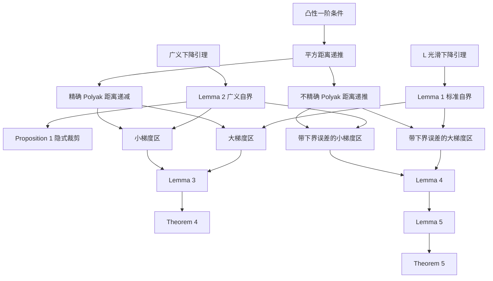

# Parameter-free Clipped Gradient Descent Meets Polyak：全局推理

> 本文件由全局推理模式生成。它不是摘要，而是从基础公式重建论文定理与证明的推导手稿。

- 论文：Yuki Takezawa, Han Bao, Ryoma Sato, Kenta Niwa, Makoto Yamada, NeurIPS 2024
- 论文编号：[arXiv:2405.15010](https://arxiv.org/abs/2405.15010)
- 原始材料：[论文 Markdown](../../02-markdown/Parameter_Free_Clipped_Gradient_Descent_Meets_Polyak.md) ｜ [已有精读笔记](../../03-notes/Parameter_Free_Clipped_Gradient_Descent_Meets_Polyak/精读.md)
- 所属方向：确定性凸优化、Polyak 步长、梯度裁剪、广义光滑性、参数无关优化
- 生成日期：2026-09-10

---

## 0. 推理计划与依赖关系

本文的理论并不是一条直线，而是两条共享前置工具的证明链。

按论文顺序，本手稿处理以下单元：

1. 优化问题、凸性、两种光滑性和梯度下降。
2. 从距离递推推导 Polyak 步长。
3. 从下降引理推导 Lemma 1 与 Lemma 2。
4. 解释并推导 Theorem 1、Theorem 2、Theorem 3 和 Proposition 2。
5. 完整证明本文 Proposition 1 与 Theorem 4。
6. 从下界误差出发解释 Algorithm 1。
7. 完整证明本文 Theorem 5，包括 Lemma 4 与 Lemma 5。
8. 独立验证附录 Proposition 3，并标注原文抽取问题。

---

## 1. 问题、记号与假设

### 1.1 优化问题

论文研究无约束确定性凸优化：寻找一个点 $x^*$ ，使它达到目标函数的最小值。记最优函数值为

$$
f^*=f(x^*).
$$

这里不是随机梯度分析。主定理中的每一步都使用完整梯度 $\nabla f(x_t)$ ，没有随机变量或期望。

### 1.2 统一记号

为了让证明可读，后文统一使用：

$$
\Delta_t=f(x_t)-f^*,
$$

$$
G_t=\Vert \nabla f(x_t) \Vert,
$$

$$
R_t=\Vert x_t-x^* \Vert,
$$

$$
D_t=R_t^2-R_{t+1}^2.
$$

| 符号 | 含义 | 类型 |
|---|---|---|
| $x_t$ | 第 $t$ 次迭代点 | 模型参数 |
| $x^*$ | 任一全局最优点 | 未知量 |
| $f^*$ | 全局最优函数值 | 未知量 |
| $\Delta_t$ | 当前函数值与最优值之差 | 中间结果 |
| $G_t$ | 当前梯度范数 | 中间结果 |
| $R_t$ | 当前点到最优点的距离 | 中间结果 |
| $D_t$ | 一步前后平方距离的减少量 | 中间结果 |
| $L$ | 全局梯度 Lipschitz 常数 | 已知于理论、实践中通常未知 |
| $L_0,L_1$ | 广义光滑常数 | 已知于理论、实践中通常未知 |
| $T$ | 总迭代次数 | 超参数 |
| $l^*$ | 已知的损失下界 | 已知量 |
| $\sigma^2$ | 下界误差 $f^*-l^*$ | 中间结果 |

因为 $x^*$ 是最优点，所以每个 $\Delta_t$ 都非负。

### 1.3 凸性的一阶条件

可微函数 $f$ 为凸函数时，对任意两点 $x,y$ 有

$$
f(y)\ge f(x)+\nabla f(x)^\top(y-x).
$$

令 $x=x_t$ 且 $y=x^*$ ，得到

$$
f^*\ge f(x_t)+\nabla f(x_t)^\top(x^*-x_t).
$$

把内积项移到另一边：

$$
\nabla f(x_t)^\top(x_t-x^*)\ge f(x_t)-f^*=\Delta_t.
$$

这条不等式把“梯度与最优方向的内积”换成“函数值差”，是所有距离递推的唯一凸性入口。

### 1.4 Assumption 1： $L$ 光滑

对任意两点 $x,y$ ，假设

$$
\Vert \nabla f(x)-\nabla f(y) \Vert\le L\Vert x-y \Vert.
$$

它直接推出标准下降引理：

$$
f(y)\le f(x)+\nabla f(x)^\top(y-x)+\frac{L}{2}\Vert y-x \Vert^2.
$$

如果没有此假设，Lemma 1 中用梯度范数控制函数值差的步骤会断掉，Theorem 4 和 Theorem 5 的大梯度区也无法处理。

### 1.5 Assumption 2： $(L_0,L_1)$ 光滑

当两点满足 $\Vert x-y\Vert\le 1/L_1$ 时，假设

$$
\Vert \nabla f(x)-\nabla f(y) \Vert
\le\left(L_0+L_1\Vert \nabla f(x) \Vert\right)\Vert x-y \Vert.
$$

它允许局部梯度 Lipschitz 常数随当前梯度范数增大。定义

$$
M(x)=L_0+L_1\Vert \nabla f(x) \Vert.
$$

则广义下降引理为

$$
f(y)\le f(x)+\nabla f(x)^\top(y-x)+\frac{M(x)}{2}\Vert y-x \Vert^2,
$$

前提仍是 $\Vert x-y\Vert\le 1/L_1$ 。

为什么二次项前是 $1/2$ ：把线段分成 $n$ 份，逐段累加梯度变化。第 $k$ 段的梯度偏差至多与 $k/n$ 成正比，因此二次项系数来自

$$
\frac{1}{n}\sum_{k=0}^{n-1}\frac{k}{n}
=\frac{n-1}{2n}.
$$

当分段数不断增大时，该系数趋近 $1/2$ 。这就是通常用线段上的微积分基本定理一行写完的步骤。

如果没有 Assumption 2，Lemma 2、Proposition 1 以及两个主定理的小梯度区全部失效。

### 1.6 零梯度边界

Polyak 步长的分母是 $G_t^2$ 。当 $G_t=0$ 时，公式本身未定义。由于论文同时假设凸性，如果 $G_t=0$ ，则 $x_t$ 已是全局最优点，可以立即停止。因此后面的比值推导默认 $G_t>0$ 。原文没有显式写出这个边界约定。

---

## 2. 三个前置工具

### 2.1 工具 A：平方范数展开

梯度下降更新为

$$
x_{t+1}=x_t-\eta_t\nabla f(x_t).
$$

减去 $x^*$ ：

$$
x_{t+1}-x^*=x_t-x^*-\eta_t\nabla f(x_t).
$$

对两边取平方范数：

$$
R_{t+1}^2
=R_t^2-2\eta_t\nabla f(x_t)^\top(x_t-x^*)+\eta_t^2G_t^2.
$$

使用凸性一阶条件：

$$
R_{t+1}^2\le R_t^2-2\eta_t\Delta_t+\eta_t^2G_t^2.
$$

等价地，

$$
D_t\ge 2\eta_t\Delta_t-\eta_t^2G_t^2.
$$

### 2.2 工具 B：从距离上界推导 Polyak 步长

把上一节右端看成关于 $\eta_t$ 的二次函数：

$$
q(\eta_t)=-2\eta_t\Delta_t+\eta_t^2G_t^2.
$$

它的导数为

$$
q'(\eta_t)=-2\Delta_t+2\eta_tG_t^2.
$$

令导数等于零：

$$
-2\Delta_t+2\eta_tG_t^2=0.
$$

因此

$$
\eta_t=\frac{\Delta_t}{G_t^2}
=\frac{f(x_t)-f^*}{\Vert \nabla f(x_t) \Vert^2}.
$$

这是精确 Polyak 步长。它最小化的是“下一步平方距离的凸性上界”，不一定直接最小化真实的下一步函数值。

将它代回距离递推：

$$
D_t\ge
2\frac{\Delta_t}{G_t^2}\Delta_t
-\frac{\Delta_t^2}{G_t^4}G_t^2.
$$

逐项约分：

$$
D_t\ge\frac{2\Delta_t^2}{G_t^2}-\frac{\Delta_t^2}{G_t^2}
=\frac{\Delta_t^2}{G_t^2}.
$$

所以 $D_t\ge0$ ，即

$$
R_{t+1}^2\le R_t^2.
$$

这称为相对最优解集合的 Fejér 单调性：每一步都不会增大到所选最优点的距离。

### 2.3 工具 C：两个自界不等式

#### Lemma 1：标准光滑自界

要证明

$$
\frac{G_t^2}{2L}\le\Delta_t.
$$

在标准下降引理中选择

$$
y=x_t-\frac{1}{L}\nabla f(x_t).
$$

则

$$
y-x_t=-\frac{1}{L}\nabla f(x_t).
$$

线性项为

$$
\nabla f(x_t)^\top(y-x_t)=-\frac{G_t^2}{L}.
$$

二次项为

$$
\frac{L}{2}\Vert y-x_t\Vert^2
=\frac{L}{2}\frac{G_t^2}{L^2}
=\frac{G_t^2}{2L}.
$$

所以

$$
f(y)\le f(x_t)-\frac{G_t^2}{L}+\frac{G_t^2}{2L}
=f(x_t)-\frac{G_t^2}{2L}.
$$

又因为 $f^*$ 是全局最小值， $f^*\le f(y)$ ，因此

$$
f^*\le f(x_t)-\frac{G_t^2}{2L}.
$$

移项即得

$$
\frac{G_t^2}{2L}\le f(x_t)-f^*=\Delta_t.
$$

注意：这条证明不需要凸性，只需要全局最优值存在和 $L$ 光滑。

#### Lemma 2：广义光滑自界

要证明

$$
\frac{G_t^2}{2(L_0+L_1G_t)}\le\Delta_t.
$$

定义

$$
M_t=L_0+L_1G_t.
$$

选择自适应试探点

$$
y=x_t-\frac{1}{M_t}\nabla f(x_t).
$$

先验证广义下降引理的局部距离条件：

$$
\Vert y-x_t\Vert=\frac{G_t}{M_t}
=\frac{G_t}{L_0+L_1G_t}.
$$

因为 $L_0>0$ ，所以

$$
L_1G_t\le L_0+L_1G_t=M_t.
$$

两边除以正数 $L_1M_t$ ：

$$
\frac{G_t}{M_t}\le\frac{1}{L_1}.
$$

因此可以应用广义下降引理：

$$
f(y)\le f(x_t)-\frac{G_t^2}{M_t}
+\frac{M_t}{2}\frac{G_t^2}{M_t^2}.
$$

第二项约分后得到

$$
f(y)\le f(x_t)-\frac{G_t^2}{M_t}
+\frac{G_t^2}{2M_t}.
$$

所以

$$
f(y)\le f(x_t)-\frac{G_t^2}{2M_t}.
$$

再用 $f^*\le f(y)$ ：

$$
f^*\le f(x_t)-\frac{G_t^2}{2M_t}.
$$

移项并代回 $M_t$ ：

$$
\frac{G_t^2}{2(L_0+L_1G_t)}\le\Delta_t.
$$

这就是论文只引用 Koloskova 等人 Lemma A.2、但没有展开的关键前置公式。

### 2.4 后面反复使用的代数不等式

对任意实数 $a,b$ ，平方非负给出

$$
(a-b)^2\ge0.
$$

展开：

$$
a^2-2ab+b^2\ge0.
$$

移项：

$$
a^2\ge2ab-b^2.
$$

此外，

$$
(a+b)^2=a^2+2ab+b^2.
$$

由 $2ab\le a^2+b^2$ 得

$$
(a+b)^2\le2a^2+2b^2.
$$

后一条是 Young 不等式在系数取 $1$ 时的特例。

---

## 3. 论文引用的基线结论

### 3.1 Theorem 1：固定步长梯度下降

论文引用 Nesterov 的经典结论：凸且 $L$ 光滑时，取 $\eta_t=1/L$ 可得到 $\mathcal{O}(1/T)$ 收敛率。

所需的强化凸光滑不等式是

$$
\Delta_t\le\nabla f(x_t)^\top(x_t-x^*)-\frac{G_t^2}{2L}.
$$

先从 Lemma 1 推出这条强化不等式。固定 $x_t$ ，定义辅助函数

$$
h(z)=f(z)-\nabla f(x_t)^\top z.
$$

$h$ 仍然凸且 $L$ 光滑，并且

$$
\nabla h(x_t)=\nabla f(x_t)-\nabla f(x_t)=0.
$$

所以 $x_t$ 是 $h$ 的全局最优点。对函数 $h$ 在点 $x^*$ 使用 Lemma 1：

$$
\frac{1}{2L}\Vert \nabla h(x^*) \Vert^2
\le h(x^*)-h(x_t).
$$

因为无约束可微函数在全局最优点满足 $\nabla f(x^*)=0$ ，所以

$$
\nabla h(x^*)=-\nabla f(x_t).
$$

左边就是 $G_t^2/(2L)$ 。右边逐项展开：

$$
h(x^*)-h(x_t)
=f^*-\nabla f(x_t)^\top x^*
-f(x_t)+\nabla f(x_t)^\top x_t.
$$

合并函数值与内积：

$$
h(x^*)-h(x_t)
=\nabla f(x_t)^\top(x_t-x^*)-\Delta_t.
$$

因此

$$
\frac{G_t^2}{2L}
\le\nabla f(x_t)^\top(x_t-x^*)-\Delta_t.
$$

移项便得到所需的强化凸光滑不等式。

把它代入平方距离展开：

$$
R_{t+1}^2
=R_t^2-\frac{2}{L}\nabla f(x_t)^\top(x_t-x^*)
+\frac{G_t^2}{L^2}.
$$

由强化不等式，

$$
\nabla f(x_t)^\top(x_t-x^*)
\ge\Delta_t+\frac{G_t^2}{2L}.
$$

所以

$$
R_{t+1}^2
\le R_t^2-\frac{2\Delta_t}{L}
-\frac{G_t^2}{L^2}+\frac{G_t^2}{L^2}.
$$

梯度平方项抵消：

$$
\Delta_t\le\frac{L}{2}(R_t^2-R_{t+1}^2).
$$

从 $t=0$ 到 $T-1$ 求和，距离项望远镜消去：

$$
\sum_{t=0}^{T-1}\Delta_t
\le\frac{L}{2}(R_0^2-R_T^2)
\le\frac{LR_0^2}{2}.
$$

定义平均点

$$
x^{avg}=\frac{1}{T}\sum_{t=0}^{T-1}x_t.
$$

由凸性，平均点的函数值不超过函数值的平均：

$$
f(x^{avg})-f^*
\le\frac{1}{T}\sum_{t=0}^{T-1}\Delta_t
\le\frac{LR_0^2}{2T}.
$$

这就是论文式 (3) 的显式常数版本。

### 3.2 Theorem 2：调参后的梯度裁剪

裁剪更新可写为

$$
x_{t+1}=x_t-\alpha_t\nabla f(x_t),
$$

其中有效系数为

$$
\alpha_t
=\eta\min\left\{1,\frac{c}{G_t}\right\}.
$$

当 $\eta$ 与 $c$ 分别取 $1/L_0$ 与 $L_0/L_1$ 的常数量级时，

$$
\alpha_t
=\min\left\{\frac{1}{L_0},\frac{1}{L_1G_t}\right\}.
$$

于是算法自动分成：

- 小梯度区： $G_t\le L_0/L_1$ ，有效系数为 $1/L_0$ 。
- 大梯度区： $G_t>L_0/L_1$ ，有效系数与 $1/G_t$ 成正比，更新长度受到控制。

引用结果的收敛阶为

$$
f(x^{avg})-f^*
\le\mathcal{O}\left(
\frac{L_0R_0^2}{T}
+\frac{LL_1^2R_0^4}{T^2}
\right).
$$

证明结构与后面的 Theorem 4 相同：小梯度区累计 $\Delta_t$ ，大梯度区累计 $\sqrt{\Delta_t}$ ，最后统一到最佳点或平均点。

**引用常数核对。** Koloskova 等人 Theorem 2.3 的正式条件是 $\eta\le1/(L_0+cL_1)$ 。取 $c=L_0/L_1$ 时，安全条件为 $\eta\le1/(2L_0)$ 。本文把代表性常数直接写成 $\eta=1/L_0$ ；这不改变大 $\mathcal{O}$ 阶，但该精确常数不能直接由被引用定理的条件推出。严格复现时应使用满足条件的常数倍，例如 $1/(2L_0)$ 。

下面用一个更保守、能直接逐步验证的条件

$$
\eta\le\frac{1}{2(L_0+cL_1)}
$$

重建同阶结论。令

$$
\beta_t=\min\left\{1,\frac{c}{G_t}\right\}.
$$

距离递推为

$$
D_t\ge2\eta\beta_t\Delta_t-\eta^2\beta_t^2G_t^2.
$$

**未发生裁剪。** 此时 $G_t\le c$ 且 $\beta_t=1$ 。Lemma 2 给出

$$
G_t^2\le2(L_0+L_1G_t)\Delta_t
\le2(L_0+cL_1)\Delta_t.
$$

因此

$$
\eta^2G_t^2
\le2\eta^2(L_0+cL_1)\Delta_t
\le\eta\Delta_t.
$$

代回距离递推：

$$
D_t\ge2\eta\Delta_t-\eta\Delta_t
=\eta\Delta_t.
$$

**发生裁剪。** 此时 $G_t>c$ 且 $\beta_t=c/G_t$ 。距离递推变成

$$
D_t\ge\frac{2\eta c\Delta_t}{G_t}-\eta^2c^2.
$$

为了让第二项不超过第一项的一半，只需证明

$$
\eta\le\frac{\Delta_t}{cG_t}.
$$

由 Lemma 2，

$$
\frac{\Delta_t}{cG_t}
\ge\frac{G_t}{2c(L_0+L_1G_t)}.
$$

因为 $c/G_t<1$ ，所以

$$
L_0\frac{c}{G_t}+cL_1<L_0+cL_1.
$$

从而

$$
\frac{G_t}{2c(L_0+L_1G_t)}
=\frac{1}{2(L_0c/G_t+cL_1)}
>\frac{1}{2(L_0+cL_1)}.
$$

所选步长条件确实保证 $\eta\le\Delta_t/(cG_t)$ 。因此

$$
D_t\ge\frac{\eta c\Delta_t}{G_t}.
$$

再用 Lemma 1 导出的 $\Delta_t/G_t\ge\sqrt{\Delta_t/(2L)}$ ：

$$
D_t\ge\frac{\eta c}{\sqrt{2L}}\sqrt{\Delta_t}.
$$

至此，小梯度区累计 $\Delta_t$ ，大梯度区累计 $\sqrt{\Delta_t}$ 。完全重复 Theorem 4 后面“求和、引入辅助数、平方”的步骤，得到最佳迭代点的显式界

$$
\Delta_{best}
\le\frac{2R_0^2}{\eta T}
+\frac{4LR_0^4}{\eta^2c^2T^2}.
$$

若选择 $c=L_0/L_1$ 和安全步长 $\eta=1/(4L_0)$ ，则

$$
\Delta_{best}
\le\frac{8L_0R_0^2}{T}
+\frac{64LL_1^2R_0^4}{T^2}.
$$

这与论文 Theorem 2 宣称的量级一致。被引用论文原定理直接表述的是最后一个迭代点 $x_T$ ；当前论文改写成平均点 $x^{avg}$ ，但没有给出这一输出形式转换的证明。因此，最稳妥的使用方式是保留被引定理的最后迭代点形式，或采用上面直接推出的最佳迭代点形式。

### 3.3 Theorem 3：Polyak 步长的标准光滑收敛率

由工具 B，

$$
D_t\ge\frac{\Delta_t^2}{G_t^2}.
$$

由 Lemma 1，

$$
G_t^2\le2L\Delta_t.
$$

由于所有量非负，分母变小会使分式变大：

$$
\frac{\Delta_t^2}{G_t^2}
\ge\frac{\Delta_t^2}{2L\Delta_t}
=\frac{\Delta_t}{2L}.
$$

所以

$$
\Delta_t\le2LD_t.
$$

求和并望远镜消去：

$$
\sum_{t=0}^{T-1}\Delta_t
\le2L\sum_{t=0}^{T-1}D_t
=2L(R_0^2-R_T^2)
\le2LR_0^2.
$$

再用平均点的凸性：

$$
f(x^{avg})-f^*\le\frac{2LR_0^2}{T}.
$$

因此得到论文式 (8) 的 $\mathcal{O}(LR_0^2/T)$ 。

### 3.4 Proposition 2：Polyak 步长的标准下界

Lemma 1 给出

$$
G_t^2\le2L\Delta_t.
$$

当 $G_t>0$ 时，两边除以 $2LG_t^2$ ：

$$
\frac{1}{2L}\le\frac{\Delta_t}{G_t^2}=\eta_t.
$$

这说明精确 Polyak 步长不会小于标准光滑尺度的常数倍。

---

## 4. Proposition 1：Polyak 步长为何像隐式裁剪

### 4.1 命题

在凸和 $(L_0,L_1)$ 光滑条件下，精确 Polyak 步长满足

$$
\min\left\{
\frac{1}{4L_0},
\frac{1}{4L_1G_t}
\right\}
\le\frac{\Delta_t}{G_t^2}.
$$

### 4.2 从 Lemma 2 开始

Lemma 2 为

$$
\frac{G_t^2}{2(L_0+L_1G_t)}\le\Delta_t.
$$

除以 $G_t^2$ ：

$$
\frac{1}{2(L_0+L_1G_t)}
\le\frac{\Delta_t}{G_t^2}.
$$

### 4.3 小梯度区

假设

$$
G_t<\frac{L_0}{L_1}.
$$

两边乘 $L_1$ ：

$$
L_1G_t<L_0.
$$

因此

$$
L_0+L_1G_t<2L_0.
$$

取倒数并乘 $1/2$ ：

$$
\frac{1}{2(L_0+L_1G_t)}>\frac{1}{4L_0}.
$$

所以

$$
\eta_t\ge\frac{1}{4L_0}.
$$

### 4.4 大梯度区

假设

$$
G_t\ge\frac{L_0}{L_1}.
$$

则

$$
L_0\le L_1G_t.
$$

所以

$$
L_0+L_1G_t\le2L_1G_t.
$$

取倒数并乘 $1/2$ ：

$$
\frac{1}{2(L_0+L_1G_t)}
\ge\frac{1}{4L_1G_t}.
$$

所以

$$
\eta_t\ge\frac{1}{4L_1G_t}.
$$

合并两种情形就得到 Proposition 1。

### 4.5 命题真正说明了什么

调参后的裁剪梯度下降使用有效系数

$$
\min\left\{
\frac{1}{L_0},
\frac{1}{L_1G_t}
\right\}.
$$

Proposition 1 说明 Polyak 步长至少达到同一两段式结构的四分之一。因此：

- 小梯度时，步长不会被全局常数 $L$ 限制在很小的尺度。
- 大梯度时，步长下界按 $1/G_t$ 变化，对应更新长度的常数量级。

需要谨慎：命题给出的是步长**下界**，不是相等关系，也不是步长上界。称它“隐式裁剪”是量级和证明结构上的解释，不表示两种算法逐步产生相同迭代点。

---

## 5. Theorem 4：精确 Polyak 步长的改进收敛率

### 5.1 定理的显式版本

令 $x_\tau$ 是前 $T$ 个迭代点中函数值最小者。Lemma 3 实际证明

$$
f(x_\tau)-f^*
\le\frac{8L_0R_0^2}{T}
+\frac{64LL_1^2R_0^4}{T^2}.
$$

Theorem 4 只是把常数隐藏为

$$
f(x_\tau)-f^*
\le\mathcal{O}\left(
\frac{L_0R_0^2}{T}
+\frac{LL_1^2R_0^4}{T^2}
\right).
$$

### 5.2 共同起点：精确距离下降

工具 B 已经证明

$$
D_t\ge\frac{\Delta_t^2}{G_t^2}.
$$

后面只需对右边在两个梯度区域分别下界。

### 5.3 小梯度区

假设 $G_t\le L_0/L_1$ 。把右边拆成

$$
\frac{\Delta_t^2}{G_t^2}
=\Delta_t\frac{\Delta_t}{G_t^2}.
$$

由 Lemma 2，

$$
\frac{\Delta_t}{G_t^2}
\ge\frac{1}{2(L_0+L_1G_t)}.
$$

由小梯度条件，

$$
L_0+L_1G_t\le2L_0.
$$

所以

$$
D_t\ge\frac{\Delta_t}{4L_0}.
$$

移项得到

$$
\Delta_t\le4L_0D_t.
$$

### 5.4 大梯度区

假设 $G_t>L_0/L_1$ 。先由 Lemma 1 得

$$
G_t\le\sqrt{2L\Delta_t}.
$$

因此

$$
\frac{\Delta_t}{G_t}
\ge\sqrt{\frac{\Delta_t}{2L}}.
$$

再处理另一个因子。大梯度条件给出

$$
L_0<L_1G_t.
$$

所以

$$
L_0+L_1G_t<2L_1G_t.
$$

等价地，

$$
\frac{L_0+L_1G_t}{2L_1G_t}<1.
$$

从而

$$
\frac{\Delta_t}{G_t}
>\frac{\Delta_t}{G_t^2}
\frac{L_0+L_1G_t}{2L_1}.
$$

由 Lemma 2，

$$
\frac{\Delta_t}{G_t^2}
\ge\frac{1}{2(L_0+L_1G_t)}.
$$

代入上一式：

$$
\frac{\Delta_t}{G_t}
>\frac{1}{2(L_0+L_1G_t)}
\frac{L_0+L_1G_t}{2L_1}
=\frac{1}{4L_1}.
$$

现在把距离下降写成两个相同因子的乘积：

$$
D_t\ge\frac{\Delta_t^2}{G_t^2}
=\frac{\Delta_t}{G_t}\frac{\Delta_t}{G_t}.
$$

对第一个因子使用 Lemma 1 导出的界，对第二个因子使用刚得到的界：

$$
D_t\ge
\sqrt{\frac{\Delta_t}{2L}}
\frac{1}{4L_1}.
$$

乘以 $4L_0$ ：

$$
\frac{L_0}{L_1}\sqrt{\frac{\Delta_t}{2L}}
\le4L_0D_t.
$$

### 5.5 两个区域求和

定义：

- $\mathcal{T}_1$ 是小梯度迭代的索引集合。
- $\mathcal{T}_2$ 是大梯度迭代的索引集合。
- $S_1$ 是所有小梯度迭代的 $\Delta_t$ 之和。
- $S_2$ 是所有大梯度迭代的 $\sqrt{\Delta_t}$ 之和。

将两个区域的不等式相加：

$$
S_1+\frac{L_0}{L_1\sqrt{2L}}S_2
\le4L_0\sum_{t=0}^{T-1}D_t.
$$

距离下降量望远镜消去：

$$
\sum_{t=0}^{T-1}D_t
=R_0^2-R_T^2
\le R_0^2.
$$

因此

$$
S_1+\frac{L_0}{L_1\sqrt{2L}}S_2
\le4L_0R_0^2.
$$

两个左端项都非负，所以可分别得到

$$
\frac{S_1}{T}\le\frac{4L_0R_0^2}{T},
$$

$$
\frac{S_2}{T}\le\frac{4L_1\sqrt{2L}R_0^2}{T}.
$$

### 5.6 为什么要引入辅助数 $b$

大梯度区已经控制了 $\sqrt{\Delta_t}$ ，但小梯度区控制的是 $\Delta_t$ 。需要把小梯度区也转换成平方根形式。

令 $N_1$ 为小梯度迭代数。由

$$
a^2\ge2ab-b^2
$$

对每个小梯度迭代取 $a=\sqrt{\Delta_t}$ ，得到

$$
\Delta_t\ge2b\sqrt{\Delta_t}-b^2.
$$

在小梯度区求和：

$$
S_1\ge2bQ_1-N_1b^2,
$$

其中 $Q_1$ 表示小梯度区的 $\sqrt{\Delta_t}$ 之和。因此

$$
\frac{Q_1}{T}
\le\frac{S_1}{2bT}+\frac{N_1b}{2T}.
$$

因为 $N_1\le T$ ，并代入 $S_1/T$ 的上界：

$$
\frac{Q_1}{T}
\le\frac{4L_0R_0^2}{2bT}+\frac{b}{2}.
$$

选择使两项平衡的

$$
b=\sqrt{\frac{4L_0R_0^2}{T}}.
$$

代入第一项：

$$
\frac{4L_0R_0^2}{2bT}
=\frac{b^2}{2b}
=\frac{b}{2}.
$$

所以

$$
\frac{Q_1}{T}
\le b
=\sqrt{\frac{4L_0R_0^2}{T}}.
$$

### 5.7 从平均平方根到最佳点

合并两个区域：

$$
\frac{1}{T}\sum_{t=0}^{T-1}\sqrt{\Delta_t}
\le
\sqrt{\frac{4L_0R_0^2}{T}}
+\frac{4L_1\sqrt{2L}R_0^2}{T}.
$$

因为 $x_\tau$ 是函数值最小的迭代点，

$$
\sqrt{\Delta_\tau}
\le\frac{1}{T}\sum_{t=0}^{T-1}\sqrt{\Delta_t}.
$$

令

$$
a=\sqrt{\frac{4L_0R_0^2}{T}},
$$

$$
b=\frac{4L_1\sqrt{2L}R_0^2}{T}.
$$

两边平方并用 $(a+b)^2\le2a^2+2b^2$ ：

$$
\Delta_\tau\le2a^2+2b^2.
$$

第一项为

$$
2a^2=\frac{8L_0R_0^2}{T}.
$$

第二项为

$$
2b^2
=2\frac{16L_1^2\cdot2L\cdot R_0^4}{T^2}
=\frac{64LL_1^2R_0^4}{T^2}.
$$

所以

$$
f(x_\tau)-f^*
\le\frac{8L_0R_0^2}{T}
+\frac{64LL_1^2R_0^4}{T^2}.
$$

Lemma 3 与 Theorem 4 得证。

### 5.8 理论含义

- 第一项按 $1/T$ 衰减且只含 $L_0$ 。
- 第二项按 $1/T^2$ 更快消失，但含全局常数 $L$ 。
- 因此当 $T$ 足够大时，主导项不依赖 $L$ 。
- 这与调参后的梯度裁剪具有相同的参数依赖阶。

“渐近不依赖 $L$”不表示有限步界中完全没有 $L$ ；它只表示含 $L$ 的项衰减得更快。

---

## 6. Algorithm 1：Inexact Polyak Stepsize

### 6.1 为什么直接替换最优值会失败

设 $l^*\le f^*$ ，并定义

$$
\sigma^2=f^*-l^*.
$$

则

$$
f(x_t)-l^*
=f(x_t)-f^*+f^*-l^*
=\Delta_t+\sigma^2.
$$

直接替换后的步长为

$$
\eta_t=\frac{\Delta_t+\sigma^2}{G_t^2}.
$$

当 $x_t$ 接近最优点时，通常 $\Delta_t$ 与 $G_t$ 都趋近零。如果 $l^*<f^*$ ，则 $\sigma^2>0$ ，分子趋近 $\sigma^2$ ，分母趋近零，步长会变得无界。

一维二次函数可直接看出问题。令

$$
f(x)=\frac{x^2}{2}+1,
$$

并取 $l^*=0$ 。此时 $f^*=1$ 、 $\sigma^2=1$ 、 $\nabla f(x)=x$ ，所以

$$
\eta(x)=\frac{x^2/2+1}{x^2}
=\frac{1}{2}+\frac{1}{x^2}.
$$

当 $x$ 趋近零时， $1/x^2$ 无界增大。

### 6.2 算法定义

本文将步长统一缩小 $\sqrt{T}$ 倍：

$$
\eta_t
=\frac{f(x_t)-l^*}{\sqrt{T}G_t^2}
=\frac{\Delta_t+\sigma^2}{\sqrt{T}G_t^2}.
$$

算法执行 $T$ 次梯度更新，并返回访问过的函数值最小点 $x^{best}$ 。

### 6.3 输入输出与每一行的作用

1. 输入 $T$ 和一个合法下界 $l^*$ 。
2. 用 $x_0$ 初始化历史最佳点。
3. 每一步计算当前完整梯度和 Inexact Polyak 步长。
4. 执行梯度更新。
5. 若新点函数值更小，就更新历史最佳点。
6. 返回历史最佳点，而不是强制返回最后一步。

返回最佳点是证明的一部分，因为不精确步长不能保证函数值逐步下降。

### 6.4 “参数无关”的准确含义

算法仍需给定迭代预算 $T$ 和损失下界 $l^*$ 。论文所说的 parameter-free 更准确地指：不需要知道或搜索 $L$ 、 $L_0$ 、 $L_1$ 、固定学习率和裁剪阈值。对于天然非负的损失，可以取 $l^*=0$ ；但对任意目标函数，下界未必天然已知。

---

## 7. Theorem 5：Inexact Polyak Stepsize 的完整证明

### 7.1 定理

论文证明算法输出满足

$$
f(x^{best})-f^*
\le\mathcal{O}\left(
\frac{L_0R_0^2+\sigma^2}{\sqrt{T}}
+\frac{LL_1^2R_0^4}{T}
+\frac{L_1^2L\sigma^4}{L_0^2T}
\right).
$$

证明先处理所有迭代都尚未进入误差阈值的情形，即 Lemma 4，再用 Lemma 5 覆盖剩余情形。

### 7.2 不精确步长的距离递推

仍从凸性距离递推开始：

$$
R_{t+1}^2\le R_t^2-2\eta_t\Delta_t+\eta_t^2G_t^2.
$$

由步长定义，

$$
\eta_tG_t^2=\frac{\Delta_t+\sigma^2}{\sqrt{T}}.
$$

因此

$$
\eta_t^2G_t^2
=\eta_t\frac{\Delta_t+\sigma^2}{\sqrt{T}}.
$$

代入：

$$
R_{t+1}^2
\le R_t^2-2\eta_t\Delta_t
+\frac{\eta_t\Delta_t}{\sqrt{T}}
+\frac{\eta_t\sigma^2}{\sqrt{T}}.
$$

合并 $\Delta_t$ 项：

$$
R_{t+1}^2
\le R_t^2
-\eta_t\left(2-\frac{1}{\sqrt{T}}\right)\Delta_t
+\frac{\eta_t\sigma^2}{\sqrt{T}}.
$$

因为 $T\ge1$ ，所以

$$
2-\frac{1}{\sqrt{T}}\ge1.
$$

从而

$$
R_{t+1}^2
\le R_t^2-\eta_t\Delta_t
+\frac{\eta_t\sigma^2}{\sqrt{T}}.
$$

等价地，

$$
D_t\ge\eta_t\left(\Delta_t-\frac{\sigma^2}{\sqrt{T}}\right).
$$

还可写成论文式 (19)：

$$
\Delta_t\le\frac{D_t}{\eta_t}+\frac{\sigma^2}{\sqrt{T}}.
$$

### 7.3 Lemma 4 的额外条件为何重要

Lemma 4 假设每一步都有

$$
\Delta_t\ge\frac{\sigma^2}{\sqrt{T}}.
$$

于是

$$
D_t\ge0.
$$

这保证后面用步长下界替换 $1/\eta_t$ 时不改变不等号方向，也保证距离项仍可望远镜求和。

### 7.4 小梯度区

由步长定义和 $\sigma^2\ge0$ ，

$$
\eta_t
=\frac{\Delta_t+\sigma^2}{\sqrt{T}G_t^2}
\ge\frac{\Delta_t}{\sqrt{T}G_t^2}.
$$

由 Lemma 2，

$$
\frac{\Delta_t}{G_t^2}
\ge\frac{1}{2(L_0+L_1G_t)}.
$$

所以

$$
\eta_t\ge
\frac{1}{2(L_0+L_1G_t)\sqrt{T}}.
$$

取倒数：

$$
\frac{1}{\eta_t}
\le2(L_0+L_1G_t)\sqrt{T}.
$$

若 $G_t\le L_0/L_1$ ，则

$$
L_0+L_1G_t\le2L_0.
$$

所以

$$
\frac{1}{\eta_t}\le4L_0\sqrt{T}.
$$

代入式 (19)，并使用 $D_t\ge0$ ：

$$
\Delta_t
\le4L_0\sqrt{T}D_t
+\frac{\sigma^2}{\sqrt{T}}.
$$

### 7.5 大梯度区

仍从步长下界开始：

$$
\eta_t\ge
\frac{1}{2(L_0+L_1G_t)\sqrt{T}}.
$$

大梯度条件 $G_t>L_0/L_1$ 给出

$$
L_0+L_1G_t<2L_1G_t.
$$

所以

$$
\eta_t>\frac{1}{4L_1G_t\sqrt{T}}.
$$

Lemma 1 给出 $G_t\le\sqrt{2L\Delta_t}$ ，因此

$$
\eta_t
\ge\frac{1}{4L_1\sqrt{2LT\Delta_t}}.
$$

取倒数：

$$
\frac{1}{\eta_t}
\le4L_1\sqrt{2LT\Delta_t}.
$$

代入式 (19)：

$$
\Delta_t
\le4L_1\sqrt{2LT\Delta_t}D_t
+\frac{\sigma^2}{\sqrt{T}}.
$$

还要把最后的常数误差项也改写成 $\sqrt{\Delta_t}$ 的倍数。由大梯度条件和 Lemma 1，

$$
\Delta_t\ge\frac{G_t^2}{2L}
>\frac{L_0^2}{2LL_1^2}.
$$

开平方：

$$
\sqrt{\Delta_t}
>\frac{L_0}{L_1\sqrt{2L}}.
$$

所以

$$
\frac{\sigma^2}{\sqrt{T}}
\le
\frac{L_1\sigma^2\sqrt{2L}}{L_0\sqrt{T}}
\sqrt{\Delta_t}.
$$

将此式代回，并把两边除以正数 $L_1\sqrt{2L\Delta_t}/L_0$ 。左边变成

$$
\frac{\Delta_t}{L_1\sqrt{2L\Delta_t}/L_0}
=\frac{L_0}{L_1}\sqrt{\frac{\Delta_t}{2L}}.
$$

第一个右端项变成

$$
\frac{4L_1\sqrt{2LT\Delta_t}D_t}
{L_1\sqrt{2L\Delta_t}/L_0}
=4L_0\sqrt{T}D_t.
$$

误差项变回 $\sigma^2/\sqrt{T}$ 。因此

$$
\frac{L_0}{L_1}\sqrt{\frac{\Delta_t}{2L}}
\le4L_0\sqrt{T}D_t
+\frac{\sigma^2}{\sqrt{T}}.
$$

### 7.6 两区求和

沿用 Theorem 4 的 $S_1,S_2$ 定义。将两区不等式相加，并注意一共只有 $T$ 个误差项：

$$
S_1+\frac{L_0}{L_1\sqrt{2L}}S_2
\le4L_0\sqrt{T}\sum_{t=0}^{T-1}D_t
+\frac{T\sigma^2}{\sqrt{T}}.
$$

由望远镜消去与 $R_T^2\ge0$ ，

$$
\sum_{t=0}^{T-1}D_t\le R_0^2.
$$

所以

$$
S_1+\frac{L_0}{L_1\sqrt{2L}}S_2
\le4L_0\sqrt{T}R_0^2+\sqrt{T}\sigma^2.
$$

两边除以 $T$ 。定义

$$
A=\frac{4L_0R_0^2+\sigma^2}{\sqrt{T}}.
$$

则

$$
\frac{S_1}{T}\le A,
$$

并且

$$
\frac{S_2}{T}
\le\frac{L_1\sqrt{2L}}{L_0}A.
$$

展开后一式：

$$
\frac{S_2}{T}
\le
\frac{4L_1\sqrt{2L}R_0^2}{\sqrt{T}}
+\frac{L_1\sigma^2\sqrt{2L}}{L_0\sqrt{T}}.
$$

### 7.7 小梯度区再次转换成平方根

与 Theorem 4 完全相同，由 $a^2\ge2ab-b^2$ 得

$$
\frac{Q_1}{T}
\le\frac{A}{2b}+\frac{b}{2}.
$$

选择 $b=\sqrt{A}$ ，两项相等，得到

$$
\frac{Q_1}{T}\le\sqrt{A}.
$$

因此全体迭代满足

$$
\frac{1}{T}\sum_{t=0}^{T-1}\sqrt{\Delta_t}
\le
\sqrt{A}
+\frac{4L_1\sqrt{2L}R_0^2}{\sqrt{T}}
+\frac{L_1\sigma^2\sqrt{2L}}{L_0\sqrt{T}}.
$$

最佳迭代点满足

$$
\sqrt{\Delta_\tau}
\le
\sqrt{A}
+\frac{4L_1\sqrt{2L}R_0^2}{\sqrt{T}}
+\frac{L_1\sigma^2\sqrt{2L}}{L_0\sqrt{T}}.
$$

### 7.8 平方并核对常数

定义

$$
B=\frac{4L_1\sqrt{2L}R_0^2}{\sqrt{T}},
$$

$$
C=\frac{L_1\sigma^2\sqrt{2L}}{L_0\sqrt{T}}.
$$

先把后三项看作 $\sqrt{A}+(B+C)$ ：

$$
(\sqrt{A}+B+C)^2
\le2A+2(B+C)^2.
$$

再对 $B+C$ 使用同一不等式：

$$
2(B+C)^2\le4B^2+4C^2.
$$

逐项计算：

$$
2A=\frac{8L_0R_0^2+2\sigma^2}{\sqrt{T}},
$$

$$
4B^2
=4\frac{16L_1^2\cdot2L\cdot R_0^4}{T}
=\frac{128LL_1^2R_0^4}{T},
$$

$$
4C^2
=4\frac{L_1^2\sigma^4\cdot2L}{L_0^2T}
=\frac{8LL_1^2\sigma^4}{L_0^2T}.
$$

最终得到 Lemma 4：

$$
\Delta_\tau
\le
\frac{8L_0R_0^2+2\sigma^2}{\sqrt{T}}
+\frac{128LL_1^2R_0^4}{T}
+\frac{8LL_1^2\sigma^4}{L_0^2T}.
$$

原文在这里仅说使用一次二项平方不等式，实际上为了得到列出的常数，需要像上面这样连续使用两次。

### 7.9 Lemma 5：去掉 Lemma 4 的额外条件

只有两种互斥情形。

**情形一：** 至少存在一步满足

$$
\Delta_t<\frac{\sigma^2}{\sqrt{T}}.
$$

因为 $x_\tau$ 是前 $T$ 个点中的最佳点，

$$
\Delta_\tau\le\Delta_t
<\frac{\sigma^2}{\sqrt{T}}.
$$

这已经比目标大 $\mathcal{O}$ 界更强。

**情形二：** 每一步都满足

$$
\Delta_t\ge\frac{\sigma^2}{\sqrt{T}}.
$$

此时 Lemma 4 的全部前提成立，直接使用上一节的显式界。

两种情形覆盖所有可能，因此得到 Lemma 5 和论文式 (21)。

### 7.10 从 Lemma 5 到 Theorem 5

Algorithm 1 的历史最佳点会在 $x_0$ 到 $x_T$ 中选函数值最小者，而 Lemma 5 的 $x_\tau$ 只在 $x_0$ 到 $x_{T-1}$ 中选择。因此

$$
f(x^{best})\le f(x_\tau).
$$

把 Lemma 5 的上界传给 $x^{best}$ ，即得 Theorem 5。

### 7.11 定理含义

- 主导项为 $(L_0R_0^2+\sigma^2)/\sqrt{T}$ 。
- 两个含 $L$ 的项按 $1/T$ 衰减，所以渐近主导项不含 $L$ 。
- 界只依赖初始距离 $R_0$ ，不依赖整条轨迹的最大半径。
- 代价是迭代次数速率从 Theorem 4 的 $1/T$ 变为 $1/\sqrt{T}$ 。
- 当 $l^*=f^*$ 时， $\sigma^2=0$ ，但算法仍额外除以 $\sqrt{T}$ ，所以它并不退化成精确 Polyak 步长。

---

## 8. 附录 Proposition 3：合成函数的广义光滑性

### 8.1 函数与导数

忽略不影响导数的常数 $f^*$ ，论文使用

$$
f(x)=\frac{L_0L_1^2}{72}x^4+\frac{L_0}{4}x^2.
$$

一阶导数为

$$
\nabla f(x)
=\frac{4L_0L_1^2}{72}x^3+\frac{2L_0}{4}x.
$$

约分：

$$
\nabla f(x)
=\frac{L_0L_1^2}{18}x^3+\frac{L_0}{2}x.
$$

二阶导数为

$$
\nabla^2f(x)
=\frac{3L_0L_1^2}{18}x^2+\frac{L_0}{2}
=\frac{L_0L_1^2}{6}x^2+\frac{L_0}{2}.
$$

### 8.2 证明需要的标量不等式

以下推导先处理 $L_1>0$ 。当 $L_1=0$ 时，函数退化为

$$
f(x)=\frac{L_0}{4}x^2,
$$

其二阶导数恒为 $L_0/2$ ，直接满足 $L_0$ 光滑性，也就满足 $(L_0,0)$ 光滑性。

现在令 $L_1>0$ 。论文使用

$$
\frac{L_1}{6}x^2+\frac{3}{2L_1}\ge\Vert x\Vert.
$$

令 $u=L_1\Vert x\Vert$ 。两边乘 $L_1$ 后，等价于

$$
\frac{u^2}{6}+\frac{3}{2}\ge u.
$$

移到左边并乘 $6$ ：

$$
u^2-6u+9\ge0.
$$

左边正好是

$$
(u-3)^2\ge0.
$$

所以该不等式对所有 $x$ 成立。

### 8.3 建立 Hessian 与梯度的关系

由上一不等式，

$$
\Vert x\Vert
\le\frac{L_1}{6}x^2+\frac{3}{2L_1}.
$$

两边乘正数 $L_0L_1^2\Vert x\Vert/6$ ：

$$
\frac{L_0L_1^2}{6}x^2
\le
\frac{L_0L_1^3}{36}\Vert x\Vert^3
+\frac{L_0L_1}{4}\Vert x\Vert.
$$

右边正好等于

$$
\frac{L_1}{2}
\Vert
\frac{L_0L_1^2}{18}x^3+\frac{L_0}{2}x
\Vert.
$$

也就是

$$
\frac{L_0L_1^2}{6}x^2
\le\frac{L_1}{2}\Vert \nabla f(x) \Vert.
$$

两边加 $L_0/2$ ：

$$
\Vert \nabla^2f(x) \Vert
\le\frac{L_0}{2}
+\frac{L_1}{2}\Vert \nabla f(x) \Vert.
$$

### 8.4 从 Hessian 条件到 Assumption 2

设

$$
A=\frac{L_0}{2},
$$

$$
B=\frac{L_1}{2}.
$$

上一节证明了

$$
\Vert \nabla^2f(x) \Vert\le A+B\Vert \nabla f(x) \Vert.
$$

沿 $x$ 到 $y$ 的线段定义

$$
z(s)=x+s(y-x),
$$

并记 $d=\Vert x-y\Vert$ 与

$$
q(s)=\Vert \nabla f(z(s)) \Vert.
$$

在 $q$ 可微的点，范数的导数不超过内部向量导数的范数，所以

$$
q'(s)
\le\Vert \nabla^2f(z(s))(y-x) \Vert.
$$

由 Hessian 条件，

$$
q'(s)\le d(A+Bq(s)).
$$

定义 $p(s)=A+Bq(s)$ 。两边乘 $B$ ：

$$
p'(s)=Bq'(s)\le Bd p(s).
$$

定义 $u(s)=p(s)e^{-Bds}$ 。使用乘积求导：

$$
u'(s)
=e^{-Bds}\left(p'(s)-Bd p(s)\right)
\le0.
$$

所以 $u(s)\le u(0)$ ，即

$$
p(s)\le p(0)e^{Bds}.
$$

代回 $p$ 的定义：

$$
A+B\Vert \nabla f(x+s(y-x)) \Vert
\le
\left(A+B\Vert \nabla f(x) \Vert\right)e^{Bds}.
$$

还需把线段上 Hessian 的界累计成梯度差。将线段等分为 $n$ 段，逐段使用三角不等式和中值界，得到

$$
\Vert \nabla f(y)-\nabla f(x) \Vert
\le
\left(A+B\Vert \nabla f(x) \Vert\right)d
\frac{1}{n}\sum_{k=1}^{n}e^{Bdk/n}.
$$

当分段数不断增大时，右端平均系数趋于

$$
\frac{e^{Bd}-1}{Bd}.
$$

当 $Bd\le1$ 时，线段上累积的指数因子满足

$$
\frac{e^{Bd}-1}{Bd}\le e-1<2.
$$

因此

$$
\Vert \nabla f(x)-\nabla f(y) \Vert
\le2(A+B\Vert \nabla f(x) \Vert)d.
$$

代入 $A=L_0/2$ 与 $B=L_1/2$ ：

$$
\Vert \nabla f(x)-\nabla f(y) \Vert
\le
\left(L_0+L_1\Vert \nabla f(x) \Vert\right)
\Vert x-y\Vert.
$$

当 $\Vert x-y\Vert\le1/L_1$ 时，必有 $B\Vert x-y\Vert\le1/2$ ，所以前提成立。这就验证了合成函数满足论文 Assumption 2。

### 8.5 原论文公式核对与勘误

1. 原论文 PDF 的 Lemma 6 确实把局部半径印成 $1/L_0$ ，Markdown 也照此抽取。这不是 OCR 误识别。但该引理的 Hessian 增长项由 $L_1$ 乘梯度范数，引用的微分比较以及 Proposition 3 的应用都要求局部半径由 $L_1$ 控制。因此这里高度疑似排版笔误，应读作与 $1/L_1$ 同阶的局部半径。上面的独立证明直接在 Assumption 2 所需的 $1/L_1$ 半径内完成，避免依赖该疑似错误。
2. 原论文 PDF 在 Proposition 3 的第一条放缩末尾印为 $L_0$ ，下一行却等于末尾为 $L_0/2$ 的表达式，二者不可能同时成立。由二阶导数原式可知，此处应保留 $L_0/2$ 。上面的独立推导给出了常数一致的版本。
3. 正文实验处的分母 `7D` 才是 Markdown 的 OCR 错误；PDF 原式为 $72$ 。

---

## 9. 每节理论结果的作用

### 第 2 节：预备结论

- Theorem 1 给出普通梯度下降的基准 $\mathcal{O}(LR_0^2/T)$ 。
- Theorem 2 给出调参后裁剪梯度下降的目标界。
- Theorem 3 表明经典 Polyak 步长在标准光滑性下至少匹配普通梯度下降的阶。

### 第 3 节：本文第一个贡献

- Proposition 1 揭示 Polyak 步长具有与梯度裁剪相同的两段式尺度。
- Theorem 4 将这个局部步长结构转化为全局收敛界。
- 关键新意不是 Polyak 步长会收敛，而是其主导项从 $L$ 改为 $L_0$ 。

### 第 4 节：本文第二个贡献

- Algorithm 1 用易得下界代替未知最优值，并用 $1/\sqrt{T}$ 控制失配。
- Theorem 5 证明该方法确实收敛，并保留渐近主导项不含 $L$ 的性质。
- 与 Theorem 4 相比，代价是主导速率变慢为 $1/\sqrt{T}$ ，并增加由 $\sigma^2$ 引起的项。

### 附录 C：理论实验连接

Proposition 3 验证合成四次函数满足所需广义光滑条件，使实验不只是经验构造，而能直接对应理论参数。

---

## 10. 证明边界、缺失条件与容易误读之处

### 10.1 主定理不是随机 SGD 定理

尽管论文动机来自机器学习训练，Theorem 4 与 Theorem 5 分析的是确定性完整梯度。它们没有随机梯度无偏性、方差或高概率结论。

### 10.2 神经网络实验不由凸理论覆盖

LSTM、Nano-GPT 和 T5 的目标通常非凸。实验说明方法在这些任务上可运行，但不能用来证明凸定理自动推广到深度网络。

### 10.3 两种光滑性都被使用

- $(L_0,L_1)$ 光滑性处理小梯度区，并产生主导的 $L_0$ 项。
- $L$ 光滑性处理大梯度区，把 $G_t$ 变成 $\sqrt{\Delta_t}$ 。

只保留其中一种，现有证明链都无法原样闭合。

### 10.4 最优值与下界不是同一个量

$$
l^*\le f^*\le f(x_t).
$$

$l^*$ 是人为知道的合法下界， $f^*$ 是真实最优值。它们的差为 $\sigma^2$ ，不是随机噪声方差。论文沿用平方记号容易让读者误以为这里有随机性。

### 10.5 最佳点输出不可省略

精确 Polyak 步长保证距离单调，但不精确版本只有在 $\Delta_t$ 尚大于阈值时才能保证距离下降。返回历史最佳点使“某一步已经很好”的情形可以直接完成证明。

### 10.6 渐近独立不等于有限步独立

Theorem 5 的后两项仍含 $L$ 。只有当 $T$ 足够大，使 $1/T$ 项相对 $1/\sqrt{T}$ 项可忽略时，才由不含 $L$ 的第一项主导。

### 10.7 预先知道 $T$ 是算法条件

步长中显式出现 $\sqrt{T}$ ，所以算法不是 anytime 方法。若运行预算改变，需要重新解释或使用分阶段重启策略；论文没有证明这类扩展。

---

## 11. 证明骨架总表

| 结果 | 直接依赖 | 核心动作 | 结论 |
|---|---|---|---|
| Lemma 1 | $L$ 光滑、最优值存在 | 试探点取负梯度的 $1/L$ 步 | $G_t^2\le2L\Delta_t$ |
| Lemma 2 | $(L_0,L_1)$ 光滑、最优值存在 | 试探点取负梯度的 $1/(L_0+L_1G_t)$ 步 | $G_t^2\le2(L_0+L_1G_t)\Delta_t$ |
| Proposition 1 | Lemma 2 | 在 $G_t=L_0/L_1$ 处分区 | Polyak 步长具有隐式裁剪下界 |
| Lemma 3 | 凸性、Lemma 1、Lemma 2 | 距离递减、分区求和、平方根统一 | Theorem 4 的显式常数界 |
| Theorem 4 | Lemma 3 | 隐藏常数 | 主导项为 $L_0R_0^2/T$ |
| Lemma 4 | 凸性、Lemma 1、Lemma 2、阈值条件 | 带 $\sigma^2$ 的距离递推与分区 | Theorem 5 的显式阈值界 |
| Lemma 5 | Lemma 4 | 是否已进入误差阈值的分情形 | 去掉额外阈值条件 |
| Theorem 5 | Lemma 5、最佳点输出 | 最佳点不差于 $x_\tau$ | 主导项按 $1/\sqrt{T}$ 衰减 |
| Proposition 3 | Hessian 条件 | 直接求导与平方非负 | 合成函数满足广义光滑性 |

---

## 12. 自检题与答案

### 题 1

若 $L_1=0$ ，Lemma 2 变成什么？

**答案：** 变成

$$
\frac{G_t^2}{2L_0}\le\Delta_t,
$$

即标准光滑自界，其中 $L_0$ 扮演 $L$ 的角色。此时不需要大小梯度分区，所有与 $1/L_1$ 有关的表达应单独按极限情形处理，不能直接代入零。

### 题 2

为什么 Theorem 4 中不能只使用 Lemma 2，不使用 Lemma 1？

**答案：** 在大梯度区，需要把 $\Delta_t/G_t$ 下界为 $\sqrt{\Delta_t/(2L)}$ ，这一变换来自 Lemma 1。Lemma 2 只给出 $\Delta_t/G_t^2$ 的下界，无法单独产生论文最后需要的平方根函数值差。

### 题 3

若 $l^*=f^*$ ，Theorem 5 的误差项如何变化？

**答案：** 此时 $\sigma^2=0$ ，所以所有含 $\sigma^2$ 和 $\sigma^4$ 的项消失，界变为

$$
\mathcal{O}\left(
\frac{L_0R_0^2}{\sqrt{T}}
+\frac{LL_1^2R_0^4}{T}
\right).
$$

但算法的步长仍除以 $\sqrt{T}$ ，因此速率仍不等于 Theorem 4。

### 题 4

为什么 Lemma 4 要先证明 $D_t\ge0$ ？

**答案：** 后面会用步长下界得到 $1/\eta_t$ 的上界，并在 $D_t/\eta_t$ 中替换它。只有 $D_t$ 非负时，乘上更大的 $1/\eta_t$ 才保持上界方向；同时非负距离下降量才能安全望远镜求和。

---

## 13. 资料溯源

- 当前论文：[arXiv:2405.15010](https://arxiv.org/abs/2405.15010)
- 标准光滑收敛工具：Garrigos 与 Gower，[Handbook of Convergence Theorems for (Stochastic) Gradient Methods](https://arxiv.org/abs/2301.11235)
- 广义自界与裁剪收敛：Koloskova、Hendrikx 与 Stich，[Revisiting Gradient Clipping](https://proceedings.mlr.press/v202/koloskova23a.html)
- Hessian 形式的广义光滑分析：Zhang、Jin、Fang 与 Wang，[Improved Analysis of Clipping Algorithms for Non-convex Optimization](https://proceedings.neurips.cc/paper/2020/hash/b282d1735283e8eea45bce393cefe265-Abstract.html)

---

## 14. 整体结论

全文最关键的数学机制可以压缩为四步：

1. Polyak 步长使平方距离至少减少 $\Delta_t^2/G_t^2$ 。
2. $(L_0,L_1)$ 光滑自界保证该比值在小梯度区不小于 $\Delta_t/(4L_0)$ 。
3. 结合 $L$ 光滑自界，大梯度区能控制 $\sqrt{\Delta_t}$ ，其贡献最终成为更快衰减的高阶项。
4. 用不精确下界时，多出的 $\sigma^2$ 破坏无条件距离下降；统一缩放 $1/\sqrt{T}$ 并返回历史最佳点，使证明重新闭合。

因此，本文真正的新结论不是“Polyak 步长无需学习率”这一已知事实，而是：在两种光滑条件共同成立时，Polyak 步长的自适应比例足以重现梯度裁剪的两区收敛结构；Inexact Polyak Stepsize 又在不知道 $f^*$ 的情况下保留了该结构的渐近 $L$ 独立性。
