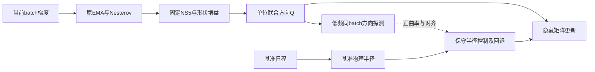

# Muon优化器近三年研究综述与APS、Lp可行性探索

## 研究结论与建议

本文将你的“moun”按知识库上下文解释为 **Muon**；APS专指现有实现的同批次两点梯度步长规则；LP解释为 **$\ell_p$ 幂方向**。这三个词对应方向构造、半径选择与非欧几何，必须先定义组合位置，才能判断是否可行、是否有独立贡献。

**建议继续探索，但先把研究问题收窄为“实际有限NS方向下，额外反馈能否改善尺度选择的可靠性与总成本”，再决定是否引入Lp或谱幂。** 原始APS接Muon可以作为消融，却不宜直接作为主方案。谱幂插值、自适应指数、Muon与低状态辅助优化器、模型式自适应步长都已有直接近邻。可检验的空间主要在反馈信息的样本外预测力、有限NS误差与尺度控制的耦合，以及同预算下能否得到可迁移收益。

本次最值得带走的判断：

1. **Muon的公开发展主要始于2024年。** 三年窗口覆盖2023年背景、2024年提出、2025年规模化及2026年理论与变体发展；不能人为编出2023年“Muon算法阶段”。
2. **Muon是一组实现选择。** 精确polar、Taylor-NS、常用NS5、不同矩阵形状增益、辅助参数路由、Nesterov形式均会改变算法对象。理论证明和实验必须逐项对齐。
3. **“Muon+自适应步长”已有明确先行工作。** 本次补充了MuonMax–Momo；它应与AdaGO、Distance-Aware Muon、ZFO一起进入步长基线。QSD新版还加入了GGN方向曲率校准，进一步压缩宽泛创新空间。
4. **坐标Lp与Schatten谱幂是两条不同路线。** 在NS后逐元素做幂，通常破坏原几何；在谱幂后再做精确polar，会抹去非零奇异值的幂幅度。有限NS时观察到的差别可能只是近似计算差别。
5. **知识库的历史APS结果提示饱和现象，但当前不能重新核验原始日志。** 保存的10月8日汇总显示两个Lp运行约99.8%的步骤贴近上限；原始`runs`目录本次未找到。因此把它作为历史证据和待复核机制，不作为本次新跑实验。
6. **最有价值的首轮结果也可能是负结果。** 如果固定上限替代APS后质量相同、成本更低，或曲率反馈不能预测独立batch及短分支收益，就应停止复杂组合，保留清楚的失效边界。

## 1. 检索协议、知识库基础与证据边界

### 1.1 范围和检索方式

截止日为北京时间 **2026年10月10日**；近三年主窗口定义为2023-10-10至2026-10-10。更早的谱下降、Powerball、Polyak、Shampoo与MEKA只用于解释起源和近邻，不计为窗口内新工作。论文按首次公开日期建立时间线，另列修订版本；入库月份、会议年份和检索日期不互相替代。

本地检索覆盖`03-notes`、`02-markdown`、`08-reading`、`08-daily`和`07-research`，关键词为Muon/moun、Schatten、APS、PowerStep和谱幂。初次Markdown扫描命中 **61个文件**：11份精读、20份解析文本、2份阅读记录、20份日报及8份研究文档。这个数字是文件命中数，包含同一论文多种资产及词义误命中，**不是61篇Muon论文，也不是61篇全文精读**。清单记录路径、命中片段和SHA256，见[本地检索清单](2026-10-10-Muon近三年综述_检索证据/local_search_manifest.json)。随后补读了当天日报的JSON候选，未将动态新增内容回填为初次快照。

网络检索沿“起源与原始实现→规模化训练→几何与收敛→自适应尺度与谱幂→失败/反证→系统与参数路由”展开。使用关键词组合发现资料，再打开作者博客、官方代码、arXiv版本页/HTML、PMLR和OPT原文定位方法与边界。综述采用目的性研究检索，**不是满足PRISMA的穷尽式系统综述**；没有可靠的全领域论文数量或引用增长统计。搜索未命中不等于不存在，读取失败也不等于论文不成立。

### 1.2 重点使用的本地材料

| 本地材料 | 本次用途 | 如何限制结论 |
|---|---|---|
| [10月8日组合审计](2026-10-08-Lp_APS与Muon结合_文献审计与具体研究方案.md)、[阅读路线](2026-10-08-Lp_APS与Muon结合_阅读路线与研究推进.md) | 恢复APS定义、现有实现、历史结果与先前近邻 | 重新查版本，不把旧报告当原论文 |
| [第2周周报](2026-09-28-第2周周报.md)、[第3周周报](2026-10-05-第3周周报.md) | 噪声、响应匹配、固定/动态幂的研究沿革 | 卡点与假设不自动成为开放问题 |
| [Lp三篇联读](2026-09-23-lp范数三篇联读_从算子界到复杂度插值.md) | 范数对偶、驻点指标与方向族 | 更早“中间指数是空白”表述须经过SMuon等查重 |
| [PowerStep精读](../03-notes/2026-09/PowerStep_Memory_Efficient_Adaptive_Optimization_via_lp_Norm_Steepest_Descent/精读.md) | 单状态坐标幂、v1证明审计 | 本地稿为v1；当前理论以v2为准 |
| [SignSGD精读](../03-notes/2026-09/When_and_Why_SignSGD_Outperforms_SGD_A_Theoretical_Study_Based_on_l1_norm_Lower_Bounds/精读.md) | 匹配几何、稀疏噪声、理想Muon下界 | 特定问题类与零NS误差，不能直接外推实际NS5 |
| [今日有限NS精读](../03-notes/2026-10/Convergence_of_Muon_with_Newton_Schulz/精读.md) | Taylor谱残差、统一谱间隙、实际系数差异 | 沿用已有证明审计，不声称本次形式化证明全文 |
| [MEKA精读](../03-notes/2026-07/Self_Tuning_Stochastic_Optimization_with_Curvature_Aware_Gradient_Filtering/精读.md) | 局部估计准确但训练未获益的负面近邻 | 2020年背景工作，不属于近三年新增 |
| APS与Muon当前源码 | 确认反馈顺序、方向、NS5和形状缩放 | 只读源码；未改实现、未启动GPU训练 |

源码入口：[APS实现](/Users/myl/Documents/graduate-thesis-code/reusable_optimizers/pisa/power_aps.py:132)、[Muon实现](/Users/myl/Documents/graduate-thesis-code/reusable_optimizers/pisa/muon.py:28)。本次已直接读取实际代码。旧知识库路径已迁移：`pisa_repro/code`与`pisa_repro/src`现在是兼容转发，真实算法位于`reusable_optimizers/pisa`。旧运行摘要路径不可用，历史数值以知识库保存的JSON为来源。

外部资料的逐篇读取层级见文末及[历史与理论检索记录](2026-10-10-Muon近三年综述_检索证据/history_sources.md)、[变体检索记录](2026-10-10-Muon近三年综述_检索证据/variant_sources.md)。正文定点核验只表示读取相关方法、定理或表图，不能称为逐篇完整证明审计。本文不从摘要给全部论文打质量总分；已有精读分数也不替代当前版本的正确性判断。

## 2. 从矩阵符号到实际Muon：核心机制

### 2.1 精确几何解释

设一个隐藏权重块为$W\in\mathbb R^{m\times n}$，其梯度或动量输入为$M$；$\langle A,B\rangle=\operatorname{tr}(A^\top B)$是Frobenius内积。若紧致SVD为$M=U\Sigma V^\top$，则在单位谱范数球内使线性下降最大的方向为

$$
D^*=\arg\max_{\|D\|_{\mathrm{op}}\le1}\langle M,D\rangle
=UV^\top,\qquad \langle M,D^*\rangle=\|M\|_*.
$$

$\|\cdot\|_{\mathrm{op}}$是最大奇异值，$\|\cdot\|_*$是核范数，即奇异值之和。秩亏时取紧致支撑上的极因子，零输入取零。这解释了“矩阵sign”：把每个非零奇异值的幅度统一为1，保留左右奇异方向。它是更新方向的变换，不是强制模型权重正交，也不等同于显式估计Hessian。[原始Muon说明](https://kellerjordan.github.io/posts/muon/)

在固定谱范数半径下，普通SGDM的强奇异方向占用更多步幅；polar把相对弱方向也纳入更新。这个几何解释只建立线性模型最优性。真实下降仍取决于曲率、噪声、动量滞后和学习率；“弱方向被放大”本身不能证明验证质量变好。

### 2.2 本地实际更新

当前代码先做EMA与同系数Nesterov插值：

$$
M_t=\rho M_{t-1}+(1-\rho)G_t,
\qquad N_t=(1-\rho)G_t+\rho M_t,
$$

其中$G_t$是当前batch梯度，$\rho$是动量系数。对每个矩阵单独调用有限NS：

$$
X_0=\frac{N_t}{\|N_t\|_F+\epsilon_{\rm NS}},\qquad
X_{j+1}=aX_j+b(X_jX_j^\top)X_j+c(X_jX_j^\top)^2X_j.
$$

代码采用$(a,b,c)=(3.4445,-4.7750,2.0315)$、通常$J=5$；CUDA路径用bfloat16进行矩阵操作，必要时转置以减小Gram维度。随后

$$
D_{t,b}=s_bX_{J,b},\qquad
s_b=\sqrt{\max(1,\mathrm{rows}_b/\mathrm{cols}_b)},
\qquad W_{t+1,b}=(1-\eta_t\lambda)W_{t,b}-\eta_tD_{t,b}.
$$

其余参数通过辅助Adam路径更新，使用独立学习率。矩阵路由、共享embedding/head处理和衰减的差别，会改变整个训练系统，不能只把优化器名字写成“Muon”便认为对照一致。[本地实现](/Users/myl/Documents/graduate-thesis-code/reusable_optimizers/pisa/muon.py:53)

### 2.3 有限NS不是精确polar

对输入奇异值$s$，一次常用五次映射为$f(s)=as+bs^3+cs^5$。有限迭代保留奇异向量，但输出奇异值未必等于1；$f(1)=0.701$，所以这套系数的精确polar并不是固定点。它刻意兼顾早期小奇异值增长和有限计算代价，不能用“迭代充分后必然越来越精确”描述。

理论中常见Taylor五次系数$(1.875,-1.25,0.375)$和上述实用系数具有相同多项式结构，却有不同谱递推。比较NS3/NS5/NS10时应测下降对齐和训练成本，不能预设更多步必然更好。[今日精读的系数审计](../03-notes/2026-10/Convergence_of_Muon_with_Newton_Schulz/精读.md)

工程上每块NS工作量约与$Jmn\min(m,n)$成正比；梯度反传通常仍是主要成本，但小batch、窄网络、跨卡聚合、矩阵分片和高维方阵会改变占比。把动量状态减半与把整个训练时间减半混在一起，会严重夸大收益。

## 3. 近三年的发展脉络

时间线与关键基础工作在第12节来源表中核验；这里按研究问题组织，而非用论文数量推断趋势。

| 阶段 | 主要问题 | 实质变化 | 对当前课题的影响 |
|---|---|---|---|
| 2023年至2024年早期：背景 | Transformer为何难由普通SGD训练？坐标sign、矩阵预条件与非欧范数各控制什么？ | 符号下降、Shampoo/SOAP及谱下降提供前置工具 | Lp/sign或低状态本身并非Muon之后才出现 |
| 2024年：Muon提出与speedrun | 高效把动量矩阵转成近似polar方向 | NS多项式、低精度矩阵乘法与动量结合，使矩阵几何进入训练配方 | 首先对齐原实现，不用SVD替身解释全部实践 |
| 2025年：规模化与统一解释 | 如何处理宽高矩阵、I/O参数、并行通信与超参迁移？ | Moonshot规模化；LMO/层级范数框架；更高效polar计算；自适应尺度与预条件变体 | shape gain、路由、步长和系统成本必须同时报告 |
| 2026年上半年：有限计算与自适应几何 | 近似误差如何进入收敛？谱平坦是否必要？能否在线选几何？ | Taylor-NS理论、Schatten插值、谱幂日程、随机/反向谱对照；Momo及距离/历史范数尺度控制 | “换成谱幂”“自动选p”与“Muon+选步”都需要强近邻 |
| 2026年下半年：噪声、曲率与结构化适配 | 后期正交化是否有残差噪声？如何分配bulk、方向曲率、行列/I/O几何？ | 噪声响应分析、QSD、DGA/MeqMuon/MuonIO、两类探测选步 | 应围绕可测反馈→独立下降→总成本收益建立证据链 |

**判断：** 研究对象已经从“有无正交化”扩展成一组相互耦合的设计轴：时间记忆、块内几何、跨块尺度、训练终点/平均化和实现表示。这里的阶段划分是对已核验工作内容的综合，不是经可比年度样本统计得到的热度结论。

### 3.1 可追溯的关键节点

- **2024-05至09：前置几何与计算工具。** Modular Norm将架构匹配范数与尺度迁移联系起来；9月的SOAP在Shampoo特征基中运行Adam；《Old Optimizer, New Norm》阐明关掉历史统计后的范数下降联系。这些先行工具解释Muon的来源，但完整Shampoo仍有历史累积，不能与实际Muon画等号。[Modular Norm](https://arxiv.org/abs/2405.14813)、[SOAP](https://arxiv.org/html/2409.11321v1)、[Anthology](https://arxiv.org/abs/2409.20325)
- **2024-10至12：公开规则与命名。** Jordan博客回溯首次公开更新规则为10月4日、speedrun切换为10月15日；博客本身发表于12月8日。当前博客还包含2025年追加段落，所以这些日期应分别引用，不能说全部内容在2024年已存在。[作者博客](https://kellerjordan.github.io/posts/muon/)
- **2025-02至05：从speedrun进入预训练。** Moonshot加入解耦衰减和更新RMS形状校正，发布Moonlight工程与训练结果；Essential AI独立研究大batch下的计算量—时间前沿。两项工作构成实际预训练可用性的主要证据，但都包含参数路由和完整配方。[Moonshot v1](https://arxiv.org/html/2502.16982v1)、[Essential AI v1](https://arxiv.org/html/2505.02222v1)
- **2025-05至10：几何、理论与尺度开始分化。** Polar Express优化有限多项式计算，PolarGrad给统一预条件视角；Shen等解释几何相关理论优势，Chen等研究衰减与谱约束；AdaMuon/AdaGO和MuonMax–Momo分别转向矩适配、低成本标量和损失模型尺度。后者首发2025-10-10，正式ICML记录在2026年。[Polar Express](https://arxiv.org/abs/2505.16932)、[PolarGrad v1](https://arxiv.org/html/2505.21799v1)、[MuonMax–Momo正式记录](https://proceedings.mlr.press/v306/crawshaw26a.html)
- **2026-01至06：实际NS、受控对照与谱族。** Kim–Oh研究有限Taylor-NS；Clarifying Shampoo补充公平调参反证；PowerStep、Freon、DynMuon、Distance-Aware、SMuon、AMUSE和Muon$^p$在5—6月密集出现。本次检索可说明这些设计轴已有覆盖，不能由定向样本推断全领域发文增长率。[有限NS](https://arxiv.org/html/2601.19156v1)、[Clarifying Shampoo](https://arxiv.org/html/2602.09314v1)
- **2026-07至10月截止：适配位置与反馈信息。** Sign组合、MALT、SAMuon、QSD、噪声分析、MeqMuon与Practical Muon把问题推进到组合顺序、谱bulk、真实有限映射、方向曲率及噪声；10月的ZFO、MuonIO、ORCA、DGA继续区分选步、I/O几何和权重正则。多数是新预印本，近期与新颖不等于结论稳固。[QSD v2](https://arxiv.org/html/2609.07597v2)、[Practical Muon](https://arxiv.org/html/2609.39595v1)

## 4. 研究问题地图与直接近邻

### 4.1 谱几何：必须把幂指数的定义统一

坐标Lp更新可写作

$$
\Phi_\alpha(m)_i=\operatorname{sign}(m_i)|m_i|^\alpha,
\qquad \alpha=\frac1{p-1},\quad p\in[2,\infty].
$$

这是未归一化方向。若要求严格单位Lp最速方向，需除以$\|m\|_q^{q-1}$，其中$q=p/(p-1)$且$q-1=\alpha$。因此从“范数约束”推导到代码时，归一化系数是否吸收入学习率必须写清。

矩阵Schatten-p几何则把幂施加在奇异值上：

$$
\Psi_\alpha(M)=U\operatorname{diag}(\sigma_i^\alpha)V^\top.
$$

同样可再按对应对偶范数归一化。$\alpha=1$给原矩阵幅度，$\alpha\to0$给支撑上的polar。不同论文可能把$p$直接定义为谱幂，而不是Schatten范数指数；阅读时先转换成$\alpha$，不要按同一个字母比较端点。

| 近邻 | 已有内容与证据位置 | 尚不能从它推出什么 |
|---|---|---|
| [SMuon](https://arxiv.org/html/2605.19781v1) | 层级Schatten几何；以梯度/激活随机特征代理选几何；附录A.2.5推导代理步长，B记录直接使用后尖峰 | 代理最优几何或步长不等于真实网络、多步及样本外最优 |
| [DynMuon](https://arxiv.org/html/2605.17109v3) | 随训练阶段改变谱幂，讨论谱曲率/噪声；§2–4 | 单靠“指数随时间变化”无法形成新贡献 |
| [Muon$^p$](https://arxiv.org/html/2606.13867v1) | 谱幂的高效逼近与后期切换；方法和图3/5 | 幂改变同时改变尺度，须匹配半径和学习率搜索 |
| [Freon/Kaon](https://arxiv.org/html/2605.11181v1) | 随机/反向谱实验；附录H.3的逐batch贪心选指数失败 | 谱平坦不是已建立的唯一因果机制；局部贪心控制有失败先例 |
| [PowerStep v2](https://arxiv.org/html/2605.10335v2) | 一状态动量后坐标幂；§5.6已有Muon隐藏矩阵+PowerStep辅助参数 | 该混合仅支持兼容性，验证协议差异阻止严谨归因 |
| [Stacey](https://arxiv.org/abs/2506.06606v1) | 更早的加速Lp最速下降；本次摘要/题录级 | 坐标Lp已有相关理论，但不能直接覆盖本方案的有限NS和APS |

### 4.2 尺度与自适应：本次查重重点

| 近邻 | 用什么信息选尺度？ | 与两点APS/割线方案的关键差别 |
|---|---|---|
| [AdaGO，OPT2025](https://www.opt-ml.org/papers/2025/paper99.pdf) | 当前/累计梯度范数；标量AdaGrad式历史量 | 保持正交更新，不需第二梯度；是反馈费用的低成本对照 |
| [MuonMax–Momo](https://arxiv.org/html/2510.09827v1) | 截断的历史线性模型、损失下界、动量对偶范数；§3–5与附录B | 不是原APS公式；已覆盖模型式自适应半径和滞后统计 |
| [Distance-Aware Muon](https://arxiv.org/html/2605.18999v1) | 轨迹半径、动量下降证书、majorization尺度搜索 | 不应再宣称方向与距离分离是首次；其假设和随机训练需区分 |
| [ZFO](https://arxiv.org/html/2610.02190v1) | 固定一阶方向，用两次额外前向拟合一维模型 | 梯度差反馈必须证明比loss探测有额外信息，且核算预训练成本 |
| [QSD v2](https://arxiv.org/html/2609.07597v2) | K-FAC定义的PSD二次谱模型；§3.3有GGN方向曲率尺度校准 | 会改变谱幅度和子空间；曲率来源不同，但“方向曲率选尺度”已有近邻 |
| [MALT/MALTER](https://arxiv.org/abs/2608.05088v1)、[DeVA](https://arxiv.org/abs/2602.06880v2) | 双侧预条件/方差适配及标量尺度控制 | 更丰富状态、不同空间中的尺度统计；不能用宽泛“曲率/噪声感知”区分 |

**本次新增的约束：** MuonMax–Momo在PMLR有ICML2026正式记录，但预印本首发为2025-10-10。原文§5及附录D表4表明，宽学习率区间鲁棒与最佳调参点更低是不同目标：124M、FineWeb1B、三种子最佳调参结果（mean±std）中，MuonAdam–Momo为$3.5546\pm0.0004$，MuonAdam为$3.5592\pm0.0014$，MuonMax–Momo为$3.5779\pm0.0007$。所以不能把“鲁棒”改写为每个已调配方都更好；你的方案也应分别检验最佳质量、失稳边界和调参成本。[原文表4](https://arxiv.org/html/2510.09827v1)

**QSD v2为什么尤其直接？** 从零初始化、只做一次Frank–Wolfe迭代时，第一个线性原子就是Muon方向，随后已沿该射线做截断二次线搜索；因此连“固定Muon方向、用方向曲率缩步”也不能按宽泛表述认定为空白。新版§3.3进一步在已接受层方向上，用logits前向差分近似$Jd$，再以softmax损失Hessian构造GGN曲率、校准K-FAC尺度。它用逐层额外前向，**无需额外反传**；124M每192步、350M每384步校准，并采用小样本、裁剪、EMA和FP32。理论的内求解器进展仍针对PSD二次代理。[QSD §2—3.3及附录I/J/K](https://arxiv.org/html/2609.07597v2)

应分别比较三种对象：梯度割线近似真实样本Hessian的一段平均方向曲率，可以为负；logits-GGN为PSD且不含模型二阶导项；SMuon随机特征的曲率来自简化局部代理。你的第二梯度是否含有前向GGN没有的信息，是可测的问题；其费用也高于仅做前向。不能只给三个量都命名为“曲率”就认为方法相同或更好。

### 4.3 预条件、参数路由与系统

这组工作提醒我们：在同一NS方向后做标量控制，不代表已经覆盖全部Muon缺点；反过来，整模型收益也可能主要来自辅助参数。

| 方向 | 代表工作 | 对实验设计的要求 |
|---|---|---|
| 正交化后或前的适配 | [AdaMuon v3](https://arxiv.org/html/2507.11005v3)、[DGA-Muon v2](https://arxiv.org/html/2610.06578v2) | AdaMuon使用完整二阶矩；DGA用原始梯度行/列统计。比较状态、统计来源与方向改变 |
| 矩阵均衡与I/O几何 | [MeqMuon](https://arxiv.org/html/2609.35701v1)、[MuonIO](https://arxiv.org/abs/2610.02705v1) | 隐藏矩阵和embedding/head分别归因，保持共享权重只更新一次 |
| 谱bulk与二次模型 | [SAMuon](https://arxiv.org/abs/2608.25990)、QSD | 同样谱范数球不等于同样方向；不能把内求解器速率当训练外循环速率 |
| 权重正则 | [ORCA](https://arxiv.org/abs/2610.06116v1) | 早期权重软正交惩罚，不等同于对更新谱做幂；首版不与新选步同时增加 |
| sign与通信压缩 | [SignMuon/MuonSign](https://arxiv.org/abs/2607.29674v1) | 摘要已报告组合顺序导致上升反例；理论可收敛方案与实证最佳次序不同。不能机械叠加非线性 |
| 任意终点训练 | [AMUSE v2](https://arxiv.org/abs/2605.22432v2)、SF-NorMuon | 平均化及梯度评估点改变状态与轨迹；“无日程”不等于没有超参数或新增状态 |

MuonIO、MeqMuon和SAMuon本次仅重新核验题录/摘要，方法细节参照10月8日已有正文审计；不把它们计为本次重读全文。SF-NorMuon已核验v2摘要，仍不据摘要补写定理。Sign压缩与AMUSE仅完成摘要/题录核验。

## 5. 理论已经解释到哪一步？

### 5.1 比较理论之前先对齐口径

至少要对齐四项：驻点度量是$\|\nabla F\|_F$、其平方、核范数还是块对偶范数；光滑性在哪组原/对偶范数下成立；噪声在变换前还是后有界；oracle是否包含额外反传、SVD或曲率调用。

例如相同函数$f(W)=\|W\|_F^2/2$的Frobenius光滑常数为1，而算子→核范数梯度Lipschitz常数为$r=\min(m,n)$。因此某个界“没有显式秩”不意味着在模型放大后光滑常数、噪声或块数也不变。$O(T^{-1/4})$平均梯度范数与$O(T^{-1/2})$平方梯度也不能只比指数而不检查目标量。[今日精读的范数换算](../03-notes/2026-10/Convergence_of_Muon_with_Newton_Schulz/精读.md)

### 5.2 最相关的理论对象

| 结果家族 | 被分析的算法与保证 | 重要边界 | 对Muon+APS+Lp的作用 |
|---|---|---|---|
| LMO/非欧最速下降 | Scion等把层级范数、方向和下降界联结 | 几何相关常数；常见理论用精确LMO | 提供产品范数及原/对偶范数的统一语言 |
| 精确polar分析 | 谱方向、噪声、动量和核/Frobenius驻点 | 理想化SVD；不含有限精度与全部路由 | 适合解释机制，不替代现有代码 |
| [Shen等的几何收敛分析](https://arxiv.org/html/2505.23737v1) | Frobenius与谱光滑性下分别比较Muon和(S)GD | 优势依赖低秩/块结构及几何常数；不是对AdamW的一般比较 | 约束“秩无关”“普遍更快”的说法 |
| [Chen等的谱约束视角](https://arxiv.org/html/2506.15054v1) | 精确matrix sign、隐式衰减、Lyapunov/KKT | 实际显式衰减和有限NS不同；形状缩放改变约束尺度 | 联合改变半径与衰减时，必须重审权重尺度 |
| [Kim–Oh有限Taylor-NS](https://arxiv.org/html/2601.19156v1) | 谱残差进入收敛常数；随NS深度改善近似 | Taylor家族；统一谱误差条件及实践系数的差距 | 分析近似方向质量，但不能为常用NS5+APS直接背书 |
| [Practical Muon](https://arxiv.org/html/2609.39595v1) | 层级有限NS+Nesterov，平均Frobenius驻点；§3.2 | 收敛日程与总时域耦合；精确算术；形状增益、epsilon有单独边界 | 与当前实现更近，可从对齐/能量界起步 |
| SignSGD/理想矩阵sign下界 | 特定噪声与范数几何中的匹配复杂度 | 不能从指定SGD下界推出优于所有优化器；矩阵版假设零NS误差 | 可解释噪声/几何匹配，不能证明最优中间谱幂 |
| [PowerStep v2](https://arxiv.org/html/2605.10335v2) | 精确无正则坐标幂更新的有限时域界 | 带噪声残差、排除纯sign端点；不覆盖任意cosine和clipping | 修正旧v1结论；不要把它与Muon定理拼接 |

对Kim–Oh，知识库精读指出“每步最小正奇异值非零”并不足以推出跨轨迹统一谱间隙；最坏误差常数可能随时域或样本路径变化。这是已有审计的条件性结论，尚不是完整Muon轨迹反例。常用NS5系数也未被其Taylor单调性论证覆盖。应引用该笔记的证明位置和条件，避免只转述摘要。

对Practical Muon，本次点读§3、§4.3。其有限映射分析用$\phi_J(s)/s$控制对齐与能量，而非要求每个输出奇异值都接近1；这对研究实际有限NS更有用。但衰减率采用时域相关学习率/动量，固定数值0.95加常规scheduler不能自动继承。固定epsilon残差、维度相关增益、BF16舍入、辅助Adam与解耦衰减也需另处理。[§3.2、Remark 4.5](https://arxiv.org/html/2609.39595v1)

### 5.3 本课题更适合的理论起点

先固定实际方向$Q$，在确定性$L$-smooth目标上证明

$$
F(W-rQ)\le F(W)-r\langle\nabla F(W),Q\rangle+rac{Lr^2}{2},
\qquad \|Q\|_F=1.
$$

若能得到真实正对齐和覆盖更新线段的可信曲率上界，就能控制下降半径。实际batch梯度只是代理；$Q$与梯度来自同一batch时，不能凭无偏性把$\mathbb E\langle G,Q(G)\rangle$换成$\mathbb E\langle\nabla F,Q(G)\rangle$。割线平均曲率也不是整条更新线段的上界。先处理误差、缓存漂移与调用成本，比承诺一般随机非凸“最优速率”更可信。

## 6. 实证证据、冲突与成本口径

### 6.1 要问“在哪种预算下好”

Muon有规模化训练证据，但某论文在固定tokens更低loss，不必然意味着固定GPU小时更好；作者报告的FLOPs减少也不能直接换成硬件上的同倍墙钟加速。speedrun通常是整套配方迭代，模型、batch、调度和编译也会更新；不能把全部纪录进步归因于优化器。

Shampoo/SOAP等有历史曲率或基变换状态，而Muon主要对当前动量作谱变换。不同batch、训练长度和数据/参数比可能改变排序。首轮必须有经过公平调参的Muon和AdamW；若要声称“最佳训练效率”，还应选择一个当前可运行的矩阵强基线，而不是只胜过旧Adam配置。

**两份主要正面证据有不同作用。** Moonshot v1采用$0.2\sqrt{\max(m,n)}$形状校正与解耦衰减，在399M—1.5B非embedding参数的dense Llama scaling中报告：匹配AdamW损失约需52%的训练FLOPs。Moonlight另证明约16B总参数、3B激活的MoE配方可以训练5.7T tokens。这支持该配方的规模化可用性；52%是该设置的拟合结果，MoE还涉及数据与架构，不是通用墙钟倍率。[§2.2/3.2、表2/3及附录](https://arxiv.org/html/2502.16982v1)

Essential AI v1在100M—4B、DCLM文本/Stack V2 Python与TPU v5p上研究Muon；500M的batch覆盖128K—16M tokens，并比较等损失的计算量—时间Pareto前沿，支持Muon在大batch下保持更好数据效率。其muP迁移研究也比单模型speedrun更接近后续迁移问题。但文中的fresh-batch training loss是泛化代理，不能当独立held-out验证；4B批量实验的50B tokens低于标称Chinchilla预算。[§2—3、附录B/G](https://arxiv.org/html/2505.02222v1)

**直接反面证据必须同时保留。** Clarifying Shampoo v1在同一PyTorch Distributed Shampoo路径、C4 dense Llama 320M/1.5B上调参，最佳配置重跑10种子。表4的320M、1×Chinchilla、batch=64设置中，Shampoo$^{1/2}$困惑度为$25.31\pm0.08$，NS Muon为$26.31\pm0.14$；原文误差为mean±2σ。epsilon调整可改变排序。这足以否定“NS Muon必然在所有合理配置下超过Shampoo”，但还不能推出Shampoo墙钟更快；本文未全面调衰减，数据与模型也有限。[§2、表4、附录B.1](https://arxiv.org/html/2602.09314v1)

外部任务的摘要级受控结果提供外推警戒：矩阵分解研究未见Muon稳定超越仔细调参AdamW；diffusion benchmark中的赢家随目标formulation改变。这些结论不否定LM训练证据，只要求本课题明确目标、预算与对照。[矩阵分解v2](https://arxiv.org/abs/2607.13246)、[Diffusion benchmark](https://arxiv.org/abs/2609.23055)

### 6.2 四类容易被误读的冲突

| 表面冲突 | 实际可调节变量 | 最小判别 |
|---|---|---|
| Muon规模化有效，但谱平坦不必要 | 子空间、幅度分布、步长与数据/模型规模 | 同一checkpoint匹配半径与LR搜索，比较不同谱形 |
| 一些谱幂工作后期更接近sign，另一些保留更多幅值 | 指数定义、近似算法、后期日程和有效尺度 | 统一$\alpha$定义，双向时间策略均作基线 |
| 理论有收敛，局部噪声仍有额外损失地板 | 全局平均驻点与近最优稳态是不同命题 | 同响应、同曲率二次问题，加真实冻结梯度与训练分支 |
| 自适应降低调参敏感度，却未超过最佳手调质量 | 鲁棒性、最好点、试验总预算是不同目标 | 同预算LR网格，报告最好、平均、失败比例及选参总成本 |

[Muon噪声论文](https://arxiv.org/html/2609.32861v1)在Gaussian模型下将平均响应与非线性残差分开，冻结Transformer梯度也测到残差；§7–8明确没有完整切换优化器的训练实验。因此“后期改线性更新”目前是值得测试的路线，不能当作已经在大模型上成立的结论。

训练终点也会改变评价。AMUSE通过梯度评估位置与平均化处理稳定性，摘要报告性能—迭代前沿改善；SF-NorMuon v2在125M/772M、1—8×Chinchilla horizons上匹配或超过AdamW，却仍比已知终点的cosine NorMuon约差0.03 nats。这是摘要级报告，不是本次复现；它提醒我们自适应步长若声称“不依赖训练长度”，至少还要对比一个具有明确终点日程的强谱优化基准。[AMUSE v2](https://arxiv.org/abs/2605.22432v2)、[SF-NorMuon v2](https://arxiv.org/abs/2605.23061)

### 6.3 状态内存与总显存

若隐藏矩阵有$P_H$参数，辅助组有$P_A$参数，均用FP32优化器状态，则典型Muon+Adam为$4P_H+8P_A$字节，AdamW为$8(P_H+P_A)$字节。这个算术省掉一个隐藏矩阵二阶状态；总显存还含主权重、梯度、激活、NS临时Gram、编译workspace及通信缓冲。

低频第二梯度若同时保存全部方向、原权重快照及第二梯度，会新增与模型同阶的临时张量。若8bit状态有利但主权重/激活占大头，端到端显存下降仍可能很小。报告应同时给持久状态、峰值分配/保留显存、NS临时峰值、每步时间和GPU小时，不能仅用“单状态”宣称方案省显存。

## 7. 你的APS与Lp目前能提供什么证据？

### 7.1 历史结果的真实边界

以下数值来自[10月8日保存的复算JSON](2026-10-08-Lp_APS与Muon结合_文献审计与具体研究方案/run_evidence.json)。各运行记录334,233,600 tokens，但不是同一配方的配对多种子实验。本次尝试重新执行旧复算脚本时，原始`runs/fig2/nano/...`路径已不存在，故**本次仅核对保存的汇总与当前代码，未重读原始日志**。

| 历史运行 | 最终验证loss ↓ | 总墙钟/小时 ↓ | 峰值显存/MiB | 可支持的判断 |
|---|---:|---:|---:|---|
| Adam | 4.060439 | 4.116 | 5398 | 旧配方参照，需公平重调 |
| Muon | 3.626272 | 4.147 | 5076 | 当前知识库中最强方向之一 |
| SOAP | 3.643856 | 4.801 | 7672 | 质量接近，但旧运行更耗时 |
| NSISA | 3.667547 | 5.972 | 5052 | 质量/成本需同时比较 |
| pbSGDM调优 | 4.458026 | 3.990 | 4926 | 此旧配置未追上Muon |
| Lp-SGDA调优 | 4.779711 | 7.140 | 4930 | 额外反馈成本明显，质量也未追上 |
| Lp-SGDMA调优 | 4.030326 | 6.543 | 5397 | 动量改善旧Lp结果，仍落后旧Muon |

这些数值支持“有必要检验APS反馈是否值得”，不支持Muon一般比AdamW低0.43，也不支持把两个方法相加会获得各自优势。日志记录tokens/s有局部计时口径，不能代替总tokens/完整墙钟。峰值测量也依赖当时硬件与训练配置。

### 7.2 代码中的APS与经典Polyak不同

先沿$D_t$进行实际更新，再对同batch重算更新后梯度$G_t^+$，最后确定**下一步**系数：

$$
A_t=|\langle G_t^+,D_t\rangle|,\qquad
\eta_{t+1}=\frac{A_t}{\|G_t^+\|_F^2+cA_t+\epsilon}.
$$

这里内积在所有参与参数上先求和再取绝对值。它不是经典$(F_t-F_*)/\|g_t\|^2$公式；代码注释使用Polyak名称也不意味着现成凸Polyak理论适用。反馈沿旧方向产生，下一步方向可能已经变化；若实际更新同时含weight decay，第二梯度还响应了这部分位移。先明确这一时间与扰动口径，再讨论方向曲率。

保存汇总中，$c=300$的Lp-SGDA与Lp-SGDMA分别有99.882%与99.765%的步骤满足$\eta_t>0.99/c$，中位数接近$1/300$。若$cA_t$主导，规则近似固定上限。少量早期非饱和步仍可能影响后续轨迹，所以必须用从相同起点、同数据和同种子的固定上限训练消融；不能只看命中率宣布反馈无用。

此外当前更新读取`step_size`而非普通scheduler改变的`lr`。绘制名义lr日程前应记录真实更新系数和参数位移RMS；工程接口修正须重新训练，不能回填或覆盖旧结果。当前APS还要求参与组共享全模型配置；若只给Muon隐藏组加独立半径而保留辅助Adam，不宜直接将现有全模型APS类套在混合组上，需要明确新的分组与反馈接口。

### 7.3 原式接Muon的齐次性风险

用固定局部量做尺度分析：若$G^+=a\bar G$且方向为$D=a^h\bar D$，忽略epsilon，内积非零时

$$
\eta_{\rm APS}(a)=\frac1{c+a^{1-h}K},
\qquad K=\frac{\|\bar G\|_F^2}{|\langle\bar G,\bar D\rangle|}.
$$

坐标幂的$h=\alpha>0$，即使系数贴上限，方向仍可能随信号变小；理想polar的$h=0$，系数和方向幅度都可能不随信号收缩。NS5在输入范数远大于epsilon时也近似零次齐次。保留固定epsilon时，极小尺度最终会由epsilon主导；这不是严格极限发散证明，而是实际训练尺度区间的待验证机制。

同一更新射线把$D$改为$kD$，原APS一般不会把系数相应除以$k$。本次标量例子$g=0.2,c=3$中，$k=0.2,1,5$产生的实际位移为0.05、0.3125、1.6447；方向射线相同，位移却差很大。Muon形状增益与APS参数$c$会因此耦合，不能直接复制Lp调得的$c$。[代数校验](2026-10-10-Muon近三年综述_检索证据/combination_checks.json)

## 8. “Muon+APS+Lp”可以指哪些组合？

| 组合位置 | 数学/工程可行性 | 已有近邻与风险 | 建议 |
|---|---|---|---|
| 隐藏矩阵Muon、辅助参数Lp，再各自选步 | 可以；需明确共享head与分组规则 | PowerStep已有Muon混合；收益可能只来自辅助组 | 作低成本工程对照，不能主张首次融合 |
| NS后逐元素幂，再APS | 可实现，但通常改变奇异向量及正交关系 | AdaMuon/sign组合相关；原几何和理论不保留 | 不作首版；必须与前置幂、直接Lp区分 |
| 坐标幂后NS，再APS | 可以；坐标变换先改变矩阵子空间 | AdaMuon v3等已用前置sign；有限NS谱误差也变化 | 有明确几何假设后再做小矩阵诊断 |
| 谱幂后精确polar，再APS | 对同支撑的正谱幂，方向会退回相同polar | 幂幅度被消掉；实际NS差别可能只来自有限近似 | 避免把它作为独立谱几何贡献 |
| 直接以Schatten谱幂作为方向，APS选半径 | 可以且定义清楚 | SMuon、DynMuon、Muon$^p$、Freon均直接相邻 | 第二阶段，先固定指数验证再自适应 |
| 保持实际NS5方向，仅校准物理半径 | 最容易隔离反馈贡献 | AdaGO/Momo/Distance-Aware/ZFO/QSD查重不可省 | 第一优先；先证明反馈可预测且成本可回收 |

### 8.1 两个简单反例/恒等式先筛掉机械组合

**逐元素幂通常不保正交。** 取三阶正交矩阵的两行
$(-1,1,2)/\sqrt6$与$(1,-1,1)/\sqrt3$，内积为0；逐元素保号平方根后内积约$-0.28439$。所以“Muon后加Lp仍保留同一正交几何”一般不成立。本次用标准Python验证，结果在[校验脚本](2026-10-10-Muon近三年综述_检索证据/combination_checks.py)。

**谱幂后精确polar消掉幅度。** 对非零奇异值、$\alpha>0$，

$$
\operatorname{polar}\big(U\Sigma^\alpha V^\top\big)=UV^\top.
$$

因此这种组合在精确意义下不改变方向；有限NS下若结果不同，应把差别拆成谱初值、近似映射、输出尺度与数值误差。最坏polar误差改善，也不保证真实batch的下降对齐改善。

### 8.2 当前较合理的研究命题

> 在相同参数路由、一个完整动量状态、固定NS5及明确探测预算下，同样本两点方向反馈是否能比固定日程、历史范数、自适应损失模型和前向探测，更可靠地控制更新半径，并在独立数据与等总时间训练中得到收益？反馈成立之后，是否仍能改善不同固定谱幂的尺度迁移？

这个命题与10月8日路线一致，但本次增加Momo和QSD新版作为更强近邻，并把原日志缺失和有限NS理论边界纳入证据限制。**潜在贡献不是三个名字相加，而是可靠反馈的定义、误差/漂移边界、费用摊销与可迁移实验。** 查重未闭合前只能称研究假设。

## 9. 首版方案：固定方向，稀疏校准半径

以下是**待实验方案，不是已有算法实证或已证明收敛定理**。保留原实现，不同时改变NS、动量、辅助组、量化和正则。

### 9.1 用物理位移消除记号混淆

将全部隐藏矩阵方向合成联合向量$D_t$，包括各块NS5与原形状增益；定义

$$
Q_t=\frac{D_t}{\|D_t\|_F},\qquad
r_t^{\rm base}=\eta_t^{\rm Muon}\|D_t\|_F.
$$

若$r_t=r_t^{\rm base}$，则$-r_tQ_t=-\eta_tD_t$精确恢复基准更新。单位联合方向只是射线重参数化，不是新优化器。零方向跳过。采用同一物理探测距离时，把$D$改写为$kD$而同时把系数改为$\eta/k$，$Q$和$r^{\rm base}$均不变。

下面是首版实验的信息流示意，虚线表示反馈；不表示已经实现或验证。

### 9.2 同batch、同随机数的方向探测

探测时只临时移动隐藏矩阵，辅助参数固定，动量不重复推进，也不混入weight decay：

$$
W^{\rm probe}=W_t-\delta_tQ_t,\qquad
G_t^{\rm probe}=\nabla F_{S_t}(W^{\rm probe}),
$$

$$
a_t=\langle G_t,Q_t\rangle,\qquad
\widehat L_t=\frac{\langle G_t-G_t^{\rm probe},Q_t\rangle}{\delta_t}.
$$

$a_t$是当批次的下降增益；$\widehat L_t$是联合方向的平均曲率，包含隐藏层间耦合。它既不是每层独立Hessian，也不是完整更新区间上界。同batch和同dropout随机数减少更换样本产生的差分噪声，仍保留采样目标偏差。先比较$\delta$和$\delta/2$，检查BF16扰动是否实际改变参数以及loss/梯度差的数值分辨率。

### 9.3 从模型建议到保守控制

局部二次模型建议$r\approx a/L$。初版采用

$$
r_t=\min\left\{r_t^{\rm base},\ \tau\frac{[a_t]_+}{\bar L_t}\right\},
\qquad W_{t+1}=W_t-r_tQ_t,
$$

其中$\bar L_t$是最近有效正曲率缓存。沿用历史方案的起始设置：每32步探测一次、$\delta=r_t^{\rm base}/2$、$\tau=1/2$，先仅允许缩步。它们是可验证的起点，不能称最优或无超参数。第一轮先测预测力，再开启控制；诊断阶段不要同时调所有阈值。

**回退要可复核：** 非有限或负曲率不取绝对值伪装成正曲率，也不覆盖缓存；超过两次预定机会无有效曲率，缓存失效。无可信缓存时回基准；若当前$a_t\le0$，用当前梯度NS方向重算对齐，仍非正则跳过隐藏矩阵更新。warmup/warmdown已包含在基准半径中，不能再乘一次。探测后必须精确恢复权重、梯度与RNG状态。

首版真实更新中的解耦衰减沿用基准日程的$\eta_t^{\rm Muon}\lambda$，仅缩放梯度位移；探测不包含衰减。若以后让衰减随反馈半径联动，应另列消融，避免把正则改变归因于反馈质量。辅助Adam照常沿原日程更新。

这个控制器只给联合方向一个标量，因此保留各块之间的相对方向与谱形。它可能被某个高曲率层限制，这时先用诊断识别瓶颈；若改为逐层控制，须重新定义联合反馈与跨层耦合，不可将联合探测的梯度差直接当作层独立曲率。

### 9.4 Lp何时再加入？

只有反馈在固定NS5下通过独立验证，再将方向换成少数固定谱幂$\alpha\in\{0,1/3,1\}$，对所有候选采用相同物理半径协议、相同调参预算和相同辅助组。先以离线SVD做机制上界诊断；训练实现须另计高效谱变换的近似与费用。分别比较固定最佳幂、简单时间切换、反馈半径，最后才考虑在线选幂。

坐标幂作为另一分支保持相同实验协议，不能以同名“p”混入谱幂结论。若目标是保持单状态，新增完整逐坐标/矩阵方差张量后应重新记账，不再沿用原约束。

## 10. 实验路线、预算与停止条件

### 10.1 分阶段验证

| 阶段 | 实验和对照 | 必须记录 | 继续/停止条件 |
|---|---|---|---|
| E0：恢复基线与APS贡献 | 找回原始日志或明确重建；固定上限vs原APS；核对实际scheduler与同batch重放 | 真正`step_size`、参数位移、饱和率、额外调用与总时间 | 固定上限等质量更快，则不保留原APS反馈为主贡献 |
| E1：冻结checkpoint预测 | 早/中/晚3点，各用独立探测与评分batch；比较割线、Momo/历史范数、前向loss模型 | 对齐、曲率符号、$\delta$敏感性、独立下降排序；50–100步分支 | 同批次相关而样本外无预测，或简单统计同样好，则停止新控制器 |
| E2：124M闭环 | 原Muon、直接APS接Muon、保守半径、低成本尺度基线、前向探测；保持辅助组相同 | 固定tokens与固定GPU小时两种结果；3配对种子 | 收益不超种子波动或被公平LR调优消除，不扩大规模 |
| E3：方向/半径可归因 | 固定NS5vs少数固定谱幂；固定日程vs反馈半径的因子实验 | 几何主效应、半径主效应、交互、探测饱和与回退 | 改善仅来自更好尺度而非Lp，则结论收窄到尺度控制 |
| E4：迁移 | 第二batch/训练长度，随后约0.5–1B，再考虑7B | 调参预算、稳定区间、质量-时间-显存Pareto | 小模型未重复或跨配方不稳，不进入7B长程 |

E1可从每checkpoint 8组独立batch开始，作为噪声与数值诊断；若方差大，先增加独立重复，再看是否值得进入控制。它是拟议预算，不是已执行实验。分支必须从同一个checkpoint和优化器状态起步，采用相同后续数据顺序与RNG；选择统计和最终比较数据分离，避免赢家偏差。

### 10.2 最小基线集与分层费用

第一轮机制对照包括：**调好的Muon、Muon+固定上限、Muon+原APS、Muon+保守割线半径、Muon+Momo或AdaGO、固定方向的前向探测**。AdamW用于完整训练质量参照；谱方向第二阶段加SMuon/固定谱幂/时间策略。Distance-Aware、QSD、DGA等至少做方法对照审计；若要主张超过当前自适应Muon方法，应实现与范围相符、可核验的强对照，而不是只放论文数字。

首轮调参保持等试验数，例如每方法最多6组短试验，选定后3个配对种子正式比较；公开全部失败试验。若有$c$、$\tau$、间隔、EMA、缓存寿命、指数与探测距离等参数，全部算搜索费用。调好的旧Muon不可对新方法只做一组默认超参，也不可给新方法更多搜索后称其更鲁棒。

### 10.3 额外反馈要满足成本阈值

设基准平均一步时间为$C_0$、一次额外探测成本为$C_p$、每$k$步探测一次，平均倍率约

$$
R_C=1+\frac{C_p}{kC_0}.
$$

达到同目标验证loss的更新数比值$R_T=T_{\rm new}/T_{\rm base}$必须满足$R_TR_C<1$，才有该理想成本模型下的墙钟优势。若每32步一次额外完整前反传、$C_p\approx C_0$，名义摊销开销约3.125%；若每步一次，名义倍率约2。但随机数重放、all-reduce、权重保存/恢复和同步会改变实际费用，必须实测。

用于训练的独特tokens与为选步重复处理的tokens分别记录；总前向/反向调用也分别记录。冻结checkpoint离线分析、LR搜索和谱诊断的GPU小时单列，不能隐去选参成本。ZFO来自微调，不把其费用直接外推预训练。

### 10.4 指标与预先写明的判据

主要指标为固定预算验证交叉熵、达到预定验证阈值的总GPU时间、失稳比例及峰值显存。机制指标包括$\langle G,D\rangle$、更新RMS、半径/基准比、正曲率比例、缓存年龄、fallback比例、APS上限命中率、方向与独立梯度夹角、NS耗时及输出谱诊断。

统计至少报告3个配对种子的每种子差值、均值与离散程度；3种子是首轮证据，不足以精确认证微小收益。预先选定主指标与阈值，避免试验后挑最好曲线。若仅提高训练loss或同batch二次拟合，而独立验证和同时间结果不改善，应按负结果结束该阶段。

## 11. 研究机会排序与下一步阅读

| 优先级 | 可证伪问题 | 最强近邻/竞争解释 | 潜在独立产出 |
|---|---|---|---|
| P0 | 原APS在当前配方中是否只是昂贵固定上限？ | 原实现与固定$1/c$、scheduler接口 | 反馈饱和边界、必要工程对照与负结果 |
| P1 | 两点方向梯度差是否比零额外梯度统计更有样本外信息？ | AdaGO、Muon–Momo、Distance-Aware、ZFO、QSD | 反馈可靠性和费用收益边界；成立后形成小控制器 |
| P2 | 有限NS的下降对齐而非最坏polar误差能否指导计算/半径？ | Taylor-NS、Practical Muon、Polar Express、inexact-LMO | 近似方向质量与尺度耦合的分析；已有框架内需查净增量 |
| P3 | 固定谱幂+尺度反馈是否超出固定最佳幂或时间策略？ | SMuon、DynMuon、Muon$^p$、Freon | 跨配方迁移证据或清晰反证，不预设自动指数 |
| P4 | 后期噪声响应匹配是否预测几何切换收益？ | Muon噪声论文、第3周方案、AMUSE | 可靠检测与端到端训练；成本和平均化竞争解释需排除 |

推荐阅读顺序：

1. **实现校准：** 原始Muon博客与当前代码，写出EMA、Nesterov、NS系数、形状增益、路由和真实位移；对照今日有限NS笔记的Taylor边界。
2. **创新边界：** SMuon§2–4及附录A.2.5/B、MuonMax–Momo§3–5及附录B；明确何者已经处理几何、尺度和滞后统计。
3. **反馈成本：** AdaGO算法1、Distance-Aware方法、ZFO§3、QSD v2§3.3；写半页信息来源、调用次数、状态量与回退比较。
4. **失败证据：** Freon附录H.3、Muon噪声论文§7–8、MEKA的实验讨论；理解单步最优为何可能无长期收益。
5. **再做理论：** Practical Muon§3.1–3.2/§4.3、Kim–Oh附录B/D/H.4；先推下降证书，再考虑随机反馈误差和缓存漂移。

本次建议产出的下一份实验记录是E0与E1，而不是一个没有可归因证据的复杂优化器。若需要开题表述，可用：

> 研究有限Newton–Schulz矩阵更新中方向质量与尺度反馈的耦合。以已有Lp–APS的步长饱和为机制入口，检验低频同样本方向梯度差的独立预测力，并在固定状态、训练时间和调参预算下，比较其与损失模型、历史范数及谱几何策略的收益和失效边界。

这段表述保留了Muon+APS+Lp的长期意图，并将当前可做的贡献限定到可核验问题。

## 12. 一手来源与版本核验索引

以下按研究用途编号，日期优先为首次公开日期。表内“所读版本”不声称全部都是截止日最新版本；最新版本与所读版本不同时明确区分。方法/表图定点表示读取相关正文，摘要级不表示已审方法或证明；“本地精读”也不表示本次重新完成全文审计。版本、作者及原文位置的扩展记录见三个检索附录。部分条目是基础或竞争优化器，并非都提出Muon新变体。

### 12.1 起源、规模化与理论

| 编号 | 工作 / 一手入口 | 首次公开或正式记录 | 所读版本与证据层级 |
|---|---|---|---|
| R01 | Large等，Scalable Optimization in the Modular Norm；[arXiv](https://arxiv.org/abs/2405.14813) | 2024-05-23 | 摘要；架构匹配范数背景 |
| R02 | Vyas等，SOAP: Improving and Stabilizing Shampoo using Adam；[v1](https://arxiv.org/html/2409.11321v1) | 2024-09-17 | 方法定点；不是直接Muon对照 |
| R03 | Bernstein/Newhouse，Old Optimizer, New Norm: An Anthology；[arXiv](https://arxiv.org/abs/2409.20325) | 2024-09-30 | 摘要与Jordan引用交叉核对 |
| R04 | Jordan，Muon: An optimizer for hidden layers in neural networks；[博客](https://kellerjordan.github.io/posts/muon/)、[官方仓库](https://github.com/KellerJordan/Muon) | 规则2024-10-04；博客2024-12-08 | 博客定点、当前README；含后续追加，仓库未锁commit |
| R05 | Li/Hong，A Note on the Convergence of Muon and Further；[版本页](https://arxiv.org/abs/2502.02900)、[已读v2](https://arxiv.org/html/2502.02900v2) | 2025-02-05 | v2引言/方法；已读v2标题未带and Further |
| R06 | Liu/Su等，Muon is Scalable for LLM Training；[v1](https://arxiv.org/html/2502.16982v1)、[Moonlight代码](https://github.com/MoonshotAI/Moonlight) | 2025-02-24 | §2.2/3.2、表2/3、附录A/B；代码README |
| R07 | Shah等，Practical Efficiency of Muon for Pretraining；[v1](https://arxiv.org/html/2505.02222v1) | 2025-05-04 | §2—3、附录B/G |
| R08 | Amsel等，Polar Express；[版本页](https://arxiv.org/abs/2505.16932) | 2025-05-22 | 当前v5修订2026-05-04；本次摘要级 |
| R09 | Lau/Long/Su，PolarGrad；[v1](https://arxiv.org/html/2505.21799v1)、[版本页](https://arxiv.org/abs/2505.21799) | 2025-05-27 | 方法/配置定点；当前v4为2026-02-05，未重审v4 |
| R10 | Shen等，On the Convergence Analysis of Muon；[v1](https://arxiv.org/html/2505.23737v1) | 2025-05-29 | Assumptions 3.1—3.3/4.5、Theorem 4.3等 |
| R11 | Pethick等，Scion / Training Deep Learning Models with Norm-Constrained LMOs；[PMLR](https://proceedings.mlr.press/v267/pethick25a.html) | ICML2025正式记录，非首次提交日期 | 正式题录/摘要；本地已有范数框架分析 |
| R12 | Chen/Li/Liu，Muon Optimizes Under Spectral Norm Constraints；[v1](https://arxiv.org/html/2506.15054v1) | 2025-06-18 | §3、5—7；精确sign与隐式衰减 |
| R13 | Crawshaw等，An Exploration of Non-Euclidean Gradient Descent: Muon and its Many Variants；[v1](https://arxiv.org/html/2510.09827v1)、[ICML2026](https://proceedings.mlr.press/v306/crawshaw26a.html) | 2025-10-10 | §3—5、附录B、表4；正式题录核验 |
| R14 | Kim/Oh，Convergence of Muon with Newton–Schulz；[v1](https://arxiv.org/html/2601.19156v1) | 2026-01-27 | 本地今日精读/证明审计；有限Taylor家族 |
| R15 | Eschenhagen等，Clarifying Shampoo；[v1](https://arxiv.org/html/2602.09314v1) | 2026-02-10 | §2、表1/4、附录B.1；10种子受控比较 |
| R16 | Peng/Wang/Yu，Convergence of Practical Muon with Finite Newton–Schulz Iterations and Nesterov Momentum；[v1](https://arxiv.org/html/2609.39595v1) | 2026-09-30 | §3、4.3定点；不是全证明复核 |

### 12.2 与APS、Lp最直接的变体

| 编号 | 工作 / 一手入口 | 首次公开 | 所读版本与证据层级 |
|---|---|---|---|
| R17 | Stacey，坐标Lp加速最速下降；[v1](https://arxiv.org/abs/2506.06606v1) | 2025-06-07 | 摘要/题录 |
| R18 | AdaMuon；[v3](https://arxiv.org/html/2507.11005v3) | 2025-07-15 | v3修订2025-12-24；§3/Alg.1 |
| R19 | AdaGO；[版本页](https://arxiv.org/abs/2509.02981)、[OPT2025论文](https://www.opt-ml.org/papers/2025/paper99.pdf) | 2025-09-03 | v2为2025-09-06；工作坊版p.3—4/Alg.1 |
| R20 | DeVA；[v2](https://arxiv.org/html/2602.06880v2) | 2026-02-06 | v2修订2026-05-26；§3/Alg.2及矩统计附录 |
| R21 | Mousse；[版本页](https://arxiv.org/abs/2603.09697) | 2026-03-10 | v2修订2026-04-01；摘要级 |
| R22 | PowerStep；[v2](https://arxiv.org/html/2605.10335v2)、[版本页](https://arxiv.org/abs/2605.10335) | 2026-05-11 | v2修订2026-09-29；§2/3/5.6；本地精读为v1 |
| R23 | Freon/Kaon；[v1](https://arxiv.org/html/2605.11181v1) | 2026-05-11 | §3.3、附录C/H.2/H.3 |
| R24 | DynMuon；[v3](https://arxiv.org/html/2605.17109v3) | 2026-05-16 | v3修订2026-06-01；方法/消融定点 |
| R25 | Distance-Aware Muon；[v1](https://arxiv.org/html/2605.18999v1) | 2026-05-18 | §2—5/Alg.1—3及条件 |
| R26 | SMuon；[v1](https://arxiv.org/html/2605.19781v1) | 2026-05-19 | §3—5、附录A.2.5/A.2.6/B |
| R27 | Muon$^p$；[v1](https://arxiv.org/html/2606.13867v1) | 2026-06-11 | §2；有理谱幂递推 |
| R28 | MALT/MALTER；[v1](https://arxiv.org/html/2608.05088v1) | 2026-08-05 | §3.5/Alg.2；HTML记号待代码对齐 |
| R29 | QSD；[v2](https://arxiv.org/html/2609.07597v2) | 2026-09-07 | v2修订2026-09-26；§2—3.3、附录E/I/J/K |
| R30 | ZFO / Trust the Direction, Search the Step；[v1](https://arxiv.org/html/2610.02190v1) | 2026-10-01 | §2/Alg.1；主要LLM微调场景 |
| R31 | DGA-Muon；[v2](https://arxiv.org/html/2610.06578v2) | 2026-10-05 | v2修订2026-10-07；§3—5 |

### 12.3 噪声、平均化、参数角色与外推检验

| 编号 | 工作 / 一手入口 | 首次公开 | 所读版本与证据层级 |
|---|---|---|---|
| R32 | AMUSE；[v2版本页](https://arxiv.org/abs/2605.22432) | 2026-05-21 | v2为2026-07-14；摘要级 |
| R33 | Anytime Training with Schedule-Free Spectral Optimization / SF-NorMuon；[版本页](https://arxiv.org/abs/2605.23061) | 2026-05-21 | v2为2026-09-25；摘要级 |
| R34 | Reassessing Muon for Matrix Factorization；[版本页](https://arxiv.org/abs/2607.13246) | 2026-07-14 | v2为2026-08-01；摘要级 |
| R35 | Sign Compression for Muon: SignMuon, MuonSign, and the Limits of Error Feedback；[v1](https://arxiv.org/abs/2607.29674v1) | 2026-07-31 | 摘要级；未自行复核其上升反例 |
| R36 | Spectral Allocation / SAMuon；[v1](https://arxiv.org/abs/2608.25990v1) | 2026-08-26 | 本次摘要/题录；方法沿用10月8日p.5—12审计 |
| R37 | Optimizers for Diffusion Models: A Controlled Benchmark；[v1](https://arxiv.org/abs/2609.23055) | 2026-09-19 | 摘要级；未提取各任务全表 |
| R38 | Xie，Muon Under Gradient Noise and the Limits of Orthogonalization Near Optima；[v1](https://arxiv.org/html/2609.32861v1) | 2026-09-26 | §7—8、冻结梯度与结论定点 |
| R39 | MeqMuon；[v1](https://arxiv.org/abs/2609.35701v1) | 2026-09-28 | 本次摘要/题录；方法沿用10月8日p.4—6审计 |
| R40 | MuonIO；[v1](https://arxiv.org/abs/2610.02705v1) | 2026-10-02 | 本次摘要/题录；方法沿用10月8日Alg.1审计 |
| R41 | ORCA；[v1](https://arxiv.org/abs/2610.06116v1) | 2026-10-05 | 本次摘要/题录；本地已有方法审计 |

上述41个编号是本报告选择的工作/来源入口，不是穷尽文献数量；R04/R06中论文、博客与代码属于同一研究链，不计为独立训练证据。正式发表状态只在读取正式页面后使用；不由arXiv作者自述推定全部会议状态。

### 12.4 未闭合候选与可复查检索记录

- [Can Muon Adapt Its Stepsize Without Knowing the Solution Distance?](https://openreview.net/forum?id=Ghfc8IRXdy)：forum/PDF/API读取失败；不能认定与Distance-Aware同一稿，也不能排除冲突。
- [Spectral Flattening Is Not Enough: When Muon Improves Learning Rates and Convergence](https://openreview.net/forum?id=PI7PN0x6oA)：来自当日日报候选，原文读取失败；不补造跨块理论公式。
- [历史/规模化/理论逐项记录](2026-10-10-Muon近三年综述_检索证据/history_sources.md)、[12组变体版本与方法记录](2026-10-10-Muon近三年综述_检索证据/variant_sources.md)、[补充来源与访问限制](2026-10-10-Muon近三年综述_检索证据/supplemental_sources.md)。

## 13. 与既有报告的关系及交付核验

本报告接续10月8日两份文件，新增三年发展视角、MuonMax–Momo直接近邻、QSD新版曲率尺度查重、今日有限NS精读与符号组合候选；补充坐标幂/谱幂组合的代数筛选，并明确旧日志本次无法复核。旧报告、精读、源码与原始资产保持原样。

本次新增[组合代数校验](2026-10-10-Muon近三年综述_检索证据/combination_checks.json)，包括逐元素幂破坏正交、谱幂后polar恒等、APS方向重标度失配及标量二次割线尺度不变。它们只验证代数关系，不构成随机收敛或LLM训练证据。

未闭合项包括：OpenReview的自适应Muon步长候选、当日日报的跨块谱平坦候选，以及部分前沿工作的源码/完整实验。论文新颖性判定前仍须补齐；目前证据足以支持开展有限、可停止的探索，尚不足以宣称组合已经优于Muon或是首次方法。

交付已检查本地链接存在、配套JSON可解析、公式与代码围栏配对，并重新执行四组代数校验；未进行GPU训练或浏览器渲染认证。实际源码路径与SHA256见[当前代码快照](2026-10-10-Muon近三年综述_检索证据/current_code_manifest.json)，文档检查结果见[交付核验](2026-10-10-Muon近三年综述_检索证据/artifact_validation.json)。
